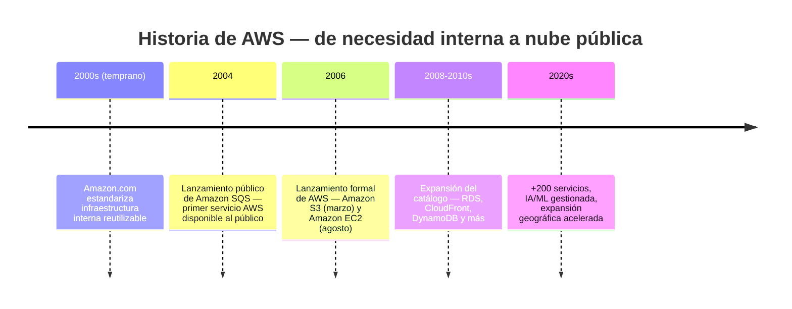
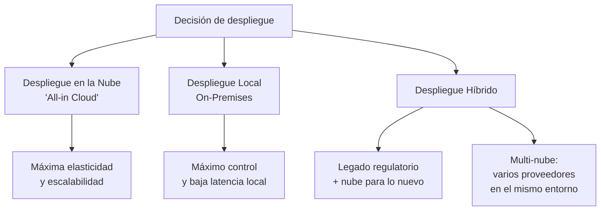
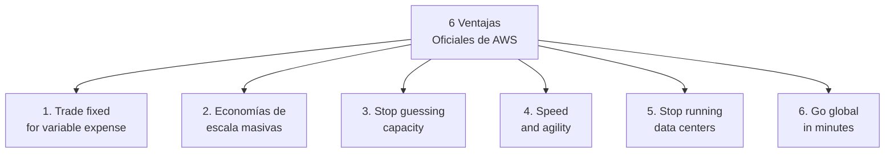
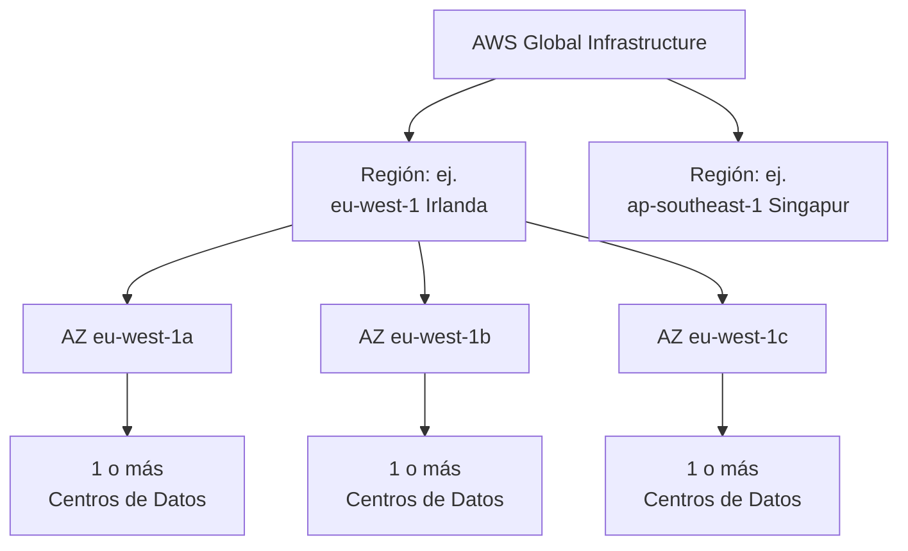
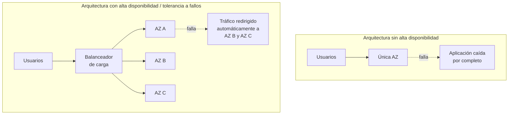
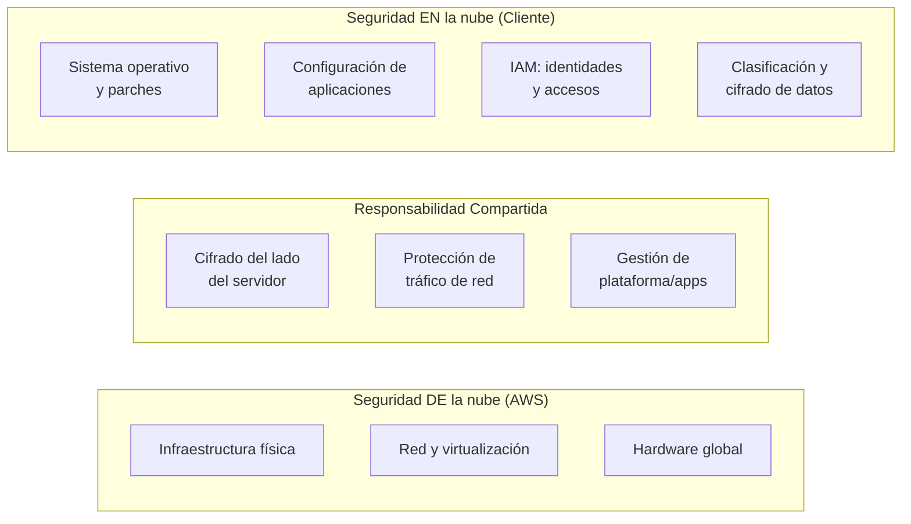
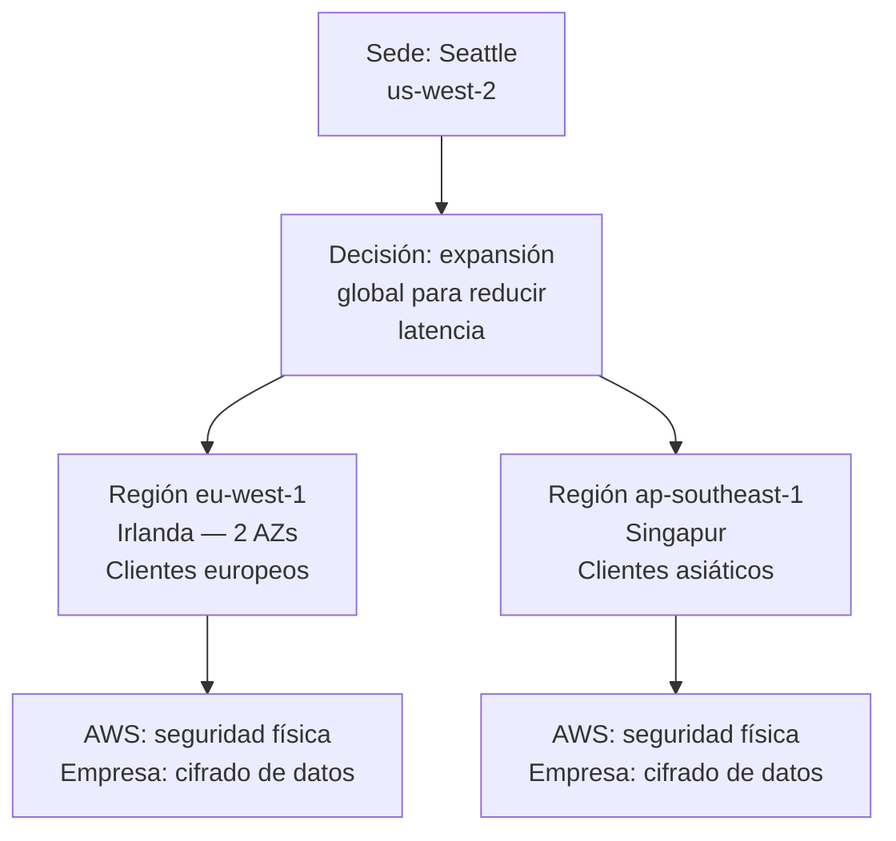
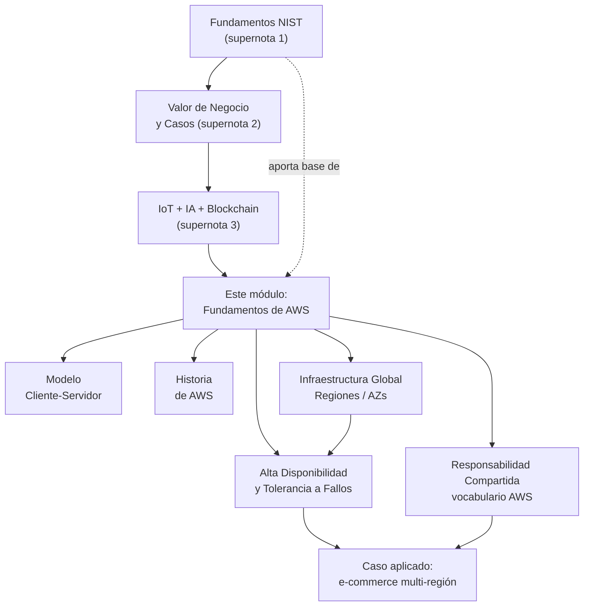

# Supernota: Fundamentos de AWS — Modelo Cliente-Servidor, Infraestructura Global y Responsabilidad Compartida

> [!abstract] Resumen rápido del módulo
> Este módulo (basado en **AWS Cloud Practitioner Essentials**) aterriza los conceptos genéricos de [[Supernota - Fundamentos de Cloud Computing|la supernota de Fundamentos de Cloud Computing]] específicamente en **AWS**: el modelo **cliente-servidor**, la historia de AWS (nacida como solución interna de Amazon.com y lanzada públicamente en 2004-2006), los **tres tipos de despliegue** que reconoce el curso (nube, on-premises, híbrido), las **seis ventajas oficiales** que AWS documenta formalmente, la **Infraestructura Global de AWS** (Regiones, Zonas de Disponibilidad, Zonas Locales, Puntos de Presencia), los conceptos de **alta disponibilidad y tolerancia a fallos**, y el **Modelo de Responsabilidad Compartida** aplicado con el vocabulario específico de AWS ("seguridad *de* la nube" vs "seguridad *en* la nube"). Cierra con un caso aplicado de una empresa de comercio electrónico que se expande a Irlanda y Singapur.

> [!note] Nivel de profundidad de esta nota y relación con notas anteriores
> Varios conceptos de este módulo (definición NIST, IaaS/PaaS/SaaS, CapEx vs OpEx, modelos de despliegue formales, Modelo de Responsabilidad Compartida genérico) **ya se cubrieron a fondo** en [[Supernota - Fundamentos de Cloud Computing]]. Siguiendo la regla de "supernota" de no repetir contenido ya dominado, aquí se **enlaza** a esas secciones y solo se retoma lo mínimo necesario para seguir el hilo — el foco de esta nota está en lo que es **específico de AWS** y no se cubrió antes: el marco oficial de las 6 ventajas (con su redacción exacta), los números concretos de la infraestructura global de AWS, la mecánica de alta disponibilidad/tolerancia a fallos, y el vocabulario particular del modelo de responsabilidad compartida de AWS.

---

## Índice de esta supernota
1. [[#1. El modelo cliente-servidor y su rol en la nube]]
2. [[#2. Historia de AWS — de necesidad interna a nube pública]]
3. [[#3. Definición de computación en la nube (repaso aplicado a AWS)]]
4. [[#4. Los tres tipos de despliegue según AWS Cloud Practitioner]]
5. [[#5. Las seis ventajas oficiales de la nube según AWS]]
6. [[#6. Infraestructura Global de AWS]]
7. [[#7. Alta disponibilidad y tolerancia a fallos]]
8. [[#8. El Modelo de Responsabilidad Compartida — vocabulario y detalle AWS]]
9. [[#9. Caso aplicado — expansión global de una empresa de e-commerce]]
10. [[#10. Conceptos complementarios]]
11. [[#11. Cómo se conecta este módulo con el resto del vault]]
12. [[#12. Preguntas para repasar]]
13. [[#13. Recursos recomendados]]
14. [[#14. Notas relacionadas del vault]]

---

## 1. El modelo cliente-servidor y su rol en la nube

### 1.1 La analogía de la cafetería (del resumen original)
El resumen usa una analogía sencilla y efectiva: un **cliente** pide un café a un **barista** (el **servidor**), que prepara y entrega la respuesta. En AWS, ese "barista" es un **servidor virtual** —una instancia de cómputo, como una instancia EC2— que atiende solicitudes de un cliente (navegador, aplicación móvil, otro servicio) a través de la red.

### 1.2 El modelo cliente-servidor con precisión técnica (contenido complementario)
El resumen se queda en la analogía; vale la pena formalizar el modelo, porque es el patrón arquitectónico subyacente a **prácticamente todo** lo que ofrece la nube:

- **Cliente**: el proceso que **inicia la solicitud** (*request*). Puede ser un navegador web, una app móvil, un script, u otro servidor actuando como cliente de un tercer servicio.
- **Servidor**: el proceso que **escucha** solicitudes en un puerto de red determinado, las procesa, y devuelve una **respuesta** (*response*).
- **Protocolo**: el "idioma" acordado para que cliente y servidor se entiendan — en la web, típicamente **HTTP/HTTPS**.

```mermaid
sequenceDiagram
    participant C as Cliente
Navegador / App
    participant S as Servidor
Instancia EC2 / API
    C->>S: Solicitud (Request)
GET /precio-cafe
    Note over S: Procesa la solicitud
(consulta datos, calcula)
    S->>C: Respuesta (Response)
200 OK + datos
```

> [!tip] Por qué este modelo es la base de la nube y no solo un detalle de redes
> Todo lo que ofrece AWS —desde una página web servida por EC2 hasta una consulta a una base de datos gestionada (RDS) o una función Lambda invocada por una API— es, en el fondo, una variación del modelo cliente-servidor. Entender este patrón es el primer escalón antes de estudiar servicios individuales de AWS, porque explica *por qué* existen conceptos como **balanceadores de carga** (distribuyen solicitudes de muchos clientes entre varios servidores) o **APIs** (contratos formales de cómo un cliente debe formular sus solicitudes a un servidor).

### 1.3 Pago por uso, llevado a la analogía de personal de una cafetería
El resumen conecta la analogía cliente-servidor con el modelo de pago por uso: así como una cafetería **paga solo por las horas que trabaja el personal** (no mantiene baristas contratados 24/7 "por si acaso" hay demanda), AWS cobra solo por los recursos de cómputo (servidores virtuales) que efectivamente están en uso.

> [!important] Conexión directa con conceptos ya vistos
> Esta analogía es, en esencia, una explicación intuitiva de dos ideas ya formalizadas en [[Supernota - Fundamentos de Cloud Computing]]: **Measured Service** (característica esencial #5 del NIST) y el cambio de **CapEx a OpEx** (sección 6 de esa nota). No se repite el desarrollo completo aquí — solo se señala la conexión.

---

## 2. Historia de AWS — de necesidad interna a nube pública

Este bloque **no estaba desarrollado** con esta profundidad en las supernotas anteriores (que cubrían la historia general de la virtualización, no la historia particular de AWS como empresa) — se desarrolla aquí a partir del resumen y se complementa con fechas y contexto adicional.

### 2.1 El origen: un problema de infraestructura interna
A principios de la década de 2000, **Amazon.com** (la tienda en línea) enfrentaba un problema de crecimiento: sus propios equipos de desarrollo perdían tiempo valioso construyendo, una y otra vez, la misma infraestructura básica (servidores, bases de datos, almacenamiento) para cada nuevo proyecto interno, en lugar de enfocarse en construir funcionalidades de negocio diferenciadas.

La solución interna fue estandarizar esa infraestructura común en un conjunto de **servicios reutilizables**, con APIs bien definidas, que cualquier equipo interno de Amazon pudiera consumir sin reinventar la rueda cada vez — el mismo principio de "no reinventar la rueda" que se vería después, ya como beneficio de negocio, en el caso de UBank (ver [[Supernota - Valor de Negocio de la Nube y Casos de Estudio]], sección 5.2).

### 2.2 La transición a servicio público
- **2004**: Amazon lanza su **primer servicio disponible públicamente**, **Amazon SQS** (*Simple Queue Service*), un servicio de colas de mensajes — mucho menos conocido que S3 o EC2, pero cronológicamente el primero.
- **2006**: se lanza formalmente **Amazon Web Services** como plataforma, con **Amazon S3** (almacenamiento de objetos) en marzo y **Amazon EC2** (cómputo virtual bajo demanda) en agosto — este es el año que, como ya se señaló en [[Supernota - Fundamentos de Cloud Computing]] (sección 4.3), se considera el nacimiento simbólico de la nube pública comercial moderna a gran escala.
- **Años siguientes (2007 en adelante)**: expansión rápida del catálogo — bases de datos gestionadas (Amazon RDS, 2009), CDN (Amazon CloudFront, 2008), y así sucesivamente, hasta el catálogo de **más de 200 servicios** que ofrece AWS actualmente.



> [!important] La lección estratégica detrás de la historia de AWS
> El origen de AWS es en sí mismo el mejor argumento a favor del beneficio de negocio "**enfoque en el negocio principal**" ya visto en [[Supernota - Valor de Negocio de la Nube y Casos de Estudio]] (sección 2.3): Amazon construyó AWS porque **su propio problema interno** —perder tiempo de ingeniería en infraestructura repetitiva en vez de en el negocio de comercio electrónico— es exactamente el mismo problema que después AWS resolvería, como producto, para millones de otras empresas.

---

## 3. Definición de computación en la nube (repaso aplicado a AWS)

El resumen de este módulo repite, con otras palabras, la definición formal ya cubierta a fondo: *"la entrega bajo demanda de recursos de TI a través de internet con un modelo de pago por uso"*.

> [!note] No se repite el desarrollo completo aquí
> Esta es exactamente la definición del **NIST SP 800-145**, ya desarrollada con sus 5 características esenciales completas en [[Supernota - Fundamentos de Cloud Computing]] (sección 1). Lo único que agrega este módulo específicamente es el **listado de tipos de recursos** que menciona el resumen: servidores, bases de datos, redes y **herramientas de inteligencia artificial** — este último es un añadido relevante, porque confirma que en el marco de AWS Cloud Practitioner, los servicios de IA/ML gestionados (ver [[Supernota - IoT, IA y Blockchain en la Nube]]) se consideran, desde la definición misma de "computación en la nube", un recurso de TI más, al mismo nivel que cómputo o almacenamiento — no una categoría aparte.

### 3.1 Ventajas y funcionamiento — lo que agrega el resumen
El resumen añade dos matices operativos sobre *cómo funciona* la entrega de estos recursos, que vale la pena precisar:

- **Centros de datos con alta seguridad y redundancia**: los recursos no viven en "la nube" en sentido abstracto — viven en **centros de datos físicos concretos**, gestionados por AWS con controles de seguridad física (ver sección 8 de esta nota, y sección 6 con el detalle de Regiones/AZs).
- **Acceso remoto sin contratos complicados**: a diferencia de la contratación tradicional de infraestructura on-premise (que típicamente involucra contratos de compra, instalación y mantenimiento a largo plazo), el acceso a recursos de AWS se gestiona vía consola web, CLI o API, sin necesidad de negociar contratos individuales por cada recurso — la manifestación práctica del **On-Demand Self-Service** (característica esencial #1 del NIST).

---

## 4. Los tres tipos de despliegue según AWS Cloud Practitioner

### 4.1 Una taxonomía distinta (y más simple) a la del NIST — aclaración importante

> [!warning] Diferencia que conviene no confundir en un examen
> [[Supernota - Fundamentos de Cloud Computing]] (sección 3) cubrió los **4 modelos de despliegue formales del NIST**: Pública, Privada, Híbrida y Comunitaria. El material de **AWS Cloud Practitioner Essentials**, en cambio, usa una taxonomía **más simple y orientada a la decisión de negocio**, con solo **3 categorías**: *Despliegue en la nube* ("all-in cloud"), *Despliegue local* (on-premises) e *Híbrido*. No son marcos contradictorios — el de AWS es una **simplificación práctica** del mismo espacio de decisión, pensada para quien recién se certifica, mientras que el del NIST es el estándar formal completo. En un examen de AWS Cloud Practitioner, usa la taxonomía de 3; si el examen es sobre la definición formal NIST, usa las 4.

### 4.2 Despliegue en la nube (Cloud Deployment / "All-in Cloud")
Migración o creación de recursos y aplicaciones **completamente en la nube**, sin infraestructura propia asociada. Aprovecha al máximo la flexibilidad y escalabilidad de la nube (equivalente, en la taxonomía NIST, a operar enteramente sobre **Nube Pública**, aunque también podría construirse sobre una Nube Privada si la organización así lo decide).

### 4.3 Despliegue local (On-Premises)
Uso de infraestructura **propia**, típicamente con **virtualización** (ver [[Supernota - Fundamentos de Cloud Computing]], sección 5) dentro del propio centro de datos de la organización.

- **Ventajas que señala el resumen**: recursos dedicados y **baja latencia** (no hay salto de red hacia un proveedor externo).
- **Limitación que señala el resumen**: no se obtienen "muchos beneficios de la nube" — es decir, se pierde la elasticidad rápida, el pago por uso, y el acceso a economías de escala globales (ver sección 5 de esta nota).

> [!tip] Matiz técnico: on-premises con virtualización NO es lo mismo que "nube privada"
> Un dato que suele confundirse: tener **virtualización on-premises** (ej. un clúster de VMware en el centro de datos propio) no convierte automáticamente esa infraestructura en una "nube privada" en el sentido formal NIST — para calificar como nube (privada o de cualquier tipo), también debe cumplir las 5 características esenciales completas (autoservicio bajo demanda, elasticidad rápida, medición del servicio, etc., ver [[Supernota - Fundamentos de Cloud Computing]], sección 1). Mucha infraestructura on-premises virtualizada es solo eso: **virtualización tradicional**, sin las capacidades de autoservicio y elasticidad automatizada que definen a la nube.

### 4.4 Despliegue híbrido
Combina recursos en la nube y locales. El resumen da dos motivaciones concretas para elegir este modelo:

- **Aplicaciones heredadas (*legacy*)** que, por razones regulatorias o de dependencias técnicas complejas, no pueden (o no conviene) migrarse por completo — equivalente a la estrategia **Retain** de las 6 R's de migración (ver [[Supernota - Fundamentos de Cloud Computing]], sección 7.2).
- **Mantenimiento**: sistemas que aún requieren gestión local por razones operativas específicas del negocio.

El resumen también menciona el concepto de **multi-nube** (*multi-cloud*) como parte de este bloque, integrando servicios de **distintos proveedores** dentro de un entorno híbrido — ya definido formalmente en [[Supernota - Fundamentos de Cloud Computing]] (sección 3, nota al final).



---

## 5. Las seis ventajas oficiales de la nube según AWS

Este es el bloque más citado, repetido y examinado del curso Cloud Practitioner Essentials (aparece en **cuatro de los resúmenes** proporcionados, con distintas paráfrasis) — por eso merece la versión **oficial y textual** del whitepaper de AWS, no solo la paráfrasis del resumen.

> [!important] Fuente verificada
> AWS publica este marco de forma oficial en su whitepaper *"Overview of Amazon Web Services"*. A continuación, la redacción oficial en inglés (la que aparece literalmente en el examen de certificación), seguida de su traducción y desarrollo en español.

### 5.1 Las seis ventajas, en su redacción oficial

| # | Nombre oficial (inglés) | Traducción | Idea central |
|---|---|---|---|
| 1 | **Trade fixed expense for variable expense** | Cambiar gasto fijo por gasto variable | En vez de invertir fuertemente en centros de datos y servidores antes de saber cómo se van a usar, se paga solo cuando se consumen recursos de cómputo, y solo por lo que se consume |
| 2 | **Benefit from massive economies of scale** | Beneficiarse de economías de escala masivas | Al agregar el uso de cientos de miles de clientes, AWS logra economías de escala mayores a las que cualquier empresa individual podría alcanzar por su cuenta, lo que se traduce en precios más bajos de pago por uso |
| 3 | **Stop guessing capacity** | Dejar de adivinar la capacidad necesaria | Elimina el riesgo de sobre-aprovisionar (recursos caros ociosos) o sub-aprovisionar (capacidad insuficiente) — se accede a tanta o tan poca capacidad como se necesite, escalando en minutos |
| 4 | **Increase speed and agility** | Aumentar velocidad y agilidad | Los recursos de TI están a un clic de distancia, reduciendo el tiempo de disponibilidad de semanas a minutos — lo que dispara la agilidad de la organización para experimentar |
| 5 | **Stop spending money running and maintaining data centers** | Dejar de gastar en operar y mantener centros de datos | Permite enfocarse en proyectos que diferencian al negocio, no en la infraestructura — delegar el trabajo pesado de instalar, apilar y energizar servidores |
| 6 | **Go global in minutes** | Expandirse globalmente en minutos | Desplegar una aplicación en múltiples regiones del mundo con solo unos clics, ofreciendo menor latencia y mejor experiencia a los clientes finales, a costo mínimo |

### 5.2 Cómo se relacionan estas 6 ventajas con conceptos ya vistos (mapa de equivalencias)

| Ventaja oficial AWS | Concepto NIST/genérico equivalente (ya visto) | Nota |
|---|---|---|
| #1 Trade fixed for variable expense | **CapEx → OpEx** ([[Supernota - Fundamentos de Cloud Computing]], sección 6) | Es la misma idea financiera, con el nombre oficial que usa AWS en su propio material |
| #2 Economías de escala masivas | No tenía nombre formal propio en la nota anterior | **Aporte nuevo de este módulo**: cuantifica *por qué* el pago por uso es más barato en la nube que on-premise — no es solo "flexibilidad", es que AWS reparte costos fijos entre cientos de miles de clientes |
| #3 Stop guessing capacity | **Rapid Elasticity** (característica esencial NIST #4) | Es la manifestación práctica, en lenguaje de negocio, de la elasticidad técnica |
| #4 Increase speed and agility | Conecta con **Time to Value** ([[Supernota - Valor de Negocio de la Nube y Casos de Estudio]], sección 6.1) | Mismo concepto: comprimir el tiempo entre decisión y valor obtenido |
| #5 Stop spending on data centers | **Core Business Focus** ([[Supernota - Valor de Negocio de la Nube y Casos de Estudio]], sección 2.3) | Prácticamente la misma idea, con foco específico en la carga operativa de "hardware físico" |
| #6 Go global in minutes | Conecta con **Regiones y Availability Zones** ([[Supernota - Fundamentos de Cloud Computing]], sección 12.2) | Este módulo (sección 6 de esta nota) es donde se desarrolla técnicamente *cómo* AWS hace posible esto |

> [!tip] Por qué memorizar el nombre oficial en inglés, no solo la idea
> El examen AWS Certified Cloud Practitioner (CLF-C02) suele presentar preguntas donde hay que **identificar cuál de las 6 ventajas** describe un escenario dado, usando terminología cercana a la oficial. Vale la pena memorizar los 6 nombres cortos en inglés (Trade expense, Economies of scale, Stop guessing capacity, Speed and agility, Stop running data centers, Go global) como una lista, no solo entender el concepto en abstracto.



---

## 6. Infraestructura Global de AWS

Este es el bloque con **más contenido nuevo** respecto a las supernotas anteriores — la nota de Fundamentos solo mencionó Región/AZ de pasada (sección 12.2, como "concepto complementario" agregado por Claude); aquí se desarrolla a fondo porque es contenido central del resumen original de este módulo, con cifras verificadas y actualizadas.

### 6.1 Por qué existe la infraestructura distribuida — el problema que resuelve
El resumen lo plantea con claridad: **tener un solo centro de datos es riesgoso** — si ese centro de datos falla (corte de energía, falla de red, desastre natural), **todas** las aplicaciones que dependen de él se caen simultáneamente. La solución de AWS es distribuir físicamente su infraestructura en múltiples ubicaciones independientes, de forma que el fallo de una no arrastre a las demás.

### 6.2 La jerarquía completa: Región → Zona de Disponibilidad → Centro de Datos


**Región (Region)**: una ubicación geográfica física en el mundo (ej. "Irlanda", "Singapur", "Norte de Virginia") donde AWS agrupa múltiples centros de datos. Cada Región es un entorno **completo e independiente** — los datos no se replican automáticamente entre Regiones a menos que se configure explícitamente, lo cual es relevante para requisitos de **soberanía y residencia de datos** (ver GDPR, HIPAA en [[Supernota - Fundamentos de Cloud Computing]], sección 9.3).

**Zona de Disponibilidad (Availability Zone, AZ)**: uno o más centros de datos discretos dentro de una Región, cada uno con energía, redes y conectividad **redundantes e independientes** entre sí.

> [!important] La regla formal: mínimo 3 AZs por Región
> Según la documentación oficial de AWS: **cada Región de AWS consiste en un mínimo de tres Zonas de Disponibilidad**, aisladas y físicamente separadas dentro de la misma área geográfica. Esto es un dato verificable y frecuente en exámenes: a diferencia de otros proveedores que a veces definen una "región" como un único centro de datos, el diseño multi-AZ es una característica **arquitectónica obligatoria** de toda Región AWS. Las AZs están separadas por una distancia significativa (varios kilómetros) para evitar que un mismo incidente físico (incendio, corte eléctrico local, inundación) afecte a más de una — pero se mantienen todas dentro de un radio de aproximadamente 100 km (60 millas) entre sí, y conectadas por redes de fibra dedicada, redundante y **cifrada**, de alto ancho de banda y baja latencia, lo suficientemente rápida para soportar **replicación síncrona** de datos entre AZs.

### 6.3 Cifras actuales de la infraestructura global de AWS (verificado, agosto 2026)

> [!note] Estas cifras cambian constantemente — verificadas al momento de escribir esta nota
> AWS abre nuevas Regiones y Zonas de Disponibilidad de forma continua. Al momento de escribir esta nota (agosto 2026), la infraestructura global de AWS consiste, según la página oficial de AWS, en **123 Zonas de Disponibilidad distribuidas en 39 Regiones geográficas**, con planes anunciados de más Zonas de Disponibilidad y nuevas Regiones (incluyendo Arabia Saudita y Chile). Si estás leyendo esto en una fecha posterior, verifica la cifra actual en el enlace de la sección de recursos — no memorices el número exacto para un examen, memoriza el **concepto** (crecimiento continuo, mínimo 3 AZs por Región).

### 6.4 Zonas Locales (Local Zones) — extensión de baja latencia (contenido complementario)
No mencionadas en el resumen original, pero relevantes para entender la infraestructura global completa de AWS: las **AWS Local Zones** son una extensión de una Región AWS que coloca cómputo, almacenamiento y otros servicios seleccionados **más cerca de concentraciones específicas de usuarios finales**, en ciudades que no tienen una Región completa. Se usan para aplicaciones con requisitos de latencia de **milisegundos de un solo dígito**, como producción audiovisual en tiempo real, videojuegos de baja latencia, o simulaciones de ingeniería. Se conectan a su Región "padre" mediante una conexión de alto ancho de banda, y permiten usar las mismas APIs y herramientas que el resto de la Región.

### 6.5 Puntos de Presencia y Edge Locations (contenido complementario, ya introducido en el módulo anterior)
Ya se definió el concepto de **POP (Punto de Presencia)** en [[Supernota - IoT, IA y Blockchain en la Nube]] (sección 5.1) como la base técnica de las CDNs. En el ecosistema AWS específicamente, estas ubicaciones de borde (*edge locations*) son la infraestructura que usa **Amazon CloudFront** (la CDN de AWS) para cachear contenido cerca del usuario final, reduciendo la latencia percibida sin necesidad de desplegar cómputo completo en cada ciudad — un patrón distinto y complementario al de Regiones/AZs (que sí ofrecen cómputo y almacenamiento completos).

### 6.6 AWS Outposts — la nube AWS dentro de tu propio centro de datos (contenido complementario)
Servicio que lleva servicios nativos de AWS, infraestructura y modelos operativos a **prácticamente cualquier centro de datos, espacio de colocación o instalación on-premises** del cliente. Permite usar las mismas APIs y herramientas de AWS tanto on-premises como en la nube pública, para ofrecer una experiencia híbrida verdaderamente consistente — la pieza técnica concreta que hace viable, en la práctica, el **despliegue híbrido** descrito en la sección 4.4 de esta nota, para cargas de trabajo que deben permanecer físicamente on-premises por baja latencia o procesamiento local de datos.

### 6.7 Tabla comparativa de los componentes de la infraestructura global

| Componente | Qué ofrece | Alcance típico | Caso de uso principal |
|---|---|---|---|
| **Región** | Cómputo, almacenamiento y servicios completos, entorno independiente | País/área geográfica amplia | Elegir dónde "vive" la aplicación según cercanía al cliente y cumplimiento normativo |
| **Zona de Disponibilidad (AZ)** | Centros de datos redundantes dentro de una Región | Dentro de una misma Región | Alta disponibilidad y tolerancia a fallos (ver sección 7) |
| **Zona Local (Local Zone)** | Cómputo/almacenamiento seleccionado, extensión de una Región | Ciudad específica sin Región completa | Latencia de milisegundos de un solo dígito para casos de uso puntuales |
| **Punto de Presencia / Edge Location** | Cacheo de contenido (CDN), enrutamiento de red | Ciudades distribuidas globalmente | Baja latencia de entrega de contenido estático/dinámico (CloudFront) |
| **AWS Outposts** | Infraestructura AWS física dentro del centro de datos del cliente | Instalación específica del cliente | Híbrido verdadero con APIs 100% consistentes |

---

## 7. Alta disponibilidad y tolerancia a fallos

El resumen introduce ambos conceptos, pero sin diferenciarlos con precisión — vale la pena hacerlo, porque **no son sinónimos**, y esta distinción es clásica en exámenes de arquitectura cloud.

### 7.1 Alta disponibilidad (High Availability, HA)
Un sistema con alta disponibilidad permanece **accesible** para sus usuarios la mayor parte del tiempo posible, con **mínimo tiempo de inactividad** (*downtime*), típicamente logrado teniendo **componentes de respaldo** listos para tomar el control automáticamente si el componente principal falla.

- Se mide habitualmente como un **porcentaje de tiempo de actividad** dentro de un período (ej. 99.99% de disponibilidad anual, popularmente conocido como "los cuatro nueves").
- El objetivo de HA es **minimizar** el downtime, no necesariamente eliminarlo por completo.

### 7.2 Tolerancia a fallos (Fault Tolerance)
Un sistema tolerante a fallos está diseñado para **seguir funcionando correctamente incluso si varios de sus componentes fallan** — no solo se recupera rápido (como en HA), sino que el fallo de una parte **no interrumpe** el servicio al usuario final en absoluto.

> [!important] La diferencia exacta entre ambos conceptos
> **Alta disponibilidad** tolera *cierto* tiempo de inactividad (mínimo, pero existe, mientras el sistema de respaldo toma el control). **Tolerancia a fallos** apunta a que el usuario final **ni siquiera perciba** que algo falló — es un estándar más exigente y, generalmente, más costoso de implementar (requiere redundancia activa constante, no solo un plan de respaldo). En la práctica, la tolerancia a fallos suele lograrse distribuyendo la carga **activamente** entre múltiples AZs simultáneamente (no una AZ "de respaldo" inactiva, sino varias AZs sirviendo tráfico real al mismo tiempo), de forma que perder una no reduce la capacidad de servir a los usuarios de forma perceptible.

### 7.3 Cómo la infraestructura global de AWS habilita ambos conceptos
Distribuir los recursos de una aplicación en **múltiples Zonas de Disponibilidad** dentro de una misma Región es el patrón arquitectónico estándar de AWS para lograr HA y tolerancia a fallos:



> [!tip] Regla práctica de arquitectura
> El patrón mínimo recomendado por AWS para producción es desplegar recursos críticos en **al menos dos AZs** dentro de una Región (idealmente las tres o más disponibles), detrás de un balanceador de carga (ej. Elastic Load Balancing) que distribuya el tráfico y redirija automáticamente el tráfico si una AZ deja de responder. Desplegar en una sola AZ es, por definición, un **punto único de fallo** (*Single Point of Failure*, SPOF) — el mismo problema, a escala de AZ, que el resumen describe como riesgo de tener un solo centro de datos.

---

## 8. El Modelo de Responsabilidad Compartida — vocabulario y detalle AWS

### 8.1 Lo que ya se cubrió — no se repite
El **concepto central** del Modelo de Responsabilidad Compartida (qué gestiona el proveedor vs qué gestiona el cliente, y cómo varía según IaaS/PaaS/SaaS) ya se desarrolló completo en [[Supernota - Fundamentos de Cloud Computing]] (sección 8), incluyendo la tabla de responsabilidad por capa. **Este módulo aporta el vocabulario y matices específicos de AWS**, que conviene dominar literalmente para el examen de certificación.

### 8.2 El vocabulario oficial de AWS: "de" la nube vs "en" la nube
AWS formaliza la división de responsabilidad con dos frases en inglés que son, literalmente, las que aparecen en el examen:

| Frase oficial (inglés) | Traducción | A quién corresponde |
|---|---|---|
| **"Security *of* the Cloud"** | Seguridad *de* la nube | **AWS** — protege la infraestructura que ejecuta todos los servicios ofrecidos: hardware, software, redes e instalaciones físicas de los centros de datos |
| **"Security *in* the Cloud"** | Seguridad *en* la nube | **Cliente** — determinada por el servicio de AWS que use, e incluye configuración, sistemas operativos (si aplica), gestión de identidades, y clasificación/cifrado de sus propios datos |

### 8.3 Responsabilidades de AWS ("de" la nube) — detalle según el resumen
- **Seguridad física del centro de datos**: controles como cerraduras, listas de control de acceso, y separación de privilegios (*separation of duties*) entre el personal de AWS.
- **Protección de la red y la capa de virtualización (hipervisor)**: aislar las cargas de trabajo de distintos clientes que comparten el mismo hardware físico subyacente — esta es la garantía técnica de que el *multi-tenancy* (Resource Pooling, característica esencial #3 del NIST) sea seguro.

### 8.4 Responsabilidades del cliente ("en" la nube) — detalle según el resumen
- **Sistema operativo**: aplicar parches y gestionar el control de acceso al SO (aplica en IaaS; en PaaS/SaaS esta responsabilidad se traslada a AWS — ver la tabla completa por modelo de servicio en [[Supernota - Fundamentos de Cloud Computing]], sección 8).
- **Aplicaciones**: asegurar la configuración de las aplicaciones propias.
- **Datos**: decidir **qué** datos almacenar, **quién** puede acceder a ellos, y gestionar el **cifrado del lado del cliente** (*client-side encryption*) cuando aplique.

### 8.5 Responsabilidades compartidas — el matiz que este módulo agrega
Un aporte específico de este bloque, no tan explícito en la nota anterior: existen responsabilidades que **se comparten** entre AWS y el cliente, dependiendo del servicio concreto que se use:

| Responsabilidad compartida | Rol de AWS | Rol del cliente |
|---|---|---|
| **Cifrado del lado del servidor** (*server-side encryption*) | Provee la infraestructura y el mecanismo de cifrado (ej. AWS KMS) | Decide si activarlo, qué claves usar, y sobre qué datos aplicarlo |
| **Protección del tráfico de red** | Provee mecanismos de cifrado en tránsito disponibles (ej. TLS gestionado) | Configura y habilita esos mecanismos correctamente en su aplicación |
| **Gestión de la plataforma y las aplicaciones** | Gestiona el nivel de infraestructura subyacente que corresponda según el modelo de servicio (IaaS/PaaS/SaaS) | Gestiona la configuración específica de su carga de trabajo sobre esa infraestructura |

> [!warning] El error que el resumen y la nota anterior coinciden en señalar
> Sin importar cuánto delegue AWS técnicamente, la **gestión de identidades y accesos (IAM)** y la **clasificación/protección de los datos propios** son responsabilidad del cliente **en todos los casos**, sin excepción — ya se advirtió esto en [[Supernota - Fundamentos de Cloud Computing]] (sección 8) como la causa más frecuente de brechas de seguridad en la nube, y este módulo lo confirma desde la perspectiva específica de AWS.



---

## 9. Caso aplicado — expansión global de una empresa de e-commerce

El resumen cierra el módulo con un caso hipotético que integra los tres bloques anteriores (Infraestructura Global, HA/Tolerancia a Fallos, Responsabilidad Compartida) en un escenario de negocio concreto.

### 9.1 El escenario
Una empresa de comercio electrónico con sede en **Seattle** busca **expandirse globalmente** para reducir la latencia percibida por clientes en otras regiones del mundo, acercando su infraestructura a ellos — aplicación directa del beneficio "**Go global in minutes**" (sección 5 de esta nota).

### 9.2 Despliegue en Irlanda (Región `eu-west-1`)
- La empresa despliega su aplicación en la Región **Europa (Irlanda)**, con código de Región `eu-west-1`.
- Usa **dos Zonas de Disponibilidad** dentro de esa Región para aumentar la alta disponibilidad — aplicación directa del patrón arquitectónico visto en la sección 7.3 de esta nota (aunque, como se señaló ahí, el mínimo recomendado por buenas prácticas suele ser distribuir en **tres** AZs cuando la Región las ofrece, para tolerar la pérdida de hasta dos sin degradar el servicio).
- AWS se encarga de la seguridad física del centro de datos irlandés; la empresa se enfoca en proteger y cifrar sus propios datos — aplicación directa del Modelo de Responsabilidad Compartida (sección 8).

### 9.3 Despliegue en Singapur — corrección de un dato del resumen original

> [!warning] Corrección técnica sobre el código de Región
> El resumen original menciona el código `ap-southwest-1` para la Región de Singapur — **este código no existe** en la nomenclatura real de AWS. El código correcto y verificado de la Región **Asia Pacífico (Singapur)** es **`ap-southeast-1`** (lanzada en 2010, con 3 Zonas de Disponibilidad: `ap-southeast-1a`, `ap-southeast-1b`, `ap-southeast-1c`). Es un error común confundir "southwest" con "southeast" al recordar de memoria el código — vale la pena señalarlo explícitamente porque un código de Región incorrecto en un examen (o, peor, en una llamada real a la AWS CLI/SDK) simplemente fallará.

- La empresa despliega recursos en la Región **Asia Pacífico (Singapur)**, código `ap-southeast-1`, para atender a sus clientes en Asia.
- Esto permite una **expansión internacional rápida sin infraestructura física propia**, logrando presencia operativa global "en minutos" — la aplicación textual del beneficio #6 de la sección 5.

### 9.4 Tabla resumen del caso

| Aspecto | Irlanda | Singapur |
|---|---|---|
| Código de Región | `eu-west-1` | `ap-southeast-1` *(corregido — ver nota de arriba)* |
| Nombre oficial | Europa (Irlanda) | Asia Pacífico (Singapur) |
| Objetivo de negocio | Reducir latencia para clientes europeos | Reducir latencia para clientes asiáticos |
| Patrón técnico aplicado | Multi-AZ para alta disponibilidad | Expansión rápida sin CapEx físico |
| Responsabilidad de AWS | Seguridad física del datacenter irlandés | Seguridad física del datacenter de Singapur |
| Responsabilidad de la empresa | Cifrado y protección de sus datos | Cifrado y protección de sus datos |



> [!important] Por qué este caso resume todo el módulo
> En una sola decisión de negocio ("queremos reducir la latencia para clientes en otros continentes") convergen los tres bloques técnicos centrales de este módulo: **elegir dónde desplegar** (Infraestructura Global, sección 6), **cómo desplegar de forma resiliente dentro de esa elección** (Alta Disponibilidad, sección 7), y **quién es responsable de qué** una vez desplegado (Responsabilidad Compartida, sección 8) — exactamente el mismo patrón narrativo que ya se vio, a nivel de casos reales de empresas, en [[Supernota - Valor de Negocio de la Nube y Casos de Estudio]] (sección 5, especialmente el caso de Bitly, que enfrenta el mismo problema de latencia global).

---

## 10. Conceptos complementarios (no cubiertos en los resúmenes originales)

### 10.1 AWS Well-Architected Framework — retomado con más detalle
Ya se mencionó brevemente en [[Supernota - Fundamentos de Cloud Computing]] (sección 12.4). Vale la pena precisar aquí que el marco tiene actualmente **6 pilares** (desde que se añadió Sostenibilidad en diciembre de 2021): Excelencia Operacional, Seguridad, Confiabilidad (*Reliability* — directamente relacionado con HA y tolerancia a fallos de la sección 7 de esta nota), Eficiencia de Rendimiento, Optimización de Costos, y Sostenibilidad. Es la lista de verificación oficial de AWS para evaluar si una arquitectura desplegada (como el caso de la sección 9) está bien diseñada.

### 10.2 AWS Free Tier
Programa de AWS que ofrece acceso gratuito, con límites de uso, a un conjunto de servicios durante 12 meses (para nuevas cuentas) más un conjunto de servicios con nivel gratuito **siempre disponible** (*Always Free*) — es habitualmente el punto de entrada práctico para quien estudia para la certificación Cloud Practitioner, ya que permite experimentar con Regiones, AZs y el modelo de responsabilidad compartida en una cuenta real sin costo significativo si se usa dentro de los límites.

### 10.3 AWS Pricing Calculator y el concepto de TCO aplicado
Herramienta oficial de AWS para **estimar el costo** de una arquitectura antes de desplegarla — la aplicación práctica y concreta del análisis de **TCO** (*Total Cost of Ownership*) ya visto en [[Supernota - Fundamentos de Cloud Computing]] (sección 7.1) y en [[Supernota - Valor de Negocio de la Nube y Casos de Estudio]] (sección 6.2). Permite modelar, por ejemplo, cuánto costaría el despliegue multi-región del caso de la sección 9 de esta nota antes de implementarlo.

### 10.4 AWS Trusted Advisor
Servicio que analiza automáticamente la cuenta de un cliente y da recomendaciones en cinco categorías: optimización de costos, rendimiento, seguridad, tolerancia a fallos, y límites de servicio — es, en la práctica, una herramienta automatizada que ayuda a verificar el cumplimiento de los pilares del Well-Architected Framework (sección 10.1) y detectar, por ejemplo, recursos desplegados en una sola AZ (violando el patrón de tolerancia a fallos de la sección 7.3).

### 10.5 Planes de Soporte de AWS (AWS Support Plans)
AWS ofrece distintos niveles de soporte técnico (Basic, Developer, Business, Enterprise On-Ramp, Enterprise), con tiempos de respuesta y acceso a Arquitectos de Soluciones que aumentan según el plan — relevante porque conecta con la idea de que la "seguridad de la nube" y la operación confiable no son solo infraestructura automatizada, también involucran soporte humano especializado como parte del servicio que AWS ofrece.

### 10.6 Latencia y su relación técnica con la distancia geográfica
El resumen usa "latencia" de forma intuitiva; vale la pena precisar: la **latencia de red** es el tiempo que tarda un paquete de datos en viajar del cliente al servidor y volver (*round-trip time*), y está fundamentalmente limitada por la **velocidad de la luz en fibra óptica** (aproximadamente dos tercios de la velocidad de la luz en el vacío) — es una limitación **física**, no solo de ingeniería, razón por la cual no existe forma de eliminar por completo la ventaja de tener infraestructura físicamente más cerca del usuario final (el argumento técnico de fondo detrás de "Go global in minutes" y de los Puntos de Presencia vistos en la sección 6.5).

---

## 11. Cómo se conecta este módulo con el resto del vault



**La narrativa completa de este módulo:**
> El modelo cliente-servidor es el patrón arquitectónico universal sobre el que se construye cualquier servicio de AWS; la historia de AWS (nacida de un problema interno de Amazon.com) explica por qué la nube resuelve exactamente el mismo problema para el resto de las empresas. Las 6 ventajas oficiales de AWS son la traducción, a lenguaje de negocio y con nombre propio, de las características esenciales del NIST ya vistas. La Infraestructura Global (Regiones, Zonas de Disponibilidad, mínimo 3 por Región) es el mecanismo técnico concreto que hace posibles tanto la expansión global como la alta disponibilidad y tolerancia a fallos — y todo esto opera dentro de un Modelo de Responsabilidad Compartida donde AWS protege la infraestructura física ("de" la nube) y el cliente protege su propia configuración y datos ("en" la nube). El caso de la empresa de e-commerce (Irlanda + Singapur) integra los tres bloques técnicos en una sola decisión de negocio real.

---

## 12. Preguntas para repasar (auto-evaluación)

- [ ] ¿Puedes explicar el modelo cliente-servidor sin usar la analogía de la cafetería, con vocabulario técnico (request/response, protocolo)?
- [ ] ¿En qué año se lanzó el primer servicio público de AWS, y cuál fue? ¿En qué año se considera el nacimiento formal de AWS como plataforma?
- [ ] ¿Cuál es la diferencia entre los 3 tipos de despliegue de AWS Cloud Practitioner y los 4 modelos de despliegue formales del NIST?
- [ ] ¿Puedes nombrar las 6 ventajas oficiales de AWS en inglés, sin ver la tabla?
- [ ] ¿Cuál es el número mínimo de Zonas de Disponibilidad que debe tener toda Región de AWS?
- [ ] ¿Cuál es la diferencia exacta entre alta disponibilidad y tolerancia a fallos?
- [ ] ¿Qué es una AWS Local Zone y en qué se diferencia de una Región o una AZ completa?
- [ ] ¿Qué significan exactamente las frases "seguridad *de* la nube" y "seguridad *en* la nube"?
- [ ] ¿Qué responsabilidades de seguridad son *siempre* del cliente, sin importar el servicio de AWS que se use?
- [ ] ¿Cuál es el código de Región correcto para Singapur, y por qué es fácil confundirlo?
- [ ] En el caso de la empresa de e-commerce, ¿qué patrón arquitectónico se aplicó al usar dos AZs en Irlanda, y por qué tres AZs sería aún mejor práctica?

---

## 13. Recursos recomendados para profundizar

- 🌐 [AWS — Six advantages of cloud computing (whitepaper oficial)](https://docs.aws.amazon.com/whitepapers/latest/aws-overview/six-advantages-of-cloud-computing.html) — la fuente primaria y textual de la sección 5 de esta nota.
- 🌐 [AWS Global Infrastructure — Regions & AZs (página oficial, con cifras actualizadas)](https://aws.amazon.com/about-aws/global-infrastructure/regions_az/) — consulta aquí el número actual de Regiones/AZs, que cambia con el tiempo.
- 🌐 [AWS Shared Responsibility Model (página oficial)](https://aws.amazon.com/compliance/shared-responsibility-model/)
- 🌐 [AWS Well-Architected Framework](https://aws.amazon.com/architecture/well-architected/)
- 🌐 [AWS Local Zones](https://aws.amazon.com/about-aws/global-infrastructure/localzones/)
- 🌐 [AWS Outposts](https://aws.amazon.com/outposts/)
- 🌐 [AWS Certified Cloud Practitioner — página oficial de certificación](https://aws.amazon.com/certification/certified-cloud-practitioner/)
- 🌐 [AWS Free Tier](https://aws.amazon.com/free/)
- 📘 *AWS Certified Cloud Practitioner Study Guide (CLF-C02)* — Ben Piper, David Clinton (Sybex) — guía de estudio dedicada a esta certificación específica.

---

## 14. Notas relacionadas del vault
- [[Supernota - Fundamentos de Cloud Computing]]
- [[Supernota - Valor de Negocio de la Nube y Casos de Estudio]]
- [[Supernota - IoT, IA y Blockchain en la Nube]]
- [[Microservicios Nativos en la Nube]]
- [[Resiliencia y Diseño para el Fallo]]
- [[Supernota - Metricas, Cultura y SRE]]

---
#devops #cloud-computing #aws #infraestructura-global #alta-disponibilidad #responsabilidad-compartida
