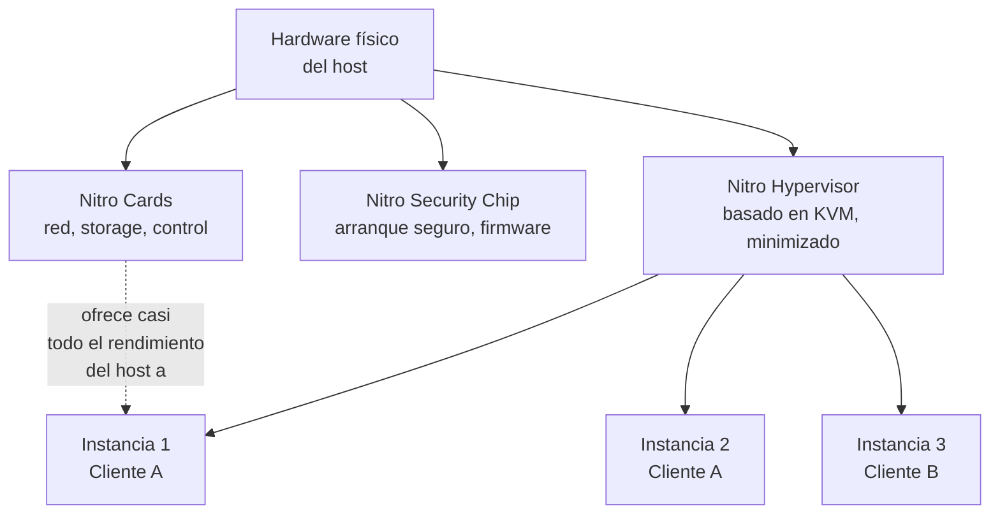
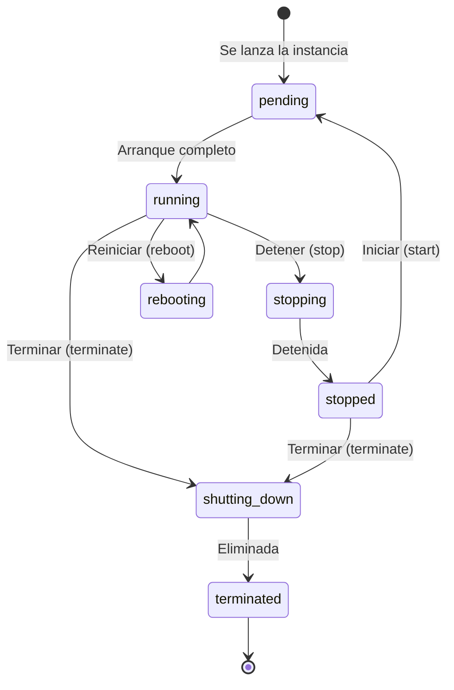
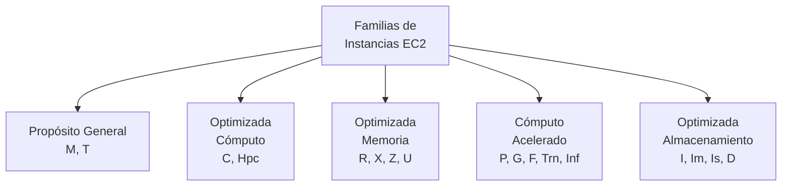
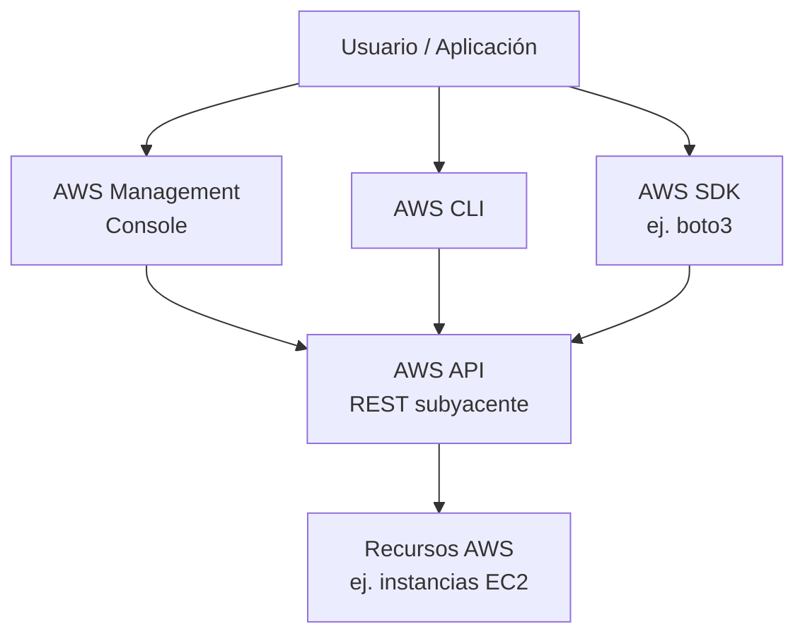
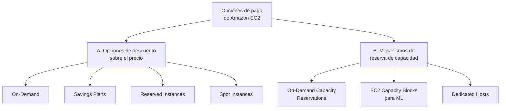
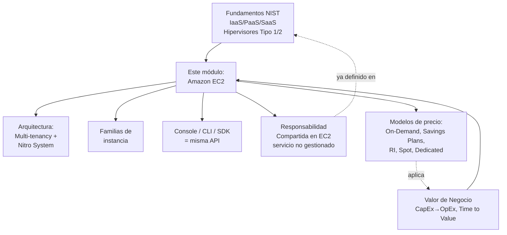

# Supernota: Amazon EC2 (Elastic Compute Cloud)

> [!abstract] Resumen rápido del módulo
> **Amazon EC2** es el servicio de cómputo **IaaS** (ver [[Supernota - Fundamentos de Cloud Computing]]) que provee capacidad de servidor virtual bajo demanda en AWS: instancias que corren sobre hardware físico compartido (*multi-tenancy*) gestionado por un hipervisor propietario (**AWS Nitro System**). El usuario elige sistema operativo, tipo de instancia (familia optimizada para CPU, memoria, cómputo acelerado o almacenamiento), configura red y seguridad, y **paga solo por el tiempo que la instancia está en ejecución**. AWS ofrece múltiples modelos de facturación (On-Demand, Savings Plans, Reserved Instances, Spot, Dedicated Hosts) que permiten optimizar costo según qué tan predecible o flexible sea la carga de trabajo. Toda interacción con EC2 —consola, CLI o SDK— ocurre, en el fondo, mediante llamadas a APIs de AWS, y la seguridad se divide según el **Modelo de Responsabilidad Compartida** ya visto en supernotas anteriores.

> [!note] Nivel de profundidad y nota sobre el contenido de laboratorio
> Esta supernota combina **9 resúmenes de lección** sobre EC2 (concepto, tipos de instancia, formas de interactuar con AWS, responsabilidad compartida, y modelos de precio) en una sola nota, siguiendo el estándar de profundidad técnica del vault. **Por indicación explícita del usuario**, las dos lecciones de tipo laboratorio/práctica (crear una instancia paso a paso, uso de AMIs para escalar) se resumen de forma **breve** en la sección 8, en vez de desarrollarse a profundidad como el resto del contenido — es una excepción puntual al estándar exhaustivo habitual del vault.
>
> Todos los datos de precios, nomenclatura de instancias y porcentajes de descuento de esta nota fueron **verificados contra documentación oficial de AWS** (agosto 2026) — ver sección 12 para una corrección importante que encontré entre el resumen original y la cifra oficial vigente.

---

## Índice de esta supernota
1. [[#1. ¿Qué es Amazon EC2 y por qué importa]]
2. [[#2. Arquitectura técnica — multi-tenancy, hipervisor y AWS Nitro System]]
3. [[#3. Ciclo de vida y configuración de una instancia]]
4. [[#4. Familias y tipos de instancia EC2]]
5. [[#5. Formas de interactuar con AWS — Console, CLI, SDK y APIs]]
6. [[#6. Modelo de Responsabilidad Compartida aplicado a EC2]]
7. [[#7. Amazon Machine Images (AMI) en profundidad]]
8. [[#8. Notas breves de laboratorio (prácticas)]]
9. [[#9. Modelos de precios de EC2]]
10. [[#10. Conceptos complementarios]]
11. [[#11. Cómo se conecta este módulo con el resto del vault]]
12. [[#12. Correcciones frente al resumen original]]
13. [[#13. Preguntas para repasar]]
14. [[#14. Recursos recomendados]]
15. [[#15. Notas relacionadas del vault]]

---

## 1. ¿Qué es Amazon EC2 y por qué importa

**Amazon Elastic Compute Cloud (EC2)** es el servicio central de cómputo de AWS: provee capacidad de procesamiento en la nube, en forma de servidores virtuales (**instancias**), para alojar aplicaciones y satisfacer necesidades de cómputo de cualquier tamaño. Es, en la práctica, el ejemplo más representativo de **IaaS** (Infrastructure as a Service) dentro del catálogo de AWS — ver los tres modelos de servicio en [[Supernota - Fundamentos de Cloud Computing]].

### 1.1 EC2 frente a un centro de datos físico propio (on-premise)

| | **Servidor físico propio (on-premise)** | **Amazon EC2** |
|---|---|---|
| Inversión inicial | Alta (**CapEx**: comprar hardware) | Ninguna — modelo **OpEx** (pago por uso) |
| Tiempo de aprovisionamiento | Semanas o meses (comprar, instalar, configurar) | Minutos |
| Escalabilidad | Requiere comprar más hardware físico | Redimensionable en minutos, elástico |
| Mantenimiento de hardware | Responsabilidad total del cliente | AWS gestiona el hardware físico y el hipervisor |
| Costo cuando no se usa | Se sigue pagando (depreciación, espacio, energía) | No se cobra por instancias detenidas/terminadas |

Esta tabla no es más que una aplicación concreta, a nivel de EC2, del cambio **CapEx → OpEx** y del concepto de **Time to Value** ya desarrollados en [[Supernota Valor de negocio de la nube y casos de estudio]] — EC2 es, en cierto sentido, el servicio que hace tangibles esos dos marcos abstractos.

> [!tip] La idea en una frase
> EC2 reemplaza "comprar y mantener un servidor físico" por "alquilar exactamente la capacidad de cómputo que necesitas, cuando la necesitas, y liberarla cuando ya no" — la aplicación más directa de **Rapid Elasticity** y **Measured Service** (características esenciales del NIST, ver [[Supernota - Fundamentos de Cloud Computing]]) a nivel de un solo servicio.

---

## 2. Arquitectura técnica — multi-tenancy, hipervisor y AWS Nitro System

### 2.1 Multi-tenancy en EC2
El resumen original menciona que las instancias EC2 son **máquinas virtuales que comparten un host físico** mediante un modelo de **multi-tenancy** (multiusuario), gestionado por un **hipervisor**. Esto es la aplicación directa del concepto de **Resource Pooling** (NIST, ver [[Supernota - Fundamentos de Cloud Computing]]) y de la comparación **VM vs Contenedor** ya vista en esa misma nota: cada instancia EC2 es, técnicamente, una **máquina virtual completa**, con su propio kernel, aislada de las demás instancias que corren en el mismo servidor físico — no un contenedor.

AWS es responsable de gestionar el hardware físico subyacente, el hipervisor, y el aislamiento entre instancias, garantizando que ninguna instancia pueda acceder o afectar a otra que comparte el mismo host — esto conecta directamente con el **Modelo de Responsabilidad Compartida** (sección 6).

### 2.2 El hipervisor de EC2: AWS Nitro System (contenido complementario)
El resumen original solo menciona "un software llamado hipervisor" sin nombrarlo — vale la pena precisar cuál es, porque es un tema frecuente en certificaciones AWS y una de las piezas de infraestructura más distintivas de la plataforma.

Desde 2017-2018 (a partir del tipo de instancia C5), todas las instancias EC2 modernas corren sobre el **AWS Nitro System**, una re-arquitectura completa de la virtualización tradicional compuesta de tres componentes:

| Componente | Función |
|---|---|
| **Nitro Cards** | Hardware dedicado (independiente de la placa base con CPU/memoria) que maneja virtualización de I/O: red (ENA), almacenamiento (EBS/NVMe), y control general del sistema |
| **Nitro Security Chip** | Chip de seguridad físico que habilita un arranque seguro basado en *hardware root of trust*, protege contra modificación no autorizada del firmware, y habilita instancias *bare metal* |
| **Nitro Hypervisor** | Hipervisor minimizado (basado en KVM), deliberadamente ligero — delega casi todo el trabajo de virtualización de I/O a los Nitro Cards, dejando casi el 100% de los recursos de CPU/memoria del host disponibles para las instancias del cliente |

> [!important] Por qué esto importa para el examen
> El Nitro System es la razón técnica por la que AWS puede ofrecer **rendimiento casi indistinguible de un servidor bare-metal** dentro de una instancia virtualizada — resolviendo el trade-off clásico entre "aislamiento fuerte" (VM tradicional) y "rendimiento máximo" (servidor físico dedicado) visto en la comparación VM vs Contenedor de [[Supernota - Fundamentos de Cloud Computing]]. Además, el diseño de "acceso cero del operador" (ni siquiera el personal de AWS puede acceder manualmente al hipervisor Nitro) es un argumento de seguridad que aparece con frecuencia en material oficial de AWS sobre EC2.



---

## 3. Ciclo de vida y configuración de una instancia

### 3.1 Estados de una instancia EC2
El resumen menciona que solo se paga por instancias "en ejecución", no por las "detenidas o terminadas" — esto implica un ciclo de vida formal de estados que vale la pena precisar:



| Estado | Se factura cómputo | Se factura almacenamiento EBS |
|---|---|---|
| `running` | **Sí** | Sí |
| `stopped` | **No** | Sí (el volumen EBS persiste) |
| `terminated` | No | No (salvo que se haya configurado conservar el volumen) |

> [!warning] Detenida ≠ Terminada — diferencia con impacto directo en el costo y en los datos
> **Stop (detener)**: la instancia se apaga, deja de facturarse el cómputo, pero **el volumen EBS persiste** (se sigue pagando el almacenamiento) y la instancia puede reiniciarse más tarde conservando sus datos. **Terminate (terminar)**: la instancia se elimina permanentemente; por defecto también se elimina su volumen raíz EBS (configurable), y **no puede recuperarse**. Confundir ambos conceptos es un error común y potencialmente costoso (en dinero o en pérdida de datos).

### 3.2 Configuración al lanzar una instancia
Según el resumen, al crear una instancia EC2 se define:
- **Sistema operativo y software**: mediante la elección de una **AMI** (Amazon Machine Image — desarrollado en profundidad en la sección 7).
- **Redimensionamiento vertical**: se puede aumentar o disminuir CPU/memoria cambiando el **tipo de instancia** (sección 4) — a diferencia del redimensionamiento horizontal (agregar/quitar instancias), este es un cambio *vertical*, y en general requiere detener la instancia, cambiar el tipo, y volver a iniciarla.
- **Configuración de red**: el usuario controla si la instancia es accesible pública o privadamente (vía Security Groups y configuración de VPC/subred).

> [!tip] Escalado vertical vs horizontal — distinción clave
> **Escalado vertical** (*scale up/down*): cambiar el tipo de instancia por uno con más o menos CPU/memoria — la misma instancia, más grande o más pequeña. Tiene un límite físico (el tipo de instancia más grande disponible) y típicamente implica una breve interrupción. **Escalado horizontal** (*scale out/in*): agregar o quitar instancias completas, normalmente automatizado con **Auto Scaling Groups** (ver sección 10) — sin límite práctico y sin interrupción de las instancias existentes. El resumen original solo describe el escalado vertical; el horizontal es contenido complementario que normalmente se cubre en un módulo posterior del curso sobre alta disponibilidad.

---

## 4. Familias y tipos de instancia EC2

### 4.1 Nomenclatura oficial de los tipos de instancia
El resumen menciona las familias de forma conceptual pero no explica cómo se nombran técnicamente. Según la documentación oficial de AWS, el nombre de un tipo de instancia sigue un patrón de tres posiciones antes del punto, más el tamaño después del punto (ej. `c7gn.xlarge`):

| Posición | Qué indica | Ejemplo |
|---|---|---|
| 1ª posición | **Serie** (la familia: propósito general, cómputo, memoria, etc.) | `c` = compute optimized |
| 2ª posición | **Generación** (versión del hardware subyacente) | `7` = 7ª generación |
| 3ª posición (opcional) | **Opciones/capacidades adicionales** | `gn` = procesador AWS Graviton + optimizado para red |
| Después del punto | **Tamaño** de la instancia | `xlarge`, `4xlarge`, o `metal` (bare metal) |

### 4.2 Las 5 categorías principales (como las presenta el resumen del curso)

| Familia | Enfoque | Casos de uso típicos | Letras de serie oficiales relevantes |
|---|---|---|---|
| **Propósito general** | Balance entre CPU, memoria y red | Servidores web, microservicios, repositorios de código, entornos de desarrollo | `M` (general), `T` (rendimiento *burstable*, ver sección 10) |
| **Optimizada para cómputo** | Máxima relación precio/rendimiento en procesamiento CPU | Servidores de juegos, HPC, machine learning, modelado científico, procesamiento por lotes | `C`, `Hpc` |
| **Optimizada para memoria** | Alta relación memoria/vCPU | Bases de datos en memoria, análisis de grandes conjuntos de datos, cachés distribuidos | `R` (memoria optimizada), `X` (memoria intensiva), `Z` (alta frecuencia + alta memoria), `U` (memoria muy alta, hasta TBs) |
| **Cómputo acelerado** | Usan hardware acelerador dedicado (GPU, FPGA, chips de inferencia) | Gráficos, entrenamiento/inferencia de modelos de IA, transcodificación de video | `P`/`G` (GPU), `F` (FPGA), `Trn` (AWS Trainium), `Inf` (AWS Inferentia), `VT` (transcodificación) |
| **Optimizada para almacenamiento** | Alto rendimiento I/O sobre almacenamiento local | Bases de datos NoSQL de alto rendimiento, sistemas de archivos distribuidos, data warehousing | `I`, `Im`, `Is` (storage optimized, distintas proporciones vCPU:memoria), `D` (almacenamiento denso) |



> [!tip] Cómo elegir el tamaño correcto
> El resumen enfatiza balancear rendimiento y costo, y la posibilidad de **cambiar tipo o tamaño** conforme cambian las necesidades (redimensionamiento vertical, sección 3.2). Un patrón práctico común: empezar con `t3.micro`/`t3.small` (propósito general, económico) para validar la carga de trabajo, medir consumo real de CPU/memoria con **Amazon CloudWatch**, y luego migrar a la familia especializada que corresponda según el cuello de botella real observado (CPU, memoria, I/O, red) — en vez de sobredimensionar por adivinanza desde el principio.

---

## 5. Formas de interactuar con AWS — Console, CLI, SDK y APIs

### 5.1 Las tres formas principales

| Método | Qué es | Mejor para |
|---|---|---|
| **AWS Management Console** | Interfaz web visual, basada en navegador | Principiantes, tareas exploratorias/no técnicas, entornos de prueba, visualización rápida de recursos |
| **AWS Command Line Interface (CLI)** | Herramienta de línea de comandos que envía solicitudes a AWS mediante texto | Automatización con scripts, tareas repetitivas, integración en pipelines de CI/CD |
| **AWS Software Development Kit (SDK)** | Bibliotecas específicas por lenguaje de programación (Python/boto3, JavaScript, Java, etc.) que permiten interactuar con AWS desde código | Integrar AWS directamente dentro de una aplicación, lógica de negocio compleja, entornos de desarrollo como VS Code |

> [!important] La idea central del resumen
> Sin importar el método elegido, **toda interacción con AWS —consola, CLI o SDK— se traduce, en el fondo, en llamadas a la misma API REST subyacente de AWS.** La consola es, literalmente, una interfaz gráfica que ejecuta llamadas a la API en nombre del usuario cuando este hace clic en botones. Este es un punto conceptual importante para el examen: no son tres tecnologías distintas y aisladas, son **tres formas distintas de invocar el mismo conjunto de APIs**.

### 5.2 Ejemplo práctico — lanzar y listar instancias EC2 con AWS CLI

```bash
# Listar las zonas de disponibilidad de la región configurada
aws ec2 describe-availability-zones --region us-east-1

# Lanzar una instancia EC2 (Amazon Linux, t2.micro)
aws ec2 run-instances \
  --image-id ami-0abcdef1234567890 \
  --instance-type t2.micro \
  --key-name mi-par-de-claves \
  --security-group-ids sg-0123456789abcdef0 \
  --subnet-id subnet-0123456789abcdef0 \
  --count 1

# Listar instancias en ejecución
aws ec2 describe-instances --filters "Name=instance-state-name,Values=running"

# Detener una instancia por su ID
aws ec2 stop-instances --instance-ids i-0123456789abcdef0
```

### 5.3 Ejemplo práctico — mismo flujo con AWS SDK para Python (boto3)

```python
import boto3

ec2 = boto3.client("ec2", region_name="us-east-1")

# Lanzar una instancia EC2
respuesta = ec2.run_instances(
    ImageId="ami-0abcdef1234567890",
    InstanceType="t2.micro",
    KeyName="mi-par-de-claves",
    SecurityGroupIds=["sg-0123456789abcdef0"],
    SubnetId="subnet-0123456789abcdef0",
    MinCount=1,
    MaxCount=1,
)
instance_id = respuesta["Instances"][0]["InstanceId"]
print(f"Instancia lanzada: {instance_id}")

# Listar zonas de disponibilidad disponibles
zonas = ec2.describe_availability_zones()
for zona in zonas["AvailabilityZones"]:
    print(zona["ZoneName"], zona["State"])

# Detener la instancia
ec2.stop_instances(InstanceIds=[instance_id])
```

> [!tip] Ventaja del SDK sobre la Consola/CLI
> El SDK permite **incrustar lógica de AWS directamente dentro de una aplicación**: por ejemplo, una aplicación que automáticamente lanza instancias adicionales cuando detecta cierta condición de negocio, sin que un humano tenga que abrir la consola o ejecutar un comando manualmente. La CLI es ideal para automatización a nivel de infraestructura (scripts de operaciones); el SDK es ideal para automatización a nivel de lógica de aplicación.



---

## 6. Modelo de Responsabilidad Compartida aplicado a EC2

Ya se desarrolló el marco general del **Modelo de Responsabilidad Compartida** en [[Supernota - Fundamentos de Cloud Computing]] — aquí solo se agrega la aplicación **específica a EC2**, que el resumen sí menciona de forma directa.

> [!important] EC2 como servicio "no gestionado"
> El resumen distingue explícitamente entre servicios **gestionados** y **no gestionados**, y señala a EC2 como ejemplo de servicio **no gestionado**: el cliente es responsable de configurar la seguridad de la instancia, gestionar el sistema operativo (parches, actualizaciones), y configurar los firewalls (Security Groups/NACLs). Esto es consistente con la fila "Sistema Operativo → Cliente" de la tabla IaaS ya vista en [[Supernota - Fundamentos de Cloud Computing]] — EC2 es, en esencia, la instanciación concreta de esa fila de la tabla.

| Responsabilidad | AWS ("seguridad **de** la nube") | Cliente ("seguridad **en** la nube") |
|---|---|---|
| Hardware físico del host | ✅ | |
| Hipervisor (Nitro System) y aislamiento entre instancias | ✅ | |
| Infraestructura de red global | ✅ | |
| Sistema operativo de la instancia (parches, actualizaciones) | | ✅ |
| Configuración de Security Groups / firewalls | | ✅ |
| Gestión de claves SSH / credenciales de acceso | | ✅ |
| Datos almacenados en la instancia | | ✅ |
| Configuración de aplicaciones instaladas | | ✅ |

> [!warning] Contraste con un servicio gestionado (para dimensionar la diferencia)
> Si EC2 fuera reemplazado por un servicio **gestionado** equivalente en la pila PaaS (ej. AWS Elastic Beanstalk, o una base de datos gestionada como Amazon RDS), AWS asumiría también la responsabilidad de aplicar parches al sistema operativo subyacente — el cliente ya no gestionaría esa capa. Elegir EC2 sobre una alternativa gestionada es, en esencia, elegir **más control técnico a cambio de más responsabilidad de seguridad** — el mismo trade-off IaaS vs PaaS ya visto en [[Supernota - Fundamentos de Cloud Computing]].

---

## 7. Amazon Machine Images (AMI) en profundidad

### 7.1 ¿Qué contiene una AMI?
Según el resumen, una **AMI (Amazon Machine Image)** es la plantilla que define el "arranque" completo de una instancia. Formalmente, una AMI incluye:

- **Sistema operativo** base (Windows o distintas distribuciones de Linux).
- **Configuración de almacenamiento**: qué volúmenes se adjuntan y su tipo (root device type).
- **Tipo de arquitectura**: x86_64, ARM (Graviton), etc. — debe coincidir con el tipo de instancia elegido.
- **Permisos de lanzamiento**: quién puede usar esa AMI (privada, compartida con cuentas específicas, o pública).
- **Software preinstalado**: paquetes, configuraciones o aplicaciones ya presentes al arrancar.

### 7.2 Las tres formas de obtener una AMI (según el resumen)

| Forma | Descripción | Cuándo usarla |
|---|---|---|
| **AMI personalizada (custom)** | Creada por el propio usuario a partir de una instancia ya configurada | Cuando se necesita un entorno específico y repetible (ej. una app con dependencias preinstaladas) |
| **AMI preconfigurada de AWS** | Provista directamente por AWS (ej. Amazon Linux, Windows Server) | Punto de partida estándar, mantenido y parcheado por AWS |
| **AMI del AWS Marketplace** | Publicada por terceros (proveedores de software) | Software comercial preconfigurado (ej. un WAF, una base de datos con licencia incluida) |

### 7.3 Por qué las AMIs son clave para escalar de forma consistente
El resumen destaca que las AMIs garantizan un **entorno consistente** para cada nueva instancia — esto es directamente relevante para dos prácticas de la industria que vale la pena nombrar explícitamente aunque el resumen no las mencione por su nombre formal:

> [!tip] Patrón "Golden AMI" (contenido complementario)
> Práctica de la industria donde se mantiene una AMI personalizada, "dorada", ya endurecida en seguridad (*hardened*), con parches y software base preinstalado, que sirve como punto de partida único para **todas** las instancias nuevas de una organización — evitando que cada equipo configure manualmente cada servidor desde cero (y reduciendo el riesgo de configuraciones inconsistentes o inseguras). Se actualiza periódicamente mediante un pipeline automatizado (a menudo con **EC2 Image Builder**, servicio de AWS dedicado exactamente a este propósito).

---

## 8. Notas breves de laboratorio (prácticas)

> [!note] Formato reducido por indicación del usuario
> Esta sección resume, de forma compacta, dos lecciones prácticas del curso — no se desarrollan a profundidad como el resto de la nota.

| Práctica | Puntos clave |
|---|---|
| **Lanzar una instancia EC2 para servidor web** | Consola EC2 → nombre de instancia → AMI Amazon Linux → tipo `t2.micro` (1 vCPU, 1 GB RAM, nivel gratuito) → par de claves para acceso seguro → Security Group con puerto HTTP abierto → volumen EBS `gp3` de 8 GB → script en **User Data** que instala y activa Nginx automáticamente al iniciar → se lanza y se verifica accediendo a la IP pública desde el navegador. |
| **AMIs y consistencia al escalar** | Componentes de una AMI: SO, almacenamiento, arquitectura, permisos, software preinstalado (ver sección 7.1). Tres formas de obtenerla: personalizada, de AWS, o de AWS Marketplace (sección 7.2). Su valor principal al escalar es garantizar que cada instancia nueva arranque con un entorno idéntico, reduciendo errores de configuración entre ambientes. |

---

## 9. Modelos de precios de EC2

Esta es probablemente la sección más densa en cifras exactas del módulo — y la más propensa a preguntas de examen con números específicos, así que se desarrolla con el mayor rigor posible frente a documentación oficial vigente (agosto 2026).

### 9.1 Panorama general — cómo lo organiza AWS actualmente
La documentación oficial de AWS agrupa las opciones de pago de EC2 en dos categorías conceptualmente distintas, aunque el resumen del curso las presenta juntas:



### 9.2 On-Demand Instances
Pago por segundo (mínimo 60 segundos) o por hora según el tipo de instancia, **sin compromiso a largo plazo ni pago inicial**. Es la tarifa de referencia contra la que se calculan todos los descuentos de las demás opciones. Ideal para: cargas de trabajo nuevas o impredecibles, pruebas, desarrollo, o aplicaciones que no pueden interrumpirse y cuyo patrón de uso aún no se conoce lo suficiente para comprometerse.

### 9.3 Savings Plans
Modelo flexible de descuento a cambio de comprometerse a un **gasto constante medido en $/hora** durante 1 o 3 años — aplica a EC2, AWS Fargate y AWS Lambda. Existen dos variantes con distinto nivel de flexibilidad vs. descuento:

| Tipo | Descuento máximo (oficial) | Flexibilidad |
|---|---|---|
| **Compute Savings Plans** | Hasta **66%** | Máxima: aplica automáticamente sin importar familia de instancia, tamaño, SO, tenencia, Región, o incluso si se mueve la carga a Fargate/Lambda |
| **EC2 Instance Savings Plans** | Hasta **72%** | Menor: el compromiso se ata a una familia de instancia específica dentro de una Región específica (ej. familia M5 en us-east-1); dentro de ese alcance se puede cambiar tamaño, SO y tenencia libremente |

> [!tip] Cuándo elegir cada tipo
> **Compute Savings Plans** cuando la arquitectura es dinámica o aún está evolucionando (contenedores, cargas que pueden migrar de familia o incluso de servicio de cómputo). **EC2 Instance Savings Plans** cuando ya existe una carga de trabajo estable y predecible sobre una familia y región específicas, y se prioriza el descuento máximo sobre la flexibilidad — el mismo principio de trade-off "flexibilidad vs. descuento" que aparece en toda la sección.

### 9.4 Reserved Instances (RI)
Descuento significativo a cambio de comprometerse a un **tipo de instancia específico en una Región específica**, por 1 o 3 años. A diferencia de Savings Plans, el compromiso no es en $/hora sino en la configuración exacta de la instancia.

| Tipo de RI | Descuento máximo (oficial) | Flexibilidad |
|---|---|---|
| **Standard RI** | Hasta **72%** | Baja: se puede modificar zona de disponibilidad, tamaño (Linux) y tipo de red, pero **no** familia de instancia, SO ni tenencia |
| **Convertible RI** | Hasta **66%** | Media: permite cambiar familia de instancia, SO, tenencia y opción de pago, siempre que el intercambio resulte en RIs de igual o mayor valor |

Los tres modelos de pago inicial disponibles para RIs son: **All Upfront** (pago total por adelantado, mayor descuento), **Partial Upfront** (pago parcial + cuota mensual), y **No Upfront** (solo cuota mensual, menor descuento).

> [!important] AWS recomienda actualmente Savings Plans sobre Reserved Instances
> La documentación oficial de AWS indica de forma explícita que, hoy, **recomienda Savings Plans por encima de Reserved Instances** para la mayoría de los casos, precisamente porque ofrecen un descuento máximo comparable (hasta 72%) con mayor flexibilidad de cambio de familia/región/servicio. Las RIs siguen siendo relevantes cuando se necesita una **reserva de capacidad garantizada en una zona de disponibilidad específica** (las Savings Plans no reservan capacidad, solo aplican descuento) o para acceder al **Reserved Instance Marketplace** (reventa de RIs entre clientes de AWS).

### 9.5 Spot Instances
Acceso a **capacidad sobrante** de AWS con descuentos de hasta **90%** frente a On-Demand. El precio Spot fluctúa según oferta y demanda de capacidad no utilizada. AWS puede reclamar la capacidad de vuelta en cualquier momento, entregando un **aviso de interrupción de 2 minutos** antes de terminar la instancia.

> [!warning] Para qué NO usar Spot
> No es adecuado para cargas de trabajo que no toleren interrupciones repentinas (bases de datos primarias, sistemas transaccionales críticos como los de trading financiero — ver el caso de ActivTrades en [[Supernota Valor de negocio de la nube y casos de estudio]]). Es ideal para: procesamiento por lotes tolerante a fallos, renderizado, análisis de big data, cargas de trabajo *stateless* con checkpointing, y entornos de prueba no críticos.

### 9.6 Dedicated Hosts vs. Dedicated Instances — distinción que se suele confundir
Ambos garantizan hardware físico no compartido con otras cuentas de AWS, pero difieren en nivel de control:

| | **Dedicated Instances** | **Dedicated Hosts** |
|---|---|---|
| Qué se reserva | La instancia corre en hardware no compartido con *otras cuentas* — pero puede compartir el servidor físico con otras instancias dedicadas de la *misma cuenta* | El **servidor físico completo** se asigna en exclusiva a la cuenta |
| Visibilidad del hardware | Ninguna — no se puede ver ni elegir el servidor físico específico | Total — se puede ver el ID del host y elegir en cuál lanzar cada instancia |
| Persistencia al reiniciar | La instancia puede terminar en un servidor físico distinto tras un stop/start | *Host affinity*: se puede fijar que la instancia siempre vuelva al mismo servidor físico |
| Soporte de licencias BYOL (*Bring Your Own License*) | Limitado | Completo — compatible con licencias por *socket* o núcleo físico (ej. Windows Server, SQL Server) |
| Facturación | Por instancia | Por host físico completo |

> [!tip] Analogía útil
> **Dedicated Instance** es como tener un **lugar de estacionamiento reservado** dentro de un edificio compartido — es tuyo, pero no eliges cuál exactamente. **Dedicated Host** es como ser dueño del **edificio de estacionamiento completo** — control total sobre cada espacio.

### 9.7 On-Demand Capacity Reservations y EC2 Capacity Blocks for ML
Dos mecanismos que **no son descuentos**, sino garantías de disponibilidad de capacidad:
- **On-Demand Capacity Reservations**: reserva capacidad de cómputo en una zona de disponibilidad específica, cobrada a tarifa On-Demand, para casos donde la disponibilidad garantizada importa más que el ahorro (eventos críticos de negocio, alta disponibilidad, recuperación ante desastres).
- **EC2 Capacity Blocks for ML**: reserva anticipada de instancias con GPU específicamente para cargas de entrenamiento/inferencia de machine learning, cubriendo picos de demanda planificados.

### 9.8 Tabla resumen comparativa (para repaso rápido de examen)

| Modelo | Descuento máx. vs On-Demand | Compromiso | Riesgo de interrupción | Mejor para |
|---|---|---|---|---|
| On-Demand | — (precio base) | Ninguno | Ninguno | Cargas nuevas, impredecibles, cortas |
| Compute Savings Plans | 66% | 1-3 años ($/hora) | Ninguno | Arquitecturas dinámicas/en evolución |
| EC2 Instance Savings Plans | 72% | 1-3 años ($/hora, familia+región fija) | Ninguno | Cargas estables en familia/región conocida |
| Standard Reserved Instance | 72% | 1-3 años (config. fija) | Ninguno | Cargas muy predecibles y estáticas |
| Convertible Reserved Instance | 66% | 1-3 años (config. modificable) | Ninguno | Predecible pero con posible cambio de familia/SO |
| Spot Instances | 90% | Ninguno | **Alto** (aviso de 2 min) | Batch tolerante a fallos, cargas *stateless* |
| Dedicated Hosts | Variable (según licencias BYOL ahorradas) | On-Demand o Savings Plans | Ninguno | Cumplimiento normativo, licencias por núcleo/socket |

---

## 10. Conceptos complementarios (no cubiertos en los resúmenes originales)

### 10.1 Rendimiento *Burstable* (familia T) y créditos de CPU
La instancia `t2.micro` usada en el laboratorio (sección 8) pertenece a la familia **T** (*burstable performance*): ofrece un nivel de rendimiento **base** de CPU constante, pero acumula "**créditos de CPU**" durante los periodos de baja actividad, que puede gastar para **ráfagas (bursts)** de rendimiento por encima del nivel base cuando la carga lo exige. Es ideal para cargas con picos ocasionales (servidores web de tráfico variable, microservicios, entornos de desarrollo) donde mantener CPU alta constantemente sería un desperdicio de costo.

### 10.2 EBS vs Instance Store — el volumen raíz de una AMI
El resumen menciona el volumen EBS `gp3` del laboratorio sin contrastarlo con la alternativa:

| | **Amazon EBS (Elastic Block Store)** | **Instance Store** |
|---|---|---|
| Persistencia | Sobrevive al *stop* de la instancia (y opcionalmente a su terminación) | **Efímero** — los datos se pierden al detener o terminar la instancia |
| Dónde vive físicamente | Red de almacenamiento separada del host de cómputo | Disco físico directamente adjunto al servidor host |
| Rendimiento | Alto, configurable por tipo de volumen (`gp3`, `io2`, etc.) | Generalmente más rápido (acceso local), pero no configurable |
| Caso de uso típico | Volumen raíz de la mayoría de las AMIs modernas, bases de datos, datos que deben persistir | Cachés temporales, buffers, datos replicados que se pueden regenerar |

### 10.3 Auto Scaling Groups (ASG) y Elastic Load Balancing (ELB)
Mencionados brevemente en la sección 3.2 como el mecanismo real de **escalado horizontal**: un Auto Scaling Group lanza y termina instancias EC2 automáticamente según métricas (ej. uso de CPU vía CloudWatch), manteniendo siempre un número saludable de instancias detrás de un **Elastic Load Balancer**, que distribuye el tráfico entre ellas. Este es el mecanismo técnico concreto detrás de la **Rapid Elasticity** del NIST aplicada a EC2 — tema que probablemente se desarrolle a fondo en un módulo posterior del curso sobre alta disponibilidad y resiliencia (ver [[Resiliencia y Diseño para el Fallo]]).

### 10.4 Security Groups vs Network ACLs (NACLs)
El resumen menciona la configuración de reglas de red para permitir tráfico HTTP, sin distinguir los dos mecanismos de firewall de AWS que suelen confundirse:

| | **Security Group** | **Network ACL (NACL)** |
|---|---|---|
| Nivel de aplicación | Instancia (interfaz de red) | Subred completa |
| Tipo de reglas | Solo *permitir* (stateful — el tráfico de respuesta se permite automáticamente) | Permitir y **denegar** explícitamente (stateless — hay que definir reglas de entrada y salida por separado) |
| Alcance | Todas las instancias asociadas a ese Security Group | Todas las instancias dentro de esa subred, sin excepción |

### 10.5 User Data vs Instance Metadata Service
El laboratorio usa **User Data** para instalar Nginx automáticamente al arrancar — vale la pena distinguirlo de un concepto relacionado:
- **User Data**: script (bash, PowerShell, etc.) que se ejecuta **una sola vez**, en el primer arranque de la instancia — su propósito es automatizar la configuración inicial.
- **Instance Metadata Service (IMDS)**: servicio interno accesible desde dentro de la instancia (históricamente vía `http://169.254.169.254`) que expone información sobre la propia instancia (ID, tipo, credenciales de rol IAM temporales, etc.) — relevante para que aplicaciones dentro de la instancia se autentiquen con otros servicios de AWS sin credenciales hardcodeadas. AWS recomienda usar **IMDSv2** (basado en tokens) por razones de seguridad frente a la versión original.

### 10.6 EC2 Image Builder
Servicio de AWS dedicado a automatizar la creación, prueba y distribución de AMIs personalizadas (el patrón "Golden AMI" de la sección 7.3) mediante un pipeline reproducible — evita el proceso manual de "crear una instancia, configurarla a mano, y luego crear una AMI a partir de ella" cada vez que se necesita actualizar la imagen base.

---

## 11. Cómo se conecta este módulo con el resto del vault



**La narrativa completa del módulo:**
> EC2 es la materialización concreta del modelo IaaS descrito en [[Supernota - Fundamentos de Cloud Computing]]: hardware físico virtualizado mediante un hipervisor (AWS Nitro System) para servir múltiples instancias aisladas bajo un modelo multi-tenant. El cliente elige sistema operativo, tipo de instancia y configuración de red, y hereda directamente la parte "en la nube" del Modelo de Responsabilidad Compartida al tratarse de un servicio no gestionado. Toda interacción —consola, CLI o SDK— es, en el fondo, la misma API de AWS expresada de tres formas distintas. Y el valor de negocio del cambio CapEx→OpEx (ver [[Supernota Valor de negocio de la nube y casos de estudio]]) se vuelve tangible en EC2 a través de su variedad de modelos de precio: desde el pago simple On-Demand hasta compromisos de largo plazo (Savings Plans, Reserved Instances) o capacidad sobrante con descuento extremo (Spot) — cada uno optimizado para un perfil distinto de previsibilidad de carga de trabajo.

---

## 12. Correcciones frente al resumen original

> [!warning] Discrepancia encontrada — descuento de Reserved Instances
> El resumen original del curso indica, en dos lecciones distintas, que las **Reserved Instances ofrecen descuentos de hasta 75%**. Al verificar contra la documentación oficial de AWS vigente (agosto 2026, `aws.amazon.com/ec2/pricing/reserved-instances/`), la cifra oficial actual es **hasta 72%** para Standard RIs y **hasta 66%** para Convertible RIs — no 75%. Es posible que el material del curso refleje una cifra histórica (AWS ha ajustado estos porcentajes con el tiempo, incluyendo reducciones de precio publicadas en su blog oficial) o un error de transcripción. **Para efectos de examen, usa la cifra oficial: hasta 72%.** El resto de las cifras del resumen (Savings Plans hasta 72%, Spot hasta 90%, interrupción con aviso de 2 minutos) sí coinciden exactamente con la documentación oficial vigente.

---

## 13. Preguntas para repasar (auto-evaluación)

- [ ] ¿Qué es multi-tenancy en EC2, y qué componente de AWS lo hace posible y seguro?
- [ ] ¿Cuáles son los tres componentes del AWS Nitro System y qué función cumple cada uno?
- [ ] ¿Cuál es la diferencia exacta entre detener (`stop`) y terminar (`terminate`) una instancia, en términos de costo y de datos?
- [ ] ¿Qué diferencia hay entre escalado vertical y escalado horizontal en EC2?
- [ ] ¿Puedes nombrar las 5 familias principales de instancias EC2 y dar un caso de uso para cada una?
- [ ] ¿Por qué se dice que la Consola, la CLI y el SDK son "la misma API" expresada de tres formas distintas?
- [ ] En el Modelo de Responsabilidad Compartida, ¿qué hace que EC2 sea un servicio "no gestionado", y qué implica eso para el cliente?
- [ ] ¿Qué tres formas existen de obtener una AMI, y cuándo usarías cada una?
- [ ] ¿Cuál es la diferencia de descuento y de flexibilidad entre Compute Savings Plans y EC2 Instance Savings Plans?
- [ ] ¿Por qué AWS recomienda hoy Savings Plans por encima de Reserved Instances, y en qué caso seguirías prefiriendo una RI?
- [ ] ¿Qué riesgo específico tienen las Spot Instances, y qué tipo de carga de trabajo es (o no es) adecuada para ellas?
- [ ] ¿Cuál es la diferencia exacta entre un Dedicated Host y una Dedicated Instance?
- [ ] ¿Qué diferencia hay entre un volumen EBS y el Instance Store, en términos de persistencia?

---

## 14. Recursos recomendados para profundizar

- 🌐 [Amazon EC2 — página oficial](https://aws.amazon.com/ec2/) — documentación central del servicio.
- 🌐 [Amazon EC2 Instance Types — nomenclatura oficial](https://docs.aws.amazon.com/ec2/latest/instancetypes/instance-type-names.html) — fuente usada para la sección 4.1 de esta nota.
- 🌐 [Amazon EC2 Pricing — página oficial](https://aws.amazon.com/ec2/pricing/) — fuente usada para la sección 9 de esta nota.
- 🌐 [Amazon EC2 Reserved Instances — página oficial](https://aws.amazon.com/ec2/pricing/reserved-instances/) — fuente de las cifras exactas de descuento de RI.
- 🌐 [AWS Savings Plans — Compute y EC2 Instance](https://aws.amazon.com/savingsplans/compute-pricing/) — fuente de las cifras exactas de Savings Plans.
- 🌐 [The Security Design of the AWS Nitro System (whitepaper oficial)](https://docs.aws.amazon.com/whitepapers/latest/security-design-of-aws-nitro-system/security-design-of-aws-nitro-system.html) — lectura recomendada para dominar el Nitro System a fondo.
- 🌐 [Amazon EC2 Dedicated Instances — documentación oficial](https://docs.aws.amazon.com/AWSEC2/latest/UserGuide/dedicated-instance.html)
- 🌐 [AWS CLI — guía oficial](https://docs.aws.amazon.com/cli/latest/userguide/cli-chap-welcome.html)
- 🌐 [Boto3 (AWS SDK para Python) — documentación oficial](https://boto3.amazonaws.com/v1/documentation/api/latest/index.html)
- 🌐 [AWS Shared Responsibility Model](https://aws.amazon.com/compliance/shared-responsibility-model/)

---

## 15. Notas relacionadas del vault
- [[Supernota - Fundamentos de Cloud Computing]]
- [[Supernota Valor de negocio de la nube y casos de estudio]]
- [[Supernota - IoT, IA y Blockchain en la Nube]]
- [[Resiliencia y Diseño para el Fallo]]
- [[Microservicios Nativos en la Nube]]

---
#aws #ec2 #computo #iaas #virtualizacion #precios-cloud
