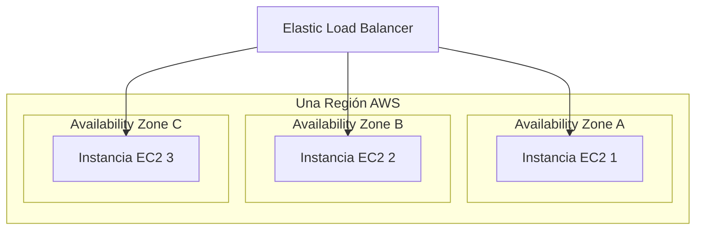
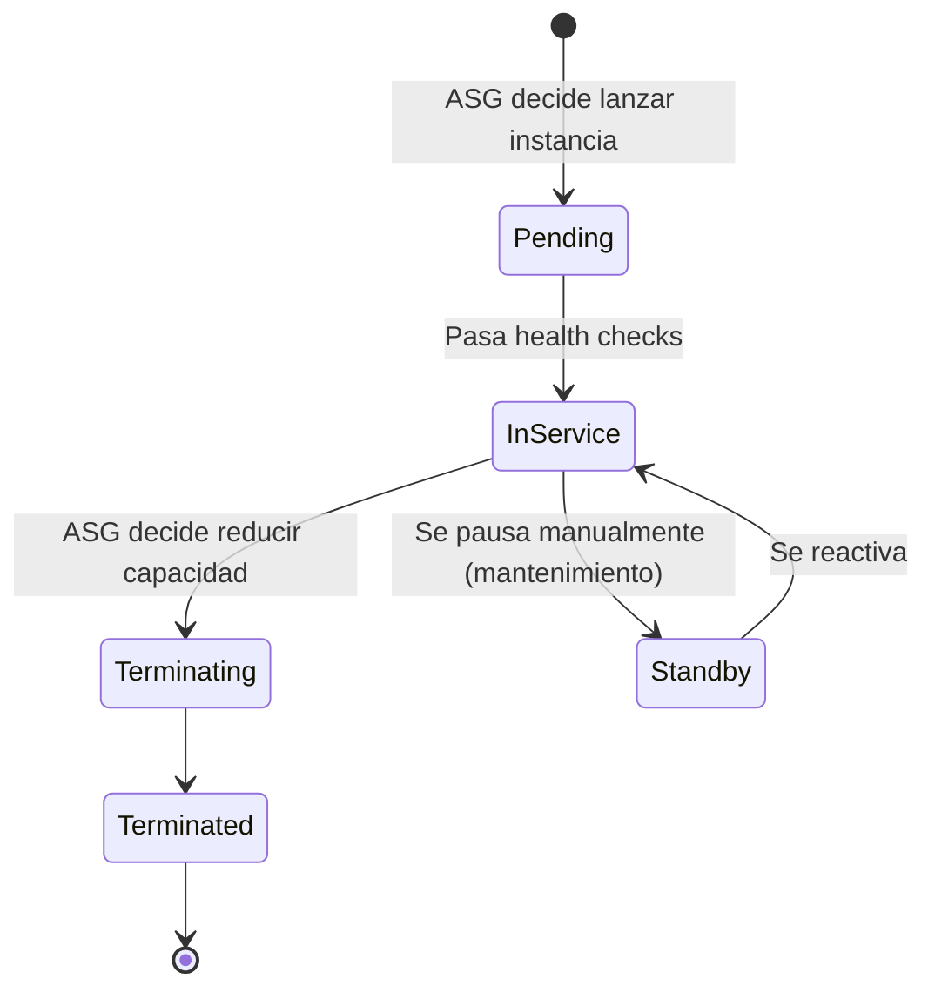
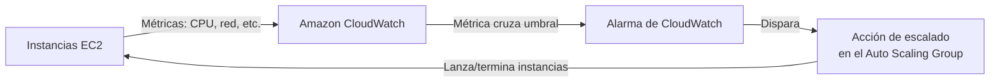
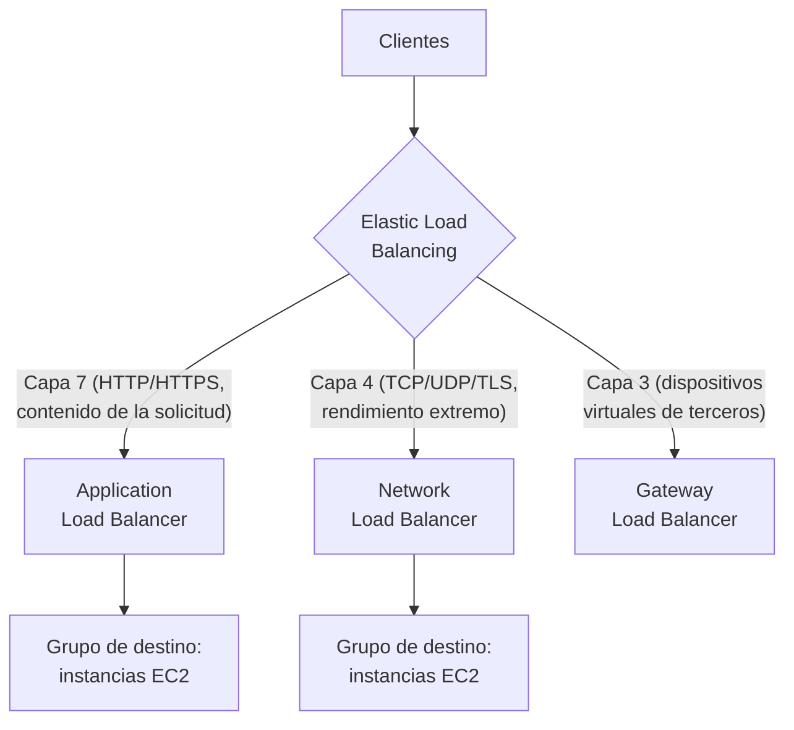
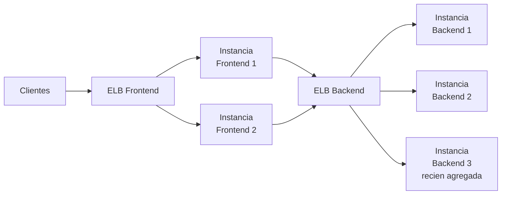
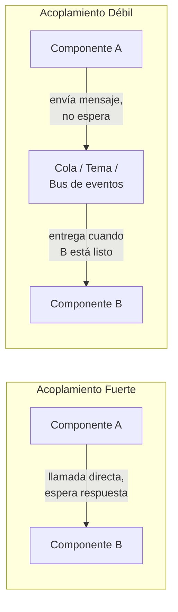
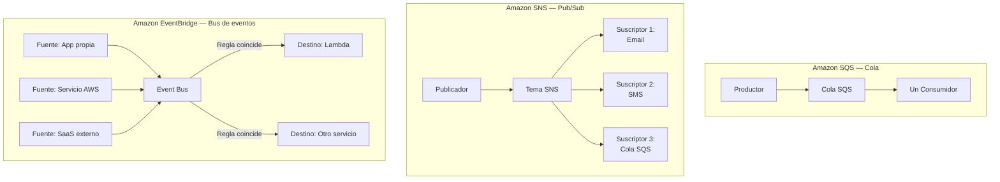
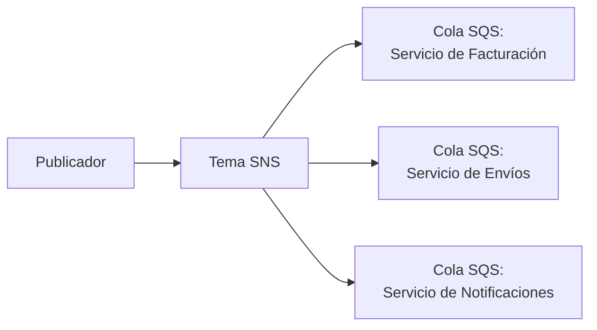
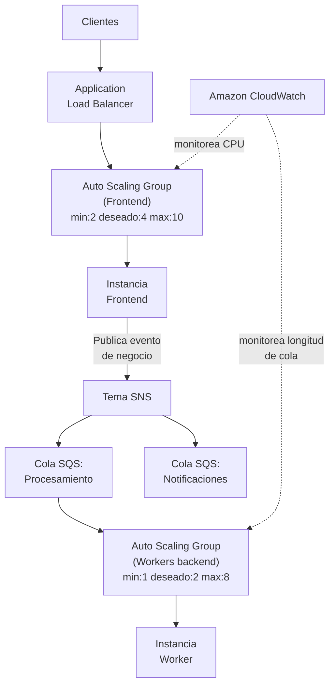
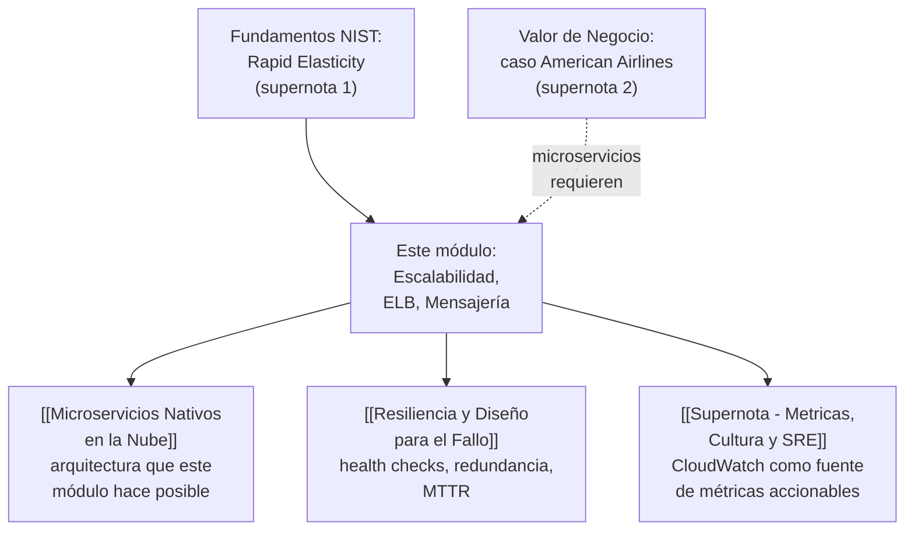

# Supernota: Escalabilidad, Balanceo de Carga y Mensajería en AWS

> [!abstract] Resumen rápido del módulo
> Este módulo cubre cómo **AWS mantiene la disponibilidad y la eficiencia de costos** cuando la demanda cambia: primero mediante **escalabilidad y elasticidad** de cómputo (EC2, Auto Scaling), luego mediante **distribución inteligente del tráfico** entre instancias (Elastic Load Balancing), y finalmente mediante **arquitecturas desacopladas** que usan colas y eventos (SQS, SNS, EventBridge) para que los componentes de una aplicación no dependan directamente unos de otros. Los tres bloques son, en realidad, **una sola historia progresiva**: primero aprendes a tener más o menos capacidad según haga falta, luego a repartir el tráfico entrante entre esa capacidad, y finalmente a evitar que los componentes se bloqueen entre sí mientras la capacidad cambia.

> [!note] Nota sobre esta supernota
> Esta nota combina **siete resúmenes de lección** que en el material original llegaron fragmentados y con bastante redundancia entre sí (varias lecciones repiten la definición de escalabilidad/elasticidad, o de ELB, con matices ligeramente distintos). Aquí se consolidan en una sola narrativa sin repetir contenido, y se completan con la terminología **oficial y verificada contra documentación actual de AWS** (agosto 2026) donde el resumen original era impreciso o incompleto — por ejemplo, los "métodos de enrutamiento" mencionados en el resumen (Round Robin, Least Connections, IP Hash, Least Response Time) son conceptos **genéricos** de balanceo de carga; la sección 5.4 aclara cuáles de ellos usa realmente cada tipo de Elastic Load Balancer en AWS, con nombres oficiales verificados en la documentación.

---

## Índice de esta supernota
1. [[#1. Escalabilidad y Elasticidad en AWS — precisión de términos]]
2. [[#2. Escalado Horizontal vs Vertical]]
3. [[#3. Amazon EC2 Auto Scaling en profundidad]]
4. [[#4. Amazon CloudWatch — el sistema nervioso de las decisiones de escalado]]
5. [[#5. Elastic Load Balancing (ELB) en profundidad]]
6. [[#6. Acoplamiento fuerte vs débil — por qué existe la mensajería]]
7. [[#7. Servicios de mensajería y eventos en AWS — SQS, SNS y EventBridge]]
8. [[#8. Arquitectura de referencia — todo el módulo combinado]]
9. [[#9. Conceptos complementarios]]
10. [[#10. Cómo se conecta este módulo con el resto del vault]]
11. [[#11. Preguntas para repasar]]
12. [[#12. Recursos recomendados]]
13. [[#13. Notas relacionadas del vault]]

---

## 1. Escalabilidad y Elasticidad en AWS — precisión de términos

Ya se definieron formalmente **Escalabilidad** y **Elasticidad** como conceptos generales en [[Supernota - Fundamentos de Cloud Computing]] (sección 1, característica esencial #4 del NIST). El resumen de este módulo repite esa distinción aplicándola específicamente a EC2 — vale la pena precisar la diferencia una vez más porque **el examen suele probar si sabes distinguirlas en un caso práctico**, no solo si puedes citar la definición:

| | **Escalabilidad (Scalability)** | **Elasticidad (Elasticity)** |
|---|---|---|
| Qué es | La *capacidad* de un sistema de crecer para soportar más carga, agregando recursos (verticalmente u horizontalmente) | La *capacidad* de ajustar recursos **automáticamente y en tiempo casi real**, hacia arriba **y hacia abajo**, según la demanda actual |
| Horizonte temporal | Planificación de **capacidad a largo plazo** — anticipar crecimiento futuro de usuarios/carga | Respuesta **inmediata** a cambios de demanda que ya están ocurriendo |
| Dirección | Generalmente se piensa en una sola dirección: crecer | Bidireccional: crecer **y encogerse** — igual de importante liberar capacidad ociosa que agregar capacidad nueva |
| Objetivo principal | Que el sistema *pueda* soportar más carga en el futuro | Que el sistema *no pague de más* por capacidad que no está usando en este momento |
| Mecanismo típico en AWS | Diseño de arquitectura (elegir tipos de instancia, arquitectura horizontal desde el inicio) | Amazon EC2 Auto Scaling ajustando el número de instancias en vivo |

> [!important] Por qué el resumen original las trata casi como sinónimas (y por qué no lo son)
> El resumen original de la lección 3 dice correctamente que la escalabilidad "asegura que el sistema pueda crecer para satisfacer la demanda futura" y que la elasticidad "ajusta dinámicamente los recursos para responder a cambios inmediatos en la demanda" — son definiciones correctas, pero el resumen no explicita la relación entre ambas. La relación exacta es: **la elasticidad es el mecanismo automatizado que usa AWS para lograr, en tiempo real, un tipo específico de escalabilidad** (la escalabilidad horizontal dinámica). No toda escalabilidad es elástica — por ejemplo, planificar comprar instancias reservadas más grandes para el próximo año es escalabilidad (vertical, planificada), pero no es elasticidad (no es automática ni en tiempo real).

---

## 2. Escalado Horizontal vs Vertical

### 2.1 Las dos direcciones para agregar capacidad
El resumen usa el ejemplo de una cafetería para ilustrar la diferencia — es una buena analogía y se conserva aquí, ampliada con la terminología oficial de AWS:

| | **Escalado Vertical (Scale Up / Scale Down)** | **Escalado Horizontal (Scale Out / Scale In)** |
|---|---|---|
| Qué hace | Aumenta o reduce la **potencia de una sola máquina** (más vCPU, más RAM, más ancho de banda de red) | Agrega o quita **instancias completas** que trabajan en paralelo |
| Término AWS para "agregar" | Cambiar a un tipo de instancia EC2 más grande (ej. de `t3.medium` a `t3.xlarge`) | **Scale Out**: EC2 Auto Scaling lanza nuevas instancias |
| Término AWS para "reducir" | Cambiar a un tipo de instancia más pequeño | **Scale In**: EC2 Auto Scaling termina instancias que ya no se necesitan |
| Límite técnico | Existe un techo físico: no hay una instancia "infinitamente grande" — y cambiar de tipo de instancia normalmente requiere **detener y reiniciar** la instancia (downtime) | En teoría no tiene techo — se pueden seguir agregando instancias mientras existan cuentas/cuota disponible; no requiere downtime de las instancias existentes |
| Tolerancia a fallos | Baja: si esa única máquina (más grande) falla, **todo** el servicio cae — sigue siendo un punto único de falla | Alta: si una instancia falla, las demás siguen sirviendo tráfico — ver sección 3 sobre redundancia |
| Analogía de la cafetería (del resumen) | Contratar **una persona más grande/fuerte** para tomar órdenes — no ayuda, una persona no puede atender más rápido solo por ser "más grande" | Contratar **más personas** tomando órdenes en paralelo — cada una atiende una fila distinta simultáneamente |

> [!tip] Por qué la nube favorece estructuralmente el escalado horizontal
> El resumen ya lo insinúa con la analogía ("una persona más grande no puede atender más rápido"): el escalado horizontal es el que mejor aprovecha las características esenciales del NIST vistas en [[Supernota - Fundamentos de Cloud Computing]] — **Resource Pooling** y **Rapid Elasticity** dependen de poder sumar/restar unidades de cómputo intercambiables, no de tener una sola máquina cada vez más grande. Por eso Amazon EC2 Auto Scaling (sección 3) está diseñado específicamente para escalado horizontal, no vertical.

### 2.2 Alta disponibilidad y redundancia — el porqué detrás del escalado horizontal
El resumen menciona dos recomendaciones concretas que vale la pena formalizar:

- **Instancias EC2 redundantes**: nunca depender de una sola instancia para servir una carga de trabajo crítica — si falla, no debe haber interrupción de servicio. Esto es la aplicación práctica de eliminar **puntos únicos de falla (Single Points of Failure, SPOF)**, principio central también en [[Resiliencia y Diseño para el Fallo]].
- **Múltiples Zonas de Disponibilidad (AZ)**: desplegar instancias redundantes en **AZs distintas dentro de la misma región** (concepto ya definido en [[Supernota - Fundamentos de Cloud Computing]], sección 12.2) protege contra fallos que afectan a un datacenter físico completo (corte de energía, falla de red local) sin necesidad de replicar en otra región geográfica completa.

> [!warning] Redundancia sin balanceador no es suficiente
> Tener instancias redundantes en múltiples AZs resuelve la disponibilidad de la *capacidad*, pero **alguien tiene que decidir a cuál instancia enviar cada solicitud entrante**, y detectar automáticamente cuándo una instancia falló para dejar de enviarle tráfico. Ese "alguien" es el Elastic Load Balancer — desarrollado en la sección 5. La redundancia y el balanceo de carga son conceptos complementarios, no intercambiables.

---

## 3. Amazon EC2 Auto Scaling en profundidad

### 3.1 Qué hace, con precisión

> [!abstract] Definición oficial (AWS)
> Amazon EC2 Auto Scaling ayuda a mantener la disponibilidad de la aplicación y permite agregar o quitar instancias EC2 automáticamente, de acuerdo con las políticas que definas, para acompañar los cambios en la demanda.

El resumen original describe correctamente el "qué" (creación programática de instancias, respuesta a picos de demanda) pero no menciona la unidad organizativa central del servicio: el **Auto Scaling Group (ASG)**.

### 3.2 El Auto Scaling Group (ASG) y su configuración de capacidad
Un ASG es un **conjunto lógico de instancias EC2** que Auto Scaling trata como una sola unidad escalable. Su configuración central son tres números:

| Parámetro | Qué controla |
|---|---|
| **Capacidad mínima (Minimum)** | El número más bajo de instancias que el ASG mantendrá siempre activas, sin importar qué tan baja sea la demanda |
| **Capacidad deseada (Desired)** | El número de instancias que Auto Scaling intenta mantener en condiciones normales — puede cambiar dinámicamente dentro del rango mínimo-máximo |
| **Capacidad máxima (Maximum)** | El techo de instancias que el ASG puede lanzar, incluso ante demanda extrema — protege contra gasto descontrolado |

> [!important] Por qué el rango min/deseado/máx es la pieza que conecta todo el módulo
> Esta configuración es exactamente donde se cruzan los dos conceptos de la sección 1: la **capacidad mínima** garantiza una base de **alta disponibilidad** (nunca menos de N instancias redundantes en distintas AZs), la **capacidad máxima** pone un límite de **control de costos** (CapEx→OpEx controlado, ver [[Supernota - Fundamentos de Cloud Computing]] sección 6), y la **capacidad deseada** es la que la elasticidad ajusta constantemente entre esos dos límites según las políticas de escalado.

### 3.3 Los tres tipos de escalado — terminología oficial verificada

El resumen menciona "escalado dinámico y predictivo" en una de sus lecciones — la documentación oficial de AWS (verificada agosto 2026) define en realidad **tres** métodos de escalado, no solo dos:

| Tipo | Cómo funciona | Cuándo usarlo |
|---|---|---|
| **Escalado por Programación (Scheduled Scaling)** | Ajusta la capacidad deseada en **fechas y horas específicas**, definidas de antemano (ej. cron) | Patrones de tráfico predecibles y conocidos de antemano (ej. tráfico bajo cada madrugada, alto cada lunes por la mañana) |
| **Escalado Dinámico (Dynamic Scaling)** | Reacciona **en tiempo real** a una métrica de CloudWatch (ver sección 4) que cruza un umbral definido | Cambios de tráfico impredecibles, donde no se sabe de antemano cuándo ocurrirán los picos |
| **Escalado Predictivo (Predictive Scaling)** | Usa **machine learning** para analizar patrones históricos de carga (diarios/semanales) y **anticipar** capacidad *antes* de que el pico de tráfico ocurra realmente | Tráfico cíclico y recurrente (ej. horario laboral) combinado con aplicaciones que tardan en inicializarse — permite tener la capacidad lista *antes* de que llegue la demanda, no reaccionando después |

> [!note] Matiz importante sobre Predictive Scaling (verificado en documentación oficial)
> El escalado predictivo, por diseño, **solo aumenta capacidad** de forma proactiva (scale-out) según el pronóstico — **no reduce capacidad automáticamente** cuando el pronóstico indica menor demanda. Para liberar capacidad que ya no se necesita, AWS recomienda **combinarlo con escalado dinámico**, que sí maneja el scale-in reactivo. Esto es un matiz que el resumen original no menciona y que suele aparecer en preguntas de examen sobre "cuál es la limitación del escalado predictivo".

### 3.4 Dentro del Escalado Dinámico: tres políticas de escalado
El resumen no distingue este nivel de detalle, pero es contenido estándar de examen — dentro de "escalado dinámico" existen tres políticas configurables:

| Política | Cómo funciona |
|---|---|
| **Target Tracking Scaling** (Seguimiento de objetivo) | Defines un valor objetivo para una métrica (ej. "mantener la utilización promedio de CPU en 50%") y Auto Scaling calcula automáticamente cuántas instancias agregar o quitar para mantenerse cerca de ese objetivo — es la política **recomendada por defecto** por su simplicidad |
| **Step Scaling** (Escalado por pasos) | Define distintos "escalones" de respuesta según qué tan lejos está la métrica del umbral (ej. +1 instancia si CPU > 60%, +3 instancias si CPU > 90%) — más control granular que Target Tracking |
| **Simple Scaling** (Escalado simple) | El método original y más básico: una sola acción de escalado por alarma, con un período de enfriamiento (*cooldown*) antes de permitir otra acción — en gran parte reemplazado por Step Scaling en arquitecturas modernas |

### 3.5 El ciclo de vida de una instancia dentro de un ASG

- **Health Checks (verificaciones de salud)**: Auto Scaling verifica continuamente si cada instancia está sana; si una instancia falla su verificación (ya sea el chequeo básico de EC2 o un chequeo del Load Balancer asociado, ver sección 5), el ASG la **termina automáticamente y lanza una de reemplazo** — esto es la mecánica técnica exacta detrás de "redundancia" mencionada en la sección 2.2.
- **Cooldown (enfriamiento)**: período de espera tras una acción de escalado antes de permitir la siguiente, para evitar que el ASG reaccione de forma exagerada a fluctuaciones de muy corto plazo de la métrica.
- **Warm Pools (grupos en espera)** *(no mencionado en el resumen — aporte complementario)*: un conjunto de instancias pre-inicializadas mantenidas en estado *Stopped* o *Running*, listas para unirse al ASG rápidamente cuando se necesite escalar — reduce el tiempo de arranque para aplicaciones con procesos de inicialización largos, complementando al escalado predictivo.

### 3.6 EC2 Auto Scaling vs AWS Application Auto Scaling *(distinción no cubierta en el resumen)*

> [!warning] Confusión común en el examen
> "Auto Scaling" en AWS no es un solo servicio — es importante distinguir:
> - **Amazon EC2 Auto Scaling**: específico para instancias EC2 (lo cubierto en esta sección).
> - **AWS Application Auto Scaling**: un servicio más amplio que aplica la misma lógica de escalado automático a **otros recursos de AWS** que no son instancias EC2 — por ejemplo, la capacidad de lectura/escritura de tablas DynamoDB, el número de tareas en un servicio de Amazon ECS, o réplicas de lectura de Aurora. El concepto de fondo (mantener una métrica cerca de un objetivo) es el mismo, pero el servicio y la API son distintos.

---

## 4. Amazon CloudWatch — el sistema nervioso de las decisiones de escalado

El resumen menciona a CloudWatch de pasada ("monitorización de métricas con Amazon CloudWatch") — dado que es el servicio que **hace posible técnicamente** todo el escalado dinámico descrito en la sección 3, merece una explicación mínima aunque no sea el foco del módulo.

### 4.1 Qué es y qué rol cumple exactamente
Amazon CloudWatch es el servicio de **monitorización y observabilidad** de AWS: recolecta métricas (ej. utilización de CPU, memoria, tráfico de red, latencia de solicitudes), las almacena como series de tiempo, y permite definir **alarmas** que se disparan cuando una métrica cruza un umbral definido.

> [!important] La cadena causal completa (síntesis del resumen + esta sección)
> El resumen dice, correctamente, que "AWS permite ajustar automáticamente el número de instancias... mediante la monitorización de métricas con CloudWatch". La cadena técnica exacta es: **CloudWatch mide continuamente** → una **métrica cruza un umbral** definido en una política de escalado dinámico (sección 3.4) → se dispara una **alarma** → la alarma ejecuta la **acción de escalado** configurada en el Auto Scaling Group → el ASG lanza o termina instancias EC2. Sin CloudWatch, Auto Scaling dinámico no tendría ninguna señal en tiempo real a la cual reaccionar.

### 4.2 Métricas más comunes usadas para escalar
- `CPUUtilization` — la más usada para Target Tracking Scaling.
- `NetworkIn` / `NetworkOut` — útil para cargas de trabajo limitadas por ancho de banda más que por CPU.
- Métricas **personalizadas** (*custom metrics*) — ej. longitud de una cola de SQS (ver sección 7.2), profundidad de solicitudes pendientes, o cualquier métrica de negocio publicada por la propia aplicación vía la API de CloudWatch.

---

## 5. Elastic Load Balancing (ELB) en profundidad

### 5.1 El problema que resuelve, con la analogía del resumen
El resumen ilustra el problema con una cafetería: sin un anfitrión que dirija a los clientes, todos se concentran en una sola caja, generando una fila larga mientras otras cajas permanecen vacías. Técnicamente, este es el problema de **distribución desigual de carga**: sin un mecanismo central, las solicitudes entrantes podrían concentrarse arbitrariamente en unas pocas instancias (por ejemplo, si los clientes conectan siempre a la misma IP mediante DNS estático), dejando **instancias EC2 redundantes inactivas** mientras otras se saturan — desperdiciando exactamente la capacidad de escalado horizontal descrita en la sección 2.

### 5.2 Qué es Elastic Load Balancing, con precisión

> [!abstract] Definición
> Elastic Load Balancing (ELB) es el servicio de AWS que **distribuye automáticamente el tráfico entrante** entre múltiples destinos (instancias EC2, contenedores, direcciones IP, funciones Lambda), actuando como el **único punto de contacto** para los clientes externos, mientras gestiona internamente a cuál destino saludable enviar cada solicitud.

El resumen acierta en los tres beneficios centrales: gestiona el tráfico automáticamente, escala según la demanda, y reduce mantenimiento manual — pero no distingue los **cuatro tipos** de balanceador que ofrece AWS, información central para un examen de certificación.

### 5.3 Los cuatro tipos de Elastic Load Balancer (verificado en documentación oficial, agosto 2026)

| Tipo | Capa OSI | Qué enruta | Casos de uso típicos |
|---|---|---|---|
| **Application Load Balancer (ALB)** | Capa 7 (Aplicación) | Tráfico HTTP/HTTPS — puede enrutar según el **contenido de la solicitud** (ruta URL, encabezados, host) | Aplicaciones web modernas, microservicios, arquitecturas que necesitan *routing* basado en contenido |
| **Network Load Balancer (NLB)** | Capa 4 (Transporte) | Tráfico TCP, UDP y TLS | Cargas con requisitos extremos de rendimiento y latencia ultra baja, IPs estáticas por AZ |
| **Gateway Load Balancer (GWLB)** | Capa 3 (Red) | Tráfico IP genérico, hacia dispositivos virtuales de terceros | Desplegar, escalar y gestionar aplicaciones de red de terceros (firewalls, sistemas de detección de intrusos) de forma transparente |
| **Classic Load Balancer (CLB)** | Capas 4 y 7 (híbrido) | HTTP/HTTPS y TCP básico | **Legado** — generación anterior a los otros tres; AWS recomienda usar ALB o NLB para diseños nuevos |

> [!tip] Cómo elegir entre ALB y NLB para un examen
> Regla práctica: si la pregunta menciona **enrutamiento basado en el contenido de la solicitud** (ej. `/api/*` va a un grupo de instancias, `/imagenes/*` va a otro) o aplicaciones web HTTP/HTTPS estándar → **ALB**. Si la pregunta menciona **latencia extremadamente baja**, **millones de solicitudes por segundo**, tráfico **TCP/UDP puro** (no HTTP), o necesidad de una **IP estática** por Availability Zone → **NLB**.

### 5.4 Métodos de enrutamiento — aclaración de terminología del resumen
El resumen menciona genéricamente "Round Robin, Least Connections, IP Hash y Least Response Time" como estrategias de balanceo de carga. Estos son términos **genéricos de la industria** de balanceo de carga (aplicables a cualquier balanceador, no solo AWS) — la documentación oficial de AWS usa nombres propios ligeramente distintos según el tipo de balanceador:

| Tipo de ELB | Algoritmo(s) de enrutamiento reales (nombres oficiales de AWS) |
|---|---|
| **Application Load Balancer** | **Round Robin** (por defecto) — distribuye solicitudes de forma secuencial y equitativa entre destinos sanos. **Least Outstanding Requests (LOR)** — envía cada nueva solicitud al destino con **menos solicitudes pendientes** en ese momento (equivalente conceptual a "Least Connections" del resumen, pero a nivel de solicitud HTTP, no de conexión TCP). **Weighted Random** — distribución aleatoria ponderada, con mitigación automática de destinos anómalos |
| **Network Load Balancer** | Algoritmo de **hash de flujo** (*flow hash*), basado en el protocolo, IP y puerto de origen/destino — todos los paquetes de un mismo "flujo" se enrutan consistentemente al mismo destino |
| **Classic Load Balancer** | Round Robin para listeners TCP; Least Outstanding Requests para listeners HTTP/HTTPS |

> [!warning] Error de terminología a evitar en el examen
> "IP Hash" y "Least Response Time" (mencionados en el resumen original) **no son los nombres que usa la documentación oficial de AWS** para ninguno de sus balanceadores — son términos genéricos de balanceo de carga que existen en otras tecnologías (ej. NGINX, HAProxy). En un examen de certificación AWS, la respuesta correcta para ALB es **Round Robin** o **Least Outstanding Requests**, y para NLB es el algoritmo de **hash de flujo**. Vale la pena señalar esta diferencia explícitamente porque es exactamente el tipo de imprecisión de fuente que ya se detectó antes en este curso (ver nota sobre el código de región de Singapur en el material previo).

### 5.5 Arquitectura desacoplada con ELB — lo que el resumen describe bien
El resumen acierta en un punto arquitectónico importante: ELB permite que **cada capa de una aplicación (ej. frontend y backend) escale de forma independiente**, sin que las instancias necesiten conocerse entre sí directamente.

> [!important] Por qué esto es "desacoplamiento" y no solo "distribución de tráfico"
> Cuando se agrega una nueva instancia backend (como B3 en el diagrama), el ELB la **registra automáticamente** como destino disponible — ninguna instancia frontend necesita saber cuántas instancias backend existen ni sus direcciones IP específicas; solo conocen la dirección del ELB. Esto es el mismo principio de **acoplamiento débil** que se desarrolla formalmente en la sección 6 con colas de mensajes — ELB lo resuelve para tráfico de red síncrono (solicitud/respuesta HTTP), mientras SQS/SNS/EventBridge lo resuelven para comunicación asíncrona entre componentes.

### 5.6 La relación entre ELB y Auto Scaling
El resumen dedica una lección completa a esta relación — se sintetiza aquí sin repetir, agregando el mecanismo técnico exacto:

- ELB actúa como el **único punto de contacto** (*single point of contact*) para el tráfico entrante de los clientes.
- ELB realiza **health checks** continuos sobre cada instancia registrada; si una instancia falla el chequeo, ELB **deja de enviarle tráfico** inmediatamente (sin esperar a que Auto Scaling la reemplace).
- Cuando Auto Scaling lanza una nueva instancia (scale-out) o registra una instancia backend nueva, el ELB la **integra automáticamente** en su grupo de destinos una vez que pasa sus propios health checks.
- Cuando Auto Scaling termina una instancia (scale-in), primero la pone en estado de **desregistro (deregistration/connection draining)**: el ELB deja de enviarle **nuevas** solicitudes, pero le permite terminar de procesar las solicitudes en curso antes de que la instancia se apague — evitando cortar conexiones activas de usuarios reales.

> [!tip] Caso práctico del resumen: sistema de citas médicas en línea
> El resumen usa este ejemplo para ilustrar tráfico variable a lo largo del día (picos en horario de atención, valles durante la madrugada). Es un caso de uso perfecto para combinar **Target Tracking Scaling** (sección 3.4, reaccionando a CPU/solicitudes en tiempo real) con un **ALB** (porque es tráfico HTTP/HTTPS estándar de una aplicación web) — exactamente la combinación de servicios que este módulo desarrolla.

---

## 6. Acoplamiento fuerte vs débil — por qué existe la mensajería

### 6.1 El problema, con la analogía del resumen
El resumen ilustra el problema de la comunicación directa entre componentes con la analogía cajero-barista: si el cajero (componente A) solo puede seguir trabajando cuando el barista (componente B) está listo para recibir la siguiente orden, **cualquier lentitud o falla en B bloquea completamente a A** — aunque A en sí mismo esté funcionando perfectamente bien.

### 6.2 Acoplamiento fuerte (Tight Coupling) vs acoplamiento débil (Loose Coupling)

| | **Acoplamiento Fuerte (Tight Coupling)** | **Acoplamiento Débil (Loose Coupling)** |
|---|---|---|
| Cómo se comunican los componentes | Directamente y **de forma síncrona** — A espera a que B responda antes de continuar | A través de un **intermediario** (cola, tema, bus de eventos) — A entrega el mensaje y continúa, sin esperar a B |
| Qué pasa si un componente falla | El fallo se **propaga en cascada**: si B cae, A también queda bloqueado o falla | El intermediario **absorbe el impacto**: el mensaje queda almacenado hasta que B esté disponible de nuevo; A ni se entera del problema |
| Dependencia de disponibilidad | A necesita que B esté disponible **en el mismo instante** | A y B pueden estar disponibles en **momentos distintos** — comunicación asíncrona |
| Escalado independiente | Difícil: escalar A y B por separado requiere coordinación cuidadosa | Fácil: cada componente escala según su propia carga, sin afectar al otro — igual que en la sección 5.5 con ELB |
| Ejemplo del resumen | Arquitectura **monolítica** — un fallo puede causar fallos en cascada en todo el sistema | Arquitectura de **microservicios** — el sistema sigue funcionando aunque un componente individual falle |

> [!important] La conexión directa con [[Supernota - Fundamentos de Cloud Computing]] y [[Supernota - Valor de Negocio de la Nube y Casos de Estudio]]
> Esta distinción retoma directamente la comparación **monolito vs microservicios** ya introducida en el caso de **American Airlines** ([[Supernota - Valor de Negocio de la Nube y Casos de Estudio]], sección 5.1): una arquitectura de microservicios *solo* obtiene su beneficio de resiliencia y despliegue independiente si además usa **acoplamiento débil** entre los servicios — microservicios que se llaman entre sí de forma síncrona y directa siguen sufriendo fallos en cascada, aunque estén técnicamente "separados". La mensajería asíncrona (sección 7) es la pieza técnica que realmente entrega ese beneficio.

---

## 7. Servicios de mensajería y eventos en AWS — SQS, SNS y EventBridge

El resumen cubre tres servicios distintos sin siempre distinguir claramente cuándo usar cada uno — esta sección organiza los tres bajo un criterio único: **¿el mensaje va a un solo receptor, a muchos receptores, o depende de un patrón de enrutamiento complejo basado en reglas?**

### 7.1 Los tres servicios, comparados de una vez

| | **Amazon SQS** | **Amazon SNS** | **Amazon EventBridge** |
|---|---|---|---|
| Modelo de comunicación | **Cola** — un mensaje espera hasta ser recibido y procesado por **un** consumidor | **Publicación/Suscripción (Pub/Sub)** — un mensaje se entrega a **múltiples** suscriptores de un tema | **Bus de eventos** — enruta eventos desde múltiples fuentes hacia múltiples destinos, según **reglas de filtrado** |
| Analogía del resumen | Una "cola de órdenes" en la cafetería | Alertas que deben distribuirse a varios destinatarios (SMS, correo) | *(no cubierto con analogía en el resumen)* |
| Patrón típico | Desacoplar un productor de un consumidor de tareas (*worker*) | Notificar a múltiples sistemas o personas sobre un mismo evento (*fan-out*) | Conectar eventos de aplicaciones, servicios AWS y SaaS de terceros mediante reglas de enrutamiento |
| Quién "consume" el mensaje | Un solo consumidor por mensaje (aunque puede haber varios consumidores compitiendo por distintos mensajes) | Todos los suscriptores activos del tema reciben una copia | Los destinos (*targets*) cuyas reglas coincidan con el evento |

### 7.2 Amazon SQS (Simple Queue Service) en profundidad

> [!abstract] Qué hace, con precisión
> Amazon SQS es un servicio de colas de mensajes **totalmente gestionado** que permite enviar, almacenar y recibir mensajes entre componentes de software a cualquier volumen, sin perder mensajes y sin necesidad de que otros servicios estén disponibles todo el tiempo.

**Los dos tipos de cola (no mencionados en el resumen — contenido complementario esencial para el examen):**

| | **Cola Estándar (Standard Queue)** | **Cola FIFO (First-In-First-Out)** |
|---|---|---|
| Orden de los mensajes | **Mejor esfuerzo** (*best-effort*) — no garantiza orden estricto | **Orden estrictamente preservado** — el orden de envío es el orden de recepción |
| Entregas duplicadas | Posibles — modelo de entrega **"al menos una vez"** (*at-least-once delivery*) | Ninguna — modelo de **"exactamente una vez"** (*exactly-once processing*) |
| Throughput | Prácticamente ilimitado | Limitado (aunque el modo de alto throughput permite miles de mensajes/segundo con *batching*) |
| Nombre de la cola | Cualquier nombre | Debe terminar en `.fifo` |
| Cuándo usarla | La aplicación tolera mensajes fuera de orden o duplicados ocasionales (ej. tareas independientes de un *worker pool*) | El orden importa y los duplicados no son tolerables (ej. procesamiento de órdenes de un sistema de e-commerce, transacciones financieras) |

**Conceptos técnicos clave de SQS (complementarios, no en el resumen):**
- **Visibility Timeout (tiempo de visibilidad)**: cuando un consumidor recibe un mensaje, este se vuelve **temporalmente invisible** para otros consumidores mientras se procesa — si el consumidor no lo borra a tiempo (porque falló o tardó demasiado), el mensaje vuelve a estar disponible para que otro consumidor lo intente.
- **Dead Letter Queue (DLQ, cola de mensajes muertos)**: una cola secundaria a la que se mueven automáticamente los mensajes que fallaron demasiadas veces al ser procesados (superando un `maxReceiveCount` configurado) — evita que un **"mensaje envenenado"** (*poison pill*, un mensaje malformado que siempre causa error) bloquee la cola indefinidamente, permitiendo investigarlo por separado.
- **Long Polling vs Short Polling**: *Short Polling* consulta la cola y responde inmediatamente aunque no haya mensajes; *Long Polling* mantiene la conexión abierta esperando hasta que llegue un mensaje (o se cumpla un tiempo máximo) — reduce solicitudes vacías y por lo tanto costo.

### 7.3 Amazon SNS (Simple Notification Service) en profundidad

> [!abstract] Qué hace, con precisión
> Amazon SNS es un servicio de notificaciones **publicación/suscripción (Pub/Sub)** completamente gestionado: los publicadores (*publishers*) envían mensajes a un **Tema (Topic)**, y SNS los distribuye automáticamente a todos los **suscriptores (subscribers)** de ese tema — que pueden ser personas (vía email, SMS) o sistemas (colas SQS, funciones Lambda, endpoints HTTP).

El resumen menciona correctamente que SNS "envía mensajes que requieren respuesta inmediata" y puede "distribuir notificaciones a múltiples destinatarios" — la precisión técnica adicional es el patrón **Fan-Out (SNS + SQS)**, uno de los patrones de arquitectura más comunes en AWS y frecuente en exámenes:

> [!tip] Patrón Fan-Out: por qué combinar SNS con SQS, no elegir uno u otro
> SNS por sí solo entrega el mensaje a los suscriptores, pero si un suscriptor está caído en ese momento, **puede perder el mensaje** (dependiendo del tipo de endpoint). Al poner una **cola SQS como suscriptora** de un tema SNS, cada "rama" del fan-out obtiene además la **durabilidad y el reintento** propios de SQS (sección 7.2) — el mensaje queda almacenado de forma segura en cada cola hasta que el servicio correspondiente esté listo para procesarlo. Este patrón (**Fan-Out**) es la forma estándar de distribuir un mismo evento a **múltiples servicios desacoplados entre sí**, cada uno procesando el mensaje a su propio ritmo.

### 7.4 Amazon EventBridge en profundidad

> [!abstract] Qué hace, con precisión (verificado en documentación oficial, agosto 2026)
> Amazon EventBridge es un **bus de eventos sin servidor** (*serverless event bus*) que facilita la construcción de aplicaciones dirigidas por eventos: recibe eventos desde múltiples fuentes (aplicaciones propias, más de 200 servicios de AWS, y aplicaciones SaaS de terceros), evalúa **reglas** que definen qué eventos coinciden con qué criterios, y enruta los eventos coincidentes hacia uno o más **destinos (targets)**.

El resumen describe correctamente el rol de EventBridge ("conecta partes de una aplicación mediante eventos") pero no explica su mecanismo interno — los tres componentes clave son:

| Componente | Función |
|---|---|
| **Fuente de eventos (Event Source)** | Quien origina el evento — puede ser un servicio AWS (ej. un cambio de estado de una instancia EC2), una aplicación propia, o un proveedor SaaS externo |
| **Bus de eventos (Event Bus)** | El enrutador que recibe eventos y los distribuye — existe un **bus por defecto**, y se pueden crear buses personalizados |
| **Regla (Rule)** | Un patrón que evalúa cada evento entrante; si coincide, EventBridge envía el evento a los destinos asociados a esa regla |

> [!important] SNS vs EventBridge — la distinción que el resumen no aclara explícitamente
> Ambos distribuyen mensajes/eventos a múltiples destinos, lo que genera confusión frecuente en el examen. La diferencia clave: **SNS** distribuye el mensaje **a todos los suscriptores de un tema específico**, sin lógica de filtrado sofisticada más allá de filtros de mensaje simples — el modelo mental es "difusión a una lista". **EventBridge** está diseñado para **enrutamiento basado en reglas complejas de contenido del evento**, con soporte nativo para decenas de fuentes de eventos de AWS y SaaS ya integradas, y para transformar el evento antes de entregarlo — el modelo mental es "un router inteligente", no una simple lista de difusión. En términos generales: si la necesidad es "avisar a varios suscriptores de este mismo tema", es SNS; si la necesidad es "reaccionar de forma diferenciada según el contenido/tipo de eventos que llegan de muchas fuentes distintas", es EventBridge.

### 7.5 Tabla de decisión rápida (síntesis para examen)

| Si la necesidad es... | Usa... |
|---|---|
| Desacoplar un productor de una tarea y un *worker* que la procesa, tolerando algo de retraso | **SQS Estándar** |
| Lo mismo, pero el orden y la ausencia de duplicados son críticos (ej. transacciones financieras) | **SQS FIFO** |
| Notificar a múltiples suscriptores (personas o sistemas) sobre un mismo evento | **SNS** |
| Distribuir un evento a varios servicios desacoplados, cada uno con su propia cola de procesamiento confiable | **SNS + SQS (patrón Fan-Out)** |
| Enrutar eventos de muchas fuentes distintas (AWS, SaaS, apps propias) según reglas de contenido, hacia muchos destinos distintos | **EventBridge** |

---

## 8. Arquitectura de referencia — todo el módulo combinado

El resumen presenta estos tres bloques (escalado, balanceo, mensajería) como lecciones separadas — aquí se combinan en una sola arquitectura de referencia típica de una aplicación web moderna en AWS, para mostrar cómo interactúan realmente en producción:

**La narrativa completa del módulo:**
> Un Application Load Balancer recibe todo el tráfico de los clientes y lo distribuye entre las instancias de un Auto Scaling Group de frontend, cuya capacidad crece o se reduce automáticamente según métricas de CloudWatch (escalado dinámico) o según patrones históricos anticipados (escalado predictivo). Cuando el frontend necesita delegar trabajo pesado o asíncrono, publica un evento en un tema SNS en vez de llamar directamente a otro servicio — desacoplando ambos componentes. Ese evento se distribuye (fan-out) a distintas colas SQS, cada una consumida por su propio Auto Scaling Group de *workers backend*, que a su vez escala según la **longitud de la cola** (una métrica personalizada de CloudWatch) en vez de según CPU. El resultado es un sistema donde **cada capa escala de forma independiente**, **ningún componente individual es un punto único de falla**, y **ningún componente bloquea a otro** mientras procesa su carga de trabajo.

---

## 9. Conceptos complementarios (no cubiertos en los resúmenes originales)

### 9.1 AWS Global Accelerator
Servicio complementario a ELB que usa la red privada global de AWS (en vez de la Internet pública) para enrutar tráfico hacia el punto de entrada óptimo — mejora la disponibilidad y el rendimiento para aplicaciones con usuarios distribuidos globalmente, funcionando en una capa por encima de uno o varios Elastic Load Balancers regionales.

### 9.2 Circuit Breaker Pattern (Patrón de Interruptor de Circuito)
Patrón de diseño de software que complementa el acoplamiento débil (sección 6): cuando un componente detecta que otro al que llama está fallando repetidamente, "abre el circuito" y deja de intentar llamarlo por un período de tiempo (devolviendo un error rápido o una respuesta alternativa), en vez de seguir intentando y agotando recursos — evita que un componente lento o caído **degrade en cascada** el rendimiento de quien lo llama, incluso en comunicación síncrona donde no se puede usar una cola.

### 9.3 Sticky Sessions (Sesiones Persistentes) en ELB
Configuración opcional de ELB (mencionada brevemente en la sección 5.4) que hace que todas las solicitudes de un mismo cliente se enruten **siempre a la misma instancia backend** durante una sesión — útil para aplicaciones que guardan estado de sesión localmente en la instancia (no recomendado en arquitecturas cloud-native modernas, que prefieren estado externalizado, ej. en una base de datos o caché compartida, precisamente para poder distribuir libremente el tráfico entre instancias intercambiables).

### 9.4 AWS Well-Architected Framework — Pilar de Confiabilidad (Reliability)
Ya se mencionó el framework completo en [[Supernota - Fundamentos de Cloud Computing]] (sección 12.4) — el pilar de **Confiabilidad** es el que formaliza justamente los principios de este módulo: diseñar para recuperarse automáticamente de fallos (health checks + Auto Scaling reemplazando instancias), escalar horizontalmente para aumentar disponibilidad agregada (múltiples instancias en múltiples AZs), y dejar de adivinar la capacidad necesaria (elasticidad en vez de aprovisionamiento fijo).

### 9.5 Blue/Green y Canary Deployments con ELB y Auto Scaling
Técnicas de despliegue que aprovechan directamente la infraestructura de este módulo: en un despliegue **Blue/Green**, se levanta un segundo Auto Scaling Group completo con la nueva versión de la aplicación, y se cambia el tráfico del ELB de un grupo al otro de forma controlada (o instantánea); en un despliegue **Canary**, el ELB envía solo un pequeño porcentaje del tráfico al nuevo grupo mientras se valida que no haya errores, antes de migrar el resto — ambas técnicas dependen de que ELB pueda redirigir tráfico entre grupos de instancias sin que los clientes lo perciban.

---

## 10. Cómo se conecta este módulo con el resto del vault

Este módulo es donde la **teoría** de las supernotas anteriores se vuelve **mecánica concreta de AWS**: la característica esencial de *Rapid Elasticity* del NIST ([[Supernota - Fundamentos de Cloud Computing]]) se implementa técnicamente como Amazon EC2 Auto Scaling; el beneficio de "escalabilidad elástica" mencionado en los casos de estudio de Bitly y ActivTrades ([[Supernota - Valor de Negocio de la Nube y Casos de Estudio]]) se logra exactamente con la combinación ELB + Auto Scaling desarrollada aquí; y el principio de **acoplamiento débil** entre microservicios (ya insinuado en el caso de American Airlines) se implementa concretamente con SQS, SNS y EventBridge.

---

## 11. Preguntas para repasar (auto-evaluación)

- [ ] ¿Cuál es la diferencia exacta entre escalabilidad y elasticidad, y por qué la elasticidad es bidireccional mientras que la escalabilidad no necesariamente lo es?
- [ ] ¿Por qué el escalado horizontal tolera mejor los fallos que el escalado vertical?
- [ ] ¿Cuáles son los tres parámetros de capacidad de un Auto Scaling Group, y qué controla cada uno?
- [ ] ¿Cuál es la diferencia entre Escalado por Programación, Escalado Dinámico y Escalado Predictivo? ¿Cuál es la limitación específica del Escalado Predictivo?
- [ ] Dentro del Escalado Dinámico, ¿qué diferencia hay entre Target Tracking, Step Scaling y Simple Scaling?
- [ ] ¿Qué rol cumple exactamente Amazon CloudWatch en el ciclo de Auto Scaling dinámico?
- [ ] ¿Cuáles son los cuatro tipos de Elastic Load Balancer, y en qué capa del modelo OSI opera cada uno?
- [ ] ¿Cuál es el algoritmo de enrutamiento por defecto de un Application Load Balancer, y cuál es la alternativa que considera la carga real de cada destino?
- [ ] ¿Cómo se integran automáticamente ELB y Auto Scaling cuando se lanza o termina una instancia?
- [ ] ¿Qué diferencia hay entre acoplamiento fuerte y acoplamiento débil, y por qué una arquitectura de microservicios necesita acoplamiento débil para obtener realmente sus beneficios de resiliencia?
- [ ] ¿Cuál es la diferencia entre una cola SQS Estándar y una FIFO? ¿Cuándo usarías cada una?
- [ ] ¿Qué es una Dead Letter Queue y qué problema resuelve?
- [ ] ¿Cuál es la diferencia fundamental entre Amazon SNS y Amazon EventBridge, si ambos "distribuyen" mensajes/eventos a múltiples destinos?
- [ ] ¿Qué es el patrón Fan-Out (SNS + SQS) y por qué se combinan ambos servicios en vez de usar solo uno?

---

## 12. Recursos recomendados para profundizar

- 🌐 [Amazon EC2 Auto Scaling — Guía del usuario (What is Amazon EC2 Auto Scaling)](https://docs.aws.amazon.com/autoscaling/ec2/userguide/what-is-amazon-ec2-auto-scaling.html) — documentación oficial completa del servicio.
- 🌐 [Choose your scaling method — Amazon EC2 Auto Scaling](https://docs.aws.amazon.com/autoscaling/ec2/userguide/scaling-overview.html) — comparación oficial de escalado por programación, dinámico y predictivo.
- 🌐 [Predictive scaling for Amazon EC2 Auto Scaling](https://docs.aws.amazon.com/autoscaling/ec2/userguide/ec2-auto-scaling-predictive-scaling.html) — detalle técnico y limitaciones del escalado predictivo.
- 🌐 [Elastic Load Balancing — Documentación oficial](https://docs.aws.amazon.com/elasticloadbalancing/) — punto de entrada a las guías de ALB, NLB, GWLB y CLB.
- 🌐 [Target groups for your Application Load Balancers](https://docs.aws.amazon.com/elasticloadbalancing/latest/application/load-balancer-target-groups.html) — algoritmos de enrutamiento oficiales de ALB (Round Robin, Least Outstanding Requests, Weighted Random).
- 🌐 [Amazon SQS — Guía del desarrollador](https://docs.aws.amazon.com/AWSSimpleQueueService/latest/SQSDeveloperGuide/welcome.html)
- 🌐 [Amazon SQS FIFO queues — documentación oficial](https://docs.aws.amazon.com/AWSSimpleQueueService/latest/SQSDeveloperGuide/sqs-fifo-queues.html)
- 🌐 [What Is Amazon EventBridge? — documentación oficial](https://docs.aws.amazon.com/eventbridge/latest/userguide/eb-what-is.html)
- 🌐 [Event buses in Amazon EventBridge](https://docs.aws.amazon.com/eventbridge/latest/userguide/eb-event-bus.html) — cómo funcionan las reglas y el enrutamiento de eventos.
- 🌐 [AWS Well-Architected Framework — Pilar de Confiabilidad](https://aws.amazon.com/architecture/well-architected/) — marco formal donde encajan Auto Scaling, ELB y redundancia multi-AZ.

---

## 13. Notas relacionadas del vault
- [[Supernota - Fundamentos de Cloud Computing]]
- [[Supernota - Valor de Negocio de la Nube y Casos de Estudio]]
- [[Supernota - IoT, IA y Blockchain en la Nube]]
- [[Microservicios Nativos en la Nube]]
- [[Resiliencia y Diseño para el Fallo]]
- [[Supernota - Metricas, Cultura y SRE]]
- [[IaC - Infraestructura Efimera y Entrega Inmutable]]

---
#aws #ec2 #auto-scaling #elastic-load-balancing #sqs #sns #eventbridge #escalabilidad
