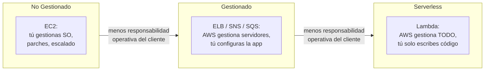
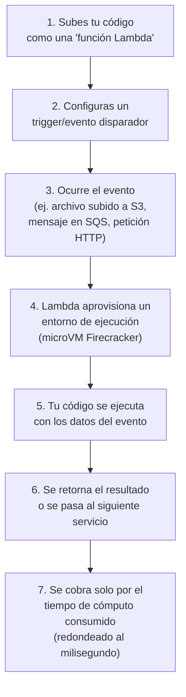
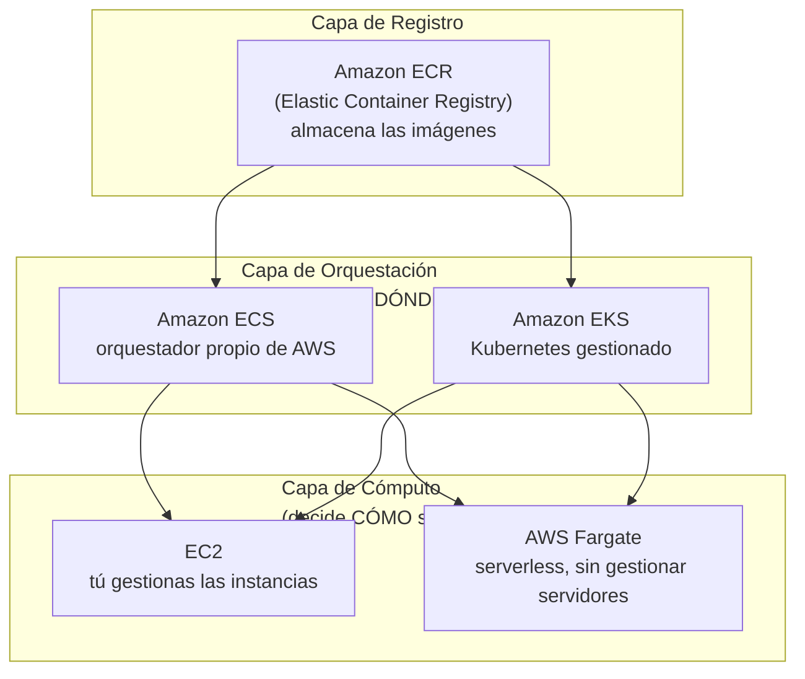
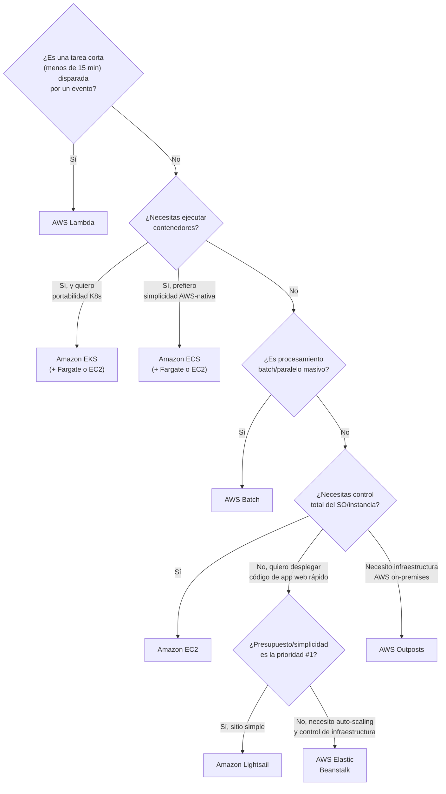
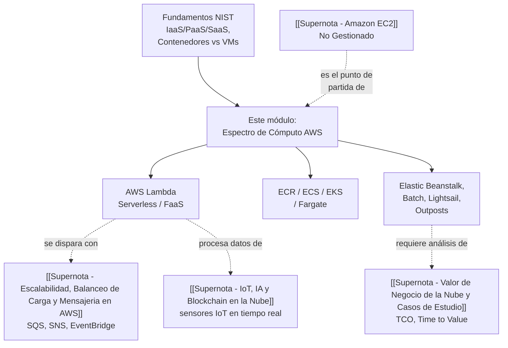

# Supernota: Modelos de Cómputo en AWS — De lo No Gestionado a lo Serverless

> [!abstract] Resumen rápido del módulo
> AWS ofrece un **espectro continuo** de servicios de cómputo según cuánta responsabilidad operativa asume el proveedor: desde **EC2** (no gestionado — tú administras el sistema operativo, parches y escalado) hasta servicios **gestionados** (ELB, SNS, SQS — AWS asume gran parte de la operación) y finalmente **serverless** (AWS Lambda — AWS gestiona absolutamente toda la infraestructura, tú solo escribes código). Este módulo profundiza en **AWS Lambda** como el ejemplo central de *Function as a Service* (FaaS), en el ecosistema de **contenedores** de AWS (ECR, ECS, EKS, Fargate), y en un conjunto de **servicios de cómputo de propósito específico** (Elastic Beanstalk, AWS Batch, Amazon Lightsail, AWS Outposts) que resuelven necesidades de nicho sin obligar a construir todo sobre EC2 puro.

> [!note] Nivel de profundidad y cómo se combinó este módulo
> Esta supernota combina **ocho resúmenes de lección** (el espectro no gestionado/gestionado/serverless, dos resúmenes sobre AWS Lambda, un resumen de laboratorio SQS→Lambda, dos resúmenes sobre contenedores, y dos resúmenes sobre servicios de cómputo de propósito específico) en un solo documento, siguiendo el estándar de profundidad técnica ya establecido en el vault. Se verificaron contra documentación oficial de AWS las cuotas exactas de Lambda, el modelo de precios, y las características de ECS/EKS/Fargate/Outposts, dado que estos datos cambian con el tiempo. El material de laboratorio se resume de forma breve, tal como indica la guía de estilo del vault para lecciones de práctica.

---

## Índice de esta supernota
1. [[#1. El espectro de cómputo en AWS — No Gestionado, Gestionado y Serverless]]
2. [[#2. AWS Lambda en profundidad]]
3. [[#3. Contenedores en AWS — ECR, ECS, EKS y Fargate]]
4. [[#4. Servicios de cómputo de propósito específico (Purpose-Built)]]
5. [[#5. Cómo elegir — árbol de decisión y comparativa general]]
6. [[#6. Laboratorio guiado — SQS disparando una función Lambda]]
7. [[#7. Conceptos complementarios]]
8. [[#8. Cómo se conecta este módulo con el resto del vault]]
9. [[#9. Correcciones y precisiones vs. el material del curso]]
10. [[#10. Preguntas para repasar]]
11. [[#11. Recursos recomendados]]
12. [[#12. Notas relacionadas del vault]]

---

## 1. El espectro de cómputo en AWS — No Gestionado, Gestionado y Serverless

### 1.1 La idea central del resumen original
El material del curso presenta tres categorías de servicios de cómputo, organizadas según **cuánta responsabilidad operativa retiene el cliente**:

| Categoría | Quién gestiona qué | Ejemplos (según el curso) |
|---|---|---|
| **No gestionado (Unmanaged)** | AWS gestiona la infraestructura física; **tú** gestionas el sistema operativo, parches, escalado y mantenimiento de las instancias | Amazon EC2 |
| **Gestionado (Managed)** | AWS asume gran parte de la carga operativa (servidores, parches, disponibilidad); tú te enfocas en la configuración de la aplicación | Elastic Load Balancing (ELB), Amazon SNS, Amazon SQS |
| **Serverless / Totalmente gestionado** | AWS gestiona **absolutamente todo**: aprovisionamiento, escalado, mantenimiento, disponibilidad; tú solo escribes y despliegas código | AWS Lambda |

> [!important] Esta clasificación NO es lo mismo que IaaS/PaaS/SaaS
> Es fácil confundir este espectro con los **3 modelos de servicio del NIST** (IaaS/PaaS/SaaS, ver [[Supernota - Fundamentos de Cloud Computing]]), porque ambos describen "cuánto gestiona el proveedor". Pero son marcos **distintos, aunque relacionados**:
> - **IaaS/PaaS/SaaS** es un marco *formal del NIST* que clasifica capas completas de la pila tecnológica (SO, middleware, runtime, aplicación) para *cualquier* tipo de servicio en la nube — cómputo, almacenamiento, bases de datos, software completo.
> - **No gestionado/Gestionado/Serverless** es una categorización *específica de AWS* aplicada solo a **servicios de cómputo**, que resulta útil para decidir entre opciones de cómputo concretas dentro del catálogo de AWS.
> - En la práctica se **superponen parcialmente**: EC2 (no gestionado) es un ejemplo clásico de IaaS. Lambda (serverless) es la forma más pura de FaaS, que ya vimos como un modelo "adicional" más allá de IaaS/PaaS/SaaS en [[Supernota - Fundamentos de Cloud Computing]] (sección 2.6). Pero servicios "gestionados" como SQS o SNS no encajan limpiamente como PaaS clásico — son más bien **componentes gestionados individuales** (a veces llamados *managed services* o incluso "aaS" de nicho) que tú combinas dentro de tu propia arquitectura, no una plataforma completa de desarrollo como Elastic Beanstalk o Heroku.

### 1.2 Por qué este espectro importa para decisiones de arquitectura
Cada paso hacia la derecha del espectro (No Gestionado → Gestionado → Serverless) **reduce la carga operativa** pero también **reduce el control granular** sobre el entorno de ejecución — el mismo trade-off ya visto en [[Supernota - Fundamentos de Cloud Computing]] al comparar IaaS vs PaaS vs SaaS (sección 2.5). No existe una opción "superior" en abstracto: EC2 sigue siendo la elección correcta cuando se necesita control total (versiones específicas de SO, configuraciones de red avanzadas, licenciamiento particular — ver [[Supernota - Amazon EC2]]), mientras que Lambda es óptima para cargas de trabajo event-driven, esporádicas o de corta duración donde minimizar la gestión operativa es la prioridad.

---

## 2. AWS Lambda en profundidad

### 2.1 ¿Qué es AWS Lambda, con precisión técnica?
AWS Lambda es un servicio de cómputo **serverless** que pertenece a la categoría **FaaS (Function as a Service)**: ejecuta tu código en respuesta a eventos (*triggers*), sin que tengas que aprovisionar ni gestionar servidores. Introducido en 2014, fue uno de los primeros servicios FaaS comerciales a gran escala y sigue siendo el ejemplo de referencia de la categoría.

### 2.2 Cómo funciona — el flujo completo
El resumen original describe correctamente cuatro pasos; aquí se muestran con el detalle técnico completo:

> [!note] Firecracker — el detalle técnico que el resumen no menciona
> Cada entorno de ejecución de Lambda corre sobre **Firecracker**, una tecnología de *microVM* (máquina virtual ligera) que AWS desarrolló y liberó como proyecto de código abierto. Firecracker ofrece el aislamiento de seguridad de una VM completa pero con un arranque mucho más rápido y menor overhead — es lo que hace viable que Lambda ofrezca aislamiento fuerte entre clientes distintos (multi-tenancy seguro, ver [[Supernota - Fundamentos de Cloud Computing]] sección 5.2) a la velocidad que requiere un servicio *serverless*.

### 2.3 Tipos de trigger (eventos disparadores)
El resumen menciona "servicios de AWS, apps móviles o peticiones HTTP" como fuentes de eventos, pero vale la pena formalizar las **tres categorías de invocación**, porque afectan directamente cómo Lambda maneja errores y reintentos:

| Tipo de invocación | Cómo funciona | Ejemplos de origen | Comportamiento ante error |
|---|---|---|---|
| **Síncrona** | El llamador espera la respuesta de la función directamente | Amazon API Gateway, invocación directa vía SDK/CLI | El error se devuelve inmediatamente al llamador; no hay reintento automático de Lambda |
| **Asíncrona** | El evento se coloca en una cola interna y Lambda lo procesa cuando puede; el llamador no espera respuesta | Amazon S3, Amazon SNS, Amazon EventBridge | Lambda reintenta automáticamente (por defecto 2 veces); si sigue fallando, puede enviarse a una *Dead Letter Queue (DLQ)* o *on-failure destination* |
| **Basada en sondeo (Poll-based)** | Lambda "sondea" (poll) continuamente el servicio origen en busca de nuevos elementos, usando permisos de un rol de ejecución | Amazon SQS, Amazon Kinesis Data Streams, Amazon DynamoDB Streams | Lambda gestiona internamente el checkpoint de qué se ha procesado; en el caso de SQS, un mensaje no eliminado de la cola tras el procesamiento exitoso se reintenta según la configuración de la cola |

> [!tip] El caso del laboratorio (SQS → Lambda)
> El laboratorio mencionado en el material del curso (sección 6 de esta nota) usa exactamente el patrón de **invocación basada en sondeo**: Lambda sondea la cola SQS, procesa los mensajes que encuentra, y AWS gestiona automáticamente el ritmo de sondeo según el volumen de mensajes disponibles. Este patrón está profundamente conectado con lo visto en [[Supernota - Escalabilidad, Balanceo de Carga y Mensajeria en AWS]] sobre Amazon SQS como mecanismo de desacoplamiento (*decoupling*) entre componentes.

### 2.4 Cuotas y límites oficiales (verificado contra documentación de AWS)
El resumen del curso menciona correctamente que el **tiempo máximo de ejecución es de 15 minutos**, pero no profundiza en el resto de las cuotas — indispensables para diseñar arquitecturas reales y frecuentes en preguntas de examen sobre "límites de servicios":

| Recurso | Cuota oficial |
|---|---|
| **Memoria asignable** | Entre 128 MB y 10,240 MB, en incrementos de 1 MB |
| **Equivalencia CPU** | A 1,769 MB de memoria, la función obtiene el equivalente a 1 vCPU completo (la CPU escala proporcionalmente a la memoria configurada) |
| **Timeout máximo** | 900 segundos (15 minutos) — límite estricto, no se puede aumentar |
| **Almacenamiento efímero (`/tmp`)** | Entre 512 MB y 10,240 MB, configurable en incrementos de 1 MB |
| **Tamaño del paquete de despliegue (.zip)** | 50 MB comprimido (vía API/consola) — hasta 250 MB sin comprimir, incluyendo capas (*layers*) |
| **Tamaño de imagen de contenedor** | Hasta 10 GB (imagen sin comprimir, incluyendo todas las capas) |
| **Capas (*layers*) por función** | Máximo 5 |
| **Variables de entorno** | 4 KB en total, agregando todas las variables de la función |
| **Concurrencia (ejecuciones simultáneas)** | 1,000 por defecto (cuota blanda, ampliable a decenas de miles vía solicitud a AWS) |
| **Payload de invocación síncrona** | 6 MB (petición y respuesta) |
| **Payload de invocación asíncrona** | 1 MB |

> [!warning] La concurrencia de Lambda NO es infinita
> El resumen original afirma que Lambda "escala automáticamente para manejar de una a miles de invocaciones sin intervención manual" — esto es **cierto en la práctica para la mayoría de casos de uso**, pero técnicamente **incorrecto como afirmación absoluta**: existe una cuota de concurrencia por cuenta y región (1,000 ejecuciones simultáneas por defecto), que **sí se puede ampliar** mediante solicitud a AWS Support, pero no es ilimitada por defecto. Ver sección 9 de esta nota para más detalle sobre esta precisión.

### 2.5 Modelo de precios (verificado contra AWS Lambda Pricing)
El resumen indica correctamente que se cobra por tiempo de cómputo consumido, medido en milisegundos, y que el precio depende de la memoria asignada. El modelo completo tiene **dos componentes**:

| Componente | Precio (x86, `us-east-1`) | Precio (Arm/Graviton) |
|---|---|---|
| **Por número de invocaciones** | $0.20 por cada 1 millón de solicitudes | Igual, independiente de arquitectura |
| **Por duración (GB-segundo)** | $0.0000166667 por GB-segundo | ~20% más económico que x86 |

**Nivel gratuito (Free Tier) — permanente, no expira a los 12 meses:**
- 1 millón de solicitudes gratuitas por mes
- 400,000 GB-segundos de cómputo gratuitos por mes

> [!tip] Cómo se calcula un GB-segundo
> Fórmula: **memoria asignada (en GB) × duración de ejecución (en segundos)**. Ejemplo: una función con 512 MB (0.5 GB) que se ejecuta durante 200 ms (0.2 s) consume 0.5 × 0.2 = **0.1 GB-segundos** por invocación. Esto explica por qué el resumen del curso menciona que "el precio depende de la cantidad de memoria asignada": subir la memoria acelera la ejecución (más CPU proporcional) pero también sube el costo por segundo — el punto óptimo de costo/rendimiento casi nunca es el mínimo de memoria posible.

### 2.6 Runtimes soportados (idiomas de programación)
El resumen menciona "Java, Python y Node.js" como ejemplo; la lista completa y vigente de runtimes **gestionados de forma nativa** por AWS es:

| Runtime gestionado nativamente | Notas |
|---|---|
| **Node.js** | El más usado; arranques en frío rápidos, ecosistema npm |
| **Python** | Muy usado en procesamiento de datos, ML/IA, scripting |
| **Java** | Bueno para cargas sostenidas; arranques en frío más lentos sin optimización (*SnapStart*) |
| **.NET (C#)** | Soporte nativo para el ecosistema Microsoft |
| **Ruby** | Soporte nativo, menos común en producción a gran escala |

Además, Lambda soporta **runtimes "solo SO" (OS-only, familia `provided`)** para lenguajes que compilan a binario nativo — **Go**, **Rust**, **Swift** y **C++** —, y permite **runtimes personalizados** (*custom runtimes*) para prácticamente cualquier otro lenguaje (ej. PHP mediante la capa de terceros *Bref*).

### 2.7 Casos de uso (según el resumen del curso, con contexto técnico añadido)

| Caso de uso | Por qué encaja con Lambda | Servicio(s) AWS involucrados típicamente |
|---|---|---|
| **Procesamiento de imágenes en redes sociales** | Evento discreto (subida de foto) que dispara una tarea corta (redimensionar, aplicar filtros) — encaja perfecto con el modelo de facturación por invocación | Amazon S3 (trigger) → Lambda → S3 (guardar resultado) |
| **Personalización de contenido en agregadores de noticias** | Carga variable e impredecible según tráfico de usuarios; solo se paga cuando hay interacción real | API Gateway → Lambda → bases de datos gestionadas |
| **Eventos en tiempo real en videojuegos online** | Miles de eventos discretos (puntuación, logros) que requieren procesamiento rápido sin gestionar servidores de juego dedicados | API Gateway / IoT Core → Lambda → DynamoDB |

> [!important] Cuándo Lambda NO es la elección correcta
> El límite de **15 minutos por invocación** es la restricción más importante a tener en cuenta: tareas de procesamiento largo (renderizado de video extenso, entrenamiento de modelos de ML, migraciones de datos masivas) requieren alternativas como **AWS Step Functions** (para orquestar múltiples invocaciones cortas encadenadas), **AWS Batch** (sección 4.2 de esta nota) o contenedores en **ECS/EKS** (sección 3). Lambda tampoco es ideal para aplicaciones que requieren mantener **estado persistente en memoria entre invocaciones** de forma confiable, ya que el entorno de ejecución puede reciclarse en cualquier momento.

---

## 3. Contenedores en AWS — ECR, ECS, EKS y Fargate

### 3.1 Recapitulación breve — ¿qué es un contenedor?
Ya se cubrió la definición técnica completa de contenedores y su diferencia frente a máquinas virtuales en [[Supernota - Fundamentos de Cloud Computing]] (sección 5.3) — no se repite aquí. En resumen: los contenedores empaquetan código, runtime, dependencias y configuración en una unidad portable y ligera que comparte el kernel del sistema operativo anfitrión, arrancando en segundos en vez de minutos.

### 3.2 El ecosistema de contenedores de AWS — tres capas distintas
El resumen del curso menciona ECS, EKS, ECR y Fargate como si fueran opciones comparables entre sí, pero **técnicamente pertenecen a tres capas distintas y complementarias** del ecosistema — es un error conceptual común confundirlas como alternativas mutuamente excluyentes:

> [!important] La pregunta correcta no es "¿ECS o Fargate?"
> Es un error de comparación muy común (y candidato típico de pregunta de examen mal entendida): **Fargate no compite con ECS ni con EKS** — es una **opción de cómputo** que ambos orquestadores pueden usar. La comparación real es: **¿ECS o EKS?** (capa de orquestación) y, por separado, **¿EC2 o Fargate?** (capa de cómputo, el llamado *launch type* en ECS).

### 3.3 Amazon ECR (Elastic Container Registry)
Registro gestionado para almacenar, versionar y gestionar **imágenes de contenedor** de forma segura, con soporte para repositorios privados y públicos. Es el punto de partida del ciclo de vida de cualquier despliegue de contenedores: la imagen se construye, se sube (push) a ECR, y desde ahí ECS o EKS la descargan (pull) para ejecutarla.

### 3.4 Amazon ECS (Elastic Container Service)
Servicio de orquestación de contenedores **propietario de AWS**, diseñado para simplicidad y fuerte integración nativa con el resto del ecosistema AWS (IAM, CloudWatch, ALB/NLB, EventBridge). Gestiona automáticamente el ciclo de vida de los contenedores: dónde se ejecutan, cómo se reinician ante fallos, cómo se actualizan y cómo escalan.

**ECS ofrece dos *launch types* (opciones de cómputo subyacente):**

| Launch Type | Quién gestiona los servidores | Cuándo usarlo |
|---|---|---|
| **EC2** | Tú gestionas las instancias EC2 que forman el clúster | Necesitas control sobre el tipo de instancia, aprovechar instancias reservadas/Spot ya contratadas, o cargas de trabajo de muy larga duración con necesidades específicas de hardware (ej. GPU) |
| **Fargate** | AWS gestiona los servidores por completo (serverless) | Priorizas simplicidad operativa y pagar solo por los recursos que cada tarea de contenedor realmente consume, sin gestionar un clúster de EC2 |

### 3.5 Amazon EKS (Elastic Kubernetes Service)
Servicio gestionado de **Kubernetes** — el estándar de facto de la industria para orquestación de contenedores, originalmente desarrollado por Google y ahora mantenido por la comunidad open-source bajo la CNCF (Cloud Native Computing Foundation). AWS gestiona el **plano de control** de Kubernetes (los componentes `etcd`, API server, scheduler, controller manager), eliminando la carga operativa de instalar y mantener Kubernetes manualmente sobre instancias EC2.

> [!tip] ¿Por qué elegir EKS sobre ECS?
> La decisión suele reducirse a **portabilidad y ecosistema** frente a **simplicidad**: EKS es la elección natural si el equipo ya tiene experiencia con Kubernetes, quiere evitar *vendor lock-in* (ver [[Supernota - Fundamentos de Cloud Computing]] sección 9.5) diseñando para ser portable entre proveedores de nube, o necesita acceder al enorme ecosistema de herramientas open-source construidas alrededor de Kubernetes (Helm, ArgoCD, Istio, etc.). ECS, en cambio, es la elección natural cuando el equipo prioriza la integración nativa más simple con AWS y no necesita (ni quiere pagar el costo de aprendizaje de) Kubernetes.

### 3.6 Tabla comparativa ECS vs EKS

| | **Amazon ECS** | **Amazon EKS** |
|---|---|---|
| Modelo de orquestación | Propietario de AWS | Kubernetes estándar (open-source) |
| Curva de aprendizaje | Más simple, conceptos propios de AWS (*tasks*, *services*, *task definitions*) | Más compleja, requiere conocer Kubernetes (*pods*, *deployments*, *services* de K8s) |
| Portabilidad entre proveedores | Baja — es específico de AWS | Alta — Kubernetes es portable a Azure (AKS), GCP (GKE), on-premises |
| Integración nativa con AWS | Muy profunda (IAM, CloudWatch, ALB) | Buena, pero requiere más configuración explícita |
| Opciones de cómputo | EC2 o Fargate | EC2 o Fargate |
| Curva de costos del plano de control | Sin costo adicional por el plano de control | Costo fijo por hora por clúster (plano de control gestionado) |

### 3.7 AWS Fargate — el motor de cómputo serverless para contenedores
Motor de cómputo **serverless** que elimina la necesidad de aprovisionar o gestionar servidores para ejecutar contenedores — se especifica la CPU y memoria que necesita cada tarea/pod, y AWS se encarga del resto. Funciona **tanto con ECS como con EKS**, no es un servicio independiente de orquestación.

> [!note] Fargate como el "Lambda de los contenedores"
> Conceptualmente, Fargate ocupa en el mundo de los contenedores el mismo lugar que Lambda ocupa en el espectro no-gestionado/gestionado/serverless de la sección 1: es la opción que **maximiza la delegación operativa** hacia AWS. La diferencia clave es de granularidad y modelo de ejecución: Lambda ejecuta funciones discretas de corta duración disparadas por eventos, mientras que Fargate ejecuta **contenedores de larga duración** (aplicaciones web persistentes, microservicios activos permanentemente) sin el límite de 15 minutos de Lambda.

---

## 4. Servicios de cómputo de propósito específico (Purpose-Built)

El resumen del curso agrupa cuatro servicios que **no encajan directamente** en las categorías anteriores (EC2/Lambda/contenedores) porque resuelven **necesidades de nicho muy específicas**.

### 4.1 AWS Elastic Beanstalk
Servicio de **orquestación de despliegue** que automatiza el aprovisionamiento de infraestructura (instancias EC2, load balancers, Auto Scaling, monitoreo) para aplicaciones web, sin ocultar por completo el acceso a los recursos subyacentes — a diferencia de una PaaS totalmente opaca, Elastic Beanstalk permite **acceder y modificar** los recursos EC2/ELB que crea automáticamente si se necesita un ajuste fino.

- **Cómo funciona**: subes tu código (ej. un archivo `.war` o `.zip`), y Elastic Beanstalk aprovisiona automáticamente todo lo necesario para ejecutarlo, incluyendo balanceo de carga (ver [[Supernota - Escalabilidad, Balanceo de Carga y Mensajeria en AWS]]) y Auto Scaling.
- **Lenguajes/plataformas soportadas**: Java, .NET, PHP, Node.js, Python, Ruby, Go, y contenedores Docker.
- **Sin costo adicional**: no se cobra por Elastic Beanstalk en sí — solo se paga por los recursos AWS subyacentes que aprovisiona (instancias EC2, buckets S3, etc.).
- **Guarda configuraciones de entorno** para redeployments consistentes y repetibles — coincide con lo que menciona el resumen original.

### 4.2 AWS Batch
Servicio diseñado específicamente para **cargas de trabajo de procesamiento por lotes (batch) a gran escala** — planifica, escala y optimiza automáticamente los recursos de cómputo necesarios para ejecutar trabajos que pueden dividirse en tareas paralelas.

**Casos de uso típicos (según el resumen, con ejemplos concretos):**
- Computación científica y simulaciones
- Análisis financiero (ej. cálculos de riesgo masivos overnight)
- Transcodificación de medios (video/audio a gran escala)
- Big data y machine learning (entrenamiento distribuido)
- Genómica (procesamiento de secuencias de ADN)

> [!tip] AWS Batch vs Lambda para procesamiento masivo
> Es una comparación frecuente en exámenes: si la tarea individual **cabe en 15 minutos** y es más bien event-driven, Lambda es la opción más simple. Si la carga de trabajo implica **trabajos largos, con muchas tareas paralelas que deben coordinarse, y que pueden tardar horas**, AWS Batch (que internamente puede usar EC2 o Fargate como motor de cómputo) es la herramienta diseñada específicamente para ese patrón.

### 4.3 Amazon Lightsail
Servicio de cómputo simplificado, con **precios fijos y predecibles mensuales**, pensado como la puerta de entrada más sencilla a AWS para sitios web y aplicaciones básicas — incluye servidores virtuales, balanceo de carga HTTP, bases de datos gestionadas, despliegue de contenedores públicos, CDN, gestión de DNS y registro de dominios, todo bajo una experiencia unificada y simplificada.

- **Público objetivo**: pequeñas empresas, desarrolladores individuales, o cargas de trabajo que no requieren la complejidad ni granularidad de configuración de EC2.
- **Trade-off clave**: menos flexibilidad y opciones de personalización que EC2 puro, a cambio de una curva de aprendizaje mucho menor y facturación predecible (sin sorpresas de "pago por uso" variable).

### 4.4 AWS Outposts
Solución de **nube híbrida** (ver definición formal en [[Supernota - Fundamentos de Cloud Computing]] sección 3) que extiende literalmente la infraestructura, servicios, APIs y herramientas de AWS hacia **instalaciones físicas on-premises** del cliente — el hardware es propiedad de AWS, quien lo instala, gestiona y mantiene (parches, actualizaciones) de forma remota.

**Formatos físicos disponibles (precisión no cubierta en el resumen original):**

| Formato | Tamaño | Uso típico |
|---|---|---|
| **Outposts Rack** | Rack estándar de la industria de 42U | Datacenters o espacios de colocation; escalable de un solo rack hasta múltiples racks (decenas) para pools grandes de cómputo/almacenamiento |
| **Outposts Servers** | Servidores individuales en formato 1U o 2U | Ubicaciones con espacio limitado — tiendas minoristas, oficinas remotas, plantas de manufactura, sitios de salud |

**Casos de uso típicos**: aplicaciones que requieren **baja latencia** con sistemas locales (ej. control de procesos de manufactura), **residencia de datos** (regulaciones que exigen que ciertos datos nunca salgan de una ubicación física específica), y migración de aplicaciones con **dependencias técnicas locales** que impiden una migración completa a la nube pública.

> [!warning] Detalle práctico frecuentemente ignorado
> A diferencia de otros servicios de cómputo de este módulo (facturación por uso, sin compromiso), **AWS Outposts normalmente requiere un compromiso contractual mínimo de varios años** (comúnmente citado como 3 años), dado que involucra hardware físico dedicado instalado en las instalaciones del cliente — un matiz importante para evaluar el TCO real (ver [[Supernota - Valor de Negocio de la Nube y Casos de Estudio]] sección 6.2) frente a otras opciones de este módulo que son mucho más flexibles.

---

## 5. Cómo elegir — árbol de decisión y comparativa general

### 5.1 Árbol de decisión simplificado

### 5.2 Tabla comparativa integral de todos los servicios de cómputo vistos

| Servicio | Nivel de gestión | Unidad de ejecución | Duración típica | Modelo de facturación |
|---|---|---|---|---|
| **EC2** | No gestionado | Instancia/VM completa | Continua (horas/días/meses) | Por segundo/hora de instancia activa (ver [[Supernota - Amazon EC2]]) |
| **Lambda** | Serverless | Función (código) | Milisegundos a 15 min | Por invocación + GB-segundo |
| **ECS/EKS + EC2** | Semi-gestionado | Contenedor sobre instancias propias | Continua | Costo de las instancias EC2 subyacentes |
| **ECS/EKS + Fargate** | Serverless | Contenedor | Continua o por tarea | Por vCPU/memoria asignada mientras la tarea corre |
| **Elastic Beanstalk** | Gestionado (orquesta EC2) | Aplicación web completa | Continua | Sin costo propio; pagas los recursos subyacentes |
| **AWS Batch** | Gestionado | Trabajo (job) por lotes | Minutos a horas/días | Costo del cómputo subyacente (EC2 o Fargate) que Batch aprovisiona |
| **Lightsail** | Gestionado, simplificado | Instancia virtual simplificada | Continua | Precio fijo mensual predecible |
| **AWS Outposts** | Gestionado (híbrido) | Infraestructura AWS física on-premises | Continua, contractual (años) | Configuración + compromiso plurianual |

---

## 6. Laboratorio guiado — SQS disparando una función Lambda

> [!note] Nota de estilo
> Siguiendo la convención del vault, las lecciones de laboratorio/práctica se resumen de forma **breve** en vez de con la misma profundidad que el contenido conceptual.

**Objetivo del laboratorio**: construir un flujo de trabajo *event-driven* donde los mensajes en una cola de Amazon SQS disparan automáticamente el procesamiento de una función Lambda.

1. **Crear la cola SQS** que almacenará los mensajes entrantes.
2. **Crear la función Lambda** usando un *blueprint* (plantilla predefinida) diseñado específicamente para integración con SQS, con runtime Node.js por defecto.
3. **Configurar el rol de ejecución de Lambda (Execution Role)**: se adjunta una política de tipo *Amazon SQS poller policy*, que otorga permiso a la función para leer (sondear) y eliminar mensajes de la cola — sin esta política, Lambda no tendría autorización IAM para acceder a SQS, sin importar que el trigger esté configurado.
4. **Vincular el trigger**: se conecta la cola SQS como fuente de eventos de la función Lambda (invocación basada en sondeo, ver sección 2.3).
5. **Probar el flujo**: se envían mensajes a la cola; Lambda los procesa (registra el ID y contenido de cada mensaje) y los elimina de la cola tras procesarlos exitosamente.
6. **Monitorear con Amazon CloudWatch Logs**: se verifica en los logs que todos los mensajes fueron procesados correctamente.

> [!tip] Por qué este laboratorio es representativo del módulo completo
> Combina en un solo ejercicio práctico tres conceptos centrales del módulo: el modelo **serverless** de Lambda (sección 2), el uso de **IAM execution roles** (ver sección 7.4), y un servicio **gestionado** de mensajería (SQS, ya cubierto en profundidad en [[Supernota - Escalabilidad, Balanceo de Carga y Mensajeria en AWS]]) — ilustrando cómo, en arquitecturas reales, casi nunca se usa un solo servicio de cómputo aislado, sino combinaciones de servicios gestionados y serverless trabajando juntos.

---

## 7. Conceptos complementarios (no cubiertos en los resúmenes originales)

### 7.1 Cold Start vs Warm Start
Cuando Lambda recibe una invocación y no hay un entorno de ejecución ya inicializado disponible, debe crear uno nuevo desde cero (**cold start**): descargar el código, inicializar el runtime, ejecutar el código fuera del handler — esto añade latencia extra (típicamente decenas a cientos de milisegundos, más en runtimes como Java). Si ya existe un entorno "tibio" de una invocación reciente, Lambda lo reutiliza (**warm start**), evitando esa latencia. Para cargas de trabajo sensibles a latencia, existe **Provisioned Concurrency**: mantiene un número configurado de entornos pre-inicializados y listos, eliminando el cold start a cambio de un costo adicional (no cubierto por el nivel gratuito).

### 7.2 AWS Step Functions
Servicio de orquestación que permite coordinar múltiples funciones Lambda (u otros servicios de AWS) en flujos de trabajo visuales tipo máquina de estados (*state machines*), manejando reintentos, ramificaciones condicionales y paralelismo — la solución estándar de AWS para superar la limitación de 15 minutos de una sola función Lambda, dividiendo tareas largas en pasos más pequeños y coordinados.

### 7.3 Amazon API Gateway
Aunque no aparece mencionado explícitamente en el resumen original, es el servicio que en la práctica **más comúnmente** actúa como trigger síncrono de funciones Lambda para construir APIs REST o HTTP serverless completas — gestiona autenticación, throttling, versionado y transformación de peticiones/respuestas antes de invocar la función Lambda correspondiente.

### 7.4 IAM Execution Roles — el mecanismo de permisos detrás de todo
Tanto Lambda como ECS/EKS/Batch requieren un **rol de IAM (Identity and Access Management)** asociado a cada función/tarea, que define explícitamente qué otros servicios y recursos de AWS puede tocar ese cómputo (leer de S3, escribir en DynamoDB, sondear SQS, etc.) — es la aplicación concreta del principio de **privilegio mínimo (least privilege)**: cada función Lambda debería tener únicamente los permisos estrictamente necesarios para su tarea, nunca permisos amplios "por si acaso".

### 7.5 The Twelve-Factor App
Metodología influyente (originada en Heroku, 2011) para construir aplicaciones nativas de la nube, especialmente relevante para diseñar código que funcione bien en modelos serverless y de contenedores: entre sus principios más relevantes para este módulo están tratar los **procesos como sin estado** (*stateless processes* — directamente aplicable a por qué Lambda no debe depender de estado en memoria entre invocaciones) y la **paridad entre entornos de desarrollo y producción** (facilitada por contenedores).

### 7.6 AWS App Runner (mención breve)
Servicio de cómputo más reciente, no mencionado en el resumen original, que se sitúa conceptualmente entre Elastic Beanstalk y Fargate: permite desplegar aplicaciones web y APIs contenerizadas (o directamente desde código fuente) con configuración mínima, gestionando automáticamente el balanceo de carga y el auto-scaling — vale la pena conocerlo como parte del panorama completo de opciones de cómputo "de alto nivel" de AWS, aunque no sea protagonista de este módulo del curso.

### 7.7 Glosario mínimo de Kubernetes (relevante para EKS)
| Término | Definición breve |
|---|---|
| **Pod** | La unidad mínima desplegable en Kubernetes — uno o más contenedores que comparten red y almacenamiento |
| **Node** | Una máquina (física o virtual) donde se ejecutan pods |
| **Control Plane** | El "cerebro" del clúster (API server, scheduler, etcd) que decide qué se ejecuta y dónde — en EKS, AWS lo gestiona por completo |
| **Cluster** | El conjunto completo de control plane + nodos worker |

---

## 8. Cómo se conecta este módulo con el resto del vault

Este módulo funciona como el **puente entre EC2 y todo lo demás**: si [[Supernota - Amazon EC2]] estableció el extremo "no gestionado" del espectro de cómputo, y [[Supernota - Escalabilidad, Balanceo de Carga y Mensajeria en AWS]] mostró cómo se conectan y escalan esos recursos con servicios gestionados de mensajería, esta supernota completa el panorama mostrando el extremo opuesto (serverless con Lambda) y las capas intermedias (contenedores, servicios de propósito específico) — el conjunto completo de decisiones de cómputo que un arquitecto de soluciones AWS necesita dominar para el examen CLF-C02 y más allá.

---

## 9. Correcciones y precisiones vs. el material del curso

> [!note] A diferencia de módulos anteriores, no se identificaron errores fácticos significativos
> El material fuente de este módulo (a diferencia de módulos previos donde se detectaron, por ejemplo, códigos de región incorrectos o porcentajes de descuento de Reserved Instances sobreestimados) es en general **correcto** en sus afirmaciones. Lo que se identificó fueron **simplificaciones y omisiones** que vale la pena precisar para un examen técnico serio:

- **"Lambda escala automáticamente de una a miles de invocaciones sin intervención manual"**: cierto en la práctica cotidiana, pero técnicamente impreciso como afirmación absoluta — existe una **cuota de concurrencia por cuenta/región** (1,000 ejecuciones simultáneas por defecto, cuota *blanda* ampliable). Ver sección 2.4.
- **"El tiempo máximo de ejecución de Lambda es de 15 minutos"**: esta afirmación del curso es **correcta y se verificó contra la documentación oficial de AWS** (900 segundos, límite estricto no ampliable).
- **ECS, EKS, ECR y Fargate presentados como opciones comparables**: el resumen original los menciona en la misma lista sin aclarar que pertenecen a **capas distintas y complementarias** (registro, orquestación, cómputo) — se corrigió y clarificó explícitamente en la sección 3.2, ya que confundir estas capas es un error conceptual frecuente.
- **Cuotas y precios exactos de Lambda** (memoria, timeout, payloads, modelo de precios con free tier permanente): no estaban presentes en el resumen original y se agregaron completos en las secciones 2.4 y 2.5, verificados directamente contra `docs.aws.amazon.com/lambda`.
- **AWS Outposts**: el resumen original no menciona los formatos físicos concretos (racks de 42U vs. servidores de 1U/2U) ni el compromiso contractual plurianual típico — se agregó esta precisión en la sección 4.4, verificada contra documentación y páginas oficiales de AWS Outposts.

---

## 10. Preguntas para repasar (auto-evaluación)

- [ ] ¿Puedes explicar la diferencia entre un servicio "no gestionado", "gestionado" y "serverless" con un ejemplo de cada uno?
- [ ] ¿Por qué esta clasificación no es exactamente lo mismo que IaaS/PaaS/SaaS?
- [ ] ¿Cuál es el tiempo máximo de ejecución de una función Lambda, y qué alternativas existen si una tarea necesita más tiempo?
- [ ] ¿Cómo se calcula el costo de una invocación de Lambda? ¿Qué es un GB-segundo?
- [ ] ¿Cuáles son las tres categorías de invocación de Lambda (síncrona, asíncrona, basada en sondeo) y en qué se diferencia su manejo de errores?
- [ ] ¿Por qué "ECS vs Fargate" es una comparación mal planteada? ¿Cuál es la comparación correcta?
- [ ] ¿Qué diferencia hay entre Amazon ECS y Amazon EKS, y cuándo elegirías cada uno?
- [ ] ¿Qué rol cumple Amazon ECR en el ecosistema de contenedores de AWS?
- [ ] ¿En qué se diferencian AWS Elastic Beanstalk y Amazon Lightsail como opciones para desplegar una aplicación web?
- [ ] ¿Para qué tipo de cargas de trabajo está diseñado específicamente AWS Batch?
- [ ] ¿Qué es AWS Outposts y en qué formatos físicos está disponible?
- [ ] ¿Qué es un cold start en Lambda y cómo se mitiga?
- [ ] ¿Qué problema resuelve AWS Step Functions frente a las limitaciones de Lambda?

---

## 11. Recursos recomendados para profundizar

- 🌐 [AWS Lambda — documentación oficial](https://docs.aws.amazon.com/lambda/latest/dg/welcome.html)
- 🌐 [AWS Lambda — Cuotas oficiales (gettingstarted-limits)](https://docs.aws.amazon.com/lambda/latest/dg/gettingstarted-limits.html) — fuente de las cuotas exactas usadas en la sección 2.4.
- 🌐 [AWS Lambda — Pricing oficial](https://aws.amazon.com/lambda/pricing/)
- 🌐 [Amazon ECS — documentación oficial](https://docs.aws.amazon.com/ecs/)
- 🌐 [Amazon EKS — documentación oficial](https://docs.aws.amazon.com/eks/)
- 🌐 [AWS — Amazon Lightsail, Elastic Beanstalk o EC2: guía de decisión oficial](https://docs.aws.amazon.com/decision-guides/latest/lightsail-elastic-beanstalk-ec2/lightsail-elastic-beanstalk-ec2.html)
- 🌐 [AWS Batch — documentación oficial](https://docs.aws.amazon.com/batch/)
- 🌐 [AWS Outposts — página oficial de la familia de productos](https://aws.amazon.com/outposts)
- 🌐 [Firecracker — proyecto open-source de AWS](https://firecracker-microvm.github.io/)
- 🌐 [The Twelve-Factor App](https://12factor.net/)

---

## 12. Notas relacionadas del vault
- [[Supernota - Fundamentos de Cloud Computing]]
- [[Supernota - Valor de Negocio de la Nube y Casos de Estudio]]
- [[Supernota - IoT, IA y Blockchain en la Nube]]
- [[Supernota - Amazon EC2]]
- [[Supernota - Escalabilidad, Balanceo de Carga y Mensajeria en AWS]]

---
#aws #cloud-computing #computo #serverless #lambda #contenedores #ecs #eks #fargate
