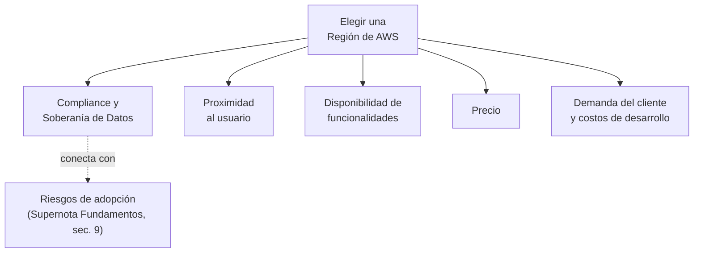
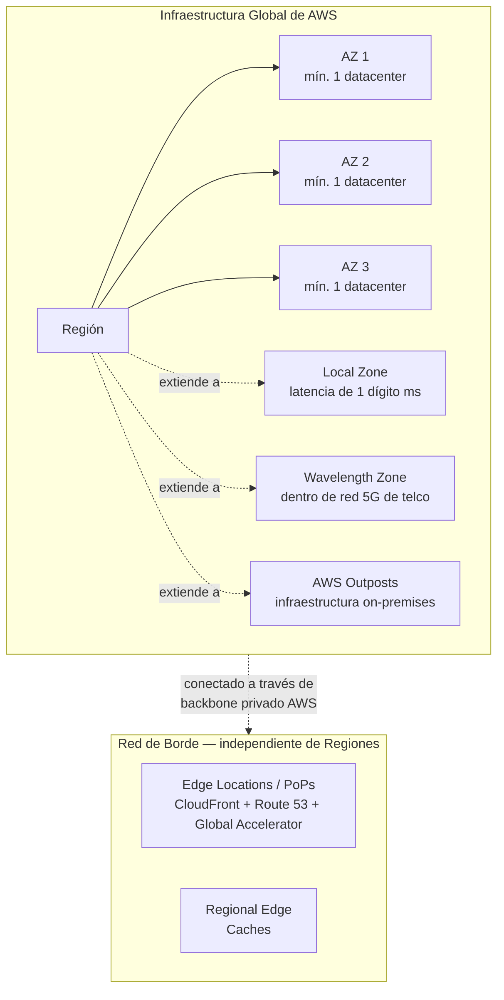
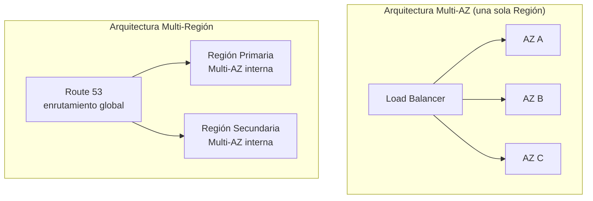
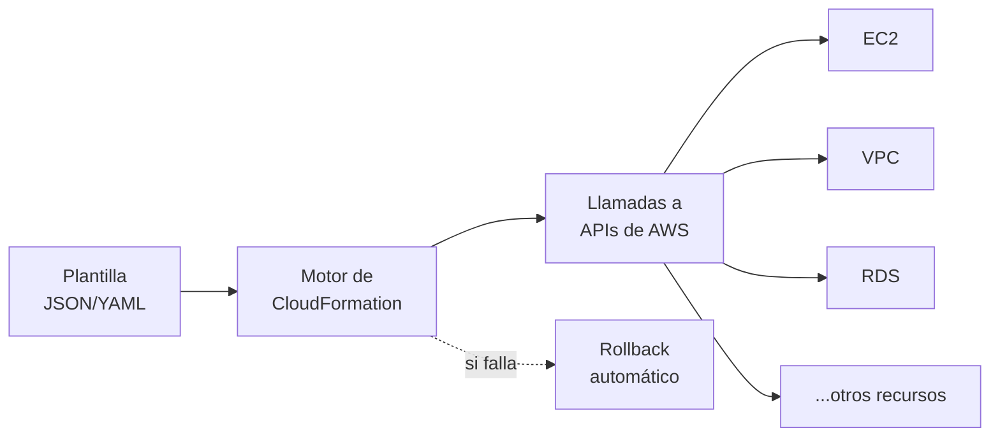
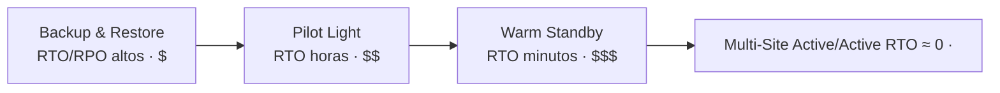
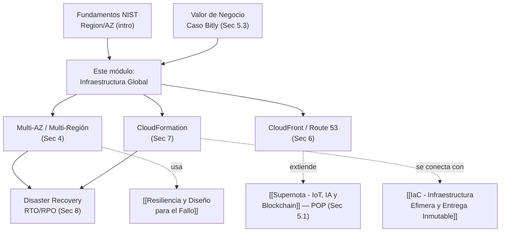

# Supernota: Infraestructura Global de AWS (Regions, AZs, Edge Locations, IaC y Disaster Recovery)

> [!abstract] Resumen rápido del módulo
> La Infraestructura Global de AWS es la red mundial de **Regiones**, **Zonas de Disponibilidad (AZs)**, **Zonas Locales/Wavelength**, **Ubicaciones de Borde (Edge Locations)** y **Outposts** sobre la que corre todo servicio de AWS. Elegir dónde desplegar no es una decisión técnica aislada — depende de **cumplimiento normativo, proximidad al cliente, disponibilidad de funcionalidades y precio**, de forma análoga a elegir la ubicación física de una expansión de negocio. Diseñar para **alta disponibilidad** implica distribuir cargas entre múltiples AZs (tolerancia a fallo de un datacenter) y, para escenarios más extremos, entre múltiples Regiones (tolerancia a fallo de una región completa). **AWS CloudFormation** permite automatizar y hacer reproducible ese despliegue mediante Infraestructura como Código (IaC), y **AWS Outposts** extiende el mismo modelo operativo de AWS hacia instalaciones on-premises para cargas con requisitos de latencia ultra-baja.

> [!note] Nivel de profundidad de esta nota — Supernota que combina 6 resúmenes de lección
> Esta nota combina **seis resúmenes de lección** del mismo módulo (que se superponen bastante entre sí, especialmente en los criterios de selección de Región) en un solo documento no redundante. Se mantiene el estándar técnico establecido en supernotas anteriores del vault, con cifras oficiales verificadas directamente en `aws.amazon.com` y `docs.aws.amazon.com` al 11 de agosto de 2026 — importante en este módulo particular, porque el número de Regiones, AZs y ubicaciones de borde de AWS **cambia constantemente** y es un dato que suele salir desactualizado en materiales de curso.

---

## Índice de esta supernota
1. [[#1. Factores para elegir una Región de AWS]]
2. [[#2. Arquitectura completa de la Infraestructura Global de AWS]]
3. [[#3. Alta Disponibilidad, Agilidad y Elasticidad — precisión conceptual]]
4. [[#4. Arquitecturas Multi-AZ y Multi-Región]]
5. [[#5. AWS Outposts y extensión híbrida on-premises]]
6. [[#6. Entrega de contenido — CloudFront, Global Accelerator y Route 53]]
7. [[#7. Infraestructura como Código (IaC) y AWS CloudFormation]]
8. [[#8. Estrategias de Disaster Recovery en AWS (RTO/RPO)]]
9. [[#9. Cómo se conecta este módulo con el resto del vault]]
10. [[#10. Conceptos complementarios]]
11. [[#11. Preguntas para repasar]]
12. [[#12. Verificación y correcciones frente a documentación oficial]]
13. [[#13. Recursos recomendados]]
14. [[#14. Notas relacionadas del vault]]

---

## 1. Factores para elegir una Región de AWS

Tres de los seis resúmenes de este módulo cubren, con distintas palabras, el mismo marco de decisión — aquí se consolidan en una sola sección completa, sin repetición.

> [!important] La analogía central del módulo
> Elegir una Región de AWS se parece a elegir la ubicación física para expandir un negocio: no es solo "¿dónde es más barato?", sino una decisión que combina demanda del cliente, costos de desarrollo/operación, marco regulatorio y la infraestructura que ya existe cerca de ese punto.

### 1.1 Demanda del cliente y costos de desarrollo
El resumen original señala que elegir una Región depende de factores como la **demanda del cliente** y los **costos de desarrollo**, de forma similar a elegir ubicaciones para una expansión de negocio. Usar **múltiples Regiones** puede optimizar tanto el **rendimiento** (menor latencia, servidores más cerca del usuario) como la **disponibilidad** (redundancia geográfica) de una aplicación.

### 1.2 Cumplimiento y gobernanza de datos (Compliance & Data Governance)
- Cada **Región de AWS está aislada**: los datos no se mueven entre Regiones sin permiso explícito del cliente — esto es un principio de diseño deliberado, no un accidente técnico.
- Los datos almacenados en una Región quedan sujetos a las **leyes locales** de esa Región — por lo que el cumplimiento normativo regional es una consideración primaria, no secundaria, al elegir dónde desplegar.
- Ejemplo citado en el resumen: el **RGPD/GDPR** en la Unión Europea impone reglas específicas sobre protección de datos personales que deben respetarse si se opera con usuarios europeos, sin importar en qué Región física esté la empresa matriz.
- Las **leyes de soberanía de datos** (*data sovereignty*) pueden exigir directamente que ciertos datos se almacenen físicamente dentro de un país o territorio específico — esto conecta con el riesgo de **Compliance** ya visto en [[Supernota - Fundamentos de Cloud Computing]] (sección 9.3).

### 1.3 Proximidad y latencia
La proximidad de la Región elegida respecto a la base de usuarios afecta directamente la **latencia**: elegir una Región más cercana geográficamente a los usuarios finales mejora el rendimiento percibido de la aplicación — el mismo principio que explica por qué **Bitly** (ver [[Supernota - Valor de Negocio de la Nube y Casos de Estudio]], sección 5.3) necesitaba presencia global de infraestructura.

### 1.4 Disponibilidad de funcionalidades (Feature Availability)
No todos los servicios y características de AWS están disponibles en todas las Regiones **de forma inmediata** — las nuevas funcionalidades se despliegan progresivamente región por región a lo largo del tiempo, no de forma simultánea y global. Esto es importante al planear una arquitectura: verificar que el servicio específico que se necesita ya esté disponible en la Región elegida, no asumir disponibilidad universal.

> [!note] AWS GovCloud (US) — un caso especial de disponibilidad de funcionalidades
> El resumen menciona **AWS GovCloud** como ejemplo de una Región con **controles de cumplimiento y seguridad especializados**. En verificación oficial: AWS GovCloud (US) consta de dos Regiones aisladas — **US-East** y **US-West** — diseñadas para cargas de trabajo sensibles de agencias gubernamentales de EE.UU. y clientes que deben cumplir con regulaciones estrictas como **ITAR** (International Traffic in Arms Regulations), **FedRAMP High** y **DoD SRG**. Solo pueden operar cuentas de GovCloud entidades de EE.UU. verificadas — es un ejemplo concreto de cómo el modelo de despliegue "Nube Pública" (ver [[Supernota - Fundamentos de Cloud Computing]], sección 3) puede segmentarse por requisitos de cumplimiento sin dejar de ser AWS público.

### 1.5 Precio
El precio de los recursos **varía por Región**, debido a factores como impuestos locales y costos de energía — incluso si dos Regiones ofrecen exactamente las mismas características técnicas, una puede ser más económica de operar que la otra. Esto significa que la decisión de Región no siempre se resuelve solo con "la más cercana al cliente"; a veces hay una tensión real entre **latencia óptima** y **costo óptimo** que debe resolverse según las prioridades del negocio.

### 1.6 Tabla resumen de los cinco factores de decisión

| Factor | Pregunta que responde | Consecuencia de ignorarlo |
|---|---|---|
| **Compliance / Gobernanza de datos** | ¿Dónde exige la ley que vivan físicamente mis datos? | Sanciones regulatorias, violación de GDPR/leyes locales |
| **Proximidad** | ¿Dónde están mis usuarios reales? | Latencia alta, mala experiencia de usuario |
| **Disponibilidad de funcionalidades** | ¿El servicio que necesito ya existe en esa Región? | Bloqueo de arquitectura, tener que rediseñar tras el hecho |
| **Precio** | ¿Cuánto cuesta operar en esa Región específicamente? | Sobrecosto operativo evitable |
| **Soberanía de datos** | ¿La ley exige que el dato nunca salga del país? | Incumplimiento legal, posible cierre forzado de operación |

---

## 2. Arquitectura completa de la Infraestructura Global de AWS

Ya se definieron **Región** y **Zona de Disponibilidad (AZ)** de forma introductoria en [[Supernota - Fundamentos de Cloud Computing]] (sección 12.2). Este módulo profundiza en la arquitectura completa, incluyendo componentes que el resumen original nombra pero no desarrolla técnicamente (Local Zones, Wavelength Zones) — y las cifras oficiales actuales.

### 2.1 Cifras oficiales verificadas (agosto 2026)

> [!warning] Por qué estas cifras cambian constantemente — y por qué eso importa para el examen
> El número de Regiones y AZs de AWS **crece de forma continua**; cualquier cifra que aparezca en un material de curso puede estar desactualizada meses después. Las cifras siguientes fueron verificadas directamente en la página oficial `aws.amazon.com/about-aws/global-infrastructure/regions_az/`, actualizada el **7 de agosto de 2026**, y no en resúmenes de terceros (que en las búsquedas de verificación de esta nota arrojaron cifras contradictorias entre sí: 32, 37, 38 y 39 regiones según la fecha y fuente del artículo). Para el examen CLF-C02, lo importante no es memorizar el número exacto (cambia), sino entender **la relación estructural**: cada Región tiene un **mínimo de 3 AZs**.

| Componente | Cifra oficial (ago. 2026) | Fuente |
|---|---|---|
| **Regiones geográficas** | 39 lanzadas (+2 anunciadas: Arabia Saudita y Chile) | AWS Global Infrastructure |
| **Zonas de Disponibilidad (AZs)** | 123 (+7 anunciadas) | AWS Global Infrastructure |
| **Mínimo de AZs por Región** | 3 | AWS Global Infrastructure |
| **Distancia entre AZs de una misma Región** | Separadas por una distancia significativa, pero dentro de 100 km (60 millas) entre sí | AWS Global Infrastructure |
| **Ubicaciones de borde / PoPs de CloudFront** | 750+ PoPs en 100+ ciudades, 50+ países | Amazon CloudFront — Key Features |
| **Regional Edge Caches (RECs)** | 15 a nivel global | Amazon CloudFront — Key Features |
| **PoPs embebidos (dentro de redes de ISPs)** | 1,140+ en 300+ ciudades | Amazon CloudFront — Key Features |

> [!tip] Local Zones y Wavelength Zones — cifra en constante expansión
> AWS también opera **decenas de Local Zones** (extensiones de una Región para latencia de un dígito de milisegundo, ej. renderizado de video, escritorios virtuales) y **Wavelength Zones** (infraestructura embebida directamente en redes 5G de operadores telco, para IoT, streaming de juegos, vehículos autónomos). Las fuentes de terceros consultadas para esta nota citan cifras que van de ~30 a ~43 de cada una según la fecha del artículo — es un componente que se expande más rápido que las Regiones/AZs "core", por lo que aquí se prioriza la definición conceptual precisa sobre una cifra exacta que quedaría desactualizada en semanas. Para el número vigente, consultar `aws.amazon.com/about-aws/global-infrastructure/localzones/`.

### 2.2 Jerarquía completa de componentes

### 2.3 Definiciones técnicas precisas

| Componente | Qué es | Qué NO es |
|---|---|---|
| **Región** | Área geográfica con un clúster de datacenters, compuesta por un mínimo de 3 AZs aisladas entre sí | No es un único datacenter — a diferencia de cómo algunos otros proveedores de nube definen "región" |
| **Zona de Disponibilidad (AZ)** | Uno o más datacenters discretos, con energía, refrigeración y networking redundantes e independientes, dentro de una Región | No es un solo edificio necesariamente — una AZ puede constar de varios datacenters físicos agrupados lógicamente |
| **Local Zone** | Extensión de una Región que acerca cómputo/almacenamiento/bases de datos selectos a un área metropolitana específica | No ofrece el catálogo completo de servicios de una Región — solo un subconjunto orientado a latencia |
| **Wavelength Zone** | Infraestructura de AWS embebida dentro de la red 5G de un operador de telecomunicaciones | No es una ubicación física separada operada directamente por AWS — vive dentro de la infraestructura del carrier |
| **Edge Location / PoP** | Punto de presencia de red (no cómputo general) usado por CloudFront, Route 53 y Global Accelerator para cachear contenido y enrutar tráfico cerca del usuario | No ejecuta EC2, RDS ni la mayoría de servicios "core" — es capa de red/cacheo, ver [[Supernota - IoT, IA y Blockchain en la Nube]] sección 5.1 sobre POP |
| **AWS Outposts** | Hardware físico de AWS instalado en un datacenter del cliente, on-premises, gestionado con las mismas APIs que la nube pública | No es una Región ni una AZ — es una extensión física de una Región hacia las instalaciones del cliente (ver sección 5) |

> [!important] Por qué todas las AZs de una Región están interconectadas con red de altísimo rendimiento
> Todas las AZs dentro de una misma Región están conectadas mediante fibra metropolitana dedicada y totalmente redundante, con **todo el tráfico entre AZs cifrado**, y con desempeño de red suficiente para lograr **replicación síncrona** entre AZs. Esto es lo que hace viable, técnicamente, que una base de datos con Multi-AZ (ver [[Supernota - Escalabilidad, Balanceo de Carga y Mensajeria en AWS]]) pueda replicar datos entre AZs sin introducir un retraso perceptible — algo que sería imposible entre dos Regiones separadas por miles de kilómetros.

---

## 3. Alta Disponibilidad, Agilidad y Elasticidad — precisión conceptual

Uno de los resúmenes originales presenta estos tres términos juntos, casi como sinónimos relacionados. Vale la pena, como hace esta serie de supernotas, separarlos con precisión técnica — son conceptos relacionados pero **no intercambiables**.

| Concepto | Definición precisa | Pregunta que responde | Ya visto en el vault |
|---|---|---|---|
| **Alta Disponibilidad (High Availability, HA)** | La capacidad de un sistema de operar **continuamente**, sin fallos perceptibles por el usuario, incluso cuando componentes individuales fallan | "¿Sigue funcionando el sistema si algo se rompe?" | Nuevo en este módulo — desarrollado en sección 4 |
| **Agilidad (Agility)** | La capacidad de **adaptar y desplegar** servicios rápidamente en respuesta a requisitos cambiantes del negocio | "¿Qué tan rápido puedo reaccionar a un cambio de negocio?" | Conecta con **Time to Value**, ver [[Supernota - Valor de Negocio de la Nube y Casos de Estudio]] sección 6.1 |
| **Elasticidad (Elasticity)** | El escalado **automático** de recursos hacia arriba o abajo según la demanda | "¿El sistema se ajusta solo según la carga?" | Ya definido con precisión NIST en [[Supernota - Fundamentos de Cloud Computing]] sección 1 (Rapid Elasticity) — no se repite aquí |

> [!warning] Error conceptual común: tratar HA como sinónimo de Elasticidad
> Un sistema puede ser **elástico** (escala automáticamente con la demanda) sin ser necesariamente **altamente disponible** (por ejemplo, si todo el escalado ocurre dentro de una sola AZ — un fallo de esa AZ tumba el sistema entero, sin importar qué tan bien escalaba). Y un sistema puede ser **altamente disponible** (desplegado en 3 AZs) sin ser particularmente **elástico** (capacidad fija, sobre-aprovisionada, que nunca se ajusta a la demanda real). Los tres conceptos son complementarios, no la misma cosa medida con distintas palabras — una arquitectura de nivel de producción bien diseñada busca las tres simultáneamente, pero son ejes de diseño independientes.

---

## 4. Arquitecturas Multi-AZ y Multi-Región

### 4.1 Arquitecturas redundantes con múltiples AZs
Usar múltiples Zonas de Disponibilidad permite construir **redundancia**: si una AZ falla, el tráfico se conmuta automáticamente hacia una AZ de respaldo, sin impacto perceptible para el usuario final. Una arquitectura **Multi-AZ** mejora simultáneamente cuatro dimensiones:

- **Recuperación ante desastres** (Disaster Recovery) — ver desarrollo completo en sección 8.
- **Continuidad del negocio** (Business Continuity) — ya introducido como riesgo en [[Supernota - Fundamentos de Cloud Computing]] sección 9.4.
- **Latencia** — las AZs de una misma Región están interconectadas con red de altísimo desempeño (sección 2.3), por lo que la redundancia Multi-AZ no introduce penalización de latencia perceptible.
- **Cumplimiento** — algunas normativas exigen explícitamente arquitecturas redundantes dentro del mismo país/jurisdicción; Multi-AZ logra esto sin cruzar fronteras de datos.

### 4.2 Despliegues Multi-Región
Desplegar una aplicación en **múltiples Regiones** de AWS permite manejar interrupciones que afecten a una **Región completa** — un escenario mucho menos frecuente que el fallo de una sola AZ, pero de impacto potencial mucho mayor. El resumen original señala honestamente que gestionar configuraciones Multi-AZ y Multi-Región puede ser **complejo inicialmente**, pero se vuelve más manejable con experiencia y planificación — una observación realista que vale la pena preservar sin suavizar.

### 4.3 Tabla comparativa: Multi-AZ vs Multi-Región

| | **Multi-AZ** | **Multi-Región** |
|---|---|---|
| Qué tolera | Fallo de un datacenter / AZ individual | Fallo de una Región geográfica completa |
| Latencia entre nodos | Muy baja (fibra metropolitana dedicada, <100 km) | Considerablemente más alta (cientos/miles de km) |
| Replicación de datos | Síncrona viable (ver sección 2.3) | Generalmente asíncrona (la latencia hace la síncrona poco práctica) |
| Complejidad operativa | Moderada | Alta — requiere gestionar enrutamiento global, consistencia de datos entre regiones, cumplimiento por jurisdicción |
| Costo relativo | Menor | Mayor (duplicar infraestructura completa en otra Región) |
| Motivador típico | Resiliencia operativa estándar (buena práctica por defecto) | Cumplimiento regulatorio, DR ante desastre regional, latencia global (ver caso Bitly) |
| Frecuencia de uso en la industria | Prácticamente estándar para cualquier carga de producción | Reservado para cargas críticas o con requisitos explícitos de continuidad global |

> [!tip] Regla práctica para decidir
> Multi-AZ debería considerarse el **piso mínimo** de cualquier arquitectura de producción seria en la nube — es relativamente barato y AWS lo facilita activamente (mínimo 3 AZs por Región, sección 2.1). Multi-Región es una decisión más costosa que se justifica cuando el **RTO/RPO** exigido por el negocio (ver sección 8) no puede cumplirse solo con redundancia dentro de una Región, o cuando existe una obligación regulatoria explícita de continuidad ante pérdida de una Región entera.

---

## 5. AWS Outposts y extensión híbrida on-premises

### 5.1 ¿Qué resuelve Outposts?
Ni las Regiones ni CloudFront (sección 6) pueden ofrecer la latencia **ultra-baja** que ciertas cargas de trabajo requieren cuando deben procesarse físicamente en las instalaciones del cliente — por ejemplo, un piso de manufactura donde el procesamiento debe ocurrir literalmente en el mismo edificio que la maquinaria, o instalaciones con requisitos regulatorios que impiden que el dato salga físicamente del sitio.

**AWS Outposts** resuelve esto llevando **infraestructura, servicios y modelo operativo nativos de AWS** a prácticamente cualquier datacenter, espacio de colocación o instalación on-premises del cliente. La ventaja técnica clave: se usan **las mismas APIs, herramientas e infraestructura** tanto on-premises como en la nube pública — logrando una experiencia híbrida verdaderamente consistente, sin tener que aprender ni operar una pila tecnológica distinta para la parte on-premises.

### 5.2 Por qué esto es distinto de "simplemente tener servidores propios"
Un servidor físico tradicional en las instalaciones del cliente exige que el propio cliente lo administre íntegramente (parches, actualizaciones, seguridad, redundancia de hardware). Con Outposts, **AWS sigue siendo responsable de operar y mantener el hardware** (bajo el mismo Modelo de Responsabilidad Compartida visto en [[Supernota - Fundamentos de Cloud Computing]] sección 8), mientras el cliente obtiene acceso a servicios como Amazon EC2, Amazon EBS o Amazon ECS corriendo físicamente en su propio sitio — es, en esencia, extender el modelo IaaS/gestionado de AWS (ver [[Supernota - Modelos de Computo en AWS - No Gestionado, Gestionado y Serverless]]) más allá del datacenter de AWS.

### 5.3 Comparativa: Local Zones vs Wavelength vs Outposts

| | **Local Zone** | **Wavelength Zone** | **AWS Outposts** |
|---|---|---|---|
| Dónde vive físicamente | Instalación de AWS en un área metropolitana | Dentro de la red de un operador de telecomunicaciones (5G) | Dentro de las instalaciones **del propio cliente** |
| Caso de uso típico | Renderizado de video, escritorios virtuales, gaming de baja latencia | IoT, streaming de juegos, vehículos autónomos, producción de medios en vivo | Procesamiento de datos local obligatorio, latencia de milisegundo único con la propia maquinaria del cliente |
| Quién la opera físicamente | AWS | AWS (dentro de infraestructura del carrier) | AWS (hardware instalado en sitio del cliente) |
| Servicios disponibles | Subconjunto selecto (cómputo, almacenamiento, redes, BD) | Subconjunto orientado a cómputo y almacenamiento para apps 5G | Amplio subconjunto de servicios "core" de AWS |

---

## 6. Entrega de contenido — CloudFront, Global Accelerator y Route 53

El resumen original menciona **Edge Locations** de forma introductoria y las compara con "carritos móviles de café" que acercan el servicio al cliente — una analogía útil, pero que amerita desarrollo técnico completo, ya que este es un tema central de examen en CLF-C02.

### 6.1 Amazon CloudFront — la CDN de AWS
Amazon CloudFront es la **Red de Distribución de Contenido (CDN)** de AWS: cachea contenido (imágenes, video, APIs, aplicaciones completas) en **Ubicaciones de Borde (Edge Locations)** distribuidas globalmente, de modo que el contenido se sirve desde el punto físicamente más cercano al usuario final, en vez de siempre viajar hasta la Región de origen.

La infraestructura de borde de CloudFront tiene **tres capas** (verificado en documentación oficial, sección 2.1):
1. **Regional Edge Caches (RECs)**: 15 a nivel global, ubicadas dentro de Regiones de AWS, entre el servidor de origen y las Edge Locations — retienen contenido que ya expiró de la caché de una Edge Location individual, evitando volver a consultar el origen.
2. **Points of Presence (PoPs) / Edge Locations**: 750+ PoPs en 100+ ciudades de 50+ países — se conectan con redes de proveedores de servicios de Internet (ISPs).
3. **PoPs embebidos**: 1,140+ ubicados directamente **dentro de** redes de ISPs — el punto más cercano posible al usuario final, sin siquiera salir de la red del propio proveedor de Internet del usuario.

> [!tip] Conexión con el caso de negocio de Bitly
> Este es exactamente el mecanismo técnico que permitió a **Bitly** (ver [[Supernota - Valor de Negocio de la Nube y Casos de Estudio]] sección 5.3) resolver clics de enlace con baja latencia sin importar la ubicación del usuario — presencia global de Edge Locations, no solo de Regiones.

### 6.2 AWS Global Accelerator — distinto de CloudFront, aunque relacionado
El resumen menciona que las Edge Locations "también dan soporte a servicios como AWS Global Accelerator y Amazon Route 53" — vale la pena precisar en qué se diferencia Global Accelerator de CloudFront, porque suelen confundirse en exámenes:

| | **CloudFront** | **Global Accelerator** |
|---|---|---|
| Qué hace | **Cachea contenido** (HTTP/HTTPS) cerca del usuario | **Enruta tráfico** (TCP/UDP, cualquier protocolo) hacia el endpoint saludable óptimo, sin cachear contenido |
| Ideal para | Sitios web, APIs, streaming de video, contenido estático/dinámico | Aplicaciones no-HTTP, gaming en tiempo real, IoT, VoIP — o mejorar la disponibilidad de aplicaciones existentes sin cambiar su arquitectura |
| Mecanismo | Copias cacheadas del contenido en el borde | IPs anycast estáticas que enrutan sobre el **backbone privado de AWS** hacia el origen más cercano/saludable |

### 6.3 Amazon Route 53 — DNS con enrutamiento inteligente
Route 53 es el servicio de **DNS (Domain Name System)** de AWS, que también participa en la capa de borde. Su rol relevante para arquitecturas Multi-Región (sección 4) es su capacidad de aplicar **políticas de enrutamiento** distintas, no solo resolución simple de nombre-a-IP:

| Política de enrutamiento | Qué hace |
|---|---|
| **Simple** | Resuelve a una única IP/recurso, sin lógica adicional |
| **Weighted (ponderado)** | Distribuye tráfico entre varios recursos según un porcentaje asignado — útil para despliegues canary |
| **Latency-based (basado en latencia)** | Dirige al usuario hacia la Región con menor latencia medida, no necesariamente la más cercana geográficamente |
| **Failover** | Enruta al recurso primario; si un chequeo de salud falla, conmuta automáticamente al recurso secundario — pieza clave de arquitecturas de Disaster Recovery (sección 8) |
| **Geolocation** | Enruta según la ubicación geográfica real del usuario (país/continente) |
| **Geoproximity** | Similar a geolocation, pero permite "inclinar" el tráfico hacia una región específica ajustando un sesgo (*bias*) |
| **Multivalue Answer** | Devuelve varios registros saludables aleatoriamente, con chequeo de salud incorporado — una forma simple de balanceo a nivel DNS |

> [!important] Por qué Route 53 es la pieza que hace viable el failover Multi-Región
> Una arquitectura Multi-Región (sección 4.2) necesita un mecanismo que **detecte** que la Región primaria falló y **redirija automáticamente** el tráfico hacia la Región secundaria — eso es exactamente lo que logra la política de enrutamiento **Failover** de Route 53, combinada con sus *health checks*. Sin este componente, tener una segunda Región desplegada no sirve de nada en la práctica: nadie sabría enviarle tráfico durante una falla real.

---

## 7. Infraestructura como Código (IaC) y AWS CloudFormation

### 7.1 El concepto de IaC
**Infraestructura como Código (IaC)** permite definir la infraestructura de nube completa dentro de un **archivo de texto**, que funciona como el plano (*blueprint*) de la arquitectura — en vez de aprovisionar recursos manualmente haciendo clic en una consola. Esto habilita despliegues **automatizados, consistentes y repetibles** de los mismos recursos a través de múltiples Regiones o cuentas de AWS.

### 7.2 AWS CloudFormation en profundidad
CloudFormation usa **plantillas basadas en texto** (formato **JSON** o **YAML**) para especificar de forma **declarativa** — es decir, describiendo el **estado final deseado**, no la secuencia de pasos para llegar ahí — qué recursos de AWS se quieren crear. CloudFormation se encarga de **llamar a las APIs de AWS** necesarias por detrás, calculando automáticamente el orden correcto de creación según las dependencias entre recursos, eliminando la necesidad de configurar manualmente cada pieza.

### 7.3 Componentes clave de una plantilla de CloudFormation (no cubierto en el resumen original)

| Sección de la plantilla | Función |
|---|---|
| **Resources** (obligatoria) | Los recursos de AWS a crear (única sección obligatoria) |
| **Parameters** | Valores de entrada que el usuario proporciona al desplegar (ej. tipo de instancia, nombre de ambiente) |
| **Mappings** | Tablas de búsqueda estáticas (ej. mapear Región → AMI ID correspondiente) |
| **Conditions** | Lógica condicional (ej. crear un recurso solo si el ambiente es "producción") |
| **Outputs** | Valores que se exponen tras el despliegue (ej. la URL del load balancer creado), consumibles por otras plantillas |
| **Transform** | Habilita macros, incluyendo **AWS SAM** (Serverless Application Model) para simplificar plantillas serverless |

### 7.4 Conceptos operativos de CloudFormation
- **Stack (Pila)**: el conjunto de recursos definidos en una plantilla, gestionado por CloudFormation como **una sola unidad** — se crea, actualiza o elimina de forma atómica.
- **Change Set (Conjunto de cambios)**: una vista previa de qué cambiaría exactamente en la infraestructura antes de aplicar una actualización — permite revisar el impacto antes de ejecutar, evitando sorpresas destructivas.
- **Drift Detection (Detección de desviación)**: identifica cuándo un recurso fue modificado manualmente **fuera** de CloudFormation (ej. alguien cambió una configuración directamente en la consola), rompiendo la consistencia entre la plantilla y el estado real — relevante para el principio de **infraestructura inmutable** ya visto en [[IaC - Infraestructura Efimera y Entrega Inmutable]].
- **Rollback automático**: si un despliegue falla a mitad de camino, CloudFormation revierte automáticamente los recursos ya creados al estado anterior, evitando dejar la infraestructura en un estado parcial e inconsistente.
- **StackSets**: permite desplegar la **misma plantilla** across múltiples cuentas y Regiones de AWS simultáneamente — el mecanismo formal para lograr gobernanza consistente a escala de organización.

### 7.5 Beneficios concretos, según el resumen y ampliados
- **Consistencia entre ambientes**: desplegar la misma plantilla en distintos ambientes (dev, staging, producción) crea configuraciones **idénticas**, reduciendo el error humano — el mismo principio detrás de "un producto consistente en distintas sucursales de un negocio", la analogía usada en el resumen original.
- **Ahorro de tiempo**: la automatización elimina el aprovisionamiento manual repetitivo.
- **Mejora de la resiliencia**: al ser reproducible, recrear infraestructura completa tras un desastre (ver sección 8) deja de depender de que una persona recuerde correctamente cada paso de configuración manual.

> [!important] Reducción directa de Lead Time (métrica DORA)
> La capacidad de recrear infraestructura completa desde una plantilla, en minutos y sin intervención manual, es el mismo mecanismo técnico detrás de la reducción de **Lead Time** discutida en el caso de **UBank** (ver [[Supernota - Valor de Negocio de la Nube y Casos de Estudio]] sección 5.2) y en [[Supernota - Metricas, Cultura y SRE]] — IaC no es solo una práctica de "buena higiene operativa", es una palanca medible de velocidad de entrega.

---

## 8. Estrategias de Disaster Recovery en AWS (RTO/RPO)

No mencionado explícitamente en los resúmenes originales, pero es el marco formal que conecta directamente las secciones 4 (Multi-AZ/Multi-Región) y 7 (IaC) — y es contenido estándar y altamente examinable en certificaciones AWS.

### 8.1 Las dos métricas que definen cualquier estrategia de DR
- **RTO (Recovery Time Objective / Objetivo de Tiempo de Recuperación)**: cuánto tiempo, como máximo, puede estar el sistema **caído** antes de que el impacto de negocio sea inaceptable.
- **RPO (Recovery Point Objective / Objetivo de Punto de Recuperación)**: cuánta **pérdida de datos**, medida en tiempo, es tolerable — es decir, hasta qué punto en el pasado es aceptable "retroceder" tras una recuperación.

> [!tip] Cómo diferenciarlos sin confundirse
> RTO responde "**¿cuánto tiempo** puede estar mi sistema caído?". RPO responde "**cuánto dato** puedo permitirme perder, medido como una ventana de tiempo desde el último respaldo/replicación?". Son ejes independientes: una estrategia puede tener RTO muy bajo (se recupera rapidísimo) pero RPO alto (pierde bastante dato reciente), o viceversa.

### 8.2 Las cuatro estrategias formales de AWS (whitepaper oficial: *Disaster Recovery of Workloads on AWS*)

| Estrategia | RTO / RPO aproximados | Qué implica | Costo relativo |
|---|---|---|---|
| **Backup and Restore** | RTO/RPO más altos (horas) | Respaldos periódicos (ej. a Amazon S3); ante desastre, se restauran instancias y bases de datos desde esos respaldos | Más bajo |
| **Pilot Light** | RPO en minutos, RTO en horas | Se mantiene siempre activo solo el núcleo más crítico (ej. base de datos replicándose); el resto de la infraestructura permanece "apagada" hasta activarse mediante IaC durante el failover | Moderado |
| **Warm Standby** | RPO en segundos, RTO en minutos | Versión reducida pero **totalmente funcional** del ambiente corriendo permanentemente en la Región secundaria; ante desastre, solo se necesita escalarla | Alto |
| **Multi-Site Active/Active** | RTO/RPO casi cero | Producción completa corriendo **simultáneamente** en múltiples Regiones, sirviendo tráfico real en todo momento | Muy alto |

> [!important] Cuándo cada estrategia deja de ser suficiente
> Según el whitepaper oficial de AWS: si la definición de "desastre" de una organización se limita a la **pérdida de un solo datacenter/AZ**, una arquitectura Multi-AZ bien diseñada (sección 4.1) con un enfoque de **Backup and Restore** puede ser suficiente. Pero si la definición de desastre se extiende a la **pérdida de una Región completa**, o si existen requisitos regulatorios que lo exijan explícitamente, entonces corresponde evaluar **Pilot Light, Warm Standby o Multi-Site Active/Active** — la elección entre estas tres depende exclusivamente de cuánto RTO/RPO puede tolerar el negocio frente a cuánto está dispuesto a pagar por reducirlos.

### 8.3 Cómo se conectan las secciones 4, 7 y 8
Una arquitectura **Pilot Light** o **Warm Standby** solo es operativamente viable gracias a **IaC** (sección 7): la infraestructura de la Región secundaria se define en plantillas de CloudFormation que permanecen listas para desplegarse (Pilot Light) o ya desplegadas a escala reducida (Warm Standby) — sin IaC, "activar" una Región de respaldo en minutos durante una crisis real sería prácticamente imposible de ejecutar de forma confiable y consistente.

---

## 9. Cómo se conecta este módulo con el resto del vault

**La narrativa completa del módulo:**
> La Infraestructura Global de AWS (Regiones, AZs, Local/Wavelength Zones, Outposts y la red de borde de CloudFront/Route 53) es el sustrato físico sobre el que se construyen la Alta Disponibilidad y la Agilidad prometidas por la nube. Elegir dónde desplegar exige sopesar cumplimiento, proximidad, disponibilidad de funcionalidades y precio — la misma lógica de expansión de negocio vista en [[Supernota - Valor de Negocio de la Nube y Casos de Estudio]]. Diseñar para resiliencia real significa moverse deliberadamente desde Multi-AZ (el piso mínimo) hacia Multi-Región cuando el RTO/RPO del negocio lo exige — y automatizar todo ese despliegue con CloudFormation es lo que hace que esa resiliencia sea, en la práctica, ejecutable durante una crisis real y no solo un diagrama en un documento de arquitectura.

---

## 10. Conceptos complementarios (no cubiertos en los resúmenes originales)

### 10.1 AWS Direct Connect
Servicio que establece una **conexión de red dedicada y privada** entre las instalaciones del cliente y AWS, evitando la Internet pública. Ofrece **mayor ancho de banda, menor latencia y más consistencia** que una conexión VPN sobre Internet — es la pieza de networking que complementa a AWS Outposts (sección 5) cuando se requiere ancho de banda garantizado entre el sitio del cliente y la Región de AWS.

### 10.2 AWS Cloud Development Kit (CDK)
Mientras que CloudFormation se escribe directamente en JSON/YAML (sección 7), **AWS CDK** permite definir infraestructura usando **lenguajes de programación de propósito general** (TypeScript, Python, Java, C#) — el código escrito con CDK se **sintetiza** (compila) automáticamente hacia plantillas de CloudFormation estándar por detrás. Esto permite usar abstracciones de programación real (bucles, funciones, clases) para generar infraestructura, en vez de repetir bloques de JSON/YAML manualmente.

### 10.3 Terraform — IaC multi-nube (contraste con CloudFormation)
**Terraform** (de HashiCorp) es la alternativa de IaC más usada de la industria fuera del ecosistema nativo de un solo proveedor: usa su propio lenguaje declarativo (**HCL**) y, a diferencia de CloudFormation (exclusivo de AWS), puede gestionar infraestructura de **múltiples proveedores de nube simultáneamente** (AWS, Azure, GCP) desde un mismo flujo de trabajo — relevante para estrategias **multi-cloud** ya vistas en [[Supernota - Fundamentos de Cloud Computing]] sección 3.

### 10.4 AWS Well-Architected Framework — Pilar de Confiabilidad (Reliability)
Ya se mencionó el Well-Architected Framework de forma general en [[Supernota - Fundamentos de Cloud Computing]] sección 12.4. El pilar específico de **Confiabilidad (Reliability)** es el que formaliza exactamente los conceptos de esta nota: diseño para recuperación ante fallos, definición explícita de RTO/RPO, pruebas regulares de procedimientos de recuperación (*game days*) y gestión de la capacidad de escalado — el marco de referencia oficial detrás de las secciones 4 y 8.

### 10.5 AWS Config
Servicio que evalúa, audita y registra continuamente las configuraciones de los recursos de AWS, permitiendo detectar configuraciones no conformes con una política definida — complementa la **Drift Detection** de CloudFormation (sección 7.4) desde una perspectiva de gobernanza y cumplimiento continuo, no solo al momento del despliegue.

### 10.6 Chaos Engineering (mención breve)
Práctica de la industria (popularizada por Netflix con su herramienta *Chaos Monkey*) que consiste en **provocar fallos deliberadamente** en un ambiente de producción controlado, para verificar que las arquitecturas Multi-AZ/Multi-Región (sección 4) realmente se comportan como se diseñaron ante un fallo real — AWS ofrece **AWS Fault Injection Service (FIS)** como su herramienta nativa para este propósito. Es la forma práctica de responder a la pregunta "¿mi RTO/RPO documentado es real, o solo teórico?".

---

## 11. Preguntas para repasar (auto-evaluación)

- [ ] ¿Puedes nombrar los cinco factores que influyen en la elección de una Región de AWS, sin ver la tabla?
- [ ] ¿Cuántas AZs mínimas tiene toda Región de AWS, y por qué ese mínimo importa para diseñar alta disponibilidad?
- [ ] ¿Cuál es la diferencia técnica exacta entre una Región, una AZ, una Local Zone, una Wavelength Zone y un Outpost?
- [ ] ¿Por qué Alta Disponibilidad, Agilidad y Elasticidad son conceptos independientes, aunque relacionados?
- [ ] ¿Cuándo conviene una arquitectura Multi-Región en vez de solo Multi-AZ?
- [ ] ¿Qué diferencia hay entre Amazon CloudFront y AWS Global Accelerator?
- [ ] ¿Qué política de enrutamiento de Route 53 es indispensable para un failover automático entre Regiones?
- [ ] ¿Qué es un Change Set en CloudFormation, y por qué es una práctica de seguridad operativa importante?
- [ ] ¿Cuáles son las cuatro estrategias formales de Disaster Recovery de AWS, ordenadas de menor a mayor costo?
- [ ] ¿Cómo se diferencian RTO y RPO, con tus propias palabras y sin ver la definición?
- [ ] ¿Por qué IaC es una precondición práctica (no solo conveniente) para estrategias de DR como Pilot Light o Warm Standby?

---

## 12. Verificación y correcciones frente a documentación oficial

> [!note] Resultado de la verificación de esta lección
> A diferencia de módulos anteriores de este vault (donde se detectaron errores puntuales — ej. código de región de Singapur, porcentajes de descuento de Reserved Instances, nombre del algoritmo de enrutamiento de un load balancer), **los seis resúmenes de este módulo no contienen errores factuales detectables** frente a la documentación oficial de AWS consultada. Los resúmenes son conceptualmente correctos pero, como es habitual en este tipo de material, **no incluyen cifras concretas** (número de Regiones, AZs, PoPs de CloudFront) — el aporte de verificación de esta nota fue precisamente completar esas cifras con datos oficiales actuales (sección 2.1), dado que es exactamente el tipo de dato que suele quedar obsoleto en apuntes de curso.
>
> Un matiz menor a tener en cuenta: distintas fuentes de terceros consultadas durante la verificación (no el material del curso, sino artículos externos usados para contrastar) reportaban cifras de Regiones que iban de 32 a 39 según la fecha de publicación del artículo — se optó explícitamente por la cifra de la página oficial de AWS (`aws.amazon.com/about-aws/global-infrastructure/regions_az/`, actualizada el 7 de agosto de 2026) como fuente autoritativa, descartando las cifras de terceros desactualizadas.

---

## 13. Recursos recomendados para profundizar

- 🌐 [AWS Global Infrastructure — Regions & AZs](https://aws.amazon.com/about-aws/global-infrastructure/regions_az/) — página oficial con el conteo vigente de Regiones y AZs, y la lista completa por continente.
- 🌐 [AWS Local Zones — FAQs oficiales](https://aws.amazon.com/about-aws/global-infrastructure/localzones/faqs/)
- 🌐 [Amazon CloudFront — Key Features](https://aws.amazon.com/cloudfront/features/) — detalle oficial de PoPs, Regional Edge Caches y PoPs embebidos.
- 🌐 [AWS Outposts — página oficial](https://aws.amazon.com/outposts/)
- 🌐 [AWS Global Accelerator — página oficial](https://aws.amazon.com/global-accelerator/)
- 🌐 [Amazon Route 53 — página oficial](https://aws.amazon.com/route53/)
- 📄 [Disaster Recovery of Workloads on AWS — Whitepaper oficial](https://docs.aws.amazon.com/whitepapers/latest/disaster-recovery-workloads-on-aws/disaster-recovery-options-in-the-cloud.html) — fuente formal de las cuatro estrategias de DR (sección 8).
- 🌐 [AWS Well-Architected Framework — Reliability Pillar, Planning for Recovery](https://docs.aws.amazon.com/wellarchitected/latest/reliability-pillar/rel_planning_for_recovery_disaster_recovery.html)
- 🌐 [AWS Architecture Blog — DR Part IV: Multi-Site Active/Active](https://aws.amazon.com/blogs/architecture/disaster-recovery-dr-architecture-on-aws-part-iv-multi-site-active-active/)
- 🌐 [AWS CloudFormation — User Guide](https://docs.aws.amazon.com/AWSCloudFormation/latest/UserGuide/Welcome.html)
- 🌐 [AWS GovCloud (US)](https://aws.amazon.com/govcloud-us/)

---

## 14. Notas relacionadas del vault
- [[Supernota - Fundamentos de Cloud Computing]]
- [[Supernota - Valor de Negocio de la Nube y Casos de Estudio]]
- [[Supernota - IoT, IA y Blockchain en la Nube]]
- [[Supernota - Amazon EC2]]
- [[Supernota - Escalabilidad, Balanceo de Carga y Mensajeria en AWS]]
- [[Supernota - Modelos de Computo en AWS - No Gestionado, Gestionado y Serverless]]
- [[Resiliencia y Diseño para el Fallo]]
- [[IaC - Infraestructura Efimera y Entrega Inmutable]]
- [[Supernota - Metricas, Cultura y SRE]]

---
#aws #cloud-computing #infraestructura-global #regiones #alta-disponibilidad #disaster-recovery #cloudformation #iac
