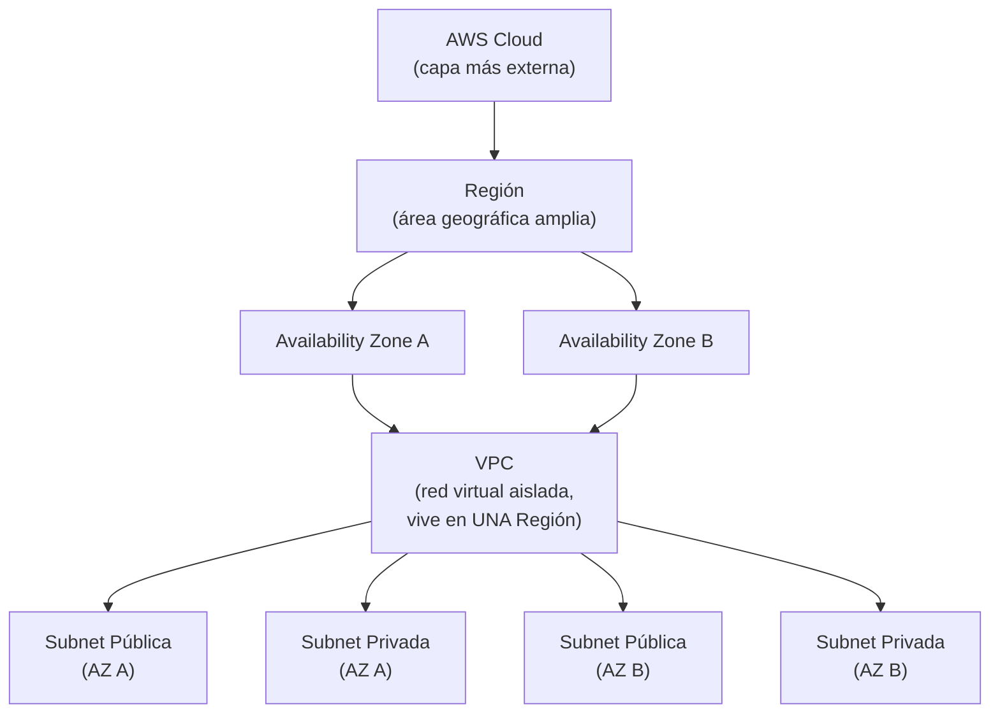
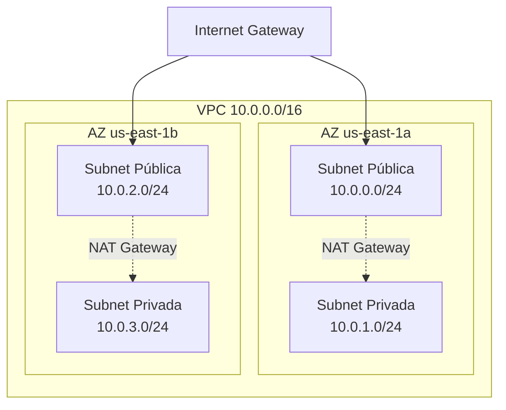
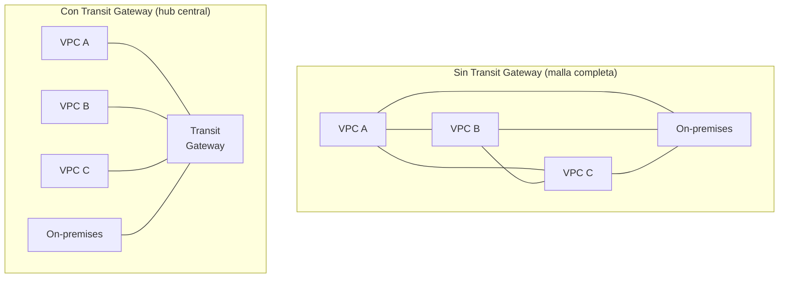
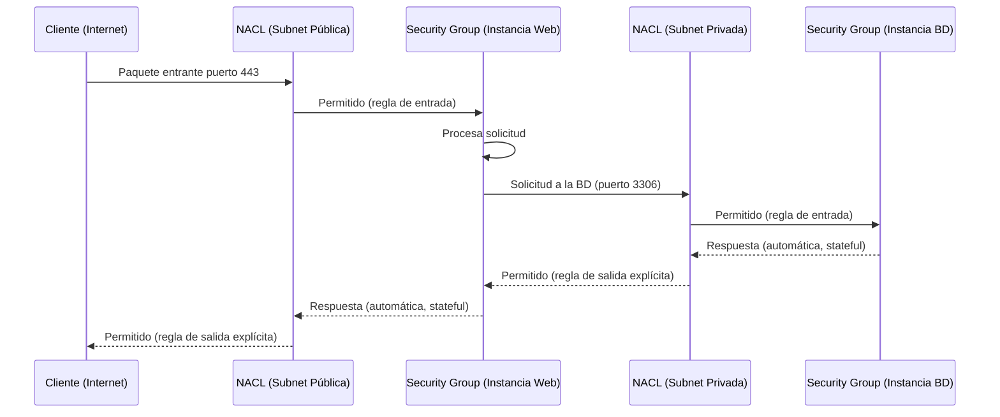
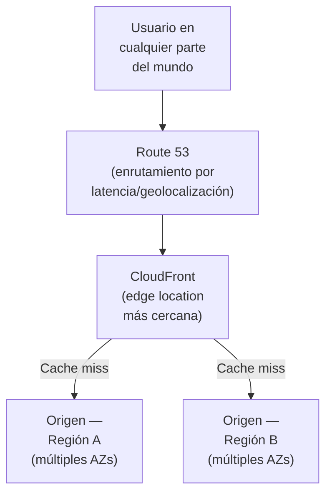
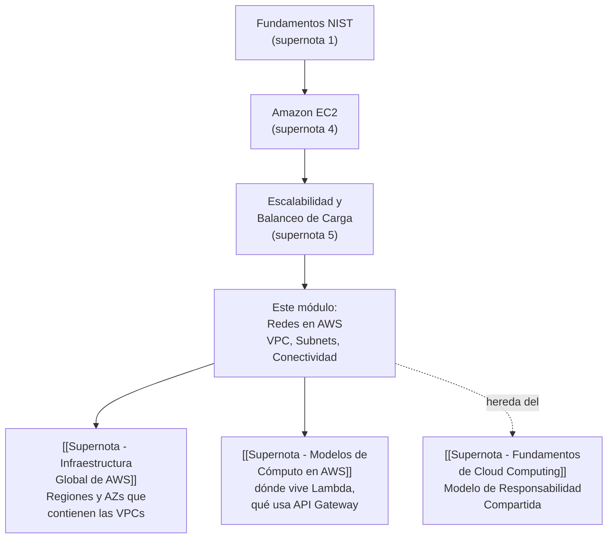

# Supernota: Redes en AWS Cloud — VPC, Subnets, Conectividad Híbrida y Edge Networking

> [!abstract] Resumen rápido del módulo
> Este módulo cubre los fundamentos de **networking en AWS**: cómo Amazon VPC provee una red virtual lógicamente aislada dentro de la nube de AWS, cómo las **subnets** (públicas y privadas) organizan los recursos dentro de esa red, qué **gateways** conectan la VPC con Internet o con redes externas (Internet Gateway, NAT Gateway, Virtual Private Gateway, Direct Connect, PrivateLink, Transit Gateway), cómo se protege el tráfico con **Security Groups** (con estado, a nivel de instancia) y **Network ACLs** (sin estado, a nivel de subnet), y cómo los servicios de **Edge Networking** (Route 53, CloudFront, Global Accelerator) acercan el contenido y mejoran el rendimiento para usuarios distribuidos globalmente. Se incluyen además dos laboratorios prácticos desarrollados paso a paso para poder recrearlos.

> [!note] Nivel de profundidad y modo "Supernota"
> Este módulo combina **diez resúmenes de lección** sobre networking en AWS (incluyendo dos ejercicios prácticos de laboratorio) en un solo documento. Se mantiene el estándar técnico profundo de las supernotas anteriores del vault. Por indicación explícita en esta sesión: (1) la sección de **Subnets** (§3) se desarrolla con **profundidad extendida**, más allá de lo que pedían los resúmenes originales; y (2) el contenido de **laboratorio** (§7) se trata con **contexto completo y pasos concretos para recrearlo**, en vez del tratamiento breve que se usaba en supernotas anteriores del vault para este tipo de contenido — este es un cambio de criterio a partir de este módulo.

---

## Índice de esta supernota
1. [[#1. Componentes de red en AWS Cloud — panorama general]]
2. [[#2. Amazon VPC en profundidad]]
3. [[#3. Subnets — explicación extendida]]
4. [[#4. Gateways internos de la VPC — Internet Gateway, NAT Gateway y Virtual Private Gateway]]
5. [[#5. Conectividad híbrida y entre VPCs]]
6. [[#6. Seguridad de red — Security Groups vs Network ACLs]]
7. [[#7. Laboratorios prácticos — cómo recrearlos paso a paso]]
8. [[#8. Edge Networking — Route 53, CloudFront y Global Accelerator]]
9. [[#9. Arquitecturas multi-Región y multi-VPC]]
10. [[#10. Conceptos complementarios]]
11. [[#11. Cómo se conecta este módulo con el resto del vault]]
12. [[#12. Preguntas para repasar]]
13. [[#13. Correcciones y verificación de datos]]
14. [[#14. Recursos recomendados]]
15. [[#15. Notas relacionadas del vault]]

---

## 1. Componentes de red en AWS Cloud — panorama general

Según los resúmenes originales, el networking en AWS involucra **dispositivos interconectados que intercambian datos y recursos**, con AWS proveyendo la infraestructura y los servicios para alojar aplicaciones y datos. Los componentes centrales de esta jerarquía, de mayor a menor alcance geográfico/lógico, son:

Ya se definieron **Región** y **Availability Zone (AZ)** en [[Supernota - Fundamentos de Cloud Computing]] (sección 12.2) — vale la pena precisar aquí la relación exacta con VPC: **una VPC vive dentro de una única Región**, pero se **extiende automáticamente a todas las Availability Zones de esa Región** — no hace falta "activarla" AZ por AZ. Lo que sí debe crearse explícitamente, AZ por AZ, son las **subnets** (sección 3), porque cada subnet individual **debe residir en una sola AZ** y no puede abarcar varias.

> [!important] Jerarquía que hay que memorizar
> AWS Cloud → Región → Availability Zone → VPC (vive en 1 Región, cubre todas sus AZs) → Subnet (vive en 1 sola AZ). Confundir estos niveles es un error común: la VPC no "vive" en una AZ, vive en la Región; son las subnets las que están ancladas a una AZ específica.

Los cinco componentes que el resumen original identifica como núcleo de esta lección son: **AWS Cloud, Regiones, Availability Zones, Amazon VPC y Subnets** — cada uno se desarrolla en detalle en las secciones siguientes.

---

## 2. Amazon VPC en profundidad

### 2.1 Definición oficial
Según la documentación oficial de AWS (verificada en `docs.aws.amazon.com/vpc`), **Amazon Virtual Private Cloud (Amazon VPC)** permite aprovisionar una **sección lógicamente aislada de la nube de AWS**, donde se pueden lanzar recursos de AWS dentro de una **red virtual que tú mismo defines**. Esta red virtual se asemeja mucho a una red tradicional que operarías en tu propio centro de datos, pero con los beneficios de la infraestructura escalable de AWS.

Esto coincide exactamente con lo señalado en el resumen original: la VPC es una **sección lógicamente aislada del AWS Cloud** dentro de la cual se lanzan recursos en una **red virtual definida por el usuario**.

### 2.2 ¿Qué se puede controlar dentro de una VPC?
Según la documentación oficial, al crear una VPC tienes control completo sobre:
- El **rango de direcciones IP** (bloque CIDR, ver sección 3.2).
- La creación de **subnets** (públicas, privadas, o solo-VPN).
- La configuración de **tablas de ruteo** (route tables).
- La configuración de **gateways de red** (Internet Gateway, NAT Gateway, Virtual Private Gateway — ver sección 4).
- Los **grupos de seguridad** y **listas de control de acceso** (ver sección 6).

### 2.3 VPC por defecto vs VPC personalizada
Un detalle técnico no mencionado en el resumen original, pero relevante en la práctica: si tu cuenta de AWS fue creada después de diciembre de 2013, **automáticamente viene con una VPC por defecto en cada Región**, ya configurada con una subnet por defecto en cada AZ, un Internet Gateway ya adjunto, y una ruta en la tabla principal que envía todo el tráfico a ese Internet Gateway — es decir, **todas las subnets de la VPC por defecto son públicas**. Esto es conveniente para empezar rápido, pero **no representa una buena práctica de arquitectura de producción**, donde normalmente se crea una VPC personalizada con una combinación deliberada de subnets públicas y privadas (exactamente lo que hacen los laboratorios de la sección 7).

### 2.4 Componentes de una VPC — mapa completo
La documentación oficial de AWS agrupa así los elementos configurables de una VPC:

| Componente | Función |
|---|---|
| **CIDR block** | El rango de direcciones IP (IPv4 y/o IPv6) de toda la VPC |
| **Subnets** | Subdivisiones de ese rango, ancladas a una AZ (ver sección 3) |
| **Route tables** | Determinan hacia dónde se dirige el tráfico saliente de cada subnet o gateway |
| **Gateways** | Conectan la VPC con otra red (Internet Gateway → Internet; Virtual Private Gateway → red privada; ver sección 4) |
| **VPC endpoints** | Conectan de forma privada con servicios de AWS, sin pasar por Internet Gateway ni NAT (ver sección 10.2) |
| **Peering connections** | Enrutan tráfico entre los recursos de dos VPCs distintas (ver sección 10.1) |
| **Security Groups / Network ACLs** | Capas de seguridad para controlar el tráfico (ver sección 6) |

---

## 3. Subnets — explicación extendida

> [!note] Ampliación solicitada
> Esta sección se desarrolla con mayor profundidad de la que pedían los resúmenes originales, por solicitud explícita — es el concepto más importante de todo el módulo y el que más aparece en preguntas de examen.

### 3.1 Definición precisa
Según la documentación oficial de AWS, una **subnet** es un **rango de direcciones IP dentro de tu VPC**. Una subnet **debe residir en una única Availability Zone** — no puede extenderse entre AZs. Después de crear subnets, puedes desplegar recursos de AWS (instancias EC2, bases de datos, balanceadores de carga) dentro de ellas.

Los resúmenes originales agregan el propósito funcional: las subnets **dividen una VPC en segmentos más pequeños** para **agrupar recursos según su función o necesidades de seguridad y operación** (por ejemplo, separar la capa web de la capa de base de datos), y pueden clasificarse como **públicas** o **privadas**.

### 3.2 CIDR — la base matemática de toda subnet
Antes de entender cómo se dividen las subnets, hay que entender el bloque **CIDR** (*Classless Inter-Domain Routing*) que las define. Un CIDR se escribe como `dirección-IP/prefijo` — por ejemplo, `10.0.0.0/16`.

- El número después de la barra (`/16`) indica cuántos bits del total de 32 (en IPv4) están **fijos** para identificar la red; los bits restantes están disponibles para direcciones individuales dentro de ese rango.
- Un `/16` deja 16 bits libres → 2¹⁶ = **65,536 direcciones IP** en total para toda la VPC.
- Si de esa VPC `/16` se reparten subnets `/24` (deja 8 bits libres → 2⁸ = 256 direcciones cada una), la VPC podría alojar hasta 256 subnets de ese tamaño.

**Ejemplo numérico concreto** (el mismo usado en el laboratorio de la sección 7):

| Recurso | CIDR | Direcciones IP totales | AZ |
|---|---|---|---|
| VPC | `10.0.0.0/16` | 65,536 | (toda la Región) |
| Subnet pública 1 | `10.0.0.0/24` | 256 | us-east-1a |
| Subnet privada 1 | `10.0.1.0/24` | 256 | us-east-1a |
| Subnet pública 2 | `10.0.2.0/24` | 256 | us-east-1b |
| Subnet privada 2 | `10.0.3.0/24` | 256 | us-east-1b |

> [!warning] Direcciones IP "perdidas" en cada subnet — un detalle que casi nadie explica bien
> De las 256 direcciones de una subnet `/24`, AWS **reserva 5 direcciones que no puedes asignar a ningún recurso**, sin importar el tamaño de la subnet:
> - `.0` → dirección de red (network address).
> - `.1` → reservada para el router de la VPC.
> - `.2` → reservada para el DNS de AWS (Amazon-provided DNS).
> - `.3` → reservada para uso futuro de AWS.
> - `.255` (la última) → dirección de broadcast, reservada aunque AWS no soporta broadcast dentro de una VPC.
> Esto significa que una subnet `/24` en realidad solo tiene **251 direcciones IP utilizables**, no 256 — un cálculo que suele aparecer en preguntas de examen y en errores de dimensionamiento de subnets muy pequeñas (ej. un `/28` de 16 direcciones totales solo deja 11 utilizables).

### 3.3 El malentendido más común: "pública" y "privada" NO son un atributo de la subnet
Este es probablemente el punto más importante de toda la sección, y algo que los resúmenes originales no aclaran explícitamente:

> [!important] Lo que realmente determina si una subnet es pública o privada
> Una subnet **no tiene un interruptor interno** que diga "soy pública" o "soy privada". AWS no almacena ese atributo en la subnet misma. Lo que determina si una subnet es pública o privada es **enteramente su tabla de rutas (route table)**:
> - Si la tabla de rutas asociada a la subnet tiene una ruta `0.0.0.0/0 → Internet Gateway`, la subnet es efectivamente **pública** — cualquier recurso con IP pública dentro de ella puede alcanzar Internet directamente.
> - Si la tabla de rutas **no tiene** esa ruta (o dirige `0.0.0.0/0` hacia un NAT Gateway en vez de un Internet Gateway), la subnet es efectivamente **privada**.
> En otras palabras: **"público" y "privado" son el resultado de una decisión de enrutamiento, no una propiedad fija del recurso.** Esto explica por qué, técnicamente, puedes "convertir" una subnet privada en pública simplemente cambiando su tabla de rutas — la subnet en sí no cambió, cambió su enrutamiento.

### 3.4 Subnets públicas
Definidas en el resumen original como aquellas que dan **acceso directo a Internet** a los recursos que alojan (ej. sitios web orientados al cliente), mediante un **Internet Gateway** (ver sección 4.1).

**Características típicas de una subnet pública bien configurada:**
- Su tabla de rutas incluye `0.0.0.0/0 → igw-xxxxxxxx`.
- Los recursos que necesiten ser alcanzables desde Internet deben tener además una **IP pública** o **Elastic IP** asignada (la ruta a un IGW por sí sola no es suficiente sin una IP pública en la instancia).
- Casos de uso típicos: balanceadores de carga orientados a Internet, servidores web/API públicos, bastion hosts (ver sección 10.4).

### 3.5 Subnets privadas
Definidas en el resumen original como aquellas que **aíslan recursos que no deben exponerse a Internet**, como bases de datos.

**Características típicas de una subnet privada bien configurada:**
- Su tabla de rutas **no** tiene una ruta directa a un Internet Gateway.
- Puede tener una ruta `0.0.0.0/0 → NAT Gateway` (ver sección 4.2) si los recursos necesitan salida a Internet para actualizaciones o llamadas a APIs externas, pero sin ser alcanzables desde afuera.
- Puede no tener ninguna ruta hacia Internet en absoluto — a esta variante se le suele llamar **subnet aislada (isolated subnet)**, útil para recursos con requisitos de cumplimiento estrictos que no deben tener ninguna vía de salida a Internet, ni siquiera saliente.
- Casos de uso típicos: bases de datos (Amazon RDS), servidores de aplicación internos, cachés (ElastiCache), cualquier recurso de "backend" que solo debe ser alcanzado por otros recursos dentro de la VPC.

### 3.6 Subnet solo-VPN (VPN-only subnet) — variante adicional
No mencionada en los resúmenes originales, pero parte del marco formal de AWS: existe una tercera categoría conceptual, la **subnet solo-VPN**, cuya tabla de rutas dirige el tráfico externo únicamente a través de un **Virtual Private Gateway** (sección 4.3) en vez de un Internet Gateway o NAT Gateway — es decir, solo es alcanzable desde una red privada conectada por VPN, nunca desde Internet público en general.

### 3.7 Alta disponibilidad — por qué siempre se crean subnets "en pares" por AZ
Tanto el resumen original como los laboratorios (sección 7) insisten en crear subnets **públicas y privadas replicadas en al menos dos Availability Zones**. La razón técnica: si toda tu infraestructura vive en subnets de una sola AZ y esa AZ sufre una interrupción, tu aplicación completa deja de estar disponible. Al replicar el patrón (subnet pública + privada) en una segunda AZ, un servicio como un Auto Scaling Group o un Load Balancer (ver [[Escalabilidad, Balanceo de Carga y Mensajería en AWS]]) puede seguir sirviendo tráfico usando los recursos de la AZ que sigue funcionando — el mismo principio de resiliencia visto en [[Resiliencia y Diseño para el Fallo]] aplicado específicamente al diseño de red.

### 3.8 Auto-asignación de IP pública — un detalle de configuración clave
Los laboratorios de la sección 7 mencionan explícitamente un atributo de configuración por subnet que suele pasarse por alto: **cada subnet tiene un ajuste de "auto-asignar IP pública"** (`Auto-assign public IPv4 address`), independiente de su tabla de rutas.
- En las subnets **públicas**, este ajuste normalmente se **activa**, para que cualquier instancia EC2 lanzada ahí reciba automáticamente una IP pública sin configuración manual adicional.
- En las subnets **privadas**, este ajuste se **desactiva**, para evitar que una instancia termine con una IP pública por error, incluso si en algún momento la tabla de rutas cambiara.

> [!tip] Los dos requisitos independientes para que un recurso sea alcanzable desde Internet
> Hace falta que se cumplan **ambas** condiciones simultáneamente: (1) la subnet debe tener una ruta a un Internet Gateway en su tabla de rutas, **y** (2) el recurso específico debe tener una IP pública o Elastic IP asignada. Falta cualquiera de las dos y el recurso no será alcanzable desde Internet — un error de diagnóstico muy común es revisar solo una de las dos condiciones.

---

## 4. Gateways internos de la VPC — Internet Gateway, NAT Gateway y Virtual Private Gateway

### 4.1 Internet Gateway (IGW)
Según la documentación oficial de AWS, un **Internet Gateway** es un componente de VPC horizontalmente escalado, redundante y de alta disponibilidad, que permite la comunicación **bidireccional** entre los recursos de una VPC e Internet.

- Se **adjunta a nivel de VPC completa** (no a una subnet específica) — exactamente **un** Internet Gateway por VPC.
- No tiene costo adicional por sí mismo (solo se paga por el tráfico saliente que cursa a través de él).
- Habilita tráfico **de entrada y de salida**: instancias con IP pública pueden recibir conexiones iniciadas desde Internet, y también iniciar conexiones salientes.
- Técnicamente realiza una traducción **NAT uno-a-uno** entre la IP privada del recurso y su IP pública asociada.

### 4.2 NAT Gateway
Según la documentación oficial de AWS, un **NAT Gateway** es un servicio de **Network Address Translation (NAT)** gestionado por AWS, que permite que instancias en una subnet **privada** se conecten a servicios fuera de la VPC (Internet u otras redes), **pero sin que servicios externos puedan iniciar una conexión hacia esas instancias**.

**Diferencia clave con el Internet Gateway (tabla comparativa):**

| | **Internet Gateway** | **NAT Gateway** |
|---|---|---|
| Dirección del tráfico | Bidireccional (entrada y salida) | Solo saliente (egress-only) — el exterior no puede iniciar conexión |
| A qué se asocia | A la VPC completa | Se despliega dentro de una subnet **pública** específica |
| Para qué subnets sirve | Subnets públicas | Habilita salida a Internet para subnets **privadas** |
| Traducción de direcciones | NAT uno-a-uno (una IP privada ↔ una IP pública) | NAT muchos-a-uno (múltiples IPs privadas comparten una sola IP pública/Elastic IP de salida) |
| Costo | Sin costo adicional propio | Se cobra por hora de uso y por GB procesado |
| Rendimiento | N/A (es un componente lógico) | Escala automáticamente hasta 45 Gbps de ancho de banda |

**Tipos de NAT Gateway** (detalle no cubierto en el resumen original, verificado en documentación oficial):
- **NAT Gateway público** (el más común): vive en una subnet pública, requiere una Elastic IP, y enruta el tráfico saliente hacia el Internet Gateway de la VPC.
- **NAT Gateway privado**: no tiene Elastic IP ni acceso a Internet — se usa para traducir direcciones **entre VPCs o hacia una red on-premises** cuando los rangos de IP se superponen (overlapping CIDRs), enrutando a través de un Transit Gateway o Virtual Private Gateway (ver sección 5).

> [!tip] NAT Gateway vs NAT Instance
> Antes de que existiera el NAT Gateway gestionado, la única opción era una **NAT Instance**: una instancia EC2 común configurada manualmente para hacer la misma función. Hoy en día AWS recomienda casi siempre usar NAT Gateway, porque es un servicio completamente gestionado (sin parches, sin punto único de falla, escalado automático), mientras que una NAT Instance requiere que tú mismo gestiones su disponibilidad, tamaño y actualizaciones — la única razón real para preferir una NAT Instance hoy es un caso de uso de muy bajo tráfico y presupuesto extremadamente ajustado, o la necesidad de usarla también como bastion host (sección 10.4), algo que un NAT Gateway no puede hacer.

### 4.3 Virtual Private Gateway (VGW)
Definido en los resúmenes originales como el componente que **habilita conexiones VPN seguras** entre una VPC y redes privadas externas (ej. la red corporativa on-premises). Las VPNs **cifran el tráfico**, creando un túnel seguro para que los datos viajen de forma protegida hacia la VPC.

- Es el lado "AWS" de una conexión **Site-to-Site VPN** (ver sección 5.2) — el lado del cliente se llama **Customer Gateway**.
- A diferencia del Internet Gateway, el Virtual Private Gateway **no** da acceso a Internet en general — solo habilita el túnel cifrado hacia la red privada específica que se configuró en el otro extremo.

---

## 5. Conectividad híbrida y entre VPCs

Los resúmenes originales cubren cuatro servicios principales de conectividad, más dos servicios de gateway adicionales — se presentan aquí organizados por su propósito, con una comparativa final.

### 5.1 AWS Client VPN
Servicio de VPN **totalmente gestionado y elástico** que conecta **trabajadores remotos individuales** (no redes completas) y usuarios en movimiento hacia los recursos de la nube de AWS.
- Escala automáticamente según la demanda de usuarios conectados.
- Ofrece autenticación avanzada (Active Directory, autenticación basada en certificados, SAML federado) y acceso remoto seguro.
- **Caso de uso típico**: empleados individuales trabajando desde casa o en tránsito que necesitan acceder a recursos internos de la VPC, de forma similar a como usarían una VPN corporativa tradicional.

### 5.2 AWS Site-to-Site VPN
Establece conexiones **seguras y cifradas** (usando el protocolo **IPsec**) entre **redes on-premises completas** (centros de datos, oficinas remotas) y VPCs de AWS — no usuarios individuales, sino **red-a-red**.
- Útil para migración de aplicaciones y comunicación segura entre ubicaciones remotas, con alta disponibilidad.
- El tráfico viaja sobre Internet público (aunque cifrado dentro del túnel IPsec), por lo que su ancho de banda depende de la conexión a Internet local — puede sufrir variabilidad de rendimiento en momentos de alto uso.
- Se conecta del lado AWS a través de un **Virtual Private Gateway** (sección 4.3) o un **Transit Gateway** (sección 5.4).

> [!note] Client VPN vs Site-to-Site VPN — la diferencia que más se pregunta en examen
> **Client VPN** conecta **usuarios/dispositivos individuales** de forma remota (como una VPN de trabajo tradicional en tu laptop). **Site-to-Site VPN** conecta **redes completas** entre sí (tu centro de datos entero con tu VPC entera) — no es algo que un usuario individual "abra" en su computadora, es una conexión permanente entre infraestructuras.

### 5.3 AWS Direct Connect
Provee una **conexión privada y dedicada** (fibra física) entre tu centro de datos y AWS, evitando por completo la Internet pública.
- **Reduce costos de red** (el tráfico de salida por Direct Connect suele ser más económico que por Internet) y **aumenta el ancho de banda** de forma consistente.
- Ideal para: aplicaciones sensibles a la latencia, transferencias de datos a gran escala, arquitecturas de nube híbrida que requieren rendimiento consistente y predecible.

> [!warning] Un matiz importante que el resumen original no menciona: Direct Connect NO está cifrado por defecto
> A diferencia de una VPN (que cifra el tráfico mediante IPsec por diseño), una conexión **Direct Connect por sí sola transmite el tráfico en texto plano** sobre la fibra dedicada — su seguridad viene de ser un enlace **físicamente privado y dedicado**, no de cifrado criptográfico. Si se requiere cifrado además de la conexión dedicada (por cumplimiento normativo, por ejemplo), existen dos opciones verificadas en la documentación oficial de AWS: (1) superponer un túnel de **Site-to-Site VPN sobre la conexión Direct Connect**, o (2) usar **MACsec** (cifrado a nivel de enlace, disponible en puertos dedicados de 10 Gbps y 100 Gbps).

### 5.4 AWS Transit Gateway
Según la documentación oficial de AWS, **AWS Transit Gateway** es un **hub de tránsito de red** usado para interconectar múltiples VPCs y redes on-premises entre sí, a través de un **punto central** — en vez de que cada VPC necesite una conexión punto-a-punto individual con cada otra VPC (lo que se vuelve inmanejable a escala).

- Permite conectar hasta miles de VPCs y redes on-premises a través de un único gateway, simplificando drásticamente la arquitectura de red a escala (evitando el problema de "malla completa" ilustrado arriba, y las limitaciones de enrutamiento transitivo del VPC Peering tradicional — ver sección 10.1).
- Se integra con AWS Site-to-Site VPN y AWS Direct Connect para extender de forma segura la red privada hacia AWS.
- Soporta **peering entre Transit Gateways** (incluso entre distintas Regiones), permitiendo compartir recursos globalmente.

### 5.5 AWS PrivateLink
Provee conexiones **privadas y escalables** entre tu VPC y servicios o recursos ubicados en otras VPCs (o servicios de AWS, o servicios SaaS de terceros), **sin usar IPs públicas ni un Internet Gateway**.
- Simplifica la gestión y asegura el tráfico controlando específicamente qué endpoints/APIs son accesibles desde tu VPC.
- Técnicamente funciona creando **VPC endpoints de tipo interfaz** dentro de tu VPC (una interfaz de red elástica con IP privada) que actúa como punto de entrada privado al servicio del otro lado.
- **Diferencia clave con VPC Peering**: PrivateLink da acceso **unidireccional** a un servicio específico (el consumidor puede iniciar la conexión, no al revés) y **no requiere que los rangos CIDR de ambas VPCs sean compatibles** (evita conflictos de IP superpuestas) — mientras que VPC Peering da conectividad de red completa bidireccional entre dos VPCs enteras.

### 5.6 Servicios de gateway adicionales (mención breve del resumen original)
- **AWS Transit Gateway**: ya cubierto en 5.4.
- **NAT Gateway**: ya cubierto en 4.2.
- **Amazon API Gateway**: gestiona APIs completas — su creación, publicación y aseguramiento a cualquier escala. A diferencia de los demás servicios de esta sección (que operan a nivel de red/IP), API Gateway opera a nivel de **capa de aplicación**, exponiendo endpoints HTTP/REST/WebSocket gestionados — normalmente el punto de entrada de una arquitectura de [[Microservicios Nativos en la Nube]] o de una función [[Supernota - Modelos de Cómputo en AWS (No Gestionado, Gestionado y Serverless)|serverless (AWS Lambda)]].

### 5.7 Tabla comparativa de conectividad híbrida

| Servicio | Qué conecta | Cifrado | Ancho de banda | Caso de uso ideal |
|---|---|---|---|---|
| **Client VPN** | Usuario individual ↔ VPC | Sí (VPN) | Variable, depende de Internet | Trabajadores remotos |
| **Site-to-Site VPN** | Red completa ↔ VPC | Sí (IPsec) | Variable, depende de Internet | Conexión rápida de red completa, respaldo/failover |
| **Direct Connect** | Red completa ↔ VPC (fibra dedicada) | No, por defecto | Alto y consistente (hasta 100 Gbps por puerto) | Transferencias masivas, baja latencia garantizada |
| **Transit Gateway** | Múltiples VPCs + on-premises entre sí | Depende del transporte subyacente | Hasta 50 Gbps agregados de VPN con ECMP | Arquitecturas a gran escala con muchas VPCs |
| **PrivateLink** | Un servicio específico entre VPCs | Privado (no viaja por Internet) | N/A (por servicio) | Exponer/consumir un servicio puntual sin dar acceso de red completo |

> [!tip] VPN + Direct Connect combinados — no son mutuamente excluyentes
> Los resúmenes originales señalan que **VPN y Direct Connect pueden combinarse** para lograr *failover* (la VPN sirve como respaldo automático si la conexión Direct Connect falla) y **mayor ancho de banda agregado** (varias conexiones Direct Connect en paralelo). Esto es una práctica estándar de arquitecturas híbridas críticas: Direct Connect como ruta principal de alto rendimiento, y una VPN Site-to-Site como plan de contingencia de menor rendimiento pero rápida de activar.

---

## 6. Seguridad de red — Security Groups vs Network ACLs

Este es, junto con las subnets, el tema con más peso en preguntas de examen sobre networking de AWS — se verificó cada afirmación contra la documentación oficial de AWS (`docs.aws.amazon.com/vpc/latest/userguide/vpc-network-acls.html`).

### 6.1 La analogía del resumen original
El material original describe la VPC como una **fortaleza segura**, donde el tráfico se controla mediante gateways y herramientas de seguridad como firewalls. Dentro de esa fortaleza:
- Los **Network ACLs** funcionan como el **control de pasaportes**: revisan cada paquete que entra o sale de una **subnet**, comparándolo contra una lista de reglas permitidas o denegadas, sin memoria de paquetes anteriores.
- Los **Security Groups** funcionan como el **portero de un edificio individual**: controlan el tráfico entrante de una **instancia EC2 específica** (u otro recurso), y sí recuerdan la conexión, permitiendo automáticamente el tráfico de retorno.

### 6.2 Tabla comparativa completa (verificada contra documentación oficial)

| Característica | **Security Group** | **Network ACL (NACL)** |
|---|---|---|
| Nivel de aplicación | Instancia / recurso individual (ENI) | Subnet completa |
| Con o sin estado | **Con estado (stateful)**: si permites tráfico entrante, el tráfico de respuesta se permite automáticamente, sin importar las reglas de salida | **Sin estado (stateless)**: cada paquete se evalúa de forma independiente; el tráfico de respuesta debe permitirse explícitamente con su propia regla |
| Tipos de regla | Solo reglas de **permitir** (todo lo no permitido se deniega implícitamente) | Reglas de **permitir y denegar** explícitas |
| Orden de evaluación | Se evalúan **todas** las reglas antes de decidir; el orden no importa | Se evalúan en **orden numérico ascendente**; la primera regla que coincide se aplica y se detiene la evaluación |
| Cuántos por recurso | Una instancia puede tener **varios** Security Groups asociados | Una subnet solo puede tener **un** NACL asociado a la vez (aunque un mismo NACL puede asociarse a varias subnets) |
| Configuración por defecto | El Security Group por defecto de una VPC permite todo el tráfico saliente y todo el tráfico entrante desde recursos con el mismo grupo | El NACL por defecto de una VPC permite **todo** el tráfico IPv4 e IPv6, entrante y saliente |
| Capa de defensa | Primera línea de defensa a nivel de recurso | Capa adicional de defensa a nivel de subnet (*defense in depth*) |

### 6.3 Por qué el carácter "sin estado" de los NACLs es más complejo de lo que parece
Este es el punto que más confunde en la práctica, y donde vale la pena un ejemplo numérico concreto:

**Ejemplo**: un usuario en Internet quiere acceder a un servidor web en el puerto 443 (HTTPS) dentro de una subnet pública.
1. El paquete de solicitud entra a la subnet → el **NACL** revisa su regla de entrada: ¿hay una regla que permita tráfico entrante en el puerto 443 desde `0.0.0.0/0`? Si sí, el paquete pasa.
2. El paquete llega a la instancia → el **Security Group** revisa su regla de entrada: ¿hay una regla que permita el puerto 443? Si sí, el paquete llega a la aplicación.
3. La aplicación genera una respuesta → el **Security Group**, al ser con estado, **automáticamente permite** esa respuesta de salida, sin necesitar una regla explícita de salida.
4. Pero el paquete de respuesta, al **salir de la subnet**, vuelve a pasar por el **NACL** — y como el NACL **no tiene memoria** de que este paquete es "la respuesta" a algo que él mismo permitió entrar, necesita una **regla de salida explícita** que permita el tráfico en el **puerto efímero** (*ephemeral port*, normalmente el rango 1024-65535) que el cliente usó como origen — de lo contrario, la respuesta se bloquea y la conexión falla, aunque el Security Group haya hecho todo correctamente.

> [!warning] El error más común al configurar NACLs personalizados
> Es muy común que alguien configure un NACL personalizado que permite el tráfico entrante en el puerto 443, pero **olvide** agregar la regla de salida correspondiente para el rango de puertos efímeros — el resultado es una conexión que "entra" pero nunca "recibe respuesta", un síntoma confuso de diagnosticar si no se entiende el carácter *stateless* del NACL. Por esta razón, la recomendación estándar de AWS es: **usa Security Groups como tu mecanismo principal de control** (son más simples y menos propensos a este tipo de error), y usa NACLs personalizados solo como una **capa adicional** para necesidades específicas (bloquear una IP maliciosa concreta a nivel de subnet completa, por ejemplo, algo que un Security Group no puede hacer porque solo soporta reglas de permitir).

### 6.4 Recorrido de un paquete a través de ambas capas
El resumen original describe que, cuando un paquete viaja de una instancia a otra **entre distintas subnets**, pasa por Security Groups y NACLs **en cada frontera** que cruza:

### 6.5 Conexión con el Modelo de Responsabilidad Compartida
Los resúmenes originales señalan explícitamente que **asegurar las subnets con Network ACLs y Security Groups es responsabilidad del cliente**, bajo el [[Supernota - Fundamentos de Cloud Computing#8. Modelo de Responsabilidad Compartida (seguridad)|Modelo de Responsabilidad Compartida]] ya cubierto en la primera supernota del vault. Esto es consistente con el principio general visto ahí: la **configuración de acceso y reglas de tráfico** siempre recae en el cliente, sin importar cuánta infraestructura física gestione AWS.

---

## 7. Laboratorios prácticos — cómo recrearlos paso a paso

> [!note] Tratamiento especial para este tipo de contenido
> A partir de este módulo, el contenido de laboratorio se documenta con **contexto completo y pasos concretos para recrearlo** en la consola de AWS, en vez de un resumen breve. Los dos laboratorios de los resúmenes originales son, en esencia, **el mismo ejercicio práctico** (crear una VPC funcional con subnets públicas/privadas, Internet Gateway, tablas de rutas y controles de seguridad usando la AWS Management Console) — se combinan aquí en una sola guía coherente y completa.

### 7.1 Objetivo del laboratorio
Construir, desde cero y usando la **AWS Management Console**, una VPC funcional con alta disponibilidad: dos subnets públicas y dos subnets privadas repartidas en dos Availability Zones, con Internet Gateway, tablas de rutas correctamente asociadas, y una introducción a la configuración de Security Groups y Network ACLs — el mismo patrón arquitectónico ilustrado en el diagrama de la sección 3.7.

### 7.2 Valores concretos usados en este laboratorio

| Recurso | Valor |
|---|---|
| Región | La que elijas (ej. `us-east-1`) |
| CIDR de la VPC | `10.0.0.0/16` |
| Subnet pública 1 | `10.0.0.0/24` — AZ `us-east-1a` |
| Subnet privada 1 | `10.0.1.0/24` — AZ `us-east-1a` |
| Subnet pública 2 | `10.0.2.0/24` — AZ `us-east-1b` |
| Subnet privada 2 | `10.0.3.0/24` — AZ `us-east-1b` |

### 7.3 Pasos para recrear el laboratorio

**Paso 1 — Crear la VPC**
1. En la consola de AWS, ve al servicio **VPC** → **Your VPCs** → **Create VPC**.
2. Elige **VPC only** (creación manual, componente por componente — para entender cada pieza; alternativamente, la consola actual también ofrece un asistente **"VPC and more"** que automatiza todos los pasos siguientes de una sola vez, útil una vez que ya entiendes qué hace cada componente).
3. Define el nombre y el bloque CIDR IPv4: `10.0.0.0/16`.
4. Confirma la creación. En este punto tienes una VPC vacía, sin subnets ni gateways — como una "sección aislada" (sección 2.1) todavía sin estructura interna.

**Paso 2 — Crear las cuatro subnets**
1. Ve a **Subnets** → **Create subnet**, selecciona la VPC recién creada.
2. Crea las cuatro subnets de la tabla 7.2, cada una en la AZ indicada, con su bloque CIDR correspondiente (recuerda: cada bloque `/24` cabe exactamente dentro del `/16` de la VPC — ver la aritmética CIDR de la sección 3.2).
3. Para las **subnets públicas**, edita el atributo **"Enable auto-assign public IPv4 address"** y actívalo (ver sección 3.8) — así cualquier instancia EC2 lanzada ahí recibirá IP pública automáticamente.
4. Para las **subnets privadas**, deja ese atributo desactivado.

**Paso 3 — Crear y adjuntar el Internet Gateway**
1. Ve a **Internet Gateways** → **Create internet gateway**, ponle un nombre y créalo (nace "desasociado" de cualquier VPC).
2. Selecciónalo → **Actions** → **Attach to VPC** → elige la VPC del Paso 1.
3. En este punto el IGW existe y está adjunto, pero **todavía ninguna subnet lo usa** — hace falta el Paso 4 para que efectivamente conecte algo a Internet (recordando el principio de la sección 3.3: la "publicidad" de una subnet depende de su tabla de rutas, no de que el IGW simplemente exista).

**Paso 4 — Crear la tabla de rutas pública y asociarla**
1. Ve a **Route Tables** → **Create route table**, nómbrala (ej. `rt-publica`) y asígnala a la VPC.
2. Edítala → **Edit routes** → **Add route**: destino `0.0.0.0/0`, target = el Internet Gateway del Paso 3.
3. Ve a la pestaña **Subnet associations** → **Edit subnet associations** → marca las **dos subnets públicas** (1 y 2 de la tabla 7.2).
4. A partir de este momento, esas dos subnets son efectivamente públicas — cualquier instancia con IP pública ahí puede alcanzar y ser alcanzada desde Internet.

**Paso 5 (opcional pero recomendado) — Crear un NAT Gateway y la tabla de rutas privada**
1. Ve a **NAT Gateways** → **Create NAT gateway**. Debe crearse **dentro de una subnet pública** (ver sección 4.2) — elige la subnet pública 1.
2. Asígnale una **Elastic IP** nueva.
3. Crea una segunda tabla de rutas (ej. `rt-privada`), agrega una ruta `0.0.0.0/0 → nat-xxxxxxxx` (el NAT Gateway recién creado).
4. Asocia esta tabla de rutas a las **dos subnets privadas**. Ahora las instancias en subnets privadas pueden salir a Internet (para descargar actualizaciones, por ejemplo) pero siguen sin ser alcanzables desde afuera.

**Paso 6 — Configurar Security Groups**
1. Ve a **Security Groups** → **Create security group**, dentro de la VPC del laboratorio.
2. Ejemplo para un servidor web (`sg-web`): regla de entrada que permita el puerto 443 (HTTPS) y 80 (HTTP) desde `0.0.0.0/0`; regla de entrada que permita el puerto 22 (SSH) solo desde tu IP específica (nunca desde `0.0.0.0/0` en un entorno real). La regla de salida por defecto (permitir todo) normalmente se deja así, salvo que el caso de uso exija restringirla.
3. Ejemplo para una base de datos (`sg-db`): regla de entrada que permita el puerto correspondiente (ej. 3306 para MySQL) **solo desde el `sg-web`** como origen (no desde una IP o CIDR) — esta es la práctica recomendada de "encadenar" Security Groups por capa, mencionada también en [[Supernota - Valor de Negocio de la Nube y Casos de Estudio]] al hablar de arquitecturas de varias capas.

**Paso 7 (opcional) — Configurar un Network ACL personalizado**
1. Ve a **Network ACLs** → **Create network ACL**, asígnalo a la VPC.
2. Agrega reglas de entrada (ej. regla 100: permitir 443 desde `0.0.0.0/0`) y, crucialmente, la regla de **salida correspondiente** para el rango de puertos efímeros (regla 100: permitir salida en el rango 1024-65535 hacia `0.0.0.0/0`) — recordando el ejemplo detallado de la sección 6.3, este paso es el que más se olvida.
3. Asocia el NACL a la subnet pública deseada.

**Paso 8 — Verificar**
- Lanza una instancia EC2 de prueba en la subnet pública con el `sg-web`: debería ser alcanzable por HTTP/HTTPS desde tu navegador.
- Lanza una segunda instancia en la subnet privada: no debería tener IP pública, y debería poder alcanzar Internet saliente (ej. `ping 8.8.8.8` o una descarga de paquete) únicamente si configuraste el NAT Gateway del Paso 5.

### 7.4 Qué demuestra este laboratorio, conceptualmente
Este ejercicio conecta directamente casi todo lo cubierto en las secciones 2 a 6: la VPC como contenedor lógico (§2), la aritmética CIDR y la distinción pública/privada basada en tablas de rutas (§3), el rol específico del Internet Gateway y el NAT Gateway (§4), y las dos capas de seguridad trabajando juntas (§6) — es, en la práctica, el ejercicio mínimo necesario para levantar cualquier arquitectura de aplicación de varias capas (*multi-tier*) en AWS de forma segura.

---

## 8. Edge Networking — Route 53, CloudFront y Global Accelerator

### 8.1 Amazon Route 53 — DNS y enrutamiento de tráfico
Según la documentación oficial de AWS, **Amazon Route 53** es un servicio de **Domain Name System (DNS)** altamente disponible y escalable, que traduce nombres de dominio legibles por humanos (ej. `example.com`) a direcciones IP que las computadoras usan para localizar sitios web — y además permite **registrar nombres de dominio** directamente.

**Políticas de enrutamiento (routing policies)** — el resumen original menciona cuatro: *latency-based*, *geolocation*, *geoproximity* y *"weighted round robin"*. La documentación oficial de AWS define en realidad **ocho políticas de enrutamiento** formales (ver sección 13, correcciones):

| Política oficial | Qué hace |
|---|---|
| **Simple** | Enruta todo el tráfico a un único recurso — la política por defecto para casos sin necesidades especiales |
| **Weighted** | Distribuye el tráfico entre varios recursos según **pesos** que tú defines (ej. 80% a producción, 20% a staging) — útil para pruebas A/B o despliegues graduales |
| **Latency-based** | Enruta al usuario hacia la Región de AWS que ofrece la **menor latencia** medida, entre varias Regiones donde tengas el mismo recurso desplegado |
| **Failover** | Configura una relación **activo-pasivo**: todo el tráfico va al recurso primario mientras esté saludable; si falla el chequeo de salud, cambia automáticamente al recurso secundario |
| **Geolocation** | Enruta según la **ubicación geográfica del usuario** (país, continente) — útil para cumplimiento normativo o contenido localizado por región |
| **Geoproximity** | Enruta según la **ubicación de tus recursos**, con la posibilidad de desplazar tráfico deliberadamente de una ubicación a otra usando un valor de "bias" |
| **Multivalue Answer** | Devuelve hasta ocho registros saludables elegidos al azar por consulta — similar a un round-robin simple, pero con chequeos de salud incorporados |
| **IP-based** | Enruta según los rangos de IP de origen del cliente, definidos por ti mismo (ej. para dirigir el tráfico de un proveedor de Internet específico hacia un endpoint optimizado para esa red) |

> [!tip] Cómo diferenciar Latency-based de Geolocation (fuente de confusión común)
> **Latency-based** optimiza el rendimiento midiendo la latencia real de red — puede enviar a un usuario en Brasil hacia una Región de EE.UU. si esa resulta tener mejor latencia que una Región sudamericana en ese momento. **Geolocation** ignora la latencia por completo y sigue **reglas geográficas fijas** que tú configuras — por ejemplo, "todos los usuarios de la Unión Europea van siempre al servidor de Frankfurt", incluso si técnicamente otro servidor respondería más rápido — esto es clave cuando existen requisitos legales de dónde deben procesarse los datos de ciertos usuarios (ver GDPR, mencionado en [[Supernota - Fundamentos de Cloud Computing#9.3 Cumplimiento legal (Compliance)|Fundamentos de Cloud Computing]]).

Route 53 también incluye **chequeos de salud (health checks)**, que monitorean la disponibilidad de tus recursos y dirigen el tráfico solo hacia los que están saludables — la base técnica que hace posible la política *Failover*.

### 8.2 Amazon CloudFront — Content Delivery Network (CDN)
Según el resumen original, **CloudFront** cachea contenido en **ubicaciones de borde (edge locations)** distribuidas globalmente, para entregar contenido web más rápido y reducir la latencia — beneficiando casos de uso como streaming de video, sitios de e-commerce y apps móviles.

- Técnicamente, cuando un usuario solicita un recurso (ej. una imagen estática), CloudFront primero revisa si ya tiene una copia en caché en la ubicación de borde **más cercana geográficamente al usuario**; si la tiene, la sirve inmediatamente sin ir hasta el servidor de origen — reduciendo drásticamente la distancia (y por tanto la latencia) que debe recorrer el dato.
- Se conecta con el concepto de **POP (Punto de Presencia)**, ya definido en [[Supernota - IoT, IA y Blockchain en la Nube#5.1 POP (Punto de Presencia) — término no explicado en el resumen original|la supernota de IoT/IA/Blockchain]] — las edge locations de CloudFront son, técnicamente, la red de POPs de AWS funcionando como base de la CDN.

### 8.3 AWS Global Accelerator
Según la documentación oficial de AWS, **Global Accelerator** es un servicio de **capa de red** que mejora la seguridad, disponibilidad y rendimiento de tus aplicaciones para usuarios locales y globales, dirigiendo el tráfico a través de la **red global privada de AWS** en vez de la Internet pública general.

- Provee **direcciones IP estáticas** (anycast, anunciadas simultáneamente desde múltiples ubicaciones de borde de AWS) que actúan como punto de entrada fijo — el tráfico entra a la red de AWS lo más cerca posible del usuario, y de ahí viaja por la red privada de AWS hasta la Región donde está tu aplicación.
- Monitorea continuamente la salud de tus endpoints (Application/Network Load Balancers, instancias EC2, Elastic IPs) y redirige el tráfico automáticamente en menos de un minuto si detecta un endpoint no saludable — failover multi-Región sin depender de la propagación de cambios de DNS (que puede tardar por el *caching* de resolutores DNS intermedios).

> [!important] CloudFront vs Global Accelerator — no son lo mismo, aunque ambos usan la red global de AWS
> Es un error común pensarlos como intercambiables. **CloudFront** optimiza la entrega de **contenido cacheable** (HTTP/HTTPS: imágenes, video, APIs con respuestas cacheables) mediante **caché en el borde**. **Global Accelerator** optimiza el **enrutamiento de red** para cualquier tipo de tráfico TCP/UDP (no solo HTTP, también útil para gaming, VoIP, IoT) sin necesariamente cachear nada — mejora la ruta que el tráfico toma hacia tu aplicación, no evita que la solicitud llegue hasta el origen. En arquitecturas reales, ambos servicios suelen **complementarse**: CloudFront para el contenido estático/cacheable, Global Accelerator para el tráfico dinámico o no-HTTP que necesita baja latencia consistente.

### 8.4 Tabla comparativa de los tres servicios de Edge Networking

| Servicio | Qué resuelve | Capa | Analogía |
|---|---|---|---|
| **Route 53** | ¿A qué dirección IP debo conectarme para este nombre de dominio? | DNS (resolución de nombres) | Una guía telefónica inteligente que a veces te da un número distinto según dónde estés o qué tan ocupada esté cada línea |
| **CloudFront** | Entregar contenido cacheable lo más rápido posible | CDN (capa de aplicación, HTTP/HTTPS) | Una sucursal local de una tienda que ya tiene el producto en inventario, en vez de pedirlo a la fábrica central cada vez |
| **Global Accelerator** | Enrutar cualquier tráfico de red por la ruta más rápida y confiable | Red (TCP/UDP, capa 3-4) | Una autopista privada de peaje que evita el tráfico congestionado de las calles públicas |

---

## 9. Arquitecturas multi-Región y multi-VPC

### 9.1 Por qué una sola VPC/Región no siempre es suficiente
Los resúmenes originales señalan que las configuraciones complejas de AWS suelen ir **más allá de una sola VPC en una sola Región**, por razones de: latencia para usuarios globales, redundancia ante fallos regionales completos, y requisitos de cumplimiento normativo sobre dónde deben residir los datos.

### 9.2 Patrón: arquitectura global con CloudFront + Route 53
El patrón descrito en los resúmenes originales para servir a clientes globales:

1. El usuario accede al sitio web mediante un dominio personalizado.
2. **Route 53** resuelve el DNS dirigiendo la solicitud según proximidad/latencia (sección 8.1) hacia la ubicación de borde de **CloudFront** más cercana.
3. **CloudFront** sirve el contenido desde caché si lo tiene; si no, lo busca en los **servidores de origen**, que a su vez están distribuidos en **múltiples Availability Zones** dentro de cada Región de origen, para alta disponibilidad local.
4. El resultado combinado: **baja latencia global** (gracias a CloudFront/Route 53) + **alta disponibilidad dentro de cada Región** (gracias a multi-AZ, ver [[Supernota - Fundamentos de Cloud Computing#12.2 Region y Availability Zone (AZ)|Fundamentos de Cloud Computing]]).

### 9.3 Combinando múltiples conexiones Direct Connect
El resumen original menciona que **múltiples conexiones Direct Connect pueden combinarse** para (1) aumentar el ancho de banda agregado disponible, y (2) tolerancia a fallos — si una conexión física falla, el tráfico continúa por las restantes. Esto se conecta con las prácticas de **Direct Connect Gateway** (verificado en documentación oficial): un recurso global que permite gestionar una sola conexión Direct Connect hacia **múltiples VPCs o VPNs en distintas Regiones**, sin necesitar una conexión física separada por cada Región de destino.

### 9.4 VPN + Transit Gateway para arquitecturas de múltiples VPCs
Cuando una organización tiene **muchas VPCs** que deben comunicarse entre sí y con on-premises, la arquitectura recomendada (verificada en documentación oficial de AWS) combina **Transit Gateway** (sección 5.4) como hub central, con **Direct Connect** o **Site-to-Site VPN** conectando ese hub hacia la red on-premises — evitando así el problema de "malla completa" ilustrado en la sección 5.4, y centralizando la gestión de rutas en un solo punto.

---

## 10. Conceptos complementarios (no cubiertos en los resúmenes originales)

### 10.1 VPC Peering
Conexión de red entre **dos VPCs** que permite enrutar tráfico entre ellas usando direcciones IP privadas (IPv4 o IPv6), como si estuvieran en la misma red — sin pasar por Internet. A diferencia de Transit Gateway (sección 5.4), el VPC Peering es una conexión **punto a punto** entre exactamente dos VPCs, y **no es transitivo**: si la VPC A está peered con B, y B está peered con C, A **no puede** alcanzar a C automáticamente a través de B — esta limitación es precisamente lo que resuelve Transit Gateway a escala.

### 10.2 VPC Endpoints — Gateway Endpoint vs Interface Endpoint
Permiten conectar de forma privada con servicios de AWS **sin salir a Internet** ni pasar por un NAT Gateway:
- **Gateway Endpoint**: específico para **Amazon S3** y **DynamoDB** — se configura como una entrada en la tabla de rutas, sin costo adicional por el endpoint en sí.
- **Interface Endpoint** (impulsado por **AWS PrivateLink**, sección 5.5): crea una interfaz de red con IP privada dentro de tu subnet, y sirve para conectarse a la mayoría de los demás servicios de AWS de forma privada.

### 10.3 IPv6 en VPC
Además del CIDR IPv4 tradicional, una VPC puede tener asociado un bloque CIDR **IPv6** (ya sea uno provisto por AWS o uno propio mediante *Bring Your Own IP*, BYOIP). Es importante notar que el tráfico IPv4 e IPv6 se gestionan de forma **separada**: las tablas de rutas necesitan entradas específicas para cada tipo de tráfico, y existe un componente análogo al NAT Gateway pero para IPv6 saliente-solamente: el **Egress-Only Internet Gateway**.

### 10.4 Bastion Host (Jump Box)
Instancia colocada deliberadamente en una **subnet pública**, cuyo único propósito es servir como punto de entrada seguro (normalmente vía SSH o RDP) hacia instancias en **subnets privadas**, que de otra forma no serían alcanzables directamente. Su Security Group debe restringirse al máximo (idealmente, solo permitir SSH/RDP desde IPs específicas conocidas, nunca desde `0.0.0.0/0`) — es, en esencia, la única "puerta" deliberadamente abierta hacia una red privada.

### 10.5 VPC Flow Logs
Servicio que **captura información sobre el tráfico IP** que entra y sale de las interfaces de red dentro de una VPC, enviándola a CloudWatch Logs o S3 para monitoreo y solución de problemas. Es la herramienta estándar para **auditar** si los Security Groups y NACLs configurados están efectivamente permitiendo o bloqueando el tráfico esperado — sin Flow Logs, diagnosticar un problema de conectividad de red se vuelve mucho más lento y basado en prueba y error.

### 10.6 AWS Shield y AWS WAF — lo que Security Groups y NACLs NO cubren
Vale la pena aclarar un límite importante: los Security Groups y NACLs operan en las **capas 3 y 4** (red y transporte) del modelo OSI, y **no protegen** contra ataques volumétricos de denegación de servicio (DDoS) ni contra ataques a nivel de aplicación (capa 7, ej. inyección SQL, XSS). Para esos casos existen servicios especializados: **AWS Shield** (protección DDoS gestionada) y **AWS WAF** (*Web Application Firewall*, protección de capa 7) — mencionados aquí porque es un error común asumir que Security Groups/NACLs son suficiente protección perimetral por sí solos.

---

## 11. Cómo se conecta este módulo con el resto del vault

Este módulo es el **complemento de red** que faltaba en el vault: [[Supernota - Amazon EC2|EC2]] y [[Supernota - Escalabilidad, Balanceo de Carga y Mensajería en AWS|los balanceadores de carga y Auto Scaling]] ya se cubrieron como *qué* cómputo se despliega, pero no *dónde* ni *cómo se conecta de forma segura* — exactamente lo que resuelven la VPC, las subnets, los gateways y las dos capas de seguridad de red cubiertas aquí. A su vez, el concepto de **Región y Availability Zone**, ya introducido en [[Supernota - Fundamentos de Cloud Computing]] y desarrollado en profundidad en [[Supernota - Infraestructura Global de AWS]], es el terreno físico sobre el que se construye cada VPC (sección 1). Y el **Modelo de Responsabilidad Compartida** (también de la primera supernota) es lo que justifica por qué la configuración de Security Groups y NACLs recae enteramente en el cliente (sección 6.5).

---

## 12. Preguntas para repasar (auto-evaluación)

- [ ] ¿Puedes explicar la jerarquía completa AWS Cloud → Región → AZ → VPC → Subnet, y en qué nivel "vive" cada una?
- [ ] ¿Qué determina realmente si una subnet es pública o privada? (pista: no es un atributo de la subnet en sí)
- [ ] Para una subnet `/24`, ¿cuántas direcciones IP son realmente utilizables, y por qué no son 256?
- [ ] ¿Cuáles son las dos condiciones que deben cumplirse simultáneamente para que un recurso sea alcanzable desde Internet?
- [ ] ¿Cuál es la diferencia exacta entre un Internet Gateway y un NAT Gateway, en términos de dirección del tráfico permitido?
- [ ] ¿Por qué un NAT Gateway debe crearse en una subnet pública, aunque sirva a subnets privadas?
- [ ] ¿Cuál es la diferencia entre AWS Client VPN y AWS Site-to-Site VPN?
- [ ] ¿Por qué Direct Connect no está cifrado por defecto, y qué dos opciones existen para añadir cifrado?
- [ ] ¿Qué problema de arquitectura resuelve específicamente AWS Transit Gateway frente a usar VPC Peering entre muchas VPCs?
- [ ] ¿Cuál es la diferencia entre "con estado" (Security Groups) y "sin estado" (Network ACLs), con un ejemplo de tráfico de respuesta?
- [ ] ¿Por qué es fácil olvidar una regla de salida en un NACL personalizado, y qué problema causa ese error?
- [ ] ¿Cuáles son las ocho políticas de enrutamiento de Route 53, y en qué se diferencian Latency-based y Geolocation?
- [ ] ¿Cuál es la diferencia funcional entre CloudFront y AWS Global Accelerator?
- [ ] ¿Qué es un Bastion Host y por qué se coloca deliberadamente en una subnet pública?
- [ ] ¿Qué limitación tiene el VPC Peering que Transit Gateway resuelve?

---

## 13. Correcciones y verificación de datos

Se verificó cada afirmación técnica clave contra la documentación oficial de AWS (`docs.aws.amazon.com`) antes de finalizar esta nota.

| Elemento del resumen original | Verificación | Corrección / Ampliación |
|---|---|---|
| Route 53 permite enrutamiento por "latency-based, geolocation, geoproximity, y weighted round robin" | Parcialmente impreciso | El resumen menciona solo 4 de las **8 políticas de enrutamiento oficiales** de Route 53 (Simple, Weighted, Latency, Failover, Geolocation, Geoproximity, Multivalue Answer, IP-based — ver sección 8.1). Además, el nombre oficial es **"Weighted routing policy"**, no "weighted round robin" — el "round robin" real (sin pesos configurables) corresponde más bien al comportamiento de la política **Multivalue Answer** |
| Definición de Amazon VPC | Confirmada exacta | La documentación oficial usa textualmente "sección lógicamente aislada de la nube de AWS ... red virtual que has definido" — coincide con el resumen |
| Security Groups (con estado, nivel de instancia) vs NACLs (sin estado, nivel de subnet) | Confirmada exacta | Verificado contra `docs.aws.amazon.com/vpc/latest/userguide/vpc-network-acls.html`: coincide en cada detalle con el resumen original |
| AWS Direct Connect "mejora seguridad" | Matiz importante agregado | El resumen no aclara que Direct Connect **no cifra el tráfico por defecto** — su seguridad viene de ser un enlace físico dedicado, no de cifrado. Se agregó esta precisión en la sección 5.3, verificada contra la documentación oficial de AWS Direct Connect |
| NAT Gateway — bandwidth y comportamiento | Ampliado, no corregido | El resumen no menciona el detalle técnico de que el NAT Gateway escala automáticamente hasta 45 Gbps, ni la distinción entre NAT Gateway público y privado — se agregó en la sección 4.2 |
| AWS Global Accelerator | No estaba en los resúmenes originales | Se agregó como contenido complementario en la sección 8.3, verificado directamente contra `docs.aws.amazon.com/global-accelerator`, incluyendo la distinción clave con CloudFront que suele confundirse |

---

## 14. Recursos recomendados para profundizar

- 🌐 [Amazon VPC User Guide — What is Amazon VPC?](https://docs.aws.amazon.com/vpc/latest/userguide/what-is-amazon-vpc.html) — documentación oficial completa.
- 🌐 [Amazon VPC — Subnets](https://docs.aws.amazon.com/vpc/latest/userguide/configure-subnets.html)
- 🌐 [Compare security groups and network ACLs](https://docs.aws.amazon.com/vpc/latest/userguide/vpc-network-acls.html) — comparativa oficial completa.
- 🌐 [AWS Direct Connect User Guide](https://docs.aws.amazon.com/directconnect/latest/UserGuide/Welcome.html)
- 🌐 [What is AWS Transit Gateway?](https://docs.aws.amazon.com/vpc/latest/tgw/what-is-transit-gateway.html)
- 🌐 [Amazon Route 53 — Choosing a routing policy](https://docs.aws.amazon.com/Route53/latest/DeveloperGuide/route-53-concepts.html)
- 🌐 [What is AWS Global Accelerator?](https://docs.aws.amazon.com/global-accelerator/latest/dg/what-is-global-accelerator.html)
- 🌐 [AWS Well-Architected Framework — Security Pillar](https://aws.amazon.com/architecture/well-architected/) (ya referenciado en [[Supernota - Fundamentos de Cloud Computing]])
- 📘 *AWS Certified Cloud Practitioner Study Guide (CLF-C02)* — Ben Piper, David Clinton (cobertura de examen enfocada en los mismos temas de este módulo).

---

## 15. Notas relacionadas del vault
- [[Supernota - Fundamentos de Cloud Computing]]
- [[Supernota Valor de negocio de la nube y casos de estudio]]
- [[Supernota - IoT, IA y Blockchain en la Nube]]
- [[Supernota - Amazon EC2]]
- [[Supernota - Escalabilidad, Balanceo de Carga y Mensajería en AWS]]
- [[Supernota - Modelos de Cómputo en AWS (No Gestionado, Gestionado y Serverless)]]
- [[Supernota - Infraestructura Global de AWS]]

---
#aws #networking #vpc #subnets #seguridad-de-red #edge-networking

**Recap and next steps**

In this networking module, you identified core networking components and how they connect in the AWS Cloud. We covered the basics of a VPC, the way that you isolate your workload in AWS, gateways, network ACLs, and security groups. You also reviewed ways to connect to AWS through a VPN and Direct Connect, secure connections that are either encrypted over the public internet or exclusive connections used by you and you alone.

You also learned about AWS edge locations, Route 53 for DNS, and CloudFront to cache content closer to consumers.

**Resources**

To learn more about the material covered in this module, choose the resource links in the following table.

|   |   |
|---|---|
|**Resource link**|**Description**|
|[Amazon Virtual Private Cloud](https://aws.amazon.com/vpc/)|Amazon VPC is a service to provision a logically isolated section of the AWS Cloud where you can launch AWS resources in a virtual network that you define.|
|[Subnet](https://docs.aws.amazon.com/vpc/latest/userguide/configure-subnets.html)|A subnet is a section of a VPC that can contain resources and is used to organize your resources. They can contain be either public or private.|
|[Internet gateway](https://docs.aws.amazon.com/vpc/latest/userguide/VPC_Internet_Gateway.html)|An internet gateway is a connection between a VPC and the internet. It allows public traffic from the internet to access your VPC.|
|[Virtual private gateway](https://docs.aws.amazon.com/vpn/latest/s2svpn/how_it_works.html#VPNGateway)|A virtual private gateway is the component that allows protected internet traffic to enter into the VPC. It allows a connection between your VPC and a private network only if it is coming from an approved network.|
|[AWS Client VPN](https://aws.amazon.com/vpn/client-vpn/)|Amazon Client VPC is a networking service you can use to connect your remote workers and on-premises networks to the cloud. It is a fully managed, elastic VPN service that automatically scales up or down based on user demand.|
|[AWS Site-to-Site VPN](https://aws.amazon.com/vpn/site-to-site-vpn/)|AWS Site-to-Site VPN creates a secure connection between your data center or branch offices and your AWS Cloud resources.|
|[AWS PrivateLink](https://docs.aws.amazon.com/vpc/latest/privatelink/what-is-privatelink.html)|AWS PrivateLink is a highly available, scalable technology that you can use to privately connect your VPC to services and resources as though they were in your VPC.|
|[AWS Direct Connect](https://aws.amazon.com/directconnect/)|AWS Direct Connect is a service that provides a dedicated private connection between your data center and a VPC.|
|[Network Access Control List (network ACL)](https://docs.aws.amazon.com/vpc/latest/userguide/vpc-network-acls.html)|A network ACL allows or denies specific inbound or outbound traffic at the subnet level using stateless packet filtering.|
|[Security groups](https://docs.aws.amazon.com/vpc/latest/userguide/vpc-security-groups.html)|Security groups control the inbound and outbound traffic for a resource at the instance level using stateful packet filtering.|
|[Domain Name System (DNS)](https://aws.amazon.com/route53/what-is-dns/)|DNS translates human readable domain names to machine readable IP addresses (for example, 192.0.2.0).|
|[Amazon Route 53](https://aws.amazon.com/route53/)|Route 53 is a scalable and reliable DNS web service that helps developers and businesses route end users to internet applications, whether they’re hosted in AWS or elsewhere. It also supports domain registration, health checks, and advanced traffic routing policies.|
|[Amazon CloudFront](https://aws.amazon.com/cloudfront/)|CloudFront is a web service that speeds up distribution of your web content to your users through a worldwide network of data centers called edge locations. It securely delivers content with low latency and high transfer speeds.|
|[AWS Global Accelerator](https://aws.amazon.com/global-accelerator/)|Global Accelerator is a networking service that helps improve the availability and performance of applications for global users by routing traffic through the AWS global network. It helps improve application availability, performance, and security.|
|[Amazon Transit Gateway](https://aws.amazon.com/transit-gateway/)|Amazon VPC Transit Gateways is a network transit hub used to interconnect VPCs and on-premises networks.|
|[NAT Gateway](https://docs.aws.amazon.com/vpc/latest/userguide/vpc-nat-gateway.html)|Network Address Translation (NAT) gateway allows instances in a private subnet to connect with services outside your VPC. External services can't initiate a connection with those instances.|
|[API Gateway](https://aws.amazon.com/api-gateway/)|The Amazon API Gateway is an AWS service for creating, publishing, maintaining, monitoring, and securing APIs at any scale. It handles all the tasks involved in accepting and processing up to hundreds of thousands of concurrent API calls.|