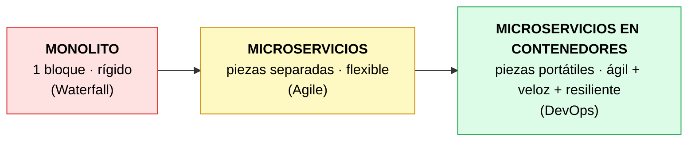
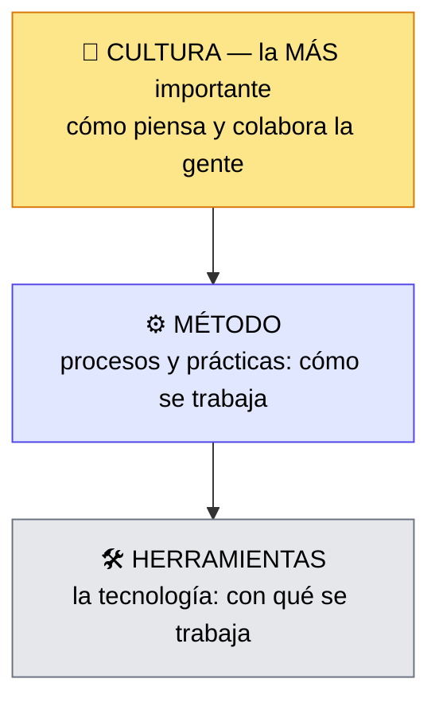

# Características esenciales de DevOps

> [!abstract] 📄 ¿De qué trata esta nota?
> Después de entender *por qué* nació DevOps (notas anteriores), esta nota explica **qué es DevOps por dentro**. Veremos tres cosas: (1) cómo **evolucionaron las aplicaciones** —de bloques gigantes ("monolitos") a piezas pequeñas en contenedores—, (2) los **tres pilares técnicos** que hacen posible la agilidad (DevOps + Microservicios + Contenedores), y (3) las **tres dimensiones** de DevOps, con un mensaje central: la pieza más importante **no es la tecnología, es la cultura**. Como apoyo extra, se añade el marco **CALMS**, muy usado en la industria para entender DevOps.

---

## 🎯 Idea central

> Las aplicaciones evolucionaron de **monolitos** a **microservicios en contenedores**. DevOps se apoya en tres pilares técnicos, pero su éxito depende sobre todo de un cambio de **cultura** (responsabilidad compartida, transparencia, lotes pequeños).

---

## 📖 Glosario de términos clave

> [!note] Monolito (arquitectura monolítica)
> **Definición técnica:** aplicación construida como **una sola unidad grande e indivisible**, donde todas las funciones están entrelazadas en un mismo bloque de código.
> **En palabras simples:** es como un **edificio de un solo bloque de concreto**. Si quieres cambiar una ventana, intervienes toda la estructura. Un cambio pequeño obliga a volver a desplegar **todo**, y si una parte falla, puede caer toda la app.

> [!note] Microservicios
> **Definición técnica:** estilo de arquitectura donde la aplicación se divide en **servicios pequeños e independientes**, cada uno con una función específica, que se comunican entre sí.
> **En palabras simples:** en vez de un edificio de un bloque, son **muchas casas pequeñas conectadas**. Puedes remodelar o reconstruir una casa sin tocar las demás. Si una falla, las otras siguen en pie.

> [!note] Contenedor
> **Definición técnica:** paquete ligero que incluye una pieza de software **junto con todo lo que necesita** para ejecutarse (código, librerías, configuración), de forma aislada y portátil. (La herramienta más famosa es **Docker**.)
> **En palabras simples:** es como un **tupper de comida**: dentro va el plato listo para calentar en cualquier microondas. El contenedor lleva la app "lista para correr" en cualquier servidor, sin el clásico *"en mi máquina funciona"*. Arranca en segundos y se puede desechar fácilmente.

> [!note] Pipeline (tubería / canalización)
> **Definición técnica:** secuencia automatizada de pasos por los que pasa el código (compilar → probar → desplegar).
> **En palabras simples:** una **línea de producción de fábrica** para el software. El código entra por un lado y sale desplegado por el otro, pasando solo por pasos automáticos.

> [!note] Infraestructura como Código (IaC – Infrastructure as Code)
> **Definición técnica:** práctica de **definir y gestionar la infraestructura** (servidores, redes) mediante **archivos de texto/código** en vez de configurarla manualmente.
> **En palabras simples:** en lugar de instalar servidores "a mano" haciendo clics, escribes una **receta en un archivo**. Esa receta crea servidores idénticos las veces que quieras, sin errores humanos.

> [!note] Infraestructura inmutable
> **Definición técnica:** enfoque donde los servidores **no se modifican** una vez creados; si hay que cambiar algo, se **reemplazan** por nuevos.
> **En palabras simples:** en vez de "reparar" un servidor viejo (y arriesgarte a romperlo más), lo **tiras y pones uno nuevo** desde la receta. Como usar platos desechables en vez de lavarlos.

> [!note] Resiliencia
> **Definición:** capacidad de un sistema para **seguir funcionando (o recuperarse rápido) ante fallos**. Los microservicios aportan resiliencia porque si una pieza cae, el resto aguanta.

---

## 1. La evolución de las aplicaciones

DevOps no apareció solo; la **forma de construir aplicaciones** también evolucionó en paralelo:

Cada paso aportó más **agilidad, velocidad y resiliencia** al desarrollo y al despliegue.

---

## 2. Los tres pilares de la agilidad en DevOps

Tres tecnologías/prácticas trabajan juntas para lograr entregas rápidas y seguras:

| Pilar | Qué es | Qué aporta |
|:--|:--|:--|
| **DevOps** | La cultura + prácticas | Cambio cultural, **pipelines automatizados**, **IaC** e infraestructura inmutable |
| **Microservicios** | La arquitectura | Diseño **desacoplado**: despliegues pequeños y tolerancia a fallos |
| **Contenedores** | El empaquetado | Entornos **portátiles y de arranque rápido**: despliegues veloces y efímeros |

> [!tip] Cómo encajan las piezas
> Piénsalo así: los **microservicios** dividen la app en piezas pequeñas → los **contenedores** empaquetan cada pieza para moverla a cualquier lado → **DevOps** automatiza el camino (pipeline) para llevarlas a producción de forma segura. Los tres se potencian.

---

## 3. Las tres dimensiones de DevOps

DevOps no es solo herramientas. Tiene **tres dimensiones**, y una pesa más que las otras:

> [!warning] El error más común sobre DevOps
> Mucha gente cree que DevOps = "comprar las herramientas correctas" (Docker, Jenkins, etc.). **Falso.** Las herramientas y los métodos se copian fácil; lo difícil —y lo que realmente decide el éxito— es la **cultura**. Sin cambio cultural, las herramientas no sirven de nada.

---

## 4. El cambio cultural en detalle

Adoptar DevOps implica transformar la mentalidad del equipo hacia:

- **Responsabilidad compartida:** "tú lo construiste, tú ayudas a operarlo" (*you build it, you run it*). Se acaba el "yo entrego y me lavo las manos".
- **Transparencia:** la información fluye libremente entre todos (no hay secretos entre Dev y Ops).
- **Trabajo en pequeños lotes (small batches):** entregar cambios **pequeños y frecuentes** en vez de un gran lanzamiento riesgoso. Si algo falla, el problema es pequeño y fácil de hallar.
- **Desarrollo guiado por pruebas (TDD):** construir calidad desde el inicio (ver [[TDD AND BDD]]).
- **Reorganización de equipos y métricas:** medir lo que importa (valor entregado) y estructurar los equipos para colaborar.

---

## 5. 🌐 Extra de la web: el marco CALMS

En la industria, DevOps suele resumirse con el acrónimo **CALMS** (acuñado por Jez Humble). Es una forma fácil de recordar sus pilares y sirve como "termómetro" de madurez:

| Letra | Pilar | En palabras simples |
|:--|:--|:--|
| **C** | **Culture** (Cultura) | Colaboración y responsabilidad compartida. La base de todo. |
| **A** | **Automation** (Automatización) | Automatizar todo lo repetible: construir, probar, desplegar. |
| **L** | **Lean** (Esbelto/Ágil) | Eliminar desperdicio, enfocarse en el valor, mejorar continuamente, **aceptar el fallo** como aprendizaje. |
| **M** | **Measurement** (Medición) | Decidir con **datos y métricas**, no con opiniones. |
| **S** | **Sharing** (Compartir) | Compartir conocimiento entre equipos; que la información fluya. |

> [!note] ¿Por qué te sirve CALMS?
> El curso habla de "cultura, método, herramientas". CALMS es la versión más detallada y famosa de la misma idea. Si en una entrevista o examen te preguntan "¿cuáles son los principios de DevOps?", responder **CALMS** demuestra que dominas el tema.

---

## 🧠 Analogía para recordarlo todo

> Un **monolito** es un autobús enorme: si se descompone, **nadie** llega. Los **microservicios** son una flota de taxis: si uno falla, los demás siguen. Los **contenedores** son taxis idénticos y listos para salir en cualquier ciudad. Y **DevOps** es la cultura del equipo de conductores: solo funciona si todos colaboran, comparten rutas y se hacen responsables del viaje del pasajero.

---

## ✅ Para repasar (autoevaluación)

- [ ] Explica la diferencia entre un monolito y los microservicios con tus palabras.
- [ ] ¿Qué problema resuelve un contenedor (piensa en "en mi máquina funciona")?
- [ ] Nombra los tres pilares de la agilidad y di cómo encajan entre sí.
- [ ] ¿Cuáles son las tres dimensiones de DevOps y cuál es la más importante? ¿Por qué?
- [ ] ¿Qué es IaC y qué ventaja tiene sobre configurar servidores a mano?
- [ ] Di qué significa cada letra de **CALMS**.

---

## 🔗 Enlaces relacionados

- [[XP, Agile y más allá]] — el origen cultural e histórico de DevOps.
- [[Modelo WaterFall]] — el punto de partida (monolitos y silos).
- [[TDD AND BDD]] — el desarrollo guiado por pruebas que cita la cultura DevOps.
- [[QA y DevOps]] — la automatización de pruebas dentro de los pipelines.

---
*Fuente original: [Essential Characteristics of DevOps – Coursera](https://www.coursera.org/learn/intro-to-devops/lecture/Qjfcq/essential-characteristics-of-devops). Marco CALMS ampliado con [Atlassian: CALMS Framework](https://www.atlassian.com/devops/frameworks/calms-framework).*
