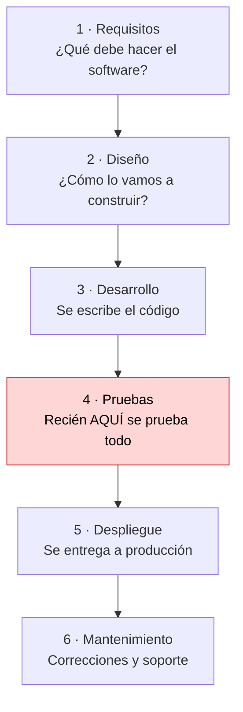
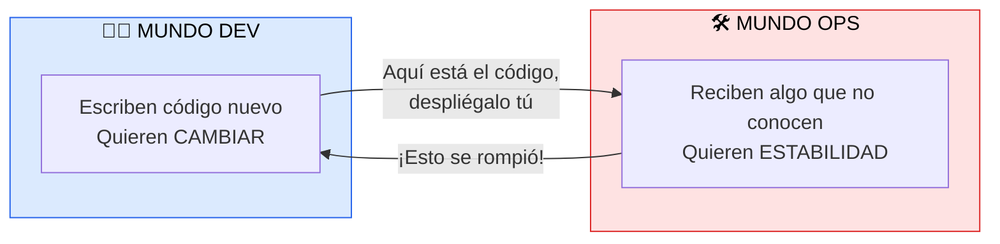

# Modelo Waterfall y el camino hacia DevOps

> [!abstract] 📄 ¿De qué trata esta nota?
> Esta nota explica **cómo se construía el software antes de DevOps** y por qué ese modelo causaba tantos problemas. Primero veremos el **modelo Waterfall (cascada)**: un método donde el proyecto avanza en fases ordenadas, una detrás de otra, sin volver atrás. Luego veremos el problema de los **silos**: equipos de Desarrollo y Operaciones trabajando aislados, sin hablarse. Entender estos dos problemas es la **base** para entender por qué nació DevOps: DevOps no es una moda, es la **respuesta** a estos dolores concretos.

---

## 🎯 Idea central

> El método **Waterfall** y la separación en **silos** entre Desarrollo (Dev) y Operaciones (Ops) provocaban errores detectados demasiado tarde, entregas lentas y mucha frustración. Esos problemas son la **motivación histórica** que da origen a DevOps.

---

## 📖 Glosario de términos clave

> [!note] SDLC (Software Development Life Cycle / Ciclo de Vida del Desarrollo de Software)
> **Definición técnica:** conjunto de fases por las que pasa un software desde que se concibe hasta que se retira.
> **En palabras simples:** es la "receta" de pasos para crear software. Waterfall y Agile son **dos formas distintas de ordenar y recorrer** esos pasos.

> [!note] Modelo Waterfall (cascada)
> **Definición técnica:** modelo de desarrollo **lineal y secuencial** en el que cada fase debe terminarse y aprobarse antes de empezar la siguiente.
> **En palabras simples:** imagina una cascada de agua que solo cae hacia abajo y nunca sube. Cada fase "cae" en la siguiente y **no puedes regresar** sin un gran costo. Se planea todo al inicio y se ejecuta de corrido.

> [!note] Silo
> **Definición técnica:** unidad organizativa que opera de forma aislada, con sus propias metas, sin compartir información con otras unidades.
> **En palabras simples:** son "islas" dentro de la empresa. El equipo de Desarrollo es una isla y el de Operaciones es otra; cada una rema para su lado y casi no se comunican.

> [!note] Dev (Desarrollo) y Ops (Operaciones)
> **Dev:** quienes **escriben el código** y crean nuevas funcionalidades. Su instinto es **cambiar** (entregar cosas nuevas).
> **Ops:** quienes **despliegan y mantienen** el software funcionando en producción (servidores, redes, estabilidad). Su instinto es **proteger la estabilidad** (que nada se rompa).
> **El conflicto natural:** Dev quiere cambiar rápido; Ops quiere estabilidad. Ese choque de objetivos es el corazón del problema que DevOps busca resolver.

> [!note] Producción (producción / "prod")
> **Definición:** el entorno **real** donde los usuarios finales usan el software (no es una prueba). Un error "en producción" es un error que **ya vieron los clientes**.

---

## 1. Las fases del modelo Waterfall

Waterfall divide el proyecto en **fases secuenciales**. Cada una produce documentos que se "entregan" a la siguiente fase, como pasar un testigo en una carrera de relevos:

🔑 **La regla de oro de Waterfall:** no avanzas a la siguiente fase hasta que la actual está 100% completa y aprobada. Y, en teoría, **no se vuelve hacia atrás**.

---

## 2. ¿Por qué Waterfall causa problemas?

### a) Los errores se descubren demasiado tarde
Como las **pruebas están casi al final**, un error de diseño cometido en el mes 1 puede no descubrirse hasta el mes 8. Para entonces, corregirlo significa rehacer meses de trabajo.

> [!warning] Regla clave que debes recordar
> **Cuanto más tarde se detecta un error, más caro es arreglarlo.** Un error encontrado en la fase de requisitos cuesta corregir una fracción de lo que cuesta el mismo error encontrado en producción. Esta idea es la semilla del concepto **"shift left"** que verás más adelante en QA.

### b) Inflexibilidad ante el cambio
Los requisitos se "congelan" al inicio. Si el cliente cambia de idea a mitad del proyecto (algo casi inevitable), el modelo no lo absorbe bien: cambiar algo obliga a retroceder fases, lo que es lento y costoso.

### c) El cliente ve el producto demasiado tarde
El usuario recién ve algo funcionando **al final**. Si lo construido no era lo que esperaba, ya se gastó casi todo el presupuesto. Hay un alto riesgo de **desalineación** entre lo que se pidió y lo que se entregó.

---

## 3. El segundo problema: los silos entre Dev y Ops

Aun si el desarrollo iba bien, había una **muralla** entre quienes construían el software y quienes lo operaban:

> 🧱 Entre ambos mundos había un **muro**: sin comunicación ni metas compartidas.

- Dev y Ops trabajaban en **silos separados**, sin comunicación ni metas compartidas.
- Operaciones recibía el software **mucho tiempo después** de desarrollado, **sin conocer el código**, lo que dificultaba desplegarlo y mantenerlo.
- Cuando algo fallaba en producción, empezaba el **"juego de la culpa"**: Dev decía *"en mi máquina funciona"* y Ops decía *"tu código rompió el servidor"*.

> [!tip] La frase que resume el problema
> *"En mi máquina funciona"* → es el símbolo del muro entre Dev y Ops. El código funcionaba para quien lo escribió, pero fallaba en el entorno real porque nadie compartió responsabilidad sobre el resultado final.

---

## 4. Impacto general y la chispa de DevOps

| Problema | Consecuencia |
|:--|:--|
| Pruebas tardías | Errores caros y entregas lentas |
| Requisitos congelados | Producto desalineado con el cliente |
| Silos Dev/Ops | Despliegues frágiles, culpas mutuas |
| Falta de colaboración | Frustración y riesgos altos |

Este enfoque rígido y fragmentado fue lo que motivó la búsqueda de algo mejor. La respuesta llegaría en dos olas: primero **Agile** (para arreglar el desarrollo) y luego **DevOps** (para tumbar el muro entre Dev y Ops).

---

## 🧠 Analogía para recordarlo todo

> Waterfall es como **construir una casa entera con planos fijos** y solo dejar entrar al dueño cuando ya está terminada. Si quería la cocina en otro lado, hay que demoler. Y los albañiles (Dev) se van antes de que lleguen los que vivirán y mantendrán la casa (Ops), que reciben las llaves sin manual de instrucciones.

---

## ✅ Para repasar (autoevaluación)

- [ ] Nombra las 6 fases del modelo Waterfall en orden.
- [ ] ¿Por qué en Waterfall corregir un error descubierto tarde es tan caro?
- [ ] ¿Qué significa que Dev y Ops trabajaban "en silos"?
- [ ] ¿Por qué los objetivos de Dev y Ops chocan de forma natural?
- [ ] ¿Qué quiere decir la frase "en mi máquina funciona" y qué problema simboliza?
- [ ] ¿Qué dos movimientos surgieron para resolver estos problemas?

---

## 🔗 Enlaces relacionados

- [[XP, Agile y más allá]] — la primera ola: Agile surge para resolver la rigidez de Waterfall.
- [[Caracteristicas Escenciales para DEVOPS]] — la evolución del monolito al contenedor y la cultura DevOps.
- [[QA y DevOps]] — cómo el concepto "shift left" ataca el problema de las pruebas tardías.

---
*Fuente original: [Leading up to DevOps – Coursera](https://www.coursera.org/learn/intro-to-devops/lecture/6Q0Ra/leading-up-to-devops). Ampliado con [Lucid: Pros and Cons of Waterfall](https://lucid.co/blog/pros-and-cons-of-waterfall-methodology) y [TutorialsPoint: SDLC Waterfall Model](https://www.tutorialspoint.com/sdlc/sdlc_waterfall_model.htm).*
