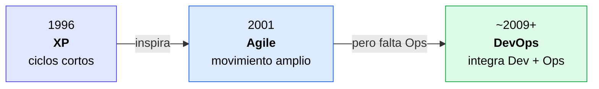
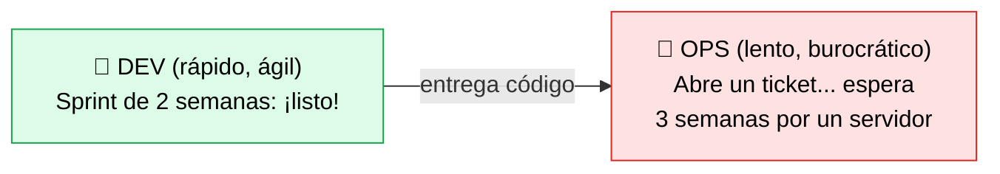

# XP, Agile y más allá

> [!abstract] 📄 ¿De qué trata esta nota?
> Esta nota cuenta la **historia de cómo el desarrollo de software se volvió ágil** y por qué eso, por sí solo, no fue suficiente. Empieza con **Extreme Programming (XP)**, una de las primeras metodologías "ligeras" creada en 1996. De ahí nace el movimiento **Agile** (Manifiesto Agile, 2001), que cambió la forma de trabajar de los desarrolladores. Pero veremos un problema: Agile hizo a Dev muy rápido, mientras Operaciones siguió lento. Esa diferencia de velocidades creó conflictos (el "IT de dos velocidades" y el "Shadow IT") que **DevOps** vino a resolver. Es la **continuación directa** de la nota [[Modelo WaterFall]].

---

## 🎯 Idea central

> **Extreme Programming (XP)** inició el movimiento **Agile**, que mejoró muchísimo el desarrollo pero **dejó atrás a Operaciones**. Esa brecha entre un Dev veloz y un Ops lento ("IT de dos velocidades") es justo lo que **DevOps** viene a cerrar.

---

## 📖 Glosario de términos clave

> [!note] Iterativo / Iteración
> **Definición técnica:** método de trabajo en ciclos cortos y repetidos, donde cada ciclo produce una versión mejorada del producto.
> **En palabras simples:** en vez de hacerlo todo de una vez (como Waterfall), trabajas en **pequeños pedacitos**. Cada pedacito se construye, se muestra y se mejora. Cada vuelta de ese ciclo es una "iteración".

> [!note] Retroalimentación (feedback)
> **Definición:** información que recibes sobre tu trabajo para corregir el rumbo.
> **En palabras simples:** es preguntar "¿voy bien?" seguido. Ciclos cortos = feedback rápido = corriges errores antes de que crezcan.

> [!note] Pair Programming (programación en pareja)
> **Definición técnica:** práctica de XP donde dos desarrolladores trabajan juntos en una sola computadora; uno escribe ("driver") y otro revisa y piensa ("navigator").
> **En palabras simples:** dos cabezas en el mismo código. Uno teclea, el otro vigila errores y propone ideas. Mejora la calidad y comparte conocimiento (nadie es el único que entiende una parte).

> [!note] Equipo autoorganizado
> **Definición:** equipo que decide **por sí mismo** cómo hacer el trabajo, en lugar de recibir órdenes detalladas de un jefe.
> **En palabras simples:** el equipo se gobierna solo; confían en su criterio para organizarse.

> [!note] Sprint
> **Definición:** ciclo corto de trabajo (normalmente 1 a 4 semanas) al final del cual se entrega algo funcional. Es la "iteración" típica de Scrum (un marco Agile).

> [!note] Shadow IT ("IT en las sombras")
> **Definición técnica:** uso de hardware, software o servicios (p. ej. nube pública) **sin la aprobación ni el control** del departamento de IT.
> **En palabras simples:** cuando los desarrolladores, cansados de esperar a Operaciones, consiguen recursos "por su cuenta" (saltándose las reglas). Es entendible, pero **peligroso**: nadie controla la seguridad ni los costos de eso.

---

## 1. Línea de tiempo: de XP a DevOps

| Año | Hito | Quién / Qué |
|:--|:--|:--|
| **1996** | Nace **Extreme Programming (XP)** | Kent Beck |
| **2001** | Se firma el **Manifiesto Agile** | 17 desarrolladores en Snowbird, Utah |
| **Después** | Surge **DevOps** | La comunidad, para integrar Agile con Operaciones |

---

## 2. Extreme Programming (XP): el punto de partida

- Metodología creada por **Kent Beck en 1996**.
- Su esencia: un enfoque **iterativo con ciclos de retroalimentación muy cortos** para mejorar la calidad y responder rápido a los cambios del cliente.
- Por qué fue revolucionaria: mientras Waterfall planeaba todo por adelantado, XP decía *"construye un poco, muestra, aprende, ajusta y repite"*.

**Prácticas famosas de XP** (algunas siguen vivas hoy):
- **Pair programming** (programación en pareja).
- **Integración frecuente** del código (semilla de la futura *Integración Continua*).
- **Pruebas automatizadas** y desarrollo guiado por pruebas (semilla de **TDD**).
- **Releases pequeños y frecuentes**.

> [!tip] Conexión importante
> Muchas prácticas modernas de DevOps y QA **nacieron en XP**. Por eso esta nota es tan importante: es la raíz del árbol.

---

## 3. El Manifiesto Agile (2001)

En 2001, **17 desarrolladores** se reunieron y formalizaron estas ideas ligeras en el **Manifiesto Agile**. No es un proceso, sino una **declaración de valores**.

### Los 4 valores
El formato es *"valoramos A **sobre** B"* — no significa que B no importe, sino que A importa **más**:

| Valoramos más... | ...sobre... |
|:--|:--|
| 1. **Individuos e interacciones** | procesos y herramientas |
| 2. **Software funcionando** | documentación extensiva |
| 3. **Colaboración con el cliente** | negociación contractual |
| 4. **Responder al cambio** | seguir un plan rígido |

> [!example] Cómo leer el valor #4
> Waterfall decía: "haz el plan y síguelo pase lo que pase". Agile dice: "ten un plan, pero si el mundo cambia, **cambia con él**". El cambio no es el enemigo; es esperado.

### Lo que Agile promueve
Equipos **autoorganizados**, planificación **adaptativa**, **entregas tempranas** y **mejora continua**.

---

## 4. El problema: Agile sin Operaciones

Agile aceleró muchísimo a los desarrolladores. Pero **Operaciones no cambió** al mismo ritmo. Resultado: un cuello de botella.

> ⚡ El código sale rápido de Dev, pero se **atasca** en Ops: ese cuello de botella es el problema.

Esto produce cuatro problemas encadenados:

1. **Desfase de velocidades:** Dev trabaja en sprints rápidos; Ops sigue procesos lentos (abrir tickets, esperar aprobaciones).
2. **Retrasos en despliegues:** el código está listo, pero la entrega al usuario se demora porque Ops tarda en preparar la infraestructura.
3. **Frustración y baja productividad:** la espera desmotiva y desperdicia el tiempo del equipo.
4. **"IT de dos velocidades" y Shadow IT:** para no esperar, los devs consiguen recursos por fuera (nube pública) **sin pasar por IT** → riesgos de seguridad y pérdida de control.

> [!warning] Concepto clave: "IT de dos velocidades"
> Es cuando dentro de una misma empresa conviven **dos ritmos incompatibles**: un Dev veloz y un Ops lento. No es culpa de las personas, sino de tener procesos desconectados. La solución no es "que Ops corra más", sino **unir a ambos equipos**.

---

## 5. DevOps como solución

DevOps es la respuesta a esa brecha:

- **Integra Agile en Operaciones**, derribando los silos.
- Acelera la entrega mediante la **colaboración estrecha Dev + Ops**.
- Promueve una cultura de **responsabilidad compartida y transparencia**: el éxito (y el fracaso) del software en producción es de **todos**, no de un equipo.

> [!tip] Conclusión que debes recordar
> **Agile arregló el desarrollo, pero no la entrega.** DevOps completa la historia integrando Operaciones. Por eso se dice que *"DevOps es Agile extendido hasta producción"*.

---

## 🧠 Analogía para recordarlo todo

> Imagina una **cocina de restaurante muy rápida** (Dev, gracias a Agile) pero con **meseros lentísimos** (Ops). Los platillos salen calientes pero se enfrían esperando ser servidos. De nada sirve cocinar rápido si la comida no llega a la mesa. DevOps une cocina y servicio en **un solo equipo** con una sola meta: que el cliente coma bien y a tiempo.

---

## ✅ Para repasar (autoevaluación)

- [ ] ¿Quién creó XP y en qué año? ¿Qué idea central propuso?
- [ ] Menciona dos prácticas de XP que siguen vivas hoy.
- [ ] Enuncia los 4 valores del Manifiesto Agile y explica cómo leer "A sobre B".
- [ ] ¿Por qué Agile por sí solo creó un cuello de botella?
- [ ] ¿Qué es el "IT de dos velocidades"? ¿Y el "Shadow IT"? ¿Por qué es riesgoso?
- [ ] Completa la frase: "DevOps es Agile extendido hasta ______".

---

## 🔗 Enlaces relacionados

- [[Modelo WaterFall]] — el problema previo que Agile vino a resolver.
- [[Caracteristicas Escenciales para DEVOPS]] — los tres pilares y la cultura de DevOps.
- [[QA y DevOps]] — cómo encaja la calidad en este modelo de entrega rápida.
- [[TDD AND BDD]] — el desarrollo guiado por pruebas que nació en XP.

---
*Fuente original: [XP, Agile and beyond – Coursera](https://www.coursera.org/learn/intro-to-devops/lecture/F4riZ/xp-agile-and-beyond). Valores del [Manifiesto Agile (agilemanifesto.org)](https://agilemanifesto.org/iso/es/manifesto.html).*
