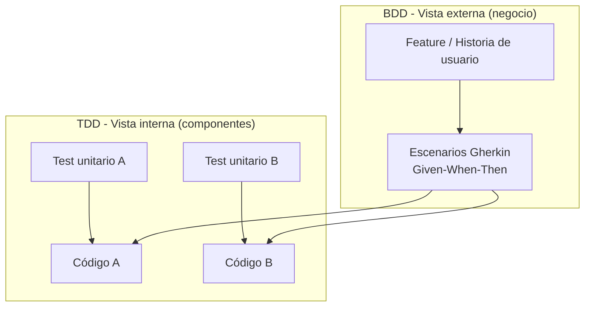

# Behavior-Driven Development (BDD)

> [!abstract] Resumen rápido
> BDD es una metodología que describe el **comportamiento del sistema desde afuera hacia adentro** (perspectiva del usuario/negocio), usando lenguaje natural estructurado (**Gherkin**) para que todo el equipo —técnico y no técnico— comparta el mismo entendimiento de "qué debe hacer" el software.

---

## 1. Definición y enfoque

BDD (*Behavior-Driven Development*) es una evolución de TDD que traslada el foco desde el **comportamiento interno de una unidad de código** hacia el **comportamiento observable del sistema completo**, tal como lo experimenta el usuario o el negocio.

- Se pregunta: *"¿el sistema hace lo correcto para el negocio?"*, no solo *"¿esta función devuelve el valor esperado?"*.
- Los escenarios se escriben en **lenguaje natural** (Gherkin), lo que permite que product owners, analistas de negocio, QA y desarrolladores participen en su redacción.
- El resultado es una **especificación ejecutable**: el mismo documento sirve como requisito, documentación y test automatizado.

> [!tip] Idea clave
> En BDD, el test *es* la historia de usuario convertida en criterio de aceptación verificable.

---

## 2. BDD vs TDD — Comparación directa

| Aspecto | **TDD** | **BDD** |
|---|---|---|
| Nivel de abstracción | Unidad de código (función, clase, método) | Comportamiento del sistema / feature completa |
| Perspectiva | Interna (desarrollador) | Externa (usuario / negocio) |
| Pregunta central | ¿Funciona correctamente este componente? | ¿El sistema hace lo que el negocio necesita? |
| Lenguaje | Código con assertions (`assertEquals`, `expect`, etc.) | Lenguaje natural estructurado (Given/When/Then) |
| Público que participa | Principalmente desarrolladores | Desarrolladores + testers + negocio + clientes |
| Herramientas típicas | JUnit, pytest, Jest, xUnit | Cucumber, Behave, jBehave, SpecFlow |
| Nivel en la pirámide de testing | Mayormente unitario | Mayormente integración / aceptación / E2E |

> [!note] No son excluyentes
> BDD y TDD se complementan: BDD define **qué** debe hacer el sistema a nivel de negocio (escenarios Gherkin ejecutados con Cucumber/Behave), mientras que TDD asegura **cómo** cada componente interno cumple su parte (tests unitarios). Muchos equipos usan BDD para las historias de usuario y TDD para implementar la lógica dentro de cada componente.



---

## 3. Proceso de trabajo colaborativo

1. **Discovery / Example Mapping**: el equipo (negocio + desarrollo + QA) se reúne para discutir una funcionalidad usando **ejemplos concretos** en lugar de descripciones abstractas.
2. **Formulation**: esos ejemplos se traducen a escenarios formales en **Gherkin**.
3. **Automation**: herramientas como Cucumber, Behave o jBehave convierten cada línea Gherkin en un paso ejecutable (*step definition*) conectado al código real.
4. Los escenarios pasan a formar parte de la **suite de regresión automatizada**, ejecutándose en el pipeline de CI/CD igual que los tests unitarios.

Esta práctica se relaciona directamente con la técnica de **"Three Amigos"**: reunir a desarrollador, tester y product owner antes de codificar una historia, para acordar los criterios de aceptación.

---

## 4. Sintaxis Gherkin

Estructura básica:

```gherkin
Feature: Descripción de la funcionalidad de alto nivel

  Scenario: Nombre descriptivo del caso concreto
    Given <contexto inicial / precondición>
    When  <acción que realiza el usuario o el sistema>
    Then  <resultado esperado>
```

Palabras clave adicionales:
- **And / But**: encadenan condiciones dentro de Given, When o Then.
- **Background**: pasos comunes que se repiten al inicio de cada escenario de un Feature.
- **Scenario Outline + Examples**: permite parametrizar un mismo escenario con múltiples conjuntos de datos (tabla de ejemplos).

### Ejemplo práctico: devolución de productos en una tienda

```gherkin
Feature: Devolución de productos

  Scenario: Cliente devuelve un producto dentro del plazo permitido
    Given que el cliente compró un producto hace 5 días
    And la política de devoluciones permite hasta 30 días
    When el cliente solicita la devolución del producto
    Then el sistema debe aceptar la devolución
    And debe generar un reembolso al método de pago original

  Scenario Outline: Devolución según los días transcurridos
    Given que el cliente compró un producto hace <dias> días
    When el cliente solicita la devolución del producto
    Then el sistema debe "<resultado>" la devolución

    Examples:
      | dias | resultado |
      | 10   | aceptar   |
      | 29   | aceptar   |
      | 31   | rechazar  |
```

Este documento cumple doble función: es **criterio de aceptación** legible por negocio y, a la vez, **test automatizado** ejecutable por Cucumber/Behave.

---

## 5. Herramientas por lenguaje

| Lenguaje | Framework BDD |
|----------|----------------|
| Java | **JBehave**, Cucumber-JVM |
| Python | **Behave**, pytest-bdd |
| Ruby | **Cucumber** (origen del framework) |
| JavaScript/TypeScript | Cucumber.js, Jest-Cucumber |
| C# / .NET | **SpecFlow** |
| PHP | Behat |

Todas siguen el mismo patrón: **archivo `.feature` en Gherkin** ↔ **step definitions** (código que implementa cada Given/When/Then) ↔ ejecución dentro del pipeline CI/CD.

---

## 6. Beneficios clave

- **Lenguaje ubicuo (ubiquitous language)**: reduce ambigüedad entre lo que pide negocio y lo que construye desarrollo — concepto tomado de *Domain-Driven Design*.
- **Criterios de aceptación explícitos** para cada historia de usuario, evitando interpretaciones distintas.
- **Documentación viva**: los `.feature` files se mantienen sincronizados con el comportamiento real del sistema (si un escenario falla, la documentación "avisa" que está desactualizada).
- **Detección temprana de malentendidos de requisitos**, no solo de bugs de código — reduce el costo de retrabajo mucho más que TDD, porque previene errores de "producto equivocado" y no solo de "código roto".
- **Trazabilidad**: cada feature puede vincularse a una historia de usuario / ticket, facilitando auditoría y reportes.

---

## 7. Riesgos y malas prácticas comunes

- **Escenarios demasiado técnicos**: escribir Gherkin como si fuera un script de automatización ("Given hago click en el botón #submit") pierde el propósito de comunicación con negocio.
- **Explosión de escenarios**: duplicar casos similares en vez de usar `Scenario Outline` con `Examples`.
- **Steps no reutilizables**: step definitions muy específicas generan duplicación de código de automatización.
- **Confundir BDD con "solo Cucumber"**: BDD es primero una práctica de **colaboración y descubrimiento** (Three Amigos, Example Mapping); Cucumber/Behave son solo la herramienta de automatización.

---

## 8. Preguntas para repasar (auto-evaluación)

- [ ] ¿Puedo explicar con mis palabras la diferencia entre TDD y BDD?
- [ ] ¿Qué significan Given, When y Then, y en qué orden se usan?
- [ ] ¿Cómo escribiría un escenario Gherkin para un login con credenciales inválidas?
- [ ] ¿Por qué se dice que BDD mejora la comunicación entre negocio y desarrollo?
- [ ] ¿Qué es la técnica "Three Amigos" y cómo se relaciona con BDD?

---

## 9. Recursos recomendados para profundizar

- 📘 *BDD in Action* — John Ferguson Smart.
- 📘 *Specification by Example* — Gojko Adzic.
- 🌐 Documentación oficial de [Cucumber](https://cucumber.io/docs/gherkin/) — referencia completa de sintaxis Gherkin.
- 🌐 Documentación de [Behave](https://behave.readthedocs.io/) (Python).
- 🌐 Artículo de Martin Fowler sobre ["Given-When-Then"](https://martinfowler.com/bliki/GivenWhenThen.html).

---

## 10. Notas relacionadas
- [[TDD - Test-Driven Development]]
- [[CI-CD Pipeline]]
- [[Pirámide de Testing]]
- [[Domain-Driven Design]]
- [[Historias de Usuario y Criterios de Aceptación]]

---
#devops #bdd #testing #gherkin #buenas-practicas
