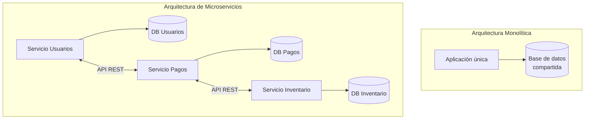

# Microservicios Nativos en la Nube

> [!abstract] Resumen rápido
> La arquitectura de microservicios divide una aplicación en **servicios pequeños, independientes y sin estado**, cada uno responsable de un dominio de negocio concreto, con su propia base de datos y comunicándose vía **APIs REST**. Esto contrasta con el modelo **monolítico**, donde todo se despliega y escala como una sola unidad.

---

## 1. Arquitectura de microservicios nativos en la nube

- La aplicación se descompone en un conjunto de **servicios pequeños e independientes**, cada uno enfocado en un **dominio de negocio específico** (ej: servicio de pagos, servicio de inventario, servicio de usuarios).
- Cada microservicio puede desarrollarse, probarse, desplegarse y escalarse **de forma autónoma**.
- **Sin estado (stateless)**: el servicio en sí no guarda información entre peticiones; cualquier instancia del servicio puede atender cualquier request. El estado real (datos persistentes) se guarda en una **base de datos separada por servicio**, no en memoria del proceso.

> [!tip] ¿Por qué importa ser stateless?
> Al no depender de memoria local ni de sesión "pegada" a una instancia específica, cualquier réplica del servicio puede atender cualquier petición. Esto es lo que hace posible escalar horizontalmente sin coordinación compleja ni "sticky sessions".

---

## 2. Ventajas de los microservicios

### Escalabilidad horizontal independiente
Si el servicio de "checkout" recibe mucho más tráfico que el de "perfil de usuario", solo se despliegan más réplicas de **ese** servicio, sin necesidad de escalar toda la aplicación. Esto reduce costos de infraestructura comparado con escalar un monolito completo.

### Comunicación vía APIs REST
- Los servicios se comunican mediante contratos de API bien definidos (REST, y también gRPC o mensajería asíncrona en arquitecturas más avanzadas).
- **Nunca acceden directamente a la base de datos de otro servicio** — esto es una regla fundamental: *database per service*.
- Esto permite que cada equipo cambie su implementación interna (incluso su motor de base de datos) sin romper a los consumidores, siempre que el contrato de API se mantenga estable.

### Despliegue independiente
Un equipo puede desplegar una nueva versión de su microservicio sin coordinar un despliegue global, reduciendo el "blast radius" (alcance del impacto) de cada cambio.

---

## 3. Comparación con arquitecturas monolíticas

| Aspecto | **Monolito** | **Microservicios** |
|---|---|---|
| Despliegue | Toda la aplicación se despliega junta | Cada servicio se despliega de forma independiente |
| Base de datos | Compartida entre todos los módulos | Una base de datos por servicio (*database per service*) |
| Escalabilidad | Se escala la aplicación completa | Se escala solo el servicio que lo necesita |
| Coordinación entre equipos | Alta (cambios requieren sincronización) | Baja (cada equipo es dueño de su servicio) |
| Tecnología | Generalmente un único stack tecnológico | Cada servicio puede usar su propio stack ("polyglot") |
| Complejidad inicial | Baja | Alta (requiere orquestación, monitoreo distribuido, etc.) |
| Fallos | Un error puede tumbar toda la app | Un fallo puede aislarse a un solo servicio (si se diseña bien) |
| Testing | Más simple (todo en un mismo proceso) | Más complejo (requiere pruebas de integración/contract testing) |

> [!note] No es gratis
> Los microservicios resuelven problemas de escalabilidad organizacional y técnica, pero **introducen complejidad distribuida**: latencia de red, consistencia eventual, necesidad de observabilidad (logs, trazas, métricas centralizadas) y orquestación (Kubernetes, service mesh).

---

## 4. Conceptos complementarios (no cubiertos en el resumen original)

### 4.1 Database per Service
Cada microservicio es dueño exclusivo de su base de datos. Ningún otro servicio puede leerla o escribirla directamente. Si un servicio necesita datos de otro, debe pedirlos vía su API (o mediante eventos).

**Problema derivado**: mantener consistencia entre bases de datos separadas. Se resuelve con patrones como:
- **Saga Pattern**: coordina transacciones distribuidas mediante una secuencia de eventos/compensaciones, en vez de una transacción ACID tradicional.
- **Eventual Consistency**: se acepta que los datos entre servicios pueden estar temporalmente desincronizados, y eventualmente convergen.

### 4.2 Comunicación entre servicios
| Tipo | Ejemplo | Cuándo usarla |
|------|---------|----------------|
| Síncrona | REST, gRPC | Cuando se necesita respuesta inmediata |
| Asíncrona | Mensajería (Kafka, RabbitMQ, SQS) | Para desacoplar servicios y mejorar resiliencia |

El uso excesivo de comunicación síncrona entre microservicios puede generar el antipatrón de **"monolito distribuido"**: servicios técnicamente separados pero acoplados operacionalmente entre sí.

### 4.3 12-Factor App
Los microservicios cloud-native suelen seguir los principios de la metodología **[The Twelve-Factor App](https://12factor.net/)**, entre ellos:
- Configuración externa a través de variables de entorno.
- Procesos *stateless* (relacionado directamente con el punto del resumen).
- Logs tratados como flujos de eventos, no archivos locales.
- Backing services (bases de datos, colas) tratados como recursos adjuntos intercambiables.

### 4.4 Contenedores y orquestación
Los microservicios cloud-native casi siempre se empaquetan en **contenedores** (Docker) y se orquestan con **Kubernetes**, lo cual facilita:
- Despliegue independiente de cada servicio.
- Escalado automático (Horizontal Pod Autoscaler).
- Auto-recuperación ante fallos (self-healing).

### 4.5 API Gateway y Service Mesh
- **API Gateway**: punto único de entrada que enruta las peticiones del cliente hacia el microservicio correspondiente, y puede manejar autenticación, rate limiting, etc.
- **Service Mesh** (ej. Istio, Linkerd): capa de infraestructura que gestiona la comunicación entre servicios (retries, circuit breakers, observabilidad) sin que cada servicio implemente esa lógica por su cuenta.

### 4.6 Domain-Driven Design (DDD)
La división de un sistema en microservicios suele guiarse por **bounded contexts** de DDD: cada microservicio representa un límite de dominio de negocio bien definido, evitando que dos servicios modelen el mismo concepto de forma distinta.

---

## 5. Retos comunes de los microservicios

- **Observabilidad distribuida**: se necesita tracing distribuido (ej. OpenTelemetry, Jaeger) para seguir una petición a través de múltiples servicios.
- **Latencia de red**: cada llamada entre servicios agrega latencia que no existe en un monolito (llamadas en memoria).
- **Testing más complejo**: se requiere *contract testing* (ej. Pact) para verificar que los cambios en un servicio no rompan a sus consumidores, sin necesidad de levantar todo el ecosistema.
- **Gestión de versiones de API**: cambios que rompen compatibilidad (*breaking changes*) deben manejarse con versionado cuidadoso.
- **Sobre-fragmentación**: dividir en demasiados servicios muy pequeños puede aumentar la complejidad operativa sin beneficio real (a veces llamado "nanoservicios").

---

## 6. Preguntas para repasar (auto-evaluación)

- [ ] ¿Qué significa que un microservicio sea *stateless* y por qué es importante para escalar?
- [ ] ¿Cómo escalaría un microservicio específico sin afectar a los demás?
- [ ] ¿Qué problemas surgirían si dos microservicios compartieran la misma base de datos?
- [ ] ¿Qué diferencia hay entre comunicación síncrona y asíncrona entre servicios?
- [ ] ¿Qué es un "monolito distribuido" y por qué es un antipatrón?

---

## 7. Recursos recomendados para profundizar

- 📘 *Building Microservices* — Sam Newman (referencia clásica del tema).
- 📘 *Domain-Driven Design* — Eric Evans (para entender bounded contexts).
- 🌐 [The Twelve-Factor App](https://12factor.net/) — principios de diseño para apps cloud-native.
- 🌐 [microservices.io](https://microservices.io/) — catálogo de patrones (Saga, Database per Service, API Gateway, etc.) por Chris Richardson.
- 🌐 Documentación de [Kubernetes](https://kubernetes.io/docs/concepts/) para orquestación de contenedores.

---

## 8. Notas relacionadas
- [[TDD - Test-Driven Development]]
- [[BDD - Behavior-Driven Development]]
- [[CI-CD Pipeline]]
- [[Domain-Driven Design]]
- [[Contenedores y Kubernetes]]
- [[Arquitectura Monolítica]]

---
#devops #microservicios #cloud-native #arquitectura #escalabilidad
