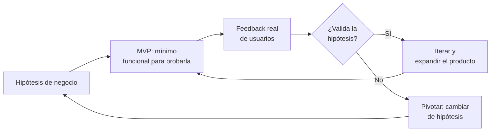
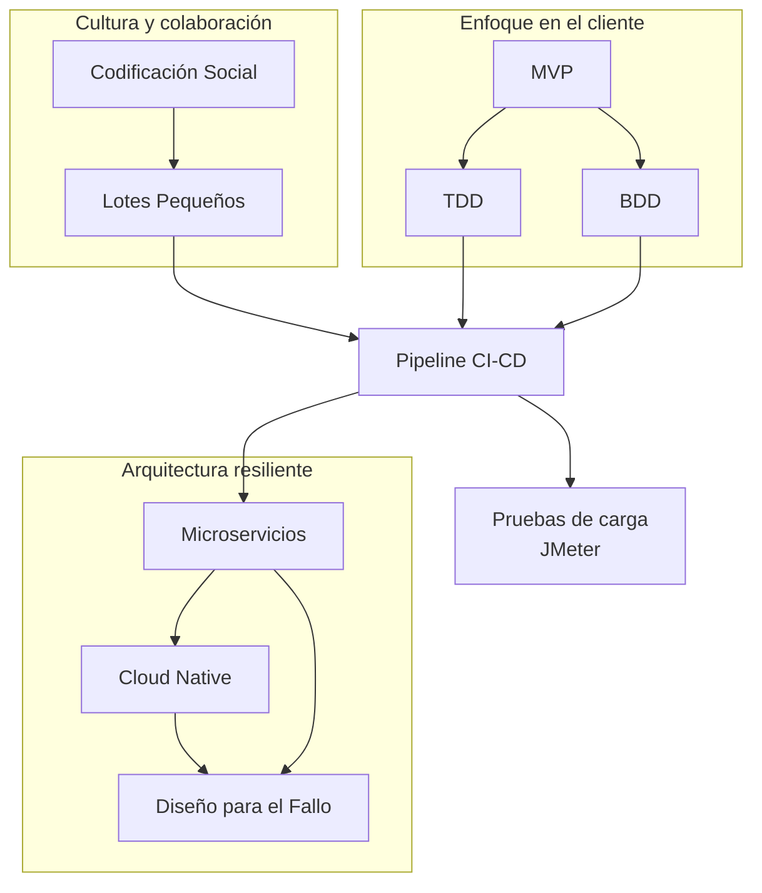

# Principios Fundamentales de DevOps (Resumen Integrador)

> [!abstract] Resumen rápido
> Esta lección conecta todos los conceptos vistos hasta ahora en un mismo hilo: DevOps no es solo automatización (CI/CD), sino una **cultura** apoyada en tres pilares: **colaboración** (codificación social, lotes pequeños), **enfoque en el cliente** (MVP, TDD, BDD) y **arquitectura resiliente** (microservicios, cloud native, diseño para el fallo).

Esta nota funciona como **mapa de contenido (MOC)** del curso: desarrolla en profundidad los conceptos *nuevos* de esta lección (codificación social, lotes pequeños, MVP) y enlaza a las notas ya existentes para los conceptos que se repasan.

---

## 1. Principios de colaboración y calidad

### 1.1 Codificación Social (Social Coding)
Es la práctica de **desarrollar software en comunidad** en vez de en silos individuales. Incluye:

- **Repositorios públicos / compartidos**: el código vive en un lugar visible para todo el equipo (GitHub, GitLab), no en la máquina de una sola persona — condición necesaria para que exista [[CI-CD Pipeline|Integración Continua]].
- **Pair Programming (programación en pareja)**: dos desarrolladores trabajan juntos en la misma tarea, uno escribiendo código ("driver") y el otro revisando/pensando en voz alta ("navigator"), intercambiando roles periódicamente.
- **Code Review**: cualquier cambio pasa por revisión de al menos otro compañero antes de fusionarse (recordarás este paso como "Code Review / Blocked" en el [[Ciclos de Vida en DevOps y QA|Ticket Lifecycle]]).

**¿Por qué mejora la calidad?**
- Detecta errores y malas decisiones de diseño **antes** de que lleguen al pipeline de CI, no después.
- Distribuye el conocimiento del sistema entre varias personas (reduce el riesgo de "bus factor" — que solo una persona entienda una parte crítica del sistema).
- Genera código más legible: si sabes que alguien más lo va a leer/revisar, tiendes a escribirlo con más cuidado.

> [!tip] Conexión con TDD/BDD
> La codificación social y las pruebas escritas primero ([[TDD - Test-Driven Development]], [[BDD - Behavior-Driven Development]]) se refuerzan mutuamente: un test claro es también una forma de comunicar intención al resto del equipo, casi como una revisión de código automatizada y permanente.

### 1.2 Trabajar en Pequeños Lotes (Small Batches)
Principio tomado directamente de **Lean Manufacturing** (Toyota Production System) aplicado a software: en vez de acumular grandes cantidades de cambios antes de integrarlos o lanzarlos, se **entrega en incrementos pequeños y frecuentes**.

**Por qué reduce el desperdicio (waste):**
| Lote grande | Lote pequeño |
|---|---|
| Cambios acumulados semanas → integración dolorosa (*Merge Hell*, ver [[CI-CD Pipeline]]) | Cambios integrados a diario → conflictos mínimos |
| Si algo falla, es difícil saber *qué* cambio lo causó | Si algo falla, el cambio culpable es obvio (es el último) |
| Feedback del cliente llega tarde | Feedback del cliente llega rápido, permitiendo corregir el rumbo |
| Mayor "trabajo en progreso" (WIP) sin terminar = capital invertido sin generar valor | Menor WIP = valor entregado constantemente |

> [!tip] Idea clave
> Este principio es la razón filosófica detrás de CI/CD: **integrar y desplegar seguido no es solo una práctica técnica, es una estrategia para reducir riesgo y desperdicio**, tomada directamente de la manufactura Lean.

---

## 2. Metodologías y desarrollo orientado al cliente

### 2.1 Producto Mínimo Viable (MVP)
Un MVP es la versión más pequeña de un producto que permite:
1. **Entregar valor rápido** al cliente (validar que resuelve un problema real).
2. **Aprender** de uso real, en vez de construir meses sin retroalimentación.

> [!important] Malentendido común
> MVP **no significa "producto de baja calidad"** o "a medio hacer". Significa el **conjunto mínimo de funcionalidades** necesario para probar una hipótesis de negocio con usuarios reales. Un MVP debe funcionar correctamente para lo que promete hacer, aunque haga menos cosas que la visión final del producto.

**Relación con los otros conceptos de la lección:**
- El MVP se construye en **lotes pequeños** (sección 1.2) — no se planifica un MVP gigante.
- Cada incremento del MVP se valida con [[TDD - Test-Driven Development|TDD]] a nivel de código y [[BDD - Behavior-Driven Development|BDD]] a nivel de comportamiento esperado por el cliente.
- Se despliega a través del [[CI-CD Pipeline|pipeline CI/CD]], permitiendo iterar rápido según el feedback real de los usuarios.

### 2.2 TDD — repaso rápido
> Ver nota completa: [[TDD - Test-Driven Development]]

Escribir primero el test que falla (**Red**), luego el código mínimo para pasarlo (**Green**), luego mejorar el diseño (**Refactor**). Acelera el desarrollo a mediano plazo porque **da confianza** para cambiar código sin miedo a romper algo silenciosamente.

### 2.3 BDD — repaso rápido
> Ver nota completa: [[BDD - Behavior-Driven Development]]

Usa sintaxis en lenguaje natural (**Gherkin**: Given/When/Then) accesible para desarrolladores *y* partes interesadas no técnicas, funcionando como puente de comunicación entre negocio y desarrollo — clave para que el MVP realmente refleje "las verdaderas necesidades del cliente".

---

## 3. Arquitectura y resiliencia en DevOps

### 3.1 Microservicios — repaso rápido
> Ver nota completa: [[Microservicios Nativos en la Nube]]

Servicios **independientes**, organizados según **capacidades de negocio** (no según capas técnicas), cada uno con su propia base de datos, que se **despliegan de forma automática** e independiente entre sí gracias al pipeline CI/CD.

### 3.2 Cloud Native y escalabilidad horizontal
La arquitectura cloud native permite:
- **Escalabilidad horizontal**: agregar más instancias de un servicio específico bajo demanda, en vez de escalar verticalmente (más CPU/RAM a una sola máquina, que tiene límite físico).
- **Servicios más resilientes**: diseñados asumiendo que el fallo va a ocurrir, priorizando la **recuperación rápida** sobre la prevención absoluta.

### 3.3 Diseño para el fallo — repaso rápido
> Ver nota completa: [[Resiliencia y Diseño para el Fallo]]

El cambio de mentalidad central: de "**evitar** que algo falle" (MTBF) a "**recuperarse rápido** cuando algo falla" (MTTR), usando patrones como **Retry, Circuit Breaker y Bulkhead**, reforzados con **caching** e **ingeniería del caos**.

---

## 4. Cómo se conectan TODOS los conceptos del curso

**La narrativa completa del curso, en una frase:**
> Un equipo que **colabora bien** (codificación social, lotes pequeños) construye un **MVP** guiado por **TDD/BDD**, automatizado por un **pipeline CI/CD**, desplegado como **microservicios cloud native**, y **diseñado para fallar y recuperarse rápido**.

---

## 5. Conceptos complementarios (no cubiertos en el resumen original)

### 5.1 Los "Tres Caminos" de DevOps (The Three Ways)
Marco teórico del libro *The Phoenix Project* / *The DevOps Handbook* que resume la filosofía DevOps en tres principios, muy alineados con esta lección:

1. **Flujo (Flow)**: optimizar el trabajo de izquierda a derecha (Dev → Ops → Cliente), lo cual se relaciona directamente con **lotes pequeños** y el **pipeline CI/CD**.
2. **Retroalimentación (Feedback)**: crear ciclos de retroalimentación rápidos y constantes en ambas direcciones — relacionado con **MVP** y **monitoreo**.
3. **Aprendizaje y Experimentación Continua**: cultura donde se experimenta, se asumen riesgos calculados y se aprende del fallo — relacionado con **ingeniería del caos** y la mentalidad MTTR sobre MTBF.

### 5.2 Lean Startup (contexto del MVP)
El concepto de MVP proviene del libro *The Lean Startup* de Eric Ries, que propone el ciclo **Build → Measure → Learn** (Construir → Medir → Aprender) como forma de validar hipótesis de negocio con el menor desperdicio posible — el mismo principio de "lotes pequeños" aplicado a nivel de producto, no solo de código.

### 5.3 Mob Programming
Extensión del Pair Programming: **todo el equipo** trabaja junto en la misma tarea, en la misma pantalla, al mismo tiempo. Menos común que pair programming, pero usado en equipos que priorizan fuertemente el conocimiento compartido sobre la velocidad individual.

### 5.4 Trunk-Based Development
Práctica de codificación social/lotes pequeños llevada al extremo: todos los desarrolladores integran directamente a la rama principal (`trunk`/`main`) al menos una vez al día, en vez de mantener ramas (`branches`) de larga duración — reduce drásticamente el riesgo de Merge Hell mencionado en [[CI-CD Pipeline]].

---

## 6. Preguntas para repasar (auto-evaluación)

- [ ] ¿Por qué la codificación social mejora la calidad del código además de la velocidad?
- [ ] ¿De qué disciplina fuera del software viene el principio de "lotes pequeños", y por qué aplica igual de bien a código?
- [ ] ¿Por qué un MVP no es lo mismo que "un producto de baja calidad"?
- [ ] ¿Cómo se relacionan TDD y BDD con la construcción correcta de un MVP?
- [ ] ¿Cómo permiten los microservicios cloud native la escalabilidad horizontal?
- [ ] ¿Puedes explicar la cadena completa: colaboración → MVP → CI/CD → microservicios → resiliencia, con tus propias palabras?

---

## 7. Recursos recomendados para profundizar

- 📘 *The Lean Startup* — Eric Ries (origen del concepto MVP y el ciclo Build-Measure-Learn).
- 📘 *The DevOps Handbook* — Gene Kim, Jez Humble, Patrick Debois, John Willis (marco de "The Three Ways").
- 📘 *Accelerate* — Nicole Forsgren, Jez Humble, Gene Kim (evidencia empírica de por qué estas prácticas mejoran el rendimiento de los equipos).
- 🌐 [Trunk Based Development](https://trunkbaseddevelopment.com/) — sitio de referencia oficial de la práctica.

---

## 8. Mapa de notas del curso
- [[TDD - Test-Driven Development]]
- [[BDD - Behavior-Driven Development]]
- [[Microservicios Nativos en la Nube]]
- [[Apache JMeter]]
- [[JMeter - Prueba de Carga Realista (Practica)]]
- [[Resiliencia y Diseño para el Fallo]]
- [[Ciclos de Vida en DevOps y QA]]
- [[CI-CD Pipeline]]

---
#devops #moc #mvp #lean #colaboracion #resumen
