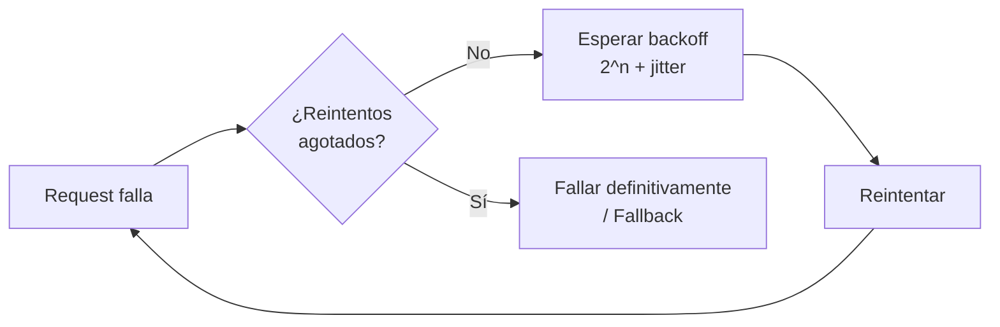
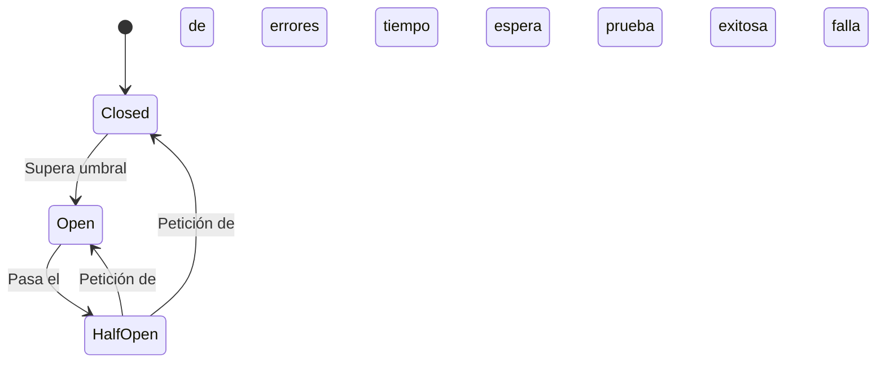

# Resiliencia y Diseño para el Fallo

> [!abstract] Resumen rápido
> En sistemas distribuidos (como [[Microservicios Nativos en la Nube]]), **el fallo es inevitable**. El objetivo del diseño resiliente no es evitar fallos, sino **detectarlos rápido y recuperarse de ellos** sin que afecten a todo el sistema. Se apoya en patrones como **Retry, Circuit Breaker y Bulkhead**, junto con prácticas como el **caching** y la **ingeniería del caos**.

---

## 1. Importancia de diseñar para el fallo

- En un sistema distribuido con múltiples servicios, redes, bases de datos y dependencias externas, **la probabilidad de que algo falle en algún punto tiende a 100%** con el tiempo. Falla la red, un servicio se cae, una base de datos se satura, un tercero externo no responde.
- El cambio de mentalidad clave: pasar de intentar **evitar** el fallo (imposible de garantizar al 100%) a diseñar sistemas que **detecten y se recuperen** rápidamente.

### Cambio de métrica: MTBF → MTTR
| Métrica | Significado | Enfoque |
|---|---|---|
| **MTBF** (Mean Time Between Failures) | Tiempo medio *entre* fallos | Enfoque antiguo: intentar que el sistema falle lo menos posible |
| **MTTR** (Mean Time To Recovery/Repair) | Tiempo medio *para recuperarse* de un fallo | Enfoque moderno: asumir que va a fallar, y optimizar qué tan rápido se recupera |

> [!tip] Idea clave
> No se trata de si el sistema va a fallar, sino de **cuándo** y **qué tan bien está preparado para absorber ese fallo** sin que el usuario final lo note (o lo note lo menos posible).

Esto se relaciona directamente con conceptos de **Site Reliability Engineering (SRE)**, donde se definen SLOs (*Service Level Objectives*) y se acepta un "error budget" en vez de perseguir el 100% de disponibilidad, que es técnica y económicamente inviable.

---

## 2. Patrones de resiliencia

### 2.1 Patrón de Reintento (Retry) con Exponential Backoff

Maneja **fallos transitorios**: errores momentáneos que suelen resolverse solos (timeout de red, servicio temporalmente saturado).

- En vez de reintentar inmediatamente (lo que puede empeorar la sobrecarga del servicio que ya está fallando), se espera un intervalo que **crece exponencialmente** entre cada intento.

```
Intento 1 → falla → esperar 1s
Intento 2 → falla → esperar 2s
Intento 3 → falla → esperar 4s
Intento 4 → falla → esperar 8s
...
```

- Se suele combinar con **jitter** (una pequeña variación aleatoria en el tiempo de espera) para evitar que múltiples clientes reintenten exactamente al mismo tiempo y generen un pico sincronizado de tráfico (**"thundering herd problem"**).



> [!warning] No todo error se debe reintentar
> Errores como `400 Bad Request` (datos inválidos del cliente) o `401/403` (autenticación/autorización) **no se resuelven reintentando** — solo tiene sentido reintentar errores transitorios como timeouts, `503 Service Unavailable` o problemas de red.

---

### 2.2 Patrón de Interruptor de Circuito (Circuit Breaker)

Previene **fallos en cascada**: si un servicio dependiente está caído o muy lento, seguir enviándole peticiones solo empeora la situación (consume hilos, memoria, conexiones) y puede tumbar también al servicio que llama.

El Circuit Breaker funciona como un interruptor eléctrico, con **tres estados**:



| Estado | Comportamiento |
|---|---|
| **Closed (cerrado)** | Funcionamiento normal; las peticiones pasan directo al servicio |
| **Open (abierto)** | Se supera un umbral de errores → el circuito "se abre" y **deja de llamar** al servicio problemático, devolviendo un error/fallback inmediato (sin siquiera intentar la llamada) |
| **Half-Open (semi-abierto)** | Tras un tiempo de espera, se permite pasar **una petición de prueba**: si tiene éxito, el circuito vuelve a **Closed**; si falla, vuelve a **Open** |

> [!tip] Analogía
> Es literalmente como el interruptor eléctrico de una casa: si detecta una sobrecarga, "salta" (se abre) para proteger el resto del sistema, en vez de dejar que el problema se propague y queme todo el circuito.

**Diferencia clave con Retry**: el Retry insiste en la misma petición; el Circuit Breaker decide **dejar de intentar por completo durante un tiempo** cuando ya está claro que el servicio no va a responder bien.

---

### 2.3 Patrón de Mamparo (Bulkhead)

Nombre inspirado en los **mamparos de un barco**: compartimentos estancos que, si se inunda uno, evitan que el agua (el fallo) se propague al resto del barco (sistema) y lo hunda por completo.

- Se **aíslan recursos** (pools de conexiones, hilos, memoria) por servicio o funcionalidad, en vez de compartir un único pool global.
- Si un servicio o funcionalidad específica se satura o falla, **solo consume su compartimento asignado**, sin agotar los recursos que necesitan las demás partes del sistema.

**Ejemplo práctico**: si el servicio de "recomendaciones" de un e-commerce se cae y no tiene un pool de hilos aislado, podría agotar todos los hilos disponibles del servidor, tumbando también el checkout y el login. Con bulkhead, "recomendaciones" tiene su propio pool limitado, y aunque falle, el checkout sigue funcionando.

| Patrón | Qué previene |
|---|---|
| Retry | Fallos transitorios puntuales |
| Circuit Breaker | Fallos en cascada por seguir llamando a un servicio caído |
| Bulkhead | Que un fallo agote recursos compartidos y afecte a partes no relacionadas del sistema |

> Los tres patrones suelen combinarse: Bulkhead aísla recursos, Circuit Breaker corta llamadas a un servicio problemático, y Retry maneja los fallos puntuales que sí vale la pena reintentar — típicamente implementados juntos con librerías como **Resilience4j**, **Polly** (.NET) o **Hystrix** (histórico, de Netflix).

---

## 3. Prácticas adicionales para robustez

### 3.1 Cacheo (Caching) y degradación gradual (Graceful Degradation)
- Guardar en caché respuestas de servicios externos/remotos reduce la dependencia de llamadas en tiempo real.
- Si el servicio de origen falla, el sistema puede **servir la última respuesta cacheada** en vez de fallar por completo — esto es **degradación gradual**: el sistema pierde algo de "frescura" en los datos, pero sigue funcionando, en vez de caerse completamente.

### 3.2 Ingeniería del Caos (Chaos Engineering)
- Consiste en **inyectar fallos deliberadamente en producción** (o en un entorno equivalente) para verificar que los mecanismos de resiliencia (retry, circuit breaker, bulkhead) realmente funcionan como se espera.
- Popularizada por Netflix con su herramienta **Chaos Monkey**, que apaga instancias de servidores al azar para forzar al equipo a diseñar sistemas tolerantes a ese tipo de fallo.
- Principio central: **es mejor descubrir las debilidades del sistema de forma controlada** (con el equipo listo para reaccionar) **que descubrirlas durante un incidente real** a las 3 AM.

---

## 4. Conceptos complementarios (no cubiertos en el resumen original)

### 4.1 Timeouts
Todo patrón de resiliencia depende de tener **timeouts bien configurados**. Sin un timeout, una petición puede quedar esperando indefinidamente una respuesta que nunca llega, bloqueando recursos igual que si no existiera ningún patrón de resiliencia.

### 4.2 Fallback
Cuando un Circuit Breaker está abierto o un Retry se agota, el sistema puede definir una **respuesta alternativa** (fallback) en vez de simplemente devolver un error: por ejemplo, mostrar una lista de productos "populares" genérica si el servicio de recomendaciones personalizado falla.

### 4.3 Rate Limiting / Throttling
Complementa al Circuit Breaker, pero desde el lado del **servidor**: limita cuántas peticiones puede recibir un cliente en un periodo de tiempo, protegiendo al sistema de ser saturado (intencional o accidentalmente) por sus propios consumidores.

### 4.4 Health Checks
Endpoints especiales (`/health`, `/status`) que exponen si un servicio está funcionando correctamente. Son usados por:
- **Orquestadores** (Kubernetes) para reiniciar automáticamente contenedores no saludables.
- **Load balancers** para dejar de enrutar tráfico a instancias caídas.
- El propio **Circuit Breaker**, para decidir cuándo pasar de Half-Open a Closed.

### 4.5 Observabilidad como requisito previo
No se puede diseñar resiliencia sin **visibilidad**: métricas, logs y trazas distribuidas (ver [[Microservicios Nativos en la Nube]]) son indispensables para saber *qué* falló, *cuándo* y *por qué*, y así poder medir el MTTR real del sistema.

### 4.6 Niveles de resiliencia en la pila (stack)
Estos patrones se aplican en distintas capas:
- **Código de aplicación**: retry, circuit breaker, bulkhead (vía librerías).
- **Infraestructura**: réplicas múltiples, auto-scaling, multi-zona/multi-región.
- **Datos**: réplicas de bases de datos, backups, estrategias de recuperación ante desastres (DR).

---

## 5. Preguntas para repasar (auto-evaluación)

- [ ] ¿Qué diferencia hay entre MTBF y MTTR, y por qué el enfoque moderno prioriza el segundo?
- [ ] ¿Cómo funciona el patrón de interruptor de circuito y cuáles son sus tres estados?
- [ ] ¿Cómo implementaría el patrón de reintento con retroceso exponencial (y por qué agregar jitter)?
- [ ] ¿Qué diferencia hay entre Circuit Breaker y Bulkhead? ¿Qué problema previene cada uno?
- [ ] ¿Qué es la ingeniería del caos y por qué se practica deliberadamente en producción?
- [ ] ¿Qué papel juegan los timeouts y los health checks dentro de una estrategia de resiliencia?

---

## 6. Recursos recomendados para profundizar

- 📘 *Release It!* — Michael T. Nygard (el libro que originó formalmente varios de estos patrones, incluyendo Circuit Breaker).
- 📘 *Chaos Engineering* — Casey Rosenthal & Nora Jones (O'Reilly, del equipo que originó la práctica en Netflix).
- 🌐 [Principios de Chaos Engineering](https://principlesofchaos.org/) — sitio de referencia de la comunidad.
- 🌐 Documentación de [Resilience4j](https://resilience4j.readme.io/docs) (Java) — implementación moderna de estos patrones.
- 🌐 Documentación de [Polly](https://github.com/App-vNext/Polly) (.NET) — librería equivalente para el ecosistema .NET.

---

## 7. Notas relacionadas
- [[Microservicios Nativos en la Nube]]
- [[Apache JMeter]]
- [[JMeter - Prueba de Carga Realista (Practica)]]
- [[CI-CD Pipeline]]
- [[TDD - Test-Driven Development]]

---
#devops #resiliencia #microservicios #chaos-engineering #arquitectura
