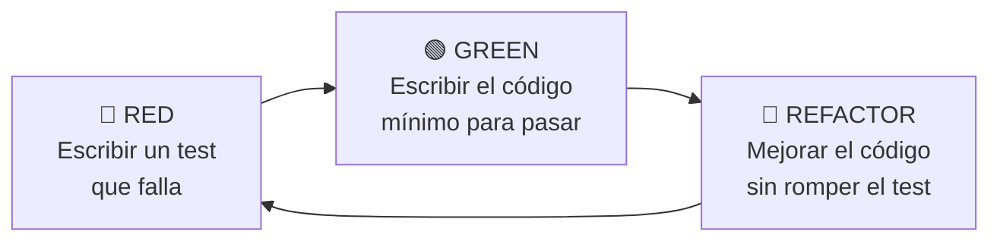
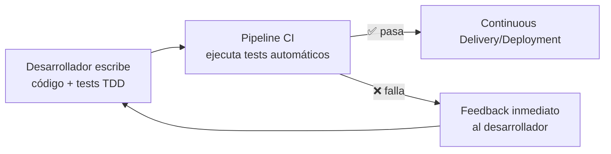

# Test-Driven Development (TDD)

> [!abstract] Resumen rápido
> TDD es una metodología de desarrollo donde **primero se escriben las pruebas** que definen el comportamiento esperado del código, y **después** se escribe el código que las satisface. Su ciclo central es **Red → Green → Refactor**.

## 1. Definición y propósito

TDD (*Test-Driven Development*) es una práctica de ingeniería de software en la que el desarrollador:

1. Escribe un **caso de prueba** que describe el comportamiento deseado de una función/módulo, **antes** de implementarlo.
2. Escribe el **código mínimo necesario** para que esa prueba pase.
3. **Refactoriza** el código manteniendo el comportamiento validado por la prueba.

**Propósito principal:** mantener el foco en *qué debe hacer el código* desde la perspectiva de quien lo usa (otro desarrollador, un módulo cliente, una API consumidora), en lugar de empezar por *cómo* se implementa. Esto obliga a pensar primero en el **contrato/interfaz** del código.

> [!tip] Idea clave
> TDD no es una técnica de testing, es una técnica de **diseño**. El test es una especificación ejecutable.

---

## 2. El ciclo Red — Green — Refactor



| Fase | Objetivo | Pregunta que responde |
|------|----------|------------------------|
| 🔴 **Red** | Escribir un test que aún falla (porque el código no existe o es incorrecto) | ¿Qué comportamiento espero? |
| 🟢 **Green** | Escribir el código *más simple posible* que haga pasar el test | ¿Cómo lo hago funcionar rápido? |
| 🔵 **Refactor** | Mejorar legibilidad, eliminar duplicación, optimizar diseño, **sin cambiar el comportamiento** | ¿Cómo lo hago mejor sin romperlo? |

**Regla de oro:** nunca se escribe código de producción sin que exista antes un test que lo justifique (que esté en rojo).

---

## 3. TDD en el contexto de DevOps

- **Velocidad con confianza**: los tests actúan como una red de seguridad; si algo se rompe, se detecta de inmediato y no se acumula deuda técnica silenciosa.
- **Automatización en pipelines CI/CD**: los tests escritos con TDD son la base de las etapas de *Continuous Integration*. Cada `push`/`commit` dispara la suite de pruebas automáticamente.
- **"Shift-left testing"**: TDD mueve la detección de errores lo más temprano posible en el ciclo de vida del software (antes de llegar a QA o producción), lo cual es un principio central de DevOps.
- **Menor tiempo de retrabajo**: detectar un bug en desarrollo cuesta órdenes de magnitud menos que detectarlo en producción (ver *Cost of Change Curve*, Boehm).
- **Habilita Continuous Deployment**: sin una suite de tests confiable, no se puede desplegar automáticamente a producción con seguridad.



---

## 4. Conceptos complementarios (no cubiertos en el resumen original)

### 4.1 La Pirámide de Testing
TDD suele trabajar principalmente en la base de la pirámide:

```
        /\
       /E2E\        <- pocos, lentos, costosos
      /------\
     /Integrac.\    <- moderados
    /------------\
   /   Unitarios   \ <- muchos, rápidos, baratos (aquí vive TDD)
  /------------------\
```

- **Tests unitarios**: prueban una función/clase aislada. Es donde TDD se aplica con más frecuencia.
- **Tests de integración**: validan que varios módulos trabajen bien juntos.
- **Tests end-to-end (E2E)**: simulan el flujo completo del usuario.

### 4.2 TDD vs BDD
| | TDD | BDD (Behavior-Driven Development) |
|---|---|---|
| Enfoque | Comportamiento técnico de una unidad de código | Comportamiento del negocio/usuario |
| Lenguaje | Código (assertions) | Lenguaje natural estructurado (Given/When/Then, Gherkin) |
| Público | Desarrolladores | Desarrolladores + stakeholders no técnicos |
| Herramientas típicas | JUnit, pytest, Jest, xUnit | Cucumber, SpecFlow, Behave |

> BDD puede verse como una evolución de TDD orientada a mejorar la comunicación con negocio.

### 4.3 Principio F.I.R.S.T. de buenos tests
- **F**ast (rápidos)
- **I**ndependent (independientes entre sí)
- **R**epeatable (mismos resultados en cualquier entorno)
- **S**elf-validating (pasan o fallan sin intervención manual)
- **T**imely (escritos a tiempo, es decir, antes del código)

### 4.4 Mocks, Stubs y Test Doubles
Al aplicar TDD frecuentemente se necesita aislar dependencias externas (bases de datos, APIs, servicios):
- **Stub**: devuelve respuestas predefinidas.
- **Mock**: además verifica que fue llamado correctamente.
- **Fake**: implementación simplificada y funcional (ej. base de datos en memoria).

### 4.5 Cobertura de código (Code Coverage)
Un efecto colateral positivo de TDD es una alta cobertura de código, pero **cobertura alta no garantiza calidad**: se pueden tener tests que ejecutan código sin realmente validar el comportamiento (assertions débiles).

---

## 5. Ventajas y desventajas

### ✅ Ventajas
- Diseño más limpio y desacoplado (código testeable = código con buena separación de responsabilidades).
- Documentación viva: los tests explican qué hace el sistema.
- Reduce regresiones al refactorizar.
- Feedback inmediato para el desarrollador.

### ⚠️ Desventajas / críticas comunes
- Curva de aprendizaje inicial y mayor tiempo de desarrollo a corto plazo.
- Mal aplicado, puede generar tests frágiles acoplados a la implementación (no al comportamiento).
- No sustituye otros tipos de pruebas (exploratorias, de rendimiento, de seguridad).

---

## 6. Herramientas comunes por lenguaje

| Lenguaje | Frameworks típicos |
|----------|--------------------|
| Java | JUnit, TestNG, Mockito |
| Python | pytest, unittest |
| JavaScript/TypeScript | Jest, Mocha, Vitest |
| C# | xUnit, NUnit, MSTest |
| Go | testing (stdlib), Testify |

Integración típica en pipelines: **GitHub Actions, GitLab CI, Jenkins, Azure DevOps, CircleCI**, ejecutando la suite en cada Pull Request.

---

## 7. Preguntas para repasar (auto-evaluación)

- [ ] ¿Puedo explicar el ciclo Red-Green-Refactor sin ver mis notas?
- [ ] ¿Por qué se dice que TDD es una técnica de diseño y no solo de testing?
- [ ] ¿Cómo se relaciona TDD con "shift-left testing" en DevOps?
- [ ] ¿Cuál es la diferencia entre un mock y un stub?
- [ ] ¿Qué significa el principio F.I.R.S.T.?

---

## 8. Recursos recomendados para profundizar

- 📘 *Test-Driven Development: By Example* — Kent Beck (el libro fundacional de TDD).
- 📘 *Growing Object-Oriented Software, Guided by Tests* — Steve Freeman & Nat Pryce.
- 🌐 Martin Fowler — artículo ["TestDrivenDevelopment"](https://martinfowler.com/bliki/TestDrivenDevelopment.html).
- 🌐 Documentación oficial de tu framework de testing (pytest, JUnit, Jest) para practicar el ciclo con ejemplos reales.

---

## 9. Notas relacionadas
- [[CI-CD Pipeline]]
- [[Pirámide de Testing]]
- [[BDD - Behavior Driven Development]]
- [[Principios de DevOps]]
- [[Refactoring]]

---
#devops #tdd #testing #buenas-practicas
