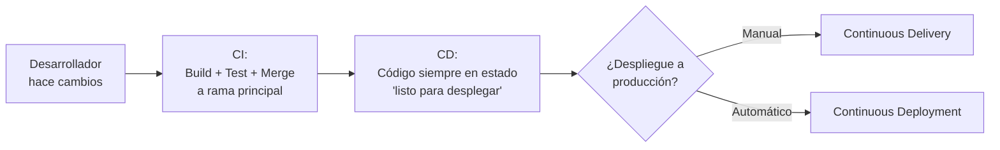
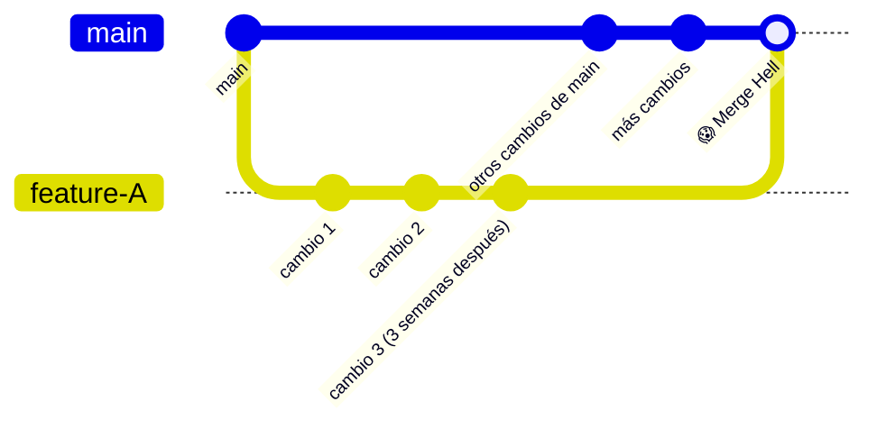

# CI vs CD: Definiciones Precisas y Estrategias de Ramificación

> [!abstract] Resumen rápido
> **CI (Integración Continua)** = construir, probar e integrar cada cambio a la rama principal constantemente. **CD (Entrega Continua)** = asegurar que ese código integrado pueda desplegarse rápido y de forma segura a un entorno similar a producción **en cualquier momento** — aunque el despliegue real a producción sea un paso aparte. Esta lección se enfoca en el **"C" de Integración**: cómo trabajar con ramas cortas transforma radicalmente el flujo de un equipo.

> [!note] Nota relacionada
> El panorama completo del pipeline (Build → Test → Stage → Deploy → Monitor) y el caso práctico paso a paso ya están en [[CI-CD Pipeline]]. Esta nota profundiza específicamente en la **definición precisa de CI vs CD** y en algo que aquella nota no cubría: **estrategias de ramificación (branching)**.

---

## 1. Definiciones precisas: CI vs CD

Es común usar "CI/CD" como si fuera un solo concepto, pero son dos prácticas **distintas y secuenciales**:

| | **Integración Continua (CI)** | **Entrega Continua (CD)** |
|---|---|---|
| **Qué garantiza** | Que cada cambio de código se **construye, prueba e integra** exitosamente a la rama principal | Que el código integrado **puede desplegarse** de forma rápida y segura, en cualquier momento |
| **Dónde termina** | El código está fusionado (merged) en `main`/`trunk`, validado por pruebas automatizadas | El código está listo en un entorno similar a producción — el despliegue real a producción **puede** requerir un paso adicional (manual o automático, ver [[CI-CD Pipeline]]) |
| **Pregunta que responde** | "¿Este cambio nuevo rompe algo que ya funcionaba?" | "¿Podríamos desplegar esto a producción ahora mismo, con confianza?" |
| **Frecuencia típica** | Varias veces al día, por cada desarrollador | Constante — el código *siempre* está en estado desplegable, aunque no se despliegue a cada rato |

> [!important] Matiz clave del resumen
> CD **no significa que el código llegue a producción automáticamente** — eso es específicamente *Continuous Deployment* (ver [[CI-CD Pipeline]], donde se distingue de *Continuous Delivery*). CD en su definición más general solo garantiza que el código **está listo** para desplegarse en cualquier momento, con alta confianza, gracias a que pasó por todo el proceso de CI primero.



---

## 2. Prácticas tradicionales vs Integración Continua

### 2.1 El problema: ramas largas (long-lived branches)

En el desarrollo tradicional (a veces llamado *Feature Branching* extremo o *GitFlow* mal aplicado), cada desarrollador o equipo trabaja en una **rama separada durante días o semanas** antes de fusionarla ("merge") a la rama principal.

**Problemas que genera:**
- **Conflictos de merge masivos**: mientras más tiempo pasa una rama separada del resto, más diverge el código, y más difícil (y riesgoso) es reconciliar los cambios al fusionar — el clásico *Merge Hell* mencionado en [[CI-CD Pipeline]].
- **Feedback tardío**: un error de diseño o un conflicto de lógica solo se descubre al momento de fusionar, cuando ya se invirtió mucho tiempo en una dirección potencialmente equivocada.
- **Integración como "evento especial"**: fusionar ramas se convierte en un momento estresante y poco frecuente, en vez de una rutina simple y de bajo riesgo.



### 2.2 La solución: ramas cortas y frecuentes (Short-Lived Branches)

CI promueve el patrón opuesto: cada rama vive **poco tiempo** (idealmente menos de un día), y cada característica terminada se integra a la rama principal **diariamente** o incluso varias veces al día.

```mermaid
gitGraph
    commit id: "main"
    branch feature-A
    commit id: "cambio pequeño"
    checkout main
    merge feature-A id: "✅ merge rápido"
    branch feature-B
    commit id: "otro cambio pequeño"
    checkout main
    merge feature-B id: "✅ merge rápido"
```

**Por qué funciona mejor:**
- **Detección temprana de problemas**: si dos desarrolladores tocan código relacionado, el conflicto aparece en horas, no en semanas — mucho más fácil de resolver mientras el contexto está fresco.
- **Menor divergencia = menor riesgo por integración**: cada merge es pequeño y manejable, siguiendo el mismo principio de [[Principios Fundamentales de DevOps (Resumen Integrador)|lotes pequeños]] aplicado específicamente al control de versiones.
- **La rama principal siempre refleja el estado real y actualizado del sistema**, en vez de ser una foto del pasado que varias ramas paralelas van a contradecir.

### 2.3 Trunk-Based Development (mención necesaria)
La versión más estricta de "ramas cortas" es el **Trunk-Based Development**, donde los desarrolladores integran directamente a la rama principal (`trunk`) al menos una vez al día, evitando casi por completo las ramas de larga duración. Ya se mencionó como concepto complementario en [[Principios Fundamentales de DevOps (Resumen Integrador)]] — esta lección explica *por qué* esa práctica existe: es la consecuencia lógica de tomar en serio la Integración Continua.

---

## 3. Beneficios y buenas prácticas de CI

### 3.1 Trabajar en pequeños lotes
Ya cubierto en profundidad en [[Principios Fundamentales de DevOps (Resumen Integrador)]] — aquí se aplica específicamente al tamaño de cada *commit*/*pull request*, no solo al tamaño de cada entrega al cliente.

### 3.2 Pull Requests (Solicitudes de Extracción)
Un **Pull Request (PR)** es la solicitud formal de fusionar una rama a la rama principal, y cumple dos funciones a la vez:

1. **Revisión de código (Code Review)**: al menos otro miembro del equipo revisa los cambios antes de aprobarlos — retoma el principio de [[Cultura DevOps y Critica al Taylorismo|codificación social]].
2. **Punto de comunicación**: el PR documenta *qué* cambió y *por qué*, sirviendo como historial y como espacio de discusión técnica (comentarios en líneas específicas del código).

> [!tip] PR corto = revisión mejor
> Un Pull Request pequeño (pocos archivos, cambio acotado) se revisa en minutos y con atención real. Un PR gigante (cientos de líneas, muchos archivos) casi invita a una aprobación superficial ("se ve bien" sin leer todo a fondo) — otra razón práctica para preferir ramas cortas y cambios pequeños.

### 3.3 Pruebas automatizadas en cada integración
Cada vez que se abre o actualiza un Pull Request, el pipeline de CI **debe** ejecutar automáticamente la suite de pruebas (ver [[TDD - Test-Driven Development]]) antes de permitir el merge. Esto convierte a las pruebas en un **portero automático**: código que no pasa las pruebas simplemente no puede fusionarse a la rama principal.

**Buena práctica común**: configurar el repositorio para que el botón de "Merge" quede **bloqueado** hasta que el pipeline de CI reporte éxito ("required status checks" en GitHub, por ejemplo).

### 3.4 Resultado: velocidad + reducción de riesgo simultáneas
El resumen destaca algo que suele parecer contradictorio a primera vista: **CI permite ir más rápido *y* reducir riesgo al mismo tiempo** — no es un trade-off entre velocidad y seguridad.

**Por qué no es una contradicción:**
- Cambios pequeños y frecuentes son individualmente **de bajo riesgo** (fáciles de revisar, probar y revertir si algo sale mal).
- Al no acumular trabajo sin integrar, se evita el "big bang" de riesgo concentrado que representa fusionar semanas de cambios de una sola vez.
- El feedback constante (¿pasó el test? ¿pasó el review?) permite corregir el rumbo en minutos, no reescribir semanas de trabajo.

---

## 4. Conceptos complementarios (no cubiertos en el resumen original)

### 4.1 Feature Flags como complemento a ramas cortas
Cuando una funcionalidad grande no puede terminarse en un solo día pero el equipo igual quiere seguir practicando CI, se usa un **Feature Flag** (ya mencionado en [[CI-CD Pipeline]]): el código incompleto se integra a la rama principal igualmente, pero **desactivado** detrás de un flag, hasta que esté listo para activarse. Esto permite mantener ramas cortas incluso para trabajo que toma semanas en completarse.

### 4.2 Build verde / Build roto (Green Build / Broken Build)
Convención de CI: la rama principal debe estar **siempre en estado "verde"** (todos los tests pasan). Si un merge rompe el build, se considera una **prioridad máxima del equipo** arreglarlo de inmediato — nadie más debería seguir integrando sobre una rama principal rota, porque eso solo apila más incertidumbre sobre un problema ya existente.

### 4.3 Estrategias de merge en Git
| Estrategia | Cómo funciona | Cuándo usarla |
|---|---|---|
| **Merge Commit** | Conserva el historial completo de la rama, con un commit de fusión | Cuando se quiere trazabilidad detallada de cada rama |
| **Squash and Merge** | Combina todos los commits de la rama en uno solo antes de fusionar | Mantiene el historial de `main` limpio y legible, un commit por feature |
| **Rebase and Merge** | Reescribe los commits de la rama sobre la punta actual de `main`, sin commit de fusión | Historial lineal, sin "ramificaciones" visuales |

### 4.4 Peer review vs Code review automatizado
Además de la revisión humana en el Pull Request, muchos equipos añaden revisión automatizada mediante **linters** (verifican estilo de código) y **análisis estático** (detectan posibles bugs o vulnerabilidades sin ejecutar el código) como parte del pipeline de CI, complementando —no reemplazando— el ojo humano.

---

## 5. Preguntas para repasar (auto-evaluación)

- [ ] ¿Cuál es la diferencia exacta entre lo que garantiza CI y lo que garantiza CD?
- [ ] ¿Por qué las ramas largas generan más conflictos que las ramas cortas, más allá de "es más código"?
- [ ] ¿Qué dos funciones cumple un Pull Request, además de simplemente "pedir permiso para fusionar"?
- [ ] ¿Por qué se dice que CI permite velocidad y reducción de riesgo al mismo tiempo, en vez de ser un trade-off?
- [ ] ¿Cómo usarías un Feature Flag para mantener ramas cortas en una funcionalidad que toma varias semanas?
- [ ] ¿Qué significa que la rama principal esté "en verde", y por qué arreglar un build roto es prioridad máxima?

---

## 6. Recursos recomendados para profundizar

- 🌐 [Trunk Based Development](https://trunkbaseddevelopment.com/) — ya recomendado en [[Cultura DevOps y Critica al Taylorismo]], aplica directamente aquí también.
- 🌐 Artículo de Martin Fowler sobre [Continuous Integration](https://martinfowler.com/articles/continuousIntegration.html) — el artículo de referencia histórico sobre el tema.
- 🌐 [Guía de Atlassian sobre estrategias de branching en Git](https://www.atlassian.com/git/tutorials/comparing-workflows)
- 🌐 [Documentación de GitHub sobre Pull Requests](https://docs.github.com/en/pull-requests)

---

## 7. Notas relacionadas
- [[CI-CD Pipeline]]
- [[TDD - Test-Driven Development]]
- [[Principios Fundamentales de DevOps (Resumen Integrador)]]
- [[Cultura DevOps y Critica al Taylorismo]]
- [[Ciclos de Vida en DevOps y QA]]

---
#devops #ci-cd #git #ramas #pull-requests
