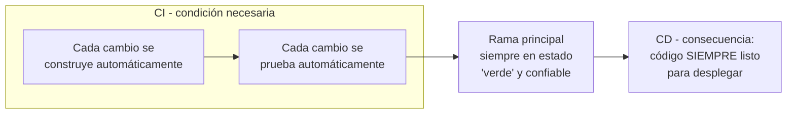

# Componentes del Pipeline CI/CD y los 5 Principios de Entrega Continua

> [!abstract] Resumen rápido
> CI y CD son inseparables: **CD** (la rama principal siempre desplegable) **depende de** que exista **CI** (cada cambio se construye y prueba automáticamente). Esta lección detalla las **piezas físicas** que componen un pipeline real, y formaliza **5 principios** que deben cumplirse para que la entrega continua funcione de verdad — no solo tener herramientas, sino aplicarlas con criterio.

> [!note] Notas relacionadas
> El flujo completo del pipeline y un caso práctico paso a paso ya están en [[CI-CD Pipeline]]. La distinción precisa CI vs CD y las estrategias de ramas cortas están en [[CI vs CD - Ramas Cortas y Pull Requests]]. Aquí nos enfocamos en **los componentes técnicos del pipeline como sistema** y en **los 5 principios formales de Continuous Delivery** (marco no cubierto antes).

---

## 1. CI y CD: la relación de dependencia

> [!important] Idea central del resumen
> **CD depende de CI, no al revés.** No se puede tener la rama principal "siempre lista para desplegar" (CD) si no existe primero un proceso confiable que construya y pruebe automáticamente cada cambio antes de integrarlo (CI). CI es la **condición necesaria** de CD, no una práctica paralela e independiente.

---

## 2. Componentes de un pipeline CI/CD

El resumen lista los elementos físicos/técnicos que forman el pipeline como sistema. Vale la pena entender el **rol específico** de cada uno:

| Componente | Rol |
|---|---|
| **Repositorio de código** (GitHub, GitLab, Bitbucket) | Fuente única de verdad del código fuente; dispara el pipeline en cada `push`/PR |
| **Servidor de construcción (Build Server)** | Compila/empaqueta el código (ej. `npm build`, `mvn package`); detecta errores de compilación inmediatamente |
| **Servidor de integración** (para pruebas automatizadas) | Ejecuta la suite de tests (unitarios, integración) sobre el build recién generado — ver [[TDD - Test-Driven Development]] |
| **Repositorio de artefactos** (Docker Hub, Nexus, Artifactory, Amazon ECR) | Almacena el resultado empaquetado y versionado (imagen, `.jar`, `.zip`) — garantiza "build once, deploy everywhere" |
| **Herramientas de automatización de despliegue** (Kubernetes, scripts de IaC — ver [[IaC - Infraestructura Efimera y Entrega Inmutable]]) | Toman el artefacto validado y lo despliegan al entorno correspondiente (Staging, Producción) |

> [!tip] En la práctica, muchas veces son la misma herramienta
> Herramientas modernas como **GitHub Actions** o **GitLab CI** integran varios de estos roles (build server + servidor de integración + orquestación de despliegue) en una sola plataforma, pero conceptualmente **siguen siendo responsabilidades distintas** dentro del flujo — es importante distinguirlas para diagnosticar en qué etapa exacta falla un pipeline cuando algo sale mal.

---

## 3. Los 5 Principios de la Entrega Continua

Este es el aporte central y nuevo de esta lección: un **marco formal de 5 principios** que deben cumplirse para que "hacer CD" sea real, y no solo tener un pipeline técnicamente configurado pero mal usado.

### 3.1 Calidad incorporada (Built-in Quality)
La calidad **no se verifica al final** del proceso como una etapa separada — se construye en **cada paso** del pipeline. Esto significa:
- Pruebas automatizadas en cada nivel (ver [[TDD - Test-Driven Development]], [[BDD - Behavior-Driven Development]]), no solo un QA manual revisando al final.
- Si la calidad estuviera "incorporada" correctamente, un bug grave nunca debería llegar hasta la fase de aprobación manual — debería haberse detectado automáticamente mucho antes.

> [!note] Diferencia con el modelo tradicional
> En Ops/QA tradicional, la calidad se "inspecciona" al final (una etapa de QA separada, después de que Desarrollo "terminó"). En CD, la calidad es responsabilidad de **todo el pipeline**, integrada desde el primer commit.

### 3.2 Trabajar en pequeños lotes
Ya desarrollado en [[Principios Fundamentales de DevOps (Resumen Integrador)]] y [[CI vs CD - Ramas Cortas y Pull Requests]] — aquí se formaliza como uno de los **cinco pilares oficiales** de Continuous Delivery, no solo una buena práctica sugerida.

### 3.3 Automatización de tareas repetitivas
Todo lo que un humano hace de forma manual y repetitiva en el camino del código hacia producción (compilar, correr tests, empaquetar, desplegar) es candidato a automatizarse — no porque las personas "no puedan hacerlo bien", sino porque:
- Las tareas repetitivas manuales son **propensas a error humano** por fatiga o distracción.
- Automatizarlas **libera tiempo** para el trabajo que sí requiere criterio humano (diseño, resolución de problemas) — el mismo argumento visto en [[Cultura DevOps y Critica al Taylorismo]] sobre por qué la automatización no contradice el rechazo al Taylorismo.

### 3.4 Mejora continua basada en mediciones
Las decisiones sobre cómo mejorar el pipeline y el proceso de desarrollo se toman **con datos**, no con intuición:
- Métricas como *lead time* (tiempo desde el commit hasta producción), frecuencia de despliegue, tasa de fallos de cambio (*change failure rate*) y MTTR (ver [[Resiliencia y Diseño para el Fallo]]) — estas cuatro son conocidas como las **DORA Metrics** (DevOps Research and Assessment), el estándar de la industria para medir el desempeño de un equipo DevOps.
- Sin medición, "mejorar el proceso" se vuelve una opinión subjetiva; con medición, se vuelve un objetivo verificable.

### 3.5 Responsabilidad compartida
Retoma directamente el concepto de romper silos visto en [[Ops Tradicional vs DevOps]] y [[Cultura DevOps y Critica al Taylorismo]]: el pipeline, la calidad del código y la estabilidad de producción **no son responsabilidad exclusiva de un rol** (QA, Ops) — todo el equipo (incluyendo Desarrollo) es dueño del resultado de extremo a extremo.

> [!tip] Los 5 principios como checklist
> Si tu equipo tiene un pipeline técnicamente funcional pero **no** cumple estos 5 principios (ej. la calidad se revisa solo al final, los lotes son grandes, hay pasos manuales sin automatizar, nadie mide nada, y "eso es problema de Ops") — técnicamente tienen un pipeline CI/CD, pero **culturalmente no están haciendo Continuous Delivery de verdad**.

---

## 4. Gestión del riesgo y despliegue continuo

### 4.1 La paradoja aparente: más despliegues = menos riesgo
El resumen señala algo contraintuitivo: DevOps gestiona el riesgo **aumentando** la frecuencia de despliegues, no reduciéndola. La lógica:

- Desplegar con poca frecuencia significa que cada despliegue acumula **muchos cambios**, lo que dificulta identificar cuál cambio específico causó un problema si algo falla.
- Desplegar con alta frecuencia significa que cada despliegue es **pequeño**, por lo que si algo falla, el causante es obvio (es el cambio más reciente) y el impacto está naturalmente limitado.
- Practicar el despliegue constantemente también vuelve el proceso mismo **más confiable** — un proceso que se ejecuta una vez al mes tiene más probabilidad de fallar por desuso/desactualización que uno que se ejecuta decenas de veces al día.

> Esta es la misma lógica de fondo vista en [[Ops Tradicional vs DevOps]]: Ops tradicional minimiza el riesgo evitando el cambio; DevOps lo minimiza **practicándolo constantemente** hasta volverlo rutinario.

### 4.2 Técnicas para desplegar sin tiempo de inactividad (ya vistas, aquí contextualizadas dentro de gestión de riesgo)

| Técnica | Cómo reduce el riesgo específicamente |
|---|---|
| **Feature Flags** | Permiten desplegar código a producción **desactivado**, separando el acto de "desplegar" del acto de "liberar" la funcionalidad al usuario — se puede activar gradualmente o revertir instantáneamente sin un nuevo despliegue |
| **Blue-Green Deployment** | Mantiene dos entornos completos; si la versión nueva falla, se revierte el tráfico al entorno anterior de forma prácticamente instantánea |
| **Canary Testing/Release** | Libera el cambio a un pequeño % de usuarios reales primero, limitando el "radio de impacto" (*blast radius*, ver [[Ops Tradicional vs DevOps]]) antes de expandir al 100% |

> Ver el detalle técnico completo de estas tres técnicas en [[CI-CD Pipeline]], sección "Estrategias de despliegue".

---

## 5. Conceptos complementarios (no cubiertos en el resumen original)

### 5.1 DORA Metrics (las 4 métricas clave)
Formalizadas por el equipo de investigación DORA (Google), citadas en el libro *Accelerate*:

| Métrica | Qué mide |
|---|---|
| **Deployment Frequency** | Con qué frecuencia se despliega a producción |
| **Lead Time for Changes** | Tiempo desde que se hace un commit hasta que corre en producción |
| **Change Failure Rate** | % de despliegues que causan un fallo en producción |
| **Time to Restore Service (MTTR)** | Tiempo para recuperarse de un fallo en producción |

Los equipos de "alto desempeño" según DORA despliegan más seguido, con menor lead time, menor tasa de fallo Y menor tiempo de recuperación — desmontando la idea de que velocidad y estabilidad son opuestos.

### 5.2 Pipeline como "definition of done" técnica
Un cambio que no ha pasado por todas las etapas del pipeline (build, test, staging) **no debería considerarse "terminado"**, sin importar que el desarrollador crea que "ya funciona en su máquina" — conecta con el concepto de Definition of Done visto en [[Ciclos de Vida en DevOps y QA]].

### 5.3 Pipeline visibility (visibilidad del pipeline)
Buena práctica adicional: el estado del pipeline (qué etapa está corriendo, si pasó o falló, cuánto tarda cada etapa) debe ser **visible para todo el equipo** en tiempo real (dashboards, notificaciones en Slack/Teams), reforzando la responsabilidad compartida — nadie debería enterarse de un build roto por accidente horas después.

---

## 6. Preguntas para repasar (auto-evaluación)

- [ ] ¿Por qué se dice que CD depende de CI y no al revés?
- [ ] ¿Cuáles son los 5 componentes técnicos de un pipeline CI/CD y qué rol cumple cada uno?
- [ ] ¿Puedes nombrar y explicar los 5 principios de la Entrega Continua con tus propias palabras?
- [ ] ¿Por qué "calidad incorporada" es distinto de "revisar calidad al final"?
- [ ] ¿Cómo puede aumentar la frecuencia de despliegues *reducir* el riesgo en vez de aumentarlo?
- [ ] ¿Cuáles son las 4 métricas DORA y qué mide cada una?

---

## 7. Recursos recomendados para profundizar

- 📘 *Continuous Delivery* — Jez Humble & David Farley (fuente original de los principios de Continuous Delivery).
- 📘 *Accelerate* — Nicole Forsgren, Jez Humble, Gene Kim (origen y validación empírica de las DORA Metrics).
- 🌐 [DORA — Google Cloud](https://dora.dev/) — sitio oficial de investigación DORA, con el reporte anual "State of DevOps".
- 🌐 [Continuous Delivery Foundation](https://cd.foundation/) — recursos y estándares de la industria sobre CD.

---

## 8. Notas relacionadas
- [[CI-CD Pipeline]]
- [[CI vs CD - Ramas Cortas y Pull Requests]]
- [[Ops Tradicional vs DevOps]]
- [[Cultura DevOps y Critica al Taylorismo]]
- [[Resiliencia y Diseño para el Fallo]]
- [[IaC - Infraestructura Efimera y Entrega Inmutable]]
- [[Ciclos de Vida en DevOps y QA]]

---
#devops #ci-cd #pipeline #entrega-continua #gestion-de-riesgo #dora-metrics
