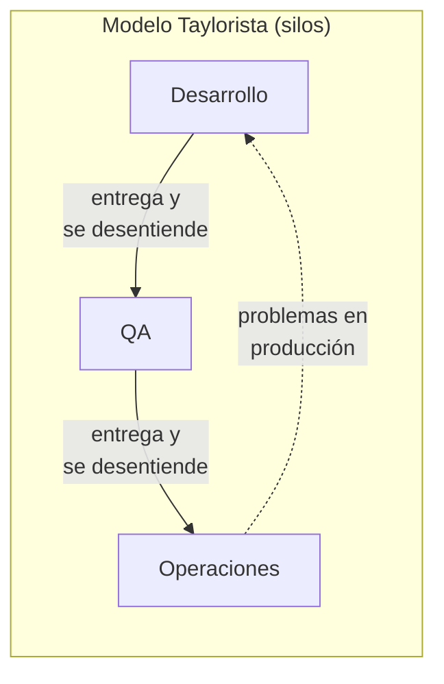

# Cultura DevOps: de la Línea de Producción al Trabajo Artesanal

> [!abstract] Resumen rápido
> DevOps no es solo herramientas y pipelines: es ante todo un **cambio cultural**. Requiere abandonar el modelo de **mando y control** heredado del Taylorismo (diseñado para fábricas del siglo XX) y adoptar una cultura de **colaboración, confianza y responsabilidad compartida**, porque el desarrollo de software se parece más a un **trabajo artesanal de conocimiento** que a una línea de producción.

---

## 1. ¿Qué es el Taylorismo?

El **Taylorismo** (o *Scientific Management*) es un modelo de organización del trabajo creado por Frederick Taylor a inicios del siglo XX para **fábricas y líneas de producción en cadena**. Sus principios centrales:

- **División del trabajo en tareas muy específicas y repetitivas** — cada obrero hace una sola cosa, una y otra vez.
- **Separación entre quien piensa y quien ejecuta**: gerentes/ingenieros diseñan el proceso "óptimo"; los trabajadores solo lo ejecutan sin margen de decisión.
- **Mando y control (Command and Control)**: las decisiones fluyen de arriba hacia abajo; el trabajador no tiene autonomía.
- **Estandarización**: se asume que existe **una única forma correcta** de hacer cada tarea, medible y repetible.

> [!note] Contexto histórico
> Este modelo funcionó bien para producir automóviles o textiles en masa, donde cada unidad producida es **idéntica** a la anterior y el objetivo es maximizar la eficiencia repetitiva. El problema surge al aplicar este mismo molde a un tipo de trabajo fundamentalmente distinto: el desarrollo de software.

---

## 2. Por qué el Taylorismo falla en el desarrollo de software

### 2.1 Silos funcionales
El Taylorismo aplicado a equipos de TI tradicionalmente separaba el trabajo en **silos**: un equipo de Desarrollo, un equipo de QA, un equipo de Operaciones — cada uno con sus propios objetivos, métricas y jefes, entregándose el trabajo entre sí como en una cadena de montaje.

**Problema**: cada "entrega" entre silos genera:
- **Cuellos de botella**: un equipo espera a que otro termine (ej. Dev espera que Ops libere un servidor).
- **Pérdida de contexto**: quien ejecuta una tarea no entendió completamente el problema original, solo recibió una especificación.
- **Culpas cruzadas**: cuando algo falla en producción, Dev culpa a Ops ("funcionaba en mi máquina") y Ops culpa a Dev — síntoma clásico de silos con objetivos desalineados.

### 2.2 Separación entre decisión y ejecución no funciona en trabajo de conocimiento
En una fábrica, el "mejor método" para atornillar una pieza puede diseñarse una vez y repetirse sin cambios. En software:

- **Cada aplicación es única**: no existe una "receta única" reutilizable exactamente igual para cada proyecto, a diferencia de una pieza en una línea de ensamblaje.
- Quien **escribe el código** está constantemente tomando micro-decisiones de diseño que no pueden especificarse completamente de antemano por alguien "de arriba".
- Separar "quien piensa" (arquitecto/gerente) de "quien ejecuta" (programador) desperdicia exactamente la capacidad de resolución de problemas que hace valioso a un desarrollador.

> [!important] Idea clave
> El Taylorismo optimiza para la **repetición idéntica**. El software requiere optimizar para la **resolución de problemas únicos** — son objetivos casi opuestos.

---

## 3. Software como trabajo artesanal (Craftsmanship)

El desarrollo de software se parece más a un **oficio artesanal** que a una línea de producción:

| Producción en cadena (Taylorismo) | Trabajo artesanal (Software) |
|---|---|
| Cada unidad es idéntica a la anterior | Cada aplicación/feature es única |
| El proceso óptimo se define una vez y se repite | El proceso se adapta caso por caso, requiere creatividad |
| El trabajador ejecuta, no decide | El desarrollador decide constantemente cómo resolver el problema |
| Valor = velocidad de repetición | Valor = calidad de la solución + capacidad de adaptarse al cambio |
| Especialización estrecha (una sola tarea) | Especialización profunda + visión amplia del sistema |

Este paralelismo es la base del movimiento **Software Craftsmanship**, que propone tratar la programación como un oficio que requiere práctica deliberada, mentoría y responsabilidad profesional — no como trabajo de línea de ensamblaje intercambiable.

---

## 4. La alternativa: cultura DevOps basada en el Manifiesto Ágil

DevOps hereda directamente los valores del **[Manifiesto Ágil](https://agilemanifesto.org/)** (2001), en particular:

> *"Individuos e interacciones sobre procesos y herramientas."*

Esto no significa que los procesos y herramientas no importen (de hecho DevOps depende fuertemente de automatización), sino que **las personas y su colaboración son el factor decisivo** — las herramientas existen para habilitar esa colaboración, no para reemplazarla ni controlarla.

### Pilares culturales de DevOps frente al Taylorismo

| Taylorismo | Cultura DevOps |
|---|---|
| Mando y control | Confianza y autonomía del equipo |
| Silos funcionales (Dev vs Ops vs QA) | Responsabilidad compartida de extremo a extremo |
| Grandes lotes de trabajo, poca frecuencia | Entregas pequeñas y frecuentes ([[Principios Fundamentales de DevOps (Resumen Integrador)|lotes pequeños]]) |
| El error se castiga, se busca culpable | El error se analiza para aprender (*blameless postmortems*) |
| Estandarización rígida del proceso | Automatización que libera tiempo para pensar, no que reemplaza el criterio humano |

### ¿Por qué la automatización es clave en esta cultura (y no una contradicción)?
La automatización en DevOps ([[CI-CD Pipeline]]) no busca convertir a las personas en engranajes reemplazables (como en Taylorismo), sino **eliminar trabajo repetitivo y propenso a error humano** (compilar, desplegar, correr tests) para que las personas dediquen su energía a lo que sí requiere criterio: diseño, resolución de problemas, comunicación con el cliente.

**Beneficio directo**: al automatizar el camino entre "código escrito" y "código en producción", se puede **entregar frecuentemente en pequeñas versiones**, lo que:
- Minimiza el riesgo por cambio (un lote pequeño que falla es fácil de diagnosticar y revertir).
- Maximiza el aprendizaje (feedback real de usuarios llega constantemente, no una vez cada 6 meses).

---

## 5. Cómo implementar cultura DevOps en un equipo (más allá de las herramientas)

Adoptar DevOps culturalmente implica cambios concretos de comportamiento, no solo instalar un pipeline:

1. **Equipos multifuncionales ("you build it, you run it")**: el mismo equipo que desarrolla una funcionalidad participa también en desplegarla y darle soporte en producción — elimina el "se lo tiro a Ops" propio del Taylorismo.
2. **Confianza y autonomía**: los equipos toman decisiones técnicas sin necesitar aprobación jerárquica para cada micro-decisión (relacionado con abandonar el mando y control).
3. **Blameless postmortems**: cuando algo falla, el análisis se enfoca en **qué del sistema/proceso permitió el fallo**, no en buscar a quién culpar — fomenta que las personas reporten errores honestamente en vez de esconderlos.
4. **Métricas de flujo, no de vigilancia**: medir *lead time*, frecuencia de despliegue, MTTR ([[Resiliencia y Diseño para el Fallo]]) — no "líneas de código escritas por persona" (una métrica típicamente Taylorista y contraproducente en software).
5. **Espacio para aprendizaje continuo**: tiempo dedicado a mejorar el proceso mismo, no solo a producir features (relacionado con "Aprendizaje y Experimentación Continua" de los Tres Caminos de DevOps).

---

## 6. Conceptos complementarios (no cubiertos en el resumen original)

### 6.1 Conway's Law (Ley de Conway)
*"Cualquier organización que diseña un sistema producirá un diseño cuya estructura es una copia de la estructura de comunicación de la organización."*

Explica por qué los silos organizacionales tayloristas terminan produciendo **sistemas fragmentados y con interfaces torpes entre sus partes** (el software refleja los silos que lo construyeron). Es la razón técnica detrás de por qué DevOps promueve equipos multifuncionales: para producir sistemas mejor integrados, primero hay que organizar equipos mejor integrados.

### 6.2 "You build it, you run it" (Amazon / Werner Vogels)
Frase que popularizó el modelo donde el mismo equipo que escribe el código es responsable de operarlo en producción, incluyendo estar de guardia (*on-call*) si algo falla — contraste directo con el Taylorismo, donde "construir" y "operar" eran roles/departamentos separados.

### 6.3 Teoría X y Teoría Y (Douglas McGregor)
Marco clásico de gestión que describe dos visiones opuestas sobre las personas en el trabajo:
- **Teoría X** (base filosófica del Taylorismo): las personas evitan el trabajo por naturaleza, necesitan supervisión estricta y control.
- **Teoría Y** (base filosófica de DevOps/Ágil): las personas encuentran satisfacción en el trabajo significativo, se auto-dirigen y son creativas si se les da la oportunidad.

### 6.4 Blameless Postmortem — plantilla básica
Un postmortem sin culpables típicamente responde:
- ¿Qué pasó, en orden cronológico?
- ¿Qué funcionó bien en la respuesta al incidente?
- ¿Qué se puede mejorar en el sistema/proceso (no en las personas)?
- ¿Qué acciones concretas se toman para que sea menos probable que se repita?

---

## 7. Preguntas para repasar (auto-evaluación)

- [ ] ¿Cuáles son los principios centrales del Taylorismo y por qué funcionaron bien en fábricas?
- [ ] ¿Por qué la separación entre "quien decide" y "quien ejecuta" no funciona bien en desarrollo de software?
- [ ] ¿Qué significa que el software sea "trabajo artesanal" y no producción en cadena?
- [ ] ¿Cómo se relaciona la automatización de DevOps con la idea de liberar tiempo para el criterio humano, en vez de reemplazarlo?
- [ ] ¿Qué es un blameless postmortem y por qué es contrario a la mentalidad Taylorista de "buscar culpables"?
- [ ] ¿Cómo explicarías la Ley de Conway con un ejemplo propio?

---

## 8. Recursos recomendados para profundizar

- 📘 *The Phoenix Project* — Gene Kim, Kevin Behr, George Spafford (novela que ilustra la transición de un equipo desde el mando y control hacia DevOps).
- 📘 *Team Topologies* — Matthew Skelton & Manuel Pais (organización de equipos alineada con Conway's Law).
- 🌐 [El Manifiesto Ágil](https://agilemanifesto.org/iso/es/manifesto.html) — texto original completo en español.
- 🌐 Artículo de Werner Vogels (Amazon CTO) sobre ["You build it, you run it"](https://queue.acm.org/detail.cfm?id=1142065).
- 📘 *Software Craftsmanship: The New Imperative* — Pete McBreen (origen del movimiento de artesanía del software).

---

## 9. Notas relacionadas
- [[Principios Fundamentales de DevOps (Resumen Integrador)]]
- [[CI-CD Pipeline]]
- [[Ciclos de Vida en DevOps y QA]]
- [[Resiliencia y Diseño para el Fallo]]
- [[TDD - Test-Driven Development]]
- [[BDD - Behavior-Driven Development]]

---
#devops #cultura #taylorismo #manifiesto-agil #gestion-de-equipos
