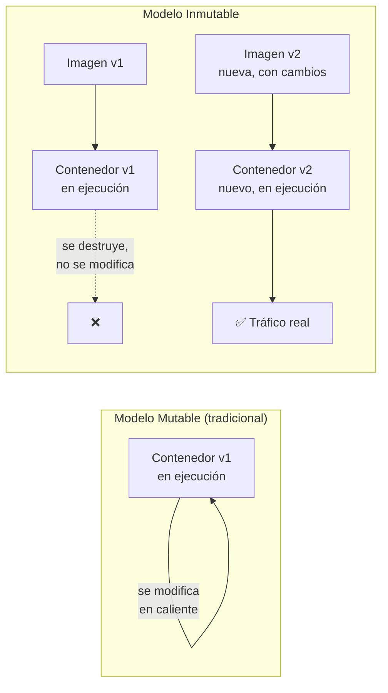
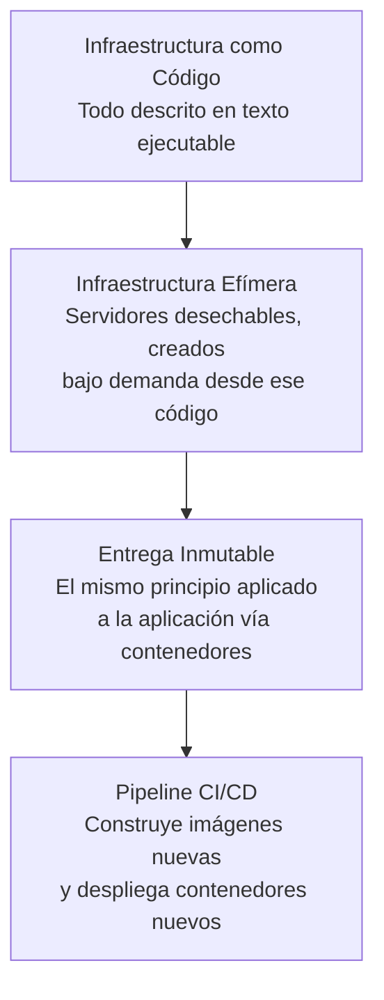

# IaC, Infraestructura Efímera y Entrega Inmutable

> [!abstract] Resumen rápido
> Tres conceptos que se construyen uno sobre otro: **Infraestructura como Código (IaC)** describe la infraestructura como texto ejecutable; **infraestructura efímera** trata los servidores como desechables ("ganado, no mascotas"); **entrega inmutable** con contenedores lleva esa misma filosofía al nivel de la aplicación — en vez de modificar algo en ejecución, se reemplaza por completo con una nueva versión.

> [!note] Nota relacionada
> Esta lección profundiza en IaC e infraestructura efímera, conceptos ya introducidos en [[Ops Tradicional vs DevOps]]. Aquí nos enfocamos en el **panorama de herramientas** y en el concepto nuevo de **entrega inmutable con contenedores**.

---

## 1. Infraestructura como Código (IaC) — repaso y ampliación

**Definición clave del resumen**: describir la infraestructura en un **formato textual ejecutable**, no solo como documentación que alguien lee y sigue manualmente. La diferencia es crucial:

| Documentación tradicional | IaC |
|---|---|
| Un Word/Wiki dice "cómo configurar el servidor" | Un archivo `.tf`/`.yml` **es** la configuración, y se ejecuta directamente |
| Alguien puede seguir mal los pasos, o el doc puede quedar desactualizado | El código no puede "desactualizarse" respecto a sí mismo — si cambia el código, cambia la infraestructura |
| No es verificable automáticamente | Puede probarse, versionarse y revisarse como cualquier otro código (ver [[Ops Tradicional vs DevOps]]) |

### Panorama de herramientas mencionadas en el resumen

Es útil clasificarlas porque **no todas resuelven el mismo problema**:

| Categoría | Herramientas | Qué automatizan |
|---|---|---|
| **Aprovisionamiento de infraestructura** (crear los recursos: servidores, redes, bases de datos) | **Terraform**, AWS CloudFormation | Declaran *qué* recursos deben existir en la nube |
| **Gestión de configuración** (configurar software dentro de un servidor ya existente) | **Ansible**, **Puppet**, **Chef** | Instalan paquetes, configuran archivos, gestionan usuarios/servicios dentro de un servidor |
| **Empaquetado y ejecución de aplicaciones** (contenerización) | **Docker** | Empaqueta la aplicación + sus dependencias en una unidad portable y reproducible |
| **Orquestación de contenedores** (gestionar muchos contenedores a escala) | **Kubernetes** | Decide dónde y cuándo correr contenedores, los reinicia si fallan, los escala automáticamente |

```mermaid
flowchart LR
    A[Terraform
Aprovisiona la infraestructura
"crea 3 servidores"] --> B[Ansible / Puppet / Chef
Configura el software dentro
"instala Nginx, configura usuarios"]
    B --> C[Docker
Empaqueta la aplicación
"imagen reproducible"]
    C --> D[Kubernetes
Orquesta los contenedores
"corre, escala, recupera"]
```

> [!tip] No son competidoras, son capas
> Un stack moderno típico combina varias de estas herramientas juntas: Terraform crea el clúster de Kubernetes en AWS; Kubernetes orquesta contenedores Docker; Ansible puede usarse para configurar componentes que no viven en contenedores. No es "Terraform vs Docker" — cada una resuelve una capa distinta del problema.

### Ansible vs Puppet vs Chef (diferencias entre sí)
| | Ansible | Puppet | Chef |
|---|---|---|---|
| Lenguaje | YAML (declarativo, legible) | DSL propio (Puppet Manifest) | Ruby (DSL, más orientado a código) |
| Requiere agente instalado en el servidor | No (usa SSH) | Sí (agente Puppet) | Sí (agente Chef) |
| Curva de aprendizaje | Más baja | Media | Más alta |

---

## 2. Infraestructura efímera — repaso y ampliación

> Ver también: [[Ops Tradicional vs DevOps]] — sección "Pets vs Cattle"

**Idea central**: la infraestructura se trata como **temporal y desechable**, creada bajo demanda y destruida cuando ya no se necesita, en vez de mantenerse indefinidamente.

### Beneficios concretos (ampliando el resumen)

1. **Entornos de prueba rápidos y desechables**: en vez de mantener un entorno de "staging" fijo compartido por todo el equipo (que se ensucia con datos viejos y configuraciones parcheadas), se puede crear un entorno completo desde cero para cada Pull Request, y destruirlo al terminar — cada prueba corre en un ambiente **limpio y reproducible**.
2. **"Servidores como ganado, no como mascotas"**: si un servidor falla o se corrompe, **no se intenta diagnosticar y reparar** — se destruye y se recrea automáticamente desde el código de IaC. Esto es mucho más rápido y elimina el riesgo de "arreglos parche" que dejan el sistema en un estado desconocido.
3. **Consistencia**: como cada servidor se crea siempre desde el mismo código, se elimina el problema clásico de **configuration drift** (cuando dos servidores que "deberían ser iguales" terminan siendo distintos por pequeños ajustes manuales acumulados a lo largo del tiempo).

> [!warning] Configuration Drift
> Es el fenómeno donde servidores configurados manualmente van acumulando pequeñas diferencias entre sí con el tiempo (un parche aquí, una configuración cambiada allá "solo por esta vez"), hasta que ningún servidor es realmente igual a otro — el problema que la infraestructura efímera + IaC elimina de raíz, porque cada servidor siempre nace exactamente igual, desde el mismo código.

---

## 3. Entrega Inmutable (Immutable Delivery) con Contenedores

### El concepto central
En un modelo **mutable** tradicional, cuando hay que actualizar una aplicación, se **modifica el servidor/contenedor que ya está corriendo**: se sube código nuevo encima del viejo, se reinician servicios, etc.

En un modelo **inmutable**, **nunca se modifica nada en ejecución**. En su lugar:

1. Se construye una **nueva imagen** de contenedor con los cambios.
2. Se despliega un **contenedor completamente nuevo** a partir de esa imagen.
3. El contenedor viejo se **destruye** (no se actualiza).



### Por qué Docker habilita esto naturalmente
- Una **imagen Docker** es un artefacto **inmutable por diseño**: una vez construida, su contenido no cambia. Si necesitas un cambio, construyes una imagen *nueva* (con un tag/versión distinto), no editas la existente.
- Un **contenedor** es una instancia en ejecución de una imagen — pensado para ser efímero: se puede detener, destruir y recrear en segundos a partir de la misma imagen.

### Ventajas de la entrega inmutable

| Ventaja | Por qué ocurre |
|---|---|
| **Reversibilidad instantánea (rollback)** | Si la imagen v2 falla, simplemente se vuelve a desplegar la imagen v1 (que nunca se tocó ni se sobreescribió) — rollback = desplegar la versión anterior, no "deshacer cambios" |
| **Reproducibilidad** | La misma imagen que se probó en Staging es *exactamente* la que llega a producción — sin el riesgo de "funcionaba en mi máquina" (ver [[CI-CD Pipeline]] — "build once, deploy everywhere") |
| **Elimina configuration drift** | No hay forma de que un contenedor "se desvíe" de su definición, porque nunca se modifica en vivo — o es la imagen v1, o es la imagen v2, nunca un punto intermedio indefinido |
| **Despliegues más seguros** | Se pueden correr contenedores v1 y v2 en paralelo temporalmente (ver Blue-Green Deployment en [[CI-CD Pipeline]]), migrando tráfico gradualmente |

> [!important] Conexión con conceptos previos
> La entrega inmutable es la aplicación directa, a nivel de aplicación, de la misma filosofía de "pets vs cattle": un contenedor que falla **no se repara, se reemplaza** por uno nuevo desde la misma imagen — igual que un servidor efímero.

---

## 4. Cómo se conectan los tres conceptos de esta lección



**La idea unificadora**: en los tres niveles (infraestructura completa, servidor individual, aplicación empaquetada), DevOps prefiere **reemplazar por completo** en vez de **modificar en el lugar** — porque reemplazar es predecible, reversible y reproducible; modificar en caliente acumula estado desconocido con el tiempo.

---

## 5. Conceptos complementarios (no cubiertos en el resumen original)

### 5.1 Dockerfile — cómo se define una imagen
Un `Dockerfile` es el archivo de texto (código) que describe cómo construir una imagen: qué sistema base usar, qué dependencias instalar, qué archivos copiar y qué comando ejecutar al iniciar. Es, en esencia, **IaC aplicada específicamente a la aplicación**, no solo a la infraestructura que la rodea.

```dockerfile
FROM node:20
WORKDIR /app
COPY package*.json ./
RUN npm install
COPY . .
CMD ["npm", "start"]
```

### 5.2 Registro de imágenes (Container Registry)
Las imágenes construidas se almacenan en un **registro** (Docker Hub, Amazon ECR, Google Artifact Registry) versionadas por tag (ej. `mi-app:v1.2.0`), de donde luego se descargan para desplegarse — el mismo concepto de **Artifact Repository** mencionado en [[CI-CD Pipeline]].

### 5.3 Kubernetes y la infraestructura efímera de contenedores
Kubernetes lleva la infraestructura efímera al extremo: si un contenedor (Pod) falla o su nodo se cae, Kubernetes simplemente **crea uno nuevo** en otro lugar del clúster, sin intervención humana — la automatización completa de "servidores como ganado" aplicada a nivel de contenedor individual.

### 5.4 Diferencia entre imagen y contenedor (aclaración conceptual frecuente)
| Imagen | Contenedor |
|---|---|
| Plantilla estática, inmutable | Instancia en ejecución de una imagen |
| Se "construye" (`docker build`) | Se "corre" (`docker run`) |
| Una imagen puede generar muchos contenedores idénticos | Cada contenedor tiene su propio estado en memoria mientras corre |

### 5.5 Volúmenes: la excepción a la inmutabilidad
Si los contenedores son efímeros y desechables, ¿dónde vive la información que sí debe persistir (bases de datos, archivos subidos por usuarios)? Se usan **volúmenes**: almacenamiento externo al contenedor, que persiste incluso si el contenedor que lo usa se destruye y se reemplaza por uno nuevo.

---

## 6. Preguntas para repasar (auto-evaluación)

- [ ] ¿Cuál es la diferencia esencial entre documentar infraestructura y describirla como IaC?
- [ ] ¿Cómo implementaría infraestructura efímera en un entorno cloud (ej. para pruebas de cada Pull Request)?
- [ ] ¿Qué diferencia hay entre herramientas de aprovisionamiento (Terraform) y de gestión de configuración (Ansible/Puppet/Chef)?
- [ ] ¿Por qué se dice que una imagen Docker es "inmutable" y qué pasa en su lugar cuando necesitas un cambio?
- [ ] ¿Cómo mejora la entrega inmutable la capacidad de hacer rollback comparado con modificar un contenedor en ejecución?
- [ ] Si los contenedores son efímeros, ¿dónde y cómo se guardan los datos que sí necesitan persistir?

---

## 7. Recursos recomendados para profundizar

- 🌐 [Documentación oficial de Docker](https://docs.docker.com/get-started/) — introducción práctica a imágenes y contenedores.
- 🌐 [Documentación oficial de Kubernetes — Conceptos básicos](https://kubernetes.io/docs/concepts/overview/)
- 🌐 [Documentación oficial de Terraform](https://developer.hashicorp.com/terraform/docs)
- 📘 *Infrastructure as Code* — Kief Morris (ya recomendado en [[Ops Tradicional vs DevOps]], cubre también infraestructura efímera e inmutabilidad a fondo).
- 🌐 Artículo de Martin Fowler sobre [Immutable Server](https://martinfowler.com/bliki/ImmutableServer.html).

---

## 8. Notas relacionadas
- [[Ops Tradicional vs DevOps]]
- [[CI-CD Pipeline]]
- [[Microservicios Nativos en la Nube]]
- [[Resiliencia y Diseño para el Fallo]]
- [[Cultura DevOps y Critica al Taylorismo]]

---
#devops #iac #contenedores #docker #entrega-inmutable #infraestructura-efimera
