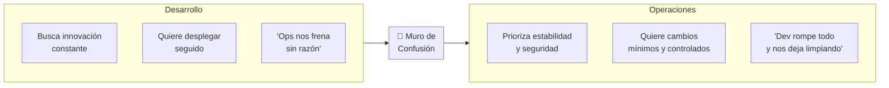
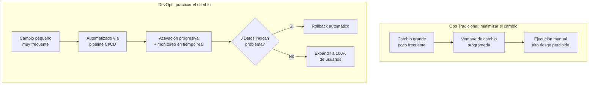

# Ops Tradicional vs DevOps: el "Muro de Confusión"

> [!abstract] Resumen rápido
> Ops tradicional y DevOps parten de **filosofías de riesgo opuestas**: Ops tradicional minimiza el riesgo evitando el cambio ("si funciona, no lo toques"); DevOps minimiza el riesgo **cambiando seguido, en pequeño**. Esta diferencia de fondo es la raíz del choque cultural histórico entre Desarrollo y Operaciones — el llamado **"Wall of Confusion" (Muro de Confusión)**.

---

## 1. Ops tradicional vs DevOps: comparación directa

| Dimensión | **Ops Tradicional** | **DevOps** |
|---|---|---|
| Filosofía de proyecto | "Construir una vez y mantener" — proyectos vistos como complejos y de alto riesgo | Proyectos grandes divididos en **pequeños cambios continuos y manejables** |
| Configuración | **Manual**, servidores configurados a mano ("pet servers") | **Automatizada**, mediante scripts/código |
| Gestión de riesgo en despliegues | **Ventanas de cambio** (change windows): periodos programados y poco frecuentes para desplegar cambios | **Activación progresiva** (ej. canary releases, feature flags — ver [[CI-CD Pipeline]]) |
| Infraestructura | Servidores persistentes, configurados manualmente y mantenidos indefinidamente | **Infraestructura efímera**: servidores/contenedores se crean y destruyen según se necesitan |
| Frecuencia de cambio | Baja (cada cambio es un evento grande y riesgoso) | Alta (cambios pequeños y frecuentes, ver [[Principios Fundamentales de DevOps (Resumen Integrador)|lotes pequeños]]) |
| Cómo se reduce el riesgo | Evitando el cambio | Practicando el cambio constantemente, en porciones pequeñas y reversibles |

> [!important] La diferencia de fondo
> No es que Ops tradicional "no le importe" el riesgo y DevOps "sí" — ambos buscan **minimizar el riesgo**, pero llegan a estrategias opuestas: Ops tradicional asume que el cambio es peligroso y por tanto **lo minimiza y lo rodea de controles manuales**; DevOps asume que el cambio es inevitable y por tanto **lo practica constantemente en dosis pequeñas** hasta volverlo rutinario y de bajo riesgo — la misma lógica detrás de [[Resiliencia y Diseño para el Fallo]] (MTTR sobre MTBF).

---

## 2. El "Muro de Confusión" (Wall of Confusion)

Término (popularizado por Patrick Debois, uno de los fundadores del movimiento DevOps) que describe la barrera de comunicación e incentivos opuestos entre Desarrollo y Operaciones en el modelo tradicional.

### Por qué existe el choque
- **Desarrollo** es evaluado (formal o informalmente) por **entregar features rápido** — su incentivo es el cambio.
- **Operaciones** es evaluada por **mantener el sistema estable y disponible** — su incentivo es la ausencia de cambio (cada cambio es una oportunidad de que algo se rompa).
- Cuando dos equipos tienen **incentivos estructuralmente opuestos** pero dependen uno del otro para completar el mismo trabajo (llevar software a producción), el conflicto es prácticamente inevitable — no es un problema de "personas difíciles", es un problema de **diseño organizacional**.

### Percepciones negativas cruzadas (síntoma típico)
| Cómo ve Dev a Ops | Cómo ve Ops a Dev |
|---|---|
| "Son un cuello de botella burocrático" | "Nos entregan código roto sin documentación" |
| "No entienden la urgencia del negocio" | "No les importa la estabilidad, solo lanzar features" |
| "Ponen reglas solo para tener control" | "Cuando algo falla, somos los primeros en despertarnos a las 3 AM" |

> [!note] No es un problema de mala voluntad
> Ambos equipos suelen tener razón desde su propia perspectiva — el problema es que el **sistema de incentivos** los pone en bandos opuestos, incluso cuando individualmente quieren lo mismo: que el producto funcione bien para el usuario. Esto conecta directamente con la crítica al Taylorismo vista en [[Cultura DevOps y Critica al Taylorismo]]: los silos organizacionales (y sus métricas separadas) son la causa raíz.

---

## 3. Comportamientos requeridos para adoptar DevOps con éxito

### 3.1 Romper silos organizacionales
- Fomentar **propiedad compartida** (*shared ownership*) del sistema completo, no solo de "mi parte".
- Equipos multifuncionales donde Dev y Ops (y QA) colaboran desde el diseño, no se entregan el trabajo en secuencia — retoma el modelo *"you build it, you run it"* visto en [[Cultura DevOps y Critica al Taylorismo]].
- Alta colaboración: reuniones conjuntas, objetivos y métricas compartidas (no "uptime de Ops" vs "features entregadas por Dev" como métricas separadas y en tensión).

### 3.2 Adoptar cambios pequeños y gestionarlos activamente
Igual que en [[Principios Fundamentales de DevOps (Resumen Integrador)|lotes pequeños]]: cambios pequeños son más fáciles de revisar, probar, desplegar y —si algo sale mal— revertir o diagnosticar.

### 3.3 Infraestructura como Código (IaC)
Uno de los comportamientos técnicos más importantes para cerrar el Muro de Confusión.

**Definición**: gestionar y aprovisionar infraestructura (servidores, redes, bases de datos) mediante **archivos de código versionados**, en vez de configuración manual paso a paso en una consola.

| Configuración manual | Infraestructura como Código |
|---|---|
| Un ingeniero configura el servidor "a mano" siguiendo un checklist | Un archivo `.tf`, `.yaml` o similar describe el estado deseado de la infraestructura |
| Difícil de reproducir exactamente igual dos veces ("funciona en mi servidor") | **Reproducible**: el mismo archivo genera siempre el mismo resultado |
| Sin historial de cambios claro | Versionado en Git: se puede ver *qué* cambió, *cuándo* y *quién* lo hizo |
| Servidor "mascota" (pet): se cuida y mantiene indefinidamente | Servidor "ganado" (cattle): si falla, se destruye y se recrea desde el código, no se repara a mano |

**Herramientas típicas de IaC:**
| Herramienta | Enfoque |
|---|---|
| **Terraform** | Aprovisionamiento de infraestructura multi-cloud (declarativo) |
| **AWS CloudFormation** | Aprovisionamiento específico de AWS |
| **Ansible** | Configuración de servidores (más orientado a "configuration management") |
| **Pulumi** | IaC usando lenguajes de programación de propósito general (Python, TypeScript, etc.) |

> [!tip] Por qué IaC reduce el Muro de Confusión
> Cuando la infraestructura es código, **Dev puede leerla, entenderla y hasta proponer cambios vía Pull Request**, igual que con el código de la aplicación. Deja de ser un "territorio oculto" que solo Ops entiende — se vuelve parte del mismo flujo de colaboración y revisión que ya usa Desarrollo.

### 3.4 Infraestructura efímera
Servidores/contenedores que se **crean bajo demanda y se destruyen** cuando ya no se necesitan (en vez de mantenerse indefinidamente). Habilitada directamente por IaC: si toda la infraestructura está descrita en código, recrearla desde cero es trivial y rápido.

### 3.5 Automatizar procesos
Ver [[CI-CD Pipeline]]: automatizar build, test y despliegue elimina buena parte del trabajo manual repetitivo que tradicionalmente hacía Ops, liberando tiempo para tareas de mayor valor (arquitectura, observabilidad, resiliencia).

### 3.6 Ciclos de retroalimentación rápidos y basados en datos
- Monitoreo y observabilidad en tiempo real (métricas, logs, trazas — ver [[Microservicios Nativos en la Nube]] y [[Resiliencia y Diseño para el Fallo]]).
- Decisiones de "¿este cambio es seguro?" basadas en datos reales (tasas de error, tiempos de respuesta), no en la intuición o el miedo genérico al cambio.
- Esto reemplaza la "ventana de cambio" tradicional (una fecha fija, decidida por calendario) por una **activación progresiva monitoreada** (el cambio se libera gradualmente y se evalúa con datos en tiempo real si debe continuar o revertirse).

---

## 4. Comparación visual: el ciclo completo de gestión de riesgo

---

## 5. Conceptos complementarios (no cubiertos en el resumen original)

### 5.1 Pets vs Cattle (Mascotas vs Ganado)
Metáfora clásica de DevOps para explicar el cambio de mentalidad en infraestructura:
- **Servidores "mascota"** (modelo Ops tradicional): tienen nombre propio, se cuidan individualmente, si se enferman se les "cura" (se arreglan a mano).
- **Servidores "ganado"** (modelo DevOps/cloud native): son números en un rebaño, si uno falla simplemente se reemplaza por otro idéntico generado desde IaC — no se invierte tiempo en diagnosticar y reparar cada instancia individual.

### 5.2 Idempotencia en IaC
Propiedad clave de las herramientas de IaC: ejecutar el mismo script de infraestructura **múltiples veces produce siempre el mismo resultado final**, sin efectos secundarios acumulativos. Esto es lo que hace confiable recrear infraestructura efímera repetidamente.

### 5.3 GitOps
Evolución de IaC donde el estado deseado de toda la infraestructura y aplicaciones vive en un repositorio Git, y un agente automatizado sincroniza continuamente el entorno real con lo declarado en el repositorio — cualquier cambio pasa obligatoriamente por Pull Request, reforzando aún más la colaboración Dev-Ops sobre infraestructura.

### 5.4 Blast Radius (Radio de impacto)
Concepto que conecta el punto de "activación progresiva": al desplegar un cambio a un pequeño % de usuarios primero (canary), se limita el "radio de impacto" si algo sale mal, en vez de exponer al 100% de usuarios de inmediato como ocurre típicamente en una ventana de cambio tradicional de "todo o nada".

---

## 6. Preguntas para repasar (auto-evaluación)

- [ ] ¿Cuál es la diferencia filosófica de fondo entre cómo Ops tradicional y DevOps gestionan el riesgo?
- [ ] ¿Qué es el "Muro de Confusión" y por qué surge de incentivos opuestos, no de mala voluntad?
- [ ] ¿Cómo implementarías Infraestructura como Código en un equipo que hoy configura servidores manualmente?
- [ ] ¿Qué significa la metáfora "pets vs cattle" aplicada a servidores?
- [ ] ¿Cómo rompería los silos organizacionales entre Dev y Ops en un equipo real?
- [ ] ¿Qué es la activación progresiva y en qué se diferencia de una ventana de cambio tradicional?

---

## 7. Recursos recomendados para profundizar

- 📘 *The DevOps Handbook* — Gene Kim, Jez Humble, Patrick Debois, John Willis (el propio Patrick Debois es quien popularizó el término "Wall of Confusion").
- 📘 *Infrastructure as Code* — Kief Morris (referencia técnica completa sobre IaC).
- 🌐 [Documentación oficial de Terraform](https://developer.hashicorp.com/terraform/docs) — la herramienta de IaC más usada en la industria.
- 🌐 Artículo de Martin Fowler sobre [GitOps](https://martinfowler.com/bliki/GitOps.html).

---

## 8. Notas relacionadas
- [[Cultura DevOps y Critica al Taylorismo]]
- [[Principios Fundamentales de DevOps (Resumen Integrador)]]
- [[CI-CD Pipeline]]
- [[Resiliencia y Diseño para el Fallo]]
- [[Microservicios Nativos en la Nube]]
- [[Ciclos de Vida en DevOps y QA]]

---
#devops #ops #iac #cultura #muro-de-confusion
