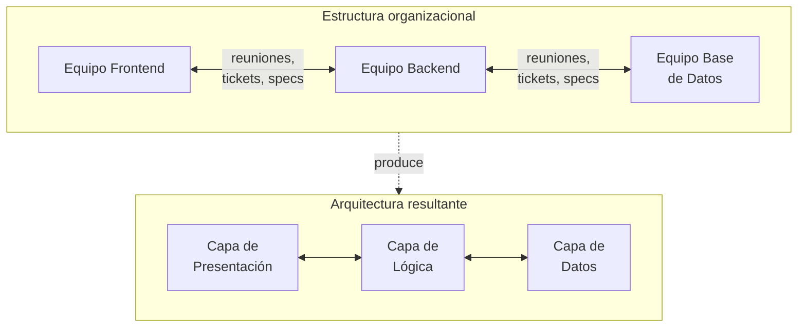
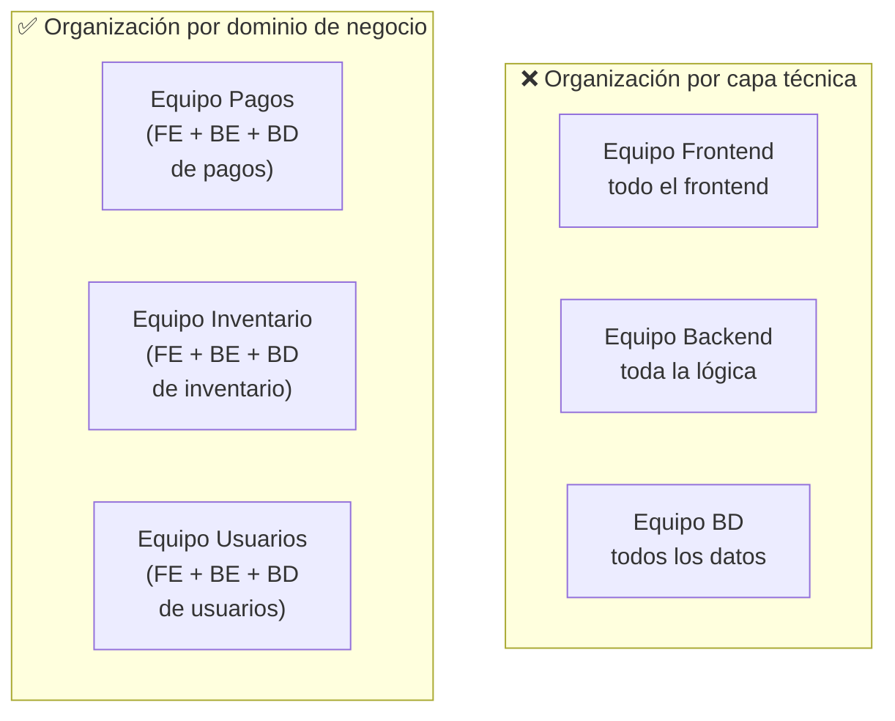

# Estructura Organizacional, Equipos DevOps y la Ley de Conway

> [!abstract] Resumen rápido
> La forma en que se organiza un equipo **determina** la forma del software que produce (Ley de Conway). Por eso DevOps no es solo una cuestión de herramientas: requiere **equipos pequeños, dedicados, multifuncionales y autoorganizados**, idealmente estructurados **alrededor de dominios de negocio** en vez de capas técnicas — con autonomía y responsabilidad de principio a fin.

> [!note] Ya se había mencionado
> La Ley de Conway apareció brevemente en [[Cultura DevOps y Critica al Taylorismo]] y en [[Repaso Final - Taylorismo a CI-CD]]. Esta lección es donde el concepto se desarrolla realmente a fondo — así que esta nota es la referencia completa; las anteriores pueden enlazar aquí.

---

## 1. La Ley de Conway

Formulada por Melvin Conway en 1967:

> *"Cualquier organización que diseña un sistema (en el sentido amplio) producirá un diseño cuya estructura es una copia de la estructura de comunicación de la organización."*

En otras palabras: **la arquitectura del software termina reflejando el organigrama del equipo que lo construyó**, no necesariamente el diseño técnicamente óptimo para el problema.

### Ejemplo del resumen: arquitectura en tres capas por equipos separados

Si una organización tiene:
- Un equipo de **Frontend** (interfaz)
- Un equipo de **Backend/Aplicación** (lógica de negocio)
- Un equipo de **Base de Datos** (DBAs)

...el sistema resultante **tenderá naturalmente** a ser una arquitectura en tres capas (presentación / lógica / datos), porque cada equipo construye la pieza que le corresponde y se comunica con los demás a través de interfaces bien definidas (APIs, contratos de datos) — la misma estructura de comunicación de la organización, calcada en el software.

> [!important] No es una simple observación curiosa
> La Ley de Conway es una **fuerza estructural real**: incluso si el equipo *dice* que quiere una arquitectura distinta, las líneas de comunicación reales de la organización terminan imponiéndose en el diseño del sistema con el tiempo, porque es más fácil comunicarse dentro del propio equipo que cruzar fronteras organizacionales — cada frontera de equipo tiende a convertirse en una frontera técnica (API, servicio separado, capa separada).

### El problema con la arquitectura en tres capas producida por silos
Esta arquitectura, cuando surge de equipos separados por capa técnica (no por dominio de negocio), reproduce exactamente los problemas de silos ya vistos en [[Cultura DevOps y Critica al Taylorismo]]: para entregar **una sola funcionalidad de negocio** (ej. "permitir que el cliente cancele un pedido"), se necesita coordinar cambios simultáneos en frontend, backend y base de datos — es decir, coordinar **tres equipos distintos** para una sola pieza de valor para el cliente.

---

## 2. Características de equipos Agile para DevOps

El resumen describe 4 atributos que un equipo necesita para operar bien bajo DevOps:

| Atributo | Qué significa | Por qué importa |
|---|---|---|
| **Pequeño** | Suficientemente chico para coordinarse sin burocracia excesiva (regla informal: "equipo de dos pizzas" — Amazon) | Equipos grandes generan más overhead de comunicación que trabajo real |
| **Dedicado** | Los miembros trabajan en este equipo/producto de tiempo completo, no repartidos entre 3 proyectos distintos | El cambio de contexto constante destruye productividad y compromiso con el resultado |
| **Multifuncional** | Incluye developers, testers, operaciones y analistas de negocio dentro del *mismo* equipo | Elimina la necesidad de "pedirle algo a otro equipo" para completar una funcionalidad de principio a fin |
| **Autoorganizado** | El equipo decide *cómo* hacer su trabajo, comprometiéndose a metas de sprint sin microgestión externa | Retoma el rechazo al mando y control visto en [[Cultura DevOps y Critica al Taylorismo]] |

> [!tip] "Evitar silos y dependencias externas"
> Un equipo verdaderamente multifuncional y autoorganizado no debería necesitar esperar la aprobación o el trabajo de un equipo externo para completar una historia de usuario de principio a fin. Si constantemente hay que "esperar a que el equipo X libere tiempo", eso es una señal de que el equipo **no** está realmente organizado de forma autosuficiente — típicamente porque está organizado por capa técnica en vez de por dominio de negocio (ver sección 3).

---

## 3. Organización óptima: equipos alrededor de dominios de negocio

En vez de organizar equipos por **capa técnica** (frontend / backend / BD — lo que produce la arquitectura en tres capas rígida del ejemplo de la Ley de Conway), DevOps recomienda organizar equipos alrededor de **dominios de negocio**: cada equipo posee **todo lo necesario** (interfaz, lógica, base de datos) para su área de negocio específica.

### Por qué esto encaja perfectamente con microservicios
Este patrón organizacional es exactamente lo que produce, vía Ley de Conway, una arquitectura de **[[Microservicios Nativos en la Nube]]** bien diseñada: cada equipo de dominio termina construyendo (y siendo dueño de) un servicio independiente con su propia base de datos, alineado 1-a-1 con su área de negocio — no es casualidad que ambos conceptos (organización por dominio + microservicios) suelan aparecer juntos.

> [!important] Ley de Conway usada a favor, no en contra
> Si la Ley de Conway es una fuerza inevitable, la estrategia inteligente no es "ignorarla" sino **diseñar la organización primero** para que la arquitectura que produzca naturalmente sea la que se quiere obtener — a esto a veces se le llama el **"Inverse Conway Maneuver"**: reorganizar equipos deliberadamente para *forzar* la arquitectura deseada (ej. microservicios), en vez de intentar imponer una arquitectura de microservicios sobre una organización todavía estructurada en silos técnicos.

### Autonomía, responsabilidad de principio a fin y misión a largo plazo
Además de tener todas las habilidades necesarias, el resumen agrega tres elementos clave:

- **Autonomía**: el equipo puede tomar decisiones técnicas sobre su dominio sin necesitar aprobación de otro equipo para cada cambio.
- **Responsabilidad de principio a fin**: el mismo equipo que diseña, construye, prueba y despliega su parte del sistema también la **opera y mantiene** — retoma "you build it, you run it" ([[Cultura DevOps y Critica al Taylorismo]]).
- **Misión a largo plazo**: el equipo no es un grupo temporal armado para "el proyecto X" y disuelto después — es un equipo **permanente**, dueño de su dominio indefinidamente, lo que conecta directamente con la idea de "producto, no proyecto" vista en [[Repaso Final - Taylorismo a CI-CD]].

> [!tip] Por qué esto genera "propiedad y orgullo"
> Cuando un equipo sabe que **seguirá siendo dueño** de lo que construye a largo plazo (no lo "entrega y se va"), su relación con la calidad cambia: los atajos técnicos de corto plazo dejan de tener sentido, porque el propio equipo pagará el costo de esa deuda técnica más adelante. La propiedad a largo plazo alinea los incentivos individuales con la salud del sistema a futuro.

---

## 4. Conceptos complementarios (no cubiertos en el resumen original)

### 4.1 Bounded Context (Domain-Driven Design)
La idea de "dominio de negocio" que usa esta lección viene directamente de **Domain-Driven Design (DDD)**, donde un **Bounded Context** es el límite claro dentro del cual un modelo de negocio específico (ej. "Pedido" en el contexto de Pagos vs "Pedido" en el contexto de Envíos, que pueden significar cosas distintas) tiene sentido y coherencia. Ya se mencionó en [[Microservicios Nativos en la Nube]] — aquí se conecta con el equipo humano que es dueño de ese contexto, no solo con el servicio técnico.

### 4.2 Team Topologies — los 4 tipos de equipo
Marco moderno (libro *Team Topologies*, ya recomendado en [[Cultura DevOps y Critica al Taylorismo]]) que formaliza 4 arquetipos de equipo:

| Tipo de equipo | Rol |
|---|---|
| **Stream-Aligned Team** | Equipo alineado a un flujo de valor/dominio de negocio — el "equipo por dominio" descrito en esta lección |
| **Platform Team** | Provee infraestructura/herramientas internas (ej. plataforma de despliegue) que los Stream-Aligned Teams consumen como si fuera un producto |
| **Enabling Team** | Ayuda temporalmente a otros equipos a adquirir una capacidad que les falta (ej. expertos en seguridad que capacitan a otros equipos) |
| **Complicated Subsystem Team** | Equipo especializado para un componente que requiere expertise muy profundo y específico (ej. un motor de procesamiento de video) |

La mayoría de equipos en una organización DevOps madura deberían ser **Stream-Aligned**, con Platform Teams dándoles soporte — evitando que cada equipo de dominio tenga que reinventar su propia infraestructura de despliegue desde cero.

### 4.3 "Two-Pizza Team" (Amazon)
Regla informal popularizada por Jeff Bezos: un equipo debe ser lo suficientemente pequeño como para alimentarse con dos pizzas (aproximadamente 6-10 personas). Más allá de ese tamaño, la complejidad de comunicación interna crece más rápido que la productividad del equipo (relacionado con la Ley de Metcalfe aplicada a canales de comunicación: `n(n-1)/2`).

### 4.4 Cognitive Load (Carga Cognitiva del equipo)
Concepto de *Team Topologies*: un equipo tiene una capacidad limitada de "carga cognitiva" — cuánta complejidad de dominio y técnica puede manejar bien a la vez. Si un equipo de dominio crece en responsabilidades sin límite, eventualmente su carga cognitiva excede su capacidad, y la calidad se degrada — es un argumento adicional a favor de dominios de negocio bien acotados (relacionado con Bounded Context).

---

## 5. Preguntas para repasar (auto-evaluación)

- [ ] ¿Cómo explicarías la Ley de Conway con el ejemplo de tres equipos separados (frontend/backend/BD)?
- [ ] ¿Cuáles son las 4 características que debe tener un equipo Agile para DevOps, y por qué cada una importa?
- [ ] ¿Por qué organizar equipos alrededor de dominios de negocio encaja naturalmente con una arquitectura de microservicios?
- [ ] ¿Qué es el "Inverse Conway Maneuver" y cómo se usaría en la práctica?
- [ ] ¿Por qué la "misión a largo plazo" de un equipo cambia su relación con la calidad del código que produce?
- [ ] ¿Qué diferencia hay entre un Stream-Aligned Team y un Platform Team según Team Topologies?

---

## 6. Recursos recomendados para profundizar

- 📘 *Team Topologies* — Matthew Skelton & Manuel Pais (ya recomendado antes; es la referencia central de esta lección).
- 📘 *Domain-Driven Design* — Eric Evans (origen de Bounded Context).
- 🌐 [Artículo original que popularizó el "Inverse Conway Maneuver"](https://www.thoughtworks.com/radar/techniques/inverse-conway-maneuver) — ThoughtWorks Technology Radar.
- 🌐 [Team Topologies — Key Concepts](https://teamtopologies.com/key-concepts) (ya recomendado en [[Repaso Final - Taylorismo a CI-CD]]).
- 📄 Melvin Conway, ["How Do Committees Invent?"](http://www.melconway.com/Home/Committees_Paper.html) — el paper original de 1968 donde se formula la ley.

---

## 7. Notas relacionadas
- [[Cultura DevOps y Critica al Taylorismo]]
- [[Microservicios Nativos en la Nube]]
- [[Ops Tradicional vs DevOps]]
- [[Repaso Final - Taylorismo a CI-CD]]
- [[Principios Fundamentales de DevOps (Resumen Integrador)]]

---
#devops #ley-de-conway #equipos-agile #organizacion #domain-driven-design
