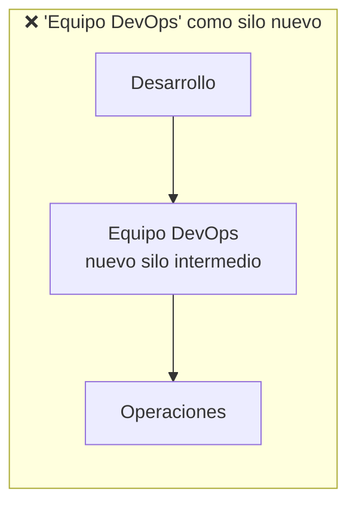
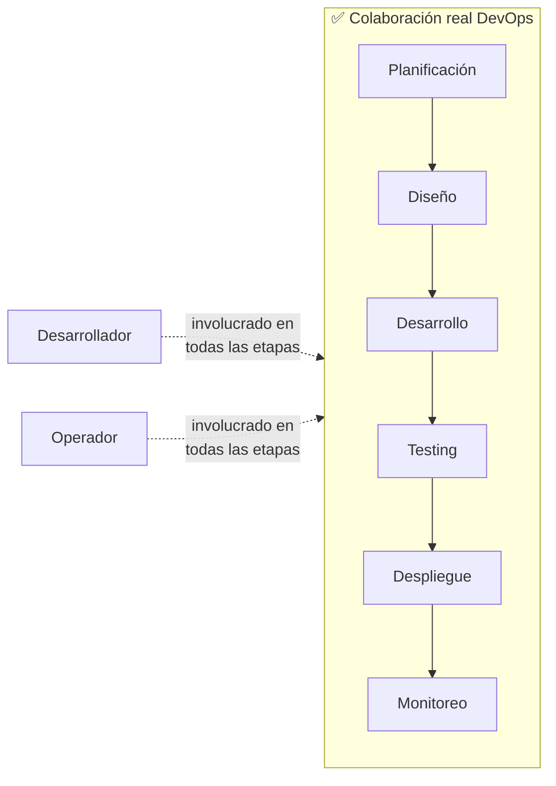
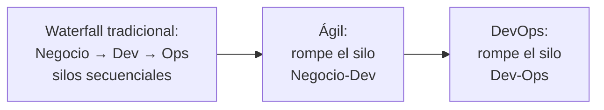

# ¿Qué es DevOps, Realmente? Definición y Malentendidos Comunes

> [!abstract] Resumen rápido
> DevOps **no es un puesto de trabajo, ni una herramienta, ni un equipo separado que se pone "entre" Desarrollo y Operaciones**. Es una **mentalidad y cultura organizacional**: la colaboración directa entre quienes desarrollan y quienes operan, a lo largo de **todo** el ciclo de vida del software, apoyada en principios Lean y Ágiles.

> [!note] Nota relacionada
> El choque cultural entre Dev y Ops (el "Muro de Confusión") ya se desarrolló a fondo en [[Ops Tradicional vs DevOps]], y la crítica al modelo de silos en [[Cultura DevOps y Critica al Taylorismo]]. Esta nota se enfoca en algo que no habíamos cubierto directamente: **los malentendidos más comunes sobre qué es DevOps**, y una definición precisa para desmontarlos.

---

## 1. Lo que DevOps NO es (malentendidos comunes)

Es sorprendentemente común que las organizaciones malinterpreten DevOps de formas que **reproducen exactamente el problema que DevOps busca resolver**. Vale la pena nombrarlos explícitamente:

### ❌ Malentendido 1: "DevOps es un título de trabajo"
Contratar a "un DevOps" (como si fuera un puesto individual, ej. "necesitamos un DevOps en el equipo") malinterpreta el concepto. DevOps describe una **forma de trabajar entre roles existentes** (desarrolladores, operadores, QA), no un rol nuevo que reemplaza o absorbe a los demás.

> Sí existe el rol de **"DevOps Engineer"** en la industria real (alguien especializado en pipelines, IaC, automatización) — pero contratar a esa persona **no es lo mismo** que "adoptar DevOps" como organización. Es fácil confundir tener la herramienta con tener la cultura.

### ❌ Malentendido 2: "DevOps es solo para Operaciones"
Algunas organizaciones tratan DevOps como una simple modernización del equipo de Ops (automatizar sus tareas manuales), sin involucrar realmente a Desarrollo en el cambio cultural. Esto dejaría intacto el silo original — solo un lado del muro se modernizó, el otro sigue igual.

### ❌ Malentendido 3: "DevOps es un equipo intermedio (nuevo silo)"
Quizás el malentendido más problemático: crear un **"equipo de DevOps"** que se coloca *entre* Desarrollo y Operaciones para hacer de puente.

**Por qué esto falla**: en vez de eliminar el Muro de Confusión, esta estructura simplemente **agrega un tercer silo** con su propia frontera de comunicación, su propia cola de trabajo, y sus propios cuellos de botella — reproduciendo el mismo problema estructural descrito en [[Cultura DevOps y Critica al Taylorismo]], solo que ahora con tres equipos en vez de dos.

> [!important] La paradoja de "crear un equipo de DevOps"
> Si DevOps significa literalmente "romper el silo entre Dev y Ops", entonces crear un equipo separado *llamado* "DevOps" es, en la práctica, **crear un silo nuevo bajo el nombre de la filosofía que se supone debía eliminar los silos**. El nombre correcto de una organización que "hizo bien" DevOps no es "tenemos un equipo de DevOps" — es "Desarrollo y Operaciones ya no son equipos separados con objetivos distintos".

---

## 2. Definición precisa: DevOps como colaboración, no como estructura

DevOps es la práctica de que **desarrolladores y operadores trabajen juntos durante todo el ciclo de vida del software** — no solo al final (cuando algo ya está "terminado" y hay que desplegarlo), sino desde el diseño inicial hasta el monitoreo en producción.

Esto retoma directamente el modelo **"you build it, you run it"** ya visto en [[Cultura DevOps y Critica al Taylorismo]]: la colaboración no es un evento puntual (una reunión de "entrega" entre equipos), es una **presencia continua** de ambas perspectivas en cada etapa.

---

## 3. La mentalidad DevOps: por qué es cultural antes que técnica

### 3.1 Objetivos y métricas compartidas
El resumen destaca esto como clave: mientras existan **métricas separadas** para Dev (ej. "features entregadas") y Ops (ej. "uptime del sistema"), cada equipo optimizará para su propia métrica, incluso a costa del objetivo del otro — la raíz técnica del "Muro de Confusión" descrito en [[Ops Tradicional vs DevOps]].

**La alternativa DevOps**: métricas que reflejan el resultado **conjunto** de ambos equipos — por ejemplo, las **DORA Metrics** ya vistas en [[Componentes del Pipeline y 5 Principios de Entrega Continua]] (lead time, frecuencia de despliegue, tasa de fallo, MTTR) son métricas de *todo el flujo*, no de un equipo aislado.

### 3.2 Principios Lean y Ágiles como base
El resumen menciona que DevOps se basa en principios **Lean** y **Ágiles** — vale la pena ser explícito sobre qué toma de cada uno:

| De **Lean** (manufactura) | De **Ágil** (desarrollo de software) |
|---|---|
| Eliminar desperdicio (*waste*) | Iteración corta y frecuente (sprints) |
| Flujo continuo de valor | Colaboración con el cliente sobre seguir un plan rígido |
| Trabajar en [[Principios Fundamentales de DevOps (Resumen Integrador)\|lotes pequeños]] | Equipos [[Ley de Conway y Estructura de Equipos DevOps\|autoorganizados y multifuncionales]] |
| Mejora continua (*Kaizen*) | Responder al cambio sobre seguir un plan fijo |

DevOps puede entenderse como la **extensión natural** de Ágil: si Ágil ya rompió la barrera entre "negocio" y "desarrollo" (mediante historias de usuario, sprints, feedback rápido — ver [[BDD - Behavior-Driven Development]]), DevOps rompe la **siguiente** barrera: entre "desarrollo" y "operaciones".

### 3.3 Transparencia, confianza y responsabilidad compartida
Estos tres elementos son **prerequisitos culturales**, no solo buenas intenciones:
- **Transparencia**: todo el equipo puede ver el estado real del sistema, del pipeline, de los incidentes — sin información oculta entre roles (ver *pipeline visibility* en [[Componentes del Pipeline y 5 Principios de Entrega Continua]]).
- **Confianza**: los líderes confían en que los equipos autoorganizados tomarán buenas decisiones sin necesitar aprobación jerárquica para cada paso — el rechazo directo al mando y control Taylorista.
- **Responsabilidad compartida**: nadie puede decir "eso no es mi problema" cuando algo falla en producción, porque el mismo equipo construyó, desplegó y opera el sistema.

---

## 4. Conceptos complementarios (no cubiertos en el resumen original)

### 4.1 CALMS — marco mnemotécnico de la cultura DevOps
Acrónimo popular (usado por Puppet/Damon Edwards) que resume los pilares culturales de DevOps:

| Letra | Significa | Conexión con esta lección |
|---|---|---|
| **C** | Culture (Cultura) | El punto central de esta lección: mentalidad antes que herramientas |
| **A** | Automation (Automatización) | Ver [[CI-CD Pipeline]], [[IaC - Infraestructura Efimera y Entrega Inmutable]] |
| **L** | Lean | Lotes pequeños, eliminar desperdicio |
| **M** | Measurement (Medición) | DORA Metrics, mejora basada en datos |
| **S** | Sharing (Compartir) | Responsabilidad compartida, transparencia |

### 4.2 Por qué "cultura antes que herramientas" es más que un cliché
Es común escuchar "DevOps es 80% cultura, 20% herramientas" — y esta lección explica *por qué* es literalmente cierto: una organización puede tener el pipeline CI/CD técnicamente más sofisticado del mundo, pero si mantiene silos, métricas separadas y desconfianza entre Dev y Ops, seguirá teniendo el mismo Muro de Confusión, solo que ahora automatizado. La herramienta no resuelve un problema que es, en el fondo, de **estructura organizacional e incentivos** (ver [[Ley de Conway y Estructura de Equipos DevOps]]).

### 4.3 Madurez DevOps como espectro, no como estado binario
En la práctica, las organizaciones no "tienen" o "no tienen" DevOps de forma absoluta — existen **modelos de madurez** (ej. el modelo de madurez DevOps de distintas consultoras) que evalúan en un espectro: desde silos tradicionales completos, pasando por automatización parcial sin cambio cultural, hasta colaboración total con métricas y responsabilidad compartida.

---

## 5. Preguntas para repasar (auto-evaluación)

- [ ] ¿Por qué crear un "equipo de DevOps" separado puede ser, en la práctica, contradecir la filosofía DevOps?
- [ ] ¿Cuál es la diferencia entre contratar a un "DevOps Engineer" y que una organización "adopte la cultura DevOps"?
- [ ] ¿Por qué las métricas separadas para Dev y Ops perpetúan el Muro de Confusión?
- [ ] ¿Qué significa el acrónimo CALMS y cómo resume los pilares de DevOps?
- [ ] ¿Por qué se dice que DevOps es la "extensión natural" de Ágil?
- [ ] ¿Por qué la frase "cultura antes que herramientas" no es solo un cliché motivacional?

---

## 6. Recursos recomendados para profundizar

- 🌐 [Artículo original sobre CALMS](https://itrevolution.com/articles/) — IT Revolution / DevOps Enterprise Summit.
- 📘 *The DevOps Handbook* — Gene Kim et al. (ya recomendado en notas anteriores; capítulo introductorio cubre exactamente estos malentendidos).
- 🌐 [State of DevOps Report — DORA](https://dora.dev/research/) — investigación anual sobre madurez y desempeño DevOps en organizaciones reales.
- 📘 *Team Topologies* — Matthew Skelton & Manuel Pais (para profundizar por qué un "equipo DevOps" intermedio suele ser un antipatrón).

---

## 7. Notas relacionadas
- [[Ops Tradicional vs DevOps]]
- [[Cultura DevOps y Critica al Taylorismo]]
- [[Ley de Conway y Estructura de Equipos DevOps]]
- [[Componentes del Pipeline y 5 Principios de Entrega Continua]]
- [[Repaso Final - Taylorismo a CI-CD]]
- [[Principios Fundamentales de DevOps (Resumen Integrador)]]

---
#devops #definicion #cultura #malentendidos #calms
