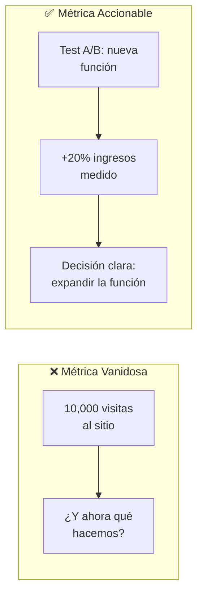
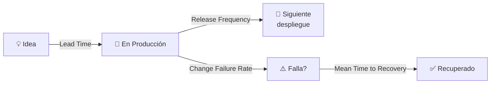
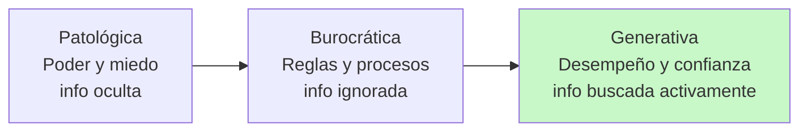
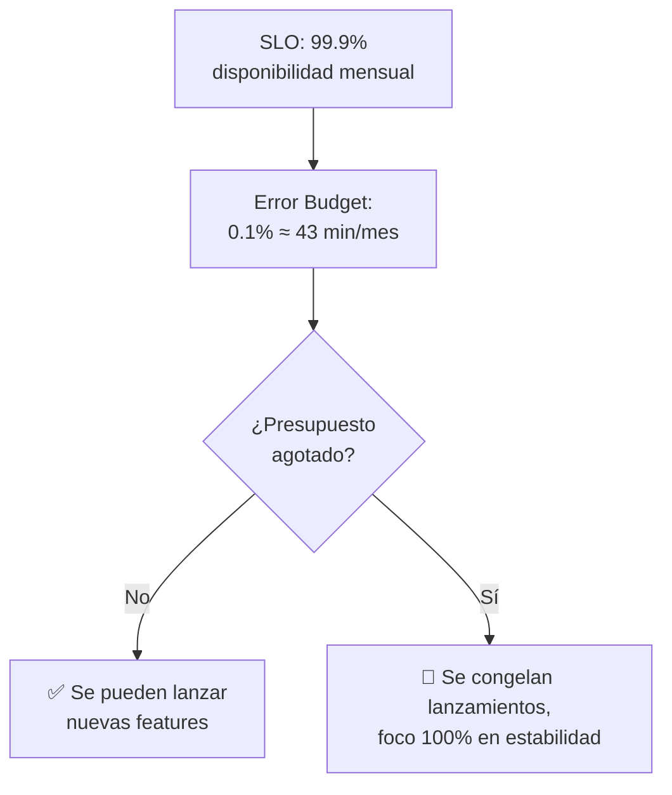
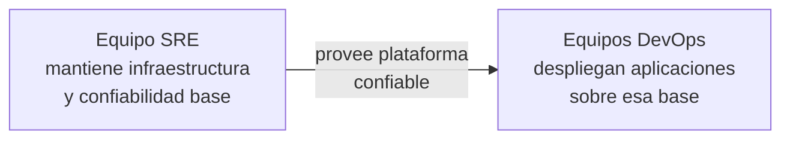
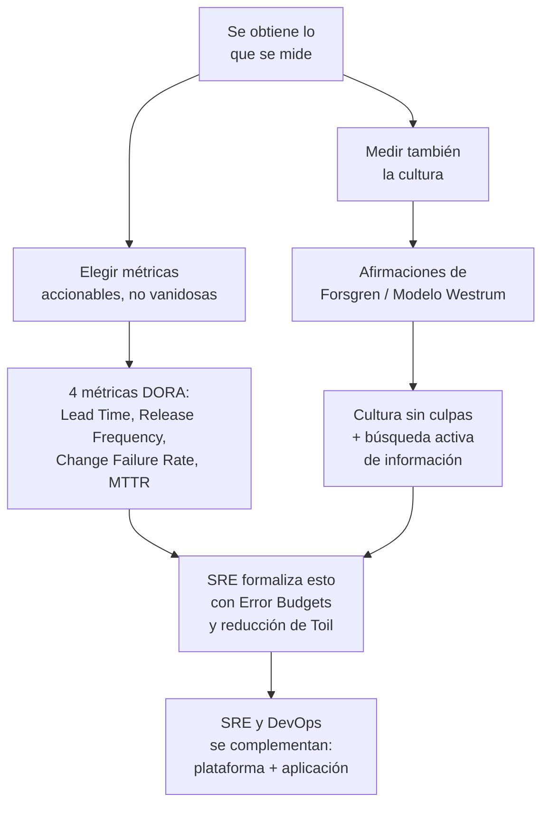

# Supernota: Métricas, Cultura y SRE en DevOps

> [!abstract] Resumen rápido del módulo
> Este módulo cubre **cuatro bloques conectados**: (1) por qué "se obtiene lo que se mide" y cómo elegir bien qué medir, (2) la diferencia entre **métricas vanidosas** y **métricas accionables** (con las 4 métricas DORA como ejemplo central), (3) cómo **medir la cultura de un equipo** usando el marco de la Dra. Nicole Forsgren, y (4) cómo **SRE (Site Reliability Engineering)** se relaciona, se parece y se diferencia de DevOps.

> [!note] Formato de esta nota
> A partir de este módulo, y por indicación del usuario, se genera **una supernota por conjunto de lecciones** (en vez de una nota por lección individual), manteniendo el mismo nivel de profundidad: definiciones, diagramas, conceptos complementarios y enlaces al resto del vault.

---

## Índice de esta supernota
1. [[#1. Medir lo que se quiere mejorar]]
2. [[#2. Métricas vanidosas vs métricas accionables]]
3. [[#3. Las 4 métricas DORA en detalle]]
4. [[#4. Midiendo la cultura de equipo — marco de Nicole Forsgren]]
5. [[#5. SRE vs DevOps]]
6. [[#6. Cómo se conecta todo este módulo]]
7. [[#7. Conceptos complementarios]]
8. [[#8. Preguntas para repasar]]
9. [[#9. Recursos recomendados]]
10. [[#10. Notas relacionadas del vault]]

---

## 1. Medir lo que se quiere mejorar

### 1.1 "Se obtiene lo que se mide"
Principio central: **las personas buscan información sobre qué se recompensa/mide, y luego actúan para maximizar esa medida** — casi sin importar si esa medida realmente representa el objetivo de negocio deseado.

> [!important] El peligro de medir mal
> Medir la actividad equivocada produce el comportamiento equivocado, **aunque la intención original fuera buena**. Ejemplo clásico: medir **líneas de código escritas** para evaluar productividad —esto incentiva a escribir código más largo e innecesariamente verboso, exactamente lo opuesto de lo que se busca (código limpio, mantenible, conciso).

| Se mide... | Comportamiento que incentiva |
|---|---|
| Líneas de código | Código verboso, innecesariamente largo |
| Número de commits | Commits fragmentados artificialmente, sin relación con valor real entregado |
| **Colaboración / reutilización de código** | Trabajo en equipo, menos duplicación de esfuerzo |
| **Tiempo de despliegue, tasa de defectos** | Procesos más eficientes y de mayor calidad |

### 1.2 Métricas sociales
El resumen destaca un ejemplo concreto: **medir quién reutiliza el código de otros, y qué código se reutiliza** más. Esto es una **métrica social** — no mide directamente "calidad" o "velocidad", sino **colaboración**, con el efecto indirecto de reducir la duplicación de esfuerzo entre equipos.

> [!tip] Si quieres que la gente sea social, mide que lo sea
> Es una aplicación directa del principio "se obtiene lo que se mide": si el objetivo cultural es fomentar colaboración (ver [[Cultura DevOps y Critica al Taylorismo]] y [[Ley de Conway y Estructura de Equipos DevOps]]), **hay que medir explícitamente la colaboración**, no asumir que ocurrirá sola solo por decirlo en una reunión.

### 1.3 Línea base (Baseline) y metas claras
Antes de poder decir "mejoramos", se necesita:
1. **Baseline**: medir el estado actual (ej. "hoy tardamos en promedio 3 días en desplegar un cambio").
2. **Meta clara**: definir a dónde se quiere llegar (ej. "reducir a menos de 1 día en el próximo trimestre").

Sin baseline, cualquier cifra nueva carece de contexto para saber si representa una mejora real o no.

### 1.4 El gran cambio de enfoque: MTBF → MTTR
Ya introducido en [[Resiliencia y Diseño para el Fallo]] — aquí se reafirma como parte central de qué elegir medir:

| Enfoque antiguo | Enfoque DevOps |
|---|---|
| **MTBF** — Mean Time Between Failures (tiempo medio *entre* fallos) | **MTTR** — Mean Time To Recovery (tiempo medio *para recuperarse* de un fallo) |
| Intenta prevenir que algo falle | Asume que algo va a fallar, y optimiza qué tan rápido se recupera |

La arquitectura moderna (**[[Microservicios Nativos en la Nube]]** + contenedores, ver [[IaC - Infraestructura Efimera y Entrega Inmutable]]) es lo que **habilita técnicamente** este cambio de enfoque: al ser servicios pequeños, aislados y desplegables independientemente, un fallo puede aislarse y recuperarse (reemplazando el contenedor/servicio afectado) sin que el usuario final note gran cosa — ver también los patrones de [[Resiliencia y Diseño para el Fallo]] (Circuit Breaker, Bulkhead, Retry).

---

## 2. Métricas vanidosas vs métricas accionables

### 2.1 Métricas vanidosas (Vanity Metrics)
Son números que **se ven impresionantes** pero **no indican qué acción tomar a continuación**. Ejemplo del resumen: número total de "hits" (visitas) a un sitio web.

**Por qué fallan:**
- No muestran **causa ni efecto** — un aumento de hits no dice *por qué* subió, ni qué hacer para que siga subiendo (o para corregir si baja).
- Son fáciles de "inflar" sin generar valor real (ej. tráfico de bots, clickbait) sin que eso se refleje en la métrica.
- Suenan bien en una presentación, pero no informan ninguna decisión concreta.

### 2.2 Métricas accionables (Actionable Metrics)
Son métricas que **permiten entender el impacto de una acción específica** y, por tanto, informan qué hacer después.

**Ejemplo del resumen**: un experimento A/B que muestra que una nueva función aumentó los ingresos en 20%. Esta métrica:
- Está **vinculada a una causa específica** (la nueva función).
- Está **vinculada a un efecto medible** (+20% de ingresos).
- Sugiere una **acción clara**: mantener/expandir esa función, porque se demostró su impacto.

> [!tip] La pregunta de prueba
> Ante cualquier métrica, preguntarse: *"si este número sube o baja, ¿sé exactamente qué hacer al respecto?"* Si la respuesta es no, probablemente es una métrica vanidosa.

---

## 3. Las 4 métricas DORA en detalle

Ya mencionadas brevemente en [[Componentes del Pipeline y 5 Principios de Entrega Continua]] — esta lección las presenta como el **ejemplo central de métricas accionables en DevOps**, así que vale la pena definir cada una con precisión aquí:

| Métrica | Definición precisa | Qué acción informa |
|---|---|---|
| **Lead Time (Tiempo medio de entrega)** | Tiempo que tarda **una idea** en llegar a producción — desde que se concibe/comienza el trabajo hasta que el código corre para usuarios reales | Si es alto, indica cuellos de botella en el proceso (revisión lenta, pipeline lento, aprobaciones burocráticas) |
| **Release Frequency (Frecuencia de lanzamiento)** | Con qué frecuencia se despliegan cambios a producción | Frecuencia baja sugiere lotes grandes y riesgosos (ver [[CI vs CD - Ramas Cortas y Pull Requests]]); frecuencia alta sugiere buen dominio del pipeline |
| **Change Failure Rate (Tasa de fallos en cambios)** | Porcentaje de despliegues que **causan** un fallo, incidente o necesitan rollback | Alta tasa indica problemas de calidad en el proceso de desarrollo/testing, no solo mala suerte |
| **Mean Time to Recovery (Tiempo medio de recuperación)** | Tiempo que se tarda en **recuperarse** de un fallo una vez que ocurre | Directamente ligado a los patrones de [[Resiliencia y Diseño para el Fallo]] — mide qué tan bien preparado está el sistema para fallar de forma segura |

> [!important] Por qué estas 4 y no otras
> Las 4 métricas DORA cubren, en conjunto, **tanto velocidad como estabilidad**: Lead Time y Release Frequency miden qué tan rápido se mueve el equipo; Change Failure Rate y MTTR miden qué tan estable/seguro es ese movimiento. La investigación de DORA (Google, liderada por la Dra. Nicole Forsgren — la misma investigadora del bloque de cultura) demostró empíricamente que los equipos de alto desempeño **no sacrifican estabilidad por velocidad**: logran ambas cosas a la vez, justamente porque practican los principios ya vistos en [[Componentes del Pipeline y 5 Principios de Entrega Continua]] (lotes pequeños, automatización, calidad incorporada).

---

## 4. Midiendo la cultura de equipo — marco de Nicole Forsgren

### 4.1 ¿Por qué medir algo tan "blando" como la cultura?
Si "se obtiene lo que se mide" (sección 1), y la cultura es un factor central del desempeño DevOps (ver [[Cultura DevOps y Critica al Taylorismo]], [[Que es DevOps - Definicion y Malentendidos]]), entonces **dejar la cultura sin medir** significa no poder saber si realmente está mejorando, ni demostrarlo con datos ante el resto de la organización.

### 4.2 El método: afirmaciones calificadas del 1 al 7
La Dra. Nicole Forsgren desarrolló un conjunto de **afirmaciones** que los miembros del equipo califican en una escala de 1 (totalmente en desacuerdo) a 7 (totalmente de acuerdo). Los temas que cubren estas afirmaciones, según el resumen:

| Tema | Qué evalúa |
|---|---|
| **Búsqueda activa de información** | ¿El equipo busca proactivamente señales de problemas, o espera a que "alguien avise"? |
| **Gestión de fallos** | ¿Los fallos se tratan como oportunidades de aprendizaje, o generan miedo/castigo? |
| **Colaboración** | ¿Existe responsabilidad compartida y trabajo conjunto, o cada quien cuida solo lo suyo? |
| **Nuevas ideas** | ¿Las ideas nuevas son bienvenidas y escuchadas, o el equipo es resistente al cambio? |

> [!note] Origen del marco: Modelo de Westrum
> Aunque el resumen no lo nombra explícitamente, este conjunto de afirmaciones está basado en el **modelo de cultura organizacional de Ron Westrum**, que clasifica las organizaciones en tres tipos: **Patológica** (basada en poder y miedo, la información se oculta), **Burocrática** (basada en reglas, la información se ignora si no sigue el proceso formal), y **Generativa** (basada en el desempeño, la información fluye libremente y se busca activamente). El objetivo de DevOps es mover a la organización hacia el extremo **Generativo**.

### 4.3 Cultura sin culpas (Blameless Culture)
Ya mencionada como concepto complementario en [[Cultura DevOps y Critica al Taylorismo]] y desarrollada en [[Consecuencias, Silos y Conciencia Compartida]] — aquí se reafirma como **eje central medible**: los fallos deben verse como **oportunidades de aprendizaje**, nunca como motivo de castigo. Esto no es solo una postura ética — es una condición **funcional**: si las personas temen ser castigadas por reportar un error, dejan de reportarlo, y el equipo pierde exactamente la información que necesita para mejorar (conectar con "búsqueda activa de información" en la tabla de arriba).

### 4.4 Investigación de la raíz de los fallos
El resumen menciona explícitamente: se incentiva **investigar las causas raíz** de los fallos, no solo corregir el síntoma inmediato. Esto conecta directamente con la práctica de **blameless postmortems** (ver [[Cultura DevOps y Critica al Taylorismo]]) y con el objetivo de mejora continua basada en datos (principio #4 de Entrega Continua, ver [[Componentes del Pipeline y 5 Principios de Entrega Continua]]).

---

## 5. SRE vs DevOps

### 5.1 ¿Qué es SRE (Site Reliability Engineering)?
Disciplina originada en Google que aplica principios de **ingeniería de software** a los problemas de **operaciones** — en palabras simples, "qué pasa si le pides a ingenieros de software que se encarguen de la confiabilidad del sistema."

### 5.2 Comparación directa SRE vs DevOps

| Dimensión | **SRE** | **DevOps** |
|---|---|---|
| Estructura de equipos | Mantiene equipos **separados** de Desarrollo y Operaciones (SRE es su propia disciplina/equipo especializado) | Integra Desarrollo y Operaciones en **un solo equipo** multifuncional (ver [[Ley de Conway y Estructura de Equipos DevOps]]) |
| Mecanismo para controlar riesgo/estabilidad | **Presupuesto de error (Error Budget)**: cantidad de interrupciones/fallos "permitidos" antes de frenar nuevos lanzamientos | **Automatización + responsabilidad compartida**: no hay un límite numérico formal de fallos, la estabilidad se logra por diseño y cultura |
| Composición del equipo | Contrata **solo ingenieros de software** (no operadores tradicionales) para automatizar tareas repetitivas | Combina developers, testers, operaciones y analistas de negocio dentro del mismo equipo |
| Distribución del tiempo | ~50% automatizando procesos, ~5% rotando en operaciones directas | No tiene una proporción formal — la operación es una responsabilidad continua e integrada, no un porcentaje separado de tiempo |

> [!important] SRE es, en cierto sentido, una implementación específica y muy prescriptiva de ideas DevOps
> SRE puede pensarse como "¿qué pasa si tomamos los principios de DevOps (automatización, responsabilidad compartida, cultura sin culpas) y los formalizamos con reglas muy específicas y medibles (presupuestos de error, % de tiempo dedicado a automatización)?" — es más prescriptivo y cuantitativo que DevOps, que es más una filosofía cultural general.

### 5.3 Error Budget (Presupuesto de error) — explicado a fondo
Un **Error Budget** es la cantidad de **falta de confiabilidad tolerable** en un periodo determinado, derivada directamente de un **SLO (Service Level Objective)**.

- Ejemplo: si el SLO de un servicio es **99.9% de disponibilidad** mensual, el Error Budget es el 0.1% restante — aproximadamente **43 minutos de downtime tolerado al mes**.
- Mientras el equipo no haya "gastado" su presupuesto de error, puede seguir lanzando cambios nuevos con normalidad.
- Si el presupuesto se agota (demasiados incidentes/downtime ese mes), **se congelan los nuevos lanzamientos** y el equipo se enfoca exclusivamente en estabilidad hasta recuperar margen.

> [!tip] Por qué el Error Budget es elegante
> Convierte una discusión subjetiva ("¿estamos siendo lo bastante cuidadosos?") en una **decisión objetiva basada en datos**: no es que "Ops diga que no" a un lanzamiento por instinto — es que los números muestran que ya no hay margen de error disponible ese mes. Esto reduce el conflicto Dev-Ops descrito en el ["Muro de Confusión"](Ops%20Tradicional%20vs%20DevOps.md) al reemplazar la negociación política por una regla compartida y medible.

### 5.4 Toil (trabajo manual repetitivo) — concepto clave de SRE
**Toil** es el término específico de SRE para el trabajo operativo manual, repetitivo, automatizable, que no aporta valor duradero (ej. reiniciar un servidor a mano cada vez que falla, en vez de arreglar la causa raíz o automatizar la recuperación). SRE tiene como objetivo explícito **reducir el toil** —de ahí que dediquen ~50% del tiempo a automatizar: cada tarea de toil automatizada libera tiempo permanentemente para trabajo de mayor valor.

### 5.5 Similitudes y colaboración entre SRE y DevOps
- Ambos buscan **acelerar el despliegue de software manteniendo la estabilidad** — no son objetivos opuestos en ninguno de los dos modelos.
- Ambos fomentan una **cultura sin culpas** (blameless) para mejorar continuamente (ver sección 4.3).
- En la práctica, pueden **complementarse**: SRE puede encargarse de mantener la **infraestructura y confiabilidad de base** (Kubernetes, redes, plataforma), mientras equipos DevOps la **usan** para desplegar aplicaciones sobre esa infraestructura — un poco como el **Platform Team** visto en [[Ley de Conway y Estructura de Equipos DevOps]] (Team Topologies), donde SRE cumpliría ese rol de plataforma para los Stream-Aligned Teams.

---

## 6. Cómo se conecta todo este módulo

**La narrativa completa de este módulo:**
> Si quieres mejorar algo, primero debes **medirlo correctamente** (no con métricas vanidosas). Esto aplica tanto a la **velocidad y estabilidad técnica** (métricas DORA) como a la **cultura del equipo** (marco de Forsgren/Westrum). **SRE** es, en esencia, una forma muy formalizada de aplicar estos mismos principios: usa Error Budgets como una métrica accionable objetiva para decidir cuándo frenar y estabilizar, y mide/reduce activamente el Toil para liberar tiempo hacia trabajo de mayor valor.

---

## 7. Conceptos complementarios (no cubiertos en los resúmenes originales)

### 7.1 Goodhart's Law
*"Cuando una medida se convierte en un objetivo, deja de ser una buena medida."* Ley formulada por el economista Charles Goodhart, que explica formalmente el riesgo detrás de "medir líneas de código": en cuanto una métrica se usa como objetivo de evaluación, las personas empiezan a optimizar directamente para esa métrica (aunque sea de forma artificial), en vez de para el resultado real que la métrica pretendía representar.

### 7.2 SLI, SLO y SLA — la jerarquía completa detrás del Error Budget
| Término | Significado |
|---|---|
| **SLI** (Service Level Indicator) | La métrica real medida (ej. % de requests exitosos) |
| **SLO** (Service Level Objective) | El objetivo interno que el equipo se fija para ese SLI (ej. 99.9%) |
| **SLA** (Service Level Agreement) | El compromiso **contractual** con el cliente, normalmente menos estricto que el SLO interno, con consecuencias (penalizaciones) si no se cumple |

> El Error Budget se deriva directamente del SLO, no del SLA — el equipo se exige a sí mismo un estándar interno más alto que el mínimo prometido contractualmente, dejando margen de seguridad.

### 7.3 North Star Metric
Concepto de producto relacionado con métricas accionables: la **North Star Metric** es la única métrica que mejor captura el valor central que un producto entrega a sus usuarios (ej. para Airbnb, noches reservadas; no "visitas al sitio"). Sirve como filtro para evitar caer en métricas vanidosas a nivel de producto completo, no solo a nivel de features individuales.

### 7.4 Relación entre Toil y automatización de DevOps
El concepto de "Toil" de SRE es esencialmente el mismo argumento del **Principio #3 de Entrega Continua** ("Automatización de tareas repetitivas", ver [[Componentes del Pipeline y 5 Principios de Entrega Continua]]) — SRE simplemente le da nombre propio y una meta cuantitativa formal (~50% del tiempo del equipo).

---

## 8. Preguntas para repasar (auto-evaluación)

- [ ] ¿Por qué medir "líneas de código" incentiva exactamente lo contrario de lo que se busca?
- [ ] ¿Cuál es la pregunta de prueba para distinguir una métrica vanidosa de una accionable?
- [ ] ¿Puedes definir con precisión las 4 métricas DORA y qué acción informa cada una?
- [ ] ¿Qué son las afirmaciones de Nicole Forsgren y qué modelo organizacional (Westrum) las sustenta?
- [ ] ¿Cómo funciona un Error Budget y qué pasa cuando se agota?
- [ ] ¿Qué es "Toil" en SRE, y cómo se relaciona con el principio de automatización de DevOps?
- [ ] ¿Cómo pueden SRE y DevOps colaborar en una misma organización, en vez de competir?
- [ ] ¿Qué diferencia hay entre SLI, SLO y SLA?

---

## 9. Recursos recomendados para profundizar

- 📘 *Accelerate* — Nicole Forsgren, Jez Humble, Gene Kim (fuente original de las DORA Metrics y de las afirmaciones de cultura basadas en Westrum).
- 📘 *Site Reliability Engineering* (el "libro naranja" de Google, disponible gratis en línea) — [sre.google/sre-book](https://sre.google/sre-book/table-of-contents/).
- 📘 *The Site Reliability Workbook* — Google (ejemplos prácticos de implementación de Error Budgets y SLOs).
- 🌐 [DORA — State of DevOps Report](https://dora.dev/research/) — investigación anual con datos actualizados.
- 🌐 Artículo original sobre el [modelo de Westrum](https://www.researchgate.net/publication/276975724_A_typology_of_organisational_cultures) — clasificación patológica/burocrática/generativa.
- 🌐 [Google SRE Book — capítulo sobre Error Budgets](https://sre.google/sre-book/embracing-risk/)

---

## 10. Notas relacionadas del vault
- [[Resiliencia y Diseño para el Fallo]]
- [[Componentes del Pipeline y 5 Principios de Entrega Continua]]
- [[Cultura DevOps y Critica al Taylorismo]]
- [[Consecuencias, Silos y Conciencia Compartida]]
- [[Que es DevOps - Definicion y Malentendidos]]
- [[Ley de Conway y Estructura de Equipos DevOps]]
- [[Microservicios Nativos en la Nube]]
- [[CI-CD Pipeline]]
- [[Ciclos de Vida en DevOps y QA]]

---
#devops #metricas #cultura #sre #dora-metrics #forsgren
