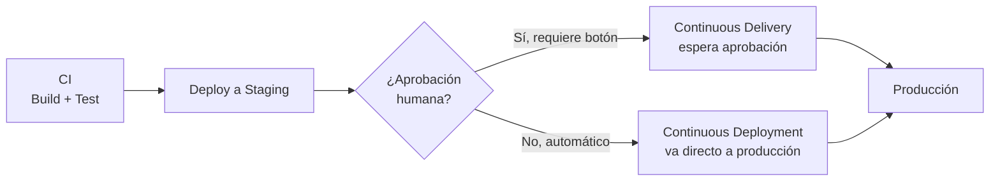
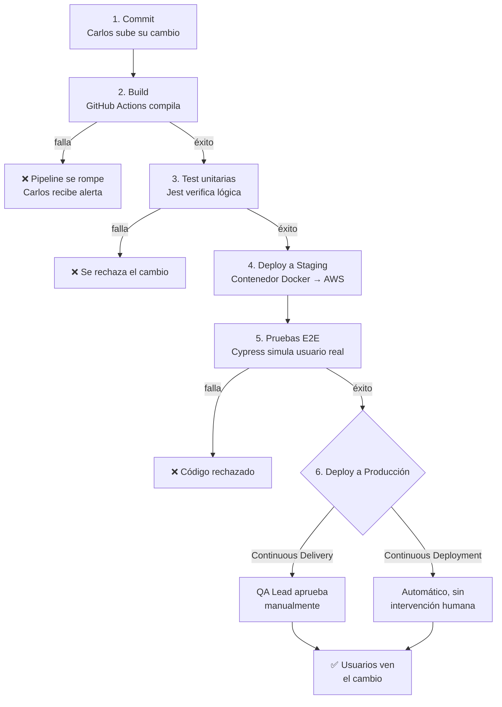

# CI/CD Pipeline

> [!abstract] Resumen rápido
> **CI/CD** es el corazón de la cultura DevOps: la **automatización** de todos los pasos entre que un desarrollador escribe una línea de código y ese código llega de forma segura al usuario final. Se compone de **CI (Integración Continua)** y **CD (Entrega o Despliegue Continuo)**.

---

## 1. CI — Integración Continua

### El problema que resuelve: "Merge Hell"
Antes del CI, los programadores trabajaban de forma aislada durante semanas. Al intentar unir ("integrar") el código de todos, surgían conflictos masivos difíciles de resolver — conocido como ***Merge Hell***.

### La solución
Integrar el código **constantemente** (varias veces al día), en vez de acumular cambios.

1. Un desarrollador sube un pequeño cambio al repositorio principal (ej. GitHub).
2. Un servidor de automatización (Jenkins, GitHub Actions, GitLab CI) detecta el cambio al instante.
3. Compila el código y **ejecuta pruebas unitarias automáticamente**.
4. **Objetivo**: detectar bugs de inmediato — si el cambio rompe algo, el equipo se entera en minutos, no semanas.

> [!tip] Relación con TDD
> CI depende directamente de tener una buena suite de tests automatizados para ser útil. Sin tests (ver [[TDD - Test-Driven Development]]), "integración continua" solo significa "subir código rápido sin validación real" — el valor de CI está en la combinación de velocidad **y** verificación automática.

---

## 2. CD — Entrega / Despliegue Continuo

Toma el código que ya pasó CI exitosamente y lo prepara para salir al mundo real. Existen **dos variantes** que suelen confundirse:

| Tipo | Qué significa | Cuándo se usa |
|---|---|---|
| **Continuous Delivery** (Entrega Continua) | El código se prueba y se envía a un entorno idéntico a producción (Staging). Está 100% listo, pero **requiere que un humano apruebe** el paso a producción | Empresas con alta regulación: bancos, software empresarial, sectores donde el negocio necesita controlar el momento exacto del lanzamiento |
| **Continuous Deployment** (Despliegue Continuo) | Un paso más allá: si el código pasa todas las pruebas automatizadas, **llega a los usuarios sin intervención humana** | Empresas ágiles con alta madurez de testing automatizado (Netflix, Amazon), que despliegan cientos de veces al día |

> [!warning] Error común
> "Continuous Delivery" y "Continuous Deployment" **no son sinónimos**, aunque ambos empiecen con "Continuous D...". La diferencia clave es el **botón humano de aprobación final**: existe en Delivery, no existe en Deployment.

---

## 3. Roles: por qué importa tanto para DevOps y QA

- **DevOps**: construye y mantiene las "tuberías" (pipelines). Escribe los scripts que le dicen al servidor qué hacer — descargar código, instalarlo en un contenedor, y si todo sale bien, desplegarlo a la nube.
- **QA**: su trabajo vive *dentro* de la tubería. Es el "guardia de seguridad automatizado" que decide si un código merece pasar de CI a CD. Si sus pruebas automatizadas son lentas o frágiles, retrasan a todo el equipo — de ahí la importancia de escribir tests confiables y rápidos (ver [[TDD - Test-Driven Development]] y [[BDD - Behavior-Driven Development]]).

---

## 4. Caso práctico completo: el viaje de un cambio de código

**Contexto**: equipo desarrollando una tienda online con **React** (frontend) y **Node.js** (backend).

**Stack usado:**

| Herramienta | Función |
|---|---|
| GitHub | Repositorio de código |
| GitHub Actions | Servidor CI/CD ("el robot" que ejecuta las tareas) |
| Cypress / Jest | Automatización de pruebas (QA) |
| AWS | Servidores donde vive la aplicación |

### Paso a paso

1. **El Disparador (Commit)**: Carlos cambia el color de un botón de "Comprar" (azul → verde), guarda y hace `push` al repositorio.
2. **Construcción (Build)** — inicio de CI: GitHub Actions detecta el cambio, levanta un servidor temporal, descarga el código y ejecuta `npm install` / `npm build`. Si la app no compila, el pipeline se rompe aquí y Carlos recibe una alerta.
3. **Pruebas Unitarias (Test)** — primera barrera de QA: se ejecutan las pruebas rápidas (Jest) que el equipo dejó programadas, verificando que el botón verde no rompió la lógica del carrito. Toma segundos.
4. **Despliegue a Staging** — inicio de CD: la app se empaqueta en un contenedor Docker y se envía a un entorno "clon" de producción (`staging.mitienda.com`), accesible solo internamente.
5. **Pruebas End-to-End (E2E)** — la prueba de fuego de QA: Cypress abre un navegador simulado, actúa como usuario real (entra al sitio, hace clic en el botón verde, llena un formulario, verifica que la compra se procese). Si falla, el código se rechaza.
6. **Despliegue a Producción**: con todas las pruebas en verde, ocurre una de dos cosas:
   - **Continuous Delivery**: el pipeline se pausa; un líder de QA revisa los reportes y aprueba manualmente.
   - **Continuous Deployment**: no se pide permiso; el contenedor aprobado reemplaza automáticamente la versión anterior en producción.

**Resultado**: con un pipeline bien configurado, todo este recorrido (paso 1 a 6) puede tardar **menos de 15 minutos**. Y si Carlos cometió un error grave, el pipeline lo detiene en el paso 3 o 5 — evitando que llegue a usuarios reales.

> Esa es la sinergia real entre DevOps y QA: **velocidad sin sacrificar calidad**.

---

## 5. Conceptos complementarios (no cubiertos en el resumen original)

### 5.1 Feature Flags (Feature Toggles)
Técnica que permite desplegar código a producción **desactivado**, y activarlo después de forma controlada (para un % de usuarios, o instantáneamente para todos) sin necesidad de un nuevo despliegue. Muy usada junto con Continuous Deployment para reducir el riesgo de lanzar funcionalidades nuevas directamente a todos los usuarios.

### 5.2 Estrategias de despliegue
Formas de minimizar el riesgo al pasar código nuevo a producción:

| Estrategia | Cómo funciona |
|---|---|
| **Blue-Green Deployment** | Se mantienen dos entornos idénticos (Blue = versión actual, Green = versión nueva); el tráfico se redirige de golpe de uno a otro, permitiendo rollback instantáneo |
| **Canary Release** | La nueva versión se libera gradualmente a un pequeño % de usuarios antes de expandirla a todos, monitoreando errores en el camino |
| **Rolling Update** | Se reemplazan instancias de la versión antigua por la nueva de forma progresiva (típico en Kubernetes) |

### 5.3 Pipeline as Code
Los pipelines modernos (GitHub Actions, GitLab CI, Jenkinsfile) se definen como **archivos de configuración versionados junto al código** (ej. `.github/workflows/ci.yml`), no configurados manualmente en una interfaz. Esto permite que el propio pipeline tenga historial de cambios, revisiones y control de versiones como cualquier otro código.

### 5.4 Artifact Repository
Tras un Build exitoso, el paquete generado (ej. imagen Docker, `.jar`, `.zip`) suele almacenarse en un **repositorio de artefactos** (Docker Hub, Amazon ECR, Nexus, Artifactory) antes de ser desplegado, garantizando que exactamente el mismo artefacto probado en Staging sea el que llega a producción (**"build once, deploy everywhere"**).

### 5.5 Rollback
Capacidad de **revertir automáticamente** a la versión anterior si el monitoreo post-despliegue detecta una anomalía grave (aumento de errores, caída de disponibilidad). Es la red de seguridad final del pipeline, y se relaciona directamente con los conceptos de [[Resiliencia y Diseño para el Fallo]] (MTTR bajo = capacidad de revertir rápido).

### 5.6 Dónde encajan las pruebas de carga
Las pruebas de rendimiento con [[Apache JMeter]] / [[JMeter - Prueba de Carga Realista (Practica)]] normalmente se ejecutan como una etapa adicional del pipeline (después del deploy a Staging, antes del deploy a producción), para evitar que un cambio que funciona correctamente pero degrada el rendimiento llegue a los usuarios.

---

## 6. Preguntas para repasar (auto-evaluación)

- [ ] ¿Cuál es la diferencia exacta entre Continuous Delivery y Continuous Deployment?
- [ ] ¿Por qué el "Merge Hell" motivó la creación de la Integración Continua?
- [ ] En el caso práctico, ¿en qué pasos concretos puede el pipeline detener un error antes de llegar a producción?
- [ ] ¿Qué es un Feature Flag y cómo reduce el riesgo del Continuous Deployment?
- [ ] ¿Qué diferencia hay entre Blue-Green Deployment y Canary Release?
- [ ] ¿Por qué se dice que QA es el "guardia de seguridad automatizado" dentro del pipeline?

---

## 7. Recursos recomendados para profundizar

- 📘 *Continuous Delivery* — Jez Humble & David Farley (el libro que formalizó estos conceptos).
- 📘 *The Phoenix Project* — Gene Kim (novela sobre transformación DevOps, muy recomendada como introducción narrativa).
- 🌐 [Documentación oficial de GitHub Actions](https://docs.github.com/en/actions)
- 🌐 [Documentación oficial de GitLab CI/CD](https://docs.gitlab.com/ee/ci/)
- 🌐 Artículo de Martin Fowler sobre [Continuous Delivery](https://martinfowler.com/bliki/ContinuousDelivery.html)
- 🌐 Artículo de Martin Fowler sobre [Blue-Green Deployment](https://martinfowler.com/bliki/BlueGreenDeployment.html)

---

## 8. Notas relacionadas
- [[Ciclos de Vida en DevOps y QA]]
- [[TDD - Test-Driven Development]]
- [[BDD - Behavior-Driven Development]]
- [[Apache JMeter]]
- [[JMeter - Prueba de Carga Realista (Practica)]]
- [[Microservicios Nativos en la Nube]]
- [[Resiliencia y Diseño para el Fallo]]

---
#devops #ci-cd #automatizacion #pipeline #qa
