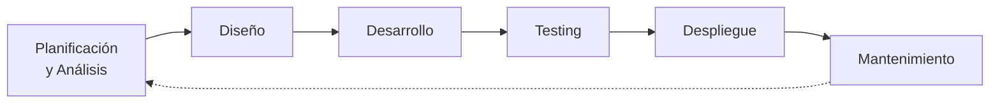
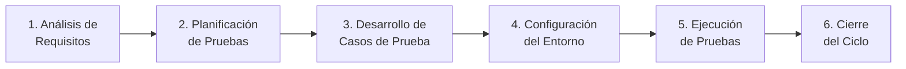
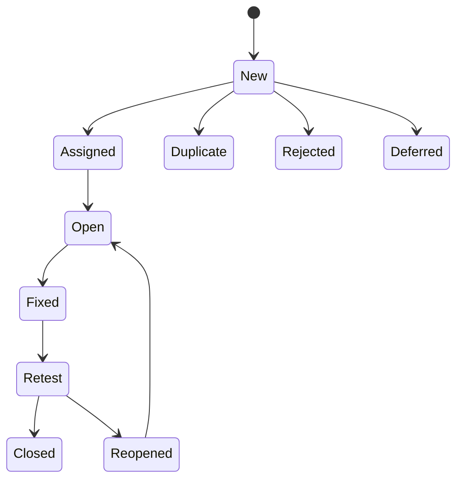
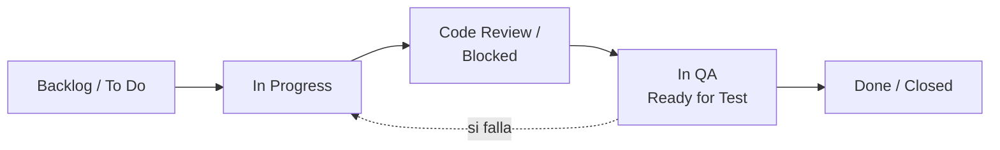
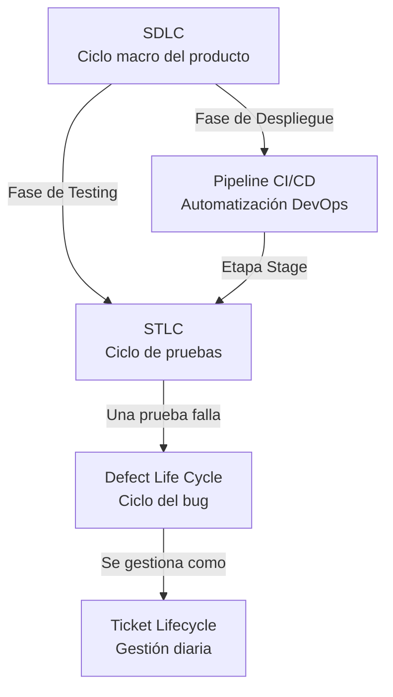

# Ciclos de Vida en DevOps y QA

> [!abstract] Resumen rápido
> DevOps y QA no son procesos aislados: son **engranajes de una misma máquina**. QA asegura calidad en cada etapa; DevOps automatiza y acelera el flujo entre ellas. Existen 5 ciclos de vida que se relacionan entre sí: **SDLC** (macro), **STLC** (testing), **Defect Life Cycle** (bugs), **Ticket Lifecycle** (gestión diaria) y **Pipeline CI/CD** (automatización).

---

## 1. SDLC — Software Development Life Cycle

Es el proceso **macro**: cómo nace, se construye y se mantiene un producto de software.

| Etapa | Qué ocurre |
|---|---|
| **Planificación y Análisis** | Se definen los requisitos del negocio: ¿qué se va a construir y por qué? |
| **Diseño** | Arquitectura del software: bases de datos, UI/UX, infraestructura |
| **Desarrollo** | Los programadores escriben el código |
| **Testing** | Se verifica que el código cumpla los requisitos — **aquí brilla QA** |
| **Despliegue** | El código se lanza a producción — **aquí brilla DevOps** |
| **Mantenimiento** | Monitoreo, actualizaciones, corrección de bugs en producción |

> [!note] Modelos de SDLC
> El resumen describe el flujo lógico, pero en la práctica el SDLC puede ejecutarse bajo distintos **modelos de proceso**: Waterfall (secuencial, rígido), Agile/Scrum (iterativo, por sprints) o Modelo en V (cada etapa de desarrollo tiene su etapa de testing correspondiente). Hoy, la mayoría de equipos DevOps trabajan bajo un modelo **ágil e iterativo**, no lineal.

---

## 2. STLC — Software Testing Life Cycle

Vive principalmente dentro de la fase de "Testing" del SDLC, pero **un buen QA se involucra desde el principio** (no espera a que el código esté listo para empezar a pensar en cómo probarlo).

1. **Análisis de Requisitos**: QA revisa qué se va a construir para saber *cómo* probarlo.
2. **Planificación de Pruebas**: se define estrategia, herramientas (ej. Selenium, Cypress, [[Apache JMeter]]), tiempos y responsables.
3. **Desarrollo de Casos de Prueba**: se escriben los pasos exactos para probar cada funcionalidad.
4. **Configuración del Entorno**: se prepara el servidor/ambiente de pruebas — **DevOps suele ayudar aquí** (es uno de los puntos de mayor colaboración entre ambos roles).
5. **Ejecución de Pruebas**: se corren las pruebas (manuales o automatizadas) y se reportan errores.
6. **Cierre del Ciclo**: reporte final con métricas (bugs encontrados, bugs arreglados, cobertura, etc.).

> [!tip] Conexión con otras notas
> El "Desarrollo de Casos de Prueba" en STLC es exactamente donde encajan prácticas como [[TDD - Test-Driven Development]] (a nivel de código) y [[BDD - Behavior-Driven Development]] (a nivel de comportamiento/negocio) — el STLC es el marco de proceso; TDD/BDD son las técnicas concretas para ejecutarlo bien.

---

## 3. Defect Life Cycle — Ciclo de Vida de un Bug

Cuando una prueba falla, nace un **bug**, que recorre un camino definido desde que se reporta hasta que desaparece.

| Estado | Significado | Quién actúa |
|---|---|---|
| **New** | QA reportó el error con pasos para reproducirlo | QA |
| **Assigned** | Un líder técnico asigna el bug a un desarrollador | Lead / Dev |
| **Open / In Progress** | El desarrollador trabaja en la solución | Dev |
| **Fixed** | El desarrollador subió el cambio al entorno de pruebas | Dev |
| **Retest** | QA vuelve a ejecutar los pasos para confirmar la corrección | QA |
| **Closed** | El bug ya no existe | QA |
| **Reopened** | Si en Retest el bug persiste, vuelve al desarrollador | QA |

**Estados alternativos:**
- **Duplicado**: alguien más ya reportó el mismo bug.
- **Rechazado**: el desarrollador argumenta que no es un error, sino comportamiento esperado.
- **Diferido**: es un error real, pero no prioritario; se corrige en el futuro (suele ir al backlog).

> [!important] Métrica relacionada
> La velocidad con la que un bug avanza por este ciclo está directamente relacionada con el concepto de **MTTR** (Mean Time To Recovery) visto en [[Resiliencia y Diseño para el Fallo]] — un buen Defect Life Cycle bien gestionado reduce el tiempo entre "algo falló" y "está resuelto en producción".

---

## 4. Ciclo de Vida de un Ticket (Gestión de Tareas)

Tanto QA como DevOps gestionan su trabajo diario mediante **tickets** (Jira, Trello, Azure Boards). A diferencia del Defect Life Cycle (solo bugs), este ciclo aplica a **cualquier tipo de tarea**.

1. **Backlog / To Do**: tarea creada, nadie ha empezado.
2. **In Progress**: alguien trabaja activamente en el ticket.
3. **Code Review / Blocked**: trabajo hecho, pero pendiente de revisión o bloqueado por un factor externo.
4. **In QA (Ready for Test)**: listo para que calidad lo valide.
5. **Done (Closed)**: aprobado, probado, y el código fue fusionado (merged).

---

## 5. Ciclo de Vida del Pipeline CI/CD

Conecta el trabajo de desarrolladores con QA y producción, mediante **tuberías automatizadas**. Es el ciclo que recorre el código cada vez que un desarrollador guarda un cambio.

> [!note] Ver también
> Este ciclo se explica en profundidad, con ejemplo completo paso a paso, en la nota [[CI-CD Pipeline]].

Etapas resumidas:
1. **Commit** — el código se sube al repositorio.
2. **Build** — se compila y empaqueta la aplicación; si falla, el ciclo se detiene aquí.
3. **Test** — pruebas unitarias automáticas.
4. **Stage** — despliegue automático a un entorno de pruebas para que QA ejecute el STLC.
5. **Deploy** — una vez aprobado, el código llega a producción.
6. **Monitor** — se vigila la salud del sistema (CPU, errores en vivo) con herramientas como Datadog o Grafana.

---

## 6. Cómo se conectan los 5 ciclos entre sí

- El **SDLC** es el paraguas que contiene a todos los demás.
- El **STLC** ocurre dentro de la fase de Testing del SDLC (y también dentro de la etapa "Stage" del pipeline CI/CD).
- Cuando el STLC detecta un fallo, se dispara el **Defect Life Cycle**.
- Tanto los bugs como cualquier otra tarea se gestionan operativamente con el **Ticket Lifecycle**.
- El **Pipeline CI/CD** es lo que automatiza el tránsito entre Desarrollo → Testing → Despliegue del SDLC.

---

## 7. Conceptos complementarios (no cubiertos en el resumen original)

### 7.1 Shift-Left Testing
Filosofía que refuerza el punto de "un QA excelente se involucra desde el principio" del STLC: mover las actividades de testing lo más **temprano posible** en el SDLC (incluso antes de que exista código, revisando requisitos), en vez de dejarlas solo para la fase de "Testing". Se relaciona directamente con [[TDD - Test-Driven Development]] y [[BDD - Behavior-Driven Development]].

### 7.2 Definition of Done (DoD)
En el Ticket Lifecycle, el paso "Done" suele estar formalizado por un **Definition of Done** acordado por el equipo: criterios explícitos (código revisado, tests pasando, documentación actualizada, desplegado en staging) que deben cumplirse antes de mover un ticket a "Closed". Sin un DoD claro, "Done" significa cosas distintas para cada persona del equipo.

### 7.3 Triage de bugs
Proceso donde el equipo revisa periódicamente los bugs nuevos para decidir su **prioridad y severidad** antes de asignarlos — determina si un bug se ataca de inmediato (bloqueante) o se difiere (deferred).

### 7.4 Severidad vs Prioridad de un bug
| Concepto | Pregunta que responde |
|---|---|
| **Severidad** | ¿Qué tan grave es el impacto técnico del bug? (ej. crashea la app vs. un botón mal alineado) |
| **Prioridad** | ¿Qué tan urgente es arreglarlo *para el negocio*? |

Un bug puede tener **alta severidad pero baja prioridad** (ej. un crash en una funcionalidad que casi nadie usa) o viceversa (ej. un typo visible en la página de login, baja severidad pero alta prioridad por imagen de marca).

---

## 8. Preguntas para repasar (auto-evaluación)

- [ ] ¿En qué fase del SDLC "brilla" QA, y en cuál "brilla" DevOps?
- [ ] ¿Por qué un buen QA se involucra en el STLC desde el análisis de requisitos, y no solo en la ejecución?
- [ ] ¿Qué diferencia hay entre un bug "Rechazado" y uno "Diferido"?
- [ ] ¿En qué se diferencia el Ticket Lifecycle del Defect Life Cycle?
- [ ] ¿Cómo se conecta el STLC con la etapa "Stage" del pipeline CI/CD?
- [ ] ¿Qué diferencia hay entre severidad y prioridad de un bug?

---

## 9. Recursos recomendados para profundizar

- 🌐 [ISTQB Foundation Level Syllabus](https://www.istqb.org/certifications/certified-tester-foundation-level) — estándar internacional que formaliza STLC y Defect Life Cycle.
- 📘 *Agile Testing* — Lisa Crispin & Janet Gregory (referencia clásica sobre el rol de QA en equipos ágiles).
- 🌐 Documentación de [Atlassian sobre flujos de trabajo en Jira](https://www.atlassian.com/agile/project-management/workflow) — ejemplos reales del Ticket Lifecycle.
- 🌐 [Google SRE Book — capítulo sobre gestión de incidentes](https://sre.google/sre-book/table-of-contents/) — para profundizar en MTTR y su relación con el Defect Life Cycle.

---

## 10. Notas relacionadas
- [[CI-CD Pipeline]]
- [[TDD - Test-Driven Development]]
- [[BDD - Behavior-Driven Development]]
- [[Resiliencia y Diseño para el Fallo]]
- [[Apache JMeter]]
- [[Microservicios Nativos en la Nube]]

---
#devops #qa #sdlc #stlc #ciclos-de-vida
