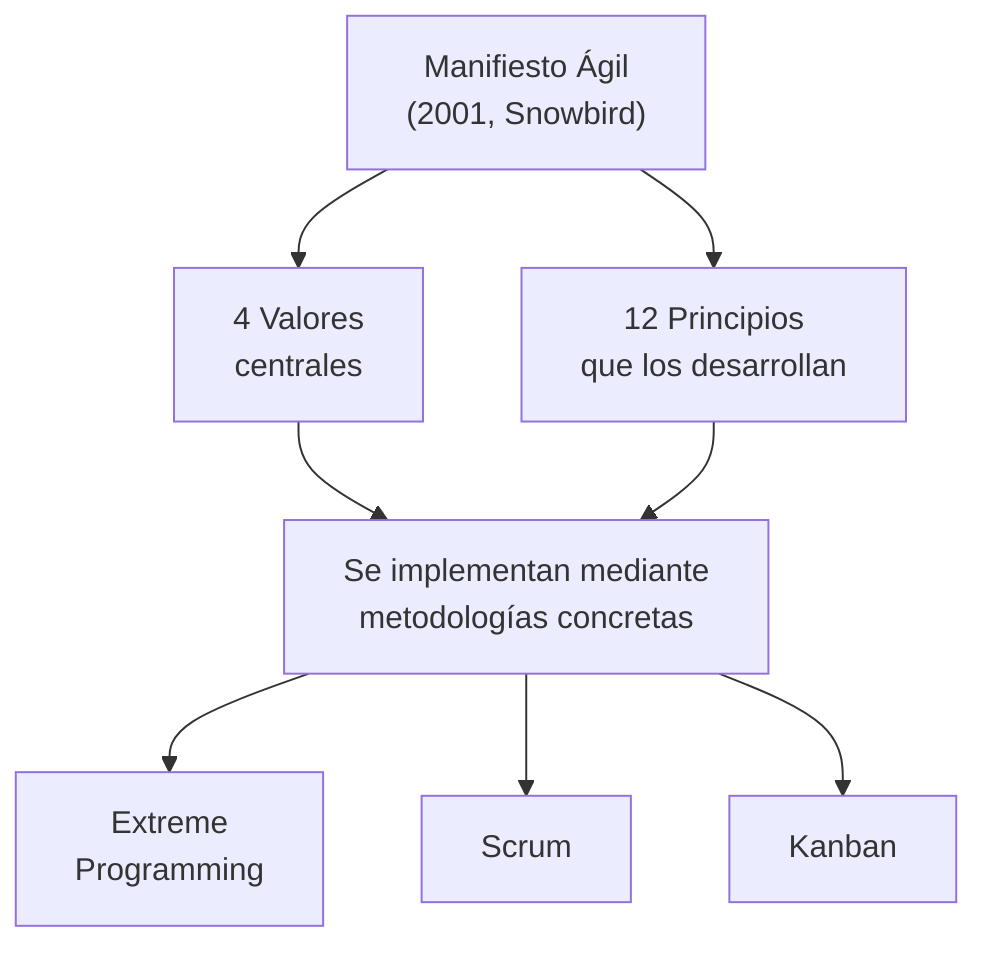
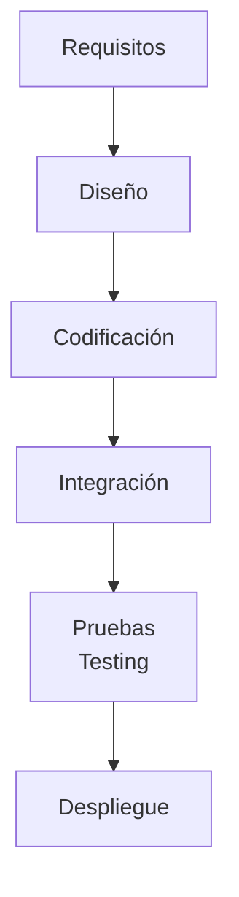
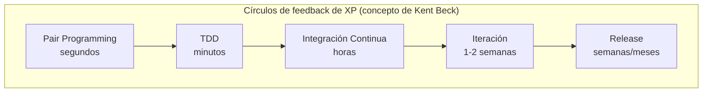
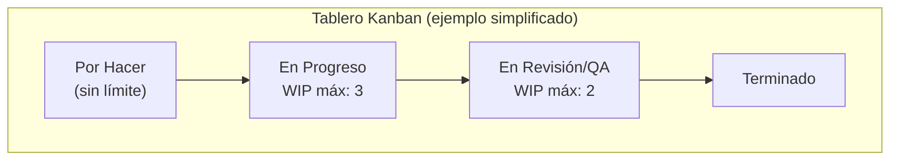
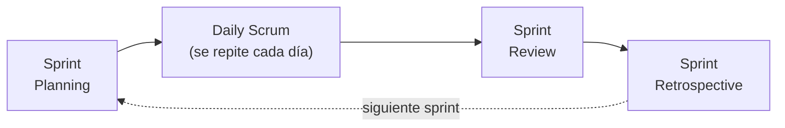
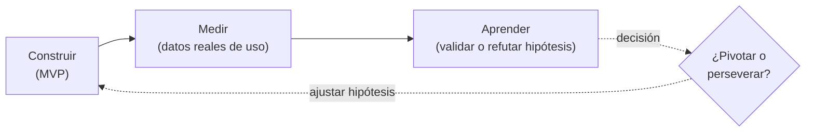
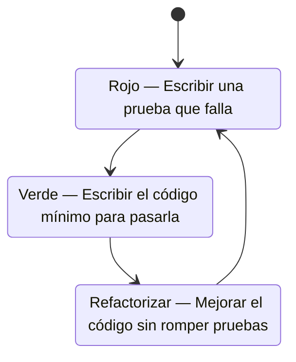
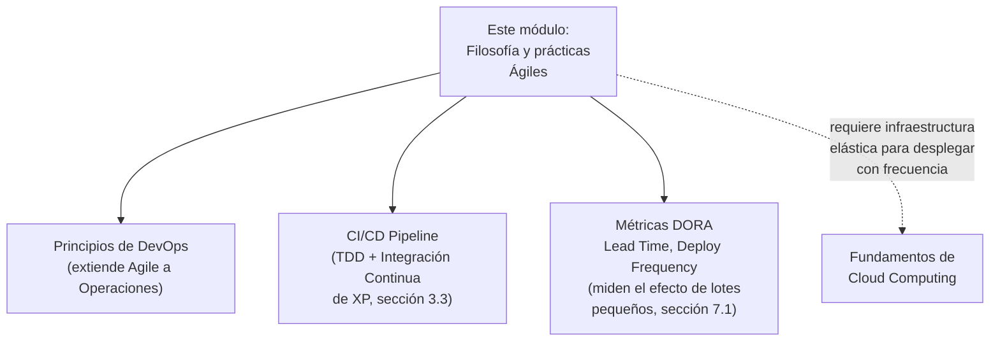

# Supernota: Filosofía Ágil, Metodologías (Waterfall, XP, Kanban) y Prácticas Ágiles Clave

> [!abstract] Resumen rápido del módulo
> **Agile no es una metodología, es una filosofía** de gestión de proyectos que valora la entrega iterativa, la colaboración con el cliente y la respuesta al cambio por encima de la planificación rígida — formalizada en el **Manifiesto Ágil (2001)**. Frente al modelo lineal **Waterfall** (fases estrictas, feedback tardío, cambios costosos), surgen metodologías concretas que *implementan* esa filosofía de formas distintas: **Extreme Programming (XP)** (disciplina técnica: TDD, pair programming, refactorización), **Kanban** (visualización de flujo y límites de trabajo en progreso, heredado de manufactura japonesa) y **Scrum** (marco iterativo por sprints con roles definidos). A nivel de práctica diaria, este enfoque se materializa en técnicas concretas: **lotes pequeños**, **MVP**, **BDD** y **TDD** (dos formas complementarias de probar el sistema, desde afuera y desde adentro respectivamente), y **pair programming**.

> [!note] Esta es una supernota
> Este archivo combina **tres resúmenes de lección** de un mismo módulo de tu curso: (1) Filosofía Ágil y el Manifiesto, (2) Waterfall, XP y Kanban, y (3) cinco prácticas ágiles clave (lotes pequeños, MVP, BDD, TDD, pair programming). Se agregó **Scrum** como marco complementario (no estaba en tus resúmenes originales) porque es indispensable para entender el panorama completo de metodologías ágiles en cualquier examen serio sobre el tema — queda claramente señalado como aporte adicional en su propia sección.

---

## Índice de esta supernota
1. [[#1. Filosofía Ágil y el Manifiesto Ágil]]
2. [[#2. Waterfall — el modelo que Agile vino a cuestionar]]
3. [[#3. Extreme Programming (XP)]]
4. [[#4. Kanban]]
5. [[#5. Scrum (marco complementario, no cubierto en el resumen original)]]
6. [[#6. Comparativa general de metodologías]]
7. [[#7. Prácticas ágiles clave]]
8. [[#8. Cómo se conecta este módulo con el resto del vault]]
9. [[#9. Conceptos complementarios]]
10. [[#10. Preguntas para repasar]]
11. [[#11. Recursos recomendados]]
12. [[#12. Notas relacionadas del vault]]

---

## 1. Filosofía Ágil y el Manifiesto Ágil

### 1.1 ¿Qué es Agile, con precisión?
**Agile** es un enfoque **iterativo e incremental** para la gestión de proyectos (originalmente de software), caracterizado por:

- **Planificación adaptativa**: el plan se ajusta continuamente en función de lo aprendido, en vez de fijarse por completo al inicio.
- **Desarrollo evolutivo**: el producto crece en **incrementos pequeños** sucesivos, no mediante un plan monolítico ejecutado de una sola vez.
- **Entrega temprana**: se entrega valor funcional al cliente lo antes posible, no solo al final del proyecto.
- **Mejora continua**: el equipo reflexiona periódicamente sobre su propio proceso y lo ajusta.
- **Respuesta al cambio**: los requisitos pueden (y deben poder) cambiar durante el desarrollo sin que eso descarrile el proyecto.

> [!important] La confusión más común sobre Agile
> "Agile" **no es un método específico ni un proceso paso a paso** — es un conjunto de **valores y principios**. Scrum, XP y Kanban (secciones 3-5) son **implementaciones concretas** de esa filosofía, cada una con sus propias reglas, roles y prácticas. Decir "hacemos Agile" sin especificar qué marco se usa es, técnicamente, una afirmación incompleta — es como decir "seguimos una dieta saludable" sin decir si es keto, mediterránea o vegetariana: todas pueden ser saludables, pero implican prácticas muy distintas.

### 1.2 El Manifiesto Ágil (2001)
En **febrero de 2001**, 17 desarrolladores de software (entre ellos Kent Beck, Martin Fowler, Ward Cunningham, Alistair Cockburn, Robert C. Martin, Jeff Sutherland y Ken Schwaber) se reunieron en Snowbird, Utah, como reacción a los procesos pesados y **basados en documentación exhaustiva** (típicos de Waterfall, ver sección 2). De ahí nació el **Manifiesto Ágil**, con cuatro valores centrales:

| # | Se valora más… | …que |
|---|---|---|
| 1 | **Individuos e interacciones** | Procesos y herramientas |
| 2 | **Software funcionando** | Documentación exhaustiva |
| 3 | **Colaboración con el cliente** | Negociación contractual |
| 4 | **Responder al cambio** | Seguir un plan rígido |

> [!warning] Matiz que se suele olvidar
> El propio manifiesto aclara: *"aunque hay valor en los elementos de la derecha, valoramos más los de la izquierda"*. Esto **no significa** que Agile rechace la documentación, los contratos o la planificación — significa que, ante un conflicto entre ambos, se prioriza lo de la izquierda. Un equipo Agile bien ejecutado sigue documentando y planificando, solo que de forma más ligera y adaptativa.

### 1.3 Los 12 principios detrás del manifiesto (aporte complementario)
El resumen original solo cubre los 4 valores — los **12 principios** que los desarrollan son el nivel de detalle que normalmente se evalúa en un examen formal sobre el tema. Se presentan aquí parafraseados:

1. La prioridad más alta es satisfacer al cliente mediante la entrega temprana y continua de software de valor.
2. Se aceptan cambios en los requisitos incluso en etapas tardías del desarrollo — Agile aprovecha el cambio como ventaja competitiva para el cliente.
3. Se entrega software funcionando con frecuencia, en ciclos cortos (semanas, no meses), prefiriendo siempre el periodo más corto posible.
4. Personas de negocio y desarrolladores deben trabajar juntos a diario durante todo el proyecto.
5. Los proyectos se construyen alrededor de individuos motivados, dándoles el entorno y el apoyo necesarios, y confiando en que harán el trabajo.
6. La conversación cara a cara es la forma más eficiente de transmitir información dentro de un equipo.
7. El software funcionando es la principal medida de progreso — no la documentación ni el cumplimiento de fechas intermedias.
8. Los procesos ágiles promueven un desarrollo sostenible: el equipo debe poder mantener un ritmo de trabajo constante indefinidamente.
9. La atención continua a la excelencia técnica y al buen diseño mejora la agilidad del equipo.
10. La simplicidad — maximizar la cantidad de trabajo **no** hecho — es esencial.
11. Las mejores arquitecturas, requisitos y diseños emergen de equipos auto-organizados, no de una autoridad central.
12. A intervalos regulares, el equipo reflexiona sobre cómo ser más efectivo y ajusta su comportamiento en consecuencia.



---

## 2. Waterfall — el modelo que Agile vino a cuestionar

### 2.1 El modelo en profundidad
**Waterfall** es un enfoque **lineal y secuencial por fases**, donde cada fase debe completarse antes de iniciar la siguiente:



La característica definitoria es que las **transiciones entre fases son estrictas**: en teoría no se debería avanzar a "Diseño" sin haber cerrado por completo "Requisitos", y regresar a una fase anterior implica un retrabajo costoso.

### 2.2 Por qué esto genera problemas (según el resumen, ampliado)
- **Feedback tardío**: el cliente no ve software funcionando hasta el final del ciclo (a veces meses o años después) — para entonces, un malentendido de requisitos ya se propagó a través de diseño, código y pruebas.
- **Correcciones costosas**: un error de requisitos detectado en la fase de pruebas es mucho más caro de corregir que si se hubiera detectado en la fase de requisitos.
- **Tiempos de entrega largos**: al no haber entregas parciales, el "time to value" (ver [[Supernota - Valor de Negocio de la Nube y Casos de Estudio]], sección 6) es máximo — todo el valor se libera de golpe al final.

> [!note] Dato histórico poco conocido (aporte complementario)
> El modelo Waterfall suele atribuirse al paper de **Winston W. Royce** de 1970, *"Managing the Development of Large Systems"*. Irónicamente, Royce **no proponía** el modelo estrictamente secuencial como buena práctica — su paper en realidad advertía que ese enfoque era riesgoso y recomendaba ciclos de retroalimentación entre fases adyacentes. La versión "pura" de Waterfall que se popularizó (y que Agile cuestiona) es, en buena medida, una simplificación excesiva de su propuesta original.

### 2.3 El costo del cambio según la fase (marco complementario: curva de Boehm)
Barry Boehm documentó que el **costo relativo de corregir un defecto** aumenta de forma aproximadamente exponencial cuanto más tarde se detecta en el ciclo de vida:

| Fase donde se detecta el defecto | Costo relativo aproximado |
|---|---|
| Requisitos | 1x (línea base) |
| Diseño | 3-6x |
| Codificación | 5-10x |
| Pruebas / Integración | 10-20x |
| Producción (ya desplegado) | 20-100x+ |

> [!important] Por qué esta curva justifica todo el módulo
> Esta curva es, en esencia, el argumento técnico-financiero detrás de **por qué Agile prioriza el feedback temprano**: cada práctica cubierta en este módulo (lotes pequeños, MVP, TDD, BDD, Kanban con flujo continuo) existe específicamente para **detectar problemas lo antes posible** en el ciclo, cuando corregirlos todavía es barato — es el hilo conductor de todo lo que sigue.

---

## 3. Extreme Programming (XP)

### 3.1 Origen y propósito
XP fue creada por **Kent Beck** a mediados de los años 90, durante el proyecto **C3 (Chrysler Comprehensive Compensation)**. Es notable que XP **existía antes del Manifiesto Ágil de 2001** — de hecho, Kent Beck fue uno de los firmantes del manifiesto, y XP fue una de las metodologías concretas que inspiró varios de sus valores.

Su objetivo explícito es mejorar la **calidad del software** y la **capacidad de respuesta al cambio**, llevando al extremo (de ahí el nombre) prácticas de ingeniería que ya existían de forma más tibia en otros procesos (ej. hacer pruebas continuamente, no solo al final; revisar código constantemente, no en revisiones puntuales).

### 3.2 Los 5 valores de XP
| Valor | Qué significa en la práctica |
|---|---|
| **Simplicidad** | Construir la solución más simple que funcione hoy, no la más "completa" pensando en necesidades futuras hipotéticas (YAGNI: *You Aren't Gonna Need It*) |
| **Comunicación** | Preferir la conversación directa y frecuente por encima de documentación extensa que puede quedar desactualizada |
| **Feedback** | Obtener retroalimentación constante y a múltiples escalas de tiempo (ver diagrama abajo) para corregir el rumbo rápido |
| **Respeto** | Cada miembro del equipo respeta el trabajo y las opiniones de los demás — condición necesaria para que la crítica de código (ej. en pair programming) sea constructiva, no destructiva |
| **Coraje** | Decir la verdad sobre el progreso o los problemas, tomar decisiones difíciles (ej. refactorizar código que "funciona" pero está mal diseñado) sin miedo |

> [!note] Nota histórica sobre los valores (aporte complementario)
> La primera edición de *Extreme Programming Explained* (Kent Beck, 1999) definía solo **4 valores** (Comunicación, Simplicidad, Feedback, Coraje). El valor de **Respeto** se añadió formalmente en la **segunda edición** (2004), reconociendo que sin respeto mutuo, prácticas como pair programming o la propiedad colectiva del código simplemente no funcionan en la práctica.

### 3.3 Las 12 prácticas de XP (aporte complementario)
El resumen original menciona los valores de XP, pero no sus prácticas concretas — que son justamente lo que hace a XP "extrema" frente a otras metodologías ágiles. Kent Beck las agrupó en 4 categorías:

| Categoría | Prácticas |
|---|---|
| **Feedback de ciclo fino** | Pair Programming (ver sección 7.5), Planning Game, Test-Driven Development (ver sección 7.4), Whole Team (cliente integrado al equipo) |
| **Proceso continuo** | Continuous Integration, Refactoring (rediseño continuo sin cambiar comportamiento), Small Releases |
| **Entendimiento compartido** | Coding Standards, Collective Code Ownership (cualquiera puede modificar cualquier parte del código), Simple Design, System Metaphor |
| **Bienestar del programador** | Sustainable Pace (ritmo sostenible — límite de ~40 horas semanales, sin "muerte por sprint" crónica) |



> [!tip] Por qué XP es "extrema"
> XP no inventó pair programming, TDD o integración continua desde cero — los llevó a su **máxima expresión práctica**: en vez de "revisar código de vez en cuando", se programa en pares *todo el tiempo*; en vez de "escribir pruebas", se escribe la prueba *antes* que el código. Es la filosofía Agile aplicada con máxima disciplina técnica.

---

## 4. Kanban

### 4.1 Origen: de la manufactura a la ingeniería de software
**Kanban** (看板, "tarjeta visual" o "cartel" en japonés) nació en el **Sistema de Producción Toyota** (Toyota Production System), desarrollado por **Taiichi Ohno** en las décadas de 1940-1950, como parte del enfoque **Lean Manufacturing**: usar tarjetas físicas para señalizar cuándo una estación de trabajo necesitaba más piezas, evitando la sobreproducción.

Su adaptación al desarrollo de software y trabajo de conocimiento fue formalizada por **David J. Anderson**, popularizada en su libro *Kanban: Successful Evolutionary Change for Your Technology Business* (2010).

### 4.2 Los principios centrales de Kanban
El resumen menciona 5 principios — se completa aquí con el sexto (Implementar ciclos de feedback), parte del marco original de Anderson:

| Principio | Qué implica |
|---|---|
| **Visualizar el flujo de trabajo** | Usar un tablero (físico o digital) donde cada tarea es una tarjeta visible en una columna que representa su estado |
| **Limitar el trabajo en progreso (WIP)** | Fijar un número máximo de tareas permitidas simultáneamente en cada columna — el corazón técnico de Kanban (ver sección 4.3) |
| **Gestionar el flujo** | Medir y optimizar activamente qué tan rápido las tareas se mueven de principio a fin, identificando cuellos de botella |
| **Hacer las políticas explícitas** | Las reglas de "cuándo una tarea puede pasar a la siguiente columna" deben estar escritas y visibles, no ser tácitas o ambiguas |
| **Implementar ciclos de feedback** *(complementario)* | Reuniones regulares (revisión de flujo, retrospectivas) para evaluar si el sistema está funcionando |
| **Mejorar colaborativamente, evolucionar experimentalmente** | Cambios pequeños y basados en evidencia al propio proceso — mejora continua (*Kaizen*, término japonés también heredado de Toyota) |



### 4.3 Por qué limitar el WIP funciona: Ley de Little (aporte complementario)
La justificación matemática de por qué limitar el trabajo en progreso reduce el tiempo de entrega proviene de la teoría de colas, formalizada como la **Ley de Little**:

$$\text{Tiempo de Ciclo Promedio} = \frac{\text{Trabajo en Progreso (WIP)}}{\text{Throughput (rendimiento)}}$$

> [!important] La intuición detrás de la fórmula
> Si un equipo mantiene el throughput (tareas completadas por semana) relativamente estable, **reducir el WIP reduce directamente el tiempo de ciclo** de cada tarea individual — hay menos tareas "compitiendo" por la atención del equipo al mismo tiempo. Esto explica por qué Kanban insiste tanto en limitar el WIP en vez de simplemente "trabajar en más cosas a la vez": el multitasking excesivo, contra la intuición, **ralentiza** la entrega de cada elemento individual.

### 4.4 Herramienta complementaria: Diagrama de Flujo Acumulado (CFD)
El **Cumulative Flow Diagram** es la herramienta visual estándar de la industria para diagnosticar problemas de flujo en un tablero Kanban: grafica, a lo largo del tiempo, cuántos elementos hay en cada columna. Un ensanchamiento progresivo de una columna intermedia (ej. "En Revisión/QA") indica visualmente un **cuello de botella** — la capacidad de esa etapa no está a la par de las etapas anteriores.

---

## 5. Scrum (marco complementario, no cubierto en el resumen original)

> [!note] Por qué se agrega esta sección
> Tus resúmenes originales cubren Waterfall, XP y Kanban, pero **omiten Scrum** — el marco ágil más adoptado en la industria de software (según encuestas anuales como el *State of Agile Report*). Sería una laguna importante de cara a un examen sobre metodologías ágiles, así que se agrega completa como aporte adicional.

**Scrum** es un marco de trabajo iterativo, con ciclos de tiempo fijo llamados **Sprints** (típicamente de 1 a 4 semanas), diseñado originalmente por **Ken Schwaber y Jeff Sutherland**.

### 5.1 Roles
| Rol | Responsabilidad |
|---|---|
| **Product Owner** | Dueño del *Product Backlog*; decide **qué** se construye y en qué orden de prioridad, maximizando el valor de negocio |
| **Scrum Master** | Facilita el proceso, elimina impedimentos del equipo, protege al equipo de interrupciones externas — no es un "jefe de proyecto" tradicional |
| **Equipo de Desarrollo** | Equipo auto-organizado y multifuncional responsable de **cómo** se construye lo comprometido en cada sprint |

### 5.2 Eventos (ceremonias)
- **Sprint Planning**: al inicio del sprint, el equipo decide qué elementos del backlog abordará.
- **Daily Scrum**: reunión diaria breve (~15 min) de sincronización del equipo.
- **Sprint Review**: al final del sprint, se demuestra el incremento funcional a los interesados.
- **Sprint Retrospective**: el equipo reflexiona sobre su propio proceso (conexión directa con el principio 12 del Manifiesto, sección 1.3).

### 5.3 Artefactos
- **Product Backlog**: lista priorizada de todo lo que podría necesitar el producto.
- **Sprint Backlog**: subconjunto del backlog comprometido para el sprint actual.
- **Incremento**: la suma de todo el trabajo completado, potencialmente entregable.



> [!tip] Diferencia clave frente a Kanban
> Scrum trabaja con **ciclos de tiempo fijo (timeboxed)**: el alcance del sprint se congela al iniciarlo. Kanban trabaja con **flujo continuo**: las tareas entran y salen del sistema en cualquier momento, sin sprints — el equipo simplemente extrae (*pull*) la siguiente tarea cuando hay capacidad disponible (WIP libre). La combinación híbrida de ambos se conoce informalmente como **Scrumban**.

---

## 6. Comparativa general de metodologías

| | **Waterfall** | **XP** | **Scrum** | **Kanban** |
|---|---|---|---|---|
| Tipo de ciclo | Lineal, una sola pasada | Iterativo, iteraciones cortas | Iterativo, sprints de tiempo fijo | Flujo continuo, sin iteraciones fijas |
| Tolerancia al cambio | Muy baja | Alta | Media-alta (solo entre sprints) | Muy alta (en cualquier momento) |
| Rol del cliente | Al inicio y al final | Integrado al equipo (*Whole Team*) | Vía Product Owner | Variable, según implementación |
| Prescribe prácticas de ingeniería | No | Sí (TDD, pair programming, CI) | No (agnóstico de prácticas técnicas) | No |
| Roles formales | Sí (por fase) | Mínimos | Sí (PO, SM, equipo) | No prescribe roles |
| Métrica clave | Cumplimiento de cronograma | Calidad de código / feedback | Velocidad (*velocity*) por sprint | Tiempo de ciclo (*cycle time*), WIP |

---

## 7. Prácticas ágiles clave

### 7.1 Trabajar en lotes pequeños (Small Batches)
Reducir el tamaño de los lotes de trabajo (entregar menos funcionalidad, con más frecuencia) reduce el desperdicio (*muda*, concepto Lean) al permitir **feedback más rápido** y **detección más temprana de errores** frente a lotes grandes.

**Ejemplo de flujo de una sola pieza (*single piece flow*)**: si una fábrica inspecciona la calidad de una pieza a la vez en vez de esperar a tener un lote completo de 100 piezas, un defecto se detecta casi inmediatamente (en la pieza 1, no en la pieza 100) — evitando reproducir el mismo error 99 veces más antes de notarlo.

> [!important] Conexión directa con la curva de Boehm (sección 2.3)
> Los lotes pequeños son, en esencia, la aplicación práctica de "detectar errores lo antes posible": cuanto más pequeño el lote, más rápido llega el feedback, y más barato es corregir cualquier problema — es el mismo principio que hace que Kanban limite el WIP (sección 4.3) y que las métricas DORA (ver [[Supernota - Metricas, Cultura y SRE]]) midan **Lead Time for Changes** y **Deployment Frequency** como indicadores clave de madurez.

### 7.2 Producto Mínimo Viable (MVP)
Un **MVP** es la **versión más pequeña de un producto que permite probar una hipótesis** y obtener aprendizaje validado sobre los clientes — **no** es simplemente "la primera fase" del producto completo, ni una versión "beta" con menos funciones.

> [!warning] Distinción que se confunde constantemente
> Un MVP **no** es "el producto completo pero con menos funciones" (eso sería más bien un *producto mínimo comercializable*). Un MVP puede ser deliberadamente tosco o incompleto en formas que nunca llegarían a producción — su único propósito es **generar aprendizaje** con el mínimo esfuerzo posible, no ser una versión reducida del producto final.

**Origen conceptual (aporte complementario)**: el término fue popularizado por **Eric Ries** en *The Lean Startup* (2011), como parte del ciclo **Construir → Medir → Aprender** (*Build-Measure-Learn*):



Los MVPs iterativos permiten a los equipos **pivotar** (cambiar de dirección estratégica) o **perseverar** (seguir refinando la dirección actual) según la evidencia real del cliente, en vez de basar decisiones grandes en suposiciones no validadas.

### 7.3 Behavior Driven Development (BDD)
BDD prueba el sistema **de afuera hacia adentro** (*outside-in*), enfocándose en el **comportamiento observable** del sistema desde la perspectiva del usuario/negocio, no en la implementación interna.

Usa una sintaxis común entendible tanto por desarrolladores como por interesados de negocio (sintaxis **Gherkin**, con herramientas como Cucumber o Behave — aporte complementario):

```
Dado (Given) que el usuario tiene una cuenta con saldo de $100
Cuando (When) el usuario retira $30
Entonces (Then) el saldo restante debe ser $70
```

> [!tip] Por qué BDD importa más allá de "otro tipo de prueba"
> El valor real de BDD no es solo técnico: al escribir los escenarios en lenguaje natural compartido, el **mismo documento** sirve como especificación de requisitos, criterio de aceptación **y** prueba automatizada ejecutable — funciona como "documentación viva" que nunca queda desactualizada, porque si el comportamiento cambia, la prueba falla.

### 7.4 Test Driven Development (TDD)
TDD prueba el sistema **de adentro hacia afuera** (*inside-out*), con foco en **pruebas unitarias** de módulos individuales — es el enfoque opuesto y complementario a BDD.

**Flujo de trabajo: Rojo, Verde, Refactorizar**



1. **Rojo**: se escribe una prueba unitaria para una funcionalidad que **todavía no existe** — la prueba falla necesariamente.
2. **Verde**: se escribe el código **mínimo** necesario para que la prueba pase, sin preocuparse aún por elegancia.
3. **Refactorizar**: se mejora el diseño del código (eliminando duplicación, mejorando nombres, simplificando) manteniendo todas las pruebas en verde.

### 7.4.1 TDD vs BDD — no son competidores (tabla comparativa)
| | **TDD** | **BDD** |
|---|---|---|
| Dirección | Adentro hacia afuera (*inside-out*) | Afuera hacia adentro (*outside-in*) |
| Nivel típico de prueba | Unitario (una función, una clase) | Integración / aceptación (comportamiento del sistema completo) |
| Audiencia del lenguaje | Desarrolladores | Desarrolladores **y** interesados de negocio |
| Pregunta que responde | "¿Esta unidad de código hace lo que debería?" | "¿El sistema se comporta como el negocio espera?" |

> [!note] La Pirámide de Pruebas (marco complementario, Mike Cohn)
> Un marco formal muy citado en la industria organiza los tipos de prueba en una pirámide: **muchas** pruebas unitarias (TDD) en la base — rápidas y baratas de mantener —, **menos** pruebas de integración en el medio, y **pocas** pruebas end-to-end/UI (más cercanas al enfoque BDD) en la cúspide — lentas y frágiles si se abusa de ellas. La recomendación de la industria es evitar una "pirámide invertida" (muchas pruebas E2E, pocas unitarias), un antipatrón común que hace las suites de prueba lentas y poco confiables.

### 7.5 Pair Programming
Dos programadores trabajan juntos, en la misma estación de trabajo, sobre el mismo código, típicamente en dos roles que **rotan periódicamente** (aporte complementario, no detallado en el resumen original):

- **Driver (conductor)**: escribe el código, con foco táctico en la sintaxis y los detalles inmediatos.
- **Navigator (navegante)**: revisa el trabajo del driver en tiempo real, piensa estratégicamente en el diseño general y detecta errores antes de que se escriban.

**Beneficios reportados**:
- Detección temprana de defectos (el navigator actúa como revisor de código en tiempo real, no días después).
- Transferencia de conocimiento y mentoría — especialmente valioso para incorporar a alguien nuevo al equipo o a una base de código.
- Reducción de costos de depuración y mantenimiento a largo plazo, al haber dos perspectivas validando el diseño desde el inicio.

> [!note] Contrapunto honesto (matiz no mencionado en el resumen, pero relevante para un análisis completo)
> Pair programming no está exento de críticas: puede generar fatiga si se practica sin pausas, requiere coordinación de horarios entre dos personas, y algunos estudios muestran que su beneficio neto depende mucho del contexto (tareas muy complejas o de alto riesgo se benefician más que tareas rutinarias). No es una práctica "gratis" en términos de costo de dos personas dedicadas a una sola tarea — el argumento a favor es que ese costo se recupera vía menos defectos y menos retrabajo posterior.

---

## 8. Cómo se conecta este módulo con el resto del vault



Este módulo funciona como el **fundamento cultural y metodológico** que antecede históricamente a DevOps: donde Agile se enfocó originalmente en la colaboración entre **negocio y desarrollo**, DevOps (cubierto en notas relacionadas de tu vault) extiende esos mismos valores — lotes pequeños, feedback rápido, colaboración, mejora continua — para incluir también a **Operaciones**, cerrando el ciclo completo desde el código hasta producción. A su vez, prácticas como CI (parte de XP, sección 3.3) son literalmente la mitad técnica del término "CI/CD", y la capacidad de desplegar con la frecuencia que estas prácticas demandan depende de la elasticidad de infraestructura cubierta en las supernotas de Cloud Computing.

---

## 9. Conceptos complementarios (no cubiertos en los resúmenes originales)

### 9.1 Lean Software Development
Adaptación de los principios Lean de Toyota (que también dieron origen a Kanban, sección 4.1) al desarrollo de software, formalizada por **Mary y Tom Poppendieck** (*Lean Software Development: An Agile Toolkit*, 2003). Sus 7 principios: eliminar desperdicio, amplificar el aprendizaje, decidir lo más tarde posible, entregar lo más rápido posible, empoderar al equipo, construir integridad desde el inicio, y ver el sistema completo.

### 9.2 El Marco Cynefin (Dave Snowden)
Marco de toma de decisiones que clasifica los problemas en dominios: **simple/obvio**, **complicado**, **complejo** y **caótico**. Es útil para justificar formalmente *por qué* Agile supera a Waterfall en la mayoría del desarrollo de software moderno: Waterfall asume que los requisitos son "conocibles por adelantado" (dominio complicado, resoluble con planificación experta), mientras que la mayoría de proyectos de software real caen en el dominio **complejo** — donde la relación causa-efecto solo es clara en retrospectiva, y la estrategia correcta es experimentar en ciclos cortos (exactamente lo que hacen Scrum/XP/Kanban) en vez de planificar todo por adelantado.

### 9.3 Definition of Done (DoD) y Definition of Ready (DoR)
Conceptos formales de Scrum: la **Definition of Done** es el criterio explícito y compartido que determina cuándo un elemento de trabajo está realmente terminado (ej. "código escrito + pruebas pasando + revisado por un par + desplegado a staging"), evitando ambigüedad sobre el progreso real. La **Definition of Ready** es el criterio inverso: qué debe cumplir un elemento del backlog antes de poder ser tomado por el equipo en un sprint (requisitos claros, criterios de aceptación definidos, sin dependencias bloqueantes).

### 9.4 Scaled Agile Framework (SAFe) — mención breve
Cuando una organización tiene **muchos equipos ágiles** trabajando en un mismo producto o plataforma grande, coordinar sus sprints, dependencias y prioridades se vuelve un problema en sí mismo. **SAFe** es uno de los marcos más adoptados en la industria para "escalar" Agile a nivel de múltiples equipos y portafolios completos — relevante mencionarlo porque es un término frecuente en entornos empresariales grandes, aunque no forme parte del resumen original.

---

## 10. Preguntas para repasar (auto-evaluación)

- [ ] ¿Por qué se dice que "Agile" no es una metodología, sino una filosofía? ¿Qué la distingue de Scrum, XP y Kanban?
- [ ] ¿Cuáles son los 4 valores del Manifiesto Ágil, y qué matiz importante aclara el propio manifiesto sobre ellos?
- [ ] ¿Por qué el modelo Waterfall genera correcciones más costosas que un enfoque iterativo? Explica usando la curva de costo de Boehm.
- [ ] ¿Cuáles son los 5 valores de XP, y cómo se relacionan sus 12 prácticas con esos valores?
- [ ] ¿Por qué limitar el WIP en Kanban reduce el tiempo de ciclo? Explica usando la Ley de Little.
- [ ] ¿Cuál es la diferencia clave entre Scrum (sprints de tiempo fijo) y Kanban (flujo continuo)?
- [ ] ¿Por qué un MVP no es lo mismo que una versión "beta" o la "primera fase" del producto completo?
- [ ] ¿Cuál es la diferencia entre TDD y BDD en términos de dirección (inside-out vs outside-in) y audiencia?
- [ ] ¿Qué es la Pirámide de Pruebas, y por qué una "pirámide invertida" es un antipatrón?
- [ ] ¿Cómo conecta el concepto de "lotes pequeños" con las métricas DORA de Lead Time y Deployment Frequency?

---

## 11. Recursos recomendados para profundizar

- 🌐 [Manifiesto Ágil — sitio oficial](https://agilemanifesto.org/iso/es/manifesto.html) y sus [12 principios](https://agilemanifesto.org/iso/es/principles.html).
- 🌐 [The Scrum Guide — Ken Schwaber & Jeff Sutherland](https://scrumguides.org/) — documento oficial y gratuito del marco Scrum.
- 📘 *Extreme Programming Explained: Embrace Change* (2nd ed.) — Kent Beck, con Cynthia Andres.
- 📘 *Kanban: Successful Evolutionary Change for Your Technology Business* — David J. Anderson.
- 📘 *The Lean Startup* — Eric Ries (origen formal del concepto de MVP y el ciclo Build-Measure-Learn).
- 📘 *Test-Driven Development: By Example* — Kent Beck.
- 🌐 [Introducing BDD — Dan North (2006)](https://dannorth.net/introducing-bdd/) — artículo original que formalizó BDD.
- 📘 *Lean Software Development: An Agile Toolkit* — Mary y Tom Poppendieck.

---

## 12. Notas relacionadas del vault
- [[Principios Fundamentales de DevOps (Resumen Integrador)]]
- [[Que es DevOps - Definicion y Malentendidos]]
- [[CI-CD Pipeline]]
- [[Supernota - Metricas, Cultura y SRE]]
- [[Ops Tradicional vs DevOps]]
- [[Supernota - Fundamentos de Cloud Computing]]
- [[Supernota - Valor de Negocio de la Nube y Casos de Estudio]]

---
#agile #xp #kanban #scrum #tdd #bdd #devops
