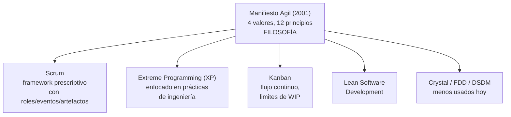
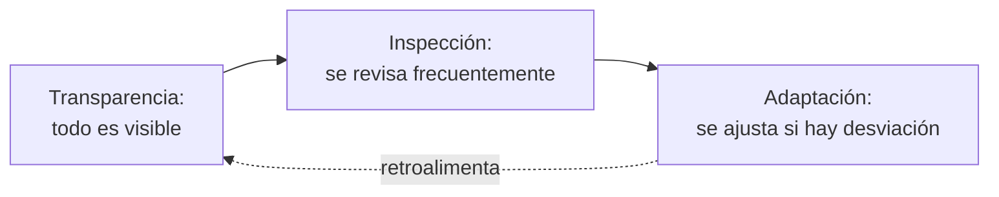
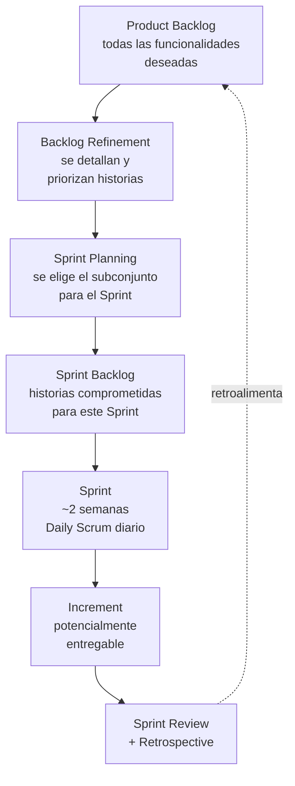
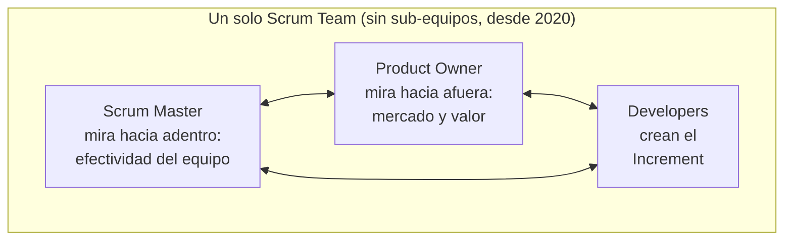
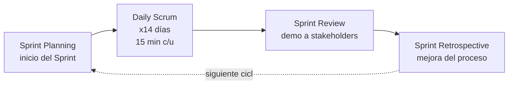
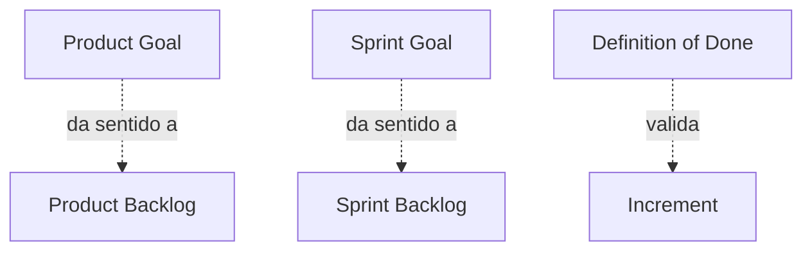
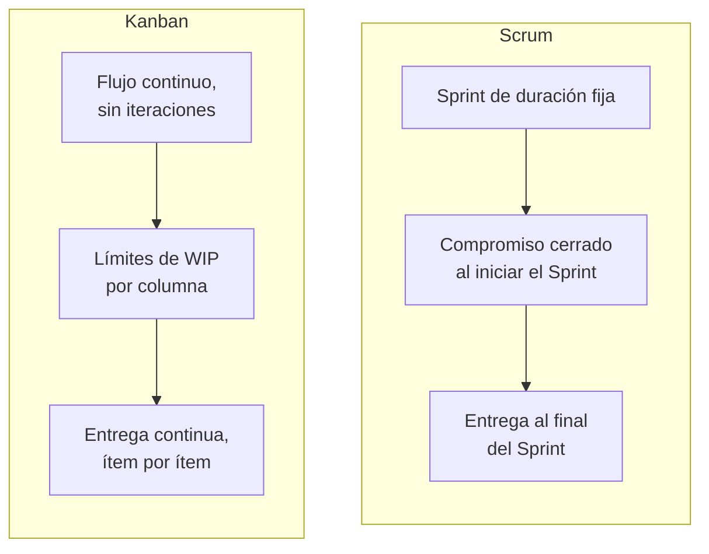
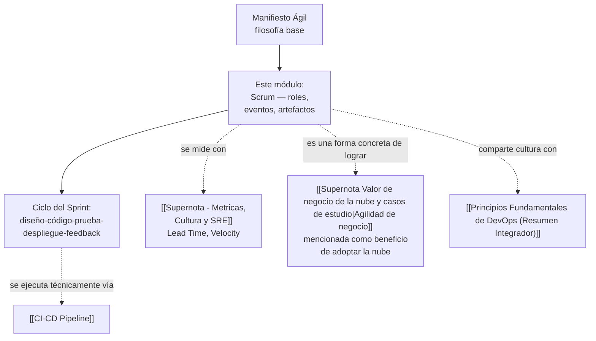

# Supernota: Scrum — Metodología Ágil, Roles, Eventos y Artefactos

> [!abstract] Resumen rápido del módulo
> **Agile** (Ágil) es una *filosofía* de trabajo — un conjunto de valores y principios sobre cómo planificar y desarrollar de forma adaptativa. **Scrum** es un *marco de trabajo* (framework) prescriptivo que **implementa** esa filosofía mediante equipos pequeños, multifuncionales y auto-gestionados que trabajan en iteraciones de tiempo fijo llamadas **Sprints**. Scrum define tres **accountabilities** (Product Owner, Scrum Master, Developers), tres **artefactos** con sus compromisos, y cinco **eventos** con duración fija (*timebox*), todo sostenido sobre tres pilares empíricos: transparencia, inspección y adaptación.

> [!note] Esta es una supernota
> Este archivo combina **tres lecciones distintas** del mismo módulo de curso: (1) diferencia Agile vs Scrum y el proceso general, (2) los roles de Scrum, y (3) artefactos, eventos, beneficios y comparación con Kanban. Se presentan en un solo documento, desarrolladas a profundidad y conectadas entre sí. El contenido original estaba en **inglés**; se tradujo al español, dejando los términos técnicos de la industria en inglés con su traducción/definición la primera vez que aparecen (ej. *Sprint*, *Backlog*).

---

## Índice de esta supernota
1. [[#1. Agile vs Scrum — la filosofía y el marco que la implementa]]
2. [[#2. Los tres pilares del empirismo en Scrum]]
3. [[#3. El proceso completo — del Product Backlog al Increment]]
4. [[#4. Roles de Scrum (Accountabilities)]]
5. [[#5. Eventos de Scrum]]
6. [[#6. Artefactos de Scrum y sus compromisos]]
7. [[#7. Beneficios de Scrum]]
8. [[#8. Scrum vs Kanban — comparativa profunda]]
9. [[#9. Cómo se conecta este módulo con el resto del vault]]
10. [[#10. Conceptos complementarios]]
11. [[#11. Preguntas para repasar]]
12. [[#12. Recursos recomendados]]
13. [[#13. Notas relacionadas del vault]]

---

## 1. Agile vs Scrum — la filosofía y el marco que la implementa

### 1.1 La distinción central (de tu resumen original)
- **Agile** (Ágil) es una **filosofía de trabajo**: un conjunto de valores y principios que favorecen la **planificación adaptativa** (*adaptive planning*) y el **desarrollo iterativo** por encima de la planificación rígida y secuencial.
- **Scrum** es una **metodología prescriptiva**: un marco de trabajo concreto y estructurado que **aplica** los principios ágiles mediante reglas, roles, eventos y artefactos específicos.

> [!important] El matiz que casi siempre se evalúa en examen
> Agile **no es** una metodología ni un conjunto de pasos — es una filosofía. Esto significa que **no existe "hacer Agile"** como acción concreta; lo que existe es **elegir un marco de trabajo** (Scrum, Kanban, XP, etc.) que materialice esa filosofía. Decir "vamos a hacer Agile" es, técnicamente, una imprecisión — lo correcto es decir "vamos a adoptar Scrum" (o Kanban, o XP) como forma de trabajar de manera ágil.

### 1.2 Aporte complementario: el Manifiesto Ágil (2001)
El resumen no lo menciona explícitamente, pero es el documento fundacional que formaliza qué significa "Agile" — es prácticamente imposible entender a fondo la diferencia Agile/Scrum sin conocerlo. Fue escrito en 2001 por 17 desarrolladores de software en Snowbird, Utah, y define **4 valores** y **12 principios**.

**Los 4 valores** (se prioriza lo de la izquierda sobre lo de la derecha, sin descartar lo de la derecha):

| Se valora más... | ...por encima de |
|---|---|
| Individuos e interacciones | Procesos y herramientas |
| Software funcionando | Documentación exhaustiva |
| Colaboración con el cliente | Negociación de contratos |
| Respuesta ante el cambio | Seguir un plan rígido |

De los **12 principios**, los más relevantes para entender Scrum son: entrega frecuente de software funcionando (cada 2-4 semanas, de ahí el Sprint típico de 2 semanas), el cambio de requisitos se acepta incluso en etapas tardías del desarrollo, y los equipos auto-organizados producen mejores resultados que los dirigidos jerárquicamente.

### 1.3 Scrum no es la única forma de implementar Agile
Para dimensionar correctamente dónde encaja Scrum dentro del ecosistema ágil:

> [!tip] Analogía para recordar la relación
> Piensa en Agile como "comer saludable" (una filosofía) y en Scrum como "la dieta keto" (un plan concreto, con reglas específicas, para lograr ese objetivo). Kanban sería "ayuno intermitente" — otra forma concreta de perseguir el mismo objetivo general, con reglas distintas.

---

## 2. Los tres pilares del empirismo en Scrum

> [!note] Contenido no mencionado en el resumen original
> Esta es la base teórica formal sobre la que se sostiene *todo* lo demás en Scrum (roles, eventos, artefactos). El Scrum Guide oficial la coloca como fundamento antes de explicar cualquier otro elemento — es prácticamente garantizado que aparezca en un examen formal sobre el tema.

Scrum se basa en el **proceso de control empírico** (*empirical process control theory*): la idea de que el conocimiento proviene de la experiencia y de tomar decisiones basadas en lo que ya se observó, no en planificación predictiva exhaustiva. Esto se sostiene en tres pilares:

| Pilar | Definición | Cómo se materializa en Scrum |
|---|---|---|
| **Transparencia** (*Transparency*) | Los aspectos significativos del proceso deben ser visibles para quienes son responsables del resultado | Product Backlog visible para todos, Sprint Backlog visible durante el Sprint, Definition of Done compartida y clara |
| **Inspección** (*Inspection*) | Los artefactos de Scrum y el progreso hacia un objetivo deben inspeccionarse frecuentemente para detectar variaciones no deseadas | Daily Scrum (inspecciona el progreso diario), Sprint Review (inspecciona el Increment) |
| **Adaptación** (*Adaptation*) | Si una inspección revela que uno o más aspectos del proceso se desvían de límites aceptables, el proceso o el material que se está procesando debe ajustarse | Sprint Retrospective (ajusta el proceso del equipo), replanificación del Sprint Backlog durante el Sprint si es necesario |

> [!warning] Error común
> Sin **transparencia real**, la inspección es inútil (no se puede inspeccionar lo que está oculto o distorsionado), y sin inspección, la adaptación llega demasiado tarde. Muchos equipos que dicen "hacer Scrum" pero ocultan problemas en el Daily Scrum (ej. no reportar bloqueos reales) rompen el pilar de transparencia, y por lo tanto invalidan los otros dos — esto se conoce informalmente como **"Scrum-but"** (ver sección 10).

---

## 3. El proceso completo — del Product Backlog al Increment

### 3.1 El flujo descrito en tu resumen
Tu resumen describe correctamente la secuencia general:

1. El **Product Backlog** (Backlog de producto) contiene todas las funcionalidades e historias deseadas del producto.
2. El **Backlog refinement** (Refinamiento del backlog) prepara ("acicala") las historias para que estén listas para un Sprint.
3. El **Sprint Planning** (Planificación del Sprint) selecciona un subconjunto de historias para el **Sprint Backlog**.
4. Los **Sprints** duran típicamente unas dos semanas, con reuniones diarias de seguimiento (*Daily stand-up*).
5. Cada Sprint busca producir un **incremento de producto potencialmente entregable** (*potentially shippable product increment*).
6. El ciclo se repite de forma iterativa: diseño, código, prueba, despliegue y retroalimentación, para mejorar continuamente el producto.

### 3.2 Precisión técnica: "potencialmente entregable" no significa "se entrega siempre"
> [!important] Matiz importante
> Que un Increment sea **potencialmente entregable** significa que **cumple con la Definition of Done** (ver sección 6) y **podría** lanzarse a producción en cualquier momento — **no** significa que la organización esté obligada a lanzarlo al finalizar cada Sprint. El Product Owner decide *cuándo* liberar valor al mercado; Scrum solo garantiza que, técnicamente, el incremento *podría* liberarse. De hecho, el Scrum Guide 2020 aclara explícitamente que el **Sprint Review nunca debe considerarse una "puerta" (gate) obligatoria para el lanzamiento** — es una revisión de valor, no una aprobación de despliegue.

### 3.3 El ciclo diseño-código-prueba-despliegue-feedback
El cierre del ciclo que menciona tu resumen (diseño, código, prueba, despliegue, feedback) es, en esencia, un mini-ciclo de **DevOps** ejecutándose *dentro* de cada Sprint — cada iteración de Scrum produce trabajo que idealmente pasa por un **[[Supernota - Fundamentos de Cloud Computing|pipeline]]** de integración y entrega continua. Ver conexión completa en la sección 9.

---

## 4. Roles de Scrum (Accountabilities)

### 4.1 De "roles" a "accountabilities" — un cambio de terminología importante
> [!important] Actualización que tu resumen no refleja (Scrum Guide 2020)
> Tu resumen usa el término **"roles"** (Product Owner, Scrum Master, Scrum Team) — esta era la terminología de la **Scrum Guide 2017**. En la actualización oficial de **noviembre de 2020** (Ken Schwaber y Jeff Sutherland, autores del framework), el término "role" (rol) se reemplazó por **"accountability"** (rendición de cuentas / responsabilidad de resultado), y el "Development Team" (Equipo de Desarrollo) como sub-equipo dentro del Scrum Team **desapareció**: ahora se llama simplemente **"Developers"** (Desarrolladores), y todos —Product Owner, Scrum Master y Developers— forman **un solo Scrum Team**, sin sub-equipos ni jerarquías internas. El cambio busca evitar la mentalidad de "nosotros vs. ellos" entre Product Owner y el equipo técnico, y enfatizar que **todo el Scrum Team** es responsable de crear un Increment valioso, no solo los Developers.

### 4.2 Product Owner
*(Según tu resumen, con matiz ampliado)*
- Representa los intereses de los interesados (*stakeholders*) y actúa como enlace entre ellos y el Scrum Team.
- Articula la visión del producto, prioriza el Product Backlog, y decide si aceptar o rechazar los incrementos de producto.
- **Ampliación formal (Scrum Guide 2020)**: es responsable de **maximizar el valor del producto** resultante del trabajo del Scrum Team — su foco es "mirar hacia afuera", hacia el mercado y las oportunidades, no solo gestionar una lista de tareas.

### 4.3 Scrum Master
*(Según tu resumen, con matiz ampliado)*
- Facilita el proceso Scrum y entrena (*coach*) al equipo en las prácticas de Scrum.
- Crea un entorno para equipos auto-organizados, protege al equipo de interrupciones externas, y elimina impedimentos al progreso.
- **Ampliación formal**: su foco es "mirar hacia adentro" — mejorar la capacidad de la organización para entregar valor de forma efectiva. Es un ejemplo formal de **liderazgo servicial** (*Servant Leadership*, ver sección 10) — lidera sirviendo al equipo, no dando órdenes.

### 4.4 Developers (antes "Scrum Team" / "Development Team")
*(Según tu resumen, con la terminología actualizada)*
- Grupo pequeño, multifuncional (*cross-functional*), dedicado y responsable de entregar incrementos de producto.
- Se auto-gestiona (*self-manages*) en la asignación del trabajo, y negocia los compromisos del Sprint con el Product Owner, teniendo autonomía sobre **cómo** lograr los objetivos.
- **Nota terminológica 2020**: la Scrum Guide 2017 usaba "self-organizing" (auto-organizado); la versión 2020 usa el término más fuerte **"self-managing"** (auto-gestionado) — implica que el equipo no solo decide *cómo* trabajar, sino también *quién* hace *qué* y *cuándo*, sin necesidad de que un tercero (ej. un gerente de proyecto) asigne tareas individuales.

### 4.5 Tabla comparativa de accountabilities

| Accountability | Foco principal | Es responsable de | Nivel de autoridad |
|---|---|---|---|
| **Product Owner** | El *qué* y el *por qué* (valor de negocio) | Maximizar el valor del producto, priorizar el Backlog | Única autoridad para priorizar el Product Backlog |
| **Scrum Master** | El *cómo funciona el proceso* | Efectividad del Scrum Team, remover impedimentos, coaching | No gestiona personas ni asigna tareas |
| **Developers** | El *cómo se construye* técnicamente | Crear el Increment, plan del Sprint, calidad técnica | Autonomía total sobre decisiones técnicas |

> [!tip] Pregunta clásica de examen
> "¿Puede una misma persona ser Product Owner y Scrum Master a la vez?" — Técnicamente el Scrum Guide no lo prohíbe explícitamente, pero es **fuertemente desaconsejado** en la práctica: los focos de ambos roles son casi opuestos (uno mira hacia el mercado y prioriza valor; el otro protege y sirve al proceso del equipo, incluso cuando eso significa cuestionar al propio Product Owner) — combinarlos genera conflicto de interés estructural.

---

## 5. Eventos de Scrum

> [!note] Contenido de tu resumen (nota 3), ampliado con timeboxes oficiales
> Tu resumen nombra los 5 eventos pero no especifica su duración máxima formal (*timebox*). Los timeboxes oficiales están definidos para un Sprint de **1 mes**; para el Sprint de **2 semanas** que menciona tu resumen, la duración recomendada de cada evento se **reduce proporcionalmente** (aprox. a la mitad).

| Evento | Objetivo | Timebox oficial (Sprint de 1 mes) | Timebox aproximado (Sprint de 2 semanas) | Participantes |
|---|---|---|---|---|
| **Sprint** | El "contenedor" de todos los demás eventos; periodo de trabajo fijo | 1 mes máximo | 2 semanas | Todo el Scrum Team |
| **Sprint Planning** | Planificar el trabajo a realizar en el Sprint y definir el Sprint Goal | Máx. 8 horas | ~4 horas | Todo el Scrum Team |
| **Daily Scrum** | Sincronizar el trabajo diario e inspeccionar el progreso hacia el Sprint Goal | 15 minutos | 15 minutos (no cambia) | Developers (PO y SM pueden asistir) |
| **Sprint Review** | Inspeccionar el Increment y adaptar el Product Backlog según feedback | Máx. 4 horas | ~2 horas | Scrum Team + stakeholders |
| **Sprint Retrospective** | Reflexionar sobre el propio proceso del equipo y planear mejoras | Máx. 3 horas | ~1.5 horas | Todo el Scrum Team |

> [!warning] Precisión que suele evaluarse mal
> El **Daily Scrum NO es una reunión de reporte de estatus al Scrum Master o al Product Owner** — es una reunión de **sincronización entre Developers** para inspeccionar el progreso hacia el Sprint Goal y ajustar el plan del día. La Scrum Guide 2020 incluso eliminó la prescripción de las "3 preguntas clásicas" (¿qué hice ayer?, ¿qué haré hoy?, ¿qué obstáculos tengo?) — el formato queda a discreción del equipo, siempre que cumpla el propósito de inspección y adaptación diaria.

---

## 6. Artefactos de Scrum y sus compromisos

### 6.1 Los tres artefactos (de tu resumen)
- **Product Backlog**: lista completa de todas las funcionalidades y requisitos deseados del producto, aún no completados.
- **Sprint Backlog**: subconjunto del Product Backlog con las historias planificadas para el próximo Sprint.
- **Increment** (Incremento / "Done Increment"): el incremento de producto completado y entregado al final de cada Sprint.

### 6.2 Aporte complementario: los "Commitments" (compromisos) — Scrum Guide 2020
> [!important] Elemento nuevo en la Scrum Guide 2020, no mencionado en tu resumen
> Cada uno de los tres artefactos tiene asociado un **compromiso** (*commitment*) que aporta transparencia y enfoca la medición del progreso — este es uno de los cambios más citados de la actualización 2020:

| Artefacto | Compromiso (*Commitment*) asociado | Qué representa |
|---|---|---|
| **Product Backlog** | **Product Goal** (Objetivo de producto) | El estado futuro del producto que el Scrum Team persigue a largo plazo — da coherencia a los Sprints entre sí |
| **Sprint Backlog** | **Sprint Goal** (Objetivo del Sprint) | El "por qué" de ese Sprint específico — un único objetivo que unifica a los Developers, en vez de una simple lista de tareas sueltas |
| **Increment** | **Definition of Done** (Definición de "Terminado") | Un checklist formal y compartido que define qué requisitos de calidad debe cumplir un incremento para considerarse completo |

### 6.3 Definition of Done vs Definition of Ready
> [!note] Distinción clásica que se confunde en examen
> - **Definition of Done (DoD)**: checklist de calidad que determina cuándo un ítem del Sprint Backlog está realmente **terminado** (ej. "código revisado, pruebas unitarias pasando, documentado, desplegado en ambiente de staging").
> - **Definition of Ready (DoR)**: checklist —no oficial en el Scrum Guide, pero ampliamente adoptado en la industria— que determina cuándo una historia del Product Backlog está suficientemente **detallada y clara** como para poder ser tomada en un Sprint Planning (conecta directamente con el "Backlog Refinement" de la sección 3).
> Ambos son checklists de calidad, pero en **extremos opuestos** del flujo: DoR se aplica *antes* de entrar al Sprint; DoD se aplica *al final*, para salir de él.

---

## 7. Beneficios de Scrum

*(De tu resumen, nota 3)*

| Beneficio | Mecanismo técnico que lo produce |
|---|---|
| **Mayor productividad** | Coordinación diaria (Daily Scrum) + progreso visible (Sprint Backlog transparente) |
| **Mejor calidad de software** | Pruebas continuas + compromiso de calidad explícito (Definition of Done) |
| **Menor tiempo al mercado** (*time to market*) | Entrega de incrementos pequeños y frecuentes, en vez de un solo lanzamiento monolítico al final |
| **Mayor satisfacción de stakeholders** | Visibilidad temprana y regular del producto (Sprint Review cada Sprint, no solo al final del proyecto) |
| **Mejor dinámica de equipo** | Transparencia y auto-gestión (Retrospective como espacio formal de mejora continua) |

> [!tip] Conexión directa con métricas formales de la industria
> Estos beneficios no son solo cualitativos — se pueden **medir** con marcos formales como las **[[Supernota - Metricas, Cultura y SRE|métricas DORA]]**: Sprints más cortos y frecuentes reducen directamente el **Lead Time** (tiempo desde que se prioriza una historia hasta que llega a producción), y la práctica continua de pruebas dentro del Sprint reduce el **Change Failure Rate**.

---

## 8. Scrum vs Kanban — comparativa profunda

*(De tu resumen, ampliada)*

| Dimensión | **Scrum** | **Kanban** |
|---|---|---|
| Cadencia | Iteraciones de tiempo fijo (*Sprints*) | Flujo continuo (*continuous flow*), sin iteraciones obligatorias |
| Roles prescritos | Sí: Product Owner, Scrum Master, Developers | No prescribe roles formales |
| Cambios durante el ciclo | Se busca **evitar** cambios dentro de un Sprint ya comprometido | Se **permiten** cambios y mejoras continuas en cualquier momento |
| Momento de entrega | Al final de cada Sprint (aunque no es obligatorio liberar) | Continua, ítem por ítem, en cuanto está terminado |
| Mecanismo de control de flujo | Timeboxing (duración fija del Sprint) | **Límites de WIP** (*Work In Progress* — trabajo en progreso): número máximo de tareas permitidas por columna del tablero simultáneamente |
| Tablero típico | Columnas simples (To Do / In Progress / Done), reiniciado cada Sprint | Columnas más granulares con límites de WIP visibles en cada una, persistente en el tiempo |
| Métrica clave | **Velocity** (Velocidad): cantidad de trabajo completado por Sprint | **Cycle Time** y **Throughput**: tiempo que tarda un ítem en completarse y cantidad de ítems completados por periodo |
| Origen | Desarrollo de software (Jeff Sutherland y Ken Schwaber, 1995) | Manufactura — sistema de producción de Toyota (David J. Anderson lo adaptó a software en 2007) |

> [!important] Cuándo elegir cada uno (aporte adicional, no en tu resumen)
> **Scrum** funciona mejor cuando el trabajo puede agruparse en unidades planificables con antelación y el equipo se beneficia de compromisos cerrados por periodo (ej. desarrollo de producto con roadmap). **Kanban** funciona mejor cuando el trabajo llega de forma impredecible y prioridades cambian constantemente (ej. equipos de soporte, operaciones/SRE, mantenimiento) — de hecho, muchos equipos de **Ops/SRE** prefieren Kanban sobre Scrum precisamente porque los incidentes no respetan la planificación de un Sprint. Existe además un híbrido llamado **Scrumban**, que combina Sprints de Scrum con límites de WIP de Kanban.

---

## 9. Cómo se conecta este módulo con el resto del vault

Este módulo conecta con el resto del vault en un nivel distinto al de las supernotas de infraestructura cloud: mientras que **[[Supernota - Fundamentos de Cloud Computing]]** y **[[Supernota - IoT, IA y Blockchain en la Nube]]** explican **dónde y con qué tecnología** se construye el software, Scrum explica **cómo se organiza el equipo humano** que lo construye. El caso de **American Airlines** (ver **[[Supernota Valor de negocio de la nube y casos de estudio]]**, sección 5.1) es un buen ejemplo de esta intersección: su adopción de microservicios en la nube solo generó valor de negocio real porque estaba acompañada de un proceso de entrega iterativo (lotes pequeños y frecuentes) — exactamente el patrón que Scrum formaliza a través del Sprint.

---

## 10. Conceptos complementarios (no cubiertos en los resúmenes originales)

### 10.1 Estimación ágil: Story Points, Planning Poker y Velocity
- **Story Points** (Puntos de historia): unidad de medida relativa (no en horas) del esfuerzo/complejidad/incertidumbre de una historia, usada en vez de estimaciones en tiempo porque las personas son consistentemente mejores estimando tamaño *relativo* que tiempo *absoluto*.
- **Planning Poker**: técnica de estimación grupal donde cada Developer vota en privado (con cartas, típicamente en secuencia Fibonacci: 1, 2, 3, 5, 8, 13...) y se discuten las diferencias antes de converger — evita que la primera opinión sesgue al resto del equipo (efecto ancla).
- **Velocity** (Velocidad): promedio de Story Points completados por Sprint por un equipo específico — **no es comparable entre equipos distintos**, solo sirve para que un mismo equipo pronostique su propia capacidad futura.

### 10.2 INVEST — criterios de una buena Historia de Usuario (User Story)
Acrónimo (Bill Wake) para evaluar si una historia está bien escrita antes de entrar al Backlog:

| Letra | Criterio | Significado |
|---|---|---|
| **I** | Independent (Independiente) | No depende fuertemente de otra historia para poder implementarse |
| **N** | Negotiable (Negociable) | No es un contrato rígido — los detalles se conversan con el equipo |
| **V** | Valuable (Valiosa) | Aporta valor claro al usuario o al negocio |
| **E** | Estimable (Estimable) | El equipo puede darle un tamaño relativo aproximado |
| **S** | Small (Pequeña) | Cabe cómodamente dentro de un Sprint |
| **T** | Testable (Verificable) | Existe un criterio claro para saber si está terminada correctamente |

El formato clásico (plantilla Connextra) para escribir una historia es: *"Como [rol], quiero [funcionalidad], para [beneficio/razón]"*.

### 10.3 Frameworks de escalamiento (Scaling Agile)
Scrum fue diseñado originalmente para **un solo equipo pequeño** (idealmente entre 3 y 9 personas). Cuando varios equipos deben coordinarse en un mismo producto grande, surgen marcos formales de escalamiento:

| Framework | Idea central |
|---|---|
| **Scrum of Scrums** | Un representante de cada equipo Scrum se reúne periódicamente para coordinar dependencias entre equipos |
| **Nexus** | Framework oficial de Scrum.org para escalar Scrum entre 3-9 equipos, con eventos de integración adicionales |
| **LeSS (Large-Scale Scrum)** | Escala Scrum manteniendo un único Product Backlog y Product Owner para todos los equipos |
| **SAFe (Scaled Agile Framework)** | El más adoptado en grandes empresas; añade capas de planificación (equipo, programa, portafolio) sobre Scrum/Kanban |
| **Modelo Spotify** (Squads, Tribes, Chapters, Guilds) | No es un framework formal de escalamiento, sino un modelo organizacional influyente basado en equipos autónomos ("Squads") agrupados en "Tribes" |

### 10.4 Extreme Programming (XP) — el "primo técnico" de Scrum
XP es otro framework ágil, complementario a Scrum, enfocado específicamente en **prácticas de ingeniería de software** (no tanto en gestión de equipo): *Pair Programming* (programación en pareja), *Test-Driven Development* — TDD (desarrollo guiado por pruebas), *Continuous Integration* (integración continua, ver **[[CI-CD Pipeline]]**), y refactorización constante. Es común que equipos usen **Scrum como marco de gestión** y adopten **prácticas de XP como disciplina técnica dentro del Sprint** — no son mutuamente excluyentes.

### 10.5 Servant Leadership (Liderazgo Servicial)
Concepto de liderazgo (Robert K. Greenleaf, 1970) que describe formalmente el estilo que debe ejercer el Scrum Master: un líder que **prioriza servir las necesidades del equipo** —removiendo obstáculos, facilitando, protegiendo— en vez de dirigir mediante autoridad jerárquica tradicional. Es el fundamento teórico detrás de por qué el Scrum Master "no gestiona personas".

### 10.6 Anti-patrones comunes: "Scrum-but" y "Zombie Scrum"
- **"Scrum-but"**: cuando un equipo dice "hacemos Scrum, *pero*..." y omite elementos incómodos (ej. "pero no hacemos Retrospective", "pero el jefe asigna las tareas") — generalmente rompe el pilar de transparencia o auto-gestión, perdiendo los beneficios reales del framework.
- **"Zombie Scrum"**: término acuñado por Christiaan Verwijs y Barry Overeem para describir equipos que ejecutan mecánicamente todos los eventos de Scrum (Daily Scrum, Sprint Review, etc.) sin ningún propósito real ni mejora genuina — la forma sin la sustancia.

---

## 11. Preguntas para repasar (auto-evaluación)

- [ ] ¿Por qué es técnicamente incorrecto decir "vamos a hacer Agile"? ¿Cuál sería la forma correcta de decirlo?
- [ ] ¿Cuáles son los tres pilares del empirismo en Scrum y cómo se relacionan entre sí (cuál depende de cuál)?
- [ ] ¿Qué cambió exactamente entre la Scrum Guide 2017 y la 2020 respecto a los roles/accountabilities y el Development Team?
- [ ] Para cada uno de los tres artefactos de Scrum, ¿puedes nombrar su "commitment" (compromiso) asociado y explicar qué representa cada uno?
- [ ] ¿Por qué el Daily Scrum NO es una reunión de reporte de estatus al Scrum Master?
- [ ] ¿Cuál es la diferencia exacta entre Definition of Done y Definition of Ready?
- [ ] Compara Scrum y Kanban en al menos 4 dimensiones distintas (cadencia, roles, control de flujo, métricas).
- [ ] ¿Por qué la Velocity de un equipo no se puede comparar directamente con la de otro equipo?
- [ ] ¿Qué significa cada letra del acrónimo INVEST aplicado a una Historia de Usuario?
- [ ] ¿Qué es el "Scrum-but" y por qué suele indicar que un equipo está perdiendo los beneficios reales del framework?

---

## 12. Recursos recomendados para profundizar

- 📄 [The Scrum Guide (oficial, 2020)](https://scrumguides.org/) — Ken Schwaber y Jeff Sutherland; el documento fuente original, lectura obligada.
- 🌐 [Manifiesto por el Desarrollo Ágil de Software](https://agilemanifesto.org/iso/es/manifesto.html) — texto oficial completo en español, con los 12 principios.
- 🌐 [Scrum.org — Scrum Guide 2020 vs 2017, comparación lado a lado](https://www.scrum.org/resources/blog/scrum-guide-2020-and-2017-side-side-comparison)
- 🌐 [Atlassian Agile Coach — Scrum](https://www.atlassian.com/agile/scrum) — guía práctica muy usada en la industria, con ejemplos de tableros y ceremonias.
- 📘 *Scrum: The Art of Doing Twice the Work in Half the Time* — Jeff Sutherland (cofundador de Scrum).
- 📘 *Essential Scrum: A Practical Guide to the Most Popular Agile Process* — Kenneth S. Rubin.
- 📘 *Kanban: Successful Evolutionary Change for Your Technology Business* — David J. Anderson (para profundizar en la comparativa Scrum vs Kanban).

---

## 13. Notas relacionadas del vault
- [[Principios Fundamentales de DevOps (Resumen Integrador)]]
- [[Que es DevOps - Definicion y Malentendidos]]
- [[CI-CD Pipeline]]
- [[Supernota - Metricas, Cultura y SRE]]
- [[Supernota Valor de negocio de la nube y casos de estudio]]
- [[Ops Tradicional vs DevOps]]

---
#scrum #agile #metodologias-agiles #gestion-de-proyectos #devops
