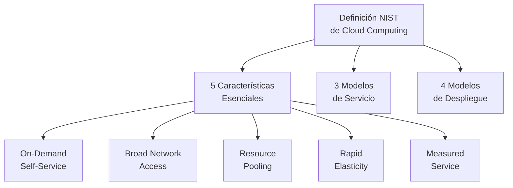
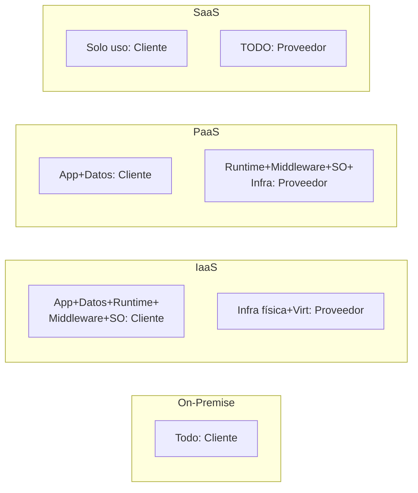
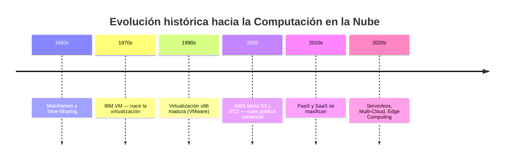
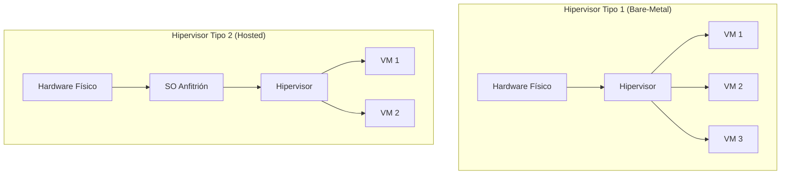
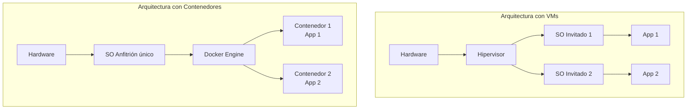
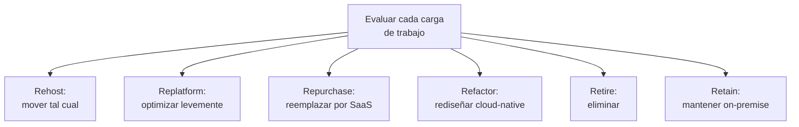
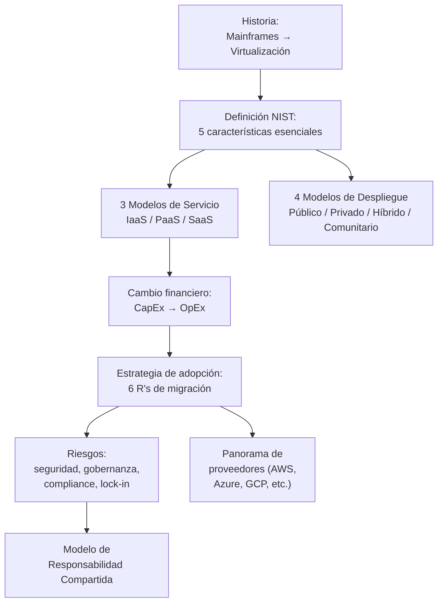

# Supernota: Fundamentos de Computación en la Nube (Cloud Computing)

> [!abstract] Resumen rápido del módulo
> La computación en la nube es la entrega de recursos informáticos **a la carta**, sobre Internet, bajo un modelo de **pago por uso**, con recursos que se asignan y reasignan dinámicamente entre múltiples usuarios y escalan según demanda. Su origen se remonta a los **mainframes de los años 50** y se hizo técnicamente posible gracias a la **virtualización** (años 70-2000s). Adoptarla estratégicamente requiere evaluar necesidades de negocio, viabilidad financiera y tolerancia al riesgo — y el mercado está dominado por un grupo reducido de proveedores (AWS, Azure, GCP, Alibaba Cloud, IBM, Oracle, Salesforce, SAP) que compiten ofreciendo desde infraestructura cruda hasta software completo.

> [!note] Nivel de profundidad de esta nota
> A partir de este módulo, por indicación del usuario, las supernotas incluyen **mayor profundidad técnica** (estándares formales, marcos de la industria, comparativas exhaustivas) pensando en preparación para examen por módulo — no solo una síntesis del resumen, sino el contexto técnico completo que un profesional necesitaría dominar sobre el tema.

---

## Índice de esta supernota
1. [[#1. La definición formal del NIST]]
2. [[#2. Los tres modelos de servicio — IaaS, PaaS, SaaS]]
3. [[#3. Los cuatro modelos de despliegue]]
4. [[#4. Historia — de los mainframes a la nube]]
5. [[#5. Virtualización en profundidad]]
6. [[#6. CapEx vs OpEx — el cambio financiero de fondo]]
7. [[#7. Estrategia de adopción de la nube]]
8. [[#8. Modelo de Responsabilidad Compartida (seguridad)]]
9. [[#9. Riesgos y desafíos de la adopción]]
10. [[#10. Panorama de proveedores de nube]]
11. [[#11. Cómo se conecta todo este módulo]]
12. [[#12. Conceptos complementarios]]
13. [[#13. Preguntas para repasar]]
14. [[#14. Recursos recomendados]]
15. [[#15. Notas relacionadas del vault]]

---

## 1. La definición formal del NIST

La definición más citada e influyente de computación en la nube proviene del **NIST** (National Institute of Standards and Technology, EE.UU.), publicada en el documento **SP 800-145** por Peter Mell y Timothy Grance:

> *"Cloud computing is a model for enabling ubiquitous, convenient, on-demand network access to a shared pool of configurable computing resources (e.g., networks, servers, storage, applications, and services) that can be rapidly provisioned and released with minimal management effort or service provider interaction."*

En español: es un modelo que permite acceso **ubicuo, conveniente y bajo demanda**, a través de la red, a un **conjunto compartido de recursos computacionales configurables** (redes, servidores, almacenamiento, aplicaciones, servicios), que pueden **aprovisionarse y liberarse rápidamente** con mínimo esfuerzo de gestión o interacción con el proveedor.

Esta definición formal se apoya en **tres pilares**: 5 características esenciales, 3 modelos de servicio, y 4 modelos de despliegue. El resumen de la lección solo mencionó algunas de las características esenciales — aquí van **las cinco completas**, que es el marco que normalmente se evalúa en un examen formal sobre el tema.

### Las 5 características esenciales del NIST

| # | Característica | Definición técnica | Analogía |
|---|---|---|---|
| 1 | **On-Demand Self-Service** (Autoservicio bajo demanda) | El usuario puede aprovisionar recursos (cómputo, almacenamiento) automáticamente, sin requerir interacción humana con cada proveedor de servicio | Como un cajero automático: retiras dinero (recursos) cuando lo necesitas, sin hablar con un empleado del banco |
| 2 | **Broad Network Access** (Acceso amplio en red) | Los recursos están disponibles a través de la red y accesibles mediante mecanismos estándar (navegadores, APIs) desde plataformas heterogéneas (móvil, laptop, tablet) | Acceso desde cualquier dispositivo con conexión, no solo desde una terminal física específica |
| 3 | **Resource Pooling** (Agrupación de recursos) | Los recursos computacionales del proveedor se agrupan para servir a **múltiples usuarios** (modelo multiusuario / *multi-tenant*), con recursos físicos y virtuales asignados y reasignados dinámicamente según demanda | Similar a un edificio de departamentos: la infraestructura (agua, electricidad) es compartida entre inquilinos, cada uno paga por su uso |
| 4 | **Rapid Elasticity** (Elasticidad rápida) | La capacidad puede **aprovisionarse y liberarse elásticamente**, en algunos casos automáticamente, para escalar rápido hacia afuera o hacia adentro según la demanda; para el usuario, la capacidad disponible parece **ilimitada** y puede consumirse en cualquier cantidad, en cualquier momento | Una tienda en línea que agrega servidores automáticamente durante el Black Friday, y los libera después |
| 5 | **Measured Service** (Servicio medido) | Los sistemas de la nube controlan y optimizan automáticamente el uso de recursos aprovechando una capacidad de medición (metering) apropiada al tipo de servicio (almacenamiento, procesamiento, ancho de banda, cuentas de usuario activas), proporcionando transparencia tanto al proveedor como al consumidor | Como una factura de servicios públicos (luz, agua): pagas según lo que consumiste, medido con precisión |

> [!important] Matiz sobre "Elasticidad" vs "Escalabilidad"
> Aunque suelen usarse como sinónimos, técnicamente son distintos: **Escalabilidad** es la *capacidad* de un sistema de crecer para manejar más carga (puede requerir planificación, no necesariamente automática). **Elasticidad** es la capacidad de crecer **y encogerse automáticamente y en tiempo casi real** según la demanda actual, sin intervención manual — la elasticidad es una forma más dinámica y automatizada de escalabilidad, y es la característica que el NIST formaliza como esencial para la nube.



---

## 2. Los tres modelos de servicio — IaaS, PaaS, SaaS

El resumen menciona SaaS y "plataformas de desarrollo" (PaaS) de pasada, pero este es uno de los marcos más importantes (y más evaluados en exámenes) del tema — merece desarrollo completo, incluyendo **qué capas de la pila tecnológica gestiona el proveedor vs el cliente** en cada modelo.

### 2.1 La pila tecnológica completa (referencia)
Para entender los modelos de servicio, primero hay que ver todas las capas que existen entre "el hardware físico" y "la aplicación que usa el usuario final":

```
Aplicaciones
Datos
Runtime (entorno de ejecución)
Middleware
Sistema Operativo
Virtualización
Servidores (hardware)
Almacenamiento
Redes
```

### 2.2 IaaS — Infrastructure as a Service
El proveedor gestiona **solo la infraestructura física** (servidores, almacenamiento, redes, virtualización). El cliente gestiona todo lo demás: sistema operativo, middleware, runtime, datos y aplicaciones.

- **Ejemplos**: AWS EC2, Google Compute Engine, Azure Virtual Machines.
- **Análogo**: alquilar un terreno vacío — tú construyes la casa desde los cimientos.
- **Casos de uso típicos**: migración de infraestructura on-premise existente ("lift and shift"), control granular sobre el entorno, cargas de trabajo con requisitos de configuración muy específicos.

### 2.3 PaaS — Platform as a Service
El proveedor gestiona la infraestructura **y** el sistema operativo, middleware y runtime. El cliente solo gestiona sus **datos y aplicaciones** — se enfoca en escribir código, no en administrar servidores.

- **Ejemplos**: Google App Engine, AWS Elastic Beanstalk, Azure App Service, Heroku.
- **Análogo**: alquilar un departamento amueblado — solo traes tus pertenencias (tu código).
- **Casos de uso típicos**: desarrollo rápido de aplicaciones sin preocuparse por parches de SO, escalado automático de infraestructura de ejecución.

### 2.4 SaaS — Software as a Service
El proveedor gestiona **absolutamente todo**, incluida la aplicación completa. El cliente solo **usa** el software a través de un navegador o cliente ligero, normalmente con una suscripción.

- **Ejemplos**: Gmail, Salesforce, Microsoft 365, Slack.
- **Análogo**: quedarse en un hotel — todo está listo, tú solo llegas y lo usas.
- **Casos de uso típicos**: herramientas de productividad, CRM, colaboración — funcionalidad de negocio lista para usar sin desarrollo propio.

### 2.5 Tabla comparativa de responsabilidad de gestión

| Capa | On-Premise (tradicional) | IaaS | PaaS | SaaS |
|---|---|---|---|---|
| Aplicaciones | Cliente | Cliente | Cliente | **Proveedor** |
| Datos | Cliente | Cliente | Cliente | Cliente* |
| Runtime | Cliente | Cliente | **Proveedor** | Proveedor |
| Middleware | Cliente | Cliente | **Proveedor** | Proveedor |
| Sistema Operativo | Cliente | Cliente | **Proveedor** | Proveedor |
| Virtualización | Cliente | **Proveedor** | Proveedor | Proveedor |
| Servidores | Cliente | **Proveedor** | Proveedor | Proveedor |
| Almacenamiento | Cliente | **Proveedor** | Proveedor | Proveedor |
| Redes | Cliente | **Proveedor** | Proveedor | Proveedor |

*En SaaS, el cliente es dueño de sus datos, pero el proveedor los almacena y gestiona técnicamente.



> [!tip] Regla mnemotécnica
> A medida que se avanza de IaaS → PaaS → SaaS, el cliente **cede control técnico a cambio de menor esfuerzo operativo**. IaaS da más control pero más responsabilidad; SaaS da menos control pero mínima carga operativa. No existe una opción "mejor" en abstracto — depende de cuánto control técnico necesita el caso de uso frente a cuánta velocidad/simplicidad se prioriza.

### 2.6 Modelos adicionales (mención breve, útil para completar el panorama)
- **FaaS (Function as a Service)** / *Serverless*: el proveedor gestiona toda la infraestructura, incluso el runtime específico de cada ejecución; el cliente solo despliega funciones individuales que se ejecutan bajo demanda y se facturan por invocación/tiempo de ejecución (ej. AWS Lambda, Google Cloud Functions).
- **CaaS (Containers as a Service)**: el proveedor gestiona la orquestación de contenedores (ver [[IaC - Infraestructura Efimera y Entrega Inmutable]]), el cliente gestiona las imágenes de contenedor (ej. AWS Fargate, Google Cloud Run).

---

## 3. Los cuatro modelos de despliegue

El segundo pilar formal del NIST, no mencionado explícitamente en el resumen pero esencial para el marco completo:

| Modelo | Descripción | Ejemplo de uso |
|---|---|---|
| **Nube Pública** | Infraestructura provista para uso abierto por el público general; propiedad, gestión y operación de un proveedor de nube (AWS, Azure, GCP) | Startups, aplicaciones que necesitan escalar rápido sin inversión de capital inicial |
| **Nube Privada** | Infraestructura provista para uso exclusivo de una sola organización; puede estar gestionada por la propia organización o un tercero, on-premise o fuera de ella | Bancos, gobierno, industrias con requisitos regulatorios estrictos que requieren control total |
| **Nube Híbrida** | Combinación de dos o más infraestructuras de nube (privada, pública, comunitaria) que permanecen entidades separadas pero están unidas por tecnología que permite portabilidad de datos y aplicaciones entre ellas | Empresas que mantienen datos sensibles en nube privada pero usan nube pública para cargas de trabajo variables (*cloud bursting*) |
| **Nube Comunitaria** | Infraestructura provista para uso exclusivo de una comunidad específica de consumidores de organizaciones con intereses compartidos (misión, requisitos de seguridad, políticas, cumplimiento) | Consorcios de hospitales, agencias gubernamentales de un mismo sector con regulaciones compartidas |

> [!note] Multi-Cloud (mención adicional, término moderno no formalizado por el NIST en 2011)
> Estrategia donde una organización usa **múltiples proveedores de nube pública simultáneamente** (ej. parte de la infraestructura en AWS, parte en GCP) — distinto de nube híbrida (que combina nube privada + pública). Se usa para evitar dependencia de un solo proveedor (*vendor lock-in*, ver sección 9) o aprovechar fortalezas específicas de cada proveedor.

---

## 4. Historia — de los mainframes a la nube

### 4.1 Años 1950: Mainframes y Time-Sharing
- Las computadoras eran máquinas enormes, extremadamente costosas, propiedad casi exclusiva de gobiernos y grandes corporaciones.
- Se accedía a ellas mediante **terminales simples** (sin capacidad de procesamiento propia) conectadas al mainframe central.
- Surgió el concepto de **Time-Sharing (tiempo compartido)**: múltiples usuarios accedían a la misma capacidad computacional del mainframe, turnándose fracciones de tiempo de procesamiento — la **primera forma histórica** de "compartir recursos computacionales entre múltiples usuarios", precursora directa del concepto moderno de *Resource Pooling*.

### 4.2 Años 1970: Virtual Machine (VM) de IBM
- IBM introdujo el sistema operativo **VM** (Virtual Machine), que permitía crear **múltiples máquinas virtuales** sobre un mismo hardware físico.
- Cada máquina virtual funcionaba de forma **aislada e independiente**, aunque compartiera recursos físicos subyacentes con las demás — el nacimiento formal de la **virtualización** tal como se entiende hoy.

### 4.3 Década de 2000: Maduración y nacimiento comercial de "la nube"
- La mejora continua de las tecnologías de virtualización, redes de banda ancha y capacidad de procesamiento permitió ofrecer recursos computacionales **de forma instantánea y remota**, ya no solo dentro de una misma organización.
- **2006** es comúnmente citado como el año simbólico de nacimiento de la nube comercial moderna: **Amazon lanza AWS** (comenzando con S3 y EC2), ofreciendo infraestructura como servicio al público general por primera vez a gran escala.
- Se consolida el modelo **pay-as-you-go** (pago por uso), que es el puente directo entre la tecnología de virtualización y el modelo de negocio de la nube actual.



> [!important] La relación causal completa
> El resumen simplifica correctamente la cadena: **Time-Sharing** (compartir capacidad de un mainframe) → **Virtualización/Hipervisores** (dividir un servidor físico en muchos virtuales, aislados y seguros) → **Nube** (ofrecer esos recursos virtualizados de forma remota, bajo demanda, con facturación por uso). Cada etapa resuelve una limitación técnica de la etapa anterior, y sin la virtualización específicamente, el modelo de *Resource Pooling* multiusuario de la nube moderna no sería técnicamente viable ni seguro.

---

## 5. Virtualización en profundidad

### 5.1 ¿Qué resuelve la virtualización?
Antes de la virtualización, cada servidor físico ejecutaba **un solo sistema operativo y una sola aplicación**, desperdiciando la mayor parte de su capacidad de cómputo la mayor parte del tiempo (un servidor dedicado a una app de bajo tráfico podía usar 5-10% de su capacidad real).

La virtualización permite **dividir un servidor físico en múltiples servidores virtuales**, cada uno con su propio sistema operativo, aislado de los demás, pero compartiendo el mismo hardware subyacente — maximizando la utilización de los recursos físicos disponibles.

### 5.2 El Hipervisor
El **hipervisor** (también llamado *Virtual Machine Monitor*, VMM) es la capa de software que crea y gestiona las máquinas virtuales, asignándoles recursos físicos (CPU, RAM, almacenamiento, red) de forma controlada, y garantizando el **aislamiento** entre ellas — una VM no debería poder acceder ni afectar a otra VM en el mismo hardware.

**Tipos de hipervisor:**

| Tipo | Dónde corre | Ejemplos | Características |
|---|---|---|---|
| **Tipo 1 (Bare-Metal)** | Directamente sobre el hardware físico, sin sistema operativo anfitrión de por medio | VMware ESXi, Microsoft Hyper-V, Xen, KVM | Mayor rendimiento y seguridad; es el tipo usado en centros de datos y proveedores de nube |
| **Tipo 2 (Hosted)** | Sobre un sistema operativo anfitrión existente, como una aplicación más | VMware Workstation, Oracle VirtualBox, Parallels | Más fácil de instalar/usar en una laptop personal; menor rendimiento (una capa adicional de overhead) |



### 5.3 Máquinas Virtuales vs Contenedores — diferencia clave
Ya se introdujo Docker/contenedores en [[IaC - Infraestructura Efimera y Entrega Inmutable]] — vale la pena precisar formalmente la diferencia con las VMs, porque suelen confundirse:

| | **Máquina Virtual (VM)** | **Contenedor** |
|---|---|---|
| Qué virtualiza | El **hardware completo** — cada VM incluye su propio SO completo (kernel incluido) | El **sistema operativo** — los contenedores comparten el kernel del SO anfitrión |
| Peso / tamaño | Pesado (GBs) — incluye un SO entero | Ligero (MBs) — solo la aplicación y sus dependencias |
| Tiempo de arranque | Minutos (arranca un SO completo) | Segundos (o menos — no arranca un SO nuevo) |
| Aislamiento | Muy fuerte (a nivel de hardware virtualizado) | Más ligero (a nivel de proceso del SO, con namespaces/cgroups en Linux) |
| Capa que gestiona | Hipervisor | Motor de contenedores (ej. Docker Engine) |



> [!tip] No son excluyentes
> En la práctica, la mayoría de la infraestructura cloud moderna usa **ambas capas a la vez**: los proveedores de nube ejecutan VMs (vía hipervisores Tipo 1) sobre su hardware físico para dar aislamiento fuerte entre distintos clientes (*multi-tenancy* seguro), y **dentro** de esas VMs corren contenedores (orquestados por Kubernetes) para desplegar aplicaciones de forma ligera y eficiente — ver [[Microservicios Nativos en la Nube]].

---

## 6. CapEx vs OpEx — el cambio financiero de fondo

Este es uno de los cambios más importantes que habilita la nube, y merece explicación financiera precisa:

| | **CapEx (Capital Expenditure)** | **OpEx (Operational Expenditure)** |
|---|---|---|
| Qué es | Gasto de **capital**: inversión grande, por adelantado, en activos de larga duración (comprar servidores físicos) | Gasto **operativo**: pago recurrente y variable por servicios consumidos (suscripción a la nube) |
| Modelo contable | Se deprecia a lo largo de varios años en los libros contables | Se registra como gasto del periodo en que ocurre |
| Riesgo financiero | Alto: se paga por capacidad *máxima estimada*, se use o no completamente | Bajo: se paga solo por lo que efectivamente se usa (Measured Service, sección 1) |
| Flexibilidad | Baja: cambiar de capacidad requiere nueva inversión y tiempo de aprovisionamiento físico | Alta: se ajusta hacia arriba o abajo casi en tiempo real (Rapid Elasticity) |
| Ejemplo | Comprar un servidor físico de $50,000 que dure 5 años | Pagar $500/mes por instancias en la nube, ajustables mes a mes |

> [!important] Por qué esto es tan relevante para pequeñas empresas
> Antes de la nube, competir con una gran corporación en capacidad de cómputo requería un capital inicial enorme (CapEx) — una barrera de entrada real. El modelo OpEx de la nube permite que **empresas pequeñas accedan a capacidades de cómputo de alto rendimiento** sin esa inversión inicial, pagando solo conforme crecen — democratizando el acceso a infraestructura de clase mundial, tal como menciona el resumen ("acelerar la innovación").

---

## 7. Estrategia de adopción de la nube

### 7.1 Consideraciones clave antes de migrar (según el resumen)
- **Evaluar infraestructura y cargas de trabajo actuales**: no todas las aplicaciones existentes son igual de "aptas" para migrar tal cual — algunas requieren rediseño, otras pueden moverse casi sin cambios.
- **Analizar costos**: comparar el TCO (*Total Cost of Ownership*) actual on-premise contra el costo proyectado en la nube, considerando no solo cómputo sino soporte, mantenimiento, personal.
- **Explorar SaaS y plataformas de desarrollo (PaaS)**: en vez de asumir que todo debe migrarse como IaaS, evaluar si funcionalidades completas pueden reemplazarse directamente por soluciones SaaS existentes (mayor productividad, menor tiempo de implementación).

### 7.2 El marco de las "6 R" de migración a la nube
Marco ampliamente usado en la industria (popularizado por Gartner/AWS) para clasificar la estrategia de migración de **cada carga de trabajo individual** — no toda la organización migra de la misma forma:

| Estrategia | Qué implica | Cuándo usarla |
|---|---|---|
| **Rehost** ("Lift and Shift") | Mover la aplicación tal cual, sin modificaciones, a infraestructura IaaS en la nube | Migración rápida, cargas simples, poco tiempo/presupuesto para rediseñar |
| **Replatform** ("Lift, Tinker and Shift") | Migrar con optimizaciones menores (ej. cambiar la base de datos por una gestionada) sin cambiar la arquitectura central | Se busca algún beneficio cloud-native sin una reescritura completa |
| **Repurchase** | Reemplazar la aplicación existente por un producto SaaS equivalente | Cuando existe una solución SaaS madura que cubre la misma necesidad (ej. reemplazar un CRM propio por Salesforce) |
| **Refactor / Re-architect** | Rediseñar la aplicación para aprovechar completamente capacidades cloud-native (microservicios, serverless — ver [[Microservicios Nativos en la Nube]]) | Aplicaciones estratégicas de largo plazo, donde vale la pena la inversión de rediseño |
| **Retire** | Eliminar aplicaciones que ya no aportan valor y no necesitan migrarse | Auditoría de infraestructura revela sistemas obsoletos o redundantes |
| **Retain** | Mantener la aplicación donde está (on-premise), sin migrar por ahora | Restricciones regulatorias, dependencias técnicas complejas, o simplemente no es prioritario aún |



> [!tip] No existe "una" estrategia de adopción
> El resumen enfatiza que cada organización necesita una estrategia **única**. En la práctica, una migración real casi siempre combina varias de las 6 R al mismo tiempo: algunas cargas se rehostean rápido, otras se reemplazan por SaaS, las más críticas se refactorizan con calma, y algunas simplemente se retienen por ahora.

---

## 8. Modelo de Responsabilidad Compartida (seguridad)

Concepto técnico fundamental, no mencionado explícitamente en el resumen pero indispensable para entender seguridad en la nube — y frecuente en exámenes sobre el tema.

> [!important] La idea central
> En la nube, la seguridad **nunca es responsabilidad exclusiva del proveedor ni del cliente** — se divide según el modelo de servicio (sección 2). El proveedor es responsable de la seguridad **"de" la nube** (la infraestructura física, la virtualización); el cliente es responsable de la seguridad **"en" la nube** (sus datos, configuraciones, control de acceso).

| Responsabilidad | IaaS | PaaS | SaaS |
|---|---|---|---|
| Seguridad física del datacenter | Proveedor | Proveedor | Proveedor |
| Seguridad de la red/virtualización | Proveedor | Proveedor | Proveedor |
| Parches del sistema operativo | **Cliente** | Proveedor | Proveedor |
| Configuración de la aplicación | Cliente | Cliente | Proveedor |
| Gestión de identidad y accesos (IAM) | **Cliente** | **Cliente** | **Cliente** (siempre) |
| Clasificación y protección de datos | **Cliente** (siempre) | **Cliente** (siempre) | **Cliente** (siempre) |

> [!warning] Error común y costoso
> Una de las causas más frecuentes de brechas de seguridad en la nube es asumir incorrectamente que "el proveedor ya se encarga de todo" — la gestión de identidades, permisos y configuración de acceso a los datos **siempre** es responsabilidad del cliente, sin importar el modelo de servicio.

---

## 9. Riesgos y desafíos de la adopción

Ampliando lo mencionado en el resumen:

### 9.1 Seguridad de datos
Ver Modelo de Responsabilidad Compartida (sección 8) — el riesgo de que datos sensibles queden expuestos por mala configuración (no por fallo del proveedor).

### 9.2 Gobernanza (Governance)
Necesidad de políticas internas claras sobre **quién puede aprovisionar qué recursos**, con qué presupuesto, y bajo qué estándares — sin gobernanza, la facilidad de autoservicio (característica esencial #1 del NIST) puede derivar en gasto descontrolado ("Shadow IT": equipos contratando servicios cloud sin supervisión central) o configuraciones inconsistentes/inseguras.

### 9.3 Cumplimiento legal (Compliance)
Regulaciones como **GDPR** (Europa), **HIPAA** (salud, EE.UU.) o leyes locales de protección de datos pueden restringir **en qué región geográfica** físicamente deben almacenarse ciertos datos — relevante al elegir proveedor y región de datacenter.

### 9.4 Continuidad del negocio (Business Continuity)
Depender de un proveedor externo introduce el riesgo de interrupciones fuera del control directo de la organización (caídas del proveedor, aunque infrecuentes) — mitigado con arquitecturas multi-región/multi-zona y los patrones de [[Resiliencia y Diseño para el Fallo]].

### 9.5 Vendor Lock-in (dependencia del proveedor)
Riesgo de que una aplicación quede tan integrada a servicios propietarios de un proveedor específico (ej. APIs propietarias, formatos de base de datos específicos) que migrar a otro proveedor en el futuro se vuelva costoso o técnicamente muy complejo — una de las razones detrás de estrategias **multi-cloud** (sección 3) y del uso de estándares abiertos/contenedores (que son portables entre proveedores, ver [[IaC - Infraestructura Efimera y Entrega Inmutable]]).

---

## 10. Panorama de proveedores de nube

### 10.1 Contexto de mercado
Según la lección, se proyecta que el gasto mundial en nube pública **crezca 20.7%, alcanzando los 591.8 mil millones de dólares** — superando el gasto en soluciones tradicionales de TI. Esto confirma que la pregunta estratégica para las empresas ya no es *"¿deberíamos usar la nube?"* sino ***"¿cómo la adoptamos de forma correcta?"*** — coherente con el enfoque de la sección 7.

### 10.2 Comparativa de proveedores principales

| Proveedor | Origen / Fortaleza distintiva | Enfoque principal |
|---|---|---|
| **Amazon Web Services (AWS)** | Pionero comercial (2006); catálogo de servicios más extenso del mercado | IaaS y PaaS con modelo pay-as-you-go muy maduro |
| **Microsoft Azure** | Fuerte integración con el ecosistema empresarial Microsoft (Windows Server, Active Directory, Office 365) | Plataforma flexible, presencia global, soporte multi-lenguaje |
| **Google Cloud Platform (GCP)** | Construida sobre la misma infraestructura que usa Google internamente | IaaS, PaaS y fuerte enfoque en *serverless* y datos/IA |
| **Alibaba Cloud** | Mayor proveedor de origen chino | Fuerte en e-commerce y el ecosistema del grupo Alibaba |
| **IBM Cloud** | Adquisición de Red Hat reforzó su enfoque | Nube híbrida y tecnologías emergentes (IA empresarial) |
| **Oracle Cloud** | Fuerte legado en bases de datos empresariales | SaaS y bases de datos, con oferta de infraestructura creciente |
| **Salesforce** | Pionero histórico del modelo SaaS | CRM — nubes especializadas en ventas, servicio y marketing |
| **SAP** | Fuerte legado en software empresarial (ERP) | ERP, CRM en la nube y plataforma para apps empresariales |

> [!tip] Cómo leer esta tabla para un examen
> No memorices solo nombres — entiende el **patrón**: los "tres grandes" generalistas de infraestructura (AWS, Azure, GCP) compiten principalmente en IaaS/PaaS con catálogos amplios; los proveedores más especializados (Salesforce, SAP, Oracle) tienden a dominar en SaaS dentro de un nicho específico (CRM, ERP, bases de datos) — reflejando exactamente los 3 modelos de servicio de la sección 2.

---

## 11. Cómo se conecta todo este módulo



**La narrativa completa del módulo:**
> La virtualización (nacida en los mainframes de los 50-70) hizo técnicamente posible que un proveedor ofreciera recursos computacionales compartidos, bajo demanda y medidos con precisión — lo que el NIST formalizó como las 5 características esenciales de la nube. Esto se ofrece en distintos niveles de abstracción (IaaS/PaaS/SaaS) y distintos modelos de despliegue, habilitando un cambio financiero radical (CapEx → OpEx) que democratiza el acceso a infraestructura de alto rendimiento. Adoptarla bien requiere una estrategia deliberada (6 R's) que sopese beneficios contra riesgos reales de seguridad y dependencia del proveedor — todo dentro de un mercado dominado por un puñado de grandes proveedores con fortalezas distintas.

---

## 12. Conceptos complementarios (no cubiertos en los resúmenes originales)

### 12.1 Edge Computing
Modelo complementario (no sustituto) de la nube centralizada: procesa datos **cerca de donde se generan** (dispositivos IoT, sensores, terminales locales) en vez de enviarlos siempre a un datacenter centralizado — reduce latencia para casos de uso donde milisegundos importan (vehículos autónomos, manufactura en tiempo real).

### 12.2 Region y Availability Zone (AZ)
Los proveedores de nube organizan su infraestructura física en **Regiones** (áreas geográficas amplias, ej. "este de EE.UU.") compuestas de múltiples **Zonas de Disponibilidad** (datacenters físicamente separados dentro de la misma región, con energía/red independientes) — permite diseñar arquitecturas resilientes a fallos de un datacenter individual, conectando con [[Resiliencia y Diseño para el Fallo]].

### 12.3 Cloud Bursting
Técnica de nube híbrida donde una aplicación corre normalmente en infraestructura privada, pero **"desborda" (bursts)** temporalmente hacia la nube pública cuando la demanda excede la capacidad local (ej. picos de tráfico estacionales) — combina lo mejor de ambos modelos de despliegue.

### 12.4 Well-Architected Framework
Marco de referencia (popularizado por AWS, con equivalentes en Azure y GCP) que define pilares para diseñar buenas arquitecturas en la nube: **excelencia operacional, seguridad, confiabilidad, eficiencia de rendimiento, optimización de costos** (y sostenibilidad en versiones más recientes) — útil como checklist al evaluar si una arquitectura cloud está bien diseñada.

---

## 13. Preguntas para repasar (auto-evaluación)

- [ ] ¿Puedes nombrar y explicar las 5 características esenciales del NIST sin ver la tabla?
- [ ] ¿Cuál es la diferencia exacta entre IaaS, PaaS y SaaS en términos de qué gestiona el proveedor vs el cliente?
- [ ] ¿Qué diferencia hay entre nube híbrida y estrategia multi-cloud?
- [ ] ¿Cómo se relacionan el Time-Sharing de los mainframes de 1950 con el Resource Pooling moderno?
- [ ] ¿Qué diferencia hay entre un hipervisor Tipo 1 y Tipo 2?
- [ ] ¿Por qué una VM es más "pesada" que un contenedor, técnicamente?
- [ ] ¿Cómo explicarías el cambio de CapEx a OpEx a alguien sin formación financiera?
- [ ] ¿Cuáles son las 6 R's de migración a la nube, y cuándo usarías cada una?
- [ ] ¿Qué es el Modelo de Responsabilidad Compartida, y por qué la gestión de identidades siempre es responsabilidad del cliente?
- [ ] ¿Qué es el vendor lock-in y cómo se mitiga?

---

## 14. Recursos recomendados para profundizar

- 📄 [NIST SP 800-145 — The NIST Definition of Cloud Computing](https://nvlpubs.nist.gov/nistpubs/Legacy/SP/nistspecialpublication800-145.pdf) — el documento oficial original, lectura obligada para dominar este tema a fondo.
- 🌐 [AWS — 6 Strategies for Migrating Applications to the Cloud](https://aws.amazon.com/blogs/enterprise-strategy/6-strategies-for-migrating-applications-to-the-cloud/) — artículo original que popularizó las "6 R's".
- 🌐 [AWS Well-Architected Framework](https://aws.amazon.com/architecture/well-architected/)
- 🌐 [AWS Shared Responsibility Model](https://aws.amazon.com/compliance/shared-responsibility-model/)
- 📘 *Cloud Computing: Concepts, Technology & Architecture* — Thomas Erl (referencia académica completa del tema).

---

## 15. Notas relacionadas del vault
- [[Microservicios Nativos en la Nube]]
- [[IaC - Infraestructura Efimera y Entrega Inmutable]]
- [[Resiliencia y Diseño para el Fallo]]
- [[CI-CD Pipeline]]
- [[Supernota - Metricas, Cultura y SRE]]
- [[Ops Tradicional vs DevOps]]

---
#devops #cloud-computing #nist #virtualizacion #iaas #paas #saas
