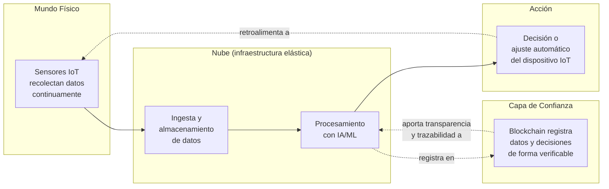
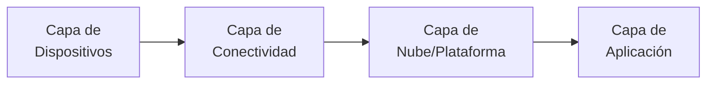
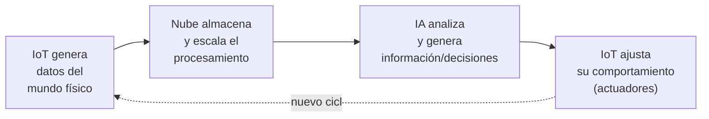
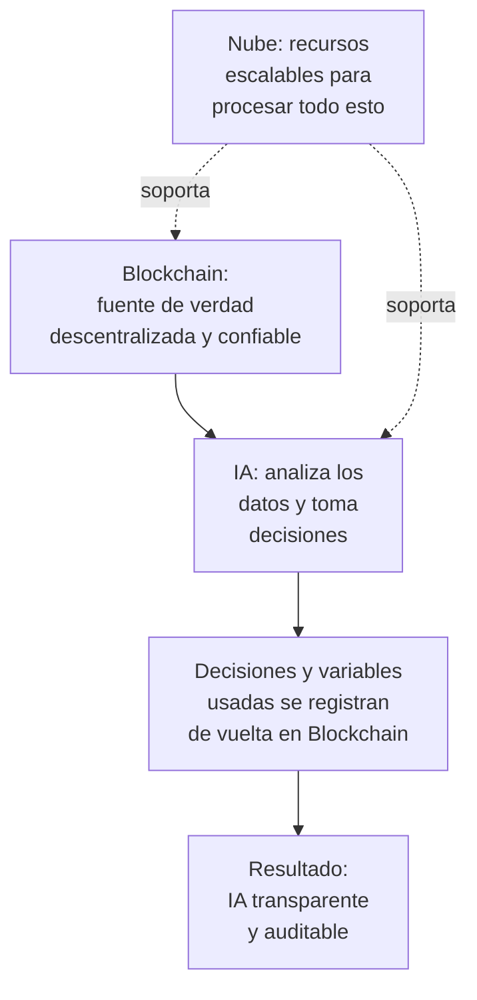
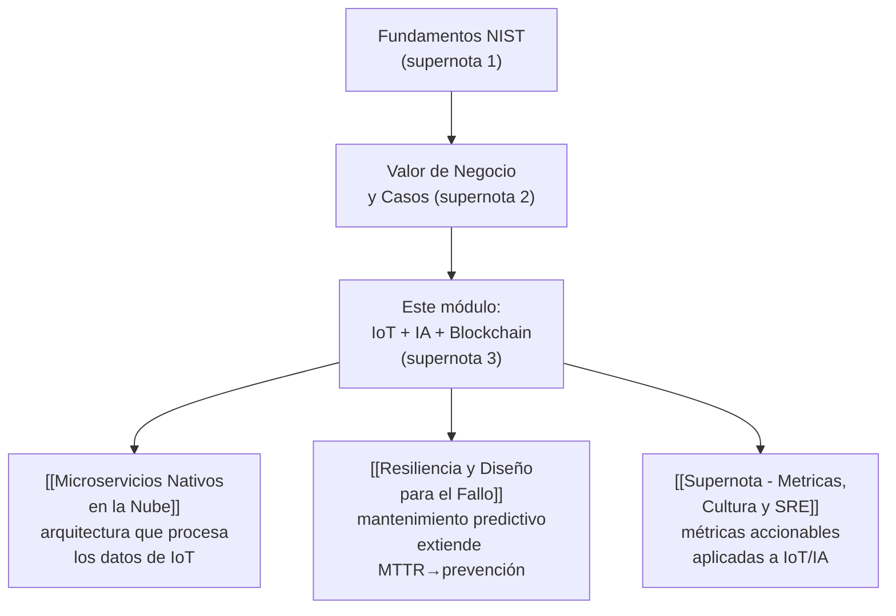

# Supernota: Tecnologías Emergentes Aceleradas por la Nube (IoT, IA y Blockchain)

> [!abstract] Resumen rápido del módulo
> La nube actúa como el **sistema nervioso central** que conecta tres tecnologías emergentes que, por separado, tendrían un alcance mucho más limitado: **IoT** (recolecta datos masivos del mundo físico), **IA** (procesa esos datos para generar información útil y decisiones), y **Blockchain** (aporta transparencia, trazabilidad y confianza verificable sobre esos datos y decisiones). Las tres forman un **ecosistema simbiótico**, no tecnologías aisladas — y la nube es la infraestructura elástica y escalable que hace viable, técnica y económicamente, que trabajen juntas a gran escala.

> [!note] Nivel de profundidad
> Se mantiene el estándar técnico profundo del módulo anterior. Se incorpora además el **glosario oficial de términos** provisto en el material original, ampliado con definiciones técnicas donde el resumen las da de forma muy breve (ej. POP, Hipervisor).

---

## Índice de esta supernota
1. [[#1. El ecosistema completo — cómo encajan IoT, IA, Blockchain y Nube]]
2. [[#2. Internet de las Cosas (IoT) y la Nube]]
3. [[#3. La relación simbiótica IA + IoT + Nube]]
4. [[#4. Blockchain, IA y Nube]]
5. [[#5. Glosario oficial del módulo (ampliado)]]
6. [[#6. Conceptos complementarios]]
7. [[#7. Cómo se conecta este módulo con el resto del vault]]
8. [[#8. Preguntas para repasar]]
9. [[#9. Recursos recomendados]]
10. [[#10. Notas relacionadas del vault]]

---

## 1. El ecosistema completo — cómo encajan IoT, IA, Blockchain y Nube

Antes de entrar en cada tecnología por separado, es útil ver el **flujo completo** que las conecta, porque los tres bloques de esta lección son en realidad **una sola cadena de valor**, no tres temas independientes:

**La lógica del ecosistema, en una frase:**
> IoT **genera** los datos del mundo físico → la Nube **almacena y escala** el procesamiento de esos datos → la IA **interpreta** los datos y genera decisiones → Blockchain **verifica y hace trazable** tanto los datos como las decisiones tomadas sobre ellos → y el ciclo se retroalimenta cuando esas decisiones ajustan el comportamiento de los propios dispositivos IoT.

---

## 2. Internet de las Cosas (IoT) y la Nube

### 2.1 ¿Qué es IoT, con precisión técnica?
IoT es una **red masiva de dispositivos físicos** (sensores, actuadores, wearables, maquinaria industrial) **y personas conectadas**, que recolectan datos de forma continua sobre el mundo físico — temperatura, ubicación, movimiento, signos vitales, consumo energético, etc. — y los transmiten a través de una red para su procesamiento.

Estos dispositivos afectan directamente aspectos cotidianos: **salud** (wearables que monitorean signos vitales), **compras** (sensores de inventario, pagos sin contacto), **energía** (medidores inteligentes que optimizan consumo).

### 2.2 La arquitectura típica de una solución IoT (4 capas)
El resumen menciona el rol de la nube como "punto central", pero vale la pena formalizar la arquitectura completa, ya que es un marco estándar de la industria:

| Capa | Función | Ejemplo |
|---|---|---|
| **1. Capa de Dispositivos (Device Layer)** | Sensores y actuadores físicos que recolectan datos o ejecutan acciones | Un collar GPS en un antílope, un sensor de temperatura industrial |
| **2. Capa de Conectividad (Connectivity/Gateway Layer)** | Transmite los datos del dispositivo hacia la red — puede incluir un *gateway* que agrega datos de múltiples sensores antes de enviarlos | Redes celulares (4G/5G), LPWAN (LoRaWAN), Wi-Fi, Bluetooth |
| **3. Capa de Nube/Plataforma (Cloud/Platform Layer)** | Registra dispositivos, almacena datos, los procesa (incluyendo IA) y expone la información a aplicaciones empresariales | AWS IoT Core, Azure IoT Hub, Google Cloud IoT |
| **4. Capa de Aplicación (Application Layer)** | Interfaces y sistemas donde humanos o procesos de negocio consumen la información generada | Dashboards, alertas automáticas, sistemas de mantenimiento predictivo |

### 2.3 El rol específico de la nube en IoT
Según el resumen, la nube cumple varias funciones críticas simultáneamente:

- **Registro central de dispositivos**: mantiene un inventario de qué dispositivos existen, su identidad y su estado — indispensable cuando se gestionan miles o millones de dispositivos.
- **Almacenamiento de datos**: los volúmenes generados por sensores IoT operando continuamente son masivos (conectar con los **163 zettabytes proyectados para 2025**, ver [[Supernota - Valor de Negocio de la Nube y Casos de Estudio]]) — solo almacenamiento elástico en la nube es económicamente viable a esa escala.
- **Acceso a información empresarial**: expone los datos procesados de forma que sistemas de negocio puedan consumirlos.
- **Gestión de dispositivos en movimiento**: crítico para casos de uso donde los dispositivos no están en una ubicación fija (vehículos, animales con GPS, dispositivos portátiles) — requiere que la conectividad y el registro de identidad funcionen sin importar la ubicación geográfica del dispositivo.
- **Plataformas y servicios especializados**: los principales proveedores ofrecen servicios IoT dedicados (AWS IoT, Azure IoT Hub) que aceleran el desarrollo, evitando construir desde cero la infraestructura de ingesta, autenticación y gestión de dispositivos.

### 2.4 Por qué la latencia importa tanto en IoT
El resumen señala que los dispositivos IoT generan grandes volúmenes de datos que **requieren procesamiento eficiente para minimizar la latencia**. Esto no es un detalle menor: muchos casos de uso IoT son de **tiempo crítico** — una alerta de intrusión, una lectura anómala de un sensor de seguridad industrial, un signo vital fuera de rango, todos requieren respuesta casi inmediata, no procesamiento por lotes horas después.

> [!tip] Conexión con Edge Computing
> Este es exactamente el problema que resuelve el **Edge Computing**, ya mencionado en [[Supernota - Fundamentos de Cloud Computing]]: procesar datos **cerca del dispositivo** (en el propio gateway o en infraestructura local) para las decisiones más urgentes, mientras la nube centralizada se usa para análisis más profundo y almacenamiento a largo plazo — un patrón híbrido edge+cloud muy común en arquitecturas IoT reales.

### 2.5 Caso práctico: protección de rinocerontes en Sudáfrica

**El problema**: la caza furtiva de rinocerontes es difícil de prevenir porque los guardabosques no pueden vigilar físicamente áreas de conservación enormes las 24 horas.

**La solución técnica**: en vez de poner sensores directamente en los rinocerontes (invasivo y de alto riesgo), se colocan **sensores IoT en animales "centinela"** como cebras y antílopes — especies que conviven en el mismo territorio y **reaccionan de forma predecible** ante la presencia de humanos/cazadores furtivos (huyen, cambian patrones de movimiento). Estos sensores:

1. Recolectan datos de movimiento y ubicación de forma continua (**Capa de Dispositivos**).
2. Transmiten esos datos a través de redes disponibles en zonas remotas (**Capa de Conectividad**).
3. La nube procesa los patrones de movimiento en busca de **anomalías** que sugieran presencia humana no autorizada (**Capa de Nube/Plataforma** — aquí es donde entraría IA para detectar el patrón, conectando con la sección 3).
4. Se genera una **alerta en tiempo real a los guardabosques** (**Capa de Aplicación**), permitiendo una respuesta rápida antes de que ocurra el daño.

> [!important] Por qué este caso ilustra bien el módulo completo
> Es un ejemplo perfecto de **cómputo en tiempo real sobre datos del mundo físico** (30% de los datos proyectados para 2025 serán en tiempo real, ver [[Supernota - Valor de Negocio de la Nube y Casos de Estudio]]) resolviendo un problema real y de alto impacto (conservación de especies en peligro) — mostrando que el valor de estas tecnologías no es solo comercial, también social/ambiental.

---

## 3. La relación simbiótica IA + IoT + Nube

### 3.1 El ciclo simbiótico
El resumen describe una relación de **triple retroalimentación**:

1. **IoT genera datos** → sensores recolectan información continuamente del entorno.
2. **IA procesa esos datos** → analiza los datos generados por IoT para extraer información útil, patrones o predicciones.
3. **IoT se ajusta según las respuestas de la IA** → los dispositivos (actuadores) cambian su comportamiento según lo que la IA determina.
4. La **nube** provee la escalabilidad y potencia de cómputo que hace posible que este ciclo funcione a gran volumen y velocidad.

> [!important] Por qué es "simbiótica" y no solo secuencial
> No es un flujo de una sola dirección (IoT → IA → fin). Es un **ciclo cerrado**: la IA no solo "lee" los datos de IoT, sino que sus conclusiones **modifican activamente** el comportamiento futuro de los propios dispositivos IoT — como un termostato inteligente que aprende patrones de uso (IA) y ajusta automáticamente la temperatura (actuador IoT) sin intervención humana repetida.

### 3.2 Caso práctico: US Open y IBM Cloud

**El desafío técnico**: durante el torneo de tenis US Open, el tráfico web se dispara masivamente en periodos muy concentrados de tiempo (partidos en vivo, momentos decisivos) — un patrón clásico de demanda **elástica e impredecible**, exactamente el tipo de carga para el que la nube está diseñada (Rapid Elasticity, ver [[Supernota - Fundamentos de Cloud Computing]]).

**La solución de IBM**: usa infraestructura en la nube para absorber ese aumento masivo de tráfico sin degradar la experiencia de millones de aficionados simultáneos.

**Herramientas con IA construidas sobre esa infraestructura:**

| Herramienta | Qué hace |
|---|---|
| **Slam Tracker** | Analiza datos del partido en tiempo real (estadísticas de juego, patrones históricos) para generar predicciones e insights sobre el desarrollo del partido |
| **AI Highlights** | Usa IA para analizar video en tiempo real y generar automáticamente resúmenes/momentos destacados del partido, sin edición manual |

> [!tip] Por qué este caso es distinto al de los rinocerontes, aunque ambos usen IA+IoT+Nube
> El caso del US Open ilustra la vertiente de **experiencia de usuario y entretenimiento a escala masiva** (millones de fans simultáneos, análisis de video complejo), mientras que el caso de los rinocerontes ilustra la vertiente de **sensado remoto de bajo ancho de banda para respuesta crítica** (pocos sensores, pero cada segundo de latencia importa para la seguridad). El mismo ecosistema tecnológico (IoT+IA+Nube) se adapta a necesidades radicalmente distintas.

### 3.3 Valor generado: personalización y anticipación
El resumen resume el valor de esta combinación en dos capacidades clave:
- **Infraestructura escalable** (nube) para procesar volúmenes de datos que ninguna infraestructura fija podría absorber en los picos de demanda.
- **Personalización y anticipación de necesidades** (IA): en vez de que el usuario tenga que buscar información, el sistema anticipa qué información o ajuste es relevante en cada momento — facilitando decisiones basadas en datos tanto para el usuario final como para jugadores/entrenadores en el caso del US Open.

---

## 4. Blockchain, IA y Nube

### 4.1 ¿Qué es Blockchain, con precisión técnica?
Blockchain es una **tecnología de registro distribuido** (*distributed ledger*) que mantiene un historial de transacciones **inmutable** (no se puede alterar retroactivamente sin que sea detectable) y **verificable** por los participantes de la red, sin depender de una autoridad central única que controle el registro.

> Según la definición del glosario oficial del módulo: *"Una red inmutable que permite a sus miembros ver sólo las transacciones que les conciernen."*

Esta definición es importante porque describe específicamente un modelo de **blockchain permisionado/privado** (donde el acceso a la información está controlado según el participante), distinto de blockchains públicas como Bitcoin (donde cualquiera puede ver todas las transacciones).

### 4.2 Blockchain permisionado vs público — distinción clave
| | **Blockchain Público** (ej. Bitcoin, Ethereum) | **Blockchain Permisionado/Privado** (contexto empresarial de este módulo) |
|---|---|---|
| Quién puede participar | Cualquiera, sin autorización previa | Solo miembros autorizados (empresas de una cadena de suministro, por ejemplo) |
| Visibilidad de transacciones | Todas las transacciones son visibles para todos | Cada miembro **solo ve las transacciones que le conciernen** |
| Caso de uso típico | Criptomonedas, aplicaciones descentralizadas abiertas | Trazabilidad de cadena de suministro, consorcios empresariales, sistemas de salud |
| Ejemplo de tecnología | Bitcoin, Ethereum público | Hyperledger Fabric, R3 Corda |

> [!important] El tipo de blockchain relevante en este módulo
> Los casos de uso descritos (multi-nube empresarial, agricultura, mantenimiento predictivo) corresponden al modelo **permisionado**, orientado a **consorcios de empresas** que necesitan compartir información de forma confiable sin exponerla completamente a todos los participantes ni depender de que una sola empresa controle el registro central.

### 4.3 Blockchain en entornos multi-cloud
El resumen destaca que en entornos **multi-nube** (ya definido en [[Supernota - Fundamentos de Cloud Computing]]), blockchain facilita la **gestión segura y ágil** de aplicaciones y datos, **aumentando la confianza** en la información — esto resuelve un problema específico de multi-cloud: cuando los datos y procesos están distribuidos entre distintos proveedores de nube, se necesita un mecanismo **independiente de cualquier proveedor individual** para verificar que la información no ha sido alterada — el registro distribuido de blockchain cumple exactamente esa función, porque su integridad no depende de confiar en un solo proveedor.

### 4.4 La relación entre Blockchain, IA y la Nube

- **Blockchain** aporta una **fuente de verdad descentralizada**: los datos que la IA usa para tomar decisiones quedan registrados de forma verificable, sin que una sola parte pueda alterarlos unilateralmente.
- **IA** usa esos datos confiables para **análisis y toma de decisiones**.
- **Blockchain**, además, registra **qué datos y variables específicas usó la IA** para llegar a cada decisión — esto es clave para la **transparencia** de sistemas de IA, que suelen criticarse por funcionar como "cajas negras" (ver *Explainable AI* en la sección 6).
- **La nube** provee los recursos escalables necesarios para que tanto el procesamiento de IA como el mantenimiento de la red blockchain (que puede ser intensiva en cómputo, dependiendo del mecanismo de consenso) sean viables a gran escala.

### 4.5 Caso práctico: trazabilidad en agricultura
**El problema**: cuando ocurre una retirada de alimentos (*food recall*) por contaminación, identificar exactamente qué lotes, granjas o envíos están afectados puede ser lento con sistemas tradicionales de registro (papel, bases de datos aisladas por empresa) — generando desperdicio masivo de productos seguros que se retiran "por precaución" al no poder aislar con precisión el lote real afectado.

**La solución con blockchain**: al registrar cada paso de la cadena de suministro (origen, procesamiento, transporte, distribución) en un registro compartido e inmutable, es posible **rastrear productos rápidamente** hasta su origen exacto cuando surge un problema — reduciendo drásticamente el desperdicio, porque solo se retiran los lotes realmente afectados, identificados con precisión.

### 4.6 Caso práctico: KONE y mantenimiento predictivo en infraestructura urbana

**Qué es KONE**: empresa especializada en ascensores, escaleras mecánicas y sistemas de acceso en edificios — infraestructura urbana crítica donde una falla puede afectar a miles de personas diariamente.

**La solución**: combina **IoT** (sensores en los propios ascensores/escaleras que recolectan datos de funcionamiento continuo: vibración, temperatura, ciclos de uso) con **nube** (análisis de esos datos en tiempo real) para habilitar **mantenimiento predictivo**.

> [!important] Mantenimiento predictivo vs mantenimiento reactivo/preventivo
> - **Reactivo**: se repara el equipo **después** de que falla — genera interrupciones de servicio.
> - **Preventivo**: se revisa el equipo en **intervalos fijos programados** (ej. cada 3 meses), sin importar su estado real — puede desperdiciar recursos revisando equipos que no lo necesitan, o fallar en detectar un problema entre revisiones.
> - **Predictivo**: se analiza el estado real del equipo **en tiempo real** mediante sensores IoT, y la IA predice **cuándo probablemente fallará** antes de que ocurra, permitiendo intervenir en el momento óptimo — ni demasiado pronto (desperdicio) ni demasiado tarde (falla ya ocurrida).

Esto conecta directamente con el cambio de enfoque **MTBF → MTTR** visto en [[Resiliencia y Diseño para el Fallo]] y [[Supernota - Metricas, Cultura y SRE]] — el mantenimiento predictivo lleva ese principio un paso más allá: en vez de solo recuperarse rápido de un fallo, **anticipa el fallo antes de que ocurra**.

---

## 5. Glosario oficial del módulo (ampliado)

El material original incluye un glosario formal de términos — se reproduce aquí completo, con **definiciones ampliadas** donde el original es muy breve, ya que varios de estos términos son candidatos altamente probables en un examen de definiciones.

| Término | Definición oficial | Ampliación técnica |
|---|---|---|
| **IA** | Inteligencia artificial | Sistemas capaces de realizar tareas que normalmente requieren inteligencia humana (reconocimiento de patrones, predicción, toma de decisiones) |
| **Cadena de bloques (Blockchain)** | Una red inmutable que permite a sus miembros ver sólo las transacciones que les conciernen | Ver sección 4.1-4.2 — corresponde al modelo de blockchain permisionado |
| **Amplio acceso a la red (Broad Network Access)** | Se puede acceder a los recursos de computación en nube a través de la red | Una de las 5 características esenciales del NIST — ver [[Supernota - Fundamentos de Cloud Computing]] |
| **Computación en nube** | Modelo que permite acceso cómodo y a la carta a un conjunto compartido de recursos configurables, aprovisionables y liberables rápidamente con mínima gestión | Definición oficial NIST SP 800-145 — ver desarrollo completo en [[Supernota - Fundamentos de Cloud Computing]] |
| **GCP** | Plataforma en la nube de Google (Google Cloud Platform) | Uno de los "tres grandes" proveedores generalistas, ver comparativa en [[Supernota - Fundamentos de Cloud Computing]] |
| **Hipervisor** | Pequeña capa de software que permite que varios sistemas operativos se ejecuten juntos, compartiendo los mismos recursos informáticos físicos | Ver tipos (Bare-Metal vs Hosted) en [[Supernota - Fundamentos de Cloud Computing]] |
| **IDC** | Corporación Internacional de Datos (International Data Corporation) | Firma de investigación de mercado, fuente común de estadísticas de la industria cloud (ej. proyecciones de crecimiento de datos) |
| **IoT** | Internet de las Cosas | Ver desarrollo completo en sección 2 |
| **Servicio medido (Measured Service)** | Sólo pagas por lo que usas o reservas sobre la marcha | Una de las 5 características esenciales del NIST |
| **NIST** | Instituto Nacional de Normalización y Tecnología (National Institute of Standards and Technology) | Agencia del gobierno de EE.UU. autora de la definición formal de cloud computing (SP 800-145) |
| **PaaS** | Plataforma como Servicio | Ver desarrollo completo en [[Supernota - Fundamentos de Cloud Computing]] |
| **Pago por uso (Pay-as-you-go)** | Los usuarios solicitan recursos de un conjunto más amplio y pagan según su uso | Ver relación con el cambio CapEx→OpEx en [[Supernota - Fundamentos de Cloud Computing]] |
| **POP (Punto de Presencia)** | *(No definido en el resumen original — ver ampliación abajo)* | Ver sección siguiente |
| **Rápida elasticidad (Rapid Elasticity)** | Puede aumentar o disminuir los recursos según la demanda gracias a la propiedad elástica de la nube | Una de las 5 características esenciales del NIST |
| **SaaS** | Software como Servicio | Ver desarrollo completo en [[Supernota - Fundamentos de Cloud Computing]] |
| **Modelo de facturación utilitario (Utility Billing Model)** | Se cobra después del uso y al final del periodo predefinido | Análogo directo al modelo de facturación de servicios públicos (luz, agua) — ya mencionado en [[Supernota - Fundamentos de Cloud Computing]] |
| **VM** | Máquina Virtual | Ver comparación con contenedores en [[Supernota - Fundamentos de Cloud Computing]] |

### 5.1 POP (Punto de Presencia) — término no explicado en el resumen original
Un **Punto de Presencia (POP)** es una ubicación de infraestructura de red física — normalmente más pequeña que un datacenter completo — donde un proveedor de nube o de red tiene presencia física para **acercar la conectividad al usuario final**, reduciendo la latencia de red.

- Los POPs son la base técnica de las **CDNs (Content Delivery Networks)**: en vez de que cada solicitud viaje hasta el datacenter central del proveedor, se resuelve desde el POP más cercano geográficamente al usuario.
- Es distinto de una **Región** o **Availability Zone** (ya vistas en [[Supernota - Fundamentos de Cloud Computing]]): una Región/AZ aloja cómputo y almacenamiento completo; un POP típicamente solo maneja **enrutamiento de red y cacheo**, no necesariamente cómputo completo.

> [!tip] Por qué importa POP en este módulo específico
> En casos como el **US Open** (sección 3.2), donde millones de usuarios acceden simultáneamente desde ubicaciones geográficas muy distintas, los POPs distribuidos son parte de lo que permite que la experiencia se sienta rápida y fluida sin importar desde dónde se conecte cada aficionado.

---

## 6. Conceptos complementarios (no cubiertos en los resúmenes originales)

### 6.1 Digital Twin (Gemelo Digital)
Representación **virtual en tiempo real** de un objeto o sistema físico, alimentada continuamente por datos de sensores IoT. Permite simular, predecir y optimizar el comportamiento del objeto físico sin necesidad de experimentar directamente sobre él. El caso de **KONE** (sección 4.6) es, en esencia, una forma de gemelo digital aplicado a ascensores: un modelo virtual del estado del equipo, actualizado constantemente por sus sensores.

### 6.2 Protocolos de comunicación IoT
El resumen no entra en detalle de "cómo" técnicamente se conectan los dispositivos — dos protocolos son estándar en la industria y frecuentes en exámenes sobre IoT:

| Protocolo | Características |
|---|---|
| **MQTT** (Message Queuing Telemetry Transport) | Protocolo ligero de mensajería *publish-subscribe*, diseñado para redes de bajo ancho de banda y dispositivos con recursos limitados — muy usado en IoT industrial |
| **CoAP** (Constrained Application Protocol) | Protocolo similar a HTTP pero optimizado para dispositivos con recursos muy restringidos (poca memoria, poca energía) |

### 6.3 Explainable AI (XAI) — IA Explicable
Rama de la IA enfocada en hacer que las decisiones de modelos complejos (especialmente redes neuronales, tradicionalmente "cajas negras") sean **comprensibles para humanos**. Blockchain, como se vio en la sección 4.4, es una de las herramientas que puede **complementar** la explicabilidad de la IA: no explica *cómo* el modelo llegó a una conclusión internamente, pero sí aporta un registro verificable de *qué datos* se usaron — dos enfoques distintos pero complementarios hacia la transparencia de sistemas de IA.

### 6.4 Smart Contracts (Contratos Inteligentes)
Programas que se ejecutan automáticamente sobre una red blockchain cuando se cumplen condiciones predefinidas, sin necesidad de un intermediario que verifique manualmente el cumplimiento. En el caso de trazabilidad agrícola (sección 4.5), un smart contract podría, por ejemplo, **activar automáticamente una alerta de retirada** a todos los distribuidores relevantes en el momento en que se registra una contaminación en el sistema, sin depender de que una persona lo notifique manualmente.

### 6.5 Mecanismos de consenso (mención breve)
Para que una red blockchain distribuida mantenga un registro único y confiable sin autoridad central, los participantes deben **ponerse de acuerdo** sobre qué transacciones son válidas — mediante mecanismos de consenso como **Proof of Work** (Bitcoin, intensivo en cómputo) o **Proof of Stake** (Ethereum moderno, menos intensivo). Las blockchains empresariales/permisionadas (relevantes en este módulo) suelen usar mecanismos de consenso mucho más ligeros (ej. *Practical Byzantine Fault Tolerance*), ya que los participantes ya están identificados y autorizados, reduciendo la necesidad de mecanismos costosos diseñados para redes públicas anónimas.

### 6.6 Federated Learning (Aprendizaje Federado)
Técnica de IA relevante para IoT a gran escala: en vez de enviar **todos** los datos crudos de cada dispositivo a la nube central para entrenar un modelo (costoso en ancho de banda y con implicaciones de privacidad), el modelo de IA se entrena **parcialmente en cada dispositivo/edge**, y solo se envían las actualizaciones del modelo (no los datos crudos) a la nube para consolidarlas — reduce carga de red y mejora privacidad, especialmente relevante en casos de uso con datos sensibles (ej. salud).

---

## 7. Cómo se conecta este módulo con el resto del vault

Este módulo muestra el **"para qué"** definitivo de toda la infraestructura técnica cubierta en supernotas anteriores: la escalabilidad elástica (NIST), la arquitectura de microservicios y la resiliencia no son capacidades abstractas — son **exactamente** lo que permite que sensores IoT distribuidos globalmente, modelos de IA que procesan datos en tiempo real, y redes blockchain distribuidas funcionen juntas de forma confiable a escala mundial.

---

## 8. Preguntas para repasar (auto-evaluación)

- [ ] ¿Puedes describir las 4 capas de una arquitectura IoT típica y qué ocurre en cada una?
- [ ] ¿Por qué la latencia es un factor tan crítico en soluciones IoT, y cómo ayuda el Edge Computing?
- [ ] ¿Cómo funciona el ciclo simbiótico entre IoT, IA y Nube? ¿Por qué es un ciclo y no un flujo lineal?
- [ ] ¿Qué diferencia hay entre una blockchain pública y una permisionada, y cuál es más relevante en contextos empresariales?
- [ ] ¿Cómo contribuye blockchain a la transparencia de las decisiones de IA?
- [ ] ¿Qué diferencia hay entre mantenimiento reactivo, preventivo y predictivo?
- [ ] ¿Qué es un POP y en qué se diferencia de una Región o Availability Zone?
- [ ] ¿Qué es un Digital Twin y cómo se relaciona con el caso de KONE?
- [ ] ¿Qué son los Smart Contracts y cómo podrían aplicarse a trazabilidad de cadena de suministro?
- [ ] ¿Qué es Federated Learning y por qué es relevante quando se trabaja con datos de IoT sensibles?

---

## 9. Recursos recomendados para profundizar

- 🌐 [AWS IoT Core — documentación oficial](https://aws.amazon.com/iot-core/)
- 🌐 [IBM — US Open Digital Experience con IA](https://www.ibm.com/sports/usopen) — más detalle sobre Slam Tracker y AI Highlights.
- 🌐 [Hyperledger Foundation](https://www.hyperledger.org/) — referencia principal de blockchain empresarial/permisionado.
- 🌐 [MQTT — especificación oficial](https://mqtt.org/)
- 📘 *Blockchain Basics* — Daniel Drescher (introducción accesible a los fundamentos técnicos de blockchain).
- 🌐 [KONE — IoT y mantenimiento predictivo](https://www.kone.com/en/kone-247-connected-services/) — información del caso de uso real.

---

## 10. Notas relacionadas del vault
- [[Supernota - Fundamentos de Cloud Computing]]
- [[Supernota - Valor de Negocio de la Nube y Casos de Estudio]]
- [[Microservicios Nativos en la Nube]]
- [[Resiliencia y Diseño para el Fallo]]
- [[Supernota - Metricas, Cultura y SRE]]

---
#devops #cloud-computing #iot #inteligencia-artificial #blockchain
