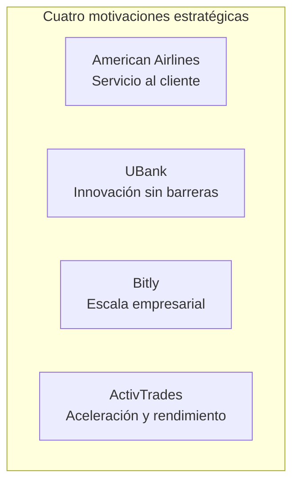
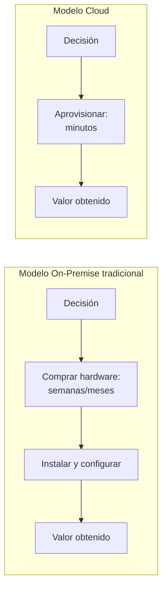
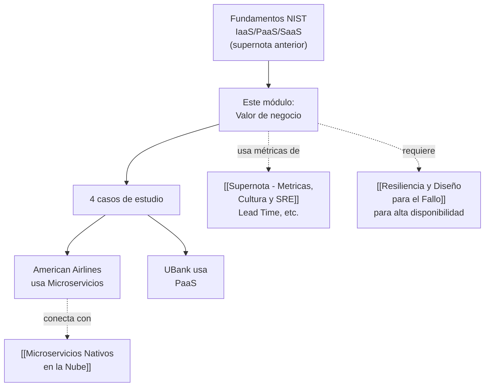

# Supernota: Valor de Negocio de la Nube — Beneficios, Datos y Casos de Estudio

> [!abstract] Resumen rápido del módulo
> La pregunta empresarial ya no es **"¿deberíamos migrar a la nube?"** sino **"¿qué estrategia de adopción debemos seguir?"**. Este módulo conecta los fundamentos técnicos de la [[Supernota - Fundamentos de Cloud Computing|nube]] con su **valor de negocio real**: agilidad, reducción de costos, acceso a tecnologías emergentes (IA, IoT, blockchain), y la necesidad de gestionar volúmenes de datos que crecerán a **163 zettabytes para 2025**. Se ilustra con cuatro casos reales (American Airlines, UBank, Bitly, ActivTrades) que muestran distintas motivaciones estratégicas para adoptar la nube.

> [!note] Nivel de profundidad
> Esta supernota mantiene el estándar técnico y de profundidad establecido en el módulo anterior — se agregan marcos de negocio formales (Time to Value, TCO, Data Gravity) que no aparecen explícitamente en el resumen pero son necesarios para entender el "por qué" estratégico detrás de cada beneficio mencionado.

---

## Índice de esta supernota
1. [[#1. El cambio de pregunta: de "si" a "cómo"]]
2. [[#2. Beneficios estratégicos de la adopción de la nube]]
3. [[#3. El rol de los datos y las tecnologías emergentes]]
4. [[#4. Ventajas operativas y de seguridad]]
5. [[#5. Casos de estudio empresariales]]
6. [[#6. Marco de análisis: Time to Value y TCO]]
7. [[#7. Cómo se conecta este módulo con el resto del vault]]
8. [[#8. Conceptos complementarios]]
9. [[#9. Preguntas para repasar]]
10. [[#10. Recursos recomendados]]
11. [[#11. Notas relacionadas del vault]]

---

## 1. El cambio de pregunta: de "si" a "cómo"

> [!important] Idea central del módulo
> Las organizaciones **ya no debaten si adoptar la nube** — la discusión estratégica real es **qué estrategia de adopción** seguir (qué cargas migrar, con qué modelo de servicio, con qué proveedor, en qué orden — ver las **6 R's de migración** en [[Supernota - Fundamentos de Cloud Computing]]). Esto refleja que la nube pasó de ser una **opción diferenciadora** a una **condición básica de competitividad**.

**Evidencia citada en el módulo:**
- Más del **70% de las empresas** usan la nube para mejorar la experiencia del cliente, innovar en productos y reducir dependencia de sistemas heredados (*legacy systems*).
- La nube reduce el **tiempo y costo desde la decisión hasta la obtención de valor** — concepto que se formaliza en la sección 6 como *Time to Value*.

---

## 2. Beneficios estratégicos de la adopción de la nube

### 2.1 Agilidad y velocidad de innovación
La nube permite **avanzar rápidamente en el desarrollo de productos** al aprovechar servicios **ya construidos y disponibles** (ej. servicios de Inteligencia Artificial gestionados) en vez de tener que desarrollarlos internamente desde cero.

> [!tip] "No reinventar la rueda" como ventaja competitiva
> Este es quizás el beneficio estratégico más subestimado de la nube: no se trata solo de "alquilar servidores más baratos" — se trata de que un equipo pequeño puede incorporar capacidades de nivel empresarial (reconocimiento de voz, traducción automática, detección de fraude) **consumiendo una API**, en vez de contratar un equipo de científicos de datos para construir esas capacidades desde cero. Esto nivela el campo de juego entre startups y grandes corporaciones — ya mencionado como concepto de CapEx→OpEx en [[Supernota - Fundamentos de Cloud Computing]].

### 2.2 Modelo de costos: pago por uso y escalabilidad elástica
Retoma directamente las características esenciales del NIST (**Measured Service** y **Rapid Elasticity**, ver [[Supernota - Fundamentos de Cloud Computing]]): las empresas pagan **solo por los servicios que efectivamente usan**, y pueden **escalar recursos elásticamente** según la demanda real, sin sobre-aprovisionar "por si acaso" (que sería el patrón típico bajo CapEx tradicional).

### 2.3 Enfoque en el negocio principal (Core Business Focus)
Al delegar la gestión de componentes técnicos complejos (ej. administración de bases de datos, parches de seguridad, mantenimiento de infraestructura de red) a un proveedor especializado, las empresas liberan tiempo y talento interno para enfocarse en **lo que las diferencia competitivamente** — su producto y su cliente, no la administración de servidores.

> Esta idea conecta directamente con el concepto de PaaS/SaaS visto en [[Supernota - Fundamentos de Cloud Computing]] — mientras más alto en la pila de abstracción se opera, más se delega la gestión técnica y más se libera capacidad para el negocio principal.

### 2.4 Respuesta ágil a cambios del mercado
Las empresas que usan **análisis de datos** en tiempo real (habilitado por la infraestructura elástica de la nube) pueden ajustar su oferta, precios o servicios más rápido que competidores atados a infraestructura rígida y procesos de aprovisionamiento lentos — factor clave de **competitividad** en mercados que cambian rápido.

---

## 3. El rol de los datos y las tecnologías emergentes

### 3.1 La escala del crecimiento de datos
El módulo cita una proyección: para **2025 se generarán 163 zettabytes de datos**, con aproximadamente **30% en tiempo real**.

> [!note] Dimensionando un zettabyte
> Un zettabyte equivale a mil millones de terabytes (10²¹ bytes). Para dar contexto de magnitud: se estima que toda la información escrita por la humanidad hasta hace pocas décadas cabría en una fracción mínima de esa cifra — 163 zettabytes representa un volumen de datos que **ninguna infraestructura on-premise tradicional podría almacenar, procesar o analizar de forma económicamente viable**; solo arquitecturas de nube con almacenamiento y cómputo elástico (ver [[Supernota - Fundamentos de Cloud Computing]], sección "Rapid Elasticity") pueden absorber ese crecimiento de forma sostenible.

### 3.2 Por qué "tiempo real" es la parte más exigente
Que el **30%** de esos datos deba procesarse **en tiempo real** (no solo almacenarse para análisis posterior) implica requisitos técnicos mucho más exigentes:
- Necesidad de **pipelines de streaming de datos** (ej. Apache Kafka, AWS Kinesis) en vez de solo procesamiento por lotes (*batch*).
- Infraestructura que pueda escalar hacia arriba **instantáneamente** ante picos de ingesta de datos (Rapid Elasticity, característica esencial del NIST).
- Arquitecturas de [[Microservicios Nativos en la Nube]] que permitan que distintos servicios consuman y procesen streams de datos de forma independiente y escalable.

### 3.3 Tecnologías emergentes habilitadas por la nube

| Tecnología | Cómo la nube la habilita |
|---|---|
| **Inteligencia Artificial / Machine Learning** | Servicios gestionados (AWS SageMaker, Google Vertex AI, Azure ML) eliminan la necesidad de construir infraestructura de entrenamiento de modelos desde cero — GPUs bajo demanda, sin inversión de capital |
| **Automatización** | La combinación de IaC (ver [[IaC - Infraestructura Efimera y Entrega Inmutable]]) y servicios cloud permite automatizar procesos operativos completos, no solo tareas aisladas |
| **IoT (Internet of Things)** | La nube ofrece la capacidad de **ingesta masiva** de datos desde millones de dispositivos distribuidos geográficamente, con servicios especializados de gestión de dispositivos y procesamiento de streams |
| **Blockchain** | Servicios de Blockchain-as-a-Service (ej. Amazon Managed Blockchain) permiten experimentar con esta tecnología sin gestionar la infraestructura distribuida subyacente |
| **Infraestructuras híbridas y multicloud** | Ya definidas en [[Supernota - Fundamentos de Cloud Computing]] — permiten combinar control (nube privada) con escalabilidad (nube pública), o evitar dependencia de un solo proveedor |

> [!important] El hilo conductor
> Todas estas tecnologías comparten un patrón: son **intensivas en cómputo y/o datos de forma variable e impredecible** — exactamente el tipo de carga de trabajo para la que la elasticidad de la nube (pagar solo cuando se necesita, escalar solo cuando hace falta) resulta más ventajosa frente a infraestructura fija tradicional.

---

## 4. Ventajas operativas y de seguridad

### 4.1 Despliegue rápido y economía de escala global
Los grandes proveedores de nube operan **centros de datos distribuidos globalmente** (ver concepto de *Region* y *Availability Zone* en [[Supernota - Fundamentos de Cloud Computing]]), lo que ofrece dos beneficios simultáneos:
- **Menor latencia**: se puede desplegar infraestructura físicamente más cerca de los usuarios finales en distintas partes del mundo.
- **Economía de escala**: el proveedor reparte el costo de esa infraestructura masiva entre millones de clientes, logrando costos por unidad de cómputo que ninguna empresa individual podría alcanzar construyendo su propio datacenter.

### 4.2 Copias de seguridad y recuperación de datos (Backup & Disaster Recovery)
La nube facilita backups automatizados y estrategias de recuperación ante desastres **a menor costo** que replicar infraestructura física propia en múltiples ubicaciones — conecta directamente con los conceptos de resiliencia ya vistos en [[Resiliencia y Diseño para el Fallo]] (MTTR, recuperación rápida ante fallos).

### 4.3 Seguridad especializada como servicio
Los proveedores de nube invierten en equipos y tecnología de seguridad a una escala que la mayoría de las organizaciones individuales no podría costear internamente (detección de amenazas con IA, cumplimiento de certificaciones internacionales, monitoreo 24/7) — aunque, como se vio en el **Modelo de Responsabilidad Compartida** ([[Supernota - Fundamentos de Cloud Computing]]), esto **no exime** al cliente de sus propias responsabilidades de configuración y gestión de accesos.

---

## 5. Casos de estudio empresariales

Cada caso ilustra una **motivación estratégica distinta** para adoptar la nube — es útil analizarlos no como anécdotas aisladas, sino como **cuatro patrones repetibles** que cualquier organización puede reconocer en su propio contexto.

### 5.1 American Airlines — Mejora del servicio al cliente vía microservicios

**Qué hicieron**: adoptaron una **arquitectura de microservicios en la nube** (ver [[Microservicios Nativos en la Nube]]) para desarrollar y lanzar aplicaciones digitales más rápido.

**Por qué funciona técnicamente**: al descomponer una aplicación monolítica en servicios independientes y desplegables por separado, distintos equipos pueden **lanzar mejoras a funcionalidades específicas** (ej. check-in, seguimiento de equipaje, notificaciones de vuelo) **sin coordinar un despliegue masivo de toda la aplicación** — exactamente el beneficio de despliegue independiente ya explicado en [[Microservicios Nativos en la Nube]].

**Resultado reportado**: mayor confiabilidad, costos reducidos, y una respuesta más ágil a las necesidades del cliente — consistente con el principio de **lotes pequeños y frecuentes** (ver [[Principios Fundamentales de DevOps (Resumen Integrador)]]) aplicado a escala de una aerolínea global.

### 5.2 UBank — Eliminación de barreras a la innovación vía PaaS

**Qué hicieron**: implementaron un modelo de **PaaS** (ver [[Supernota - Fundamentos de Cloud Computing]]) para **empoderar directamente a sus desarrolladores**, sin que dependan de un equipo de infraestructura central para cada despliegue.

**Por qué funciona técnicamente**: en PaaS, el proveedor gestiona el sistema operativo, middleware y runtime — los desarrolladores de UBank pueden desplegar código nuevo sin esperar aprovisionamiento manual de servidores, sin gestionar parches de sistema operativo, sin coordinar con un equipo de Ops separado para cada release. Esto reduce directamente el **Lead Time** (una de las [[Supernota - Metricas, Cultura y SRE|métricas DORA]]).

**Tecnología destacada**: usaron **asistentes virtuales con IA** para innovar en servicios bancarios en línea — ejemplo concreto de "no reinventar la rueda" (sección 2.1): consumir un servicio de IA ya construido, en vez de desarrollar procesamiento de lenguaje natural desde cero.

> [!tip] Conexión con "eliminar barreras a la innovación"
> Este caso ilustra perfectamente por qué PaaS suele preferirse sobre IaaS cuando el objetivo estratégico es **velocidad de innovación del equipo de desarrollo**: menos capas de infraestructura que gestionar significa menos fricción entre "tener una idea" y "tenerla funcionando en producción" — el mismo argumento de Lead Time visto en las métricas DORA.

### 5.3 Bitly — Demanda de escala empresarial

**Qué hicieron**: migraron su infraestructura para soportar el crecimiento de **startup a producto empresarial**, beneficiándose de infraestructura escalable, precios flexibles y presencia global.

**Por qué funciona técnicamente**: Bitly es un servicio (acortador de URLs) donde **cada clic en un enlace es una solicitud que debe resolverse con baja latencia**, sin importar dónde en el mundo esté el usuario que hace clic. Esto exige:
- **Presencia global de infraestructura** (Regiones/Zonas de Disponibilidad, ver [[Supernota - Fundamentos de Cloud Computing]]) para servir solicitudes desde ubicaciones cercanas al usuario.
- **Escalabilidad elástica** para absorber picos de tráfico impredecibles (un enlace puede volverse viral repentinamente).

**Resultado reportado**: capacidad de manejar grandes volúmenes de datos y baja latencia para clientes empresariales geográficamente dispersos, permitiéndoles enfocarse en desarrollo de producto en vez de gestión de infraestructura (ver sección 2.3, "Core Business Focus").

### 5.4 ActivTrades — Aceleración del crecimiento en sistemas de trading

**Qué hicieron**: trasladaron sus sistemas de **trading financiero** a la nube, buscando mejorar velocidad, disponibilidad y seguridad.

**Por qué funciona técnicamente**: los sistemas de trading tienen requisitos extremos de **rendimiento y disponibilidad** — cada milisegundo de latencia puede tener impacto financiero directo, y una caída del sistema durante horario de mercado es directamente costosa. La nube ofrece:
- **Infraestructura, almacenamiento, red y seguridad** de nivel empresarial sin la inversión de capital de construir un datacenter propio de alto rendimiento.
- **Rápida provisión de recursos** para responder a demanda cambiante del mercado financiero (ej. picos de volatilidad que generan picos de volumen de operaciones).

**Resultado reportado**: hasta **3 veces mejor rendimiento** que su infraestructura anterior — un resultado cuantitativo concreto que ilustra que la migración a la nube, bien ejecutada, no es solo un cambio de "dónde vive el código" sino una **mejora medible de rendimiento real**.

### 5.5 Tabla comparativa de los 4 casos

| Empresa | Motivación estratégica principal | Tecnología/modelo cloud clave | Resultado destacado |
|---|---|---|---|
| **American Airlines** | Mejorar servicio al cliente | Arquitectura de microservicios | Mayor confiabilidad, despliegues más rápidos, menor costo |
| **UBank** | Eliminar barreras a la innovación | PaaS + IA (asistentes virtuales) | Desarrolladores más autónomos, lanzamientos más rápidos |
| **Bitly** | Escalar de startup a empresa | Infraestructura elástica + presencia global | Baja latencia global, foco en desarrollo de producto |
| **ActivTrades** | Acelerar crecimiento y rendimiento | Infraestructura + red + seguridad de alto rendimiento | Hasta 3x mejor rendimiento |

---

## 6. Marco de análisis: Time to Value y TCO

### 6.1 Time to Value (Tiempo hasta obtener valor)
Métrica de negocio que mide **cuánto tiempo transcurre entre tomar una decisión y obtener el beneficio esperado de esa decisión**. El módulo señala explícitamente que la nube **reduce el tiempo y costo desde la decisión hasta la obtención de valor**.

Este es el mecanismo técnico detrás de por qué UBank y Bitly pudieron innovar/escalar tan rápido: eliminar el paso de "comprar e instalar hardware" comprime radicalmente el Time to Value.

### 6.2 Total Cost of Ownership (TCO)
Ya mencionado en [[Supernota - Fundamentos de Cloud Computing]] como parte de la estrategia de adopción — aquí se conecta con el valor de negocio: el TCO en la nube no es solo "el precio de la factura mensual", sino que debe compararse contra el costo **total** on-premise, incluyendo:
- Hardware y su depreciación
- Personal dedicado a mantenimiento
- Costos de electricidad, refrigeración, espacio físico
- Costo de oportunidad de la lentitud (Time to Value más largo)

> [!important] Por qué el TCO suele favorecer a la nube en casos como los descritos
> En los 4 casos de estudio, el beneficio no fue solo "más barato" en términos de factura — fue la combinación de **menor TCO total** + **Time to Value drásticamente menor** + **capacidad técnica que no podrían replicar internamente a ese costo** (baja latencia global de Bitly, rendimiento de trading de ActivTrades). El valor de negocio de la nube casi nunca se explica con una sola variable aislada.

---

## 7. Cómo se conecta este módulo con el resto del vault

Este módulo funciona como el **"por qué de negocio"** que justifica todo lo técnico ya cubierto en supernotas anteriores: la arquitectura de microservicios, la infraestructura como código, las métricas DORA y los patrones de resiliencia no son prácticas técnicas aisladas — son las **herramientas concretas** que permiten a empresas reales (American Airlines, UBank, Bitly, ActivTrades) capturar el valor de negocio descrito en este módulo.

---

## 8. Conceptos complementarios (no cubiertos en los resúmenes originales)

### 8.1 Data Gravity (Gravedad de los Datos)
Concepto acuñado por Dave McCrory: a medida que los datos se acumulan en un lugar (ej. un proveedor de nube específico), se vuelve progresivamente más difícil y costoso moverlos — las aplicaciones y servicios tienden a "gravitar" hacia donde ya están los datos. Es relevante para entender por qué, una vez que una empresa como Bitly acumula grandes volúmenes de datos en un proveedor, cambiar de proveedor se vuelve estratégicamente más complejo (conecta con el concepto de *vendor lock-in* visto en [[Supernota - Fundamentos de Cloud Computing]]).

### 8.2 Digital Transformation (Transformación Digital) — el marco más amplio
La adopción de la nube suele ser el **habilitador técnico** de una transformación digital más amplia — un proceso organizacional donde la tecnología se usa para repensar fundamentalmente cómo una empresa entrega valor (no solo digitalizar procesos existentes, sino repensarlos). Los 4 casos de estudio son ejemplos de transformación digital habilitada específicamente por la nube.

### 8.3 API Economy
Muchos de los beneficios descritos (servicios de IA "listos para usar", como en UBank) dependen de la **economía de APIs**: la capacidad de consumir capacidades complejas (IA, pagos, geolocalización) como servicios simples a través de una API, sin necesidad de entender ni construir la complejidad interna. Es el mecanismo técnico concreto detrás de "no reinventar la rueda" (sección 2.1).

### 8.4 FinOps (Financial Operations)
Disciplina emergente que aplica principios similares a DevOps (colaboración, responsabilidad compartida, decisiones basadas en datos — ver [[Que es DevOps - Definicion y Malentendidos]]) mercado a la **gestión financiera del gasto en la nube**: dado que el modelo de pago por uso puede generar gasto descontrolado sin visibilidad (mencionado como riesgo de "Shadow IT" en [[Supernota - Fundamentos de Cloud Computing]]), FinOps busca dar visibilidad y responsabilidad compartida sobre el costo cloud entre equipos técnicos y financieros.

---

## 9. Preguntas para repasar (auto-evaluación)

- [ ] ¿Por qué se dice que la pregunta empresarial cambió de "si" adoptar la nube a "cómo" adoptarla?
- [ ] ¿Cómo se relaciona el volumen proyectado de 163 zettabytes de datos con la necesidad de infraestructura elástica?
- [ ] ¿Por qué el 30% de datos en tiempo real representa un desafío técnico mayor que el 70% restante?
- [ ] Para cada uno de los 4 casos de estudio (American Airlines, UBank, Bitly, ActivTrades), ¿puedes identificar su motivación estratégica principal y la tecnología cloud clave que usaron?
- [ ] ¿Qué es el Time to Value y cómo lo reduce específicamente el modelo cloud frente al on-premise?
- [ ] ¿Por qué el TCO de la nube debe compararse con el costo *total* on-premise, no solo el precio de hardware?
- [ ] ¿Qué es la "Data Gravity" y cómo se relaciona con el vendor lock-in?
- [ ] ¿Qué es FinOps y por qué surge como necesidad en organizaciones que usan la nube a gran escala?

---

## 10. Recursos recomendados para profundizar

- 🌐 [AWS Customer Case Studies](https://aws.amazon.com/solutions/case-studies/) — más ejemplos de casos reales de adopción empresarial de la nube.
- 🌐 [IDC — Data Age 2025](https://www.seagate.com/our-story/data-age-2025/) — fuente original de proyecciones de crecimiento de datos globales similares a la citada en el módulo.
- 🌐 [FinOps Foundation](https://www.finops.org/) — recursos oficiales sobre la disciplina de gestión financiera de la nube.
- 📘 *Leading Digital* — George Westerman, Didier Bonnet, Andrew McAfee (marco de referencia sobre transformación digital).

---

## 11. Notas relacionadas del vault
- [[Supernota - Fundamentos de Cloud Computing]]
- [[Microservicios Nativos en la Nube]]
- [[Supernota - Metricas, Cultura y SRE]]
- [[Resiliencia y Diseño para el Fallo]]
- [[Principios Fundamentales de DevOps (Resumen Integrador)]]
- [[Que es DevOps - Definicion y Malentendidos]]

---
#devops #cloud-computing #transformacion-digital #casos-de-estudio #estrategia
