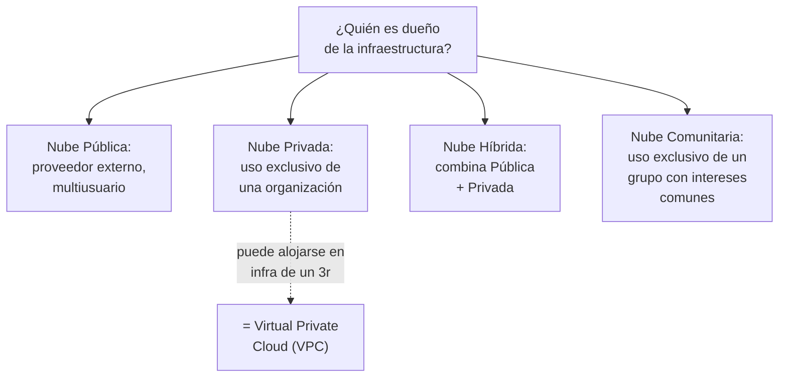
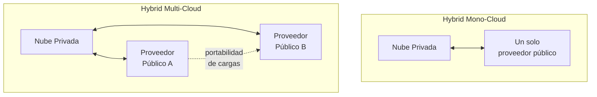
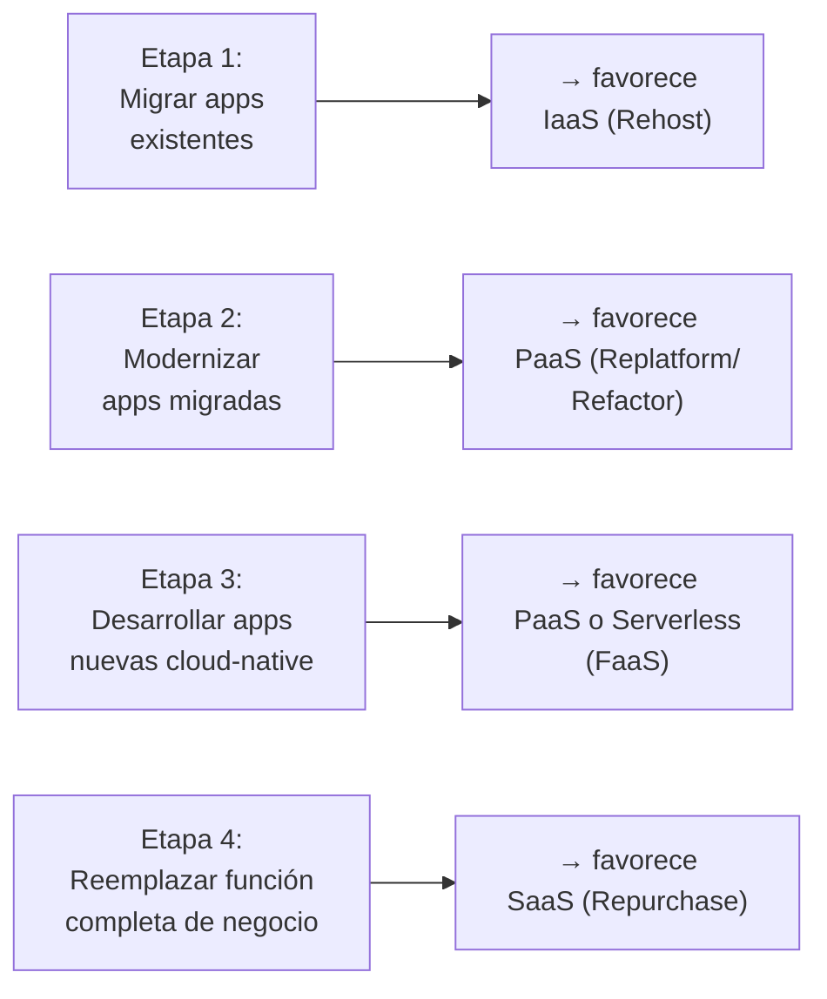
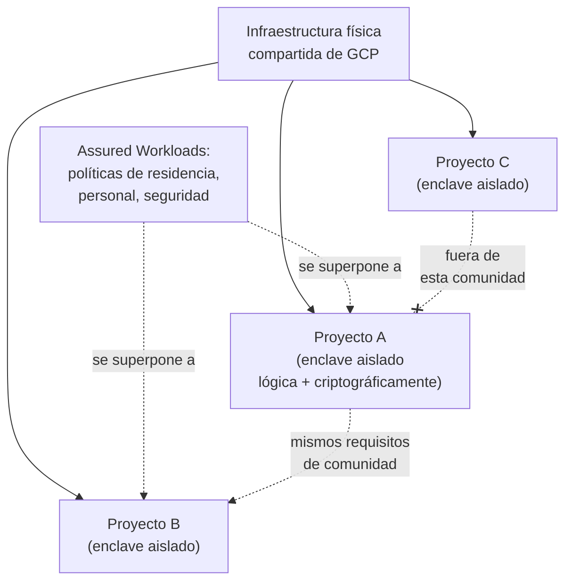
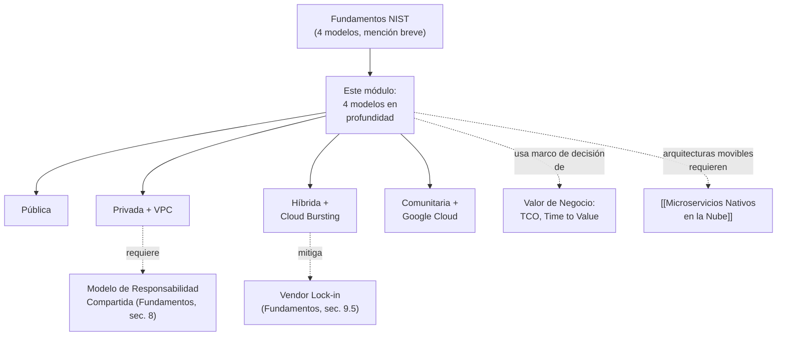

# Supernota: Modelos de Despliegue en la Nube — Pública, Privada, Híbrida y Comunitaria

> [!abstract] Resumen rápido del módulo
> Los **4 modelos de despliegue del NIST** ([[Supernota - Fundamentos de Cloud Computing|ya introducidos brevemente]]) no son solo una clasificación teórica: cada uno resuelve un problema de negocio distinto. **Pública** maximiza escala y velocidad a cambio de control; **Privada** maximiza control y cumplimiento a cambio de costo/esfuerzo operativo; **Híbrida** combina ambas para optimizar según la sensibilidad de cada carga de trabajo (con variantes como *cloud bursting* y multi-nube); y **Comunitaria** comparte infraestructura entre organizaciones con requisitos de seguridad/cumplimiento en común — incluyendo el enfoque moderno **"definido por software"** que usa Google Cloud para lograrlo sin separación física real.

> [!note] Esta es una supernota — combina 5 resúmenes + 1 glosario
> Este módulo junta **cinco resúmenes de lección** (Nube Pública, Nube Privada, Nube Híbrida, Cómo elegir el modelo de servicio, y Nube Comunitaria) más una **tabla de glosario oficial** del curso, en un solo archivo. Amplía directamente la [[Supernota - Fundamentos de Cloud Computing|sección 3 de la supernota de Fundamentos]], donde los 4 modelos de despliegue solo se mencionaron en una tabla resumida — aquí no se repite esa tabla, se **desarrolla cada modelo a profundidad**, con matices, ejemplos técnicos y verificación de fuentes reales que no estaban en tu resumen original.

---

## Índice de esta supernota
1. [[#1. Contexto — por qué este módulo expande lo ya visto]]
2. [[#2. Nube Pública en profundidad]]
3. [[#3. Nube Privada en profundidad (incluye VPC)]]
4. [[#4. Nube Híbrida en profundidad]]
5. [[#5. Cómo elegir el modelo de servicio correcto (IaaS PaaS SaaS)]]
6. [[#6. Nube Comunitaria en profundidad — el caso Google Cloud]]
7. [[#7. Tabla comparativa integral de los 4 modelos de despliegue]]
8. [[#8. Glosario oficial del módulo (ampliado)]]
9. [[#9. Conceptos complementarios]]
10. [[#10. Cómo se conecta este módulo con el resto del vault]]
11. [[#11. Preguntas para repasar]]
12. [[#12. Recursos recomendados]]
13. [[#13. Notas relacionadas del vault]]

---

## 1. Contexto — por qué este módulo expande lo ya visto

En [[Supernota - Fundamentos de Cloud Computing]] (sección 3) ya se definieron brevemente los 4 modelos de despliegue del NIST como parte del marco formal completo (5 características + 3 modelos de servicio + 4 modelos de despliegue). Este módulo retoma exactamente esos 4 modelos, pero con el nivel de detalle que un resumen introductorio no puede dar: características técnicas específicas, mecanismos reales (VPC, cloud bursting, enclaves criptográficos), variantes híbridas/multi-nube, y un caso real y verificado (Google Cloud) para el modelo menos común de los cuatro, la nube comunitaria.

> [!tip] El eje real detrás de los 4 modelos
> No pienses en los 4 modelos como categorías aisladas — piénsalos como puntos en un **espectro de dos variables en tensión**: **control/cumplimiento** (máximo en privada) vs. **escala/conveniencia/costo variable** (máximo en pública). Híbrida y comunitaria son formas de **negociar ese trade-off** en vez de elegir un extremo: híbrida lo hace por *carga de trabajo* (qué se queda dónde), comunitaria lo hace por *grupo de interés compartido* (qué organizaciones comparten infraestructura y bajo qué reglas).

---

## 2. Nube Pública en profundidad

### 2.1 Definición técnica
La infraestructura es **propiedad y está gestionada por el proveedor de servicios en la nube** (AWS, Azure, GCP, etc.), que ofrece servidores, almacenamiento, redes y aplicaciones a los usuarios a través de Internet. El usuario **no posee ni gestiona la infraestructura física** — paga por el uso de los recursos, de forma análoga a consumir electricidad o agua (el **Modelo de Facturación Utilitario**, ya visto como término del glosario en [[Supernota - IoT, IA y Blockchain en la Nube]]).

Esta es, de hecho, la forma "por defecto" de nube que la mayoría de la gente imagina al escuchar "cloud computing" — y corresponde directamente a las características esenciales del NIST **Resource Pooling** y **Measured Service** ya desarrolladas en [[Supernota - Fundamentos de Cloud Computing]].

### 2.2 Características y beneficios

- **Arquitectura multiusuario virtualizada (multi-tenant)**: múltiples clientes comparten la misma infraestructura física subyacente, aislados lógicamente unos de otros, **fuera del perímetro de red (firewall) de cada organización** — a diferencia de la nube privada, donde los recursos permanecen dentro del control de red de la organización.
- **Escalabilidad y alta disponibilidad**: al operar sobre la infraestructura masiva y globalmente distribuida del proveedor (ver Regiones/AZ, [[Supernota - Fundamentos de Cloud Computing]]).
- **Economías de escala significativas**: el proveedor reparte el costo fijo de su infraestructura entre millones de clientes — ya explicado con detalle en [[Supernota Valor de Negocio de la Nube y Casos de Estudio]] (sección 4.1).
- **Modelos de pago**: por suscripción (típico de SaaS) o por uso medido (típico de IaaS/PaaS) — conecta con **Measured Service** y con el cambio **CapEx → OpEx** ya visto en [[Supernota - Fundamentos de Cloud Computing]].

### 2.3 Desafíos y preocupaciones comunes

| Desafío | Por qué ocurre |
|---|---|
| **Seguridad** | El cliente comparte infraestructura física con desconocidos (multi-tenancy) — mitigado por aislamiento a nivel de hipervisor, pero el cliente sigue siendo responsable de su propia configuración (ver **Modelo de Responsabilidad Compartida**, [[Supernota - Fundamentos de Cloud Computing]]) |
| **Privacidad de datos** | Los datos residen en infraestructura de un tercero, fuera del control físico directo del cliente |
| **Soberanía de datos (Data Sovereignty)** | Regulaciones locales pueden exigir que ciertos datos se almacenen y procesen físicamente **dentro de una jurisdicción específica** — ver ampliación en sección 9, y el caso de Google Cloud en sección 6 |

> [!warning] "Soberanía de datos" no es lo mismo que "residencia de datos"
> Es un matiz frecuente en exámenes: **Data Residency** (residencia) solo indica *dónde* físicamente se almacenan los datos. **Data Sovereignty** (soberanía) va más allá: implica que los datos están sujetos a las **leyes del país donde residen**, incluso si la empresa dueña de los datos es de otro país — lo que puede exponer a la organización a que un gobierno extranjero tenga potestad legal sobre su información. Ver desarrollo completo en la sección 9.1.

### 2.4 Casos de uso típicos (según el resumen)
- Desarrollo y pruebas de aplicaciones (entornos efímeros, se pagan solo mientras se usan).
- Manejo de picos de demanda (Rapid Elasticity).
- Recuperación ante desastres (Disaster Recovery) — ver [[Resiliencia y Diseño para el Fallo]].
- Almacenamiento y gestión de datos a gran escala.
- Externalización de plataformas estándar — equivalente al **Repurchase** de las 6 R's de migración ([[Supernota - Fundamentos de Cloud Computing]]).

---

## 3. Nube Privada en profundidad (incluye VPC)

### 3.1 Definición y tipos
La nube privada es una infraestructura de nube usada **exclusivamente por una organización** (que puede incluir múltiples unidades de negocio internas, es decir, sigue siendo "multiusuario" pero dentro de los límites de una sola organización). Puede gestionarse:

- **Internamente**, por el propio equipo de TI de la organización, o
- **Por un tercero**, en nombre de la organización.

Y puede alojarse físicamente:

- **On-premises**: en las instalaciones propias de la organización.
- **En infraestructura de un proveedor externo**: en este caso se denomina **VPC (Virtual Private Cloud)**.

### 3.2 ¿Qué es exactamente una VPC?
> [!important] Definición técnica de VPC
> Una **Virtual Private Cloud (VPC)** es una **sección lógicamente aislada** dentro de la infraestructura de un proveedor de nube pública (AWS, Azure, GCP), dedicada exclusivamente a un cliente, que usa **redes virtuales definidas por software** (subredes, tablas de rutas, grupos de seguridad, gateways privados) para simular una red privada propia **dentro** de infraestructura físicamente compartida. En otras palabras: técnicamente corre sobre hardware multiusuario, pero desde la perspectiva lógica y de red, se comporta como una nube privada dedicada.
>
> Ejemplos concretos: **Amazon VPC**, **Azure Virtual Network (VNet)**, **Google Cloud VPC**.

Esto conecta directamente con el matiz de la sección 6: una VPC es, en esencia, el mecanismo técnico general del que Google Cloud parte para construir su enfoque de "nube comunitaria definida por software" — aislamiento lógico dentro de infraestructura compartida, en vez de separación física real.

### 3.3 Beneficios y características

- **Control total** sobre seguridad, control de acceso y cumplimiento normativo — la organización define sus propias políticas sin depender de configuraciones estándar de un proveedor multiusuario.
- **Mejor utilización de recursos internos**: al virtualizar la infraestructura propia (ver [[Supernota - Fundamentos de Cloud Computing]], sección 5), se evita el desperdicio típico de servidores dedicados a una sola aplicación de bajo uso.
- **Escalabilidad mediante virtualización y cloud bursting**: aunque la capacidad física es más limitada que en la nube pública, la virtualización permite reasignar recursos internos dinámicamente, y el *cloud bursting* (ver sección 4.2) permite "desbordar" hacia la nube pública cuando la demanda excede la capacidad privada disponible.
- **Agilidad**: aprovisionar recursos internos rápidamente, sin los tiempos de compra/instalación de hardware físico nuevo tradicional (ver **Time to Value**, [[Supernota Valor de Negocio de la Nube y Casos de Estudio]]).

### 3.4 Casos de uso comunes
- Modernización y unificación de aplicaciones internas y heredadas (*legacy*).
- Integración de servicios de datos y aplicaciones propias con servicios públicos en la nube (puente natural hacia la nube híbrida, sección 4).
- Portabilidad de aplicaciones sin comprometer seguridad ni cumplimiento.
- Organizaciones con preocupaciones de seguridad, regulaciones estrictas (banca, salud, gobierno) o datos altamente sensibles.

> [!warning] Un error común: "privada" no significa automáticamente "más segura"
> La nube privada da **control total**, pero ese control implica también **responsabilidad total** — si se gestiona internamente, toda la carga de seguridad, parches, configuración de accesos y cumplimiento recae en el equipo interno de la organización, sin la red de seguridad especializada que ofrece un gran proveedor de nube pública (ver sección 4.3 de [[Supernota Valor de Negocio de la Nube y Casos de Estudio]]). Una nube privada mal gestionada puede ser **menos segura** que una nube pública bien configurada.

---

## 4. Nube Híbrida en profundidad

### 4.1 Concepto central
La arquitectura de nube híbrida **conecta la nube privada local de una organización con nubes públicas de terceros**, creando una infraestructura única y flexible para ejecutar aplicaciones y cargas de trabajo — combinando recursos de ambos mundos para **optimizar el despliegue según la sensibilidad y la demanda de cada aplicación** (no es una elección binaria: cada carga de trabajo individual puede vivir en el lado que más le convenga, el mismo principio detrás de las **6 R's de migración**, [[Supernota - Fundamentos de Cloud Computing]]).

### 4.2 Cloud Bursting (retomado y ampliado)
Ya se definió brevemente en [[Supernota - Fundamentos de Cloud Computing]] (sección 12.3): una aplicación corre normalmente en infraestructura privada, pero **"desborda"** temporalmente hacia la nube pública cuando la demanda excede la capacidad local disponible (ej. picos estacionales de tráfico). Este resumen lo posiciona como **el mecanismo central que permite la movilidad de cargas de trabajo** entre nubes en una arquitectura híbrida — es decir, no es solo una técnica más, es el **puente operativo** que hace que "híbrido" sea algo más que dos infraestructuras separadas coexistiendo sin comunicarse.

### 4.3 Variantes de nube híbrida: mono-nube vs. multi-nube

| Variante | Qué implica | Ejemplo |
|---|---|---|
| **Hybrid Mono-Cloud (Mononube híbrida)** | Combina la nube privada de la organización con **un único** proveedor de nube pública | Nube privada propia + AWS únicamente |
| **Hybrid Multi-Cloud (Nube múltiple híbrida)** | Combina la nube privada con **más de un** proveedor de nube pública, permitiendo mover cargas entre ellos según convenga | Nube privada propia + AWS para unas cargas + GCP para otras |

> [!note] Multi-nube híbrida vs. estrategia Multi-Cloud "pura" — el matiz correcto
> No confundas esto con el concepto de **Multi-Cloud** ya visto en [[Supernota - Fundamentos de Cloud Computing]] (sección 3, nota adicional). Multi-Cloud "puro" es usar varios proveedores **públicos** simultáneamente, sin necesariamente involucrar nube privada. La **nube múltiple híbrida** de este módulo es más específica: es una **pila basada en estándares abiertos, desplegable en cualquier infraestructura de nube pública**, que además está conectada a la nube privada de la organización — el elemento híbrido (privada + pública) sigue presente, y la parte "múltiple" se refiere a que el lado público no está atado a un solo proveedor.

### 4.4 Nube múltiple compuesta (Composite Multicloud)
Término del glosario oficial del curso, más específico que "multi-nube híbrida": es una **variante de la multi-nube híbrida** que distribuye los **componentes de una sola aplicación** a través de **múltiples proveedores de nube**, permitiendo mover componentes individuales de esa aplicación entre servicios y proveedores según sea necesario — no se trata de "esta app vive en AWS y aquella otra en GCP", sino de que **una misma aplicación** puede tener, por ejemplo, su base de datos en un proveedor y su capa de cómputo en otro, moviéndose dinámicamente.

> [!note] Verificación de este término (aporte del asistente)
> "Composite multicloud" no es un término tan estandarizado en toda la industria como IaaS/PaaS/SaaS — es más específico del vocabulario usado en cursos y documentación de IBM sobre arquitecturas híbridas empresariales. La definición formal más ampliamente citada de **multicloud** en general proviene del estándar **ISO/IEC 22123-1**: *"modelo de despliegue en el que un cliente usa servicios de nube pública provistos por dos o más proveedores de servicios de nube"*. La idea de mover componentes individuales de una misma aplicación entre proveedores es consistente con este marco más amplio, pero implica una madurez arquitectónica alta (la aplicación debe estar diseñada de forma desacoplada — ver [[Microservicios Nativos en la Nube]] — para que sus componentes sean movibles de forma independiente).

### 4.5 Características, beneficios y desafíos

**Características**: interoperable, escalable y portátil — facilita la integración y migración de aplicaciones y datos entre entornos.

**Beneficios**: seguridad, cumplimiento normativo, escalabilidad, optimización de recursos y ahorro de costos (al poder ubicar cada carga en el entorno más costo-eficiente para su perfil específico).

**Desafíos**: la complejidad radica en la **sincronización** de datos/estado entre entornos, la **seguridad** consistente a través de fronteras de red distintas, y la **compatibilidad** técnica entre entornos públicos y privados que pueden tener APIs, formatos y capacidades diferentes (conecta con el riesgo de **Vendor Lock-in**, [[Supernota - Fundamentos de Cloud Computing]], sección 9.5 — la nube híbrida bien diseñada es precisamente una estrategia para *mitigar* ese riesgo).

### 4.6 Casos de uso comunes
- Integración de software como servicio (SaaS) con aplicaciones existentes on-premises.
- Combinación de capacidades de datos e IA entre distintas nubes (conecta con [[Supernota - IoT, IA y Blockchain en la Nube]]).
- Modernización de aplicaciones heredadas y migración de cargas virtualizadas (**Replatform**, 6 R's).
- Aprovechamiento de servicios públicos para complementar la capacidad privada existente (cloud bursting, sección 4.2).

---

## 5. Cómo elegir el modelo de servicio correcto (IaaS / PaaS / SaaS)

> [!note] Esto no repite la sección 2 de Fundamentos — la complementa
> Los tres modelos de servicio (IaaS, PaaS, SaaS) ya se explicaron a profundidad, capa por capa, en [[Supernota - Fundamentos de Cloud Computing]] (sección 2). Aquí el enfoque es distinto: no es "qué gestiona el proveedor vs el cliente", sino **cómo decidir cuál usar** según el contexto y la etapa de adopción de la organización — el ángulo de decisión práctica que aporta este resumen específico.

### 5.1 Los tres modelos, en clave de decisión

| Modelo | Cuándo tiene más sentido elegirlo (según este resumen) |
|---|---|
| **IaaS** | Cuando se necesita mover aplicaciones **existentes** a máquinas virtuales en la nube **sin reescribirlas** — equivale al **Rehost** de las 6 R's |
| **PaaS** | Cuando el objetivo es **desarrollar y desplegar** aplicaciones nuevas sin tener que gestionar la infraestructura subyacente — libera al equipo de desarrollo de tareas operativas |
| **SaaS** | Cuando se necesita software **estándar, listo para usar** (correo, CRM) con **mínima inversión tecnológica** — equivale al **Repurchase** de las 6 R's |

### 5.2 La "etapa del viaje a la nube" como criterio de decisión
El resumen introduce un criterio adicional, más dinámico que una tabla estática de capas gestionadas: **la etapa en la que se encuentra la organización dentro de su adopción de la nube**.

Esto conecta directamente con el modelo **FaaS/Serverless**, ya mencionado como extensión de PaaS en [[Supernota - Fundamentos de Cloud Computing]] (sección 2.6): a medida que una organización avanza en su madurez cloud, la tendencia natural es moverse desde IaaS (control total, más esfuerzo) hacia modelos cada vez más gestionados (PaaS, luego Serverless), reservando SaaS para funciones de negocio estándar que no aportan ventaja competitiva al construirse internamente (ver "Core Business Focus", [[Supernota Valor de Negocio de la Nube y Casos de Estudio]], sección 2.3).

### 5.3 Trade-off resumido: control vs. costo vs. velocidad

| | **IaaS** | **PaaS** | **SaaS** |
|---|---|---|---|
| Nivel de control técnico | Alto | Medio | Bajo |
| Responsabilidad de gestión del cliente | Alta | Media | Mínima |
| Costo típico | Variable, depende del uso de infraestructura | Variable, orientado a desarrollo | Suscripción predecible |
| Velocidad de despliegue | Media | Alta | Máxima |
| Perfil de organización ideal | Empresas con requisitos de configuración muy específicos | Empresas de desarrollo de software que priorizan velocidad | Empresas que necesitan funcionalidad estándar rápido |

> [!tip] Regla práctica para decidir
> Pregúntate: **¿esta capacidad diferencia competitivamente a mi organización?** Si la respuesta es sí (ej. el algoritmo central de tu producto), probablemente vale la pena el mayor control de IaaS/PaaS. Si la respuesta es no (ej. correo corporativo, CRM estándar), SaaS casi siempre gana en costo total y velocidad — el mismo argumento de "no reinventar la rueda" visto en [[Supernota Valor de Negocio de la Nube y Casos de Estudio]] (sección 2.1).

---

## 6. Nube Comunitaria en profundidad — el caso Google Cloud

### 6.1 Definición formal (NIST)
Una **comunidad cloud** es una infraestructura en la nube usada **exclusivamente por un grupo específico de organizaciones** con intereses comunes — típicamente requisitos compartidos de **seguridad, cumplimiento normativo, misión institucional o políticas**. Es el modelo de despliegue menos discutido de los cuatro, pero relevante en sectores como gobierno, salud, o consorcios industriales regulados.

### 6.2 Implementación tradicional vs. definida por software

| | **Comunidad cloud tradicional** | **Comunidad cloud definida por software (Google Cloud)** |
|---|---|---|
| Mecanismo de aislamiento | **Separación física** de infraestructura dedicada a la comunidad | Aislamiento **lógico y criptográfico** sobre infraestructura compartida |
| Flexibilidad | Baja — cambiar los límites de la comunidad requiere trabajo físico | Alta — los límites se ajustan mediante **políticas auditables**, sin mover hardware |
| Velocidad para adoptar nuevas capacidades | Lenta — nuevo hardware dedicado = nuevo despliegue físico | Rápida — nuevas capacidades del proveedor están disponibles inmediatamente dentro del enclave lógico |
| Costo | Alto (infraestructura dedicada) | Menor (comparte economías de escala de la nube pública subyacente) |

### 6.3 Cómo lo implementa Google Cloud, en detalle (verificado)
> [!important] Este caso es real y se verificó con la fuente oficial
> Lo que el resumen describe corresponde al producto real de Google Cloud llamado **Assured Workloads**, presentado formalmente en una publicación oficial de Google Cloud (Christopher Johnson y Jason Callaway, diciembre de 2021). Es un ejemplo perfecto de cómo un concepto abstracto del NIST (comunidad cloud) se traduce en un producto de infraestructura real.

El mecanismo técnico, en capas:

1. **Cada proyecto en Google Cloud Platform (GCP) es un enclave aislado**: los recursos de infraestructura de bajo nivel (hipervisores, bloques del almacenamiento distribuido subyacente a Google Cloud Storage) están asignados y aislados **exclusivamente** a ese proyecto, tanto **lógicamente** (a nivel de software/permisos) como **criptográficamente** (los datos de un proyecto están cifrados de forma que otro proyecto no puede acceder a ellos aunque comparta el mismo hardware físico).
2. **Assured Workloads superpone reglas de comunidad** sobre esos proyectos-enclave: restricciones de residencia de datos, atributos del personal de soporte autorizado (ej. ciudadanía específica, relevante para cargas de trabajo gubernamentales), y controles de seguridad comunes al grupo/comunidad.
3. El resultado son **comunidades definidas mediante políticas**: se puede definir una comunidad según su misión, requisitos de seguridad/cumplimiento y política; separar los proyectos de esa comunidad de otros proyectos; y añadir o quitar capacidades del límite de esa comunidad mediante cambios de configuración controlados por política y auditables — sin tocar hardware físico.

### 6.4 Beneficios del enfoque definido por software (según el resumen, verificado)
- **Rapidez para acceder a nuevas tecnologías**: al no depender de aprovisionar hardware físico dedicado, la comunidad se beneficia de las mismas mejoras continuas que recibe el resto de la nube pública del proveedor.
- **Eficiencia, disponibilidad, rendimiento**: se hereda de la infraestructura compartida masiva del proveedor, en vez de construir una réplica física reducida solo para la comunidad.
- **Escalabilidad de la seguridad y el cumplimiento**: las reglas de la comunidad se aplican mediante política de software, replicable y auditable, en vez de procesos manuales.

> [!warning] Una mirada equilibrada al término (aporte del asistente)
> Cobertura periodística especializada del anuncio (The Register, diciembre 2021) señaló que, aunque Google acuñó el término "nube comunitaria definida por software" como una idea nueva de marketing, **el concepto subyacente no es exclusivo de Google**: la mayoría de los grandes proveedores de nube (AWS, Azure, IBM, Oracle) ya ofrecían certificaciones de seguridad gubernamentales y regiones dedicadas con aislamiento fuerte antes de este anuncio — y, de hecho, a diferencia de sus competidores, en ese momento Google Cloud **no** contaba con regiones físicas dedicadas exclusivamente a gobierno en EE.UU. Vale la pena conocer el término porque aparece en material de curso y documentación oficial, pero es útil entenderlo como una forma particular de implementar un concepto ya existente del NIST, no como una categoría nueva de nube.

---

## 7. Tabla comparativa integral de los 4 modelos de despliegue

| Criterio | Pública | Privada | Híbrida | Comunitaria |
|---|---|---|---|---|
| **Propiedad de la infraestructura** | Proveedor externo | Organización (o 3ro en su nombre) | Combinación de ambas | Compartida entre organizaciones del grupo |
| **Multiusuario (multi-tenant)** | Sí, entre clientes no relacionados | No (o solo entre unidades internas) | Depende del lado (público sí, privado no) | Sí, pero limitado al grupo/comunidad |
| **Control del cliente** | Bajo | Alto | Variable por carga de trabajo | Medio (compartido con reglas de la comunidad) |
| **Costo típico** | OpEx puro, pago por uso | Mayor inversión inicial, más previsible después | Mixto | Compartido entre miembros de la comunidad |
| **Aislamiento** | Lógico (hipervisor) | Físico o dedicado | Ambos, según el lado | Lógico + criptográfico (enfoque moderno) o físico (enfoque tradicional) |
| **Caso de uso típico** | Startups, cargas variables, dev/test | Bancos, gobierno, datos muy sensibles | Empresas con cargas mixtas por sensibilidad | Consorcios regulados (salud, gobierno) |
| **Riesgo principal** | Pérdida de control, soberanía de datos | Costo/esfuerzo operativo alto | Complejidad de sincronización/seguridad | Definir correctamente los límites de la comunidad |

---

## 8. Glosario oficial del módulo (ampliado)

Tal como en [[Supernota - IoT, IA y Blockchain en la Nube]], se reproduce aquí el glosario oficial de tu resumen, con una columna de ampliación técnica agregada por el asistente donde aporta contexto adicional.

| Término | Definición oficial (de tu resumen) | Ampliación técnica |
|---|---|---|
| **BPM** | Gestión de procesos empresariales (*Business Process Management*) | Disciplina de modelar, automatizar y optimizar flujos de trabajo organizacionales — muchas suites BPM modernas se ofrecen como SaaS |
| **Nube múltiple compuesta** | Variante de la multicloud híbrida que distribuye componentes de una aplicación única a través de múltiples proveedores, moviéndolos según sea necesario | Ver desarrollo completo y verificación en la sección 4.4 |
| **CRM** | Gestión de las relaciones con los clientes (*Customer Relationship Management*) | Ejemplo clásico de funcionalidad estándar frecuentemente resuelta vía SaaS (ej. Salesforce, ver [[Supernota - Fundamentos de Cloud Computing]], sección 10.2) |
| **HCM** | Gestión del capital humano (*Human Capital Management*) | Software de RR.HH. (nómina, reclutamiento, desempeño) — otro ejemplo típico de SaaS empresarial |
| **Nube híbrida** | Entorno que conecta la nube privada local de una organización y la nube pública de terceros en una infraestructura única y flexible | Ver desarrollo completo en la sección 4 |
| **Mononube híbrida** | Nube híbrida con un único proveedor de nube pública | Ver sección 4.3 |
| **Nube múltiple híbrida** | Pila basada en estándares abiertos, desplegable en cualquier infraestructura de nube pública | Ver sección 4.3 y matiz respecto a "Multi-Cloud puro" |
| **IaaS** | Infraestructura como servicio: recursos fundamentales de cómputo, red y almacenamiento bajo demanda, en modelo de pago por uso | Ver desarrollo completo de capas en [[Supernota - Fundamentos de Cloud Computing]], sección 2.2 |
| **IoT** | Internet de las cosas | Ver desarrollo completo en [[Supernota - IoT, IA y Blockchain en la Nube]] |
| **MDM** | Gestión de datos maestros (*Master Data Management*) | Disciplina para mantener una fuente única y consistente de datos críticos (clientes, productos) a través de múltiples sistemas |
| **PaaS** | Plataforma como servicio: hardware, software e infraestructura completos para desarrollar, desplegar, gestionar y ejecutar aplicaciones | Ver desarrollo completo en [[Supernota - Fundamentos de Cloud Computing]], sección 2.3 |
| **Pago por uso** | Los usuarios solicitan recursos de un conjunto mayor disponible y pagan según su uso | Corresponde a **Measured Service** del NIST, ver [[Supernota - Fundamentos de Cloud Computing]] |
| **Nube privada** | Infraestructura aprovisionada para uso exclusivo de una organización, que puede comprender múltiples consumidores internos (ej. unidades de negocio) | Ver desarrollo completo en la sección 3 |
| **Nube pública** | Acceso a servidores, almacenamiento, red, seguridad y aplicaciones como servicios de proveedores, vía Internet | Ver desarrollo completo en la sección 2 |
| **SaaS** | Software como servicio: acceso al software basado en la nube de un proveedor | Ver desarrollo completo en [[Supernota - Fundamentos de Cloud Computing]], sección 2.4 |
| **SIP** | Plataformas de integración SaaS (*SaaS Integration Platforms*) | Herramientas (ej. iPaaS) que conectan múltiples aplicaciones SaaS entre sí — relevante en arquitecturas híbridas con muchas apps SaaS dispersas |
| **TCO** | Coste total de propiedad (*Total Cost of Ownership*) | Ver desarrollo completo en [[Supernota Valor de Negocio de la Nube y Casos de Estudio]], sección 6.2 |
| **VM** | Máquina virtual | Ver comparación con contenedores en [[Supernota - Fundamentos de Cloud Computing]], sección 5.3 |
| **VPC** | Nube privada virtual | Ver desarrollo completo y definición técnica en la sección 3.2 |

---

## 9. Conceptos complementarios (no cubiertos en los resúmenes originales)

### 9.1 Data Sovereignty vs. Data Residency
Ya mencionado en la sección 2.3, pero merece definición formal separada por ser una fuente común de confusión en exámenes:
- **Data Residency**: dónde están **físicamente** almacenados los datos (una ubicación geográfica concreta).
- **Data Sovereignty**: implica que esos datos están sujetos a las **leyes del país** donde residen — un gobierno puede, en teoría, tener potestad legal de acceso sobre datos almacenados en su territorio, incluso si pertenecen a una organización extranjera. Es la razón por la que regulaciones como el GDPR europeo (ya visto en [[Supernota - Fundamentos de Cloud Computing]], sección 9.3) son tan estrictas sobre dónde pueden procesarse los datos de ciudadanos de la UE.

### 9.2 Landing Zone
Concepto de arquitectura cloud empresarial: un **entorno base preconfigurado** (redes, identidad, seguridad, políticas de gobernanza) sobre el cual se despliegan las cargas de trabajo de una organización en la nube — especialmente relevante en arquitecturas híbridas y multi-nube (sección 4), donde sin una *landing zone* bien diseñada, la complejidad de sincronización y seguridad mencionada en el resumen se vuelve mucho más difícil de gestionar.

### 9.3 Cloud Adoption Framework
Marcos formales de la industria (Microsoft Cloud Adoption Framework, AWS Cloud Adoption Framework) que formalizan justo lo que el resumen describe de forma informal en la sección 5.2 como "etapa del viaje a la nube": fases estructuradas (Definir estrategia → Planificar → Preparar → Adoptar → Gobernar → Gestionar) que ayudan a decidir qué modelo de servicio y despliegue conviene en cada etapa de madurez cloud de una organización.

### 9.4 Anything-as-a-Service (XaaS)
Marco más amplio que IaaS/PaaS/SaaS: reconoce que prácticamente cualquier capacidad tecnológica puede ofrecerse "como servicio" bajo el mismo modelo de pago por uso — Desaster-Recovery-as-a-Service (DRaaS), Security-as-a-Service (SECaaS), Database-as-a-Service (DBaaS), Blockchain-as-a-Service (ya visto en [[Supernota - IoT, IA y Blockchain en la Nube]]), Containers-as-a-Service (CaaS, [[Supernota - Fundamentos de Cloud Computing]] sección 2.6). Útil para entender que IaaS/PaaS/SaaS son solo los tres modelos "fundacionales" de un patrón mucho más general.

### 9.5 Software-Defined Perimeter (SDP)
Modelo de seguridad de red directamente relacionado con el enfoque de Google Cloud visto en la sección 6: en vez de definir un perímetro de seguridad físico (firewall tradicional en el borde de una red física), el perímetro se define **por software**, mediante políticas de identidad y acceso que determinan qué puede comunicarse con qué — el mismo principio que permite que un "enclave" de Assured Workloads exista sin separación física real.

### 9.6 Confidential Computing (Computación Confidencial)
Tecnología relevante para entender el aislamiento **criptográfico** mencionado en el caso de Google Cloud (sección 6.3): cifra los datos incluso **mientras están en uso activo en memoria** (no solo en reposo o en tránsito), usando entornos de ejecución de confianza (*Trusted Execution Environments*, TEE) basados en hardware — de forma que ni siquiera el propio proveedor de nube puede acceder al contenido de los datos que procesa, un nivel adicional de garantía relevante para cargas de trabajo gubernamentales o de alta sensibilidad.

---

## 10. Cómo se conecta este módulo con el resto del vault

**La narrativa que amarra todo el módulo:**
> Los 4 modelos de despliegue no son una elección única y permanente para toda la organización — son una **paleta de opciones** que se combinan carga de trabajo por carga de trabajo, guiadas por el mismo eje de tensión (control/cumplimiento vs. escala/conveniencia) ya identificado en la sección 1. La nube híbrida y sus variantes (mono-nube, multi-nube, multi-nube compuesta) son, en el fondo, la forma en que las organizaciones **operacionalizan** ese trade-off en la práctica, mientras que la nube comunitaria muestra que incluso el aislamiento físico tradicional puede reemplazarse por controles definidos por software — el mismo principio de "abstracción sobre hardware" que atraviesa toda la computación en la nube desde la virtualización (ver [[Supernota - Fundamentos de Cloud Computing]], sección 5).

---

## 11. Preguntas para repasar (auto-evaluación)

- [ ] ¿Cuál es la diferencia exacta entre nube privada on-premises y una VPC?
- [ ] ¿Por qué se dice que la arquitectura multiusuario de la nube pública opera "fuera del firewall" de la organización, a diferencia de la privada?
- [ ] ¿Qué es el Cloud Bursting y por qué es el mecanismo central que hace "funcional" a una nube híbrida?
- [ ] ¿Cuál es la diferencia entre mononube híbrida, nube múltiple híbrida y nube múltiple compuesta?
- [ ] Dada una carga de trabajo nueva de una empresa, ¿cómo decidirías entre IaaS, PaaS o SaaS usando el criterio de "etapa del viaje a la nube"?
- [ ] ¿Cómo logra Google Cloud implementar una nube comunitaria sin separación física real? Explica el rol de los "enclaves" por proyecto.
- [ ] ¿Qué diferencia hay entre Data Residency y Data Sovereignty?
- [ ] ¿Por qué la complejidad de una arquitectura híbrida/multi-nube gira principalmente en torno a sincronización, seguridad y compatibilidad?
- [ ] ¿Qué es una Landing Zone y por qué es relevante antes de adoptar una estrategia multi-nube?

---

## 12. Recursos recomendados para profundizar

- 📄 [NIST SP 800-145 — The NIST Definition of Cloud Computing](https://nvlpubs.nist.gov/nistpubs/Legacy/SP/nistspecialpublication800-145.pdf) — define formalmente los 4 modelos de despliegue (ya citado en [[Supernota - Fundamentos de Cloud Computing]]).
- 🌐 [Google Cloud Blog — "What is a software-defined community cloud"](https://cloud.google.com/blog/products/identity-security/software-defined-community-cloud-new-way-government-cloud) — fuente oficial del caso de la sección 6, por Christopher Johnson y Jason Callaway (dic. 2021).
- 🌐 [The Register — cobertura crítica del anuncio de Google](https://www.theregister.com/2021/12/10/software_defined_community_cloud/) — perspectiva equilibrada citada en el callout de advertencia de la sección 6.4.
- 🌐 [IBM — What is Hybrid Cloud?](https://www.ibm.com/think/topics/hybrid-cloud) y [IBM — What is Multicloud?](https://www.ibm.com/think/topics/multicloud) — referencia de industria para los conceptos de la sección 4.
- 🌐 [Amazon VPC — documentación oficial](https://docs.aws.amazon.com/vpc/) — para entender la implementación real de una VPC.
- 📘 Wikipedia / **ISO/IEC 22123-1:2023** — definición estándar de *multicloud* citada en la sección 4.4.

---

## 13. Notas relacionadas del vault
- [[Supernota - Fundamentos de Cloud Computing]]
- [[Supernota Valor de Negocio de la Nube y Casos de Estudio]]
- [[Supernota - IoT, IA y Blockchain en la Nube]]
- [[Microservicios Nativos en la Nube]]
- [[Resiliencia y Diseño para el Fallo]]

---
#devops #cloud-computing #modelos-de-despliegue #nube-hibrida #nube-comunitaria
