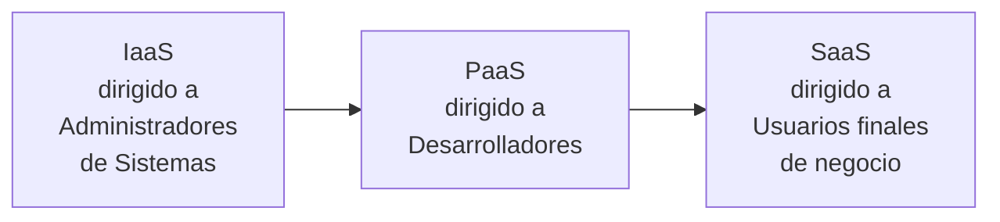
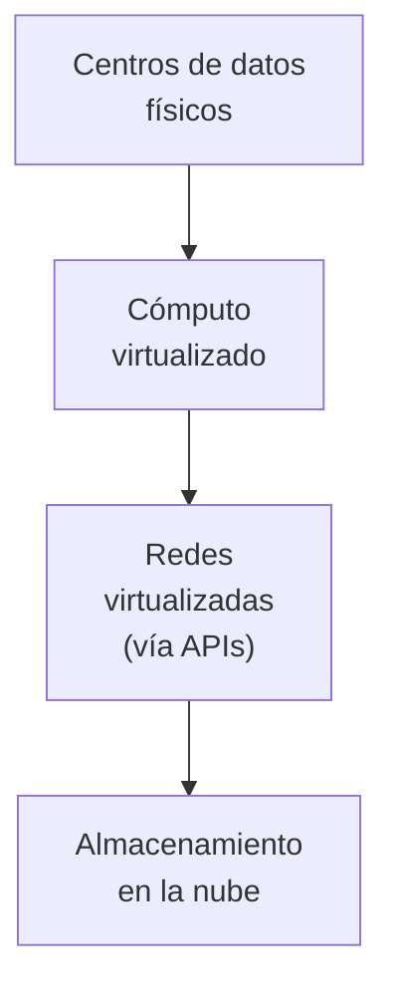
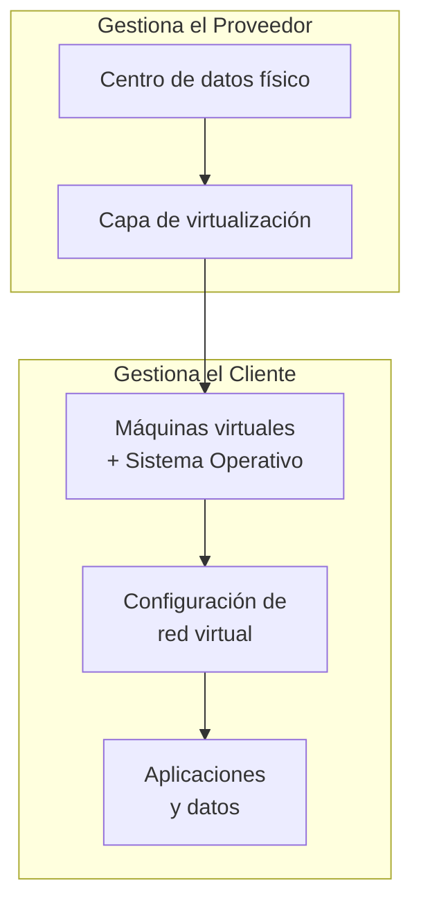
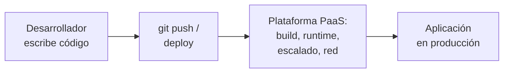
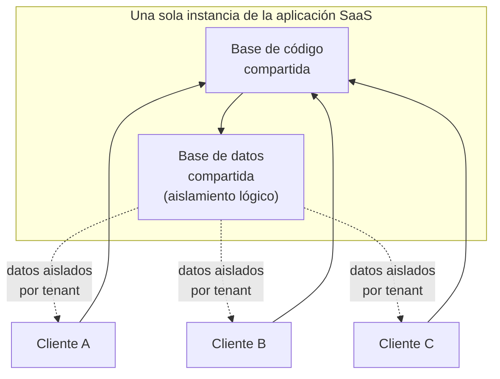
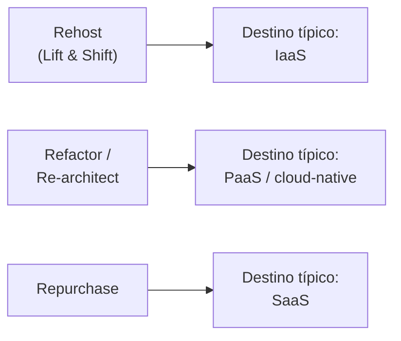
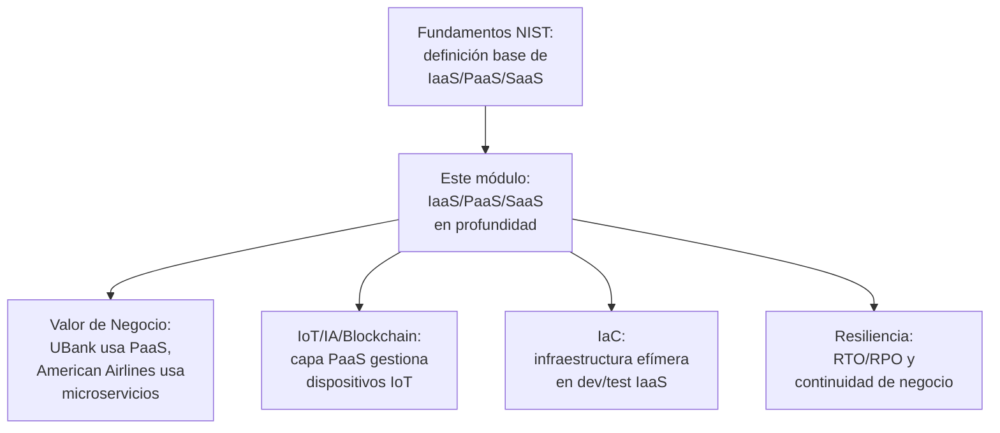

# Supernota: Modelos de Servicio en la Nube en Profundidad — IaaS, PaaS y SaaS

> [!abstract] Resumen rápido del módulo
> Los tres modelos de servicio de la nube — **IaaS**, **PaaS** y **SaaS** — se diferencian por **cuánto control técnico conserva el cliente y cuánto delega en el proveedor**, y esa delegación no es solo una decisión técnica: define quién es el usuario típico (administrador de sistemas, desarrollador, o usuario de negocio), qué tan rápido se puede lanzar algo al mercado, y qué riesgos operativos se aceptan a cambio de esa velocidad. Este módulo profundiza en **componentes de infraestructura, casos de uso reales, ventajas/riesgos y proveedores concretos** de cada modelo — fundamentos que ya se cubrieron a nivel de definición NIST en [[Supernota - Fundamentos de Cloud Computing]].

> [!note] Esta es una supernota que combina 5 resúmenes
> Recibí 5 resúmenes de lección que tratan, en conjunto, **un mismo bloque temático**: los tres modelos de servicio de la nube (uno introductorio, uno dedicado a IaaS, uno a PaaS, uno a SaaS, y un quinto que vuelve a sintetizar los tres). Siguiendo el modo "Supernota" de mis instrucciones de estilo, los combiné en un solo archivo con índice interno, en vez de generar cinco notas fragmentadas y redundantes.
>
> **Importante sobre duplicación:** la nota [[Supernota - Fundamentos de Cloud Computing]] ya desarrolló IaaS/PaaS/SaaS a nivel de definición NIST, pila tecnológica y tabla de responsabilidad por capa (su sección 2). Esta supernota **no repite esa base** — la enlaza y **añade una capa de profundidad distinta y complementaria**: componentes internos de infraestructura, tipos de almacenamiento, casos de uso concretos con su razón técnica, riesgos específicos por modelo, proveedores reales, y arquitectura multitenant de SaaS, que son el contenido nuevo que trajeron estos 5 resúmenes.

---

## Índice de esta supernota
1. [[#1. Panorama general — la pregunta de "quién controla qué"]]
2. [[#2. IaaS en profundidad]]
3. [[#3. PaaS en profundidad]]
4. [[#4. SaaS en profundidad]]
5. [[#5. Tabla comparativa consolidada]]
6. [[#6. Relación con la estrategia de adopción (las 6 R's)]]
7. [[#7. Conceptos complementarios]]
8. [[#8. Cómo se conecta este módulo con el resto del vault]]
9. [[#9. Preguntas para repasar]]
10. [[#10. Recursos recomendados]]
11. [[#11. Notas relacionadas del vault]]

---

## 1. Panorama general — la pregunta de "quién controla qué"

> [!important] Idea central del módulo
> La diferencia entre IaaS, PaaS y SaaS **no es de "calidad" o jerarquía** (SaaS no es "mejor" que IaaS) — es una diferencia de **en qué capa de la pila tecnológica se traza la línea entre lo que gestiona el proveedor y lo que gestiona el cliente** (ver la pila completa y la tabla de responsabilidad por capa en [[Supernota - Fundamentos de Cloud Computing]], sección 2.1 y 2.5). A medida que se sube de IaaS → PaaS → SaaS, el cliente cede control técnico a cambio de menor carga operativa.

### 1.1 La analogía del automóvil (del resumen original)
El resumen original usa una analogía muy efectiva para explicar la diferencia experiencial entre los tres modelos, que vale la pena preservar y precisar:

| Modelo | Analogía del resumen | Qué implica exactamente |
|---|---|---|
| **IaaS** | **Arrendar un auto** (leasing) | El usuario elige las especificaciones (marca, motor, capacidad) y es responsable del mantenimiento continuo — análogo a elegir el tipo de máquina virtual y responsabilizarse del sistema operativo y sus parches |
| **PaaS** | **Rentar un auto** (alquiler de corto plazo) | El usuario no se preocupa por detalles técnicos del vehículo (mantenimiento, seguro, revisiones) pero **sigue manejando** — análogo a que el proveedor gestione el runtime/middleware/SO, pero el cliente sigue escribiendo y operando su propio código |
| **SaaS** | **Taxi o Uber** | El usuario solo se traslada; no maneja ni se preocupa por el vehículo en absoluto — análogo a solo *usar* una aplicación ya terminada |

> [!tip] Una segunda analogía muy usada en la industria (aporte complementario)
> Un recurso visual clásico para explicar esto mismo es la analogía de **"Pizza as a Service"**, ampliamente usada en charlas y documentación de la industria: comparar hacer una pizza en casa (on-premise: tú compras todo, cocinas en tu propio horno) vs. pizza para llevar (IaaS: usas un horno/infraestructura ajena pero tú ensamblas y gestionas el resto) vs. pizza a domicilio (PaaS: solo te ocupas de decidir ingredientes/tu aplicación, el resto del proceso lo gestiona otro) vs. comer en un restaurante (SaaS: todo resuelto, tú solo consumes). No es del resumen original, pero es útil como forma alternativa de recordar el mismo concepto si la analogía del auto no resuena.

### 1.2 El eje que realmente importa: la persona que usa cada modelo
El resumen original hace una observación importante que suele pasarse por alto: **cada modelo está dirigido a un perfil de usuario distinto**, no solo a una capa técnica distinta:

Esto explica por qué, en la práctica, **una misma organización usa los tres modelos simultáneamente**: su equipo de infraestructura puede operar cargas críticas en IaaS, su equipo de desarrollo puede construir productos internos sobre PaaS, y el resto de la empresa puede usar SaaS (correo, CRM) sin saber siquiera que existe una diferencia entre los tres modelos.

---

## 2. IaaS en profundidad

> Ver la definición base de IaaS (qué capas gestiona el proveedor vs el cliente) en [[Supernota - Fundamentos de Cloud Computing]], sección 2.2. Aquí se profundiza en **cómo está construido** un servicio IaaS por dentro y **cuándo conviene usarlo**, que es el contenido nuevo aportado por este resumen.

### 2.1 Los cuatro componentes de la infraestructura en la nube
El resumen describe cuatro bloques constitutivos de cualquier oferta IaaS:

1. **Centros de datos físicos**: instalaciones reales que alojan servidores, refrigeración, energía redundante y conectividad de red — la base física sobre la que se construye todo lo demás (ver también el concepto de *Region* y *Availability Zone* en [[Supernota - Fundamentos de Cloud Computing]], sección 12.2).
2. **Cómputo virtualizado**: instancias/máquinas virtuales que se **provisionan programáticamente** (vía API o consola), con capacidades de **escalado** y **balanceo de carga** integradas — el usuario no solicita hardware físico, solicita capacidad de cómputo abstraída.
3. **Redes virtualizadas accesibles vía APIs**: en vez de configurar switches y routers físicos manualmente, el usuario define redes virtuales privadas (VPCs), subredes, reglas de firewall y balanceadores mediante llamadas a API o infraestructura como código (ver [[IaC - Infraestructura Efimera y Entrega Inmutable]]).
4. **Almacenamiento en la nube**: el resumen distingue tres formatos, siendo el de objetos el más común — se detallan en la sección 2.2 porque el resumen original los menciona sin definir sus diferencias técnicas, y es un punto clásico de confusión en exámenes.

### 2.2 Tipos de almacenamiento en la nube (aporte complementario — no definidos a fondo en el resumen)

| Tipo | Cómo organiza los datos | Acceso típico | Casos de uso | Ejemplos |
|---|---|---|---|---|
| **Almacenamiento de Objetos (Object Storage)** | Datos como "objetos" independientes (archivo + metadatos + identificador único), en un espacio de nombres plano, sin jerarquía de carpetas real | HTTP/API REST — no se puede editar un objeto "en el lugar", se reemplaza completo | Backups, archivos multimedia, data lakes, sitios estáticos, logs | Amazon S3, Azure Blob Storage, Google Cloud Storage |
| **Almacenamiento de Archivos (File Storage)** | Estructura jerárquica de carpetas y archivos, similar a un sistema de archivos tradicional | Protocolos de red compartidos (NFS, SMB) — comportamiento tipo POSIX | Sistemas que necesitan un sistema de archivos compartido entre múltiples servidores/VMs simultáneamente | Amazon EFS, Azure Files, Google Filestore |
| **Almacenamiento de Bloques (Block Storage)** | Datos divididos en "bloques" de tamaño fijo, cada uno con su propia dirección — sin metadatos ni jerarquía propia | Se monta como un volumen/disco crudo directamente a una VM, baja latencia | Discos de arranque de VMs, bases de datos que requieren I/O rápido y consistente | Amazon EBS, Azure Managed Disks, Google Persistent Disk |

> [!important] Por qué el almacenamiento de objetos es "el más común" (según el resumen)
> No es casualidad: el almacenamiento de objetos es el que mejor **escala horizontalmente** (puede crecer a exabytes sin degradar rendimiento, porque no depende de una jerarquía de carpetas que se vuelve lenta de recorrer a gran escala) y el que mejor encaja con el modelo de **pago por uso** de la nube (se paga por byte almacenado y por solicitud, sin necesidad de "aprovisionar" un tamaño de disco fijo por adelantado como en el almacenamiento de bloques).

### 2.3 Casos de uso típicos de IaaS (con su razón técnica)

**a) Entornos de prueba y desarrollo (dev/test) desechables**
Crear y destruir entornos completos en minutos, sin comprar hardware — el patrón técnico detrás es la **infraestructura efímera** (ver [[IaC - Infraestructura Efimera y Entrega Inmutable]]): un entorno de prueba puede existir solo durante la ejecución de una suite de pruebas automatizadas y desaparecer después, algo económicamente inviable con hardware físico dedicado.

**b) Continuidad del negocio y recuperación ante desastres (DR)**
El resumen menciona esto con "menor inversión tecnológica" — la razón técnica formal es que la nube permite tener una infraestructura de respaldo **en espera (standby)**, pagando solo una fracción del costo hasta el momento en que realmente se necesita activarla, en vez de mantener un centro de datos secundario completo y ocioso todo el tiempo.

> [!note] RTO y RPO — métricas formales de continuidad del negocio (aporte complementario)
> Dos métricas estándar de la industria para diseñar estrategias de DR, no mencionadas en el resumen pero indispensables para hablar de "continuidad del negocio" con precisión:
> - **RTO (Recovery Time Objective)**: cuánto tiempo *máximo* puede estar el sistema caído antes de que el impacto sea inaceptable para el negocio.
> - **RPO (Recovery Point Objective)**: cuántos datos *máximo* se pueden permitir perder, medido en tiempo (ej. "no más de 15 minutos de datos perdidos" implica respaldos cada 15 minutos o menos).
>
> Cuanto más bajos sean el RTO y el RPO exigidos, más costosa y compleja es la arquitectura de DR necesaria — la elasticidad de IaaS reduce ese costo frente al modelo on-premise tradicional, pero no lo elimina.

**c) Despliegue y escalado dinámico de aplicaciones web**
La capacidad de cómputo se ajusta según la demanda real de tráfico. Formalmente, existen dos formas de escalar, que el resumen no distingue explícitamente:

| Tipo de escalado | Qué hace | Límite práctico |
|---|---|---|
| **Escalado Vertical (Scale Up)** | Aumentar los recursos de una misma instancia (más CPU, más RAM) | Existe un techo físico por instancia; suele requerir reinicio |
| **Escalado Horizontal (Scale Out)** | Agregar más instancias en paralelo, repartiendo la carga entre ellas | Prácticamente ilimitado si la aplicación está diseñada sin estado (*stateless*); es el patrón preferido en la nube |

**d) Computación de alto rendimiento (HPC)**
El resumen cita predicciones climáticas y análisis financiero como ejemplos. Técnicamente, HPC se refiere a cargas de trabajo que requieren **cómputo paralelo masivo** por periodos cortos e intensos — ej. simulaciones de Monte Carlo para modelar riesgo de una cartera financiera, o modelos climáticos que requieren miles de núcleos de CPU/GPU corriendo simultáneamente durante horas. IaaS permite "alquilar" ese poder de cómputo masivo solo durante la simulación, en vez de comprar un supercomputador propio que estaría ocioso el resto del año.

**e) Minería de datos (Data Mining) a gran escala**
Procesar grandes volúmenes de datos históricos para descubrir patrones (ej. detección de fraude, segmentación de clientes) suele requerir clústeres temporales de procesamiento distribuido (ej. Apache Spark, Hadoop) que se aprovisionan bajo demanda sobre IaaS, se usan durante el análisis, y se liberan al terminar — conectando directamente con el patrón de infraestructura efímera ya mencionado en el punto (a).

### 2.4 Consideraciones y crecimiento del mercado
El resumen afirma que, pese a preocupaciones de transparencia y dependencia del proveedor, **IaaS es el modelo de nube de más rápido crecimiento actualmente**. Esta es una afirmación sobre el estado actual del mercado, así que se verificó con datos recientes en vez de darla por hecho:

> [!note] Verificación con datos actuales (2026) — aporte complementario
> Según proyecciones recientes de Gartner citadas en análisis de mercado, <cite index="12-1">el gasto mundial en servicios de nube pública se proyecta en 850 mil millones de dólares para 2026, un incremento del 21.3% respecto a 2025</cite>. Dentro de esa cifra, <cite index="12-2">SaaS sigue siendo el segmento más grande en ingresos, pero IaaS es el segmento de más rápido crecimiento, expandiéndose cerca de 31% anual, impulsado por cargas de trabajo de entrenamiento e inferencia de IA, mientras que PaaS crece a un ritmo intermedio</cite>. Esto **confirma la afirmación del resumen** de que IaaS es actualmente el modelo de más rápido crecimiento, con el matiz adicional (no mencionado en el resumen, y relevante en 2026) de que buena parte de ese crecimiento está impulsado específicamente por demanda de cómputo para IA, no solo por adopción general de nube.

### 2.5 Diagrama de componentes IaaS

---

## 3. PaaS en profundidad

> Ver la definición base de PaaS en [[Supernota - Fundamentos de Cloud Computing]], sección 2.3. Aquí se profundiza en **qué servicios concretos incluye una plataforma PaaS**, sus casos de uso específicos y el trade-off riesgo/velocidad, que es el aporte nuevo de este resumen.

### 3.1 El nivel de abstracción de PaaS
PaaS elimina la complejidad de **configurar infraestructura y tecnologías de soporte** — el desarrollador escribe código y lo despliega; el proveedor resuelve automáticamente todo lo que hay debajo (sistema operativo, parches, balanceo, redes). Además de la infraestructura de ejecución, una plataforma PaaS moderna suele incluir servicios adicionales listos para consumir vía API:

- Almacenamiento gestionado (bases de datos como servicio)
- Mensajería (colas, *pub/sub*)
- Gestión de usuarios (autenticación, autorización)
- Análisis y monitoreo integrado

> [!tip] Esto conecta con "no reinventar la rueda"
> Este catálogo de servicios adicionales es exactamente el mecanismo detrás del concepto de **API Economy** y "no reinventar la rueda" ya desarrollado en [[Supernota - Valor de Negocio de la Nube y Casos de Estudio]], sección 2.1 y 8.3 — PaaS es, en la práctica, la forma más directa en que un equipo de desarrollo consume esas capacidades listas sin construirlas desde cero.

### 3.2 Casos de uso de PaaS (con su razón técnica)

| Caso de uso | Por qué PaaS encaja bien |
|---|---|
| **Desarrollo y gestión de APIs y microservicios** | PaaS suele incluir *gateways* de API, escalado automático por servicio y *service discovery* integrados — reduce la infraestructura que un equipo de [[Microservicios Nativos en la Nube]] tendría que construir manualmente |
| **Despliegues de IoT** | Servicios PaaS especializados (ver capa de Nube/Plataforma en [[Supernota - IoT, IA y Blockchain en la Nube]], sección 2.2) gestionan registro de dispositivos, ingesta y autenticación sin que el equipo construya esa infraestructura desde cero |
| **Análisis de datos para inteligencia de negocios (BI)** | Servicios de analítica gestionada permiten consultar y visualizar datos sin operar clústeres de procesamiento propios |
| **Gestión de procesos de negocio (BPM) y datos maestros (MDM)** | *(términos no definidos en el resumen — ver ampliación abajo)* |

> [!note] BPM y MDM — términos del resumen sin definir (aporte complementario)
> - **BPM (Business Process Management)**: disciplina y conjunto de herramientas para modelar, automatizar y monitorear procesos de negocio de punta a punta (ej. el flujo completo de aprobación de un crédito bancario) — en PaaS, suele ofrecerse como motor de *workflows* configurable sin escribir todo el código desde cero.
> - **MDM (Master Data Management)**: disciplina para mantener una **fuente única de verdad** sobre entidades centrales del negocio (ej. "cliente", "producto") cuando esos datos existen duplicados en múltiples sistemas — evita que, por ejemplo, el mismo cliente tenga datos de contacto distintos en el sistema de ventas y en el de soporte.

### 3.3 Ventajas y riesgos de PaaS

| Ventajas | Riesgos |
|---|---|
| Escalabilidad rápida (heredada de la infraestructura subyacente gestionada) | **Dependencia del proveedor** (*vendor lock-in* — ver [[Supernota - Fundamentos de Cloud Computing]], sección 9.5): el código suele acoplarse a APIs propietarias de la plataforma |
| Reducción de código necesario (menos "código de fontanería" de infraestructura) | Posibles interrupciones por fallos de la infraestructura del proveedor, fuera del control del cliente |
| Mayor agilidad para experimentar con nuevas tecnologías sin inversión previa | Falta de control sobre cambios en el servicio (el proveedor puede modificar o descontinuar una versión de la plataforma) |
| Menor tiempo de lanzamiento al mercado (*Time to Market*) | Menor flexibilidad para personalizaciones muy específicas de bajo nivel, frente a IaaS |

> [!warning] El trade-off central de PaaS
> Cada ventaja de PaaS tiene un riesgo espejo: se gana velocidad y se pierde control granular. Esto es coherente con el patrón general ya visto en [[Supernota - Fundamentos de Cloud Computing]] (sección 2.5, "Regla mnemotécnica IaaS→PaaS→SaaS") — no es un defecto exclusivo de PaaS, es el mismo principio aplicado a este nivel específico de la pila.

### 3.4 Proveedores destacados de PaaS (del resumen, con nota técnica adicional)

| Proveedor | Nota técnica adicional |
|---|---|
| **AWS Elastic Beanstalk** | PaaS "clásico" — orquesta automáticamente instancias EC2, balanceadores y escalado a partir del código subido, sin exponer la infraestructura subyacente al desarrollador |
| **IBM Cloud Paks** | Conjunto de software containerizado sobre Red Hat OpenShift, orientado a modernizar aplicaciones empresariales existentes hacia la nube híbrida |
| **Microsoft Azure (App Service)** | PaaS integrado con el resto del ecosistema Azure/Microsoft (Active Directory, DevOps) |
| **Red Hat OpenShift** | *(aporte complementario)* técnicamente es una plataforma PaaS construida **sobre Kubernetes** — difumina la línea entre PaaS tradicional y CaaS (*Containers as a Service*, ya mencionado en [[Supernota - Fundamentos de Cloud Computing]], sección 2.6): el desarrollador despliega contenedores, pero la plataforma gestiona el ciclo de vida, escalado y *networking* como lo haría un PaaS clásico |

### 3.5 Diagrama del flujo de desarrollo en PaaS

---

## 4. SaaS en profundidad

> Ver la definición base de SaaS en [[Supernota - Fundamentos de Cloud Computing]], sección 2.4. Aquí se profundiza en la **arquitectura multitenant** (mencionada en el resumen sin desarrollarse técnicamente) y en los límites reales de personalización, que es el aporte nuevo de este resumen.

### 4.1 Arquitectura Multitenant — la característica técnica que define a SaaS
El resumen indica que SaaS tiene "infraestructura y código centralizados y accesibles para todos los usuarios" — esto es la definición informal de **arquitectura multitenant (multi-inquilino)**, el concepto técnico más importante de esta sección:

> [!important] Definición técnica formal de Multitenancy
> Un modelo de arquitectura de software en el que **una única instancia de la aplicación y su infraestructura subyacente sirve a múltiples clientes (tenants)**, manteniendo los datos de cada uno **lógicamente aislados** entre sí, aunque compartan físicamente la misma base de código, y frecuentemente la misma base de datos. Es distinto del modelo *single-tenant*, donde cada cliente tiene su propia instancia dedicada de la aplicación.

| | **Multitenant (típico de SaaS)** | **Single-Tenant** |
|---|---|---|
| Infraestructura | Compartida entre todos los clientes | Dedicada por cliente |
| Costo por cliente | Bajo (economía de escala repartida) | Alto (infraestructura duplicada por cliente) |
| Velocidad de actualización | Todos los clientes reciben la misma versión simultáneamente | Cada cliente puede quedar en versiones distintas |
| Aislamiento de datos | Lógico (a nivel de aplicación/base de datos) | Físico (instancias separadas) |
| Personalización posible | Limitada (dentro de lo que la plataforma permite configurar) | Alta (se puede modificar la instancia dedicada) |

> [!warning] El problema del "vecino ruidoso" (*Noisy Neighbor*) — aporte complementario
> Un riesgo técnico específico de la arquitectura multitenant: si un cliente (*tenant*) consume una cantidad desproporcionada de recursos compartidos (ej. una consulta muy pesada a la base de datos compartida), puede degradar el rendimiento para **el resto de los clientes** en la misma infraestructura, aunque estén lógicamente aislados. Los proveedores de SaaS maduros mitigan esto con límites de consumo (*throttling*), particionamiento de bases de datos por grupos de clientes (*sharding*), y monitoreo por *tenant*.

### 4.2 Personalización vs. Configuración — una distinción exacta que el resumen no hace
El resumen menciona que "las personalizaciones suelen ser limitadas, pero algunas permiten ajustes como branding y configuración de campos". Vale la pena precisar la diferencia técnica exacta entre dos términos que se confunden con frecuencia:

- **Configuración (Configuration)**: ajustar opciones **ya previstas** por la aplicación (activar/desactivar un módulo, cambiar un logo, agregar un campo personalizado dentro de un esquema predefinido) — no requiere modificar el código fuente, y es totalmente compatible con el modelo multitenant.
- **Personalización/Customización (Customization)**: modificar el **comportamiento o código** de la aplicación más allá de lo previsto por el proveedor — en un modelo SaaS multitenant puro esto es normalmente **imposible o muy limitado**, precisamente porque todos los clientes comparten la misma base de código; permitir personalización profunda por cliente rompe la premisa de "una sola versión para todos" que hace viable el modelo de costos de SaaS.

### 4.3 Casos de uso de SaaS
Procesos empresariales estándar donde la funcionalidad requerida es prácticamente idéntica entre organizaciones (por lo que no se pierde mucho al no poder personalizar profundamente): correo electrónico, CRM, gestión de recursos humanos, comercio electrónico.

### 4.4 Seguridad y propiedad de los datos
El resumen menciona preocupaciones sobre seguridad y propiedad de datos en SaaS, sin resolverlas — esto es exactamente lo que ya cubre el **Modelo de Responsabilidad Compartida** desarrollado en [[Supernota - Fundamentos de Cloud Computing]], sección 8: en SaaS, el proveedor gestiona la seguridad de *toda* la pila técnica, pero **la clasificación y protección de los datos, y la gestión de identidad y accesos de los usuarios de la organización, siguen siendo responsabilidad del cliente** — un error común es asumir que "SaaS = el proveedor se encarga de todo", lo cual ya se identificó como el error más costoso y frecuente en seguridad cloud en esa nota.

### 4.5 SaaS como el mayor segmento del mercado
El resumen afirma que SaaS "es la mayor parte del mercado en la nube" — esto también se verificó con datos actuales: <cite index="12-2">SaaS captura aproximadamente 54% de los ingresos de la nube en 2026</cite>, lo que confirma la afirmación del resumen, aunque **el crecimiento porcentual más rápido en 2026 corresponde a IaaS** (ver sección 2.4) — SaaS es el segmento más grande en tamaño absoluto, pero ya no el de crecimiento más acelerado.

### 4.6 Diagrama de arquitectura multitenant

---

## 5. Tabla comparativa consolidada

| Dimensión | IaaS | PaaS | SaaS |
|---|---|---|---|
| Analogía (resumen) | Arrendar un auto | Rentar un auto | Taxi / Uber |
| Usuario típico | Administrador de sistemas | Desarrollador | Usuario final de negocio |
| Qué gestiona el proveedor | Infraestructura física + virtualización | + SO, middleware, runtime | + Aplicación completa |
| Qué gestiona el cliente | SO, middleware, runtime, datos, apps | Datos y código de aplicación | Solo configuración de uso |
| Escalabilidad | Manual o automatizada por el cliente (IaC, autoscaling groups) | Automática, gestionada por la plataforma | Automática, invisible para el usuario |
| Velocidad de lanzamiento (*Time to Market*) | Menor (más por construir) | Media-alta | Máxima (ya está construido) |
| Control técnico | Máximo | Medio | Mínimo |
| Riesgo principal | Carga operativa alta para el cliente | *Vendor lock-in* de plataforma | Dependencia total + personalización limitada |
| Ejemplos | AWS EC2, Azure VMs, GCE | Elastic Beanstalk, Azure App Service, OpenShift, IBM Cloud Paks | Gmail, Salesforce, Microsoft 365 |
| Segmento de mercado 2026 | Más pequeño en tamaño, pero **de más rápido crecimiento** (~31% anual, impulsado por IA) | Crecimiento intermedio | El más grande en ingresos (~54% del total) |

---

## 6. Relación con la estrategia de adopción (las 6 R's)

Los tres modelos de servicio no son solo una taxonomía técnica: son también **destinos posibles** dentro del marco de las 6 R's de migración ya desarrollado en [[Supernota - Fundamentos de Cloud Computing]], sección 7.2:

- **Rehost** casi siempre migra hacia **IaaS**, porque el objetivo es mover la aplicación tal cual, sin rediseñarla, y solo IaaS ofrece ese nivel de control equivalente al on-premise.
- **Refactor/Re-architect** apunta naturalmente hacia **PaaS** (o arquitecturas serverless/CaaS, ver [[Supernota - Fundamentos de Cloud Computing]], sección 2.6), porque justamente busca aprovechar capacidades cloud-native que PaaS ofrece de forma gestionada.
- **Repurchase** es, por definición, adoptar **SaaS**: reemplazar una aplicación propia por un producto ya construido.

Este cruce no está en ninguno de los dos módulos por separado — es una conexión que solo se ve al analizar ambos módulos juntos.

---

## 7. Conceptos complementarios (no cubiertos en los resúmenes originales)

### 7.1 El espectro "XaaS" (Anything as a Service)
IaaS, PaaS y SaaS son los tres modelos formales del NIST, pero la industria ha extendido el mismo patrón a prácticamente cualquier capa técnica: **DBaaS** (Database as a Service, ej. Amazon RDS), **DaaS** (Desktop as a Service), **MBaaS** (Mobile Backend as a Service), y los ya mencionados **FaaS** y **CaaS** (ver [[Supernota - Fundamentos de Cloud Computing]], sección 2.6). El patrón subyacente es siempre el mismo: tomar una capa específica de la pila tecnológica y ofrecerla bajo el modelo de consumo de la nube (bajo demanda, medido, elástico).

### 7.2 La metodología "12-Factor App" — especialmente relevante para PaaS
Marco de referencia de la industria (originado en Heroku, uno de los pioneros de PaaS) que define **12 principios** para construir aplicaciones que aprovechen correctamente un entorno PaaS — por ejemplo: mantener la configuración en variables de entorno (no en el código), tratar los procesos como **sin estado** (*stateless*, indispensable para el escalado horizontal visto en la sección 2.3), y exponer servicios vía puertos en vez de depender de la inyección de un servidor específico. Una aplicación que no sigue estos principios suele ser difícil de desplegar bien en un entorno PaaS, aunque técnicamente "funcione".

### 7.3 Escalabilidad horizontal como requisito de diseño, no solo de infraestructura
Ya se definió la diferencia técnica entre escalado horizontal y vertical en la sección 2.3 — vale la pena remarcar que el escalado horizontal **no es automático solo por estar en la nube**: requiere que la aplicación esté diseñada para ser *stateless* (sin guardar sesión/estado en la memoria de una instancia específica), de modo que cualquier instancia pueda atender cualquier solicitud. Esta es una de las razones por las que migrar una aplicación monolítica antigua a la nube (Rehost) no automáticamente le da la misma elasticidad que una aplicación diseñada nativamente para la nube (Refactor).

### 7.4 Multitenancy más allá de SaaS
Aunque el resumen presenta la arquitectura multitenant como una característica exclusiva de SaaS, técnicamente **también existe en IaaS y PaaS**: cuando el NIST define *Resource Pooling* como característica esencial (ver [[Supernota - Fundamentos de Cloud Computing]], sección 1), está describiendo multitenancy a nivel de infraestructura física — la diferencia es la **capa** en la que ocurre: en IaaS/PaaS, el multitenant ocurre a nivel de hardware/virtualización (el cliente ni lo percibe); en SaaS, ocurre a nivel de la propia aplicación (el cliente comparte literalmente la misma instancia de software que otros clientes).

---

## 8. Cómo se conecta este módulo con el resto del vault

Este módulo funciona como el **"cómo por dentro"** de una distinción que otras notas del vault ya usaban de forma más superficial: cuando [[Supernota - Valor de Negocio de la Nube y Casos de Estudio]] explica que **UBank usó PaaS** para empoderar a sus desarrolladores, esta supernota es la que explica **técnicamente por qué** eso funciona (menos capas de infraestructura que gestionar = menos fricción, sección 3.1 y 3.3). De la misma forma, la arquitectura multitenant de SaaS (sección 4.1) es el mecanismo técnico concreto detrás del **Resource Pooling** del NIST ya visto en [[Supernota - Fundamentos de Cloud Computing]], aplicado a la capa de aplicación en vez de a la capa de infraestructura.

---

## 9. Preguntas para repasar (auto-evaluación)

- [ ] ¿Puedes explicar la analogía del auto (arrendar / rentar / taxi) y mapearla correctamente a IaaS, PaaS y SaaS?
- [ ] ¿Cuál es la diferencia técnica exacta entre almacenamiento de objetos, archivos y bloques? ¿Cuándo usarías cada uno?
- [ ] ¿Por qué el almacenamiento de objetos es el formato más común en la nube?
- [ ] ¿Qué son RTO y RPO, y cómo influyen en el diseño de una estrategia de continuidad del negocio sobre IaaS?
- [ ] ¿Cuál es la diferencia exacta entre escalado horizontal y vertical? ¿Cuál tiene mejor techo práctico en la nube y por qué?
- [ ] ¿Por qué HPC y minería de datos son buenos casos de uso para IaaS específicamente (y no tanto para SaaS)?
- [ ] ¿Qué son BPM y MDM, y por qué encajan como casos de uso de PaaS?
- [ ] ¿Cuál es el trade-off central entre las ventajas y los riesgos de adoptar PaaS?
- [ ] ¿Qué es la arquitectura multitenant, y en qué se diferencia del modelo single-tenant?
- [ ] ¿Qué es el problema del "vecino ruidoso" y cómo se mitiga en SaaS?
- [ ] ¿Cuál es la diferencia exacta entre "configuración" y "personalización" en el contexto de SaaS, y por qué esa distinción importa para el modelo de negocio del proveedor?
- [ ] ¿Cómo se relacionan las 6 R's de migración con la elección de IaaS, PaaS o SaaS como destino?
- [ ] Según los datos más recientes de mercado (2026), ¿cuál modelo es el más grande en ingresos y cuál es el de más rápido crecimiento? ¿Por qué no son el mismo?

---

## 10. Recursos recomendados para profundizar

- 🌐 [AWS — Tipos de almacenamiento en la nube](https://aws.amazon.com/what-is/cloud-storage/) — comparativa oficial de almacenamiento de objetos, archivos y bloques.
- 🌐 [The Twelve-Factor App](https://12factor.net/) — la metodología original completa, referencia obligada para diseñar aplicaciones aptas para PaaS.
- 🌐 [Red Hat OpenShift — documentación oficial](https://www.redhat.com/en/technologies/cloud-computing/openshift) — para entender la frontera entre PaaS y CaaS.
- 🌐 [NIST SP 800-145](https://nvlpubs.nist.gov/nistpubs/Legacy/SP/nistspecialpublication800-145.pdf) — ya citado en [[Supernota - Fundamentos de Cloud Computing]], sigue siendo la referencia formal de los tres modelos de servicio.
- 🌐 [Gartner — Forecast: Public Cloud Services, Worldwide](https://www.gartner.com/en/documents/8045433) — fuente de las cifras de crecimiento de mercado por segmento citadas en la sección 2.4 y 4.5.
- 📘 *Cloud Computing: Concepts, Technology & Architecture* — Thomas Erl (ya recomendado en [[Supernota - Fundamentos de Cloud Computing]]; incluye capítulos dedicados a multitenancy y patrones de arquitectura por modelo de servicio).

---

## 11. Notas relacionadas del vault
- [[Supernota - Fundamentos de Cloud Computing]]
- [[Supernota - Valor de Negocio de la Nube y Casos de Estudio]]
- [[Supernota - IoT, IA y Blockchain en la Nube]]
- [[Microservicios Nativos en la Nube]]
- [[IaC - Infraestructura Efimera y Entrega Inmutable]]
- [[Resiliencia y Diseño para el Fallo]]

---
#devops #cloud-computing #iaas #paas #saas #modelos-de-servicio
