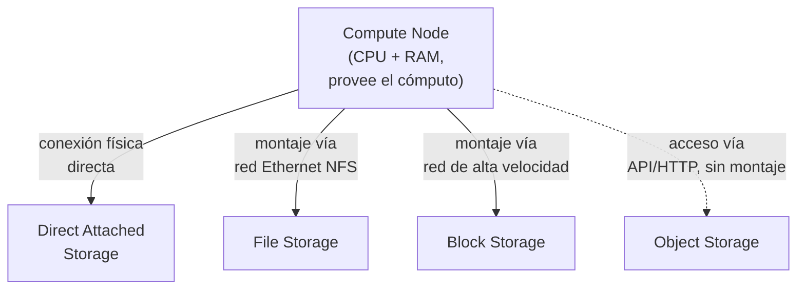
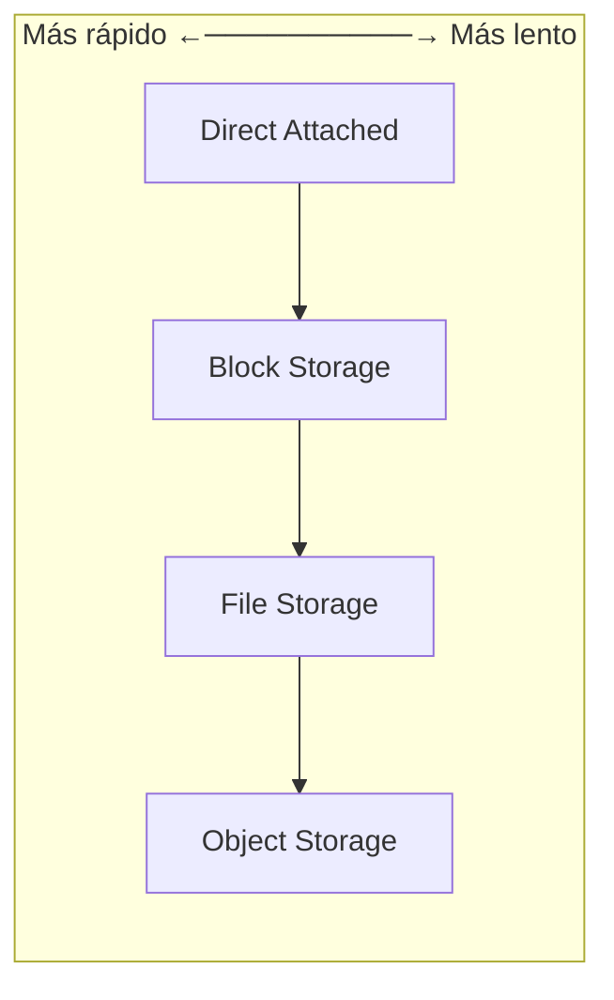
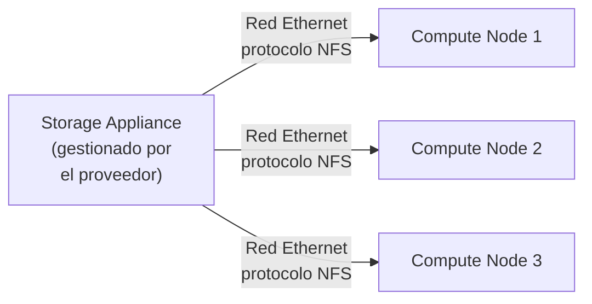
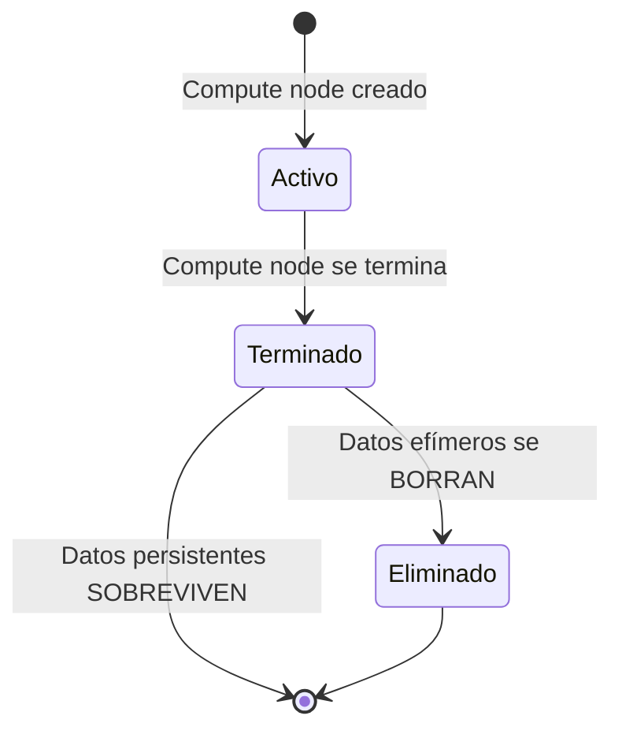
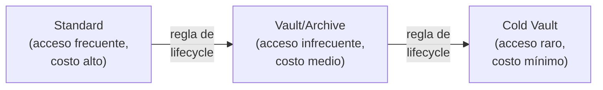
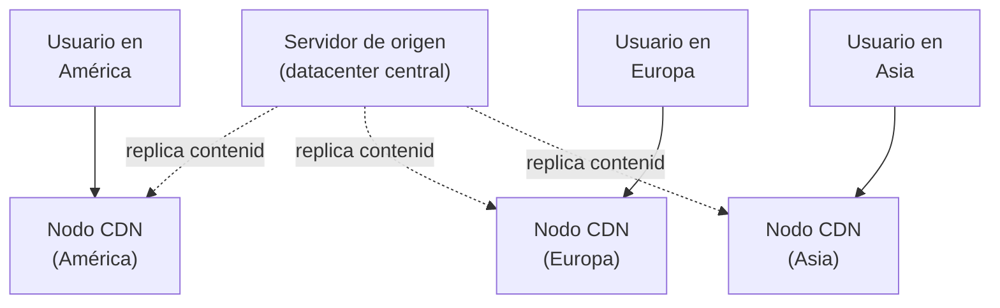
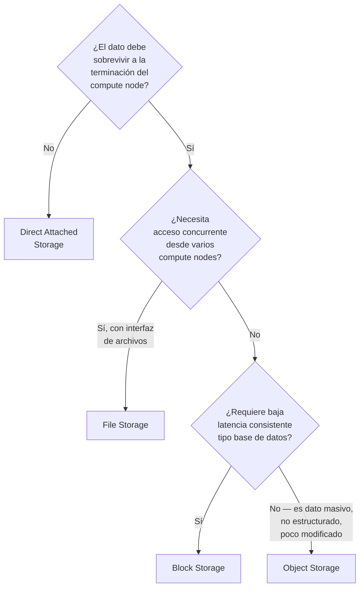
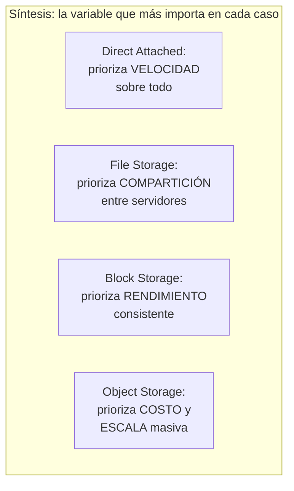
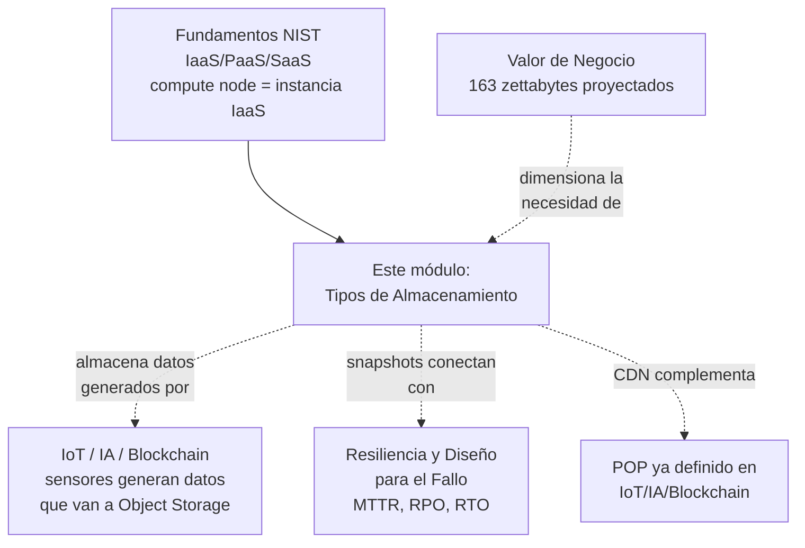

# Supernota: Almacenamiento en la Nube (Cloud Storage) — Tipos, Arquitectura y Casos de Uso

> [!abstract] Resumen rápido del módulo
> El almacenamiento en la nube no es "un" servicio sino **cuatro modelos distintos** (Direct Attached, File, Block, Object) que resuelven necesidades muy diferentes de **velocidad, costo, capacidad de compartición y persistencia**. La decisión correcta depende de responder tres preguntas: ¿el dato necesita velocidad extrema (Block) o compartición entre muchos servidores (File)? ¿es masivo, no estructurado y poco modificado (Object)? ¿debe sobrevivir a la terminación del servidor que lo usa (persistente) o no (efímero)? Todo esto se conecta con el concepto de **compute node**, la unidad de cómputo a la que casi todo este almacenamiento se conecta o desde la cual se accede.

> [!note] Esta es una supernota que combina varios resúmenes
> Este archivo combina **siete resúmenes de lección** (originalmente en inglés, traducidos aquí al español) sobre tipos de almacenamiento en la nube, más una **explicación adicional de "compute node"** que pediste explícitamente y que ninguno de los resúmenes originales define con precisión — así que se trata como una sección propia y necesaria para entender todo lo demás. Los términos técnicos se mantienen en inglés (como indica tu estilo de notas), con su definición en español la primera vez que aparecen.

---

## Índice de esta supernota
1. [[#1. Compute Node — el concepto base que conecta todo el almacenamiento]]
2. [[#2. Panorama general — los cuatro modelos de almacenamiento en la nube]]
3. [[#3. Direct Attached Storage]]
4. [[#4. File Storage vía NFS]]
5. [[#5. Block Storage]]
6. [[#6. IOPS y rendimiento de almacenamiento]]
7. [[#7. Persistencia vs. Efímero]]
8. [[#8. Object Storage]]
9. [[#9. Niveles de acceso (tiers) en Object Storage]]
10. [[#10. Snapshots y estrategias de backup]]
11. [[#11. CDN — Content Delivery Network]]
12. [[#12. Cómo elegir el tipo de almacenamiento correcto]]
13. [[#13. Resumen comparativo final entre los cuatro tipos de almacenamiento]]
14. [[#14. Conceptos complementarios]]
15. [[#15. Cómo se conecta este módulo con el resto del vault]]
16. [[#16. Preguntas para repasar]]
17. [[#17. Recursos recomendados]]
18. [[#18. Notas relacionadas del vault]]

---

## 1. Compute Node — el concepto base que conecta todo el almacenamiento

> [!note] Contenido agregado — no estaba en tus resúmenes
> Ninguno de los siete resúmenes originales define qué es un **compute node**, aunque lo mencionan constantemente ("debe conectarse a un compute node", "montado en un compute node a la vez"). Lo explico aquí primero porque es la pieza que le da sentido a todo lo demás: cada tipo de almacenamiento se diferencia, en el fondo, por **cómo se relaciona con un compute node**.

Un **compute node (nodo de cómputo)** es una unidad de procesamiento dentro de la infraestructura de la nube que provee **CPU, memoria RAM y capacidad de ejecución** para correr sistemas operativos, aplicaciones o cargas de trabajo — es, en esencia, "un servidor" en su forma más abstracta, ya sea:

- Una **máquina virtual** (ej. una instancia EC2 de AWS, una VM de Azure) corriendo sobre un hipervisor (ver [[Supernota - Fundamentos de Cloud Computing]], sección de virtualización).
- Un **contenedor** orquestado por Kubernetes (ver [[Microservicios Nativos en la Nube]]).
- En casos menos comunes, un servidor físico dedicado ("bare metal").

Un compute node **por sí solo no tiene almacenamiento "de fábrica"** más allá de un disco local mínimo — necesita que se le **conecte (attach)** o se le dé **acceso vía red/API** a algún tipo de almacenamiento externo para guardar datos de forma útil. Esa es exactamente la variable que distingue a los cuatro tipos de almacenamiento que cubre este módulo:

| Tipo de almacenamiento | Relación con el compute node |
|---|---|
| **Direct Attached Storage** | Conectado *directamente* al hardware del compute node — nace y muere con él |
| **File Storage** | Se **monta** vía red (NFS) en **uno o varios** compute nodes simultáneamente |
| **Block Storage** | Se **monta** como volumen vía red de alta velocidad, típicamente en **un solo** compute node a la vez |
| **Object Storage** | **No se monta** en ningún compute node — se accede vía **API/HTTP**, independientemente de si hay o no un compute node activo |

> [!important] Por qué este concepto es la clave de todo el módulo
> Cada una de las diferencias que verás más adelante (velocidad, capacidad de compartirse entre servidores, si sobrevive o no a un reinicio) **se explica directamente por qué tan "cerca" o "lejos" está el almacenamiento del compute node**. Direct Attached está pegado al hardware (más rápido, pero atado a ese servidor específico); Object Storage vive completamente desacoplado de cualquier compute node (más lento por red, pero accesible desde cualquier lugar sin depender de que un servidor específico exista).

Esto conecta directamente con el modelo **IaaS** ya visto en [[Supernota - Fundamentos de Cloud Computing]]: cuando alquilas infraestructura como servicio (ej. AWS EC2), lo que estás alquilando es literalmente un compute node — y una de las primeras decisiones de arquitectura es **qué tipo de almacenamiento conectarle**.

---

## 2. Panorama general — los cuatro modelos de almacenamiento en la nube

Antes de entrar al detalle de cada uno (como piden tus resúmenes originales), aquí va la vista de conjunto — útil para no perder el hilo mientras se profundiza en cada sección:

| Característica | Direct Attached | File Storage | Block Storage | Object Storage |
|---|---|---|---|---|
| **Cómo se accede** | Conexión física directa al compute node | Montaje de red (NFS) | Montaje de red de alta velocidad (fibra) | API / HTTP (ej. REST tipo S3) |
| **Velocidad** | Muy rápida | Media (depende de la red Ethernet) | Rápida y consistente | Lenta (segundos a horas según el tier) |
| **Compartible entre compute nodes** | No | Sí, múltiples nodos simultáneamente | Típicamente no (uno a la vez) | No aplica — no se "monta" en nodos |
| **Persistencia** | Efímero (normalmente) | Persistente | Persistente | Persistente |
| **Costo relativo** | Incluido/bajo | Medio | Medio-alto | Muy bajo por GB |
| **Capacidad típica** | Limitada al servidor | Escalable | Se provisiona por volumen | Prácticamente ilimitada |
| **Caso de uso típico** | Sistema operativo del servidor | Recursos compartidos, sitios web, archivos departamentales | Bases de datos, servidores de correo | Datos no estructurados, backups, video, IoT |

> [!tip] Regla mental para no confundir los cuatro tipos
> Piensa en la pregunta: **"¿A cuántos compute nodes necesito que este dato le hable, y qué tan rápido necesito que responda?"**
> - ¿Solo a este servidor, lo más rápido posible, y no me importa perderlo? → **Direct Attached**.
> - ¿A muchos servidores a la vez, compartiendo los mismos archivos? → **File Storage**.
> - ¿A un solo servidor, pero necesito velocidad de base de datos? → **Block Storage**.
> - ¿No necesito velocidad, necesito capacidad casi infinita y acceso desde cualquier aplicación vía internet? → **Object Storage**.

---

## 3. Direct Attached Storage

> [!note] Origen en tu resumen
> Esta sección viene del primer resumen que subiste ("This course content explains the different types of cloud storage...").

**Direct Attached Storage (almacenamiento de conexión directa)**, también llamado *Local Storage*, es almacenamiento **conectado físicamente al hardware del compute node**, sin pasar por una red intermedia. Es el disco "local" del servidor virtual.

**Características centrales (de tu resumen):**
- Es el tipo de almacenamiento **más rápido** de los cuatro, precisamente porque no hay red de por medio — la latencia es la del bus interno del servidor, no la de una red Ethernet o de fibra.
- Se usa típicamente para alojar el **sistema operativo** del compute node.
- Es **efímero** (ver sección 7): si el compute node se termina, los datos en Direct Attached Storage **desaparecen con él**.
- **No es compartible**: pertenece exclusivamente a ese compute node, no puede montarse en otro servidor.

**Ejemplo real (aporte adicional):** en AWS, esto corresponde al concepto de *Instance Store* — discos físicamente conectados al host donde corre la instancia EC2; en Azure, el *Temporary Storage* de una VM. En ambos casos, la documentación oficial advierte explícitamente que **no se debe usar para datos que necesiten sobrevivir a un reinicio o terminación de la instancia**.

> [!warning] Error común
> Usar Direct Attached Storage para guardar datos de negocio "porque es más rápido" sin entender que es efímero es una causa frecuente de **pérdida de datos irreversible** en arquitecturas mal diseñadas — especialmente en entornos donde las instancias se terminan y recrean automáticamente (ej. *auto-scaling groups*, ver conceptos de infraestructura efímera en [[IaC - Infraestructura Efimera y Entrega Inmutable]]).

---

## 4. File Storage vía NFS

> [!note] Origen en tu resumen
> Esta sección combina el resumen general de storage y el resumen dedicado específicamente a "File Storage Overview".

**File Storage (almacenamiento de archivos)** es almacenamiento que se accede mediante un sistema de archivos tradicional (carpetas, rutas), pero **remoto** — vive fuera del compute node y se conecta a él vía red.

### 4.1 Arquitectura y conectividad
Según tu resumen, File Storage se monta desde **remote storage appliances (dispositivos de almacenamiento remoto)** — hardware especializado gestionado por el proveedor de la nube — y se conecta a los compute nodes a través de una **red Ethernet**, usando el protocolo **NFS (Network File System)**.

### 4.2 Características (de tu resumen)
- Suele ser **más económico**, más **resiliente a fallos**, y requiere **menos gestión de disco** que el Direct Attached Storage.
- Los appliances ofrecen características de seguridad como **cifrado en tránsito (encryption in transit)**.
- La velocidad de la red Ethernet puede variar, por lo que File Storage es adecuado para cargas de trabajo donde **una velocidad alta y consistente no es crítica**.
- Puede montarse en **múltiples compute nodes simultáneamente** — su ventaja distintiva frente a Block Storage.
- Casos de uso típicos: **recursos compartidos departamentales** (*departmental file shares*) y **repositorios de servicios web**.

### 4.3 IOPS en File Storage
Tu resumen introduce aquí el concepto de **IOPS (Input/Output Operations Per Second)** — se desarrolla en profundidad en la sección 6, pero el punto clave de este resumen es: IOPS mide la **velocidad del disco al leer/escribir**, **no la velocidad de la red** — son dos cuellos de botella distintos y hay que dimensionar ambos.

> [!tip] Analogía para "compartible" en File Storage
> Piensa en File Storage como una **carpeta compartida en red de una oficina**: varias computadoras (compute nodes) pueden abrir, leer y escribir en los mismos archivos al mismo tiempo, porque todos apuntan al mismo servidor de archivos central — a diferencia de un disco duro conectado por USB a una sola laptop (Direct Attached).

**Ejemplos reales (aporte adicional):** AWS EFS (Elastic File System), Azure Files, Google Cloud Filestore — todos implementan esencialmente este patrón: un sistema de archivos gestionado, montable vía NFS (o SMB en el caso de Azure Files, el protocolo equivalente en entornos Windows) en múltiples instancias de cómputo a la vez.

---

## 5. Block Storage

> [!note] Origen en tu resumen
> Esta sección viene del resumen dedicado a "Block Storage Overview" y su comparación con File Storage.

**Block Storage (almacenamiento de bloques)** divide los datos en **bloques individuales**, cada uno almacenado bajo una **dirección única**, y debe **conectarse a un compute node antes de poder usarse** — se provisiona como **volúmenes** montables.

### 5.1 Características (de tu resumen)
- Se conecta mediante **redes de fibra de alta velocidad**, ofreciendo lectura/escritura **rápida y consistente** — de ahí que sea el estándar para cargas de trabajo que exigen baja latencia.
- Es el tipo de almacenamiento preferido para **bases de datos transaccionales** y **servidores de correo**, donde la consistencia y velocidad del I/O son críticas para el rendimiento de la aplicación.
- Se monta típicamente en **un solo compute node a la vez** (a diferencia de File Storage) — esto es clave: Block Storage prioriza **rendimiento y consistencia** sobre **compartición**.

### 5.2 Comparación directa Block vs File Storage (tal como la plantea tu resumen)

| | **Block Storage** | **File Storage** |
|---|---|---|
| Cómo se accede | Bloques con direcciones únicas, vía red de fibra | Sistema de archivos, vía red Ethernet (NFS) |
| Compute nodes simultáneos | Uno a la vez | Múltiples a la vez |
| Rendimiento | Alto, baja latencia consistente | Variable, según la red Ethernet |
| Caso de uso ideal | Bases de datos, servidores de correo | Compartición de archivos, espacios colaborativos, datos mixtos estructurados/no estructurados |
| Escenario preferido | Rendimiento y baja latencia son la prioridad | Compartición y sensibilidad al costo son la prioridad |

> Tu resumen aclara que ambos tipos ofrecen **alta disponibilidad, resiliencia y cifrado** — la diferencia central no es "seguridad" sino **patrón de acceso y rendimiento**.

### 5.3 Storage Area Network (SAN) — mención de tu último resumen, ampliada aquí
Tu resumen final menciona brevemente "storage area networks for block storage" como una opción emergente — vale la pena precisar qué es formalmente:

> [!note] SAN (Storage Area Network) — Red de Área de Almacenamiento
> Una **SAN** es una red **dedicada y de alto rendimiento** que conecta compute nodes con dispositivos de almacenamiento de bloques a nivel de bloque (no de archivo), típicamente usando protocolos como **Fibre Channel** o **iSCSI**. Es, en esencia, la infraestructura de red especializada que hace posible ofrecer Block Storage con la velocidad y consistencia descritas arriba — distinta de una red Ethernet genérica usada para File Storage (NAS, *Network Attached Storage*, el equivalente arquitectónico de File Storage).

**Ejemplos reales (aporte adicional):** AWS EBS (Elastic Block Store), Azure Managed Disks, Google Cloud Persistent Disk.

---

## 6. IOPS y rendimiento de almacenamiento

> [!note] Origen en tu resumen
> Mencionado en el resumen de File Storage y retomado en el resumen comparativo Block vs File.

**IOPS (Input/Output Operations Per Second, Operaciones de Entrada/Salida por Segundo)** mide **cuántas operaciones de lectura o escritura puede realizar un disco por segundo** — es una métrica de **velocidad del disco**, explícitamente **no** de velocidad de red (esa distinción es un punto que tu resumen marca como importante y que suele confundirse).

> [!important] Tres métricas de rendimiento que NO son lo mismo (ampliación técnica)
> Es fácil mezclar estos tres conceptos, y un examen técnico serio suele probar si sabes diferenciarlos:
> - **IOPS**: cuántas *operaciones* de I/O por segundo puede procesar el almacenamiento (relevante para muchas transacciones pequeñas, ej. bases de datos).
> - **Throughput (rendimiento de transferencia)**: cuántos *megabytes/gigabytes por segundo* se pueden mover (relevante para archivos grandes, ej. streaming de video).
> - **Latencia**: cuánto *tiempo* tarda en completarse una sola operación individual (relevante para aplicaciones sensibles a retrasos, ej. trading financiero — ver caso ActivTrades en [[Supernota Valor de negocio de la nube y casos de estudio]]).
>
> Un disco puede tener **IOPS altos pero throughput bajo** (muchas operaciones pequeñas) o viceversa (pocas operaciones, pero cada una mueve muchos datos) — dimensionar solo por una métrica sin considerar las otras dos es un error de arquitectura común.

Elegir el nivel correcto de IOPS es una decisión de costo-beneficio explícita en tu resumen: **IOPS insuficientes generan cuellos de botella** de rendimiento (la aplicación "se siente lenta"), mientras que **IOPS sobre-provisionados generan costos innecesarios** — pagar por velocidad que la aplicación nunca llega a usar.

---

## 7. Persistencia vs. Efímero

> [!note] Origen en tu resumen
> Del primer resumen general de storage.

**Persistencia (Persistence)** se refiere a si el almacenamiento **sobrevive o no a la terminación del compute node** al que estaba conectado:

| | **Almacenamiento persistente** | **Almacenamiento efímero (ephemeral)** |
|---|---|---|
| ¿Sobrevive a la terminación del compute node? | Sí | No — se elimina |
| ¿Se sigue facturando? | Sí, mientras exista | No, se detiene la facturación al eliminarse |
| Ejemplos típicos | Block Storage, File Storage, Object Storage | Direct Attached Storage |
| Cuándo usarlo | Datos que deben conservarse: bases de datos, documentos, backups | Datos temporales, cachés, archivos de sistema operativo regenerables |

> [!warning] Matiz importante que tu resumen deja implícito
> "Persistente" no significa "backup automático garantizado" — significa que el dato **no se borra automáticamente** cuando el compute node al que estaba conectado desaparece. Seguir sin tener una estrategia de **snapshots** o backups (sección 10) sobre almacenamiento persistente sigue siendo un riesgo si, por ejemplo, se borra el volumen por error humano.

---

## 8. Object Storage

> [!note] Origen en tu resumen
> Combina los dos resúmenes dedicados a Object Storage.

**Object Storage (almacenamiento de objetos)** es un modelo de almacenamiento fundamentalmente distinto a los tres anteriores: **no se monta en un compute node** — se accede mediante una **API**, típicamente una API RESTful compatible con el estándar **S3** (popularizado por Amazon S3, hoy un estándar *de facto* de la industria que otros proveedores también implementan).

### 8.1 Estructura: objetos y buckets
- Los datos se almacenan como **objetos** dentro de **buckets** — contenedores **planos (flat)**, es decir, **sin jerarquía real de carpetas** (aunque muchas interfaces simulan carpetas usando prefijos en el nombre del objeto, técnicamente no existen subdirectorios reales).
- Los buckets **no requieren un tamaño predefinido**: pueden escalar desde unos pocos bytes hasta **múltiples petabytes**, sin que el usuario tenga que "reservar" capacidad de antemano.

### 8.2 Características de rendimiento y costo
- Es el tipo de almacenamiento **más económico** (típicamente unos pocos centavos de dólar por GB al mes) y con **capacidad prácticamente ilimitada**.
- Es también el **más lento** de los cuatro — los tiempos de acceso pueden ir de **segundos a horas**, según el nivel de acceso (tier, ver sección 9).
- **No es apto** para correr sistemas operativos ni bases de datos activas — no se puede montar como un disco de arranque ni ofrece la latencia consistente que necesita una base de datos transaccional.

### 8.3 Resiliencia y disponibilidad
Los proveedores ofrecen distintos tipos de bucket según el nivel de resiliencia:
- **Single data center (un solo centro de datos)**: menor costo, menor resiliencia ante la caída de ese datacenter específico.
- **Multi-región**: los datos se replican automáticamente entre varias regiones geográficas — mayor resiliencia y disponibilidad, a mayor costo.

> [!note] Durabilidad vs Disponibilidad — distinción técnica que tu resumen no separa explícitamente (aporte adicional)
> Estos dos términos suelen confundirse en Object Storage:
> - **Durabilidad (Durability)**: la probabilidad de que un objeto **no se pierda o corrompa** a lo largo del tiempo (ej. AWS anuncia "11 nueves" de durabilidad para S3 Standard — 99.999999999%, gracias a redundancia interna automática).
> - **Disponibilidad (Availability)**: el porcentaje de tiempo en que el objeto está **accesible cuando se solicita** (típicamente expresado como un SLA, ej. 99.9%).
>
> Un objeto puede ser extremadamente durable (nunca se pierde) pero tener una disponibilidad menor (a veces no responde a tiempo) — son garantías distintas del proveedor.

### 8.4 Casos de uso ideales
Datos **no estructurados y estáticos** (que no cambian con frecuencia): documentos, audio, video, datos de IoT (ver conexión con [[Supernota - IoT, IA y Blockchain en la Nube]]), backups y archivos históricos.

**Ejemplos reales (aporte adicional):** Amazon S3, Azure Blob Storage, Google Cloud Storage.

---

## 9. Niveles de acceso (tiers) en Object Storage

> [!note] Origen en tu resumen
> Del segundo resumen dedicado a Object Storage ("storage tiers, pricing, access methods, and use cases").

Los buckets de Object Storage se dividen en **niveles (tiers)** según la **frecuencia de acceso** esperada a los datos:

| Tier | Frecuencia de acceso | Costo de almacenamiento | Tiempo de recuperación |
|---|---|---|---|
| **Standard** | Frecuente | Más alto | Inmediato |
| **Vault / Archive** | Infrecuente | Medio-bajo | Minutos a horas |
| **Cold Vault** | Rara vez | El más bajo | Horas |

> [!important] El principio económico detrás de los tiers
> El costo de almacenamiento **baja** conforme el tier es más frío, pero el costo y tiempo de **recuperación (retrieval)** de esos datos **sube** — el ahorro no es gratis, es un intercambio deliberado entre "cuánto pago por guardarlo" y "cuánto me cuesta/tarda recuperarlo cuando lo necesito". Elegir mal el tier (ej. poner datos de acceso diario en Cold Vault) puede terminar costando **más** que dejarlos en Standard, por los cargos de recuperación frecuente.

**Acceso vía API:** el resumen destaca específicamente la **API RESTful compatible con S3** como el método de acceso más común — esto permite que desarrolladores interactúen de forma consistente con el almacenamiento de **múltiples proveedores** usando esencialmente el mismo patrón de llamadas API, aunque cada uno sea técnicamente un servicio distinto (esto es, en la práctica, un mini-estándar *de facto* de la industria).

**Reglas de archivado automático (Lifecycle rules):** Object Storage permite definir reglas que **mueven automáticamente** los datos entre tiers según metadatos y patrones de acceso — por ejemplo, "mover a Cold Vault todo objeto sin accesos en los últimos 90 días". Esto evita tener que gestionar manualmente el ciclo de vida del dato.

**Ejemplo real (aporte adicional):** en AWS, esto corresponde a **S3 Lifecycle Policies**, que mueven objetos automáticamente entre S3 Standard → S3 Standard-IA (*Infrequent Access*) → S3 Glacier → S3 Glacier Deep Archive, según reglas definidas por el usuario.

---

## 10. Snapshots y estrategias de backup

> [!note] Origen en tu resumen
> El concepto de snapshot viene del primer resumen general; la comparación con Object Storage como backup viene del segundo resumen de Object Storage.

Un **snapshot (instantánea)** es un método de backup para **File Storage y Block Storage** que **captura el estado completo del almacenamiento en un momento dado**, de forma rápida y **sin tiempo de inactividad (downtime)** para la aplicación.

> [!warning] Limitación importante que marca tu resumen
> Un snapshot es útil para **restaurar todo el volumen o sistema de archivos completo** — no está diseñado para **restaurar archivos individuales** dentro de ese volumen. Si necesitas recuperar un solo archivo borrado por error, un snapshot completo es una herramienta imprecisa (aunque algunos proveedores ofrecen restauración granular sobre snapshots como funcionalidad adicional).

### 10.1 Object Storage como alternativa a backups en cinta (tape backup)
Tu segundo resumen de Object Storage señala que este tipo de almacenamiento es adecuado para **backup y recuperación ante desastres**, funcionando como una **alternativa más eficiente al backup tradicional en cinta magnética (tape backup)** — permitiendo restauración de datos basada completamente en la nube, sin depender de medios físicos rotados manualmente entre ubicaciones.

### 10.2 RPO y RTO — marco formal de la industria (aporte adicional)
No mencionado en tus resúmenes, pero es el marco estándar con el que la industria mide qué tan buena es una estrategia de backup/recuperación:

| Métrica | Qué mide | Pregunta que responde |
|---|---|---|
| **RPO (Recovery Point Objective)** | Cuántos datos como máximo se puede permitir perder, medido en tiempo | "¿Desde cuándo puedo permitirme perder datos si algo falla ahora?" |
| **RTO (Recovery Time Objective)** | Cuánto tiempo como máximo puede tardar el sistema en volver a estar operativo | "¿Cuánto tiempo puedo estar caído antes de que sea inaceptable para el negocio?" |

Un snapshot frecuente (ej. cada hora) da un **RPO bajo** (se pierde como máximo una hora de datos); un proceso de restauración rápido da un **RTO bajo**. Esto conecta directamente con el concepto de **MTTR (Mean Time To Repair)** ya visto en [[Resiliencia y Diseño para el Fallo]] y en [[Supernota - Metricas, Cultura y SRE]] — RTO es, en esencia, el objetivo de negocio detrás de la métrica técnica de MTTR.

---

## 11. CDN — Content Delivery Network

> [!note] Origen en tu resumen
> Resumen dedicado completo a CDN.

Una **CDN (Content Delivery Network, Red de Distribución de Contenido)** es un **sistema distribuido de servidores** diseñado para entregar copias en caché del contenido de un sitio web a los usuarios, según su **ubicación geográfica**, mejorando la velocidad y el rendimiento del sitio.

### 11.1 Cómo funciona
- Las CDN almacenan copias del contenido en **múltiples ubicaciones alrededor del mundo**, reduciendo la distancia física entre el usuario y el contenido.
- Cuando un usuario solicita contenido, lo recibe desde el **servidor CDN más cercano**, en vez del servidor de origen — reduciendo la latencia y los tiempos de carga.

### 11.2 Beneficios (de tu resumen)
- Los usuarios experimentan **tiempos de carga más rápidos**, gracias a la distancia reducida de ida y vuelta (*round-trip*) de los datos.
- El **servidor de origen** experimenta **menos tráfico y carga**, lo que puede mejorar el *uptime* y reduce la necesidad de sobredimensionar su capacidad.
- Las CDN **mejoran la seguridad** al **ocultar el servidor de origen** del acceso directo de usuarios (los usuarios solo interactúan con los nodos CDN, no con la infraestructura real).
- Ayudan a gestionar el acceso global de usuarios de forma eficiente, dando una experiencia **consistente sin importar la ubicación**.

> [!tip] Conexión con el concepto de POP ya visto en el vault
> Los nodos distribuidos que forman una CDN son, técnicamente, **POPs (Points of Presence, Puntos de Presencia)** — concepto ya definido en [[Supernota - IoT, IA y Blockchain en la Nube]] (sección de glosario): infraestructura de red que acerca la conectividad al usuario final sin necesitar un datacenter de cómputo completo en cada ubicación. Una CDN es, en esencia, **una red de POPs** especializada en cachear contenido.

> [!note] CDN no es un "quinto tipo" de almacenamiento — es una capa de distribución
> A diferencia de Direct Attached, File, Block y Object Storage (que son formas de *guardar* datos), una CDN es una capa que **cachea y distribuye copias** de datos que ya viven en otro lugar (normalmente Object Storage, sirviendo assets estáticos como imágenes, video o archivos descargables). Por eso tu último resumen la menciona junto a Object Storage como una "opción emergente para optimizar la entrega de medios cerca del usuario final" — son complementarias, no alternativas.

---

## 12. Cómo elegir el tipo de almacenamiento correcto

> [!note] Origen en tu resumen
> Del resumen final, "expert viewpoints regarding the selection of cloud storage".

Según la perspectiva experta de tu resumen, la elección correcta depende de responder estas preguntas antes de decidir:

1. **Costo**: ¿cuánto presupuesto hay disponible por GB almacenado y por operación de acceso?
2. **Velocidad de entrada/salida (I/O)**: ¿la aplicación necesita baja latencia consistente, o puede tolerar variabilidad?
3. **Duración de disponibilidad del almacenamiento**: ¿el dato es temporal o debe persistir indefinidamente?
4. **Caso de uso específico, frecuencia de acceso y número de usuarios concurrentes.**

### 12.1 Resumen de idoneidad por tipo (según tu resumen)
- **File Storage**: interfaz de sistema de archivos familiar, soporta **acceso concurrente** — ideal para uso compartido.
- **Block Storage**: baja latencia, ideal para aplicaciones intensivas en rendimiento como bases de datos — **no soporta acceso concurrente** de múltiples nodos.
- **Object Storage**: ideal para datos grandes, no estructurados y **poco modificados** (video, backups).

### 12.2 Consideraciones adicionales que marca tu resumen
- **Seguridad**: cifrado **en reposo (at rest)** y **en tránsito (in transit)** son importantes en cualquier tipo de almacenamiento elegido.
- **Storage classes / tiers**: varían según frecuencia de acceso (de "activo" a "cold"/"archive"), afectando costo y rendimiento (ver sección 9).
- **Opciones emergentes**: **SAN** para Block Storage (sección 5.3) y **CDN** para optimizar la entrega de medios (sección 11).

### 12.3 Árbol de decisión (aporte adicional, sintetizando el criterio experto del resumen)

---

## 13. Resumen comparativo final entre los cuatro tipos de almacenamiento

> Esta sección responde directamente a tu pedido de cerrar la nota con **un resumen que compare entre sí** los tipos de almacenamiento cubiertos.

| Dimensión | Direct Attached | File Storage | Block Storage | Object Storage |
|---|---|---|---|---|
| **Unidad de acceso** | Disco local | Archivos/carpetas | Bloques con dirección única | Objetos dentro de buckets |
| **Protocolo/método** | Conexión directa hardware | NFS sobre Ethernet | Red de fibra de alta velocidad (SAN) | API RESTful (tipo S3) |
| **Compute nodes simultáneos** | 1 (fijo) | Muchos | 1 (típicamente) | No aplica (sin montaje) |
| **Persistencia** | Efímero | Persistente | Persistente | Persistente |
| **Velocidad** | La más alta | Media, variable | Alta y consistente | La más baja |
| **Costo por GB** | Incluido/bajo | Medio | Medio-alto | El más bajo |
| **Escalabilidad de capacidad** | Limitada al servidor | Alta | Se provisiona por volumen | Prácticamente ilimitada |
| **Backup típico** | No aplica (efímero) | Snapshot | Snapshot | Reglas de lifecycle / réplica multi-región |
| **Ejemplo AWS** | Instance Store | EFS | EBS | S3 |
| **Caso de uso estrella** | Sistema operativo del servidor | Recursos compartidos, sitios web | Bases de datos, correo | Backups, video, datos IoT |

> [!important] La idea que conecta las 13 secciones anteriores
> No existe un tipo de almacenamiento "mejor" en abstracto — cada uno es el resultado de **sacrificar deliberadamente** algo (velocidad, compartición, costo o capacidad) para ganar otra cosa. Una arquitectura real de producción casi siempre **combina los cuatro**: Direct Attached para el sistema operativo del servidor, Block Storage para la base de datos transaccional, File Storage para recursos compartidos entre servicios, y Object Storage para backups, logs históricos y contenido estático servido a través de una CDN.

---

## 14. Conceptos complementarios (no cubiertos en los resúmenes originales)

### 14.1 RAID (Redundant Array of Independent Disks)
Técnica que combina **múltiples discos físicos** en una sola unidad lógica, para mejorar rendimiento (distribuyendo lecturas/escrituras entre discos, *striping*), redundancia (duplicando datos, *mirroring*), o ambos. Muchos servicios de Block Storage en la nube implementan variantes de RAID internamente, de forma transparente al usuario, para lograr la durabilidad y el rendimiento que ofrecen "por defecto".

### 14.2 Erasure Coding
Técnica alternativa a la replicación simple (guardar copias completas) para lograr durabilidad en Object Storage: los datos se dividen en fragmentos, se generan fragmentos de "paridad" adicionales, y el sistema puede **reconstruir el dato original aunque se pierdan varios fragmentos** — logra una durabilidad similar a tener múltiples copias completas, pero con **menos overhead de almacenamiento**. Es una de las técnicas detrás de que Object Storage pueda ofrecer alta durabilidad a bajo costo.

### 14.3 Cifrado: en tránsito vs en reposo (ampliación)
- **Encryption in transit (cifrado en tránsito)**: protege los datos mientras viajan por la red (ej. entre el compute node y el storage appliance en File Storage).
- **Encryption at rest (cifrado en reposo)**: protege los datos mientras están almacenados físicamente en el disco.
Ambos son necesarios — cifrar solo uno deja una ventana de exposición. Conecta directamente con el **Modelo de Responsabilidad Compartida** ya visto en [[Supernota - Fundamentos de Cloud Computing]]: la gestión de claves de cifrado y permisos de acceso es, casi siempre, responsabilidad del cliente, sin importar el modelo de servicio.

### 14.4 Data Gravity aplicado a Object Storage
Ya se introdujo el concepto de **Data Gravity** en [[Supernota Valor de negocio de la nube y casos de estudio]] — es especialmente relevante en Object Storage: una vez que se acumulan petabytes de datos en el bucket de un proveedor específico, migrar ese volumen a otro proveedor implica costos de transferencia de red (*egress fees*) y tiempo significativos, reforzando el vendor lock-in ya explicado en [[Supernota - Fundamentos de Cloud Computing]].

### 14.5 NAS vs SAN — el par que le da simetría arquitectónica al módulo
| | **NAS (Network Attached Storage)** | **SAN (Storage Area Network)** |
|---|---|---|
| Nivel de acceso | Nivel de archivo | Nivel de bloque |
| Protocolo típico | NFS / SMB | Fibre Channel / iSCSI |
| Corresponde a | File Storage (sección 4) | Block Storage (sección 5) |
| Prioridad | Compartición simple | Rendimiento y baja latencia |

### 14.6 Egress vs Ingress (transferencia de datos)
Casi todos los proveedores de nube **no cobran (o cobran muy poco)** por subir datos (*ingress*), pero sí cobran por **sacar datos hacia fuera de su red** (*egress*) — especialmente relevante al comparar el costo real de Object Storage entre proveedores, o al planear una migración de grandes volúmenes de datos.

---

## 15. Cómo se conecta este módulo con el resto del vault

Este módulo es el **complemento de infraestructura física/lógica** de todo lo visto antes en el vault: la [[Supernota - Fundamentos de Cloud Computing|nube]] definió *qué* es un compute node dentro del modelo IaaS; este módulo explica *dónde* y *cómo* viven los datos que ese compute node procesa. El volumen de **163 zettabytes proyectados** (ver [[Supernota Valor de negocio de la nube y casos de estudio]]) es, en la práctica, la razón de negocio por la que **Object Storage** existe como categoría — ninguna infraestructura de Block o File Storage tradicional podría absorber esa escala de forma económicamente viable. Y las estrategias de **snapshot y backup** vistas aquí son el mecanismo técnico concreto detrás de los objetivos de **RPO/RTO** y **MTTR** ya cubiertos en [[Resiliencia y Diseño para el Fallo]].

---

## 16. Preguntas para repasar (auto-evaluación)

- [ ] ¿Qué es un compute node y por qué es la referencia central para entender los cuatro tipos de almacenamiento?
- [ ] ¿Por qué Direct Attached Storage es el más rápido pero también el más riesgoso para datos importantes?
- [ ] ¿Cuál es la diferencia exacta entre File Storage y Block Storage en cuanto a cuántos compute nodes pueden montarlos simultáneamente?
- [ ] ¿Por qué IOPS no es lo mismo que velocidad de red, y por qué tampoco es lo mismo que throughput o latencia?
- [ ] ¿Qué significa que un almacenamiento sea "persistente" vs "efímero", y qué implicación tiene en la facturación?
- [ ] ¿Por qué Object Storage no se puede usar para correr un sistema operativo o una base de datos activa?
- [ ] ¿Cómo funciona el trade-off de costo vs tiempo de recuperación entre los tiers Standard, Vault/Archive y Cold Vault?
- [ ] ¿Qué diferencia hay entre un snapshot y una copia de seguridad basada en Object Storage con reglas de lifecycle?
- [ ] ¿Qué es RPO y qué es RTO, y cómo se relacionan con la frecuencia de tus snapshots?
- [ ] ¿Cómo reduce una CDN la carga sobre el servidor de origen, y por qué mejora también la seguridad?
- [ ] Dado un caso de uso concreto (ej. "una app de trading de alta frecuencia" o "un archivo histórico de logs de 5 años"), ¿puedes justificar qué tipo de almacenamiento usarías y por qué?
- [ ] ¿Qué es la diferencia entre durabilidad y disponibilidad en Object Storage?

---

## 17. Recursos recomendados para profundizar

- 🌐 [AWS — Amazon EBS vs Amazon EFS vs Amazon S3](https://aws.amazon.com/products/storage/) — comparativa oficial de los tres tipos de almacenamiento equivalentes en AWS.
- 🌐 [AWS S3 — Storage Classes](https://aws.amazon.com/s3/storage-classes/) — documentación oficial de los tiers de Object Storage y sus tiempos/costos de recuperación.
- 🌐 [AWS S3 — Durability and Availability](https://aws.amazon.com/s3/faqs/) — referencia oficial sobre los "11 nueves" de durabilidad y los SLA de disponibilidad.
- 🌐 [NFS — RFC 7530 (NFSv4)](https://www.rfc-editor.org/rfc/rfc7530) — especificación técnica oficial del protocolo NFS.
- 🌐 [Cloudflare Learning Center — What is a CDN?](https://www.cloudflare.com/learning/cdn/what-is-a-cdn/) — explicación técnica independiente del funcionamiento de una CDN.
- 📘 *Cloud Computing: Concepts, Technology & Architecture* — Thomas Erl (ya citado en [[Supernota - Fundamentos de Cloud Computing]]; incluye capítulos dedicados a arquitecturas de almacenamiento en la nube).

---

## 18. Notas relacionadas del vault
- [[Supernota - Fundamentos de Cloud Computing]]
- [[Supernota Valor de negocio de la nube y casos de estudio]]
- [[Supernota - IoT, IA y Blockchain en la Nube]]
- [[Resiliencia y Diseño para el Fallo]]
- [[Supernota - Metricas, Cultura y SRE]]
- [[IaC - Infraestructura Efimera y Entrega Inmutable]]
- [[Microservicios Nativos en la Nube]]

---
#devops #cloud-computing #storage #almacenamiento #arquitectura-cloud
