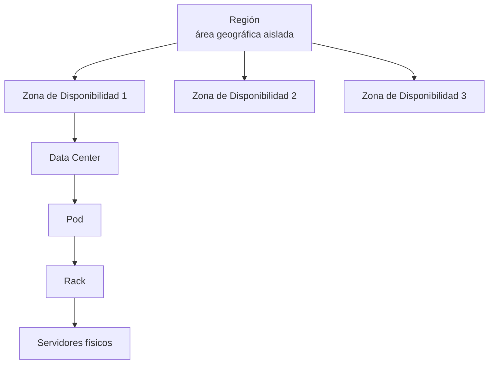
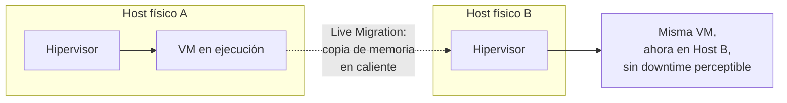
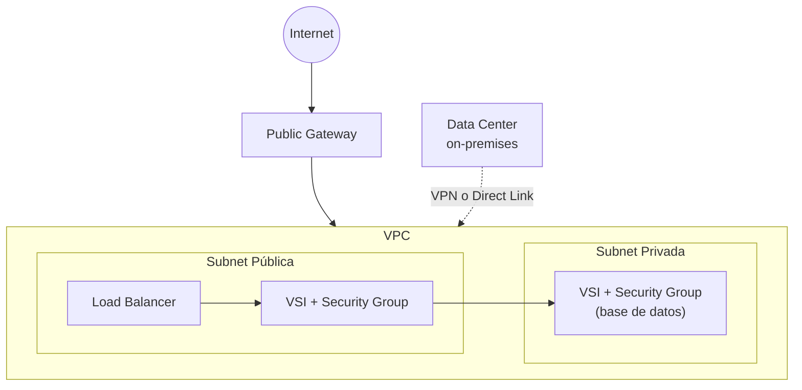
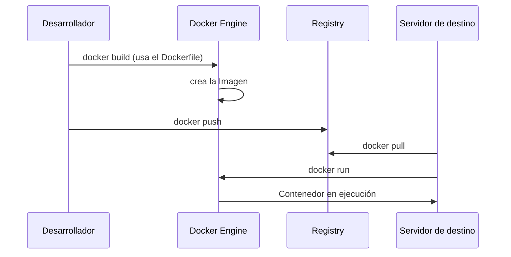
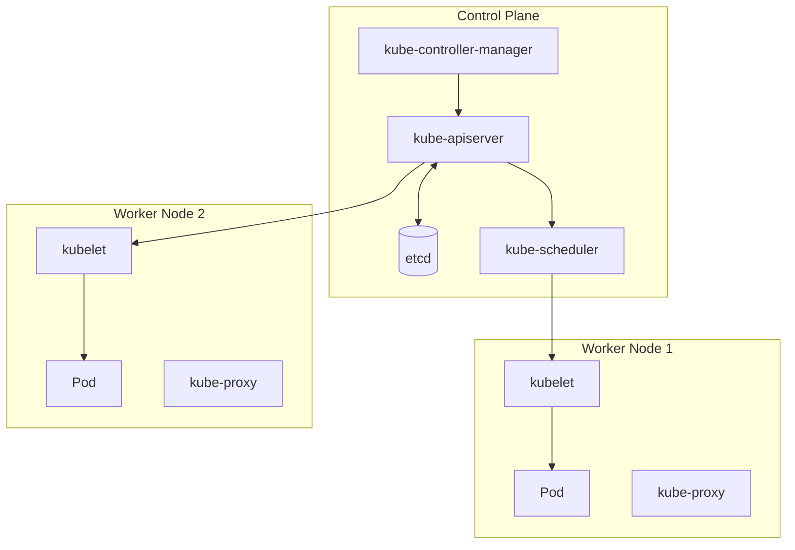
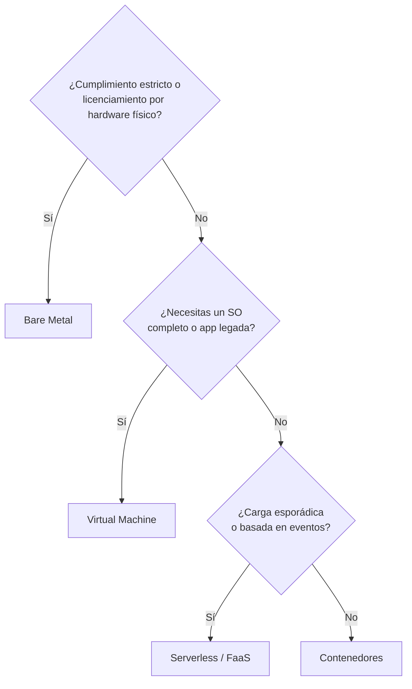
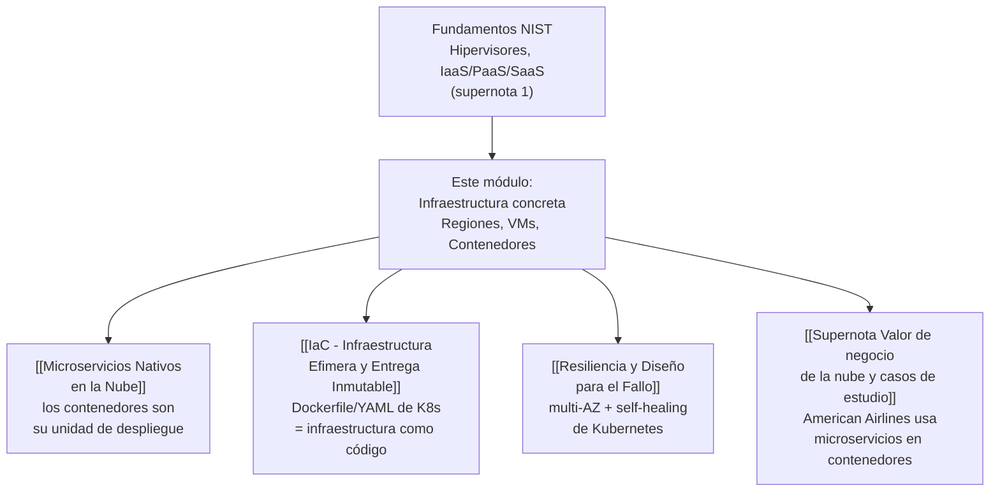

# Supernota: Infraestructura Cloud — Regiones, Cómputo, Almacenamiento, Redes y Contenedores

> [!abstract] Resumen rápido del módulo
> Este módulo baja un nivel de abstracción respecto a los módulos anteriores: ya no se trata del "por qué" adoptar la nube (valor de negocio) ni del "qué es" formalmente (definición NIST), sino de **cómo está construida física y lógicamente** la infraestructura que soporta todo lo demás. Cubre la organización geográfica de los proveedores (Regiones, Zonas, Data Centers), las formas principales de obtener cómputo (Máquinas Virtuales, Bare Metal, Contenedores, Serverless), cómo se almacena y transporta la información (Storage, SDN, VPCs), y por qué **contenedores y Kubernetes** se convirtieron en el estándar de facto para desplegar aplicaciones cloud-native a escala.

> [!note] Nota sobre esta supernota
> Esta nota combina **siete resúmenes de lección** de un mismo módulo de infraestructura cloud: (1) Organización de la infraestructura, (2) Virtualización e Hipervisores, (3) Tipos de Máquinas Virtuales, (4) Bare Metal Servers, (5) Redes seguras en la nube, (6) Contenedores — con una **extensión amplia solicitada explícitamente**, incluyendo Docker y Kubernetes con ejemplos de código — y (7) Comparativa final entre Bare Metal, VMs y Contenedores. Los resúmenes originales estaban en **inglés** y fueron traducidos al español; los términos técnicos de la industria se mantienen en inglés con su traducción entre paréntesis la primera vez que aparecen. Esta nota conecta directamente con [[Supernota - Fundamentos de Cloud Computing]] (que ya introdujo brevemente hipervisores, Región/AZ e IaaS/PaaS/SaaS) — aquí se desarrolla todo eso a nivel de infraestructura concreta.

---

## Índice de esta supernota
1. [[#1. Organización física de la infraestructura — Regiones, Zonas y Data Centers]]
2. [[#2. Panorama de las opciones de cómputo en la nube]]
3. [[#3. Virtualización y el rol del Hipervisor]]
4. [[#4. Tipos de instancias de Máquina Virtual]]
5. [[#5. Bare Metal Servers]]
6. [[#6. Almacenamiento en la nube]]
7. [[#7. Redes seguras en la nube]]
8. [[#8. Contenedores en profundidad — Docker y Kubernetes]]
9. [[#9. Comparativa final — Bare Metal vs VM vs Contenedores vs Serverless]]
10. [[#10. Conceptos complementarios]]
11. [[#11. Cómo se conecta este módulo con el resto del vault]]
12. [[#12. Preguntas para repasar]]
13. [[#13. Recursos recomendados]]
14. [[#14. Notas relacionadas del vault]]

---

## 1. Organización física de la infraestructura — Regiones, Zonas y Data Centers

La infraestructura de un proveedor de nube no es una masa homogénea de servidores: está organizada jerárquicamente para maximizar **tolerancia a fallos** y **continuidad operativa**.

| Nivel | Qué es | Característica clave |
|---|---|---|
| **Región (Region)** | Área geográfica **aislada** (ej. "us-south", "eu-de") | Cada región es independiente de las demás; una falla en una región no debería afectar a otra |
| **Zona de Disponibilidad (Availability Zone, AZ)** | Uno o más Data Centers **físicamente distintos** dentro de una misma región | Energía, refrigeración y redes **independientes** entre zonas de la misma región |
| **Data Center** | Instalación física que alberga los recursos: servidores, almacenamiento, equipo de red | Organizado internamente en **pods** y **racks** |

> [!note] Rack y Pod — términos no definidos en el resumen original
> Un **rack** es la unidad física estándar donde se montan verticalmente múltiples servidores, normalmente conectado a un switch de red dedicado a ese rack (*Top-of-Rack switch*, ToR). Un **pod** es una agrupación estandarizada y repetible de varios racks que comparten infraestructura de energía y red — los proveedores de nube diseñan pods como "bloques de construcción" idénticos para poder escalar un Data Center añadiendo pods completos, en vez de diseñar cada ampliación desde cero. Esto es lo que permite que un proveedor como AWS o IBM Cloud pueda expandir capacidad de forma predecible y rápida.



> [!important] Por qué esta organización existe: tolerancia a fallos
> Si una aplicación despliega sus instancias en **una sola** Zona de Disponibilidad, un fallo de energía o red en esa zona puede tumbar toda la aplicación. La práctica estándar de la industria es desplegar en **al menos dos AZ** dentro de la misma región (arquitectura *multi-AZ*), de forma que si una zona falla, el tráfico se redirige automáticamente a instancias sanas en otra zona — este es el mecanismo físico concreto detrás de los patrones de resiliencia vistos en [[Resiliencia y Diseño para el Fallo]]. Para continuidad ante un desastre regional completo (poco frecuente pero posible), se usan arquitecturas **multi-región**.

### 1.1 SLA y las "nueves" de disponibilidad (contenido complementario)
El resumen no lo menciona, pero es el marco cuantitativo estándar con el que la industria mide y contrata disponibilidad — imprescindible para entender *por qué* importa la arquitectura multi-AZ en términos de negocio:

| Disponibilidad (SLA) | Downtime permitido al año | Downtime permitido al mes |
|---|---|---|
| 99% ("dos nueves") | ~3.65 días | ~7.3 horas |
| 99.9% ("tres nueves") | ~8.76 horas | ~43.8 minutos |
| 99.99% ("cuatro nueves") | ~52.6 minutos | ~4.4 minutos |
| 99.999% ("cinco nueves") | ~5.26 minutos | ~26 segundos |

> [!tip] Conexión con casos reales del vault
> El caso de **Bitly** (ver [[Supernota Valor de negocio de la nube y casos de estudio]], sección 5.3) es un ejemplo directo de por qué la presencia en múltiples Regiones/AZ es indispensable: sin infraestructura distribuida geográficamente, ofrecer baja latencia y alta disponibilidad a clientes empresariales dispersos globalmente sería técnicamente inviable.

---

## 2. Panorama de las opciones de cómputo en la nube

El resumen identifica tres opciones principales de cómputo. Aquí se presentan de forma comparativa antes de desarrollarlas en profundidad en las secciones siguientes:

| Opción | Qué virtualiza/abstrae | Aislamiento | Quién administra el SO |
|---|---|---|---|
| **Virtual Server (VM)** | El hardware, vía hipervisor | Fuerte (nivel hardware virtualizado) | Cliente |
| **Bare Metal Server** | Nada — servidor físico dedicado, sin hipervisor | Máximo (físico, sin *tenants* vecinos) | Cliente |
| **Contenedores** (ver sección 8) | El sistema operativo — comparten el kernel del host | Ligero (nivel proceso del SO) | Compartido con el host |
| **Serverless / FaaS** | Todo, incluido el runtime de cada ejecución | N/A (el proveedor gestiona todo) | Proveedor |

### 2.1 Serverless — ampliación breve
Ya se introdujo el concepto de **FaaS (Function as a Service)** en [[Supernota - Fundamentos de Cloud Computing]], sección 2.6. Dos matices técnicos adicionales relevantes:

- **Cold Start** (arranque en frío): cuando una función no se ha ejecutado recientemente, el proveedor debe aprovisionar el entorno de ejecución desde cero antes de correr el código, añadiendo latencia (desde decenas de milisegundos hasta varios segundos, según el runtime) — es la principal desventaja técnica del modelo serverless frente a VMs o contenedores que ya están "calientes" y corriendo.
- **Modelo de facturación**: se paga por **invocación** y por **duración de ejecución** (ej. milisegundos de cómputo × memoria asignada), no por tiempo de servidor encendido — la expresión más pura del principio de *Measured Service* del NIST (ver [[Supernota - Fundamentos de Cloud Computing]], sección 1).

---

## 3. Virtualización y el rol del Hipervisor

El resumen original refuerza conceptos ya cubiertos formalmente en [[Supernota - Fundamentos de Cloud Computing]] (sección 5): la virtualización usa un **hipervisor** para crear versiones basadas en software de recursos físicos (cómputo, almacenamiento, red), y existen hipervisores **Tipo 1** (bare-metal, más seguros y comunes en Data Centers) y **Tipo 2** (alojados sobre un SO anfitrión, mayor latencia). No se repite esa tabla aquí — ver el enlace de arriba para la comparación completa.

Lo que este resumen añade específicamente son los **beneficios de negocio y operativos** de la virtualización:

| Beneficio | Mecanismo técnico detrás |
|---|---|
| **Ahorro de costos** | Un servidor físico infrautilizado (5-10% de uso real, ver [[Supernota - Fundamentos de Cloud Computing]] sección 5.1) puede alojar muchas VMs, maximizando la utilización del hardware |
| **Agilidad y velocidad de aprovisionamiento** | Crear una nueva VM es una operación de software (minutos), no una compra e instalación de hardware físico (semanas) |
| **Reducción de downtime** | Las VMs son **portables**: pueden migrarse entre servidores físicos si el host actual falla o requiere mantenimiento |

> [!important] Migración en vivo (Live Migration) — ampliación técnica
> El resumen menciona que las VMs "son portables, permitiendo fácil migración entre servidores físicos", pero no explica el mecanismo. La técnica formal se llama **Live Migration** (ej. VMware vMotion, KVM live migration): el hipervisor copia el estado de memoria de una VM en ejecución hacia otro host físico **mientras la VM sigue corriendo**, sincroniza las páginas de memoria que cambiaron durante la copia, y finalmente transfiere el control con una interrupción de servicio de apenas milisegundos — no minutos. Esto es lo que hace posible mantenimiento de hardware sin downtime perceptible para el usuario final, y es la base técnica del "reduced downtime" que menciona el resumen.



---

## 4. Tipos de instancias de Máquina Virtual

Al contratar cómputo virtual no solo se elige un tamaño (CPU/RAM) — también se elige un **modelo de tenencia y facturación**, que determina costo, garantía de disponibilidad y nivel de compromiso.

### 4.1 Shared / Public Cloud VMs
Instancias **multi-tenant** (multiusuario) gestionadas por el proveedor, con perfiles predefinidos o personalizados según el tipo de carga:
- **Compute-optimized**: más CPU relativa a la memoria — cargas de cómputo intensivo.
- **Memory-optimized**: más RAM relativa al CPU — bases de datos en memoria, cachés grandes.

Facturación por **hora** o por **mes**; la opción mensual suele ofrecer descuento si la instancia se usa de forma continua.

### 4.2 Transient / Spot VMs
Usan capacidad **no utilizada** del proveedor a un costo mucho menor, pero pueden ser **desaprovisionadas en cualquier momento** cuando el proveedor necesita esa capacidad de vuelta para clientes on-demand. Ideales para cargas **sin estado** (*stateless*) o no productivas (jobs por lotes, entornos de prueba, renderizado, entrenamiento de modelos tolerante a interrupciones).

> [!note] Cifras actualizadas (verificadas, no estaban en el resumen original)
> Según documentación y análisis de mercado de AWS actualizados a 2026, las instancias Spot pueden ofrecer descuentos de **hasta 90%** frente al precio On-Demand, con una advertencia de interrupción de apenas **~2 minutos**. En la práctica, el ahorro *efectivo* (descontando el costo de reintentos y la sobrecarga de ingeniería para manejar interrupciones) suele ubicarse más realistamente entre **40% y 70%** para la mayoría de los equipos. La estrategia recomendada por la industria (FinOps, ver [[Supernota Valor de negocio de la nube y casos de estudio]] sección 8.4) es combinar Reservadas para carga estable + On-Demand para carga variable + Spot para trabajos tolerantes a fallos.

### 4.3 Reserved Instances
El cliente se compromete a un **término** (típicamente 1 o 3 años) a cambio de un descuento significativo frente a On-Demand, garantizando la disponibilidad de recursos en un Data Center elegido.

> [!note] Cifra actualizada
> Los descuentos de instancias reservadas suelen ubicarse en un rango de hasta **~72%** frente al precio On-Demand, dependiendo del proveedor, la duración del compromiso y el modelo de pago (adelantado total, parcial o sin adelanto).

### 4.4 Dedicated Hosts
Ofrecen **aislamiento de un solo cliente** (single-tenant): únicamente las VMs del cliente corren sobre ese host físico específico. El cliente elige el Data Center y asigna sus propias VMs al host, con control máximo sobre la ubicación exacta de cada carga de trabajo.

### 4.5 Tabla comparativa

| Tipo | Costo relativo | Garantía de disponibilidad | Compromiso | Caso de uso típico |
|---|---|---|---|---|
| **Shared/Public** | Medio | Alta | Ninguno | Cargas de producción estándar, tráfico variable |
| **Reserved** | Bajo (con compromiso) | Alta | 1-3 años | Cargas estables y predecibles a largo plazo |
| **Spot/Transient** | Muy bajo | Baja (interrumpible) | Ninguno | Batch, CI/CD, entornos no productivos, cargas tolerantes a fallos |
| **Dedicated Host** | Alto | Alta + aislamiento total | Variable | Cumplimiento regulatorio, licenciamiento por servidor físico (*BYOL*) |

> [!tip] BYOL (Bring Your Own License) — término complementario
> Muchas licencias de software empresarial (ej. Oracle Database, Microsoft SQL Server) se cobran **por núcleo físico o por servidor**, no por VM. En un entorno multi-tenant compartido esto es difícil de auditar; un Dedicated Host resuelve el problema porque el cliente controla exactamente qué hardware físico corre su software licenciado.

---

## 5. Bare Metal Servers

### 5.1 Definición y gestión
Un **Bare Metal Server** es un servidor físico dedicado a un único cliente — **sin hipervisor**. El proveedor gestiona el hardware (conexiones de red, mantenimiento físico del rack); el cliente gestiona **todo lo demás**, desde el sistema operativo hacia arriba.

> [!important] Diferencia real con IaaS/VM dedicada
> No es solo "una VM más aislada". Al eliminar completamente la capa del hipervisor, el Bare Metal Server elimina el **overhead de virtualización** (la pequeña porción de CPU/memoria que el hipervisor consume para gestionar las VMs) y el fenómeno de **Noisy Neighbor** (ver nota abajo) — el cliente accede al 100% del rendimiento físico del hardware.

> [!note] Noisy Neighbor Effect — término complementario
> En entornos multi-tenant (VMs compartidas), el consumo intensivo de recursos por parte de una VM "vecina" en el mismo hardware físico puede degradar el rendimiento de las demás VMs en ese host, incluso si cada una respeta su cuota nominal asignada (por contención en buses de memoria, caché de CPU o I/O de disco compartido). Bare Metal elimina este riesgo por diseño, ya que no hay vecinos.

### 5.2 Personalización y aprovisionamiento
- **Preconfigurado**: perfiles de hardware ya definidos por el proveedor — aprovisionamiento típico de **20 a 40 minutos**.
- **Personalizado (custom-build)**: el cliente especifica procesador, RAM, almacenamiento y SO exactos — puede tomar **varias horas**, ya que implica ensamblar/configurar hardware físico real, no solo instanciar software.

### 5.3 Casos de uso
Ideal para entornos que requieren **alto rendimiento, aislamiento y seguridad total** sin la capa de un hipervisor: cargas intensivas en CPU/I/O, computación de alto rendimiento (HPC), analítica de grandes volúmenes de datos, tareas intensivas en GPU, y aplicaciones con requisitos estrictos de cumplimiento normativo (donde compartir hardware físico con otros clientes está prohibido contractual o regulatoriamente).

### 5.4 Comparación con Virtual Servers

| | **Bare Metal Server** | **Virtual Server (VM)** |
|---|---|---|
| Rendimiento | Superior (sin overhead de hipervisor) | Ligeramente menor (overhead de virtualización) |
| Seguridad/Aislamiento | Máximo (físico, sin *Noisy Neighbor*) | Fuerte, pero comparte hardware físico |
| Flexibilidad de configuración | Alta, pero fija una vez aprovisionado | Alta y ajustable dinámicamente |
| Velocidad de aprovisionamiento | Lenta (minutos a horas) | Rápida (segundos a minutos) |
| Escalabilidad | Baja — capacidad fija, precio plano | Alta — elástica bajo demanda |
| Costo | Mayor, gestión más compleja | Menor, más costo-eficiente |

---

## 6. Almacenamiento en la nube

El resumen original menciona el almacenamiento solo de forma genérica ("varios tipos para archivos, bases de datos, backups... con almacenamiento local por defecto en los servidores"). A continuación se formalizan los **tipos de almacenamiento cloud** que un profesional debe distinguir con precisión — contenido ampliado sobre lo que decía el resumen original:

| Tipo | Cómo se accede | Latencia | Persistencia | Ejemplo real | Caso de uso típico |
|---|---|---|---|---|---|
| **Block Storage** | Como un disco crudo, formateado por el SO cliente | Muy baja | Persistente, independiente del ciclo de vida de la VM | AWS EBS, IBM Block Storage | Bases de datos, discos de arranque de VM |
| **File Storage** | Sistema de archivos compartido vía protocolo de red (NFS, SMB) | Baja-media | Persistente | AWS EFS, Azure Files | Acceso concurrente desde múltiples instancias al mismo sistema de archivos |
| **Object Storage** | API HTTP/REST; cada objeto incluye datos + metadatos | Media (no apto para I/O transaccional) | Persistente, extremadamente durable | AWS S3, IBM Cloud Object Storage | Backups, contenido estático, datos no estructurados a escala masiva |
| **Local/Instance Storage** | Disco físico directamente asociado al host de la VM | La más baja posible | **Efímero** — se pierde si la VM se detiene o migra | Almacenamiento temporal por defecto de la VM | Caché temporal, datos de scratch/procesamiento intermedio |

> [!warning] El almacenamiento local es efímero — error común
> El resumen menciona "almacenamiento local por defecto en los servidores" — es importante remarcar que este almacenamiento **no sobrevive** si la VM se detiene, se elimina, o se migra a otro host físico (ver Live Migration, sección 3). Guardar datos que deben persistir (bases de datos, archivos de usuario) únicamente en almacenamiento local de instancia es un error de arquitectura frecuente que causa pérdida de datos.

> [!tip] Object Storage y durabilidad
> Los proveedores suelen anunciar Object Storage con cifras de durabilidad extremadamente altas (comúnmente citadas como "11 nueves", 99.999999999%), lograda mediante replicación automática de cada objeto across múltiples Zonas de Disponibilidad — un uso concreto y a gran escala del principio de *Resource Pooling* del NIST (sección 1 de [[Supernota - Fundamentos de Cloud Computing]]).

Esta capa de almacenamiento persistente y replicado es también la base técnica de las estrategias de **Backup & Disaster Recovery** ya mencionadas en [[Supernota Valor de negocio de la nube y casos de estudio]], sección 4.2.

---

## 7. Redes seguras en la nube

### 7.1 De hardware físico a Software Defined Networking (SDN)
Las redes cloud replican los conceptos de una red de Data Center tradicional (switches, routers, firewalls) pero los implementan como **componentes virtualizados**, controlados vía software y APIs — a esto se le llama **SDN (Software Defined Networking)**.

> [!important] Qué resuelve realmente SDN
> Una red tradicional mezcla el **plano de control** (decisiones de enrutamiento) con el **plano de datos** (el movimiento físico de paquetes) dentro del mismo hardware — cambiar la configuración de red requiere tocar equipos físicos uno por uno. SDN **separa** ambos planos: el plano de control se centraliza en software programable (APIs, consola, Terraform), y el plano de datos ejecuta esas decisiones — permitiendo reconfigurar redes completas en segundos mediante código, en vez de reconfiguración manual de hardware. Esto es un habilitador directo de [[IaC - Infraestructura Efimera y Entrega Inmutable]] aplicado a redes.

Cada instancia usa una **vNIC** (interfaz de red virtual) en lugar de una tarjeta de red física dedicada.

### 7.2 VPC y Subnets
Una **VPC (Virtual Private Cloud)** es un espacio de red lógicamente aislado dentro de la nube del proveedor, definido por un rango de direcciones IP propio. Dentro de una VPC se definen **subnets** (subredes) — segmentos de red más pequeños, típicamente separados en:
- **Subnet pública**: con ruta a Internet (vía Public Gateway).
- **Subnet privada**: sin ruta directa a Internet, para recursos internos (bases de datos, servicios backend).

### 7.3 ACL vs Security Group — distinción clave (frecuente en exámenes)
El resumen menciona ambos mecanismos de seguridad, pero es indispensable precisar su diferencia técnica exacta, porque suelen confundirse:

| | **ACL (Access Control List)** | **Security Group** |
|---|---|---|
| Nivel de aplicación | **Subred** (afecta a todo lo que está dentro) | **Instancia individual** (VSI — Virtual Server Instance) |
| Tipo de estado | **Stateless** (sin estado): hay que definir reglas explícitas de entrada **y** de salida por separado | **Stateful** (con estado): si se permite el tráfico de entrada, el tráfico de respuesta se permite automáticamente |
| Evaluación de reglas | En **orden numérico**, se detiene en la primera regla que coincide | Se evalúan **todas** las reglas relevantes, sin orden estricto |
| Analogía | El guardia de seguridad del edificio completo | El cerrojo de la puerta de tu propia oficina |

> [!warning] Error común
> Asumir que configurar solo Security Groups es suficiente y olvidar las ACLs (o viceversa) puede dejar rutas de red abiertas sin darse cuenta — ambas capas son **complementarias**, no sustitutas una de la otra, siguiendo el principio de defensa en profundidad (*defense in depth*).

### 7.4 Conectividad y alta disponibilidad
- **Public Gateway**: habilita acceso a Internet para instancias que dan cara al público (ej. servidores web).
- **VPN (Virtual Private Network)**: conecta recursos on-premises con la nube de forma segura, cifrando el tráfico sobre Internet pública.
- **Load Balancer**: distribuye tráfico entre múltiples instancias para mantener capacidad de respuesta bajo carga variable; puede operar en **capa 4** (transporte, balanceo por IP/puerto) o **capa 7** (aplicación, balanceo consciente de contenido HTTP — ej. por ruta de URL).
- **Conexión dedicada de alta velocidad** (ej. **IBM Cloud Direct Link**, equivalentes: AWS Direct Connect, Azure ExpressRoute): enlace privado dedicado entre el Data Center on-premises y la nube, **sin pasar por Internet pública** — menor latencia, mayor ancho de banda garantizado, y menor superficie de exposición para tráfico sensible o regulado.

### 7.5 CDN — cierre del ciclo con el módulo anterior
El resumen menciona que las **CDN (Content Delivery Networks)** distribuyen contenido globalmente para reducir latencia. Esto conecta directamente con el concepto de **POP (Punto de Presencia)** ya definido en [[Supernota - IoT, IA y Blockchain en la Nube]], sección 5.1: una CDN funciona precisamente resolviendo solicitudes desde el POP geográficamente más cercano al usuario final, en vez de viajar hasta el Data Center central.



---

## 8. Contenedores en profundidad — Docker y Kubernetes

> [!note] Extensión solicitada
> El usuario pidió explícitamente profundizar en este tema con ejemplos de Docker y Kubernetes — esta sección desarrolla el flujo completo, desde la definición de un contenedor hasta la orquestación a escala.

### 8.1 Contenedores vs Máquinas Virtuales — la diferencia fundamental
Ya se introdujo esta comparación en [[Supernota - Fundamentos de Cloud Computing]], sección 5.3. El resumen de esta lección la refuerza con cifras concretas de peso y velocidad:

| | **Máquina Virtual** | **Contenedor** |
|---|---|---|
| Qué incluye | Aplicación + librerías + **SO invitado completo** | Aplicación + solo las librerías/dependencias necesarias |
| Tamaño típico | Gigabytes | Megabytes |
| Tiempo de arranque | Minutos | Milisegundos a segundos |
| Kernel | Cada VM tiene su propio kernel | Todos los contenedores **comparten el kernel del host** |
| Portabilidad | Limitada por dependencias de SO | Alta — la imagen corre igual en cualquier host compatible |

### 8.2 Anatomía de un contenedor: del manifiesto a la ejecución
El flujo estándar de contenerización tiene cuatro pasos:

1. **Manifiesto** (ej. un `Dockerfile`): instrucciones declarativas de cómo construir la imagen.
2. **Build**: se construye una **imagen** — un paquete inmutable de solo lectura con la aplicación y sus dependencias.
3. **Registry**: la imagen se publica en un **registro de contenedores** (ej. Docker Hub, Amazon ECR, IBM Cloud Container Registry).
4. **Run**: un **motor de runtime de contenedores** (ej. Docker Engine) descarga la imagen y ejecuta una instancia de ella — el **contenedor** en sí.

**Ejemplo real — Dockerfile mínimo para una aplicación Node.js:**

```dockerfile
FROM node:20-alpine
WORKDIR /app
COPY package*.json ./
RUN npm install --production
COPY . .
EXPOSE 3000
CMD ["node", "server.js"]
```

- `FROM`: imagen base sobre la que se construye (aquí, Node.js 20 sobre Alpine Linux, una distribución minimalista).
- `WORKDIR`: directorio de trabajo dentro del contenedor.
- `COPY` / `RUN`: copian archivos e instalan dependencias — **cada instrucción crea una nueva capa** de la imagen (ver sección 10.4).
- `EXPOSE`: documenta el puerto que la aplicación escucha.
- `CMD`: comando que se ejecuta cuando arranca el contenedor.



### 8.3 Arquitectura interna de Docker Engine (ampliación técnica)
El resumen menciona "un motor de runtime (ej. Docker Engine)" sin detallar su arquitectura interna — relevante para entender qué pasa realmente al ejecutar `docker run`:

| Componente | Función |
|---|---|
| **Docker CLI** | Interfaz de línea de comandos que el usuario ejecuta |
| **API REST de Docker** | Interfaz que traduce comandos CLI en llamadas al daemon |
| **dockerd (daemon)** | Proceso en segundo plano que gestiona imágenes, redes y volúmenes |
| **containerd** | Runtime de alto nivel que gestiona el ciclo de vida de contenedores (descarga de imágenes, ejecución) |
| **runc** | Runtime de bajo nivel (conforme al estándar **OCI**, ver 8.4) que crea el contenedor usando primitivas del kernel Linux: **namespaces** (aislamiento de procesos, red, sistema de archivos) y **cgroups** (límites de CPU/memoria) |

### 8.4 OCI (Open Container Initiative) — estándar de la industria (contenido complementario)
Marco formal, no mencionado en el resumen, que define dos especificaciones abiertas: la **Image Spec** (formato estándar de imagen de contenedor) y la **Runtime Spec** (cómo debe ejecutarse un contenedor). Gracias a OCI, una imagen construida con Docker puede ejecutarse con otros runtimes compatibles (containerd, CRI-O) sin modificación — es el mecanismo formal que garantiza la portabilidad "construye una vez, corre en cualquier lugar" que promete la contenerización.

### 8.5 Por qué un solo `docker run` no escala — la necesidad de orquestación
Ejecutar contenedores manualmente funciona para una demo, pero falla a escala de producción: no hay reinicio automático si un contenedor falla, no hay balanceo de carga entre réplicas, no hay forma de hacer despliegues sin downtime, y coordinar cientos de contenedores en múltiples hosts a mano es inviable.

**Kubernetes (K8s)** resuelve exactamente este problema: es un **orquestador de contenedores** originalmente diseñado por Google (basado en su sistema interno *Borg*), donado a la **CNCF (Cloud Native Computing Foundation)**, y hoy el estándar de facto de la industria.

### 8.6 Arquitectura de Kubernetes

| Plano | Componente | Función |
|---|---|---|
| **Control Plane** | `kube-apiserver` | Punto de entrada central: expone la API REST de Kubernetes |
| **Control Plane** | `etcd` | Base de datos clave-valor distribuida que guarda el **estado deseado** de todo el clúster |
| **Control Plane** | `kube-scheduler` | Decide en qué nodo debe correr cada nuevo Pod |
| **Control Plane** | `kube-controller-manager` | Ejecuta **bucles de reconciliación**: compara constantemente el estado actual contra el deseado y corrige diferencias |
| **Worker Node** | `kubelet` | Agente que se comunica con el Control Plane y garantiza que los contenedores asignados a ese nodo estén corriendo |
| **Worker Node** | `kube-proxy` | Gestiona reglas de red para que el tráfico llegue a los Pods correctos |
| **Worker Node** | Runtime de contenedores | Ejecuta los contenedores en sí (containerd, CRI-O) |



Un **Pod** es la unidad desplegable más pequeña de Kubernetes: uno o más contenedores que comparten red y almacenamiento, tratados como una sola entidad.

### 8.7 Objetos centrales de Kubernetes

| Objeto | Función |
|---|---|
| **Pod** | Unidad mínima desplegable (uno o más contenedores) |
| **Deployment** | Declara el **estado deseado** (ej. "quiero 3 réplicas de esta imagen") y gestiona actualizaciones |
| **ReplicaSet** | Garantiza que el número de Pods réplica coincida con lo declarado (creado y gestionado por el Deployment) |
| **Service** | Punto de red **estable** (IP/DNS fijo) que balancea tráfico entre Pods, incluso cuando estos se reemplazan |
| **Namespace** | Aislamiento lógico de recursos dentro de un mismo clúster (ej. separar entornos `dev`/`prod`) |
| **ConfigMap / Secret** | Inyectan configuración y datos sensibles (credenciales) sin incrustarlos en la imagen |
| **Ingress** | Gestiona el enrutamiento HTTP/HTTPS externo hacia los Services internos |

**Ejemplo real — Deployment + Service en YAML:**

```yaml
apiVersion: apps/v1
kind: Deployment
metadata:
  name: web-app
spec:
  replicas: 3
  selector:
    matchLabels:
      app: web-app
  template:
    metadata:
      labels:
        app: web-app
    spec:
      containers:
        - name: web-app
          image: registry.example.com/web-app:1.4.0
          ports:
            - containerPort: 3000
---
apiVersion: v1
kind: Service
metadata:
  name: web-app-service
spec:
  selector:
    app: web-app
  ports:
    - port: 80
      targetPort: 3000
  type: LoadBalancer
```

> [!important] Por qué esto es "self-healing"
> El `Deployment` declara: "quiero 3 réplicas del contenedor `web-app:1.4.0` corriendo, siempre". El `kube-controller-manager` (sección 8.6) verifica esto constantemente contra `etcd`. Si un Pod muere (falla del nodo, error de la app), el controlador **crea automáticamente un Pod de reemplazo** sin intervención humana — el clúster se autorrepara. El `Service` mantiene una dirección de red estable apuntando siempre a los Pods sanos, sin importar cuáles hayan sido reemplazados.

### 8.8 Auto-escalado y actualizaciones sin downtime
- **Horizontal Pod Autoscaler (HPA)**: ajusta automáticamente el número de réplicas de un Deployment según métricas de uso (CPU, memoria, o métricas personalizadas) — la versión de Kubernetes de la **Rapid Elasticity** del NIST (ver [[Supernota - Fundamentos de Cloud Computing]], sección 1), aplicada a nivel de aplicación.
- **Rolling Update**: al desplegar una nueva versión, Kubernetes reemplaza los Pods **gradualmente** (uno o unos pocos a la vez), manteniendo siempre suficientes réplicas sanas sirviendo tráfico — cero downtime. Es la implementación técnica concreta del principio de **lotes pequeños y frecuentes** ya visto en el caso de American Airlines ([[Supernota Valor de negocio de la nube y casos de estudio]], sección 5.1) y en [[CI-CD Pipeline]].

### 8.9 Kubernetes vs OpenShift
El resumen menciona ambos junto con Docker. **OpenShift** (Red Hat) es una **distribución empresarial de Kubernetes**: no lo reemplaza, sino que añade sobre el K8s estándar un registro de contenedores integrado, un pipeline de CI/CD incorporado (*Source-to-Image*), políticas de seguridad más estrictas por defecto, y una consola web de administración — pensado para adopción empresarial con menos configuración manual inicial.

### 8.10 Service Mesh — cerrando un concepto pendiente del vault (contenido complementario)
La nota [[Supernota Valor de negocio de la nube y casos de estudio]] (sección 8, tip de la sección 2.1) ya mencionaba "Service Mesh" como concepto complementario a desarrollar. Este es el lugar natural para hacerlo: un **Service Mesh** (ej. Istio, Linkerd) es una capa de infraestructura que gestiona la comunicación **entre servicios** dentro de una arquitectura de contenedores/microservicios, mediante **proxies sidecar** desplegados junto a cada Pod. Provee, sin cambiar el código de la aplicación:
- Cifrado automático **mTLS** entre servicios.
- Enrutamiento avanzado de tráfico (ej. despliegues canary, *A/B testing*).
- Observabilidad detallada (latencia, tasa de error, reintentos) y patrones de resiliencia como **Circuit Breaker**, ya introducido conceptualmente en [[Microservicios Nativos en la Nube]].

---

## 9. Comparativa final — Bare Metal vs VM vs Contenedores vs Serverless

| Dimensión | Bare Metal | VM | Contenedor | Serverless |
|---|---|---|---|---|
| Peso | Físico (servidor completo) | GBs | MBs | N/A |
| Arranque | Minutos-horas (aprovisionamiento físico) | Minutos | Milisegundos-segundos | Milisegundos (con cold start ocasional) |
| Aislamiento | Máximo (físico) | Fuerte (hardware virtualizado) | Ligero (proceso del SO) | Gestionado por el proveedor |
| Portabilidad | Baja | Media | Alta | Alta (a nivel de función) |
| Modelo de costo | Fijo/plano | Pago por uso, elástico | Pago por uso, muy eficiente | Pago por invocación/duración |
| Escalabilidad | Baja, capacidad fija | Alta | Muy alta | Máxima (automática) |
| Caso de uso ideal | Cumplimiento estricto, HPC, licenciamiento por hardware | Cargas legado, control de SO completo | Apps cloud-native, microservicios | Eventos esporádicos, cargas variables sin gestión de servidor |



> [!important] La conclusión del módulo original
> El resumen cierra afirmando que contenedores y funciones serverless son la opción preferida para la mayoría de cargas de trabajo modernas por su flexibilidad y costo-eficiencia, mientras que Bare Metal se reserva para escenarios específicos de alto rendimiento o cumplimiento. Esta comparativa puede evaluarse formalmente usando el **AWS Well-Architected Framework**, ya introducido en [[Supernota - Fundamentos de Cloud Computing]], sección 12.4 (particularmente los pilares de eficiencia de rendimiento y optimización de costos).

---

## 10. Conceptos complementarios (no cubiertos en los resúmenes originales)

### 10.1 CNCF y el panorama Cloud Native
La **Cloud Native Computing Foundation** es la organización (bajo la Linux Foundation) que alberga proyectos open-source clave del ecosistema de contenedores: Kubernetes, containerd, Prometheus (monitoreo), Envoy (proxy usado en varios Service Mesh) y Helm (gestor de paquetes para K8s), entre otros. Es el equivalente, para el mundo cloud-native, de lo que el NIST es para la definición formal de cloud computing.

### 10.2 The Twelve-Factor App
Metodología formal (originada en Heroku) que define **12 principios** para construir aplicaciones SaaS modernas, portables y escalables — altamente relevante para aplicaciones destinadas a correr en contenedores. Algunos principios directamente aplicables a esta nota: *"Config"* (la configuración se inyecta vía variables de entorno, no vía ConfigMap/Secret como se vio en 8.7), *"Processes"* (los procesos de la app deben ser *stateless*, lo que hace posible el escalado horizontal y el reemplazo de Pods sin pérdida de datos), y *"Disposability"* (arranque rápido y apagado ordenado — exactamente lo que hace viable el Rolling Update de la sección 8.8).

### 10.3 Zero Trust Networking
Modelo de seguridad de red que **no confía por defecto** en ningún tráfico, ni siquiera el que se origina dentro del propio perímetro de la red — cada solicitud debe autenticarse y autorizarse explícitamente, sin importar su origen. Es una evolución del enfoque tradicional de "perímetro seguro" que subyace conceptualmente a por qué se combinan múltiples capas de seguridad de red (ACLs + Security Groups + mTLS de un Service Mesh, secciones 7.3 y 8.10) en vez de depender de una sola.

### 10.4 Copy-on-Write y capas de imágenes Docker
Cada instrucción de un `Dockerfile` (sección 8.2) crea una **capa** de solo lectura, apiladas mediante un sistema de archivos por capas (*Union Filesystem*). Cuando se reconstruye una imagen y solo cambió el código fuente (no las dependencias), Docker reutiliza las capas anteriores sin reconstruirlas — esto es lo que hace que los builds incrementales de Docker sean rápidos en la práctica, y por qué la convención es ordenar el Dockerfile de lo que cambia menos (dependencias) a lo que cambia más (código de la app).

### 10.5 Chaos Engineering
Disciplina que consiste en **inyectar fallos deliberadamente** en un sistema en producción (apagar un Pod, simular la caída de una Zona de Disponibilidad completa) para verificar que los mecanismos de auto-recuperación (Rolling Update, self-healing de Kubernetes, arquitectura multi-AZ de la sección 1) realmente funcionan como se espera, antes de que ocurra un fallo real no planeado. Popularizada por Netflix con su herramienta *Chaos Monkey* — conecta directamente con los principios de [[Resiliencia y Diseño para el Fallo]].

---

## 11. Cómo se conecta este módulo con el resto del vault



Este módulo es el **"cómo concreto"** que faltaba entre la teoría (NIST, modelos de servicio) y la práctica (microservicios, CI/CD, resiliencia): las Regiones y Zonas de Disponibilidad son la base física de la alta disponibilidad; los contenedores y Kubernetes son la forma estándar en que hoy se empaquetan y despliegan los microservicios mencionados en supernotas anteriores; y las redes seguras (VPC, Security Groups, Direct Link) son la capa que conecta todo de forma controlada.

---

## 12. Preguntas para repasar (auto-evaluación)

- [ ] ¿Cuál es la diferencia exacta entre una Región y una Zona de Disponibilidad, y por qué una arquitectura multi-AZ mejora la tolerancia a fallos?
- [ ] ¿Qué significa que un SLA sea de "99.99%" en términos de minutos de downtime al año?
- [ ] ¿Qué hace posible técnicamente la Live Migration de una VM entre hosts físicos sin downtime perceptible?
- [ ] ¿Cuáles son los cuatro tipos de instancias VM (Shared, Reserved, Spot, Dedicated Host) y cuándo usarías cada una?
- [ ] ¿Por qué un Bare Metal Server elimina el problema de "Noisy Neighbor" y qué es exactamente ese fenómeno?
- [ ] ¿Cuál es la diferencia entre Block Storage, File Storage y Object Storage, y por qué el almacenamiento local de instancia es efímero?
- [ ] ¿Cuál es la diferencia técnica exacta entre una ACL y un Security Group (nivel de aplicación, stateless vs stateful)?
- [ ] ¿Puedes explicar el flujo completo de un contenedor: Dockerfile → imagen → registry → runtime?
- [ ] ¿Qué componentes forman el Control Plane de Kubernetes y qué hace cada uno?
- [ ] ¿Por qué se dice que un Deployment de Kubernetes es "self-healing"? ¿Qué mecanismo concreto lo logra?
- [ ] ¿Qué es un Service Mesh y qué problema resuelve que Kubernetes por sí solo no resuelve?
- [ ] Para una carga de trabajo dada, ¿cómo decidirías entre Bare Metal, VM, Contenedor o Serverless?

---

## 13. Recursos recomendados para profundizar

- 🌐 [IBM Cloud Direct Link — documentación oficial](https://cloud.ibm.com/docs/dl?topic=dl-dl-about) — conectividad dedicada híbrida.
- 🌐 [Kubernetes — documentación oficial](https://kubernetes.io/docs/home/) — referencia completa de arquitectura y objetos de K8s.
- 🌐 [Docker Docs — documentación oficial](https://docs.docker.com/) — arquitectura de Docker Engine y buenas prácticas de Dockerfile.
- 🌐 [Open Container Initiative (OCI)](https://opencontainers.org/) — especificaciones formales de imagen y runtime.
- 🌐 [Cloud Native Computing Foundation (CNCF)](https://www.cncf.io/) — panorama completo del ecosistema cloud-native.
- 🌐 [The Twelve-Factor App](https://12factor.net/) — metodología original completa, disponible en español.
- 🌐 [AWS — EC2 Spot Instances](https://aws.amazon.com/ec2/spot/) — mecanismo de precios de capacidad no utilizada.
- 📘 *Kubernetes: Up and Running* — Brendan Burns, Joe Beda, Kelsey Hightower (referencia práctica, escrita por ingenieros que crearon Kubernetes en Google).
- 📘 *Site Reliability Engineering* — Google (capítulos sobre gestión de infraestructura a gran escala y tolerancia a fallos).

---

## 14. Notas relacionadas del vault
- [[Supernota - Fundamentos de Cloud Computing]]
- [[Supernota Valor de negocio de la nube y casos de estudio]]
- [[Supernota - IoT, IA y Blockchain en la Nube]]
- [[Microservicios Nativos en la Nube]]
- [[IaC - Infraestructura Efimera y Entrega Inmutable]]
- [[Resiliencia y Diseño para el Fallo]]
- [[CI-CD Pipeline]]
- [[Supernota - Metricas, Cultura y SRE]]

---
#devops #cloud-computing #infraestructura-cloud #virtualizacion #contenedores #kubernetes #redes-cloud
