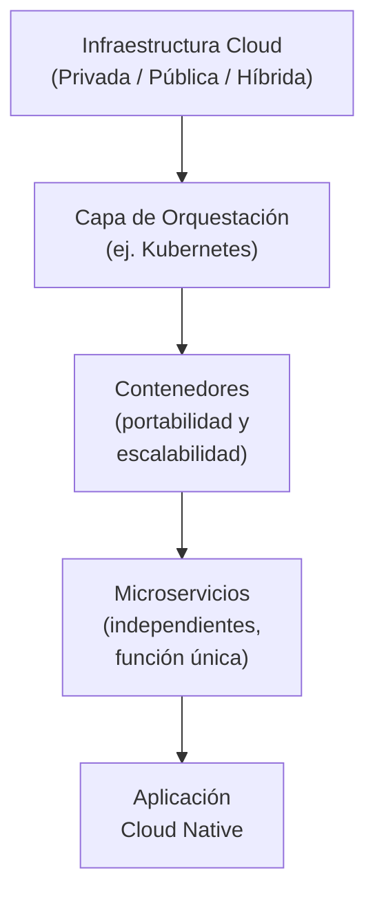
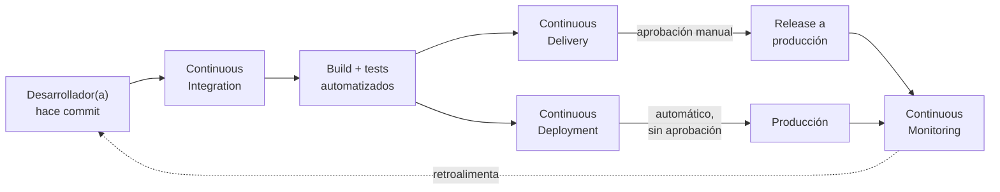
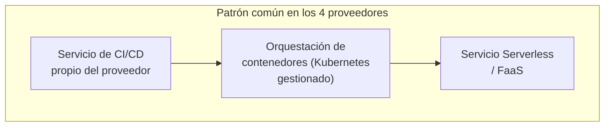
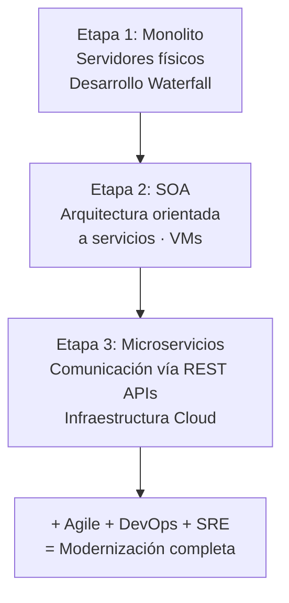
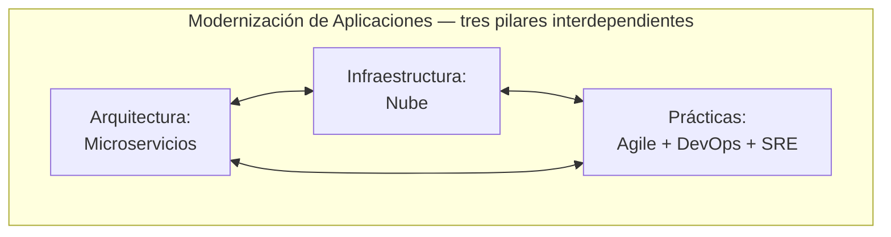
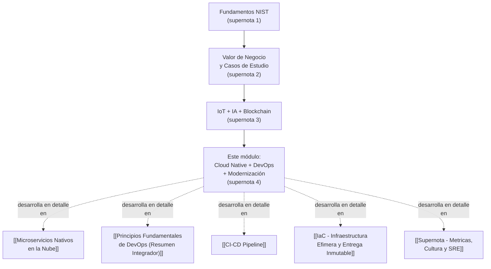

# Supernota: Aplicaciones Cloud Native, DevOps en la Nube y Modernización de Aplicaciones

> [!abstract] Resumen rápido del módulo
> Este módulo conecta tres ideas que en la práctica son **inseparables**: las **aplicaciones Cloud Native** (arquitectura de microservicios en contenedores, orquestados por herramientas como Kubernetes), **DevOps** (la cultura y el conjunto de prácticas — CI, CD, Continuous Deployment y Continuous Monitoring — que hacen posible entregar esas aplicaciones de forma rápida y confiable), y la **Modernización de Aplicaciones** (el proceso organizacional de migrar de monolitos legacy hacia esta combinación de arquitectura + infraestructura + prácticas). Se revisan también casos de uso concretos de DevOps en AWS, Azure, GCP e IBM Cloud, y tendencias emergentes (nube híbrida, Edge Computing, Serverless, IA en la nube).

> [!note] Esta es una supernota que combina varios resúmenes
> Este archivo combina **seis resúmenes/lecciones distintos** que me pasaste sobre el mismo módulo: (1) Cloud Native Applications, (2) DevOps — overview, (3) un artículo extendido "Harnessing the Power of DevOps on Cloud Platforms", (4) Application Modernization, (5) un resumen de "expert viewpoints" sobre tendencias emergentes, y (6) el resumen final de puntos clave de la lección. Los resúmenes originales estaban en **inglés** — fueron traducidos al español para esta nota, dejando los términos técnicos de la industria en inglés (con su traducción entre paréntesis la primera vez que aparecen), tal como indican tus instrucciones de estilo.

---

## Índice de esta supernota
1. [[#1. Aplicaciones Cloud Native — definición y arquitectura]]
2. [[#2. DevOps — fundamentos y prácticas core]]
3. [[#3. DevOps en las plataformas de nube (AWS, Azure, GCP, IBM Cloud)]]
4. [[#4. Modernización de Aplicaciones (Application Modernization)]]
5. [[#5. Tendencias emergentes en la nube]]
6. [[#6. Cómo se conecta este módulo con el resto del vault]]
7. [[#7. Conceptos complementarios]]
8. [[#8. Preguntas para repasar]]
9. [[#9. Recursos recomendados]]
10. [[#10. Notas relacionadas del vault]]

---

## 1. Aplicaciones Cloud Native — definición y arquitectura

### 1.1 Definición (del resumen original)
Las aplicaciones **Cloud Native** (nativas de la nube) son aplicaciones diseñadas **específicamente** para entornos de nube, o **refactorizadas** para seguir los principios de diseño cloud native. Consisten en **microservicios** que operan de forma independiente pero trabajan en conjunto, normalmente empaquetados en **contenedores** (*containers*) para lograr portabilidad y escalabilidad.

> [!important] Idea central: "cloud native" no es solo "correr en la nube"
> Este es el punto que más se presta a confusión en un examen: una aplicación que simplemente se migró tal cual a una VM en la nube (lo que en [[Supernota - Fundamentos de Cloud Computing]] se llamó estrategia **Rehost / "Lift and Shift"**) **NO** es una aplicación cloud native. Cloud native implica un cambio de **diseño**: descomposición en microservicios, empaquetado en contenedores, y arquitectura pensada desde cero para aprovechar elasticidad, resiliencia distribuida y despliegues independientes. Es, en esencia, el equivalente aplicado a nivel de arquitectura de software de la estrategia **Refactor / Re-architect** de las 6 R's.

### 1.2 Características clave y principios de desarrollo (del resumen original)
- **Arquitectura de microservicios**: descompone la aplicación en servicios de **función única** (*single-function services*) que pueden escalarse y actualizarse de forma independiente entre sí — el desarrollo profundo de este tema (patrones de comunicación, descomposición por dominio, trade-offs) vive en [[Microservicios Nativos en la Nube]]; aquí solo se cubre el rol de los microservicios dentro del paraguas más amplio de "cloud native".
- **Contenedores**: dan flexibilidad y portabilidad — un contenedor empaquetado corre igual en el laptop de un desarrollador, en un servidor on-premise o en cualquier proveedor de nube, porque incluye la aplicación y sus dependencias, pero comparte el kernel del sistema operativo anfitrión (ver comparación formal VM vs Contenedor en [[Supernota - Fundamentos de Cloud Computing]], sección 5.3).
- **Metodologías Agile**: permiten desarrollo rápido e iterativo, basado en retroalimentación del usuario, en vez de ciclos de entrega largos y rígidos.

### 1.3 El stack de aplicaciones Cloud Native (del resumen original)
Las aplicaciones cloud native corren sobre infraestructura de nube (privada, pública o híbrida — ver los 4 modelos de despliegue del NIST en [[Supernota - Fundamentos de Cloud Computing]]), con **capas de orquestación** como **Kubernetes** gestionando el despliegue, el escalado y la disponibilidad de los contenedores de forma automatizada.

### 1.4 Beneficios (del resumen original)
- **Innovación** más rápida: equipos pequeños pueden lanzar y probar ideas sin coordinar despliegues masivos.
- **Agilidad de negocio** (*Business Agility*): la organización responde más rápido a cambios de mercado — mismo principio ya visto en [[Supernota Valor de negocio de la nube y casos de estudio]], sección 2.4.
- **Comoditización de servicios core**: funciones comunes (autenticación, mensajería, almacenamiento) se consumen como servicios gestionados en vez de construirse internamente — mismo principio de "no reinventar la rueda" visto en la supernota de valor de negocio, sección 2.1.

### 1.5 Casos de uso y buenas prácticas (del resumen original)
El resumen original afirma que el diseño cloud native se **recomienda para todas** las aplicaciones basadas en la nube, y que para gestionar microservicios de forma efectiva son esenciales:
- **Logging estandarizado**
- **Eventos** (*Events*)
- **Distributed Tracing** (Trazabilidad distribuida)
- **Load Balancing** (Balanceo de carga)
- **Service Discovery** (Descubrimiento de servicios)
- **Routing** (Enrutamiento)

> [!warning] El resumen menciona estas prácticas pero no las explica — aquí la ampliación
> Estas seis prácticas no son opcionales una vez que una aplicación se descompone en decenas o cientos de microservicios — son la razón por la que existe la disciplina de **observabilidad** (*Observability*) y por qué casi ninguna arquitectura de microservicios seria funciona sin un **Service Mesh** (ver sección 7.3). Sin *distributed tracing*, por ejemplo, es prácticamente imposible depurar por qué una solicitud fue lenta cuando pasó por 12 microservicios distintos — no hay un solo log donde ver "todo el viaje" de la solicitud sin esta herramienta.

---

## 2. DevOps — fundamentos y prácticas core

### 2.1 ¿Qué es DevOps? (del resumen original)
**DevOps** combina los equipos de **Development** (Desarrollo) y **Operations** (Operaciones) para entregar software de forma **continua** y colaborativa. Aplica principios **Agile** y **Lean** a lo largo de todos los interesados (*stakeholders*), mejorando la productividad mediante retroalimentación más rápida, colaboración unificada y menor sobrecarga (*overhead*).

> [!note] Profundidad adicional sobre DevOps como cultura
> El resumen aquí es intencionalmente breve porque el detalle profundo de **qué es y qué NO es DevOps** (incluyendo malentendidos frecuentes, el Modelo de Westrum, y la diferencia entre DevOps como cultura vs DevOps como conjunto de herramientas) ya vive en [[Que es DevOps - Definicion y Malentendidos]] y en [[Principios Fundamentales de DevOps (Resumen Integrador)]]. Esta sección se enfoca específicamente en las **cuatro prácticas técnicas centrales** (CI, CD, Continuous Deployment, Continuous Monitoring) tal como las presenta el resumen de este módulo.

### 2.2 Las cuatro prácticas centrales de DevOps (del resumen original, con ampliación técnica)

| Práctica | Qué es (según el resumen) | Herramientas mencionadas |
|---|---|---|
| **Continuous Integration (CI)** — Integración continua | Los desarrolladores integran sus cambios de código en un repositorio compartido **frecuentemente**, permitiendo la detección temprana de problemas de integración | Git, Subversion (sistemas de control de versiones) |
| **Continuous Delivery (CD)** — Entrega continua | Los cambios de código están **siempre en un estado que puede liberarse** de inmediato — permite desplegar software en cualquier momento con mínima intervención manual | Jenkins, Bamboo |
| **Continuous Deployment (CDep)** — Despliegue continuo | Lleva la automatización un paso más allá: despliega automáticamente los cambios a producción **después de pasar las pruebas necesarias**, sin intervención humana | (no especificado en el resumen; en la práctica: los mismos pipelines de CI/CD con el "gate" manual eliminado) |
| **Continuous Monitoring (CM)** — Monitoreo continuo | Da información en tiempo real sobre el rendimiento y disponibilidad de la aplicación e infraestructura, permitiendo detectar problemas a tiempo | Prometheus, ELK Stack |

> [!warning] Error común de examen: Continuous Delivery ≠ Continuous Deployment
> Esta es la distinción más preguntada del tema y el resumen la deja implícita — hazla explícita: **Continuous Delivery** significa que el código **PODRÍA** desplegarse a producción en cualquier momento (pasó todas las pruebas automatizadas), pero la decisión final de desplegar sigue siendo una **acción manual** (ej. un botón que presiona un humano). **Continuous Deployment** va un paso más allá: **cada cambio que pasa las pruebas se despliega automáticamente a producción, sin aprobación humana**. Todo Continuous Deployment implica Continuous Delivery, pero no al revés — muchas organizaciones practican CD (entrega) sin llegar a practicar CDep (despliegue) porque prefieren mantener un punto de control humano antes de producción.

### 2.3 DevOps aplicado a Cloud Computing (del resumen original)
- Las prácticas DevOps abordan directamente las complejidades de los entornos de nube, **automatizando** el aprovisionamiento (*provisioning*), el despliegue y la gestión de recursos.
- Las aplicaciones cloud native se benefician de DevOps mediante **pruebas automatizadas en entornos similares a producción** (*production-like environments*), lo que mejora tanto la calidad como la productividad.
- DevOps habilita **recuperación rápida** (*rapid recovery*) y la modernización de sistemas, liberando todo el potencial de la computación cloud native.

> [!tip] Por qué DevOps y Cloud Computing se necesitan mutuamente
> No es casualidad que DevOps haya madurado en paralelo a la nube pública: sin **infraestructura aprovisionable bajo demanda** (característica NIST *On-Demand Self-Service*, ver [[Supernota - Fundamentos de Cloud Computing]]), no sería posible crear entornos de prueba efímeros idénticos a producción para cada cambio de código. Y sin **DevOps**, la elasticidad y el autoservicio de la nube no se traducirían en entregas de software más rápidas — solo en infraestructura más barata. Uno habilita técnicamente al otro, y el otro convierte esa capacidad técnica en velocidad de negocio real.

---

## 3. DevOps en las plataformas de nube (AWS, Azure, GCP, IBM Cloud)

### 3.1 Beneficios de implementar DevOps sobre plataformas cloud (del resumen original)

- **Escalabilidad y flexibilidad**: las plataformas cloud dan la escalabilidad y flexibilidad que los flujos de trabajo DevOps requieren — los recursos se escalan dinámicamente para acomodar cargas de trabajo variables.
- **Aprovisionamiento y despliegue rápidos**: entornos preconfigurados, aprovisionamiento automatizado y pipelines de despliegue reducen el tiempo de salida al mercado (*time-to-market*) y el esfuerzo manual.
- **Optimización de costos**: el modelo *pay-as-you-go* (pago por uso, ya visto como característica NIST **Measured Service** en [[Supernota - Fundamentos de Cloud Computing]]) permite escalar recursos según demanda, eliminando inversión de infraestructura por adelantado.
- **Colaboración y eficiencia de equipos**: repositorios centralizados, sistemas de control de versiones y herramientas de colaboración facilitan comunicación fluida entre equipos.
- **Integración y entrega continuas**: los servicios cloud se integran de forma nativa con herramientas DevOps populares, habilitando CI/CD de punta a punta.

### 3.2 Casos de uso por proveedor (del resumen original)

| Proveedor | CI/CD | Despliegue / Orquestación | Serverless (FaaS) |
|---|---|---|---|
| **AWS** | AWS CodePipeline | AWS Elastic Beanstalk (despliegue simplificado de aplicaciones) | AWS Lambda |
| **Microsoft Azure** | Azure DevOps (colaboración) | Azure Kubernetes Service (AKS) — orquestación de contenedores | Azure Functions |
| **Google Cloud Platform (GCP)** | Cloud Build | Google Kubernetes Engine (GKE) — gestión de contenedores | Cloud Functions |
| **IBM Cloud** | IBM Continuous Delivery | IBM Kubernetes Service (IKS) — orquestación de contenedores | IBM Functions (Apache OpenWhisk) |

> [!note] Una inconsistencia útil para entender el panorama (observación propia, no del resumen)
> Fíjate que el ejemplo de "despliegue" que el resumen da para AWS (**Elastic Beanstalk**) es un servicio **PaaS** — el proveedor gestiona el entorno de ejecución completo — mientras que para Azure, GCP e IBM Cloud el ejemplo dado es un servicio de **orquestación de contenedores basado en Kubernetes** (AKS, GKE, IKS). Esto no es un error del resumen: refleja que AWS **también** ofrece opciones de orquestación de contenedores equivalentes — **Amazon ECS** (propietario) y **Amazon EKS** (Kubernetes gestionado) — que simplemente no fueron mencionadas en este resumen específico. Para un examen, es útil saber que las **cuatro** plataformas ofrecen tanto una ruta PaaS (más gestionada, menos control) como una ruta de Kubernetes gestionado (más control, más portabilidad entre proveedores — relevante para evitar *vendor lock-in*, ver [[Supernota - Fundamentos de Cloud Computing]] sección 9.5).

---

## 4. Modernización de Aplicaciones (Application Modernization)

### 4.1 El problema que resuelve (del resumen original)
Muchas organizaciones tienen aplicaciones **legacy** (heredadas) costosas y difíciles de mantener. **Modernizarlas** acelera la transformación digital y mejora la capacidad de respuesta de la organización ante cambios del mercado.

### 4.2 Qué implica la modernización (del resumen original)
Application Modernization implica moverse de aplicaciones **monolíticas** hacia **arquitecturas distribuidas** como microservicios, adoptar infraestructura cloud, y actualizar las prácticas de desarrollo.

### 4.3 La evolución arquitectónica completa (del resumen original)
El resumen describe explícitamente tres etapas históricas:

1. **Aplicaciones monolíticas** sobre **servidores físicos**, con desarrollo en cascada (*Waterfall*).
2. Evolución hacia **arquitecturas orientadas a servicios (SOA — Service-Oriented Architecture)** distribuidas, corriendo sobre **máquinas virtuales**.
3. La siguiente fase: **microservicios** — servicios pequeños e independientes que se comunican vía **REST APIs**, corriendo sobre **infraestructura cloud** para escalado dinámico y flexibilidad.

> [!important] Por qué SOA no es lo mismo que microservicios (matiz no explícito en el resumen)
> Es un error común tratar SOA y microservicios como sinónimos porque ambos son "arquitecturas distribuidas orientadas a servicios". La diferencia clave: **SOA** típicamente comparte una capa de infraestructura de mensajería centralizada (un *Enterprise Service Bus* o ESB) por la que pasan todos los servicios, y sus servicios suelen ser más grandes y compartir bases de datos. **Microservicios** eliminan ese bus centralizado (cada servicio se comunica de forma directa y descentralizada, típicamente vía REST APIs o mensajería ligera), y cada microservicio es dueño de sus propios datos — sin base de datos compartida. Esta descentralización es precisamente lo que permite el despliegue independiente que ya viste en el caso de **American Airlines** en [[Supernota Valor de negocio de la nube y casos de estudio]].

### 4.4 Las tres transformaciones interconectadas (del resumen original)
El resumen enfatiza un punto central: la modernización moderna requiere **tres transformaciones simultáneas**, no secuenciales ni aisladas:

- **Arquitectura**: microservicios.
- **Infraestructura**: adopción de infraestructura cloud.
- **Prácticas de trabajo**: Agile + DevOps, incluyendo **Site Reliability Engineering (SRE)** — ver desarrollo completo de SRE y sus métricas en [[Supernota - Metricas, Cultura y SRE]].

> [!warning] Por qué "deben perseguirse juntas" y no una a la vez
> El resumen es explícito en este punto: cambiar solo la arquitectura (pasar a microservicios) sin cambiar la infraestructura ni las prácticas de trabajo generalmente **no** produce los beneficios esperados — tener 50 microservicios desplegados manualmente, uno por uno, sin CI/CD, es *peor* operativamente que un monolito bien gestionado. De la misma forma, migrar infraestructura a la nube sin cambiar arquitectura (el "Rehost" de las 6 R's, ver [[Supernota - Fundamentos de Cloud Computing]]) tampoco desbloquea agilidad real. Las tres transformaciones son un paquete, no un menú del que elegir una.

---

## 5. Tendencias emergentes en la nube

Esta sección resume el punto de vista de expertos (*expert viewpoints*) citado en el módulo sobre hacia dónde evoluciona el campo.

### 5.1 Nube híbrida y Edge Computing (del resumen original)
- La adopción de **nube híbrida** está en aumento: las empresas usan múltiples proveedores de nube, o combinan nube pública y privada — concepto ya formalizado en [[Supernota - Fundamentos de Cloud Computing]], sección 3.
- **Edge Computing** está creciendo por la necesidad de conectar miles de millones de dispositivos, habilitando comunicación entre dispositivos y servidores en la nube — ya introducido en [[Supernota - Fundamentos de Cloud Computing]] (sección 12.1) y desarrollado en profundidad para casos de IoT en [[Supernota - IoT, IA y Blockchain en la Nube]].

### 5.2 Serverless y arquitecturas Cloud Native (del resumen original)
- **Serverless computing** permite a los desarrolladores enfocarse en la **lógica de la aplicación** sin gestionar infraestructura, mejorando la eficiencia del despliegue — este es el modelo **FaaS (Function as a Service)** ya mencionado en [[Supernota - Fundamentos de Cloud Computing]], sección 2.6.
- La arquitectura **cloud native** incluye microservicios, contenedores (Docker, Kubernetes) y servicios serverless — habilitando aplicaciones escalables y modulares (retoma directamente la sección 1 de esta nota).

### 5.3 DevOps, IA y Modernización de Aplicaciones (del resumen original)
- **DevOps** integra desarrollo y operaciones para CI/CD, mejorando colaboración y velocidad de entrega (ya cubierto en la sección 2).
- Los servicios cloud dan cada vez más soporte a **IA** (inteligencia artificial) y **pipelines de datos**, ofreciendo tanto **bloques de construcción de IA de bajo nivel** (APIs de reconocimiento de voz, visión, etc.) como **modelos pre-entrenados** — mismo concepto de "no reinventar la rueda" visto en [[Supernota Valor de negocio de la nube y casos de estudio]] y desarrollado a profundidad en [[Supernota - IoT, IA y Blockchain en la Nube]].
- La **modernización de aplicaciones** aprovecha servicios cloud-native para **reemplazar componentes legacy** por servicios cloud gestionados, mejorando funcionalidad y reduciendo mantenimiento — cierra el círculo con la sección 4 de esta nota.

---

## 6. Cómo se conecta este módulo con el resto del vault

Este módulo funciona como el **punto de encuentro** de todo el vault hasta ahora: toma la infraestructura elástica y los modelos de servicio del módulo de fundamentos, el "por qué de negocio" del módulo de casos de estudio, y las tecnologías emergentes del módulo de IoT/IA/Blockchain — y muestra **cómo se construye realmente el software** que corre sobre toda esa infraestructura (arquitectura cloud native) y **cómo se entrega de forma confiable y rápida** (DevOps), cerrando con el proceso organizacional (Modernización de Aplicaciones) que lleva a una empresa desde sistemas legacy hasta este modelo completo.

---

## 7. Conceptos complementarios (no cubiertos en los resúmenes originales)

### 7.1 CNCF — Cloud Native Computing Foundation
Organización (parte de la Linux Foundation) que mantiene la **definición oficial de la industria** de "cloud native" y aloja proyectos open source clave del ecosistema: **Kubernetes**, Prometheus, Envoy, containerd, entre otros. Su definición formal enfatiza que las tecnologías cloud native permiten a las organizaciones construir y correr aplicaciones **escalables** en entornos dinámicos (públicos, privados, híbridos), usando contenedores, service meshes, microservicios, infraestructura inmutable y APIs declarativas. Es la referencia formal detrás de gran parte de la sección 1 de esta nota.

### 7.2 The Twelve-Factor App (Los Doce Factores)
Metodología formal (creada por ingenieros de Heroku, 2011-2012) que define **doce principios** para construir aplicaciones cloud native robustas y portables — es una de las referencias más citadas en exámenes sobre este tema porque precede y fundamenta gran parte de lo que hoy se llama "cloud native". Algunos factores clave: código base único por servicio bajo control de versiones (*Codebase*), dependencias declaradas explícitamente (*Dependencies*), **configuración almacenada en variables de entorno, nunca en el código** (*Config* — crítico para portabilidad entre entornos), procesos **stateless** (sin estado) que tratan cualquier dato persistente como un servicio externo (*Processes*), y **logs tratados como flujos de eventos** (*Logs*), no como archivos gestionados por la propia aplicación.

### 7.3 Service Mesh
Capa de infraestructura dedicada que gestiona la comunicación **entre microservicios**, resolviendo exactamente las prácticas que el resumen menciona sin explicar en la sección 1.5: *service discovery*, *load balancing*, *routing*, cifrado de tráfico entre servicios (mTLS) y *distributed tracing*. Herramientas como **Istio** y **Linkerd** implementan un service mesh insertando un pequeño proxy (*sidecar*) junto a cada microservicio, de forma que la lógica de red se saca del código de la aplicación y se centraliza en la capa de infraestructura.

### 7.4 Strangler Fig Pattern (Patrón de la Higuera Estranguladora)
Patrón de modernización popularizado por **Martin Fowler**, directamente relevante a la sección 4: en vez de reescribir un monolito completo de una sola vez (riesgoso y lento), se construyen gradualmente nuevos microservicios **alrededor** del sistema legacy, redirigiendo tráfico funcionalidad por funcionalidad hacia los nuevos servicios, hasta que el monolito original queda "estrangulado" — sin funcionalidad propia — y puede retirarse por completo. Es la estrategia más usada en la industria para ejecutar en la práctica la transición de la sección 4.3 sin detener el negocio durante meses.

### 7.5 Blue-Green Deployment y Canary Releases
Dos estrategias de despliegue que hacen operativamente segura la **Continuous Deployment** (sección 2.2): **Blue-Green** mantiene dos entornos de producción idénticos (uno activo, uno en espera con la nueva versión) y cambia el tráfico de golpe entre ellos, permitiendo revertir instantáneamente si algo falla. **Canary Release** despliega la nueva versión a un pequeño porcentaje de usuarios reales primero (ej. 5%), observando métricas antes de expandir gradualmente al 100% — reduce el radio de impacto (*blast radius*) de un despliegue defectuoso.

### 7.6 Infraestructura Inmutable (Immutable Infrastructure)
El resumen menciona que CI/CD despliega "componentes inmutables" sin explicarlo — el principio es que, en vez de **modificar** un servidor o contenedor ya desplegado (aplicar un parche en caliente), se construye una **nueva versión completa** de la imagen/contenedor y se reemplaza la anterior por completo. Esto elimina la clase de bugs causados por "configuration drift" (servidores que divergen entre sí por parches manuales acumulados a lo largo del tiempo) — desarrollado en profundidad en [[IaC - Infraestructura Efimera y Entrega Inmutable]].

---

## 8. Preguntas para repasar (auto-evaluación)

- [ ] ¿Por qué una aplicación migrada a una VM en la nube sin cambios ("Rehost") no se considera cloud native, aunque técnicamente "corra en la nube"?
- [ ] Explica la diferencia exacta entre Continuous Delivery y Continuous Deployment — ¿cuál requiere aprobación humana antes de producción?
- [ ] ¿Por qué DevOps y Cloud Computing se necesitan mutuamente para desbloquear todo su potencial, según el argumento de la sección 2.3?
- [ ] Para los cuatro proveedores (AWS, Azure, GCP, IBM Cloud), ¿puedes nombrar su servicio de CI/CD, su servicio de orquestación de contenedores basado en Kubernetes, y su servicio serverless?
- [ ] ¿Cuál es la diferencia arquitectónica clave entre SOA y microservicios, más allá de que ambos sean "arquitecturas distribuidas"?
- [ ] ¿Por qué la modernización de aplicaciones requiere cambiar arquitectura, infraestructura y prácticas de trabajo **simultáneamente**, y no una a la vez?
- [ ] ¿Qué es el Strangler Fig Pattern y qué problema resuelve al modernizar un monolito legacy?
- [ ] ¿Qué rol cumple un Service Mesh, y qué prácticas del resumen original (sección 1.5) resuelve directamente?
- [ ] ¿Qué diferencia hay entre Blue-Green Deployment y Canary Release como estrategias para reducir el riesgo de un despliegue?
- [ ] ¿Qué principio de los Twelve-Factor App explica por qué la configuración nunca debe vivir dentro del código de la aplicación?

---

## 9. Recursos recomendados para profundizar

- 🌐 [CNCF — Cloud Native Definition v1.0](https://github.com/cncf/toc/blob/main/DEFINITION.md) — la definición oficial de la industria sobre qué es "cloud native".
- 🌐 [The Twelve-Factor App](https://12factor.net/) — el documento original completo, con los 12 factores explicados en detalle.
- 🌐 [Martin Fowler — StranglerFigApplication](https://martinfowler.com/bliki/StranglerFigApplication.html) — artículo original sobre el patrón de modernización incremental.
- 🌐 [AWS DevOps — documentación oficial](https://aws.amazon.com/devops/) / [Azure DevOps](https://azure.microsoft.com/en-us/products/devops) / [Google Cloud Build](https://cloud.google.com/build) / [IBM Continuous Delivery](https://www.ibm.com/cloud/continuous-delivery)
- 📘 *Continuous Delivery: Reliable Software Releases through Build, Test, and Deployment Automation* — Jez Humble y David Farley (referencia fundacional sobre CI/CD).
- 📘 *Site Reliability Engineering* — Google (disponible gratis en [sre.google/books](https://sre.google/books/)) — referencia oficial de SRE mencionada en la sección 4.3.

---

## 10. Notas relacionadas del vault
- [[Supernota - Fundamentos de Cloud Computing]]
- [[Supernota Valor de negocio de la nube y casos de estudio]]
- [[Supernota - IoT, IA y Blockchain en la Nube]]
- [[Microservicios Nativos en la Nube]]
- [[Principios Fundamentales de DevOps (Resumen Integrador)]]
- [[Que es DevOps - Definicion y Malentendidos]]
- [[CI-CD Pipeline]]
- [[IaC - Infraestructura Efimera y Entrega Inmutable]]
- [[Supernota - Metricas, Cultura y SRE]]
- [[Resiliencia y Diseño para el Fallo]]

---
#devops #cloud-computing #cloud-native #ci-cd #modernizacion-aplicaciones
