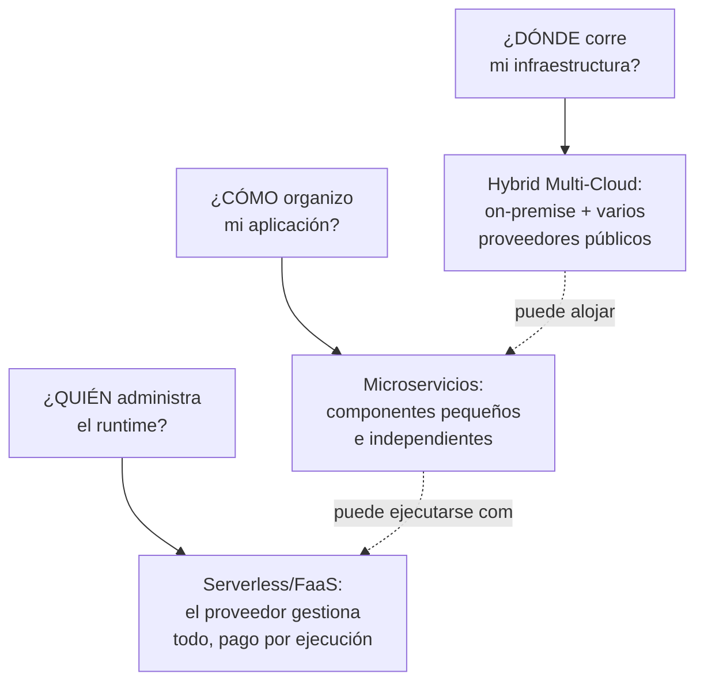
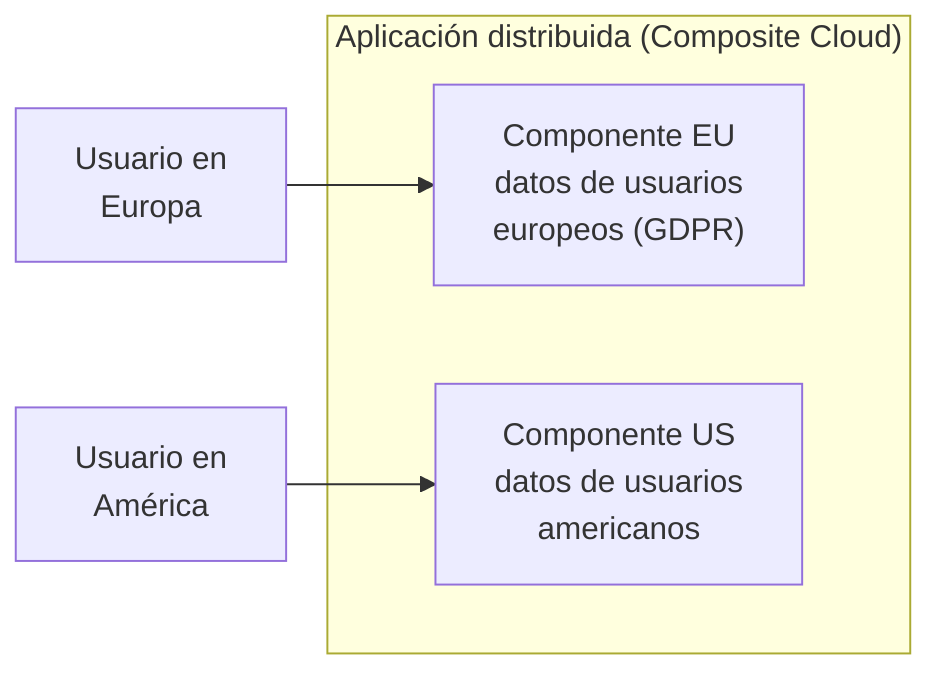
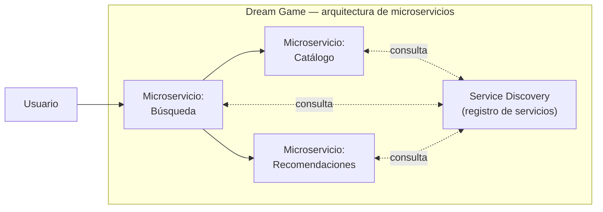
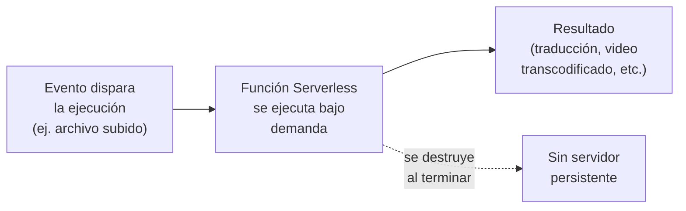
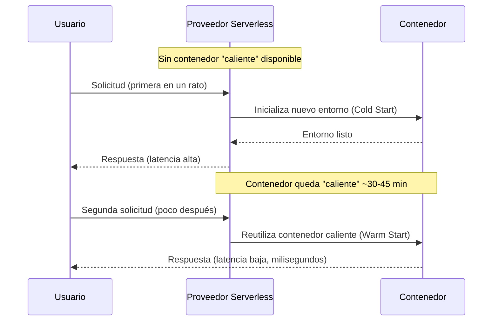
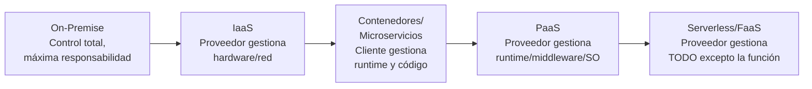
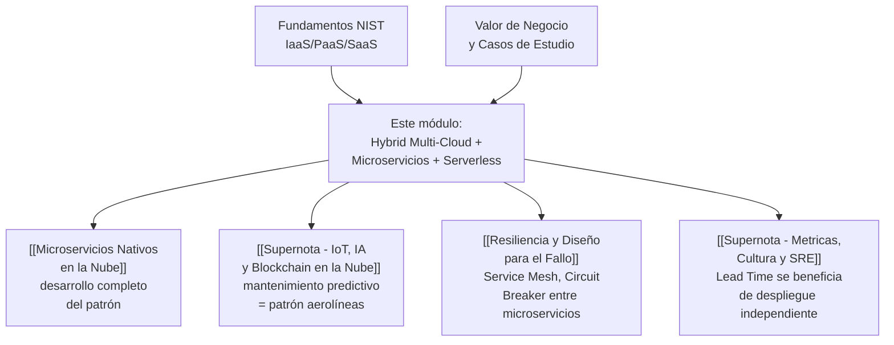

# Supernota: Hybrid Multi-Cloud, Arquitectura de Microservicios y Serverless Computing

> [!abstract] Resumen rápido del módulo
> Este módulo cubre **tres patrones arquitectónicos modernos** que suelen combinarse en la práctica: **Hybrid Multi-Cloud** (combinar nube privada on-premise con múltiples proveedores públicos), **Microservicios** (descomponer una aplicación en componentes pequeños e independientes) y **Serverless/FaaS** (delegar por completo la gestión de infraestructura al proveedor, pagando solo por ejecución). Los tres representan puntos distintos en un mismo espectro: **dónde** corre el código (hybrid multi-cloud), **cómo se organiza** el código (microservicios), y **quién administra** la infraestructura que lo ejecuta (serverless).

> [!note] Esta es una supernota
> Este archivo combina **cuatro fragmentos de un mismo módulo de lección** que me pasaste: (1) Hybrid Multi-Cloud, (2) Arquitectura de Microservicios, (3) Serverless Computing, y (4) el resumen final de cierre de la lección ("In this lesson, you have learned..."). Los traduje del inglés al español conservando los términos técnicos en inglés (con su definición en español la primera vez que aparecen), y añadí profundidad técnica, tablas comparativas, diagramas y fuentes reales que no estaban en tu resumen original — señaladas explícitamente como contenido complementario. Donde el tema ya se cubrió a fondo en una nota anterior de tu vault (ej. Microservicios), enlazo en vez de repetir, y solo agrego lo que es **nuevo** en este módulo específico.

---

## Índice de esta supernota
1. [[#1. Cómo encajan estas tres arquitecturas]]
2. [[#2. Hybrid Multi-Cloud Computing]]
3. [[#3. Arquitectura de Microservicios — lo nuevo de este módulo]]
4. [[#4. Serverless Computing (Function as a Service)]]
5. [[#5. El espectro completo — de On-Premise a Serverless]]
6. [[#6. Conceptos complementarios]]
7. [[#7. Cómo se conecta este módulo con el resto del vault]]
8. [[#8. Preguntas para repasar]]
9. [[#9. Recursos recomendados]]
10. [[#10. Notas relacionadas del vault]]

---

## 1. Cómo encajan estas tres arquitecturas

Antes de entrar en cada tema, conviene ver que **no son alternativas que compiten entre sí**, sino **decisiones independientes en distintas capas** de una misma arquitectura. Una empresa real puede (y suele) combinar las tres al mismo tiempo: desplegar en un esquema **hybrid multi-cloud** (dónde corre todo), organizar su aplicación como **microservicios** (cómo se divide el código), y ejecutar algunos de esos microservicios como funciones **serverless** (quién administra el runtime de cada uno).

> [!tip] La frase que conecta las tres
> Un mismo microservicio de "recomendaciones" (patrón de la sección 3) podría desplegarse como contenedor de larga duración en un clúster on-premise, **o** como una función serverless en AWS Lambda que se activa solo cuando un usuario visita la página — la decisión de organización (microservicios) es independiente de la decisión de ejecución (serverless) y de la decisión de ubicación (hybrid multi-cloud).

---

## 2. Hybrid Multi-Cloud Computing

### 2.1 Dos términos que se confunden constantemente

Tu resumen los usa casi como sinónimos, pero técnicamente son conceptos distintos — ya se había adelantado la distinción en [[Supernota - Fundamentos de Cloud Computing]] (sección 3), aquí se retoma con las definiciones exactas que usa este módulo:

| Término | Definición precisa | Analogía |
|---|---|---|
| **Hybrid Cloud** (Nube Híbrida) | Conecta la **nube privada** de una organización (on-premise o gestionada por un tercero) con **nubes públicas de terceros**, formando una infraestructura unificada donde cargas de trabajo y datos pueden moverse entre ambos entornos | Un negocio con una bodega propia (privada) que también renta espacio en un almacén compartido (pública) cuando necesita más capacidad |
| **Multi-Cloud** (Multi-Nube) | Usa una **mezcla de servicios de nube pública de distintos proveedores** (ej. parte en AWS, parte en GCP) para diferentes aplicaciones o necesidades de infraestructura — sin necesariamente involucrar nube privada | Contratar distintos proveedores de logística según la ruta, aunque todos sean "públicos" |

> [!important] El matiz que tu resumen no aclara explícitamente
> **Hybrid** describe la mezcla de **modelos de despliegue** (privado + público). **Multi-cloud** describe la mezcla de **proveedores** dentro del modelo público. Una organización puede ser las dos cosas a la vez ("hybrid multi-cloud"): mantener un datacenter privado **y** usar simultáneamente AWS y Azure para distintas cargas públicas — que es exactamente el escenario que describe este módulo.

### 2.2 Casos de uso de negocio (del resumen original)

**Cloud Scaling (Escalado en la nube)**
Las empresas pueden escalar recursos dinámicamente hacia arriba o hacia abajo usando servicios cloud para manejar cargas de trabajo variables, evitando el escalado costoso de infraestructura on-premise. Este es el mismo mecanismo técnico de **Cloud Bursting**, ya definido en [[Supernota - Fundamentos de Cloud Computing]] (sección 12.3): la aplicación corre normalmente en infraestructura privada, pero "desborda" hacia la nube pública cuando la demanda excede la capacidad local.

**Composite Cloud (Nube Compuesta)**
Las aplicaciones pueden distribuirse entre múltiples nubes para optimizar el rendimiento y las necesidades regionales — por ejemplo, dividiendo componentes entre datacenters europeos y americanos. Esto conecta directamente con dos conceptos ya vistos:
- **Región y Availability Zone** ([[Supernota - Fundamentos de Cloud Computing]], sección 12.2): desplegar componentes físicamente más cerca del usuario final reduce latencia.
- **Cumplimiento legal / Compliance** ([[Supernota - Fundamentos de Cloud Computing]], sección 9.3): regulaciones como el **GDPR** europeo pueden exigir que ciertos datos de usuarios europeos se almacenen físicamente en la Unión Europea — un "composite cloud" no es solo una optimización de rendimiento, también puede ser un **requisito legal** de residencia de datos.

### 2.3 Ejemplo de industria: modernización de aerolíneas

El resumen describe dos patrones específicos del sector aéreo:

1. **Modernización de sistemas legacy**: los sistemas on-premise heredados (*legacy systems*) se integran con *backends* móviles basados en la nube para mejorar la experiencia del usuario y habilitar funciones nuevas como el **re-reservado de vuelos en tiempo real** (*real-time flight rebooking*).
2. **Datos e IA**: las aerolíneas combinan datos históricos con IA y machine learning en la nube para **predecir necesidades de mantenimiento** y reducir retrasos.

> [!note] Cómo se relaciona con casos ya vistos en el vault
> Este patrón de mantenimiento predictivo (sensores/datos históricos + IA en la nube prediciendo fallas) es **el mismo mecanismo técnico** que el caso de **KONE** ya cubierto en [[Supernota - IoT, IA y Blockchain en la Nube]] (sección 4.6) — solo que aplicado a motores y sistemas de aeronaves en vez de ascensores. Y el patrón de "sistema legacy que se moderniza sin reescritura completa" es un ejemplo de la estrategia **Replatform** de las 6 R's de migración ([[Supernota - Fundamentos de Cloud Computing]], sección 7.2): el sistema on-premise no se reemplaza de golpe, se le agrega una capa cloud-native (el *backend* móvil) que lo complementa — un patrón de adopción **híbrida y gradual**, no un "big bang".
>
> Nótese la diferencia con el caso de **American Airlines** ya visto en [[Supernota Valor de negocio de la nube y casos de estudio]] (sección 5.1): ese caso trata sobre **microservicios** (cómo se organiza el código); este resumen trata sobre **hybrid cloud** (dónde corre la infraestructura, legacy + nube). Ambos patrones son complementarios y es común que una misma aerolínea real los aplique simultáneamente.

### 2.4 Prevención de vendor lock-in

El resumen señala que hybrid multi-cloud previene el **vendor lock-in** (dependencia de un proveedor único) al permitir flexibilidad de cargas de trabajo entre distintas plataformas cloud. Esto retoma directamente el riesgo ya explicado en [[Supernota - Fundamentos de Cloud Computing]] (sección 9.5): si una aplicación está profundamente integrada a APIs propietarias de un solo proveedor, migrar a futuro se vuelve costoso — multi-cloud es precisamente una de las estrategias de mitigación mencionadas ahí.

### 2.5 Plataformas reales de gestión hybrid/multi-cloud

*(Contenido complementario — no estaba en tu resumen original)*

Tu resumen describe el concepto de forma abstracta; en la práctica, los tres grandes proveedores ofrecen productos concretos para gestionar infraestructura híbrida y multi-nube:

| Plataforma | Proveedor | Filosofía / enfoque |
|---|---|---|
| **AWS Outposts** | Amazon | Enfoque centrado en hardware: <cite index="6-1">lleva la experiencia completa de AWS —cómputo, almacenamiento y servicios— directamente a las instalaciones del cliente usando hardware gestionado por AWS</cite>, extendiendo la Región de AWS hacia el datacenter propio |
| **Microsoft Azure Arc** | Microsoft | Enfoque centrado en gestión: extiende el plano de control de Azure hacia infraestructura on-premise, otros proveedores de nube y ubicaciones edge, sin exigir hardware propietario de Microsoft |
| **Google Anthos** | Google | Enfoque centrado en aplicaciones y Kubernetes: <cite index="6-1">entrega una plataforma consistente para construir y gestionar aplicaciones en contenedores a través de nubes e infraestructura on-premise</cite>, construida sobre Google Kubernetes Engine (GKE) y con **Anthos Service Mesh** (basado en Istio) para observabilidad y seguridad de microservicios |

> [!note] Por qué esta tabla es relevante para el módulo completo
> Anthos conecta directamente los tres temas de esta supernota en un solo producto real: es una plataforma **hybrid multi-cloud** (sección 2), diseñada específicamente para gestionar **microservicios** en contenedores (sección 3), sobre la infraestructura que sea (on-premise, GCP, AWS o Azure). Es el ejemplo más concreto de que estos tres patrones no son teóricos — existe tooling de la industria construido explícitamente para combinarlos.

### 2.6 Marco complementario: Distributed Cloud (Gartner)

*(Contenido complementario)*

Gartner formalizó en 2020 el concepto de **Distributed Cloud**: la distribución física de servicios de nube pública hacia distintas ubicaciones (datacenter del cliente, edge, otra región), mientras que el **origen, la operación, la gobernanza, las actualizaciones y la evolución** de esos servicios siguen siendo responsabilidad del proveedor de nube pública original. Es útil como marco paraguas para entender productos como AWS Outposts o Azure Arc: no son "nube privada tradicional" ni "nube pública remota" — son una tercera categoría donde el proveedor extiende su control operativo hacia una ubicación física distinta.

---

## 3. Arquitectura de Microservicios — lo nuevo de este módulo

> [!note] Este tema ya tiene una nota dedicada en tu vault
> La arquitectura de microservicios ya se explicó a fondo en [[Microservicios Nativos en la Nube]] — **no la repito completa aquí**. Esta sección solo cubre el **resumen necesario para seguir el hilo** y, sobre todo, los **elementos específicos y nuevos** que trajo este resumen puntual (el *Service Discovery* formal y el ejemplo de "Dream Game") que no necesariamente estaban desarrollados en la nota anterior.

### 3.1 Resumen del concepto (recordatorio breve)
Los microservicios son un método de construir aplicaciones como una **colección de servicios pequeños e independientes** que se comunican mediante APIs y otros métodos de mensajería — cada uno desplegable por separado, en vez de una aplicación monolítica única.

### 3.2 Lo nuevo de este resumen: contenedores por servicio con stack propio
El resumen enfatiza un matiz técnico específico: **cada microservicio corre en su propio contenedor con su propio stack tecnológico**, lo que permite desarrollo y escalado independientes. Esto significa, en la práctica:
- Un equipo puede escribir su microservicio en **Node.js**, otro en **Go**, otro en **Python** — cada uno elige el lenguaje/entorno más adecuado para su función específica, sin que eso afecte a los demás servicios (**políglota** por diseño).
- Cada contenedor se **escala de forma independiente**: si el servicio de "búsqueda" recibe 10 veces más tráfico que el de "catálogo", solo se escalan las réplicas de búsqueda — reduciendo el desperdicio de recursos frente a escalar toda una aplicación monolítica completa.

### 3.3 Service Discovery — término formal nuevo de este módulo

El resumen introduce el concepto de **Service Discovery** (Descubrimiento de Servicios) como el mecanismo que permite que los microservicios se **encuentren y se comuniquen entre sí** vía APIs. Vale la pena formalizarlo, porque es uno de los problemas técnicos centrales de cualquier arquitectura de microservicios real:

> [!important] ¿Por qué hace falta "descubrir" servicios si ya sé que existen?
> En un entorno cloud-native, las instancias de un microservicio se crean y destruyen constantemente (auto-escalado, despliegues, fallos, reinicios) — cada instancia nueva puede recibir una **IP y puerto distintos**. Service Discovery resuelve el problema de "¿a qué dirección le hablo *ahora mismo*?" sin que cada servicio tenga que tener direcciones hardcodeadas de los demás.

Existen dos patrones principales *(contenido complementario, no detallado en el resumen)*:

| Patrón | Cómo funciona | Ejemplos de tecnología |
|---|---|---|
| **Client-Side Discovery** | El servicio que llama consulta directamente un **Service Registry** (registro de servicios) para obtener la dirección actual del servicio destino, y decide a cuál instancia enviar la solicitud | Netflix Eureka, Consul |
| **Server-Side Discovery** | El servicio que llama envía la solicitud a un balanceador o *router* intermedio, que consulta el registro y enruta la solicitud sin que el cliente sepa nada del registro | Kubernetes Services (DNS interno + kube-proxy), AWS ELB |

> [!tip] Kubernetes ya resuelve esto por defecto
> Si los microservicios corren orquestados por Kubernetes (ya mencionado en [[Supernota - Fundamentos de Cloud Computing]], sección 5.3), el Service Discovery viene incorporado: cada servicio recibe un nombre DNS estable dentro del clúster, y Kubernetes actualiza automáticamente a qué IPs de Pod apunta ese nombre — el desarrollador no tiene que implementar el patrón desde cero.

### 3.4 Caso práctico del módulo: "Dream Game"

El resumen usa un ejemplo llamado **Dream Game** para ilustrar el patrón en acción:

- La aplicación separa **catálogo de contenido**, **búsqueda** y **recomendaciones** en microservicios independientes, cada uno en su propio contenedor.
- **Service Discovery** permite que estos microservicios se encuentren y se comuniquen vía APIs.
- Cuando se agrega una funcionalidad nueva — por ejemplo, **recomendaciones personalizadas** — se puede desplegar **rápidamente, sin interrumpir el resto de la aplicación**, porque solo se actualiza el microservicio de recomendaciones.

> [!note] Por qué este ejemplo es representativo, no anecdótico
> El patrón "actualizar recomendaciones sin tocar catálogo ni búsqueda" es exactamente el mismo beneficio de **despliegue independiente** que ilustra el caso real de **American Airlines** en [[Supernota Valor de negocio de la nube y casos de estudio]] (sección 5.1) — equipos lanzando mejoras a funcionalidades específicas sin coordinar un despliegue masivo de toda la aplicación.

### 3.5 Beneficios organizacionales y de costo (del resumen)
- **Paralelización de equipos**: múltiples desarrolladores o equipos pueden trabajar simultáneamente en distintos microservicios, mejorando la eficiencia — ver **Ley de Conway** en la sección 6, que explica *por qué* esto funciona mejor con equipos pequeños.
- **Escalado independiente reduce costos**: escalar solo el componente que lo necesita, en vez de escalar toda la aplicación monolítica, reduce el desperdicio de recursos de cómputo.

---

## 4. Serverless Computing (Function as a Service)

Este es el tema con **mayor profundidad técnica nueva** de este módulo — se desarrolla completo porque el resumen original, aunque conciso, toca varios conceptos que un examen técnico evaluaría a fondo.

### 4.1 Qué es serverless, con precisión técnica

> [!important] "Serverless" no significa "sin servidores"
> El nombre es engañoso: los servidores siguen existiendo, pero su **gestión** (aprovisionamiento, parches, escalado, capacidad) queda completamente **delegada al proveedor de la nube**. El desarrollador solo escribe código de lógica de negocio; nunca administra, ve ni configura directamente un servidor. Es la evolución lógica del espectro IaaS → PaaS → **Serverless**, cediendo aún más control técnico a cambio de aún menos esfuerzo operativo — ver la regla mnemotécnica de [[Supernota - Fundamentos de Cloud Computing]] (sección 2.5).

Atributos clave según el resumen:
- **Delega la gestión de infraestructura** (escalado, programación/*scheduling*, aprovisionamiento) al proveedor de nube, permitiendo que los desarrolladores se enfoquen en el código y la lógica de negocio.
- **Ejecuta código bajo demanda, por solicitud** (*on-demand per request*), escala automáticamente, y **cobra solo por los recursos usados** — a diferencia de un servidor virtual tradicional, que cobra por tiempo de aprovisionamiento independientemente de si está siendo usado activamente.

### 4.2 Arquitectura: funciones sin estado dentro de contenedores

El código corre como **funciones sin estado** (*stateless functions*) dentro de contenedores, **sin necesitar contexto de ejecución previo** para cada solicitud — cada invocación es independiente de la anterior, no "recuerda" nada por sí misma (cualquier estado que necesite persistir debe guardarse externamente, ej. en una base de datos o almacenamiento).

Este modelo formaliza lo que en [[Supernota - Fundamentos de Cloud Computing]] (sección 2.6) se mencionó brevemente como **FaaS (Function as a Service)**: el proveedor gestiona toda la infraestructura, incluso el runtime específico de cada ejecución; el cliente solo despliega funciones individuales.

### 4.3 Casos de uso (del resumen)

Serverless es adecuado para:
- **Funciones de corta duración y sin estado** (*short-running, stateless functions*).
- **Cargas de trabajo estacionales** (*seasonal workloads*) — picos predecibles de demanda en momentos específicos.
- **Procesamiento basado en eventos** (*event-based processing*) — reaccionar automáticamente a un evento (ej. un archivo subido a un bucket de almacenamiento).
- **Microservicios** — cada función puede ser, en sí misma, un microservicio individual (conectando directamente con la sección 3).
- **Tareas de procesamiento de datos**: traducción de texto, normalización de audio, transcodificación de video.

### 4.4 Desafíos y consideraciones (del resumen, con profundidad técnica añadida)

**No ideal para procesos de larga duración**
Para cargas de trabajo que corren de forma continua y prolongada, un servidor tradicional (o un contenedor de larga duración) puede ser más simple y **más barato** que serverless — el modelo de pago por invocación deja de ser ventajoso cuando la función está prácticamente "siempre activa".

**Vendor lock-in potencial**
Depender de características específicas de la plataforma serverless de un proveedor (ej. integraciones nativas de AWS Lambda con otros servicios de AWS) puede dificultar migrar esa lógica a otro proveedor — el mismo riesgo ya visto en [[Supernota - Fundamentos de Cloud Computing]] (sección 9.5), pero más agudo en serverless porque el código suele estar más "atado" a APIs propietarias del proveedor que en IaaS.

**Cold Start (Arranque en Frío)** — el desafío más citado en la industria

El resumen menciona que los retrasos por *cold start* pueden impactar aplicaciones de baja latencia como sistemas financieros. Vale la pena formalizar el mecanismo:

> [!warning] Qué es exactamente un Cold Start
> Cuando una función serverless no ha sido invocada recientemente, el proveedor **no mantiene un contenedor "caliente" (*warm*) esperando**. La primera solicitud después de un periodo de inactividad obliga al proveedor a **inicializar un nuevo entorno de ejecución** (descargar el código, arrancar el runtime, correr la inicialización) antes de poder procesar la solicitud — este arranque adicional es el *cold start*, y puede añadir desde cientos de milisegundos hasta varios segundos de latencia extra en la primera invocación.

*(Contenido complementario)* — Mitigaciones reales de la industria contra el cold start:
- **Provisioned Concurrency** (AWS Lambda): permite pre-inicializar un número definido de entornos de ejecución que quedan siempre listos, garantizando <cite index="14-1">respuestas con latencia de milisegundos de dos dígitos</cite> a cambio de un costo adicional por mantenerlos activos.
- **SnapStart** (AWS Lambda, runtimes Java): usa <cite index="16-1">instantáneas (*snapshots*) en caché del entorno de ejecución para mejorar significativamente el tiempo de arranque</cite>, sin el costo adicional de Provisioned Concurrency.
- Este es exactamente el tipo de detalle técnico que hace que serverless **no sea recomendable "tal cual" para sistemas de trading financiero** como el caso de **ActivTrades** visto en [[Supernota Valor de negocio de la nube y casos de estudio]] (sección 5.4) — un cold start de incluso 200ms puede ser financieramente costoso en ese contexto, por lo que ese tipo de cargas suele preferir infraestructura siempre activa (IaaS/contenedores de larga duración) en vez de FaaS puro.

### 4.5 Proveedores reales de serverless

*(Contenido complementario)*

| Proveedor | Servicio FaaS | Nota distintiva |
|---|---|---|
| **AWS** | AWS Lambda | Pionero comercial del modelo FaaS (2014); catálogo de integraciones nativas más extenso |
| **Microsoft Azure** | Azure Functions | Fuerte integración con el ecosistema Azure y Visual Studio |
| **Google Cloud** | Google Cloud Functions / Cloud Run Functions | Integración nativa con servicios de datos e IA de GCP |

### 4.6 Serverless vs Contenedores vs Máquinas Virtuales

Esta tabla **extiende** la comparativa de VM vs Contenedor ya vista en [[Supernota - Fundamentos de Cloud Computing]] (sección 5.3), agregando la columna de Serverless:

| | **VM** | **Contenedor** | **Serverless (FaaS)** |
|---|---|---|---|
| Qué gestiona el cliente | SO completo, runtime, app | Runtime, dependencias, app | Solo la función/código de negocio |
| Tiempo de arranque | Minutos | Segundos | Milisegundos (warm) / segundos (cold start) |
| Modelo de facturación | Por tiempo de aprovisionamiento | Por tiempo de ejecución del contenedor | Por invocación y tiempo real de ejecución |
| Duración típica de la carga | Larga duración | Larga o corta duración | Corta duración, eventos puntuales |
| Control técnico | Máximo | Alto | Mínimo |

---

## 5. El espectro completo — de On-Premise a Serverless

*(Síntesis complementaria que conecta este módulo con [[Supernota - Fundamentos de Cloud Computing]])*

> [!important] La regla que resume todo el módulo
> A medida que se avanza de izquierda a derecha en este espectro, el cliente **cede control técnico a cambio de menos esfuerzo operativo** — exactamente el mismo principio ya formalizado en [[Supernota - Fundamentos de Cloud Computing]] (sección 2.5) para IaaS/PaaS/SaaS. Microservicios y serverless no son un modelo de servicio nuevo del NIST — son **patrones de arquitectura y ejecución** que se combinan con los modelos de servicio ya existentes (un microservicio puede vivir en IaaS, PaaS o como FaaS).

---

## 6. Conceptos complementarios (no cubiertos en los resúmenes originales)

### 6.1 Ley de Conway (Conway's Law)
Principio formulado por Melvin Conway en 1967: *las organizaciones tienden a diseñar sistemas que reflejan su propia estructura de comunicación interna*. Es la explicación formal de por qué los microservicios permiten que "múltiples equipos trabajen en paralelo" (sección 3.5): si un equipo pequeño y autónomo es dueño completo de un microservicio, la estructura organizacional (equipos pequeños, poco acoplados) se refleja directamente en la arquitectura técnica (servicios pequeños, poco acoplados) — y viceversa, una arquitectura de microservicios mal alineada con la estructura de equipos reales suele fallar.

### 6.2 API Gateway
Componente que actúa como **punto de entrada único** para todas las solicitudes de clientes externos hacia una arquitectura de microservicios — se encarga de enrutamiento, autenticación, *rate limiting* y a veces agregación de respuestas de varios microservicios en una sola. Sin un API Gateway, cada cliente externo tendría que conocer las direcciones de cada microservicio individual (el mismo problema que resuelve Service Discovery, sección 3.3, pero de cara al exterior en vez de entre servicios internos).

### 6.3 Service Mesh
Capa de infraestructura dedicada a gestionar la comunicación **entre** microservicios (no con el exterior, a diferencia del API Gateway): maneja *retries*, *circuit breakers*, encriptación de tráfico interno, y observabilidad, sin que cada microservicio tenga que implementar esa lógica por separado. **Istio** es el más conocido — de hecho, **Anthos Service Mesh** (sección 2.5) está construido sobre Istio, mostrando cómo estos conceptos se combinan en productos reales.

### 6.4 Backend for Frontend (BFF)
Patrón donde se crea una capa de API dedicada y adaptada a las necesidades específicas de **cada tipo de cliente** (app móvil, web, smart TV) en vez de exponer directamente los microservicios internos — útil cuando distintos clientes necesitan distintas combinaciones o formatos de los mismos datos subyacentes (ej. Dream Game podría tener un BFF distinto para su app móvil y su versión web).

### 6.5 FinOps aplicado a serverless y multi-cloud
Ya se introdujo **FinOps** en [[Supernota Valor de negocio de la nube y casos de estudio]] (sección 8.4) — cobra relevancia especial aquí porque el modelo de facturación por invocación de serverless y la dispersión de gasto entre múltiples proveedores en multi-cloud hacen que el control de costos sea **más difícil de visualizar** que con un servidor tradicional de costo fijo mensual — exactamente el tipo de "gasto descontrolado sin visibilidad" que FinOps busca resolver.

---

## 7. Cómo se conecta este módulo con el resto del vault

Este módulo funciona como el **"cómo se construye y dónde corre"** de todo lo visto en supernotas anteriores: retoma el espectro IaaS/PaaS/SaaS de [[Supernota - Fundamentos de Cloud Computing]] y lo extiende con patrones de arquitectura (microservicios) y ejecución (serverless), mientras que el hybrid multi-cloud conecta directamente con los riesgos de vendor lock-in y compliance ya cubiertos ahí. Los casos de aerolíneas y "Dream Game" son versiones específicas de los mismos patrones ya vistos en los casos de American Airlines, UBank, Bitly y KONE.

---

## 8. Preguntas para repasar (auto-evaluación)

- [ ] ¿Cuál es la diferencia técnica exacta entre Hybrid Cloud y Multi-Cloud? ¿Puede una organización ser ambas cosas a la vez?
- [ ] ¿Qué es "Composite Cloud" y por qué puede ser tanto una optimización de rendimiento como un requisito legal (GDPR)?
- [ ] ¿Por qué el caso de aerolíneas de este módulo (hybrid) es un patrón distinto — pero complementario — al caso de American Airlines (microservicios) visto antes?
- [ ] ¿Qué es Service Discovery y por qué es necesario en un entorno donde las instancias de servicios cambian constantemente de IP?
- [ ] ¿Cuál es la diferencia entre Client-Side y Server-Side Service Discovery?
- [ ] ¿Qué significa exactamente que una función serverless sea "stateless"?
- [ ] ¿Qué es un Cold Start, por qué ocurre, y qué dos técnicas mitigan su impacto en AWS Lambda?
- [ ] ¿Por qué serverless no es la mejor opción para un sistema de trading financiero como ActivTrades?
- [ ] ¿Qué es la Ley de Conway y cómo explica el beneficio organizacional de los microservicios?
- [ ] ¿Cuál es la diferencia entre un API Gateway y un Service Mesh?
- [ ] Ubica IaaS, PaaS, Contenedores/Microservicios y Serverless en el espectro de control técnico vs esfuerzo operativo — ¿en qué orden van y por qué?

---

## 9. Recursos recomendados para profundizar

- 🌐 [AWS Lambda — documentación oficial](https://docs.aws.amazon.com/lambda/latest/dg/lambda-concurrency.html) — cold starts, concurrencia y Provisioned Concurrency.
- 🌐 [AWS — Provisioned Concurrency (AWS Compute Blog)](https://aws.amazon.com/blogs/compute/creating-low-latency-high-volume-apis-with-provisioned-concurrency/)
- 🌐 [Martin Fowler — Microservices](https://martinfowler.com/articles/microservices.html) — el artículo de referencia que popularizó formalmente el término y sus características.
- 🌐 [Google Cloud Anthos — documentación oficial](https://cloud.google.com/anthos)
- 🌐 [Microsoft Azure Arc — documentación oficial](https://learn.microsoft.com/azure/azure-arc/)
- 🌐 [AWS Outposts — documentación oficial](https://aws.amazon.com/outposts/)
- 🌐 [Gartner — What Is Distributed Cloud?](https://www.gartner.com/en/information-technology/glossary/distributed-cloud) — marco original del concepto.
- 🌐 [CNCF — Service Mesh Landscape](https://landscape.cncf.io/) — panorama de herramientas de Service Mesh y Service Discovery en el ecosistema cloud-native.

---

## 10. Notas relacionadas del vault
- [[Supernota - Fundamentos de Cloud Computing]]
- [[Supernota Valor de negocio de la nube y casos de estudio]]
- [[Supernota - IoT, IA y Blockchain en la Nube]]
- [[Microservicios Nativos en la Nube]]
- [[Resiliencia y Diseño para el Fallo]]
- [[Supernota - Metricas, Cultura y SRE]]
- [[IaC - Infraestructura Efimera y Entrega Inmutable]]

---
#devops #cloud-computing #hybrid-multicloud #microservicios #serverless
