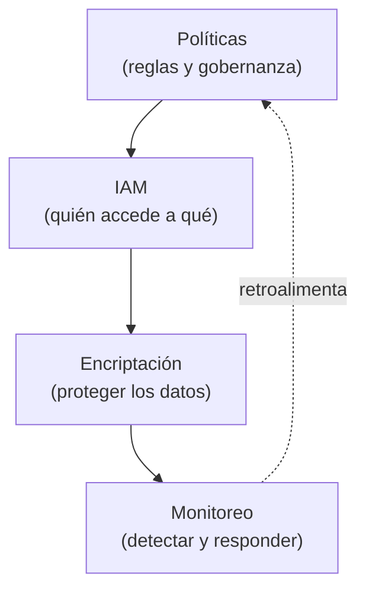
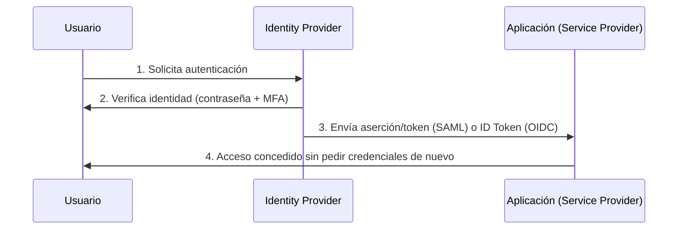
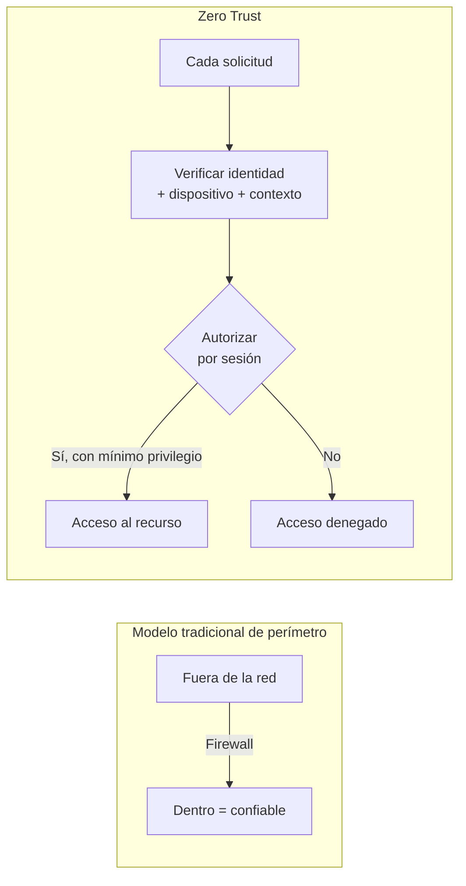
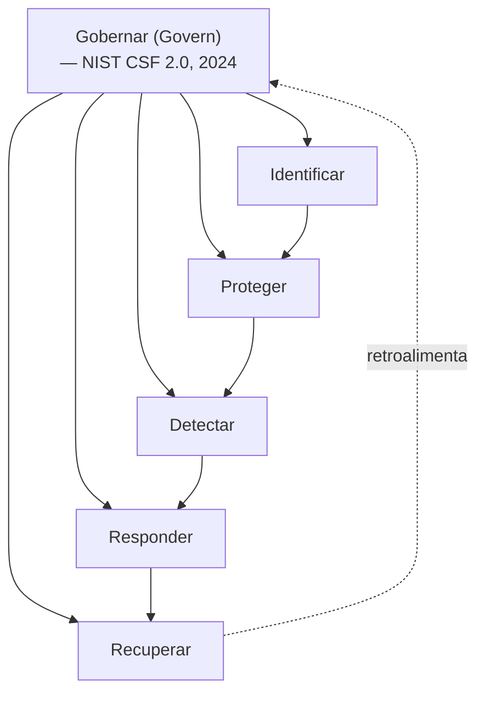
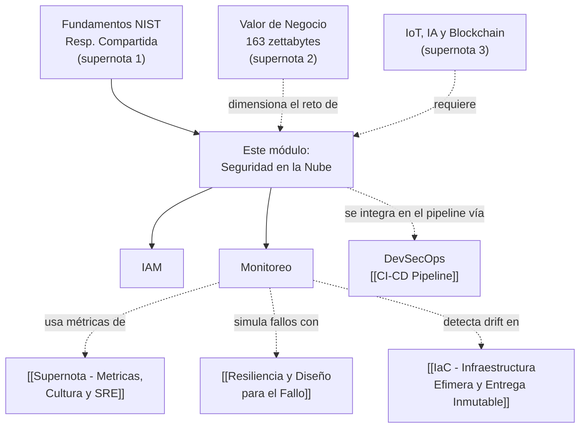

# Supernota: Seguridad en la Nube (Cloud Security) — Amenazas, IAM, Encriptación y Monitoreo

> [!abstract] Resumen rápido del módulo
> La seguridad en la nube es una **responsabilidad compartida** entre proveedor y cliente que se ejecuta a lo largo de todo el ciclo de vida de la aplicación. Este módulo cubre cuatro pilares que se refuerzan entre sí: **gestión de identidad y acceso** (Identity and Access Management - IAM, quién puede hacer qué), **encriptación** (proteger los datos en reposo, en tránsito y en uso), **monitoreo** (detectar anomalías y responder a tiempo) y **políticas formales de gobernanza** (las reglas que amarran todo lo anterior). Se apoya en marcos formales de la industria como el **NIST Cybersecurity Framework**, la **Arquitectura de Confianza Cero** (Zero Trust Architecture) y el **Modelo de Responsabilidad Compartida** ya introducido en [[Supernota - Fundamentos de Cloud Computing]].

> [!note] Nota sobre esta supernota
> Esta nota combina **ocho resúmenes de lección** en inglés (challenges, hybrid cloud security, políticas, IAM, encriptación, y dos resúmenes sobre monitoreo, más un resumen integrador final) en un solo módulo temático de **Seguridad en la Nube**, traducidos al español conservando los términos técnicos en inglés con su definición en español la primera vez que aparecen. El orden de las secciones no sigue el orden de entrega de los resúmenes originales — se reorganizó por tema para evitar repetir contenido (varios resúmenes tocaban IAM, encriptación y monitoreo por separado) y se marca explícitamente con callouts `[!note] Aporte adicional` todo lo que se agregó y no estaba en tus resúmenes.

---

## Índice de esta supernota
1. [[#1. Panorama general — seguridad como responsabilidad compartida y continua]]
2. [[#2. Desafíos y amenazas en la seguridad de la nube]]
3. [[#3. El Modelo de Responsabilidad Compartida aplicado a seguridad]]
4. [[#4. Políticas de seguridad en la nube]]
5. [[#5. Identity and Access Management (IAM) en profundidad]]
6. [[#6. Encriptación en la nube]]
7. [[#7. Monitoreo en la nube (Cloud Monitoring)]]
8. [[#8. Marco NIST de Ciberseguridad (NIST CSF)]]
9. [[#9. Cloud Security Posture Management (CSPM)]]
10. [[#10. Tendencias emergentes en seguridad de la nube]]
11. [[#11. Conceptos complementarios]]
12. [[#12. Cómo se conecta este módulo con el resto del vault]]
13. [[#13. Preguntas para repasar]]
14. [[#14. Recursos recomendados]]
15. [[#15. Notas relacionadas del vault]]

---

## 1. Panorama general — seguridad como responsabilidad compartida y continua

> [!important] Idea central del módulo
> La seguridad en la nube (**Cloud Security**) abarca políticas, tecnologías, servicios y soluciones diseñadas para proteger aplicaciones y datos empresariales frente a amenazas internas (*insider threats*), filtraciones de datos (*data breaches*), problemas de cumplimiento normativo (*compliance*) y ataques organizados. No es un producto que se "compra una vez" — es una **responsabilidad compartida** entre el proveedor de la nube y la organización cliente, que debe aplicarse durante **todo el ciclo de vida de la aplicación**: diseño, desarrollo, despliegue y operación.

Los resúmenes que me compartiste convergen en cuatro dominios técnicos que se refuerzan mutuamente, y que estructuran el resto de esta nota:

Ningún dominio funciona bien de forma aislada: unas políticas sin IAM que las haga cumplir son solo texto; IAM sin encriptación protege el acceso pero no los datos si alguien los exfiltra; y todo lo anterior sin monitoreo es invisible cuando algo falla — no sabrías que ocurrió una brecha hasta que fuera demasiado tarde.

---

## 2. Desafíos y amenazas en la seguridad de la nube

### 2.1 Falta de visibilidad (Lack of Visibility)
En entornos de nube pública, a la organización le resulta difícil **rastrear con precisión** quién accede a los datos y cómo se está usando cada servicio cloud, especialmente cuando ese uso ocurre **fuera del perímetro tradicional** que el equipo de seguridad controlaba en un datacenter propio. Esta falta de visibilidad es, según reportes recientes de la industria (ver sección 11.5), uno de los factores que más ha crecido en importancia como preocupación de seguridad en la nube.

### 2.2 Riesgos de Multitenancy (Multi-Tenancy)
Cuando **múltiples clientes comparten la misma infraestructura física** de un proveedor de nube (el modelo de *Resource Pooling* del NIST, ver [[Supernota - Fundamentos de Cloud Computing]]), existe el riesgo teórico de que un ataque dirigido a otro cliente ("vecino") en la misma infraestructura compartida termine exponiendo o afectando los servicios propios — por ejemplo, mediante vulnerabilidades en la capa de aislamiento del hipervisor.

### 2.3 Amenazas internas (Insider Threats)
Provienen de personas que **tienen o tuvieron acceso legítimo** al entorno (empleados actuales, ex-empleados, contratistas) y que abusan de esos permisos — ya sea de forma maliciosa o por negligencia. Son especialmente peligrosas porque **suelen pasar desapercibidas para los sistemas de seguridad externos** (firewalls, detección de intrusos), que están diseñados para detectar atacantes de *fuera* del perímetro, no un uso indebido de credenciales válidas desde dentro.

### 2.4 Ataques de Denegación de Servicio Distribuido (DDoS)
Los ataques **DDoS (Distributed Denial-of-Service)** saturan servidores con volúmenes de tráfico anormalmente altos, explotando en algunos casos protocolos como **SNMP** (*Simple Network Management Protocol*) para amplificar el ataque, con el objetivo de interrumpir la disponibilidad del servicio.

> [!note] Aporte adicional — cómo funciona un ataque de amplificación SNMP
> SNMP se usa normalmente para monitorear y gestionar dispositivos de red. En un **ataque de amplificación**, el atacante envía una pequeña solicitud a un servidor SNMP mal configurado falsificando (*spoofing*) la dirección IP de origen para que parezca ser la de la víctima; el servidor responde con un paquete mucho más grande **directamente a la víctima** — logrando que un volumen pequeño de tráfico enviado por el atacante se convierta en un volumen masivo de tráfico recibido por la víctima. Es el mismo principio detrás de otros ataques de amplificación conocidos (DNS, NTP, memcached).

### 2.5 Tabla resumen: amenaza → por qué es difícil de mitigar → control principal

| Amenaza | Por qué es difícil de mitigar | Control principal |
|---|---|---|
| Falta de visibilidad | Los datos y accesos ocurren fuera del perímetro tradicional | Monitoreo centralizado (sección 7) + CSPM (sección 9) |
| Multitenancy | Depende del aislamiento que provee el hipervisor del proveedor | Modelo de Responsabilidad Compartida (sección 3) + elegir proveedores certificados |
| Insider threats | Usa credenciales legítimas, no dispara alertas de intrusión externa | IAM con mínimo privilegio + auditoría de accesos (sección 5) |
| DDoS | Volumen de tráfico difícil de distinguir del tráfico legítimo en el primer momento | Servicios anti-DDoS del proveedor (ej. AWS Shield) + monitoreo de red |

---

## 3. El Modelo de Responsabilidad Compartida aplicado a seguridad

Este marco ya se introdujo de forma general en [[Supernota - Fundamentos de Cloud Computing]] (sección 8) — aquí se retoma con la precisión que da el resumen específico de seguridad, que detalla exactamente **qué asegura cada parte según el modelo de servicio**:

| Modelo de servicio | Qué asegura el proveedor | Qué asegura el cliente |
|---|---|---|
| **IaaS** | Infraestructura física (servidores, red, almacenamiento, virtualización) | Software, sistema operativo, datos, configuración de aplicaciones |
| **PaaS** | La plataforma completa (infraestructura + SO + middleware + runtime) | Su código de aplicación y sus datos |
| **SaaS** | La mayoría de los aspectos de seguridad (infraestructura, plataforma, aplicación) | Principalmente, la **protección de sus credenciales de acceso** (contraseñas, MFA) |

> [!important] El patrón detrás de la tabla
> Nota el patrón: a medida que se avanza de IaaS → PaaS → SaaS, la responsabilidad del cliente se **reduce progresivamente** — de "casi todo" en IaaS a "solo tus credenciales" en SaaS. Es exactamente el mismo patrón de cesión de control técnico a cambio de menor carga operativa que ya viste en [[Supernota - Fundamentos de Cloud Computing]] sección 2 (tabla de capas IaaS/PaaS/SaaS), aplicado específicamente al dominio de seguridad.

> [!warning] Por qué esto es la causa #1 de brechas de seguridad en la nube
> La mayoría de los incidentes de seguridad en la nube **no ocurren porque el proveedor falle** — ocurren porque el cliente asume incorrectamente que una responsabilidad que le corresponde a él ya está cubierta por el proveedor (por ejemplo, dejar un bucket de almacenamiento mal configurado como público, o no activar MFA). Esta idea coincide con el error común ya señalado en [[Supernota - Fundamentos de Cloud Computing]] sección 8.

---

## 4. Políticas de seguridad en la nube

### 4.1 ¿Qué es una política de seguridad, formalmente?
Una política de seguridad en la nube es un documento formal que define **las reglas de acceso y protección** de los recursos cloud de una organización. No es simplemente una lista de recomendaciones — sigue una estructura documentada y auditable.

### 4.2 Componentes de una política formal
El resumen original identifica los componentes estándar que debe tener una política de este tipo:

| Componente | Qué define |
|---|---|
| **Título** | Nombre identificable de la política |
| **Alcance (Scope)** | A qué sistemas, datos o usuarios aplica |
| **Objetivos** | Qué busca lograr la política (ej. prevenir accesos no autorizados) |
| **Declaración (Statement)** | Las reglas concretas y accionables |
| **Roles** | Quién es responsable de aplicarla y hacerla cumplir |
| **Cumplimiento (Compliance)** | Cómo se verifica que se está siguiendo, y consecuencias de no hacerlo |
| **Revisión** | Cada cuánto se re-evalúa y actualiza la política |

### 4.3 Políticas del proveedor vs políticas del cliente
Tanto el proveedor de nube como el cliente tienen sus propias políticas, y ambas coexisten:
- **El proveedor** establece políticas que garantizan una **seguridad base** (baseline) para todos sus clientes por igual — ej. cifrado por defecto de discos, aislamiento entre tenants.
- **El cliente** debe **adaptar sus propias políticas** a sus necesidades específicas (su industria, su regulación, su tolerancia al riesgo) — el proveedor no puede saber, por ejemplo, qué nivel de acceso necesita cada rol dentro de la organización del cliente.

### 4.4 Principio de mínimo privilegio (Principle of Least Privilege)
El **Principio de Mínimo Privilegio** (*Principle of Least Privilege*, PoLP) establece que cada usuario, servicio o proceso debe tener **únicamente los permisos estrictamente necesarios** para realizar su función — ni uno más. Esto reduce directamente el riesgo de accesos no autorizados o el impacto de un posible mal uso (intencional o accidental) de las credenciales.

> [!tip] Por qué el mínimo privilegio reduce el "radio de explosión" de un incidente
> Si un atacante compromete una cuenta que solo tiene permisos de lectura sobre un recurso específico, el daño posible está **limitado** a ese recurso. Si esa misma cuenta tuviera permisos administrativos amplios "por si acaso", un solo compromiso de credenciales podría escalar a un incidente de toda la infraestructura. El mínimo privilegio no evita que ocurra un compromiso — limita **cuánto puede hacer** el atacante si ocurre.

### 4.5 Niveles de acceso según el tipo de usuario
No todos los usuarios necesitan el mismo tipo de acceso: algunos solo necesitan la **consola web** del proveedor (interfaz gráfica), mientras que otros — típicamente perfiles técnicos — trabajan directamente desde **entornos de desarrollo**, usando **APIs** y herramientas de **línea de comandos (CLI)** para automatizar tareas. Este matiz se desarrolla con más detalle en la sección 5.2, donde se formalizan los tres tipos de usuario de la nube.

---

## 5. Identity and Access Management (IAM) en profundidad

### 5.1 IAM como primera línea de defensa
**IAM (Identity and Access Management — Gestión de Identidad y Acceso)** es, según los resúmenes, la **primera línea de defensa** en seguridad de la nube: controla **quién** puede autenticarse y **qué** puede hacer una vez autenticado, sobre cualquier recurso cloud.

### 5.2 Tres tipos de usuarios en la nube
Un marco útil (y explícito en el resumen original) para pensar en IAM es clasificar a los usuarios según su función, porque cada tipo tiene necesidades de acceso y niveles de riesgo distintos:

| Tipo de usuario | Quiénes son | Nivel de riesgo | Acceso típico |
|---|---|---|---|
| **Usuarios administrativos** (*Administrative Users*) | Administradores de nube, gerentes de infraestructura | **El más alto** — controlan entornos de producción completos | Consola de administración, permisos amplios sobre cuentas y recursos |
| **Usuarios desarrolladores** (*Developer Users*) | Desarrolladores de aplicaciones y plataformas | Medio-alto — pueden desplegar código y modificar configuración | APIs, CLI, entornos de desarrollo/staging |
| **Usuarios de aplicación** (*Application Users*) | Usuarios finales de las apps alojadas en la nube | Generalmente bajo (por usuario individual), pero el volumen es masivo | Interfaces de la aplicación, sin acceso a infraestructura subyacente |

> [!warning] Por qué las cuentas administrativas son el objetivo #1 de los atacantes
> Las cuentas administrativas son las más sensibles precisamente porque **controlan los entornos de producción** — comprometer una sola cuenta admin puede dar acceso a toda la infraestructura, mientras que comprometer una cuenta de aplicación individual normalmente solo afecta a ese usuario. Por eso los controles más estrictos (MFA obligatorio, monitoreo de sesión, acceso *just-in-time*) deben concentrarse en este tipo de usuario.

### 5.3 Autenticación vs Autorización — la diferencia exacta
Estos dos términos suelen confundirse, pero son conceptualmente distintos y ambos son componentes formales de IAM:

| | **Autenticación (Authentication)** | **Autorización (Authorization)** |
|---|---|---|
| Pregunta que responde | ¿Eres quién dices ser? | ¿Qué tienes permitido hacer? |
| Cuándo ocurre | Primero — al iniciar sesión | Después — en cada acción sobre un recurso |
| Mecanismos típicos | Contraseñas, MFA, proveedores de identidad (*identity providers*), servicios de directorio en la nube | Políticas de acceso, roles, grupos |
| Ejemplo | Ingresar usuario + contraseña + código MFA | Que ese usuario autenticado solo pueda leer (no borrar) una base de datos específica |

> [!important] Esto NO significa lo mismo
> Un usuario puede estar **autenticado correctamente** (el sistema confirma que es quien dice ser) y aun así **no estar autorizado** para una acción específica (ej. borrar una base de datos de producción). Confundir ambos conceptos es un error común: "iniciar sesión" no equivale a "tener permiso para todo".

### 5.4 Identity Providers, MFA y servicios de directorio
La autenticación se apoya en tres piezas técnicas:
- **Identity Providers (proveedores de identidad)**: sistemas que verifican y certifican la identidad de un usuario (ej. Okta, Azure AD/Entra ID, Google Workspace).
- **Multifactor Authentication — MFA (Autenticación Multifactor)**: requiere **más de un factor** de verificación (algo que sabes, como una contraseña + algo que tienes, como un código en tu teléfono, o algo que eres, como una huella digital) — reduce drásticamente el riesgo de que una sola credencial robada (ej. contraseña filtrada) sea suficiente para comprometer una cuenta.
- **Cloud Directory Services (servicios de directorio en la nube)**: gestionan de forma centralizada las credenciales y atributos de todos los usuarios de una organización.

### 5.5 Estándares de identidad federada: SAML vs OpenID Connect

Los resúmenes mencionan estándares de identidad que permiten **Single Sign-On (SSO — inicio de sesión único)**: un usuario se autentica una sola vez y accede a múltiples servicios sin volver a ingresar credenciales. Los dos estándares dominantes de la industria son distintos entre sí y vale la pena precisarlos:

| | **SAML** (*Security Assertion Markup Language*) | **OpenID Connect (OIDC)** |
|---|---|---|
| Formato de los datos | XML | JSON (más ligero) |
| Construido sobre | Protocolo propio | Se construye sobre **OAuth 2.0** (protocolo de autorización) |
| Caso de uso típico | Entornos empresariales tradicionales (SSO corporativo hacia apps SaaS) | Aplicaciones web y móviles modernas, ecosistemas de APIs |
| Ejemplo de uso | Iniciar sesión en Salesforce usando las credenciales corporativas de Active Directory | "Iniciar sesión con Google/Microsoft" en una app de consumo |

### 5.6 Zero Trust Architecture (Arquitectura de Confianza Cero)
El resumen sobre seguridad en la nube híbrida menciona que las estrategias de IAM deben **soportar arquitectura de confianza cero y autenticación continua**.

> [!note] Aporte adicional — el marco formal detrás de "Zero Trust"
> El estándar de referencia de la industria es **NIST SP 800-207 (Zero Trust Architecture)**, publicado en agosto de 2020. Su principio central es **"nunca confíes, siempre verifica"** (*never trust, always verify*): a diferencia del modelo tradicional de seguridad de perímetro (donde, una vez dentro de la red corporativa, un dispositivo se consideraba "confiable"), Zero Trust asume que **ninguna ubicación de red otorga confianza implícita** — cada solicitud de acceso, sin importar si viene de "dentro" o "fuera" de la red, debe autenticarse, autorizarse y cifrarse de forma individual y continua. NIST SP 800-207 define siete principios (*tenets*) rectores, entre ellos: todos los recursos de datos y servicios deben protegerse por igual; el acceso se otorga por sesión y bajo mínimo privilegio; y el comportamiento de identidad se monitorea de forma continua para detectar riesgo en tiempo real, no solo en el momento del login. A diferencia de los modelos tradicionales, que asumen que todo lo que está dentro del perímetro corporativo es confiable, Zero Trust no otorga confianza implícita basada en ubicación física, de red o propiedad del dispositivo.

### 5.7 Controles de seguridad y gestión del ciclo de vida del acceso
Controles concretos que refuerzan IAM, según el resumen:
- **Aprovisionamiento basado en roles (Role-Based Provisioning)**: el acceso se asigna según el **rol** del usuario (ver RBAC, sección 11.6), no de forma manual caso por caso.
- **Políticas de contraseñas**: complejidad mínima, expiración periódica y otras reglas de higiene de credenciales.
- **Desprovisioning inmediato**: cuando un usuario cambia de rol o abandona la organización, su acceso debe **revocarse de inmediato** — un retraso aquí es una de las causas más comunes de accesos huérfanos que luego se explotan.

### 5.8 Reporting, auditoría y cumplimiento
IAM no termina en "otorgar acceso" — también incluye funciones de **reporting, auditoría y cumplimiento**: monitorear quién accedió a qué y cuándo, validar que las políticas de seguridad se están cumpliendo realmente en la práctica (no solo en el papel), y detectar patrones que sugieran mal uso o una posible brecha.

---

## 6. Encriptación en la nube

### 6.1 Fundamentos: algoritmo y llave
La **encriptación (encryption — cifrado)** transforma datos legibles en un formato ilegible sin la clave correcta, garantizando que solo usuarios autorizados puedan acceder a información sensible. Requiere dos componentes:
- Un **algoritmo de cifrado**, que transforma los datos originales.
- Una **llave de descifrado (decryption key)**, que revierte la transformación para devolver los datos a su forma legible.

### 6.2 Los tres estados de los datos
Los datos necesitan protección en **tres estados distintos**, y cada uno tiene retos técnicos diferentes:

| Estado | Qué significa | Protocolos/técnicas típicas |
|---|---|---|
| **En reposo (At Rest)** | Datos almacenados (discos, bases de datos, backups) | Cifrado de bloques de almacenamiento, archivos, objetos y bases de datos |
| **En tránsito (In Transit)** | Datos que se están transmitiendo por la red | **SSL/TLS** (*Secure Sockets Layer* / *Transport Layer Security*) |
| **En uso (In Use)** | Datos que están siendo procesados activamente (ej. en memoria RAM) | Cifrado en memoria, entornos de ejecución confiables (*Trusted Execution Environments*) |

> [!important] El estado que más se descuida
> Los estados "en reposo" y "en tránsito" están relativamente bien resueltos con herramientas estándar (casi cualquier proveedor cifra por defecto discos y tráfico HTTPS). El estado **"en uso"** es el más difícil técnicamente, porque los datos deben estar en texto legible en algún momento para que la CPU pueda procesarlos — es un área activa de investigación (ver *Confidential Computing* y *Trusted Execution Environments* como conceptos relacionados).

### 6.3 Cifrado server-side vs client-side
En almacenamiento en la nube, el cifrado puede aplicarse en dos puntos distintos del flujo:

| | **Server-side encryption** | **Client-side encryption** |
|---|---|---|
| Quién cifra los datos | El proveedor de nube (o el cliente, configurando el servicio del proveedor) | El propio usuario/aplicación, **antes** de subir los datos |
| Dónde vive la llave | Puede gestionarla el proveedor o el cliente | Siempre la gestiona el cliente |
| Nivel de confianza requerido en el proveedor | El proveedor ve los datos sin cifrar en algún punto del proceso | El proveedor **nunca** ve los datos sin cifrar |

### 6.4 Gestión de llaves (Key Management)
Las llaves de cifrado son el componente más crítico del sistema: **perder las llaves significa perder el acceso a los datos**, sin importar que los datos en sí sigan intactos.

**Mejores prácticas identificadas en el resumen:**
- Almacenar las llaves **separadas** de los datos que protegen.
- Realizar **respaldos regulares** de las llaves.
- **Rotación periódica** de llaves (cambiarlas regularmente para limitar el impacto si una llave se ve comprometida).
- Requerir **MFA** específicamente para acceder a la gestión de llaves.

### 6.5 Estrategia unificada en entornos multi-cloud
En entornos **multi-cloud** (ya definidos en [[Supernota - Fundamentos de Cloud Computing]] sección 3), gestionar el cifrado por separado en cada proveedor genera inconsistencias y puntos ciegos. El resumen señala la necesidad de una **estrategia de cifrado unificada** que incluya gestión de accesos, gestión del ciclo de vida de las llaves y registro de auditoría (*audit logging*) consistente entre todos los proveedores usados.

> [!note] Aporte adicional — cifrado simétrico vs asimétrico, y el modelo real que usan los proveedores
> Los resúmenes no explican **cómo** funciona técnicamente un algoritmo de cifrado — dos familias son la base de todo lo anterior:
> - **Cifrado simétrico**: la misma llave cifra y descifra (ej. **AES-256**, el estándar más usado para cifrar datos en reposo). Es rápido, pero requiere un canal seguro para compartir la llave.
> - **Cifrado asimétrico**: usa un par de llaves matemáticamente relacionadas — una **pública** (para cifrar) y una **privada** (para descifrar) — ej. **RSA**. Resuelve el problema de compartir la llave, pero es computacionalmente más lento.
> - En la práctica, los proveedores de nube combinan ambos en un patrón llamado **envelope encryption (cifrado de sobre)**: los datos se cifran con una llave simétrica (rápida), y esa llave simétrica a su vez se cifra con una llave maestra gestionada en un servicio especializado — un **KMS (Key Management Service)** o, para el nivel más alto de seguridad, un **HSM (Hardware Security Module)**, un dispositivo físico dedicado exclusivamente a proteger llaves criptográficas.

---

## 7. Monitoreo en la nube (Cloud Monitoring)

### 7.1 Propósito y beneficios
El monitoreo en la nube es esencial para gestionar la complejidad de los despliegues cloud, dando visibilidad y control sobre aplicaciones, servicios e infraestructura. Según los resúmenes, permite:
- Evaluar rendimiento, asignación de recursos, disponibilidad de red, cumplimiento y riesgos de seguridad.
- **Acelerar el diagnóstico de incidentes** (reducir el tiempo entre "algo falló" y "sabemos qué falló").
- Controlar costos de monitoreo, dar notificaciones proactivas, y aportar información específica para entornos de **Kubernetes y contenedores**.

### 7.2 Componentes fundamentales del monitoreo
El resumen desglosa el monitoreo en cinco componentes técnicos que trabajan juntos:

| Componente | Función |
|---|---|
| **Alarmas (Alarms)** | Alertas proactivas cuando una métrica cruza un umbral definido |
| **Logs (registros)** | Recolección y análisis de eventos detallados generados por sistemas y aplicaciones |
| **Métricas (Metrics)** | Datos numéricos de rendimiento a lo largo del tiempo, usados para visualización |
| **Dashboards (tableros)** | Visualización en tiempo real de la salud general del sistema |
| **Procesamiento de eventos (Event Processing)** | Detecta patrones en los eventos y **dispara acciones automáticas** en respuesta |

Juntos, estos componentes permiten **detectar anomalías, diagnosticar problemas y responder rápidamente** ante posibles incidentes — la base técnica de lo que en [[Supernota - Metricas, Cultura y SRE]] se formaliza como observabilidad y respuesta a incidentes.

### 7.3 Tipos de herramientas de monitoreo
No todo el monitoreo cubre lo mismo — se especializa según la capa que observa:

| Tipo | Qué detecta | Objetivo |
|---|---|---|
| **Monitoreo de infraestructura** | Fallas de hardware y brechas de seguridad a nivel de infraestructura | Prevenir problemas de experiencia de usuario antes de que ocurran |
| **Monitoreo de base de datos** | Consultas (*queries*) y disponibilidad del servicio de base de datos | Asegurar confiabilidad de la capa de datos |
| **APM (Application Performance Monitoring)** | Disponibilidad y rendimiento de la aplicación en sí | Mejorar experiencia de usuario y reducir tiempo de inactividad (*downtime*) |

### 7.4 Monitoreo basado en servicios específicos
El monitoreo también puede enfocarse en **servicios cloud específicos** para optimizar rendimiento y uso de recursos — el resumen menciona explícitamente **balanceadores de carga (load balancers)**, **redes de entrega de contenido (CDN — Content Delivery Networks)** y **grupos de auto-escalado (auto-scaling groups)**, cada uno con métricas propias relevantes para su función (ej. latencia de CDN por región, distribución de tráfico del balanceador, eventos de escalado hacia arriba/abajo del grupo de auto-escalado).

### 7.5 Monitoreo de Infraestructura como Código (IaC)
El monitoreo de **IaC (Infrastructure as Code)** asegura que los despliegues automatizados se **mantengan consistentes** con lo definido en el código, y detecta **drift de configuración** (*configuration drift* — cuando el estado real de la infraestructura se desvía silenciosamente de lo que el código IaC declara, típicamente por cambios manuales no autorizados) — un tema que se desarrolla en profundidad en [[IaC - Infraestructura Efimera y Entrega Inmutable]].

### 7.6 Rastreo de llamadas API para auditoría
Monitorear las **llamadas API (API calls)** es crítico para seguridad y cumplimiento: provee un **rastro de auditoría (audit trail)** y permite detectar actividad no autorizada o sospechosa. Los servicios especializados que ofrecen los principales proveedores son:

| Proveedor | Servicio de auditoría de API |
|---|---|
| AWS | **CloudTrail** |
| Google Cloud | **Cloud Audit Logging** |
| Azure | **Activity Logs** |
| Salesforce | **Event Monitoring** |

### 7.7 Mejores prácticas de monitoreo
Según ambos resúmenes sobre este tema:
- **Monitoreo de experiencia de usuario final (end-user experience monitoring)**: capturar el rendimiento de la aplicación desde la perspectiva real del usuario, no solo desde métricas de servidor.
- **Consolidar en una plataforma unificada** el monitoreo de nube privada, pública e híbrida, para gestionar KPIs de forma centralizada.
- **Automatizar** los procesos de monitoreo y **simular caídas (simulate outages)** para probar que las alertas y la detección de fallos realmente funcionan antes de que ocurra un incidente real — un principio que se conecta directamente con la ingeniería del caos (*Chaos Engineering*) y con la cultura de asumir el fallo como inevitable ya vista en [[Resiliencia y Diseño para el Fallo]].

### 7.8 Del monitoreo a la mitigación de ataques
Los riesgos detectados por el monitoreo (DDoS, filtraciones de datos, configuraciones incorrectas, amenazas internas — sección 2) se mitigan combinando:
- Autenticación fuerte y cifrado (secciones 5 y 6).
- Evaluaciones de vulnerabilidad regulares.
- Monitoreo de red continuo.
- Herramientas específicas del proveedor: **AWS Shield** (protección anti-DDoS), **Azure Key Vault** (gestión centralizada de secretos y llaves), y servicios de configuración de seguridad equivalentes en cada plataforma.

---

## 8. Marco NIST de Ciberseguridad (NIST CSF)

El resumen original cita **cinco pilares** del NIST para guiar la computación segura en la nube:

| Pilar | Qué cubre |
|---|---|
| **Identificar (Identify)** | Entender los activos, riesgos y vulnerabilidades de la organización |
| **Proteger (Protect)** | Implementar salvaguardas para limitar o contener un posible incidente |
| **Detectar (Detect)** | Identificar oportunamente la ocurrencia de un evento de ciberseguridad |
| **Responder (Respond)** | Tomar acción ante un incidente detectado |
| **Recuperar (Recover)** | Restaurar capacidades y servicios afectados por un incidente |

> [!note] Aporte adicional — actualización del marco a 6 funciones (NIST CSF 2.0)
> El resumen refleja la versión **1.1** del framework (cinco funciones). En **febrero de 2024**, NIST publicó la versión **2.0**, que añade una sexta función central: **Gobernar (Govern)**, junto a las cinco originales (Identificar, Proteger, Detectar, Responder, Recuperar). Aunque esta dimensión ya existía implícitamente en versiones anteriores del framework, la actualización la establece como función central propia, reconociendo el rol esencial de la gestión de riesgo dentro de las cinco funciones originales. Además, la versión 2.0 amplía el alcance del framework más allá de la infraestructura crítica, aplicándose ahora a organizaciones de todos los tamaños y sectores. Si tu material de examen es reciente, es probable que se evalúen las **6 funciones**, no solo 5 — vale la pena dominar ambas versiones y saber explicar la diferencia.

---

## 9. Cloud Security Posture Management (CSPM)

El resumen menciona **CSPM (Cloud Security Posture Management)** como una herramienta que ayuda a abordar **configuraciones incorrectas (misconfigurations)** y da soporte a componentes centrales de seguridad como IAM y respuesta a amenazas.

> [!note] Aporte adicional — por qué CSPM existe como categoría separada
> CSPM nació como respuesta a un dato recurrente en la industria: la **causa más común de brechas de seguridad en la nube no son vulnerabilidades sofisticadas explotadas por atacantes avanzados, sino errores de configuración** cometidos por el propio cliente (buckets de almacenamiento públicos por error, reglas de firewall demasiado permisivas, roles con permisos excesivos). Las herramientas CSPM **escanean continuamente** el entorno cloud comparando la configuración real contra un conjunto de reglas de buenas prácticas (a menudo alineadas con marcos como el **CIS Benchmarks** o el **Cloud Controls Matrix** de la Cloud Security Alliance — ver sección 11.5), y alertan automáticamente cuando detectan una desviación riesgosa — funcionando como una capa de monitoreo (sección 7) especializada específicamente en **postura de seguridad**, no en rendimiento.

---

## 10. Tendencias emergentes en seguridad de la nube

Según el resumen, las tendencias que están definiendo el futuro cercano de este campo son:

| Tendencia | Qué implica |
|---|---|
| **Estrategias multi-cloud** | Gestionar seguridad consistente entre distintos proveedores simultáneamente (ver [[Supernota - Fundamentos de Cloud Computing]]) |
| **Modelos Zero Trust** | Adopción creciente del principio "nunca confíes, siempre verifica" (sección 5.6) como estándar, no como excepción |
| **DevSecOps** | Integrar la seguridad **dentro** del pipeline de desarrollo y entrega continua, no como una revisión posterior — ver ampliación en sección 11.7 |
| **Aseguramiento de fuerza laboral remota** | Extender controles de seguridad más allá de la red corporativa hacia dispositivos y ubicaciones distribuidas |
| **IA/ML para detección de amenazas** | Usar modelos de aprendizaje automático para detectar patrones anómalos a una escala y velocidad que el análisis manual no puede igualar |

---

## 11. Conceptos complementarios (no cubiertos en los resúmenes originales)

### 11.1 La Tríada CIA (CIA Triad)
El modelo conceptual más fundamental de toda la seguridad de la información — anterior y más amplio que "seguridad en la nube" específicamente — organiza cualquier objetivo de seguridad en tres pilares:
- **Confidencialidad (Confidentiality)**: solo quienes están autorizados pueden ver la información (lo que persigue la encriptación, sección 6).
- **Integridad (Integrity)**: los datos no han sido alterados de forma no autorizada (lo que persigue blockchain como fuente de verdad, ver [[Supernota - IoT, IA y Blockchain en la Nube]]).
- **Disponibilidad (Availability)**: los sistemas están accesibles cuando se necesitan (lo que amenaza directamente un ataque DDoS, sección 2.4, y lo que persigue [[Resiliencia y Diseño para el Fallo]]).

Todo lo cubierto en este módulo (IAM, encriptación, monitoreo, políticas) puede mapearse a uno o más de estos tres objetivos — es una forma útil de "ordenar" el tema completo para un examen.

### 11.2 CASB — Cloud Access Security Broker
Un **CASB** es un punto de control de seguridad (software o servicio) que se sitúa **entre los usuarios de una organización y los servicios cloud que consumen** (a menudo SaaS), dando visibilidad y aplicando políticas de seguridad de forma centralizada sin importar cuántas aplicaciones cloud distintas use la organización — es una respuesta directa al problema de **falta de visibilidad** (sección 2.1) y al riesgo de **Shadow IT** (ya mencionado en [[Supernota - Fundamentos de Cloud Computing]] sección 9.2).

### 11.3 SIEM y SOAR
- **SIEM (Security Information and Event Management)**: sistema que centraliza y correlaciona logs y eventos de seguridad (sección 7.2) de múltiples fuentes para detectar patrones de ataque que no serían visibles observando cada fuente por separado.
- **SOAR (Security Orchestration, Automation and Response)**: va un paso más allá — automatiza la **respuesta** a incidentes detectados (ej. bloquear automáticamente una IP sospechosa), reduciendo el tiempo entre detección y contención.

### 11.4 MITRE ATT&CK y superficie de ataque (Attack Surface)
La **superficie de ataque** es el conjunto total de puntos por los que un atacante podría intentar entrar o extraer datos de un sistema (APIs expuestas, credenciales, configuraciones, dependencias de software). **MITRE ATT&CK** es una base de conocimiento pública y ampliamente adoptada por la industria que cataloga **tácticas y técnicas reales usadas por atacantes**, incluyendo una matriz específica para entornos cloud — útil como marco de referencia para pensar sistemáticamente en qué técnicas de ataque son relevantes para tu arquitectura específica.

### 11.5 CSA Top Threats to Cloud Computing ("Pandemic Eleven")
La **Cloud Security Alliance (CSA)** publica periódicamente un reporte de referencia de la industria sobre las principales amenazas de seguridad en la nube, construido a partir de encuestas a cientos de profesionales del sector. La versión más citada de este reporte, "Top Threats to Cloud Computing — Pandemic Eleven", encabeza su lista con la **gestión insuficiente de identidad, credenciales, acceso y llaves** como la amenaza percibida como más significativa — lo cual confirma, con datos de encuesta real de la industria, que **IAM (sección 5) es efectivamente el punto más crítico** de todo este módulo, tal como sugieren tus propios resúmenes al llamarlo "primera línea de defensa". El reporte también documenta un giro relevante en la industria: un reconocimiento cada vez mayor de que la responsabilidad de la seguridad recae cada vez más en el cliente de la nube, y no solo en el proveedor — reforzando directamente la sección 3 de esta nota.

### 11.6 RBAC — Role-Based Access Control
Modelo de control de acceso (mencionado de forma indirecta en el resumen como "aprovisionamiento basado en roles", sección 5.7) donde los permisos no se asignan a usuarios individuales uno por uno, sino a **roles** predefinidos (ej. "Desarrollador", "Analista de datos", "Administrador de red"), y luego se asignan usuarios a esos roles. Simplifica enormemente la gestión a escala: cambiar los permisos de un rol actualiza automáticamente a todos los usuarios asignados a él.

### 11.7 DevSecOps — "Shift Left" en seguridad
El resumen menciona DevSecOps solo como una tendencia emergente (sección 10) — vale la pena precisar su idea central: DevSecOps integra prácticas de seguridad **desde el inicio** del ciclo de desarrollo (diseño, código, CI/CD — ver [[CI-CD Pipeline]]), en vez de tratarla como una revisión final antes del despliegue. Este movimiento de la seguridad "hacia la izquierda" en la línea de tiempo del desarrollo se conoce como ***Shift Left Security***, y comparte la misma filosofía de colaboración entre equipos que ya viste en los fundamentos de DevOps (ver [[Que es DevOps - Definicion y Malentendidos]] y [[Principios Fundamentales de DevOps (Resumen Integrador)]]) — aplicada específicamente al dominio de seguridad.

---

## 12. Cómo se conecta este módulo con el resto del vault

Este módulo funciona como una **capa transversal**, no como un bloque técnico aislado: la seguridad no es "una fase más" del ciclo de vida de la nube — atraviesa la definición NIST (el Modelo de Responsabilidad Compartida es, en el fondo, un problema de seguridad), el valor de negocio (los 163 zettabytes proyectados en [[Supernota Valor de negocio de la nube y casos de estudio]] no tienen valor si no pueden protegerse), las tecnologías emergentes (IoT masivo y modelos de IA descritos en [[Supernota - IoT, IA y Blockchain en la Nube]] amplían dramáticamente la superficie de ataque de cualquier organización), y las prácticas operativas de DevOps (monitoreo, IaC, CI/CD) que ya cubriste en notas anteriores.

---

## 13. Preguntas para repasar (auto-evaluación)

- [ ] ¿Por qué la falta de visibilidad es un riesgo distinto al de un ataque DDoS, y qué tipo de control mitiga cada uno?
- [ ] ¿Por qué los insider threats suelen pasar desapercibidos para los sistemas de seguridad perimetral tradicionales?
- [ ] Para cada modelo de servicio (IaaS, PaaS, SaaS), ¿puedes explicar exactamente qué asegura el proveedor y qué asegura el cliente en materia de seguridad?
- [ ] ¿Cuál es la diferencia exacta entre autenticación y autorización? Da un ejemplo donde alguien esté autenticado pero no autorizado.
- [ ] ¿Cuáles son los tres tipos de usuario de la nube según el resumen, y por qué las cuentas administrativas son el objetivo prioritario de un atacante?
- [ ] ¿Qué diferencia hay entre SAML y OpenID Connect, y en qué escenario usarías cada uno?
- [ ] ¿En qué consiste el principio "never trust, always verify" de Zero Trust Architecture, y en qué se diferencia del modelo de seguridad de perímetro tradicional?
- [ ] ¿Cuáles son los tres estados en los que deben protegerse los datos, y cuál es técnicamente el más difícil de proteger y por qué?
- [ ] ¿Qué pasa si pierdes las llaves de cifrado de tus datos? ¿Por qué las mejores prácticas dicen que las llaves deben guardarse separadas de los datos?
- [ ] ¿Cuál es la diferencia entre cifrado server-side y client-side, en términos de cuánta confianza depositas en el proveedor?
- [ ] ¿Puedes nombrar los cinco (o seis, con Govern) pilares del NIST Cybersecurity Framework y qué cubre cada uno?
- [ ] ¿Qué es CSPM y por qué existe como categoría separada de otras herramientas de seguridad?
- [ ] ¿Cómo mapearías IAM, encriptación y monitoreo a los tres pilares de la Tríada CIA?
- [ ] ¿Qué es DevSecOps y cómo se relaciona con el principio de "Shift Left"?

---

## 14. Recursos recomendados para profundizar

- 📄 [NIST SP 800-207 — Zero Trust Architecture](https://nvlpubs.nist.gov/nistpubs/specialpublications/NIST.SP.800-207.pdf) — el documento oficial que define formalmente Zero Trust, publicado por NIST en agosto de 2020.
- 🌐 [NIST Cybersecurity Framework (CSF) — sitio oficial](https://www.nist.gov/cyberframework) — incluye tanto la versión 1.1 (5 funciones) como la versión 2.0 (6 funciones, con Govern) publicada en febrero de 2024.
- 🌐 [Cloud Security Alliance — Top Threats to Cloud Computing](https://cloudsecurityalliance.org/artifacts/top-threats-to-cloud-computing-pandemic-eleven) — el reporte "Pandemic Eleven", referencia de la industria sobre las amenazas de seguridad en la nube más relevantes según encuestas a profesionales del sector.
- 🌐 [OWASP Cloud-Native Application Security Top 10](https://owasp.org/www-project-cloud-native-application-security-top-10/) — enfoque específico en riesgos de aplicaciones cloud-native.
- 🌐 [AWS Shared Responsibility Model](https://aws.amazon.com/compliance/shared-responsibility-model/) — ya citado en [[Supernota - Fundamentos de Cloud Computing]], relevante de nuevo aquí para la sección 3.
- 📘 *Zero Trust Networks: Building Secure Systems in Untrusted Networks* — Evan Gilman & Doug Barth (O'Reilly) — referencia técnica completa sobre implementación práctica de Zero Trust.
- 📘 *Cloud Security and Privacy* — Tim Mather, Subra Kumaraswamy, Shahed Latif (O'Reilly) — cobertura académica completa de los temas de este módulo.

---

## 15. Notas relacionadas del vault
- [[Supernota - Fundamentos de Cloud Computing]]
- [[Supernota Valor de negocio de la nube y casos de estudio]]
- [[Supernota - IoT, IA y Blockchain en la Nube]]
- [[Resiliencia y Diseño para el Fallo]]
- [[Supernota - Metricas, Cultura y SRE]]
- [[IaC - Infraestructura Efimera y Entrega Inmutable]]
- [[CI-CD Pipeline]]
- [[Microservicios Nativos en la Nube]]
- [[Que es DevOps - Definicion y Malentendidos]]
- [[Principios Fundamentales de DevOps (Resumen Integrador)]]

---
#devops #cloud-computing #seguridad #ciberseguridad #iam #zero-trust
