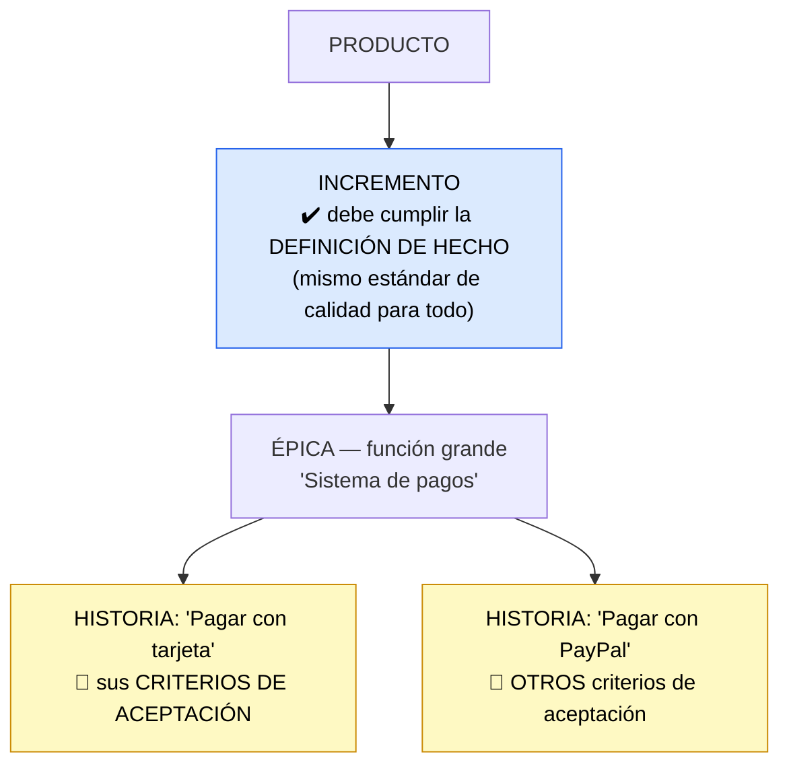

# Criterios de aceptación y Definición de Hecho

> [!abstract] 📄 ¿De qué trata esta nota?
> En Agile surge una pregunta constante: **"¿cuándo está realmente terminado un trabajo?"**. Si no la respondemos bien, el equipo discute, hay retrabajo y se entregan cosas a medias. Esta nota explica las **dos herramientas** que responden esa pregunta desde ángulos distintos: la **Definición de Hecho (DoD)**, que es un estándar de calidad **general** para todo, y los **Criterios de Aceptación (AC)**, que son condiciones **específicas** de cada funcionalidad. Aprenderás a diferenciarlas (es un error clásico confundirlas), cómo se organizan dentro de épicas e historias, y por qué definirlas bien **ahorra tiempo y dinero**.

---

## 🎯 Idea central

> Dos herramientas responden *"¿cuándo está terminado?"*: la **Definición de Hecho** (visión amplia y de calidad, igual para todo) y los **Criterios de Aceptación** (condiciones concretas, distintas en cada funcionalidad). **Una historia solo está completa si cumple AMBAS.**

---

## 📖 Glosario de términos clave

> [!note] Definición de Hecho (DoD – Definition of Done)
> **Definición técnica:** lista de criterios de **alto nivel y reutilizables** que TODO incremento de trabajo debe cumplir para considerarse terminado con la calidad esperada.
> **En palabras simples:** es la **"checklist de calidad de la casa"**, igual para cualquier tarea. Ejemplos: "el código fue revisado por otro", "las pruebas pasan", "la documentación está actualizada". Aplica a todo por igual. La escribe el **equipo de desarrollo** y es su **promesa de calidad**.

> [!note] Criterios de Aceptación (AC – Acceptance Criteria)
> **Definición técnica:** condiciones **específicas y detalladas** que una funcionalidad concreta debe cumplir para ser aceptada por el cliente/usuario.
> **En palabras simples:** son las **reglas particulares de esa función**. Para un carrito de compras: "debe aceptar un código de descuento", "debe enviar un email de confirmación". Cambian de una funcionalidad a otra. Se escriben desde la **perspectiva del usuario**.

> [!note] Incremento
> **Definición:** una porción de producto **terminada y funcional** que se suma a lo ya construido al final de un ciclo. Cada incremento debe cumplir la DoD.

> [!note] Épica (Epic)
> **Definición:** una funcionalidad **grande** que es demasiado amplia para hacerse de una vez; se divide en varias historias más pequeñas.
> **En palabras simples:** el "tema grande". Ej.: "Sistema de pagos".

> [!note] Historia de usuario (User Story)
> **Definición:** una funcionalidad **pequeña**, descrita desde la perspectiva del usuario (*"Como [usuario] quiero [algo] para [beneficio]"*). Es la unidad de trabajo típica de un sprint.
> **En palabras simples:** un pedacito concreto de la épica. Ej.: "Como cliente quiero pagar con tarjeta para completar mi compra".

> [!note] Stakeholder (interesado)
> **Definición:** cualquier persona con interés en el proyecto (cliente, usuario, jefe de producto, negocio). Los AC funcionan como un "acuerdo" con ellos.

---

## 1. La gran diferencia (lo más importante de la nota)

La confusión entre DoD y AC es **el error más común** del tema. Esta tabla lo aclara:

| Aspecto | 🏠 Definición de Hecho (DoD) | 🎯 Criterios de Aceptación (AC) |
|:--|:--|:--|
| **Alcance** | Amplio: igual para **TODO** el trabajo | Específico: único de **CADA** funcionalidad |
| **Nivel** | Alto nivel, general | Detallado, concreto |
| **Pregunta que responde** | "¿El trabajo cumple nuestra calidad?" | "¿Esta función hace lo que el usuario pidió?" |
| **¿Quién lo escribe?** | El **equipo de desarrollo** (promesa de calidad) | Desde la perspectiva del **usuario/negocio** |
| **¿Cambia entre tareas?** | No, es el mismo estándar para todas | Sí, cada historia tiene los suyos |

> [!tip] Truco para no confundirlas nunca
> - **DoD** = *"¿Lo hicimos BIEN?"* (calidad técnica, igual para todo).
> - **AC** = *"¿Hicimos lo CORRECTO?"* (lo que el usuario específicamente quería).
> Una historia está realmente "Done" solo cuando responde **SÍ a ambas**.

---

## 2. Ejemplos concretos (sacados de la práctica real)

> [!example] Ejemplo de Definición de Hecho (aplica a CUALQUIER historia)
> - [ ] El código fue revisado por otro compañero (*peer review*).
> - [ ] Las pruebas automatizadas están escritas y pasan.
> - [ ] El escaneo de seguridad pasa sin vulnerabilidades.
> - [ ] La construcción de Integración Continua (CI) pasa.
> - [ ] La documentación está actualizada.

> [!example] Ejemplo de Criterios de Aceptación (solo para la historia "checkout")
> - El proceso de pago debe manejar al menos 10 artículos distintos en el carrito.
> - El usuario debe poder ingresar un código promocional antes de finalizar.
> - Al completar la compra, el usuario recibe un número de confirmación y un email con el resumen.

👉 Nota cómo la DoD habla de **calidad técnica genérica** y los AC hablan de **lo que esa función específica debe hacer**.

---

## 3. Cómo se organiza todo en Agile

El producto se construye por capas. Así encajan las piezas:

- Cada **incremento** tiene su **DoD**, que garantiza calidad suficiente para avanzar.
- Cada **historia** (dentro de una épica) tiene sus propios **AC**, que guían el desarrollo y la validación.

---

## 4. ¿Por qué importa tanto definirlas bien?

> [!tip] El beneficio en dinero y tiempo
> Definir con claridad la DoD y los AC **antes** de programar:
> - **Reduce el retrabajo:** nadie construye algo "incompleto" que luego hay que rehacer.
> - **Evita malentendidos:** el equipo y el cliente acuerdan de antemano qué significa "listo".
> - **Acelera la entrega:** menos idas y vueltas = software en manos del usuario más rápido.
> - **Sirve de contrato:** los AC son un acuerdo claro entre el equipo Agile y los stakeholders.

---

## 🧠 Analogía para recordarlo todo

> Piensa en un **restaurante**:
> - La **Definición de Hecho** es el **estándar de higiene y presentación** que aplica a *todos* los platillos (cocina limpia, plato caliente, emplatado correcto). Igual para la pizza o la ensalada.
> - Los **Criterios de Aceptación** son lo que el cliente pidió en *su* platillo: "pizza sin cebolla, extra queso, bien cocida". Únicos para ese pedido.
> Un platillo se sirve solo si cumple **el estándar del restaurante (DoD)** Y **lo que el cliente pidió (AC)**.

---

## ✅ Para repasar (autoevaluación)

- [ ] Explica con tus palabras la diferencia entre DoD y AC.
- [ ] ¿Cuál responde "¿lo hicimos bien?" y cuál "¿hicimos lo correcto?"?
- [ ] Da un ejemplo de un ítem de DoD y uno de AC.
- [ ] ¿Quién escribe la DoD y desde qué perspectiva se escriben los AC?
- [ ] ¿Qué diferencia hay entre una épica y una historia?
- [ ] ¿Por qué definir ambas reduce costos y retrabajo?

---

## 🔗 Enlaces relacionados

- [[Integrating QA in Agile Workflows]] — QA ayuda a definir estos criterios en la planificación.
- [[TDD AND BDD]] — BDD escribe los criterios de aceptación como escenarios *dado-cuando-entonces*.
- [[Creando una estrategia de calidad Agile]] — la DoD se alinea con las metas de calidad del proyecto.

---
*Fuente original: [Acceptance Criteria and Definition of Done – Coursera](https://www.coursera.org/learn/qa-process-optimization-agile-automated-testing/lecture/i7iOG/acceptance-criteria-and-definition-of-done). Diferencias y ejemplos ampliados con [Scrum.org](https://www.scrum.org/resources/blog/what-difference-between-definition-done-and-acceptance-criteria).*
