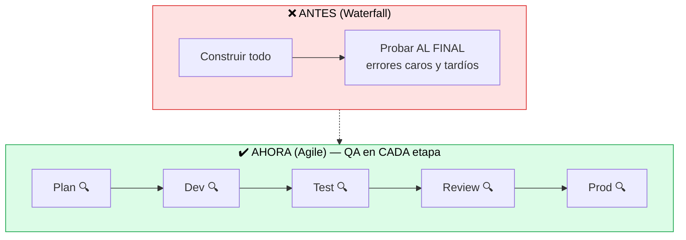
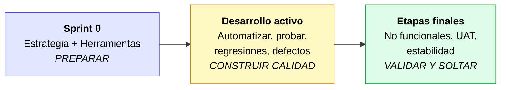

# Integrar QA en las ceremonias Agile

> [!abstract] 📄 ¿De qué trata esta nota?
> Tradicionalmente, las pruebas se hacían **al final**, por un equipo aparte, justo antes de lanzar. Esta nota explica el cambio de mentalidad de Agile: **QA participa desde el principio y en cada etapa**, no solo al final. Veremos qué es **Scrum** y su ciclo (el **sprint**), qué hace QA en cada momento del proyecto (desde el "sprint cero" hasta producción), y una idea central que cambia todo: en Agile, **la calidad es responsabilidad de todo el equipo**, no de un grupo de "testers" aislado. Esta nota es el "mindset" (mentalidad) sobre el que se construye el resto del curso.

---

## 🎯 Idea central

> En Agile, QA **no es una etapa final aislada**: se integra en **cada momento** del ciclo de vida del producto y es **responsabilidad de todo el equipo**. La calidad se **construye** desde el inicio, no se "inspecciona" al final.

---

## 📖 Glosario de términos clave

> [!note] QA (Quality Assurance / Aseguramiento de la Calidad)
> **Definición técnica:** conjunto de actividades planificadas para **garantizar** que el producto cumpla los estándares de calidad **a lo largo de todo el proceso**.
> **En palabras simples:** QA no es solo "buscar bugs al final". Es **cuidar la calidad durante todo el camino**, previniendo errores antes de que ocurran. Asegurar (QA) ≠ solo probar (testing): probar es una parte de QA.

> [!note] Scrum
> **Definición técnica:** marco de trabajo Agile que organiza el desarrollo en ciclos cortos (sprints), con roles, eventos y artefactos definidos.
> **En palabras simples:** es la "forma de jugar" Agile más popular. Divide el trabajo en sprints y usa reuniones llamadas **ceremonias** para coordinarse.

> [!note] Sprint
> **Definición técnica:** ciclo corto de trabajo (de 1 a 4 semanas) que convierte una idea en valor entregable. Es el **corazón de Scrum**.
> **En palabras simples:** una "vuelta" de trabajo con principio y fin. Al terminar, hay algo funcional que mostrar.

> [!note] Ceremonias (eventos de Scrum)
> **Definición:** las reuniones clave de un sprint:
> - **Planificación (Sprint Planning):** se decide qué se hará en el sprint.
> - **Daily (reunión diaria):** sincronización rápida del equipo.
> - **Revisión (Sprint Review):** se muestra lo construido a los stakeholders.
> - **Retrospectiva (Retrospective):** el equipo reflexiona sobre cómo mejorar.

> [!note] Sprint cero (Sprint 0)
> **Definición:** un sprint inicial de **preparación**, antes de empezar a desarrollar funcionalidades. Se montan herramientas, estrategia y bases del proyecto.

> [!note] Pruebas no funcionales
> **Definición técnica:** pruebas que evalúan **cómo** se comporta el sistema (no *qué* hace): rendimiento, seguridad, usabilidad, escalabilidad.
> **En palabras simples:** no prueban "si el botón funciona", sino "si funciona **rápido**, **seguro** y **para muchos usuarios a la vez**".

> [!note] UAT (User Acceptance Testing / Prueba de Aceptación del Usuario)
> **Definición:** pruebas finales donde el **usuario real o cliente** confirma que el software hace lo que necesita antes de salir a producción.

---

## 1. El cambio de mentalidad: "shift left"

La idea de fondo es mover (*shift*) la calidad hacia la **izquierda** del cronograma, es decir, hacia el **inicio**:

> [!tip] Por qué importa
> Encontrar un error temprano cuesta una fracción de encontrarlo en producción. Por eso QA entra **desde la planificación**: definiendo criterios de aceptación, preparando escenarios de prueba y automatizando durante el sprint (no después).

---

## 2. QA en cada etapa del ciclo de vida

QA tiene un papel distinto según el momento del proyecto:

| Etapa | 🔍 Rol de QA | Objetivo |
|:--|:--|:--|
| **Sprint cero** | Define la **estrategia de calidad**, elige herramientas y procesos | Alinear al equipo desde el día 0 |
| **Desarrollo activo** | Analiza ítems, **automatiza pruebas**, ejecuta **regresiones**, resuelve defectos | Construir calidad mientras se programa |
| **Etapas finales** | Pruebas **no funcionales**, integración del sistema, **UAT**, estabilidad | Asegurar que está listo para producción |

> [!note] ¿Qué es una "regresión"?
> Una **prueba de regresión** verifica que lo que **ya funcionaba** sigue funcionando después de agregar algo nuevo. Evita que una mejora rompa algo viejo. (Se profundiza en [[Agile Test Scenarios Management]].)

---

## 3. La calidad es responsabilidad de TODOS

Este es el mensaje más importante de la nota:

> [!warning] Rompe el mito
> ❌ Mito: *"La calidad es trabajo del equipo de QA / los testers."*
> ✔️ Realidad Agile: *"La calidad es responsabilidad de **todo el equipo**."* Desarrolladores, QA, producto y negocio comparten la meta de entregar algo que cumpla expectativas.

¿Cómo se logra esa calidad compartida?
- Con **objetivos claros** desde el inicio.
- Con una **Definición de Hecho** común (ver [[Criteria and Definition of Done]]).
- Entregando un producto que **cumple las expectativas** del usuario, no solo "que no tiene bugs".

---

## 🧠 Analogía para recordarlo todo

> En un **equipo de fútbol**, la defensa no es solo trabajo de los defensas: cuando el rival ataca, **todos** bajan a defender. En Agile pasa igual con la calidad: aunque haya especialistas de QA, **todo el equipo "defiende" la calidad** en cada jugada (cada etapa del sprint). Y, como en el fútbol, es mejor evitar el gol (prevenir el error) que sacar la pelota de la red (arreglarlo en producción).

---

## ✅ Para repasar (autoevaluación)

- [ ] ¿Qué significa "shift left" y por qué ahorra dinero?
- [ ] ¿Qué hace QA en el "sprint cero"?
- [ ] ¿En qué etapa entran las pruebas no funcionales y la UAT?
- [ ] Diferencia entre QA (asegurar) y testing (probar).
- [ ] ¿Qué es una prueba de regresión?
- [ ] ¿Por qué se dice que "la calidad es responsabilidad de todo el equipo"?

---

## 🔗 Enlaces relacionados

- [[Criteria and Definition of Done]] — los criterios que QA ayuda a definir en la planificación.
- [[Creando una estrategia de calidad Agile]] — la estrategia que se define en el sprint cero.
- [[QA y DevOps]] — el enfoque "shift left" llevado a los pipelines automatizados.
- [[Agile Test Scenarios Management]] — cómo se organizan las pruebas y regresiones del sprint.

---
*Fuente original: [Integrating QA in Agile Ceremonies – Coursera](https://www.coursera.org/learn/qa-process-optimization-agile-automated-testing/lecture/aOJQA/integrating-qa-in-agile-ceremonies).*
