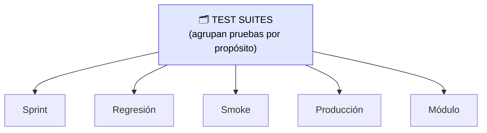
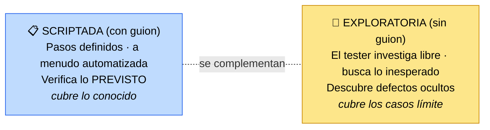

# Gestión de escenarios de prueba Agile

> [!abstract] 📄 ¿De qué trata esta nota?
> Cuando un proyecto crece, acumulas **cientos de pruebas**. ¿Cómo las organizas para que no sean un caos? Esta nota explica los **test suites** (conjuntos de pruebas agrupadas por propósito) y sus tipos (sprint, regresión, smoke, producción, módulo). Luego responde dos preguntas muy prácticas: **¿qué pruebas conviene automatizar y cuáles dejar manuales?** y **¿cómo organizar el tiempo de prueba** (sesiones scriptadas vs exploratorias). Es la nota más "operativa" del módulo: te da criterios concretos para decidir en el día a día.

---

## 🎯 Idea central

> Las pruebas se organizan en **test suites** (colecciones por propósito). Hay que decidir con criterio **qué automatizar** y **qué probar manualmente**, y **combinar** sesiones **scriptadas** (guion fijo) con **exploratorias** (sin guion) para cubrir tanto lo previsto como los casos límite.

---

## 📖 Glosario de términos clave

> [!note] Caso de prueba (test case) y Escenario de prueba (test scenario)
> **Caso de prueba:** instrucción concreta con pasos y un resultado esperado ("haz X, debe pasar Y").
> **Escenario de prueba:** una situación a verificar, más amplia. En esta nota se usan casi como sinónimos: lo importante es que son **unidades de prueba** que se agrupan en suites.

> [!note] Test suite (suite o conjunto de pruebas)
> **Definición técnica:** colección de casos de prueba **agrupados** para evaluar una característica, un módulo o toda la aplicación con un propósito común.
> **En palabras simples:** una **carpeta de pruebas** que van juntas porque sirven para lo mismo. Un mismo caso puede estar en **varias** suites (se reutiliza).

> [!note] Regresión (prueba de regresión)
> **Definición técnica:** pruebas que verifican que la funcionalidad **existente sigue funcionando** después de añadir cambios nuevos.
> **En palabras simples:** comprueba que **lo nuevo no rompió lo viejo**. Se va acumulando: cada sprint suma sus pruebas al "colchón" de regresión.

> [!note] Smoke test (prueba de humo)
> **Definición:** subconjunto **pequeño y rápido** de pruebas que valida solo las **funciones críticas**. Sirve para decir "¿vale la pena seguir probando o algo básico ya está roto?".

> [!note] Resultado determinístico
> **Definición:** una prueba da **siempre el mismo resultado** ante la misma entrada (claro: pasa o falla, sin ambigüedad). Es requisito para automatizar bien.

> [!note] Sesión scriptada vs exploratoria
> **Scriptada:** sigues un **guion** de pruebas definidas de antemano (a menudo automatizadas).
> **Exploratoria:** **sin guion**; el tester investiga libremente para **descubrir** defectos y oportunidades que nadie anticipó.

---

## 1. ¿Qué es un test suite y para qué sirve?

Un test suite es un conjunto de casos de prueba agrupados por un **propósito común**. Organizarlos evita el caos y permite ejecutar "el grupo correcto en el momento correcto".

> ♻️ Un mismo caso de prueba puede pertenecer a **varias** suites (se reutiliza).

### Tipos de test suites

| Suite | Propósito | Cuándo se usa |
|:--|:--|:--|
| **Sprint** | Cerrar el trabajo del sprint y alimentar la *sprint review* | Al final de cada sprint |
| **Regresión** | Verificar que lo viejo sigue funcionando; **acumula** pruebas de sprints previos | Al añadir funcionalidad nueva |
| **Smoke** | Versión reducida de regresión: solo lo **crítico**, rápido | Verificación rápida antes de pruebas profundas |
| **Producción (prod)** | Diseñada para **no interferir** con el negocio real | Validar en producción sin afectar clientes ni reportes |
| **Módulo** | Probar un **módulo individual** de la solución | Al trabajar en una parte concreta |

> [!note] Detalle importante
> Las **pruebas unitarias normalmente NO van** en estas suites: se ejecutan **automáticamente** durante el desarrollo y el despliegue (en el pipeline), no como parte de estas colecciones manuales/funcionales.

---

## 2. ¿Cuándo automatizar y cuándo NO?

Esta es una de las decisiones más importantes (y más preguntadas en exámenes). Automatizar es una **inversión**: cuesta crearla, pero ahorra a la larga **si se usa muchas veces**.

> [!check] ✅ AUTOMATIZA cuando la prueba…
> - **Se repite con frecuencia** (la misma función en cada cambio).
> - **Toma mucho tiempo manualmente** (varios navegadores o dispositivos).
> - Tiene **resultados determinísticos** (pasa/falla claro, sin juicio humano).
> - Prueba algo **estable** que no cambia mucho (si cambia seguido, la automatización se vuelve obsoleta y hay que rehacerla).
> - Maneja **grandes volúmenes de datos** o pruebas **sin interfaz gráfica** (bases de datos, APIs).

> [!fail] ❌ Prefiere prueba MANUAL cuando…
> - Se requiere **juicio humano** (¿se ve bonito? ¿es intuitivo?).
> - La **interfaz cambia con frecuencia** (automatizarla sería tirar dinero).
> - La funcionalidad es **temporal** (no vale la pena el esfuerzo).
> - Necesitas una prueba **rápida y puntual**, una sola vez.

> [!tip] La pregunta clave para decidir
> *"¿Voy a correr esta prueba muchas veces sobre algo que casi no cambia y cuyo resultado es claro?"* → **Sí** = automatiza. → **No** = manual.

---

## 3. Sesiones de prueba: scriptadas vs exploratorias

Una **sesión de prueba** es un periodo de tiempo definido para ejecutar y analizar pruebas con un objetivo claro. Hay dos estilos:

> [!tip] La clave: combinarlas
> - Las **scriptadas** confirman que lo que **esperabas** funciona.
> - Las **exploratorias** encuentran lo que **no se te ocurrió** probar (casos raros, caminos extraños).
> Una buena estrategia usa **ambas**: el guion da cobertura predecible; la exploración atrapa sorpresas.

---

## 4. Buenas prácticas (resumen accionable)

- **Gestiona activamente** los test suites: mantén claro el propósito de cada uno.
- **Evalúa el valor de automatizar** frente al esfuerzo: no todo se automatiza.
- **Reutiliza** escenarios entre suites cuando aplique.
- **Combina** automatización + exploración para cubrir lo previsto **y** los casos límite.

---

## 🧠 Analogía para recordarlo todo

> Piensa en revisar la seguridad de un **aeropuerto**:
> - Los **test suites** son los distintos puntos de control (equipaje, pasaportes, puertas) agrupados por función.
> - La **regresión** es volver a revisar todo lo de siempre cada vez que cambia un procedimiento.
> - El **smoke test** es la inspección rápida de lo más crítico antes de abrir.
> - La sesión **scriptada** es el guardia que sigue su checklist; la **exploratoria** es el perro entrenado que olfatea libremente y encuentra lo que la checklist no contempla. Necesitas **a los dos**.

---

## ✅ Para repasar (autoevaluación)

- [ ] ¿Qué es un test suite y por qué un caso puede estar en varios?
- [ ] Diferencia entre suite de **regresión** y **smoke**.
- [ ] Da tres criterios para decidir **automatizar** un caso y dos para dejarlo **manual**.
- [ ] ¿Por qué las pruebas unitarias no suelen ir en estas suites?
- [ ] ¿Qué busca una sesión **exploratoria** que una **scriptada** no?
- [ ] Formula la "pregunta clave" para decidir si automatizar.

---

## 🔗 Enlaces relacionados

- [[Foundations of test Automation]] — los tipos de prueba que componen las suites y la pirámide.
- [[TDD AND BDD]] — origen de muchas pruebas automatizadas.
- [[Optimización continua de QA]] — priorizar pruebas por riesgo e impacto.
- [[Integrating QA in Agile Workflows]] — dónde encaja la regresión dentro del sprint.

---
*Fuente original: [Agile Test Scenarios Management – Coursera](https://www.coursera.org/learn/qa-process-optimization-agile-automated-testing/lecture/z4BiH/agile-test-scenarios-management).*
