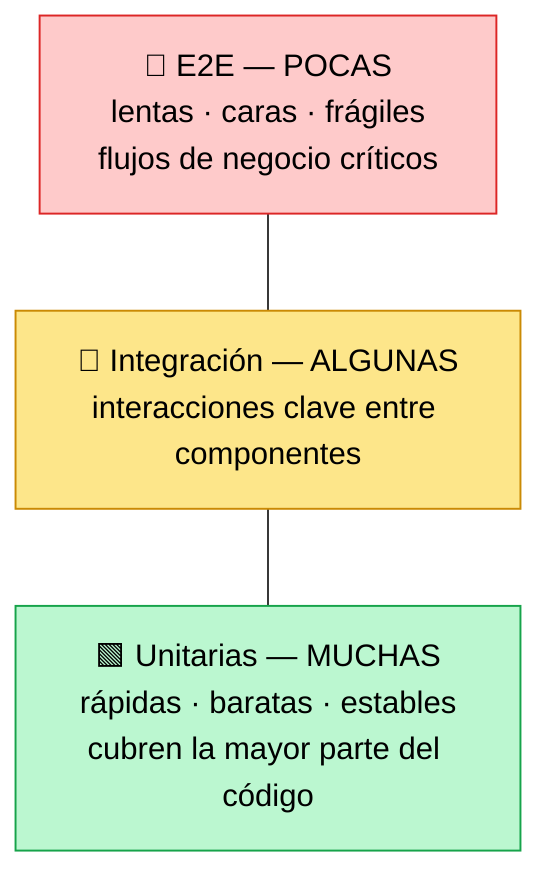
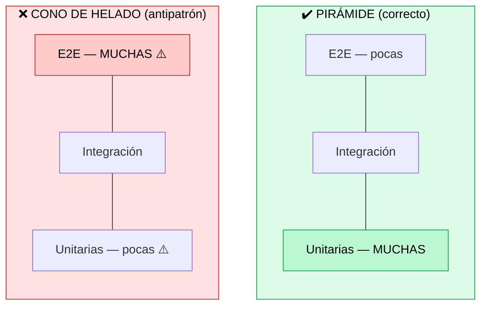

# Fundamentos de la automatización de pruebas

> [!abstract] 📄 ¿De qué trata esta nota?
> Existen muchos tipos de pruebas automatizadas y no todas cuestan ni valen lo mismo. Esta nota explica los **principales tipos de prueba** (unitarias, de integración/API, end-to-end y visuales) y, sobre todo, la herramienta mental clave para organizarlas: la **Pirámide de Pruebas**. La pirámide te dice **cuántas pruebas de cada tipo conviene tener** para gastar bien tu esfuerzo: muchas pruebas baratas y rápidas abajo, pocas pruebas caras y lentas arriba. También verás el **antipatrón** que debes evitar (el "cono de helado"). Es una de las notas más prácticas del curso.

---

## 🎯 Idea central

> Hay varios tipos de pruebas automatizadas. La **Pirámide de Pruebas** indica cómo **distribuir el esfuerzo**: **muchas** pruebas unitarias (rápidas y baratas) en la base, **pocas** pruebas end-to-end (lentas y caras) en la cima.

---

## 📖 Glosario de términos clave

> [!note] Automatización de pruebas
> **Definición técnica:** uso de software para ejecutar pruebas de forma automática y comparar el resultado real con el esperado, sin intervención manual.
> **En palabras simples:** en vez de que una persona pruebe lo mismo una y otra vez a mano, escribes un "robot" (código) que lo hace solo, en segundos y sin cansarse.

> [!note] Prueba unitaria (Unit test)
> **Definición técnica:** prueba que verifica **una unidad pequeña de código** (una función o método) de forma **aislada**, sin depender de otras partes.
> **En palabras simples:** prueba una **pieza diminuta** por separado. Ej.: "¿la función `sumar(2,3)` devuelve 5?". Es como probar un solo ladrillo antes de construir la pared.

> [!note] Prueba de integración / de API
> **Definición técnica:** valida que **dos o más componentes se comuniquen e interactúen** correctamente entre sí (p. ej. la app con la base de datos, o un servicio con otro vía su API).
> **En palabras simples:** ya no prueba un ladrillo solo, sino **si dos ladrillos pegan bien**. Ej.: "cuando la app pide datos al servidor, ¿llegan correctos?".

> [!note] API (Application Programming Interface)
> **Definición:** la "puerta" por la que dos programas se hablan. Una prueba de API verifica esa comunicación **sin necesidad de pantalla** (más rápido y estable que probar por la interfaz).

> [!note] Prueba end-to-end (E2E / de extremo a extremo)
> **Definición técnica:** simula el **recorrido completo de un usuario real** a través de la aplicación ya desplegada, validando un proceso de negocio completo de principio a fin.
> **En palabras simples:** imita a una persona usando la app de verdad: "abre la web → busca un producto → lo agrega al carrito → paga → recibe confirmación". Prueba que **todo junto** funcione.

> [!note] Prueba visual (Visual testing)
> **Definición técnica:** compara **capturas de pantalla** (antes vs después) para detectar cambios inesperados en la interfaz.
> **En palabras simples:** toma una "foto" de la pantalla y la compara con la foto anterior. Si un botón se movió o desapareció, lo detecta. Funciona como una **prueba de humo** rápida de la apariencia.

> [!note] Prueba de humo (Smoke test)
> **Definición:** prueba rápida y superficial que verifica que **lo más básico funciona** antes de hacer pruebas más profundas. (El nombre viene de la electrónica: "enciéndelo y mira si echa humo".)

> [!note] Frágil / "flaky" (prueba inestable)
> **Definición:** prueba que a veces pasa y a veces falla **sin que el código haya cambiado**. Las E2E tienden a ser frágiles porque dependen de muchas piezas (red, datos, tiempos).

---

## 1. Los tipos de pruebas automatizadas

| Tipo | Qué prueba | Velocidad | Costo |
|:--|:--|:--|:--|
| **Unitarias** | Una función/método aislado | ⚡ Muy rápida | 💲 Bajo |
| **Integración / API** | Comunicación entre componentes | 🚶 Media | 💲💲 Medio |
| **End-to-end (E2E)** | Flujo completo del usuario | 🐢 Lenta | 💲💲💲 Alto |
| **Visuales** | Cambios en la apariencia (UI) | ⚡ Rápida | 💲 Bajo-medio |

---

## 2. La Pirámide de Pruebas (el concepto central)

> [!note] 🌐 Dato extra de la web
> La pirámide la propuso **Mike Cohn** en su libro *"Succeeding with Agile"*, y **Martin Fowler** la popularizó. Es uno de los modelos más usados en todo el testing de software.

La pirámide te dice **qué proporción** de cada tipo de prueba conviene tener:

> 📐 Léelo como una **pirámide**: la base (unitarias) es ancha (muchas pruebas); la punta (E2E) es estrecha (pocas).

| Nivel | Cantidad | Por qué va ahí |
|:--|:--|:--|
| **Unitarias** (base) | Muchas | Rápidas, baratas y estables → cubren la mayoría del código |
| **Integración** (medio) | Algunas | Cubren las interacciones críticas; cuestan más |
| **E2E** (cima) | Pocas | Caras, lentas y frágiles → solo para los flujos más importantes |

> [!tip] La regla de oro
> **Mientras más arriba, menos pruebas debes tener.** Apóyate en muchas unitarias (la base ancha) y reserva las E2E para los caminos de negocio realmente críticos (el pico estrecho).

---

## 3. ⚠️ El antipatrón: el "cono de helado"

> [!warning] El error a evitar
> Si **inviertes** la pirámide —muchas pruebas E2E y pocas unitarias— obtienes el llamado **"cono de helado" (ice-cream cone)**: una suite **lenta, frágil y carísima de mantener**. Cada cambio rompe muchas pruebas E2E y el equipo termina ignorándolas.

---

## 4. Balance y aplicación práctica

- **No automatices todo con E2E:** son las más caras de crear y mantener.
- La **combinación** correcta según la pirámide ayuda a mantener la calidad y a **atrapar errores en el nivel adecuado** (un error de lógica lo atrapa una unitaria; un error de flujo completo lo atrapa una E2E).
- Cada nivel **complementa** a los otros: no se trata de elegir uno, sino de **equilibrarlos**.

---

## 🧠 Analogía para recordarlo todo

> Revisar un **coche**:
> - **Pruebas unitarias** = revisar cada pieza por separado (¿el filtro está bien? ¿la bujía enciende?). Rápido y barato.
> - **Pruebas de integración** = ¿el motor y la transmisión trabajan juntos?
> - **Pruebas E2E** = sacar el coche a la carretera y manejarlo de verdad. Lo más realista, pero lo más lento y costoso.
> No tendría sentido probar **solo** manejando en carretera cada vez que cambias una bujía: revisas la pieza primero. Esa es la lógica de la pirámide.

---

## ✅ Para repasar (autoevaluación)

- [ ] Define con tus palabras: prueba unitaria, de integración y E2E.
- [ ] ¿Por qué las unitarias van en la base de la pirámide?
- [ ] ¿Por qué conviene tener POCAS pruebas E2E?
- [ ] ¿Qué es el antipatrón "cono de helado" y qué problemas causa?
- [ ] ¿Qué significa que una prueba sea "frágil" (flaky)?
- [ ] ¿Quién popularizó la pirámide de pruebas?

---

## 🔗 Enlaces relacionados

- [[Agile Test Scenarios Management]] — cómo decidir qué casos automatizar y organizarlos en suites.
- [[TDD AND BDD]] — escribir las pruebas (sobre todo unitarias) antes que el código.
- [[Métricas y KPIs para QA Agile]] — cómo medir la cobertura que generan estas pruebas.
- [[QA y DevOps]] — dónde se ejecutan automáticamente estas pruebas (pipelines CI/CD).

---
*Fuente original: [Foundations of Test Automation – Coursera](https://www.coursera.org/learn/qa-process-optimization-agile-automated-testing/lecture/NCxKu/foundations-of-test-automation). Pirámide ampliada con [Martin Fowler: The Practical Test Pyramid](https://martinfowler.com/articles/practical-test-pyramid.html) y [TestRail: The Testing Pyramid](https://www.testrail.com/blog/testing-pyramid/).*
