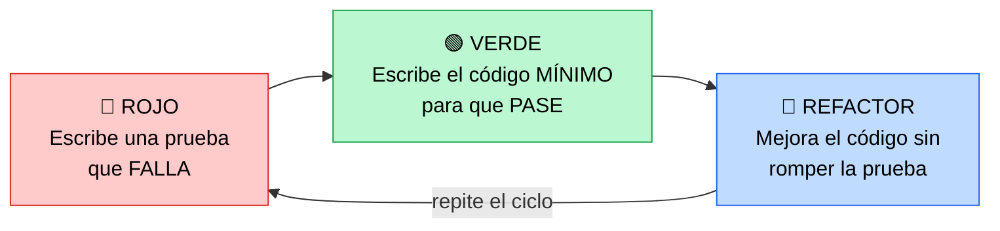
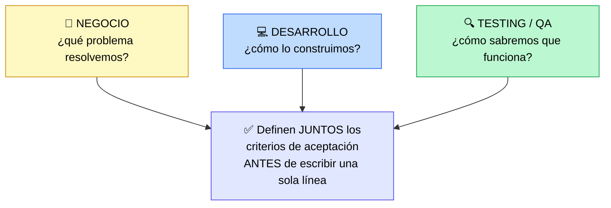

# TDD y BDD

> [!abstract] 📄 ¿De qué trata esta nota?
> ¿Y si en vez de programar primero y probar después, lo hiciéramos al revés: **escribir la prueba primero**? Eso es lo que proponen TDD y BDD. Esta nota explica dos técnicas que cambian el orden tradicional: **TDD (Test-Driven Development)**, centrada en que el **código** sea correcto mediante el ciclo "rojo-verde-refactor", y **BDD (Behavior-Driven Development)**, que extiende la idea hacia el **comportamiento** del sistema usando un lenguaje natural que **todos entienden** (negocio, desarrollo y pruebas). Verás el formato **Dado-Cuando-Entonces**, la técnica de los **"Three Amigos"** y cuándo usar cada enfoque. La idea de fondo: **alinearse temprano ahorra tiempo y evita malentendidos**.

---

## 🎯 Idea central

> Alinearse **al inicio** mediante pruebas inteligentes ahorra tiempo y reduce confusiones. **TDD** asegura el código correcto (visión técnica); **BDD** extiende TDD hacia el **comportamiento** y la **colaboración** entre todos.

---

## 📖 Glosario de términos clave

> [!note] TDD (Test-Driven Development / Desarrollo Guiado por Pruebas)
> **Definición técnica:** práctica donde se escribe **primero la prueba** (que falla) y **después el código** mínimo para que pase.
> **En palabras simples:** decides primero **cómo sabrás que algo funciona** (la prueba) y recién entonces lo construyes. Es como escribir el examen antes de estudiar: te obliga a tener claro qué debe lograr el código.

> [!note] BDD (Behavior-Driven Development / Desarrollo Guiado por Comportamiento)
> **Definición técnica:** evolución de TDD que describe el **comportamiento esperado** del sistema en **lenguaje natural**, entendible por personas técnicas y no técnicas.
> **En palabras simples:** en lugar de pruebas escritas en código (solo para programadores), BDD usa frases comunes ("Dado... Cuando... Entonces...") para que **el negocio también las entienda**. Une a todo el equipo alrededor de un mismo lenguaje.

> [!note] Refactorizar (refactoring)
> **Definición técnica:** mejorar la estructura interna del código **sin cambiar lo que hace** por fuera.
> **En palabras simples:** limpiar y ordenar el código (que quede más legible o eficiente) **sin alterar su comportamiento**. Como reorganizar un cajón: guardas lo mismo, pero ahora todo está en su sitio.

> [!note] Gherkin
> **Definición técnica:** lenguaje estructurado y legible que usa BDD para escribir escenarios con palabras clave (*Given, When, Then*).
> **En palabras simples:** una forma sencilla y ordenada de escribir ejemplos de cómo debe comportarse el software, en frases casi de lenguaje cotidiano.

> [!note] Stakeholder (interesado)
> **Definición:** persona con interés en el producto (cliente, negocio, usuario). BDD busca incluirlos en la conversación técnica.

---

## 1. TDD: el ciclo Rojo-Verde-Refactor

En TDD se escriben las **pruebas antes** del código funcional, repitiendo un ciclo de tres pasos:

| Paso | Qué haces | Por qué |
|:--|:--|:--|
| 🔴 **Rojo** | Escribes una prueba para algo que **aún no existe**; falla. | Defines qué debe lograr el código antes de escribirlo. |
| 🟢 **Verde** | Escribes el código **mínimo** para que la prueba pase. | Evitas sobre-construir; solo lo necesario. |
| 🔵 **Refactor** | Limpias y mejoras el código, manteniendo la prueba en verde. | Calidad sin miedo: la prueba te avisa si rompes algo. |

> [!tip] ¿Por qué empezar por una prueba que falla?
> Si la prueba **no falla** al inicio, no sabrías si realmente está probando algo. El "rojo" confirma que la prueba funciona; el "verde" confirma que tu código la satisface.

---

## 2. BDD: del código al comportamiento

BDD **extiende TDD**. La diferencia clave:

- **TDD** prueba *"¿el código es correcto?"* → en lenguaje técnico, para desarrolladores.
- **BDD** prueba *"¿el sistema se comporta como el negocio espera?"* → en lenguaje natural, para **todos**.

### El formato Dado-Cuando-Entonces (Given-When-Then)

BDD escribe escenarios en frases estructuradas (sintaxis **Gherkin**):

> [!example] Escenario BDD: inicio de sesión
> **Dado** (Given) que el usuario está en la página de login
> **Cuando** (When) ingresa sus datos correctos y envía
> **Entonces** (Then) accede correctamente
> **Y** (And) es llevado a la página de inicio

| Palabra | Significa | Responde |
|:--|:--|:--|
| **Dado (Given)** | El contexto/estado inicial | ¿Cómo empieza la situación? |
| **Cuando (When)** | La acción del usuario | ¿Qué hace el usuario? |
| **Entonces (Then)** | El resultado esperado y verificable | ¿Qué debe pasar? |

> [!tip] La gran ventaja de BDD
> Estos escenarios sirven a la vez como **criterios de aceptación** (lo que el usuario espera, ver [[Criteria and Definition of Done]]) **y** como **pruebas automatizables**. Un mismo texto une al negocio y a la máquina.

---

## 3. Los "Three Amigos" (Tres Amigos)

> [!note] 🌐 Concepto clave
> Antes de programar, se reúnen **tres perspectivas** para acordar qué se construirá y cómo se validará:

- Reúne a **negocio, desarrollo y testing** para definir requisitos y criterios de aceptación **antes** de codificar.
- Asegura que **todos entiendan y acuerden** cómo se probará y validará la funcionalidad.
- Resultado: menos malentendidos, mejor calidad y mayor **predictibilidad** del producto.

---

## 4. TDD vs BDD: tabla comparativa

| | 🔧 TDD | 💬 BDD |
|:--|:--|:--|
| **Enfoque** | Código correcto | Comportamiento esperado |
| **Lenguaje** | Técnico (código) | Natural (*Dado-Cuando-Entonces*) |
| **Quién participa** | Desarrolladores | Negocio + Desarrollo + Testing |
| **Nivel típico** | Pruebas unitarias | Funcionalidad / aceptación |
| **Pregunta** | "¿Construí la cosa **bien**?" | "¿Construí la cosa **correcta**?" |

> [!note] No son rivales
> BDD **no reemplaza** a TDD: lo **envuelve**. Un equipo puede usar BDD para acordar el comportamiento general y TDD para construir cada pieza de código con calidad.

---

## 🧠 Analogía para recordarlo todo

> Construir una **casa**:
> - **TDD** es el albañil que, antes de levantar un muro, define cómo comprobará que quedó recto (su prueba) y solo entonces lo construye, ladrillo a ladrillo.
> - **BDD** es la **reunión previa** entre el dueño, el arquitecto y el inspector ("Three Amigos") donde acuerdan, en lenguaje común: *"Dado que es una cocina, cuando se abra la llave, entonces debe salir agua caliente"*. Todos entienden el plan **antes** de construir, así nadie se lleva sorpresas al final.

---

## ✅ Para repasar (autoevaluación)

- [ ] Describe los tres pasos del ciclo Rojo-Verde-Refactor.
- [ ] ¿Por qué la primera prueba debe **fallar** a propósito?
- [ ] ¿Qué añade BDD respecto a TDD? ¿En qué lenguaje se escribe?
- [ ] Escribe un mini escenario en formato Dado-Cuando-Entonces.
- [ ] ¿Quiénes son los "Three Amigos" y cuándo se reúnen?
- [ ] ¿Por qué se dice que TDD y BDD no son rivales?

---

## 🔗 Enlaces relacionados

- [[Criteria and Definition of Done]] — los criterios de aceptación que BDD formaliza como escenarios.
- [[Foundations of test Automation]] — TDD alimenta la base de la pirámide (pruebas unitarias).
- [[Cómo medir la calidad pragmáticamente]] — propone BDD para medir la calidad técnica.
- [[Caracteristicas Escenciales para DEVOPS]] — TDD como parte de la cultura DevOps.

---
*Fuente original: [TDD & BDD – Coursera](https://www.coursera.org/learn/qa-process-optimization-agile-automated-testing/lecture/UT2kl/tdd-bdd). Ampliado con [Codecademy: Red, Green, Refactor](https://www.codecademy.com/article/tdd-red-green-refactor) y [Automation Panda: Three Amigos](https://automationpanda.com/tag/three-amigos/).*
