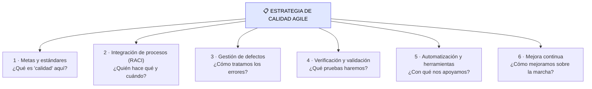

# Creando una estrategia de calidad Agile

> [!abstract] 📄 ¿De qué trata esta nota?
> Si la calidad es "responsabilidad de todos" (como vimos antes), surge un riesgo: cuando algo es de todos, puede terminar siendo de **nadie**. La solución es una **estrategia de calidad**: un documento que pone por escrito **qué significa calidad** en este proyecto y **cómo se logrará**. Esta nota explica por qué ese documento es importante y desglosa sus **6 componentes clave** (metas, integración de procesos, gestión de defectos, verificación y validación, automatización y mejora continua). Es el "plano maestro" de la calidad, normalmente definido en el **sprint cero**.

---

## 🎯 Idea central

> Una **estrategia de calidad** clara y documentada evita que la calidad quede al azar. Alinea a todo el equipo sobre **qué es calidad** y **cómo se logrará desde el inicio**, en lugar de inspeccionarla al final.

---

## 📖 Glosario de términos clave

> [!note] Estrategia de calidad
> **Definición técnica:** documento que define cómo se gestionará y asegurará la calidad a lo largo del proyecto: metas, procesos, roles, pruebas, herramientas y mejora.
> **En palabras simples:** el **plan de juego** de la calidad. Responde de antemano: ¿qué consideramos "de calidad"? ¿quién hace qué? ¿cómo lo probamos? Así nadie improvisa.

> [!note] Matriz RACI
> **Definición técnica:** tabla que asigna responsabilidades indicando, para cada tarea, quién es **R**esponsable (hace), **A**probador (rinde cuentas), **C**onsultado (opina) e **I**nformado (se le avisa).
> **En palabras simples:** una tabla que aclara **"¿quién hace qué?"** para que no haya confusiones ni tareas huérfanas. Evita el clásico "pensé que lo hacías tú".

> [!note] Verificación vs Validación
> **Verificación:** ¿construimos el producto **bien**? (cumple las especificaciones). → *"¿lo hicimos correctamente?"*
> **Validación:** ¿construimos el producto **correcto**? (sirve al usuario). → *"¿hicimos lo que se necesitaba?"*
> **Truco:** Verificación = contra el **documento**; Validación = contra la **necesidad real**.

> [!note] Pruebas funcionales vs no funcionales
> **Funcionales:** ¿hace lo que debe? (el botón guarda, el cálculo es correcto).
> **No funcionales:** ¿cómo lo hace? (rápido, seguro, para muchos usuarios) → rendimiento, seguridad, usabilidad.

> [!note] Gestión de defectos
> **Definición:** el proceso para **reportar, clasificar, priorizar y resolver** los errores encontrados, de forma ordenada y trazable.

> [!note] Ciclo de retroalimentación (feedback loop)
> **Definición:** mecanismo que recoge información sobre cómo va la calidad y la usa para **ajustar y mejorar** continuamente.

---

## 1. ¿Por qué necesitas una estrategia de calidad?

> [!warning] El riesgo de no tenerla
> Si "la calidad es de todos" pero **nadie lo escribe**, terminas con responsabilidades difusas, malentendidos y calidad librada al azar. La estrategia **convierte buenas intenciones en un plan concreto**.

Beneficios concretos:
- **Evita malentendidos** sobre responsabilidades (¿quién prueba qué?).
- Permite **planificar** habilidades, recursos técnicos y actividades necesarias **con tiempo**.
- Asegura que la calidad **se construya desde el inicio**, no se inspeccione al final.
- **Alinea** a todo el equipo sobre una misma definición de "calidad".

> [!note] ¿Cuándo se crea?
> Normalmente en el **sprint cero** (la fase de preparación), antes de empezar a desarrollar funcionalidades. Ver [[Integrating QA in Agile Workflows]].

---

## 2. Los 6 componentes clave de la estrategia

| # | Componente | Qué define |
|:--|:--|:--|
| 1 | **Metas y estándares de calidad** | Qué significa "calidad" para el proyecto y la organización, alineado con la **Definición de Hecho** y requisitos regulatorios. |
| 2 | **Integración de procesos** | Cómo se incorpora la calidad en cada fase: ceremonias ágiles, **roles y responsabilidades** (p. ej. con una **matriz RACI**). |
| 3 | **Gestión de defectos** | Cómo se **reportan, clasifican, priorizan y resuelven** los defectos. |
| 4 | **Verificación y validación** | Niveles y tipos de pruebas: **funcionales y no funcionales** (unitarias, integración, aceptación, seguridad, rendimiento…). |
| 5 | **Automatización y herramientas** | Plan de automatización y herramientas para mejorar eficiencia y consistencia. |
| 6 | **Mejora continua** | Ciclos de **retroalimentación** y análisis para optimizar la calidad durante el proyecto. |

---

## 3. ¿Cómo se ve en la práctica?

> [!example] Mini ejemplo de estrategia (resumida)
> - **Meta:** cero defectos críticos en producción; cobertura de pruebas ≥ 80 %.
> - **Roles (RACI):** Dev = responsable de pruebas unitarias; QA = aprobador de la suite de regresión.
> - **Defectos:** se reportan en la herramienta X, se clasifican por severidad, se resuelven los críticos en < 24 h.
> - **Pruebas:** unitarias + integración + E2E + seguridad antes de cada release.
> - **Automatización:** pipeline CI/CD con pruebas automáticas en cada commit.
> - **Mejora:** revisión de métricas en cada retrospectiva.

---

## 🧠 Analogía para recordarlo todo

> Una estrategia de calidad es como el **plan de vuelo de una aerolínea**. Antes de despegar, está escrito: qué es un vuelo "seguro" (metas), quién revisa qué (RACI: piloto, copiloto, mecánicos), qué hacer ante una falla (gestión de defectos), qué chequeos se harán (verificación/validación), qué instrumentos se usan (herramientas) y cómo se aprende de cada vuelo (mejora continua). Ningún avión despega "a ver qué pasa": todo está planeado. La calidad del software, tampoco debería.

---

## ✅ Para repasar (autoevaluación)

- [ ] ¿Qué riesgo evita tener una estrategia de calidad documentada?
- [ ] ¿En qué momento del proyecto suele crearse?
- [ ] ¿Para qué sirve una matriz RACI? ¿Qué significan sus letras?
- [ ] Diferencia entre **verificación** y **validación** (usa el truco de la nota).
- [ ] Diferencia entre pruebas **funcionales** y **no funcionales**.
- [ ] Nombra al menos cuatro de los seis componentes clave.

---

## 🔗 Enlaces relacionados

- [[Integrating QA in Agile Workflows]] — esta estrategia se define en el "sprint cero".
- [[Criteria and Definition of Done]] — las metas se alinean con la Definición de Hecho.
- [[Métricas y KPIs para QA Agile]] — las métricas que la estrategia debe incluir.
- [[QA y DevOps]] — la automatización y los pipelines que la estrategia planifica.

---
*Fuente original: [Creating an Agile Quality Strategy – Coursera](https://www.coursera.org/learn/qa-process-optimization-agile-automated-testing/lecture/XdtC3/creating-an-agile-quality-strategy).*
