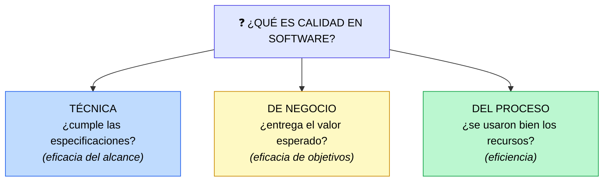

# Cómo medir la calidad pragmáticamente

> [!abstract] 📄 ¿De qué trata esta nota?
> Esta nota resume un **artículo de lectura** (no un video) que profundiza la gran idea del módulo: **¿qué es realmente la "calidad" y cómo se mide sin engañarnos?** Parte de la definición oficial de calidad (norma **ISO 9000**), explica por qué **contar bugs es una mala métrica**, y propone una forma **pragmática** de medir cada una de las tres dimensiones de la calidad (técnica, de negocio y de proceso). Es el complemento conceptual de [[Métricas y KPIs para QA Agile]]: aquella da el "catálogo" de métricas; esta da la **filosofía** que hay detrás.

---

## 🎯 Idea central

> La calidad no se mide contando bugs ni con opiniones subjetivas. Se mide evaluando tres cosas: **cuánto del alcance esperado se entregó**, **qué tan bien logra los objetivos de negocio**, y **si el proceso fue eficiente** (a tiempo y en presupuesto).

---

## 📖 Glosario de términos clave

> [!note] ISO 9000
> **Definición técnica:** familia de normas internacionales sobre **gestión de la calidad**. Define la calidad como *"el grado en que un conjunto de características inherentes de un objeto cumple con los requisitos"*.
> **En palabras simples:** un estándar mundial que dice, en esencia: algo es de calidad si **cumple lo que se esperaba de él**. Sirve como base objetiva para no medir "a ojo".

> [!note] Eficacia vs Eficiencia
> **Eficacia:** ¿se logró el **objetivo**? (¿el producto resuelve el problema?).
> **Eficiencia:** ¿se logró usando **bien los recursos**? (tiempo, dinero, esfuerzo).
> **Truco:** eficaz = "lo logré"; eficiente = "lo logré **sin desperdiciar**". Puedes ser eficaz pero ineficiente (lo lograste, pero gastando de más).

> [!note] Alcance (scope)
> **Definición:** el conjunto de funcionalidades/escenarios que se **planeó** entregar. La calidad técnica mide cuánto de ese alcance se cumplió **de verdad**.

> [!note] Velocity (velocidad del equipo)
> **Definición técnica:** métrica ágil que mide **cuánto trabajo completa un equipo por sprint**. Sirve para estimar y planear.
> **En palabras simples:** el "ritmo" del equipo. Si es **predecible**, el negocio puede confiar en las estimaciones y decidir inversiones con seguridad.

> [!note] Burn-down chart (gráfico de trabajo pendiente)
> **Definición:** gráfica que muestra cómo **disminuye el trabajo restante** a lo largo del sprint. Si la línea no baja como debería, hay problemas de eficiencia.

---

## 1. ¿Qué es la calidad? (según ISO 9000)

Definir calidad es difícil, sobre todo en un producto nuevo sin referencia previa. El artículo usa la definición de la norma **ISO 9000**:

> *"La calidad es el grado en que un conjunto de características inherentes de un objeto cumple con los requisitos."*

Aplicada al software, se divide en **tres dimensiones**:

| Dimensión | Pregunta que responde |
|:--|:--|
| **Calidad técnica** | ¿Cumple los requisitos funcionales y no funcionales (las specs)? |
| **Calidad de negocio** | ¿Resuelve el problema del negocio y entrega el valor esperado? |
| **Calidad del proceso (eficiencia)** | ¿Se usaron bien los recursos: a tiempo y dentro del presupuesto? |

---

## 2. El error de usar los "bugs" como métrica

> [!warning] El gran error
> Medir la calidad **solo por la cantidad de bugs** encontrados es engañoso:
> - Encontrar y documentar errores es vital, **pero contar bugs es irrelevante** para medir la calidad real.
> - **Menos errores ≠ más calidad**, sobre todo si el software no entrega valor al usuario.
> - KPIs como "errores por mil líneas de código" se **desaconsejan**: desvían el foco de lo que importa (el valor).

---

## 3. Cómo medir cada dimensión (la parte práctica)

### 1️⃣ Calidad técnica → % de escenarios entregados
- Define el alcance con **escenarios precisos** (el autor recomienda **BDD**, ver [[TDD AND BDD]]).
- **Métrica:** porcentaje de escenarios funcionales **entregados con éxito**.

> [!example] Ejemplo numérico
> Planeaste **50 escenarios**. En producción funcionan perfectamente **45**.
> → Calidad técnica = 45/50 = **90 %**.
> Esto enfoca al equipo en la **funcionalidad real entregada**, no en contar bugs.

### 2️⃣ Calidad de negocio → métricas atribuibles al software
- Desglosa los grandes objetivos ("aumentar ventas") en métricas **pequeñas y medibles** que dependan del software ("tasa de conversión", "tamaño promedio del pedido").
- Defínelas **al inicio**: muchas veces el software debe construirse de cierta forma para poder **recolectar esos datos** después.

### 3️⃣ Calidad del proceso → eficiencia frente al plan
- Mide qué tan bien ejecuta el equipo **comparado con el plan original**.
- Si el equipo **estima de forma confiable y cumple** sus estimaciones, el negocio puede **invertir con seguridad**.
- No poder comprometerse con estimaciones = señal de ineficiencia. Se mide con **Velocity** y **burn-down charts**.

---

## 4. Conclusión

> [!tip] La idea final que debes recordar
> La calidad no es subjetiva, pero **tampoco** se mide con números vacíos como el conteo de bugs. Medir calidad en software es evaluar:
> 1. **Cuánto del alcance esperado se entregó** (técnica).
> 2. **Qué tan bien logra los resultados de negocio** (negocio).
> 3. **Si se hizo mediante un proceso eficiente y controlado** (proceso).

---

## 🧠 Analogía para recordarlo todo

> Imagina que mides la calidad de un **restaurante nuevo**:
> - Contar cuántas veces el cocinero se equivocó en la cocina (bugs) **no le importa al comensal**.
> - **Calidad técnica:** de los 50 platillos del menú prometido, ¿cuántos salen bien? (45/50 = 90 %).
> - **Calidad de negocio:** ¿la gente vuelve? ¿suben las ventas? (el objetivo real).
> - **Calidad del proceso:** ¿la cocina cumple los tiempos prometidos sin desperdiciar ingredientes? (eficiencia).
> Un restaurante puede tener una cocina caótica por dentro y aun así ser **excelente** para el cliente. Lo que cuenta es el resultado, no el conteo de tropiezos internos.

---

## ✅ Para repasar (autoevaluación)

- [ ] Enuncia la definición de calidad de **ISO 9000**.
- [ ] Diferencia entre **eficacia** y **eficiencia** (usa el truco de la nota).
- [ ] ¿Por qué el conteo de bugs es una mala métrica de calidad?
- [ ] ¿Cómo se mide la calidad técnica con BDD? Da un ejemplo con porcentaje.
- [ ] ¿Por qué hay que definir las métricas de negocio **al inicio**?
- [ ] ¿Con qué métricas ágiles se mide la eficiencia del proceso?

---

## 🔗 Enlaces relacionados

- [[Métricas y KPIs para QA Agile]] — la versión "catálogo" de estas mismas ideas.
- [[TDD AND BDD]] — el enfoque BDD que se recomienda para definir el alcance.
- [[Optimización continua de QA]] — cómo seguir mejorando usando estas métricas.
- [[Creando una estrategia de calidad Agile]] — donde se fijan metas de calidad medibles.

---
*Fuente: artículo de lectura del curso [QA Process Optimization, Agile & Automated Testing – Coursera](https://www.coursera.org/learn/qa-process-optimization-agile-automated-testing). Definición de calidad basada en la norma ISO 9000.*
