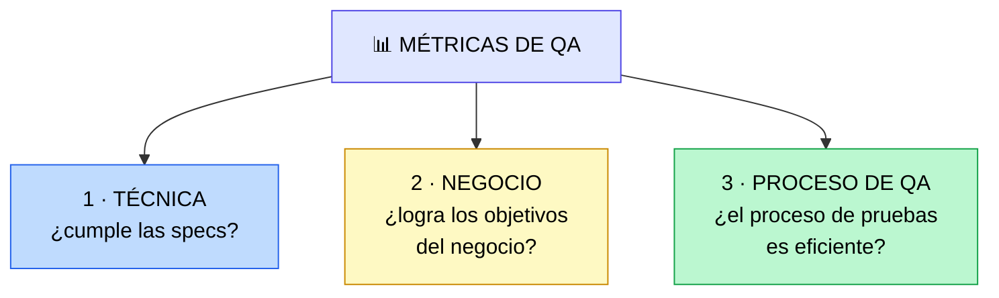
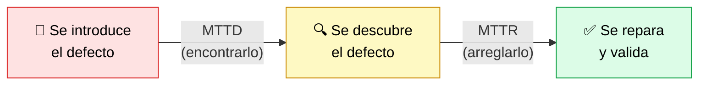

# Métricas y KPIs para QA Agile

> [!abstract] 📄 ¿De qué trata esta nota?
> "Lo que no se mide, no se mejora." Esta nota —la más densa del módulo— explica **cómo medir si QA realmente está funcionando**. Verás las **tres categorías de métricas** (técnica, de negocio y de proceso) con cada indicador explicado, la diferencia crucial entre **MTTD y MTTR**, y dos tablas muy útiles de **acciones a tomar** cuando una métrica se pone en rojo (ajustes proactivos y reactivos). Pero la lección más importante es un **cambio de mentalidad**: dejar de **contar bugs** y empezar a **medir el valor entregado**. La métrica estrella es la **fuga de defectos**.

---

## 🎯 Idea central

> Sin métricas no sabes si QA mejora la calidad o solo "se ve ocupado". La gran lección: **deja de contar bugs y mide el valor entregado**. La métrica técnica que más importa es la **fuga de defectos** (errores que llegan al usuario); la meta ideal es **cero**.

---

## 📖 Glosario de términos clave

> [!note] Métrica vs KPI
> **Métrica:** cualquier valor que mides (p. ej. "número de pruebas que pasan").
> **KPI (Key Performance Indicator / Indicador Clave de Rendimiento):** una métrica **especialmente importante** ligada a un objetivo. Todos los KPIs son métricas, pero no toda métrica es un KPI.
> **En simple:** las métricas son muchos números; los KPIs son **los pocos números que de verdad importan**.

> [!note] Fuga de defectos (Defect Leakage) ⭐
> **Definición técnica:** cantidad de errores que **escapan** a los controles de QA y **llegan a producción** (al usuario final).
> **En palabras simples:** los bugs que "se te escaparon" y vio el cliente. Es **LA** métrica de calidad técnica: mide lo que de verdad duele. Meta ideal: **cero**.

> [!note] Densidad de defectos (Defect Density)
> **Definición:** número de defectos por **unidad de tamaño** del software (p. ej. por cada mil líneas de código o por función).
> **En simple:** ¿hay muchos errores **en proporción** al tamaño? Ayuda a saber si el volumen de bugs es aceptable o alarmante.

> [!note] Distribución de severidad (Defect Severity Distribution)
> **Definición:** proporción de defectos **graves** frente a **menores**.
> **En simple:** no es lo mismo 100 erratas de texto que 1 caída total del sistema. Esta métrica mira **qué tan dañinos** son los bugs, no solo cuántos.

> [!note] Cobertura de pruebas (Test Coverage)
> **Definición:** porcentaje de código, requisitos o componentes que están **cubiertos por pruebas**.
> **En simple:** ¿qué parte del software realmente probamos? Baja cobertura = muchas zonas "a ciegas".

> [!note] CSAT (Customer Satisfaction)
> **Definición:** métrica de **satisfacción del cliente** con el producto.
> **En simple:** ¿le gusta al usuario? Es el indicador de "último recurso": si cae tras lanzar algo, **algo salió mal** aunque la técnica diga lo contrario.

> [!note] MTTD (Mean Time To Detect / Tiempo Medio de Detección)
> **Definición:** tiempo promedio desde que un defecto **se introduce** hasta que se **descubre**.
> **En simple:** ¿cuánto tarda en **encontrarse** un error? Más corto = mejor (feedback rápido).

> [!note] MTTR (Mean Time To Repair / Tiempo Medio de Reparación)
> **Definición:** tiempo promedio en **resolver y revalidar** un defecto ya descubierto.
> **En simple:** ¿cuánto tarda en **arreglarse** un error ya encontrado? Más corto = mejor (con un matiz, ver abajo).

> [!note] Falso positivo
> **Definición:** cuando una prueba **reporta un error que en realidad no existe**. Muchos falsos positivos hacen que el equipo deje de confiar en las pruebas.

---

## 1. ¿Por qué medir?

- Sin métricas es difícil saber si QA **mejora la calidad** o solo cumple tareas superficiales.
- Las métricas permiten **identificar riesgos** antes de que se vuelvan fallos y **demostrar el valor** del trabajo de QA.

---

## 2. Las tres categorías de métricas (mapa general)

### 1️⃣ Calidad técnica
Mide qué tan bien el producto cumple los requisitos funcionales y no funcionales.

| Métrica | Qué mide |
|:--|:--|
| **Fuga de defectos** ⭐ | Errores que **escapan a producción**. La más importante. |
| **Densidad de defectos** | Defectos por unidad de tamaño (p. ej. por mil líneas). |
| **Distribución de severidad** | Proporción de defectos graves vs menores. |
| **Cobertura de pruebas** | % de componentes/código cubiertos por pruebas. |

> [!warning] Cuidado con un error muy común
> **Contar bugs ANTES del lanzamiento NO es una buena métrica de calidad.** Lo importante es el **valor entregado**, no cuántos errores se registraron internamente. Un equipo que encontró 200 bugs y los corrigió hizo un **buen** trabajo, no uno malo.

### 2️⃣ Calidad de negocio
Mide hasta qué punto el producto logra los objetivos de la empresa.

| Métrica | Qué mide |
|:--|:--|
| **KPIs comerciales** | Logro de un objetivo de negocio. Ej.: si la meta es vender más → **tasa de conversión** en el checkout. |
| **CSAT** | Satisfacción del cliente. Indicador de "último recurso": si **cae** al lanzar algo, la calidad de negocio falló. |

### 3️⃣ Calidad del proceso de QA
Mide la eficiencia y eficacia del propio proceso de pruebas.

| Métrica | Qué mide |
|:--|:--|
| **Confiabilidad de la prueba** | Proporción de **falsos positivos**. Menos = más confiable. |
| **MTTD** | Tiempo medio en **detectar** un defecto. |
| **MTTR** | Tiempo medio en **reparar y revalidar** un defecto. |
| **Wait time to start testing** | Tiempo que una función **espera** para ser probada (mide cuellos de botella). |
| **Velocidad de ejecución** | Tiempo en completar la suite de pruebas. |

---

## 3. MTTD vs MTTR (la confusión clásica)

Ambas miden el ciclo de vida de un defecto, pero **etapas distintas**:

| | 🔍 MTTD | 🔧 MTTR |
|:--|:--|:--|
| **Mide la velocidad para...** | **encontrar** el problema | **solucionarlo y verificarlo** |
| **Desde → hasta** | Introducción → detección | Detección → reparación validada |
| **Objetivo** | Más corto = feedback más rápido | Más corto = mejor, **pero ojo**: reparar bugs de baja prioridad tarde puede inflar el promedio artificialmente |

> [!tip] Cómo no confundirlos
> **MTTD** = *"¿cuánto tardé en DARME CUENTA?"* · **MTTR** = *"¿cuánto tardé en ARREGLARLO?"*

---

## 4. 🛠️ Ajustes PROACTIVOS (métricas de proceso)

Qué hacer **para optimizar el proceso** cuando una métrica de proceso se pone alarmante:

| Métrica | Valor alarmante | Recomendación |
|:--|:--|:--|
| **Cobertura de pruebas** | Demasiado baja | Automatizar, añadir recursos, distribuir la responsabilidad, añadir un *gate check* que asegure pruebas planificadas. |
| **Confiabilidad de la prueba** | Demasiado baja | Ajustar pruebas automatizadas, introducir *three amigos*, capacitar en el negocio. |
| **MTTD** | Demasiado alto | Reajustar suites, cambiar la frecuencia de pruebas, aumentar cobertura, usar exploratorias. |
| **MTTR** | Demasiado alto | Mejorar priorización/triaje, sesiones de re-verificación, automatizar *rollbacks*. |
| **Wait time to start testing** | Demasiado alto | Revisar el flujo end-to-end, introducir un sistema *pull*, reevaluar recursos. |
| **Tiempo de ciclo de pruebas** | Demasiado alto | Más automatización, pruebas en paralelo, revisar cuellos de botella, integrar con CI/CD, mejorar estabilidad del entorno. |

---

## 5. 🚑 Ajustes REACTIVOS (métricas técnicas y de negocio)

Qué hacer **como respuesta correctiva** cuando una métrica técnica o de negocio ya dio mal resultado:

| Métrica | Valor alarmante | Recomendación |
|:--|:--|:--|
| **Fuga de defectos** | Demasiado alta | Aumentar cobertura, capacitar testers, automatizar, exploratorias, mejorar regresión, nuevos *gates* (UAT, BVT). |
| **Densidad de defectos** | Demasiado alta | Refactorizar áreas complejas, mejorar estándares, validación más estricta antes de fusionar código. |
| **Distribución de severidad** | Muchos defectos graves | Priorizar QA en lo crítico, *gates* más estrictos, optimizar el diseño de pruebas. |
| **KPIs comerciales** | Fuera del objetivo | Realinear alcance con objetivos, involucrar SMEs/consultores, entrevistar clientes potenciales. |
| **CSAT** | En declive | Encuestar/entrevistar clientes, recopilar feedback. |

> [!note] Glosario rápido de estas tablas
> - **Gate check / quality gate:** un "punto de control" que el código debe pasar para avanzar.
> - **Triaje:** clasificar y priorizar defectos por urgencia (como en urgencias médicas).
> - **Rollback:** revertir un cambio para volver a la versión anterior que funcionaba.
> - **UAT:** prueba de aceptación del usuario. **BVT:** *Build Verification Test*, verificación de que la construcción básica funciona.
> - **SME (Subject Matter Expert):** experto en la materia.

---

## 6. 🎯 La conclusión: de contar bugs a medir valor

> [!tip] Tres ideas para memorizar (esto es lo que cae en el examen)
> 1. **Contar errores antes del lanzamiento es irrelevante.** Si el software se lanza y entrega valor, el equipo hizo buen trabajo sin importar cuántos bugs registró internamente.
> 2. **El foco real es la Fuga de Defectos** (los que llegan al usuario). Meta ideal → **cero**.
> 3. **La técnica no sirve si el negocio falla.** El indicador definitivo es **CSAT**: si lanzas funciones y la satisfacción cae, no cumpliste el objetivo de calidad.

> Resumen en una frase: *Un buen proceso de QA no se trata de acumular errores, sino de asegurar que el producto **no filtre defectos a los usuarios** y **cumpla los objetivos del negocio**.*

---

## 🧠 Analogía para recordarlo todo

> Eres el **médico** de un producto de software:
> - Contar bugs internos es como contar cuántas veces tosió el paciente durante la consulta: **irrelevante** si sale sano.
> - La **fuga de defectos** es como una enfermedad que el paciente se lleva a casa sin detectar: **eso sí importa**.
> - **MTTD** es cuánto tardas en **diagnosticar**; **MTTR**, cuánto en **curar**.
> - **CSAT** es la pregunta final: *"¿el paciente se siente mejor?"*. Si no, de nada sirvió que los análisis salieran "bien".

---

## ✅ Para repasar (autoevaluación)

- [ ] Diferencia entre una métrica y un KPI.
- [ ] ¿Por qué contar bugs no mide la calidad real?
- [ ] ¿Cuál es la métrica técnica más importante y cuál su meta ideal?
- [ ] Explica la diferencia exacta entre MTTD y MTTR.
- [ ] ¿Qué harías si la **cobertura** es muy baja? ¿Y si el **MTTR** es muy alto?
- [ ] ¿Por qué CSAT es el indicador de "último recurso"?
- [ ] Diferencia entre ajustes **proactivos** y **reactivos**.

---

## 🔗 Enlaces relacionados

- [[Cómo medir la calidad pragmáticamente]] — el artículo que profundiza esta misma idea.
- [[Optimización continua de QA]] — indicadores líderes vs rezagados; qué hacer con las métricas.
- [[Foundations of test Automation]] — cómo subir la cobertura de pruebas.
- [[Creando una estrategia de calidad Agile]] — dónde se documentan estas métricas.

---
*Fuente original: [Metrics and KPIs for Agile QA – Coursera](https://www.coursera.org/learn/qa-process-optimization-agile-automated-testing/lecture/5duzG/metrics-and-kpis-for-agile-qa). Incluye las tablas de ajustes proactivos y reactivos vistas en clase.*
