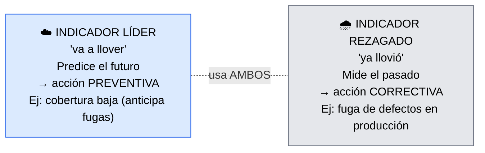
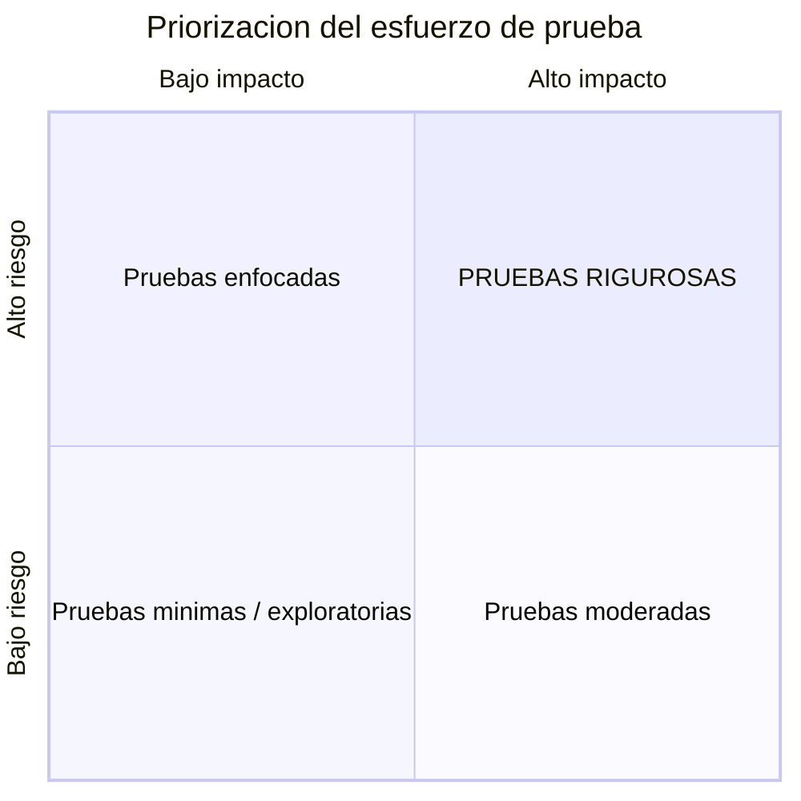

# Optimización continua de QA

> [!abstract] 📄 ¿De qué trata esta nota?
> Tener métricas (nota anterior) no basta: hay que **usarlas para mejorar constantemente**. Esta nota explica las tres palancas de la optimización continua de QA: (1) **usar bien las métricas**, distinguiendo las que **predicen** problemas de las que solo los **reportan**; (2) **priorizar por riesgo e impacto**, porque no todo merece el mismo esfuerzo de prueba; y (3) el papel creciente de la **Inteligencia Artificial** en QA. La idea de fondo es muy ágil: **evaluar → ajustar → mejorar**, en ciclos que nunca terminan.

---

## 🎯 Idea central

> Optimizar QA combina tres palancas: **métricas bien interpretadas**, **priorización por riesgo e impacto** (no todo se prueba igual) y el apoyo de la **Inteligencia Artificial**. Todo dentro de un ciclo de mejora continua.

---

## 📖 Glosario de términos clave

> [!note] Indicador líder (leading indicator)
> **Definición técnica:** métrica que **predice** resultados futuros; permite actuar **antes** de que el problema ocurra.
> **En palabras simples:** es como las **nubes negras** que avisan que va a llover. Ej.: una cobertura de pruebas baja **predice** que habrá más fugas de defectos. Te deja actuar a tiempo (acción **preventiva**).

> [!note] Indicador rezagado (lagging indicator)
> **Definición técnica:** métrica que mide resultados **que ya ocurrieron**.
> **En palabras simples:** es la **lluvia que ya cayó**. Ej.: la fuga de defectos en producción mide algo que **ya pasó**. Solo te deja reaccionar (acción **correctiva**).

> [!note] Riesgo e impacto
> **Riesgo:** probabilidad de que algo **falle**.
> **Impacto:** qué tan **grave** sería esa falla para el negocio o el usuario.
> **En simple:** lo que combina ambos (alto riesgo + alto impacto) es lo que **más hay que probar**.

> [!note] Automatización adaptativa / auto-reparación (self-healing)
> **Definición:** pruebas automatizadas que, gracias a IA, **se ajustan solas** cuando cambia la interfaz o el código, sin que un humano las repare.
> **En simple:** pruebas que "se arreglan solas" cuando algo pequeño cambia, en vez de romperse y exigir mantenimiento constante.

> [!note] Análisis predictivo
> **Definición:** uso de datos históricos para **anticipar** dónde aparecerán problemas (p. ej. qué módulos suelen fallar más).

> [!note] Caso negativo (negative test case)
> **Definición:** prueba que verifica qué pasa cuando el usuario hace algo **incorrecto o inesperado** (datos inválidos, acciones fuera de orden). La IA ayuda a generarlos.

---

## 1. Usar las métricas: líderes vs rezagados

No todas las métricas sirven para lo mismo. La clave está en **cuándo** te avisan:

| Tipo | Qué hace | Qué acción permite | Ejemplo |
|:--|:--|:--|:--|
| **Líder** | Predice problemas futuros | **Preventiva** (actúas antes) | Cobertura de pruebas baja |
| **Rezagado** | Mide problemas ya ocurridos | **Correctiva** (reaccionas) | Defectos filtrados a producción |

> [!tip] Por qué importa la distinción
> Si solo miras indicadores **rezagados**, siempre vas **tarde** (apagando incendios). Los indicadores **líderes** te permiten **prevenir** el incendio. Una buena estrategia usa **ambos**.

---

## 2. Priorización por impacto y riesgo

No todas las funcionalidades merecen el mismo esfuerzo. Se prioriza según **impacto en el negocio** × **riesgo de falla**:

> 🔴 La esquina **alto impacto + alto riesgo** (arriba a la derecha) es la que exige pruebas **rigurosas**.

- **Alto impacto + alto riesgo** → pruebas **rigurosas** (lo crítico).
- Áreas menores → pruebas más **enfocadas o exploratorias** (no malgastes esfuerzo donde poco importa).

> [!tip] La idea práctica
> Tienes tiempo y recursos **limitados**. Inviértelos donde una falla dolería más y es más probable. Probar todo "al máximo" es imposible y poco inteligente.

---

## 3. 🤖 El rol de la Inteligencia Artificial en QA

La IA potencia la mejora continua de cuatro formas:

| Capacidad de IA | Qué hace | Beneficio |
|:--|:--|:--|
| **Automatización adaptativa** | Las pruebas se **auto-reparan** ante cambios de UI/código | Menos mantenimiento, ciclos más frecuentes y confiables |
| **Análisis predictivo** | Analiza defectos históricos para hallar **zonas de alto riesgo** | Anticipa problemas; pruebas más enfocadas |
| **Optimización del proceso** | Elimina pruebas **redundantes** y prioriza escenarios | Proceso más eficiente y alineado al negocio |
| **Generación de casos** | Crea escenarios nuevos, incluidos **casos negativos/alternativos** | Mayor cobertura y calidad |

> [!note] La IA al servicio de lo ágil
> La IA impulsa un ciclo continuo de **evaluación → ajuste → mejora**, que es justamente la filosofía ágil de iteración constante y aprendizaje rápido. No reemplaza al tester: lo **potencia**.

---

## 🧠 Analogía para recordarlo todo

> Piensa en un **doctor moderno**:
> - **Indicadores líderes** = los factores de riesgo (colesterol alto): avisan **antes** del infarto → prevención.
> - **Indicadores rezagados** = el infarto ya ocurrido: solo queda **tratar**.
> - **Priorizar por riesgo** = revisar primero al paciente más grave y con más riesgo, no a todos por igual.
> - **IA en QA** = los aparatos de diagnóstico inteligentes que detectan patrones que el ojo humano no ve y se recalibran solos.

---

## ✅ Para repasar (autoevaluación)

- [ ] Diferencia entre indicador **líder** y **rezagado**, con un ejemplo de cada uno.
- [ ] ¿Qué tipo de acción permite cada uno (preventiva/correctiva)?
- [ ] ¿Cómo se decide cuánto rigor de prueba merece una funcionalidad?
- [ ] ¿Qué combinación (riesgo/impacto) exige pruebas rigurosas?
- [ ] Nombra dos formas en que la IA optimiza el proceso de QA.
- [ ] ¿Qué es la "auto-reparación" de pruebas?

---

## 🔗 Enlaces relacionados

- [[Métricas y KPIs para QA Agile]] — el catálogo de métricas que aquí se priorizan e interpretan.
- [[Agile Test Scenarios Management]] — pruebas exploratorias para áreas de menor riesgo.
- [[Creando una estrategia de calidad Agile]] — la mejora continua como componente formal.
- [[Cómo medir la calidad pragmáticamente]] — la visión de fondo sobre qué es la calidad.

---
*Fuente original: [Ongoing QA Optimization – Coursera](https://www.coursera.org/learn/qa-process-optimization-agile-automated-testing/lecture/H0C5W/ongoing-qa-optimization).*
