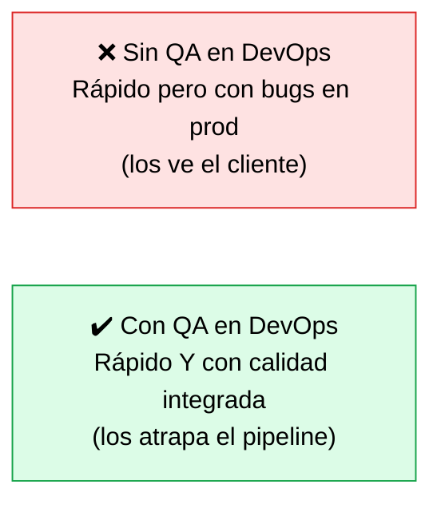
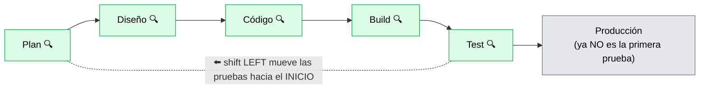
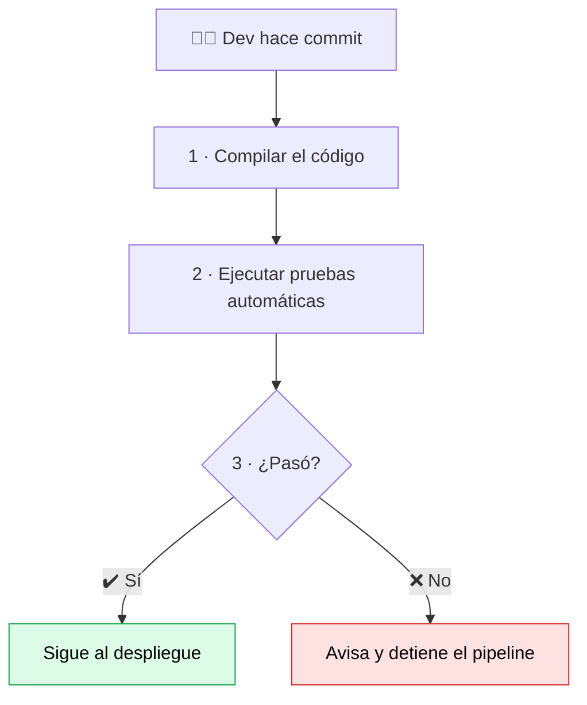

# QA y DevOps

> [!abstract] 📄 ¿De qué trata esta nota?
> Aquí se **encuentran los dos cursos**: el de DevOps y el de QA. La pregunta es: si DevOps busca entregar software **muy rápido**, ¿cómo evitamos que esa velocidad llene de errores el producto? La respuesta es integrar la calidad **dentro** del proceso DevOps. Esta nota explica tres ideas que lo hacen posible: las **pruebas continuas** (automáticas en cada cambio), el **shift left** (probar desde el inicio) y la **Integración Continua (CI)**. Verás qué es un **pipeline CI/CD** y por qué combinar "Agile QA" con DevOps da lo mejor de ambos mundos: rapidez **y** calidad.

---

## 🎯 Idea central

> Integrar QA con DevOps logra **velocidad y calidad a la vez**. Las claves: **pruebas continuas** automáticas dentro de los pipelines **CI/CD**, y el **shift left testing** (construir la calidad desde el inicio, no inspeccionarla al final).

---

## 📖 Glosario de términos clave

> [!note] Pipeline CI/CD
> **Definición técnica:** secuencia automatizada que lleva el código desde que se escribe hasta que se despliega, pasando por pasos de compilación, prueba y entrega.
> **En palabras simples:** una **cinta transportadora automática** para el software. El desarrollador "sube" su código y la cinta lo compila, lo prueba y lo entrega sin intervención manual. Si algo falla en el camino, la cinta se detiene y avisa.

> [!note] CI (Continuous Integration / Integración Continua)
> **Definición técnica:** práctica de integrar el código de todos los desarrolladores en un repositorio compartido **muy seguido** (varias veces al día), disparando compilación y pruebas automáticas en cada integración.
> **En palabras simples:** en vez de juntar el trabajo de todos al final (y que sea un caos), cada quien **mezcla su código a diario**, y un robot verifica al instante que todo siga funcionando.

> [!note] CD (Continuous Delivery / Entrega Continua)
> **Definición técnica:** extensión de CI donde el software, tras pasar las pruebas, queda **listo para desplegarse** a producción en cualquier momento (a veces de forma automática: *Continuous Deployment*).
> **En palabras simples:** no solo se prueba automáticamente, sino que queda **empaquetado y listo para entregar** apenas se quiera. La "C" final lleva el código hasta la puerta del usuario.

> [!note] Pruebas continuas (Continuous Testing)
> **Definición:** ejecutar pruebas **automatizadas de forma constante** dentro del pipeline (en cada commit, build o despliegue) para detectar defectos lo antes posible.

> [!note] Shift left testing
> **Definición técnica:** mover (*shift*) las actividades de prueba hacia la **izquierda** (el inicio) del ciclo de desarrollo.
> **En palabras simples:** probar **desde el primer día** en vez de esperar al final. Cuanto antes encuentras un error, más barato es arreglarlo.

> [!note] Commit
> **Definición:** "guardar" un cambio de código en el repositorio. En CI, **cada commit** puede disparar las pruebas automáticas.

---

## 1. El problema que resuelve: velocidad vs. calidad

DevOps entrega rápido. Pero "rápido y con errores" es peor que lento. La solución no es frenar, sino **automatizar la calidad** dentro del flujo:

- QA se integra en **cada etapa** del ciclo para **evitar** errores, no solo para encontrarlos.
- DevOps **automatiza** la conversión del código en software desplegado, e incluye **pruebas automáticas obligatorias** en ese camino.

---

## 2. Shift left testing (probar desde el inicio)

> 🔍 QA está presente en **cada paso**, no solo al final.

Llevar las pruebas al inicio permite:
- **Detectar y corregir defectos temprano** (cuando son baratos).
- **Construir** calidad dentro del desarrollo, no inspeccionarla al final.
- Mejorar la **colaboración** Dev ↔ Tester desde el primer día.

> [!tip] 🌐 Dato de la web que vale oro
> Estudios de la industria muestran que **un defecto cuesta entre 10 y 100 veces más** corregirlo en producción que en las primeras fases. Por eso "shift left" no es solo teoría: ahorra muchísimo dinero. Equipos que lo aplican reducen los defectos en producción entre un 60 % y un 90 %.

---

## 3. Integración Continua (CI) paso a paso

Cada vez que un desarrollador hace un **commit**, el pipeline dispara automáticamente:

Esto permite:
- **Detectar errores rápidamente** (en minutos, no en días).
- Mantener el código **siempre en estado funcional**.
- Facilitar la **colaboración** del equipo (todos integran sobre una base que funciona).

> [!note] CI → CD
> La **CI** verifica que el código funciona. La **CD (entrega continua)** da el paso siguiente: dejarlo **listo para desplegar** en cualquier momento. Juntas forman el pipeline **CI/CD**.

---

## 4. Lo mejor de dos mundos: Agile QA + DevOps

| 🤝 Aporta Agile QA | ⚙️ Aporta DevOps |
|:--|:--|
| Colaboración | Automatización |
| Retroalimentación continua | Estabilidad operativa |
| Flexibilidad | Ciclos rápidos y confiables |

> [!tip] La síntesis
> **Agile QA** trae la **mentalidad** (colaborar, dar feedback, adaptarse). **DevOps** trae la **maquinaria** (automatización, pipelines, estabilidad). Juntos: software entregado **rápido, frecuente y confiable**.

---

## 🧠 Analogía para recordarlo todo

> Imagina una **fábrica de autos moderna**. DevOps es la **línea de ensamblaje automatizada** que produce coches a gran velocidad. Pero si no hubiera **inspecciones de calidad en cada estación** (QA integrado / pruebas continuas), saldrían coches rápidos... con frenos defectuosos. El **shift left** es poner inspectores **desde la primera pieza**, no solo al final de la línea cuando el coche ya está armado y el error es carísimo de corregir.

---

## ✅ Para repasar (autoevaluación)

- [ ] ¿Qué problema resuelve integrar QA con DevOps?
- [ ] ¿Qué es "shift left testing" y qué beneficio económico aporta?
- [ ] ¿Qué dispara automáticamente cada commit en CI? (los 3 pasos)
- [ ] Diferencia entre CI (Integración Continua) y CD (Entrega Continua).
- [ ] ¿Qué aporta cada lado en la combinación "Agile QA + DevOps"?
- [ ] Completa: un defecto en producción cuesta ___ veces más que en fases tempranas.

---

## 🔗 Enlaces relacionados

- [[Caracteristicas Escenciales para DEVOPS]] — los pipelines automatizados y la cultura DevOps.
- [[Integrating QA in Agile Workflows]] — el origen del "shift left" en las ceremonias.
- [[Foundations of test Automation]] — las pruebas que corren dentro del pipeline.
- [[Creando una estrategia de calidad Agile]] — dónde se documenta todo este proceso.

---
*Fuente original: [QA and DevOps – Coursera](https://www.coursera.org/learn/qa-process-optimization-agile-automated-testing/lecture/xhDRe/qa-and-devops). Datos de costo y shift-left ampliados con [GitLab: Shift left with CI](https://about.gitlab.com/topics/ci-cd/shift-left-devops/).*
