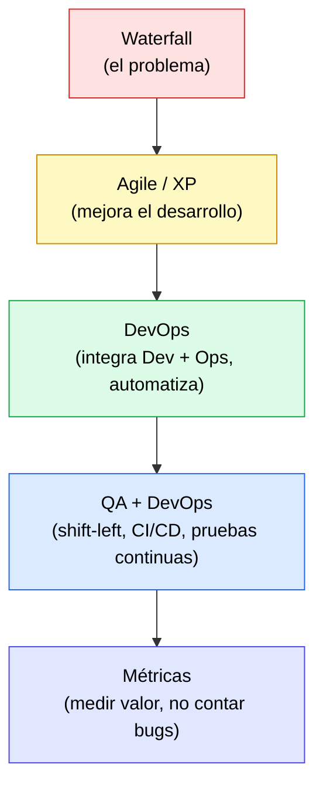

# 📚 Apuntes de DevOps y QA

Bóveda de notas de estudio (Obsidian) basadas en dos cursos de **Coursera**:

- **Introduction to DevOps** → carpeta [`DEVOPS/`](DEVOPS)
- **QA Process Optimization, Agile & Automated Testing** → carpeta [`QA/`](QA)

---

## 🗂️ Cómo se distribuyen las notas

Las notas se organizan por **curso → módulo → tema**. Cada archivo `.md` cubre **un solo concepto** y sigue una plantilla común de estudio, pensada para aprender en profundidad:

| Sección | Para qué sirve |
|:--|:--|
| **Frontmatter** (`---`) | Metadatos: curso, módulo, fecha, fuente y `tags` para buscar/filtrar. |
| 📄 **¿De qué trata esta nota?** | Resumen introductorio: te sitúa antes de leer. |
| 🎯 **Idea central** | Lo esencial en una o dos frases. |
| 📖 **Glosario de términos clave** | Cada palabra técnica con **definición formal + explicación simple** (para principiantes). |
| **Desarrollo** | Contenido a fondo, con **tablas comparativas y diagramas**. |
| 🧠 **Analogía para recordarlo todo** | Una comparación cotidiana que conecta los conceptos. |
| ✅ **Para repasar** | Preguntas de autoevaluación tipo examen (marca ✅ al responderlas). |
| 🔗 **Enlaces relacionados** | Conexiones `[[wiki-link]]` con otras notas (mapa de Obsidian). |

> 💡 **Sugerencia:** abre el *Graph View* de Obsidian para ver cómo se conectan los temas entre DevOps y QA.

> 🧭 **¿Vas a actualizar o añadir notas (tú o una IA)?** Lee primero [`_CONTEXTO.md`](_CONTEXTO.md): contiene la plantilla, las convenciones de estilo y el estado de cada nota, para no tener que re-analizar toda la bóveda.

---

## 🧭 Índice de contenidos

### 🚀 DEVOPS — Visión General
Orden de lectura recomendado (de lo histórico a lo actual):

1. [Modelo Waterfall y el camino hacia DevOps](Modelo%20WaterFall.md)
2. [XP, Agile y más allá](XP,%20Agile%20y%20más%20allá.md)
3. [Características esenciales de DevOps](Caracteristicas%20Escenciales%20para%20DEVOPS.md)

### ✅ QA — Optimización de procesos

**Módulo 1 · Mindset**
1. [Integrar QA en las ceremonias Agile](QA/1.-MindSet/Integrating%20QA%20in%20Agile%20Workflows.md)
2. [Criterios de aceptación y Definición de Hecho](QA/1.-MindSet/Criteria%20and%20Definition%20of%20Done.md)

**Módulo 2 · Estrategias de Testing Agile**
1. [Fundamentos de la automatización de pruebas](Foundations%20of%20test%20Automation.md)
2. [TDD y BDD](TDD%20AND%20BDD.md)
3. [Gestión de escenarios de prueba Agile](Agile%20Test%20Scenarios%20Management.md)

**Módulo 3 · Mejora del Proceso Agile**
1. [QA y DevOps](QA%20y%20DevOps.md)
2. [Creando una estrategia de calidad Agile](Creando%20una%20estrategia%20de%20calidad%20Agile.md)
3. [Métricas y KPIs para QA Agile](Métricas%20y%20KPIs%20para%20QA%20Agile.md)
4. [Optimización continua de QA](Optimización%20continua%20de%20QA.md)
5. [Cómo medir la calidad pragmáticamente](Cómo%20medir%20la%20calidad%20pragmáticamente.md)

---

## 🔗 Hilo conductor entre ambos cursos

DevOps explica **cómo se entrega** el software; QA explica **cómo se asegura su calidad** dentro de esa entrega. La nota [QA y DevOps](QA%20y%20DevOps.md) es el punto donde ambos cursos se encuentran.

---

## 📝 Convenciones

- **Idioma:** español (las fuentes originales están en inglés; los enlaces de cada nota apuntan a la lección de Coursera).
- **Fechas** en el frontmatter = día en que se tomó el apunte.
- Los `tags` permiten filtrar por concepto transversal (p. ej. `#automatizacion`, `#metricas`, `#agile`).
