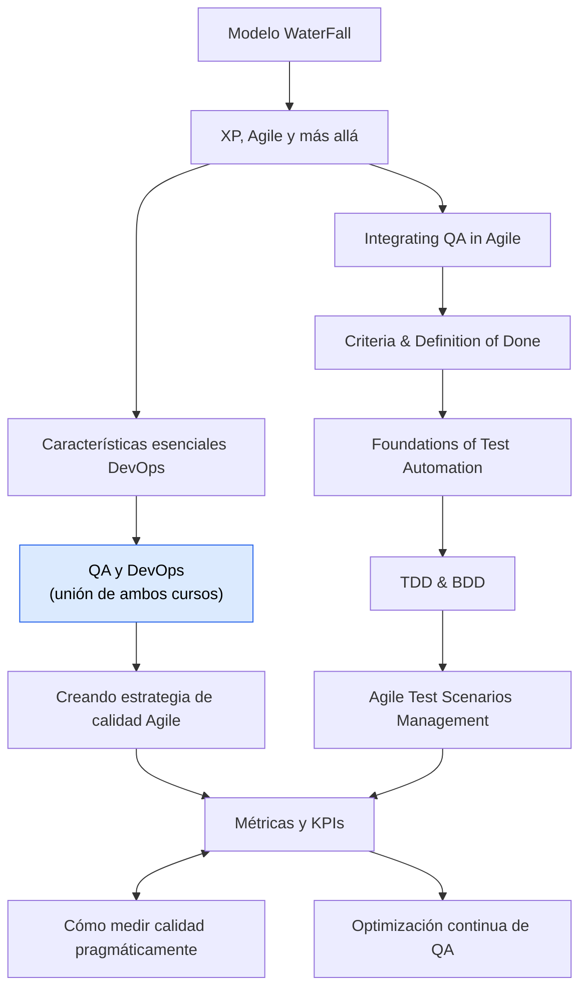

# 🧭 Documento de contexto (para futuras actualizaciones)

> [!important] Lee esto primero
> Este archivo existe para que **cualquier agente de IA (o tú)** pueda actualizar, ampliar o añadir notas **sin tener que volver a leer y analizar toda la bóveda**, ahorrando tiempo y tokens. Si vas a modificar estas notas, **empieza leyendo SOLO este archivo** y luego abre únicamente la(s) nota(s) que vas a tocar.

---

## 1. ¿Qué es esta bóveda?

Apuntes de estudio personales (bóveda de **Obsidian**) de un estudiante que **está aprendiendo** (no experto). Cubren dos cursos de Coursera:

- **Introduction to DevOps** → carpeta `DEVOPS/`
- **QA Process Optimization, Agile & Automated Testing** → carpeta `QA/`

Idioma: **español**. Las fuentes originales son lecciones de Coursera (enlazadas en cada nota).

---

## 2. Estructura de archivos (estado actual)

```
Notas/
├── README.md                ← índice general orientado al estudiante
├── _CONTEXTO.md             ← ESTE archivo (meta-documento para mantenimiento)
│
├── DEVOPS/
│   └── 1.-Vision General de DEVOPS/
│       ├── Modelo WaterFall.md                       (fecha apunte: 2026-06-23)
│       ├── XP, Agile y más allá.md                   (2026-06-24)
│       └── Caracteristicas Escenciales para DEVOPS.md (2026-06-23)
│
└── QA/
    ├── 1.-MindSet/
    │   ├── Integrating QA in Agile Workflows.md          (2026-06-19)
    │   └── Criteria and Definition of Done.md            (2026-06-17)
    ├── 2.-Agile Testsing Strategies and testing/
    │   ├── Foundations of test Automation.md             (2026-06-22)
    │   ├── TDD AND BDD.md                                (2026-06-22)
    │   └── Agile Test Scenarios Management.md            (2026-06-23)
    ├── 3.-Agile Process Improvment/
    │   ├── QA y DevOps.md                                (2026-06-24)
    │   ├── Creando una estrategia de calidad Agile.md    (2026-06-24)
    │   ├── Métricas y KPIs para QA Agile.md              (2026-06-24)
    │   ├── Optimización continua de QA.md                (2026-06-24)
    │   └── Cómo medir la calidad pragmáticamente.md      (2026-06-26, es LECTURA, no video)
    └── Open-Source QA Cypress, JMeter & xUnit Testing/   ← VACÍA: tercer curso por empezar (sin notas aún)
```

> [!note] El usuario reorganiza carpetas con frecuencia
> Las carpetas llevan prefijos numéricos (`1.-`, `2.-`, `3.-`) que el usuario ajusta. **Antes de escribir, verifica la ruta real** con un listado de directorios; no asumas la ruta de memoria. Las notas se enlazan por **wiki-link `[[nombre]]`**, que en Obsidian resuelve por nombre de archivo aunque cambie la carpeta — por eso mover carpetas no rompe los enlaces internos.

> [!note] Erratas conocidas en nombres de carpeta (NO corregidas a propósito)
> `2.-Agile Testsing Strategies` (debería ser "Testing") · `3.-Agile Process Improvment` (debería ser "Improvement") · `Caracteristicas Escenciales` (debería ser "Esenciales") · `MindSet`.
> Se mantienen **tal cual** para no romper referencias del `.obsidian/workspace.json`. Si el usuario pide corregirlas, hacerlo y actualizar los enlaces del README.

> [!note] Recursos Extras (PDFs)
> Existía una carpeta `Recursos Extras/` con PDFs del curso de QA (proyecto final, lecturas de métricas). El usuario la movió/eliminó durante la reorganización. Si reaparecen PDFs, son material de apoyo del estudiante, no notas a editar.

---

## 3. Historial de qué se ha hecho (para no repetir trabajo)

1. **Reestructuración inicial:** se renombraron archivos con nombre de fecha a nombres temáticos; se dividió un archivo gigante (`QA/3.../24-06-2026.md`, que mezclaba 4 lecciones) en 4 notas; se eliminaron restos de chat y duplicados; se creó el `README.md`.
2. **Ampliación profunda (estado actual):** cada una de las 13 notas se reescribió en formato de estudio extenso, con información ampliada desde la web. **Todas las notas ya están ampliadas y enriquecidas.**

---

## 4. PLANTILLA de cada nota (síguela al crear/editar)

Cada nota debe tener, en este orden:

```markdown
---
curso: <nombre del curso>
modulo: <módulo>
tema: <tema>
fecha: <YYYY-MM-DD del apunte>
fuente: <URL de Coursera>
tags: [lista, de, tags, en, minúsculas]
---

# Título

> [!abstract] 📄 ¿De qué trata esta nota?
> Resumen introductorio (4-8 líneas) que sitúa al estudiante: qué verá y por qué importa.

## 🎯 Idea central
> Una o dos frases con lo esencial.

## 📖 Glosario de términos clave
> [!note] Término
> **Definición técnica:** la formal.
> **En palabras simples:** versión para principiante + analogía si la definición es densa.
(varios términos, cada uno en su callout)

## Secciones de desarrollo (numeradas)
- Tablas comparativas, diagramas ASCII, callouts.
- Marcar info traída de la web como "🌐 Dato de la web".

## 🧠 Analogía para recordarlo todo
> Una analogía cotidiana que conecte todos los conceptos de la nota.

## ✅ Para repasar (autoevaluación)
- [ ] Preguntas tipo examen (6-7).

## 🔗 Enlaces relacionados
- [[wiki-links]] a otras notas con una frase de por qué.

---
*Fuente original: [...](url). Ampliado con [...](url).*
```

---

## 5. CONVENCIONES de estilo (importantes)

- **Público:** estudiante principiante. Explicar TODO término técnico; nunca asumir conocimiento previo.
- **Glosario obligatorio:** todo término técnico o de importancia va en el glosario con **definición técnica + interpretación simple**. Usar analogías cuando la definición sea densa.
- **Diagramas: usar SIEMPRE Mermaid** dentro de bloques ` ```mermaid ` (Obsidian los renderiza nativo y se ven estéticos). **No usar arte ASCII.** Tipos recomendados:
  - `flowchart TD/LR` → flujos, procesos, jerarquías, líneas de tiempo, pipelines (el más usado).
  - `stateDiagram-v2` → ciclos con estados (p. ej. rojo-verde-refactor).
  - `quadrantChart` → matrices de 2x2 (p. ej. riesgo × impacto).
  - `timeline` → líneas de tiempo cronológicas.
  - `pie` → proporciones.
  - **Reglas de sintaxis para evitar errores de render:** envolver SIEMPRE el texto de los nodos entre comillas dobles `["texto"]` (los acentos, paréntesis, `¿?`, `/`, `:` rompen Mermaid si no van entre comillas). Mantener los IDs de nodo simples (A, B, C…). Para "pirámides" (no existen en Mermaid) usar `flowchart TD` con los niveles apilados y etiquetas de coste/cantidad.
  - Se pueden usar `subgraph` y `classDef`/`style` para dar color y agrupar.
  - **Única excepción:** los **árboles de directorios/archivos** (como el de la sección 2) se dejan como texto ASCII en un bloque de código normal — Mermaid no representa bien un listado de carpetas.
  - **Paleta de colores usada en las notas** (para mantener consistencia): rojo `#fee2e2/#dc2626` = problema/error; verde `#dcfce7/#16a34a` = correcto/bueno; amarillo `#fef9c3/#ca8a04` = intermedio/atención; azul `#dbeafe/#2563eb` = neutro/proceso; índigo `#e0e7ff/#4f46e5` = nodo raíz/título.
- **Callouts de Obsidian** (`> [!tipo]`): usar `abstract` (resumen), `note` (glosario/datos), `tip` (claves), `warning`/`fail` (errores comunes), `example` (ejemplos), `check` (sí hacer). Son compatibles con Obsidian.
- **Tablas** para comparaciones (muy usadas: X vs Y).
- **Wiki-links** `[[Nombre exacto del archivo sin .md]]` para conectar notas. Mantener el grafo de Obsidian rico.
- **Enriquecimiento web:** al ampliar, buscar en la web y **citar la fuente** al pie. Marcar los datos externos para distinguirlos del contenido del curso.
- **Emojis** moderados en encabezados para escaneabilidad (🎯 📖 🧠 ✅ 🔗 ⚠️).
- **No inventar** datos del curso: si algo no estaba en el apunte original y se añade desde la web, dejarlo claro.

---

## 6. Mapa conceptual: cómo se conectan las notas



**Hilo conductor global:** Waterfall (problema) → Agile/XP → DevOps → QA+DevOps (shift-left, CI/CD) → Métricas (medir valor, no bugs).

---

## 7. Cómo AÑADIR una nota nueva (checklist)

1. Identifica curso/módulo → carpeta correcta.
2. Crea el `.md` con la **plantilla** de la sección 4.
3. Si es de un video/lectura de Coursera, pon la URL en `fuente`.
4. Investiga el tema en la web para enriquecer; cita fuentes al pie.
5. Añade **wiki-links** entrantes y salientes (edita también las notas relacionadas para que enlacen a la nueva).
6. Actualiza el **`README.md`** (índice) con la nueva entrada.
7. Actualiza la sección 2 y 6 de **este archivo** (`_CONTEXTO.md`).
8. (Opcional) Si el usuario lo pide, hacer commit de git; el repo está en `master`.

---

## 8. Notas operativas

- **Git:** repositorio en rama `master`. El usuario decide cuándo commitear (no commitear sin que lo pida).
- **Obsidian:** `.obsidian/` contiene la config del vault; no tocar salvo petición explícita.
- **Tono del usuario:** quiere notas **largas y profundas**, no resúmenes. Si duda entre más o menos detalle, **elegir más** (siempre que sea correcto y claro).
